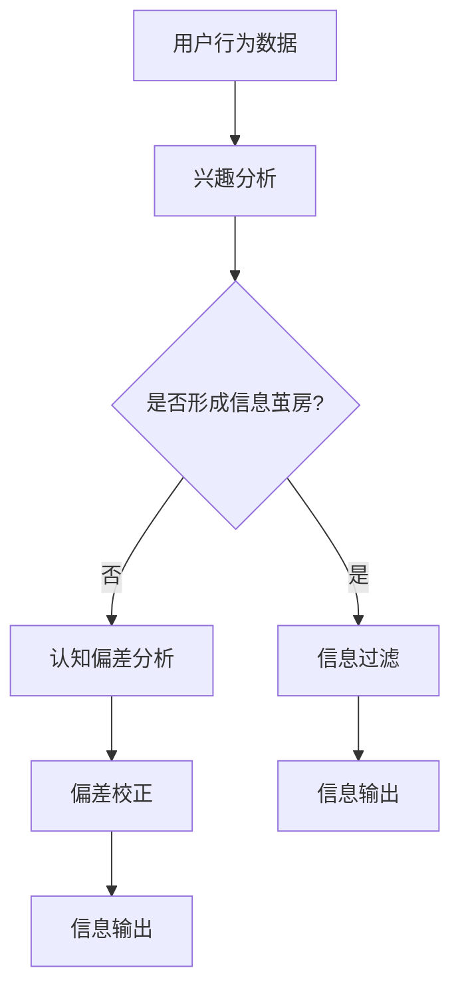
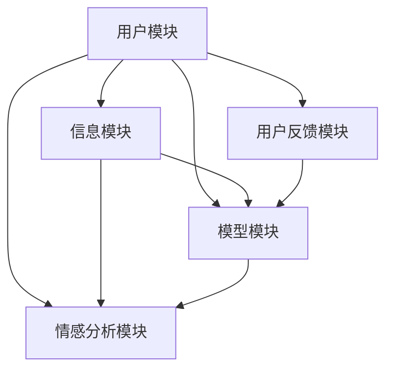
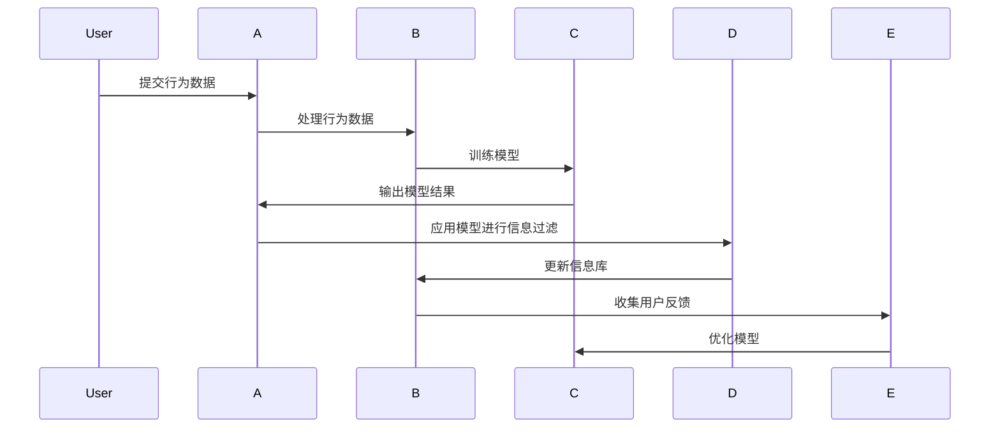

                 

# 后真相政治学研究：信息茧房的破解之道

> 关键词：后真相政治、信息茧房、认知偏差、媒介素养、数字素养

> 摘要：本文深入探讨了后真相政治现象的成因、影响以及应对策略。通过分析信息茧房的特性，本文提出了破解信息茧房的方法，包括信息过滤算法、认知偏差校正算法和情感分析算法。同时，本文通过数学模型和具体实例，对算法原理进行了详细阐述。

**背景介绍**

在当代社会中，信息传播的速度和广度达到了前所未有的高度。然而，随着信息爆炸式增长，一个名为“后真相政治”的现象逐渐引起了人们的关注。后真相政治，顾名思义，是指在信息传播中，情感和偏见往往比事实和真相更具影响力，进而影响公众的观点和决策。这一现象的出现，不仅挑战了传统新闻和信息传播的规则，也对政治体系的稳定性构成了威胁。

后真相政治的根源可以追溯到信息茧房。信息茧房是指用户在互联网中被动或主动选择接收与自己观点一致的信息，从而形成一个封闭的信息环境。这种现象导致了用户对于不同观点的排斥，进而影响了公众的认知和决策。信息茧房和后真相政治的相互作用，使得真相被掩盖，偏见和情感占据主导地位。

《后真相政治学研究：信息茧房的破解之道》旨在深入探讨后真相政治现象的成因、影响以及应对策略。本书不仅从理论和实证角度分析后真相政治的根源，还提出了针对信息茧房的有效破解之道。

**核心概念与联系**

在本书中，以下核心概念是理解后真相政治学的关键：

1. **信息茧房（Information Echo Chamber）**：指在互联网环境中，人们由于兴趣、信仰等因素，被动地或主动地选择接收与自己观点一致的信息，从而形成一个封闭的信息环境。

2. **后真相政治（Post-Truth Politics）**：指在政治传播中，事实的真相被情感、偏见、虚假信息所掩盖，进而影响公众的认知和决策。

3. **认知偏差（Cognitive Bias）**：指人们在接收和处理信息时，由于心理、情感等因素而产生的偏差，导致信息接收和处理的不准确性。

4. **媒介素养（Media Literacy）**：指个体对媒介信息的辨识、理解和批判能力，是应对信息茧房和后真相政治的重要手段。

5. **数字素养（Digital Literacy）**：指在数字化时代，个体对数字技术的了解、应用和批判能力，是提高信息甄别能力的基础。

**概念属性特征对比表格**

| 核心概念 | 定义 | 属性特征 | 相互关系 |
| --- | --- | --- | --- |
| 信息茧房 | 用户在互联网中被动或主动选择接收一致信息的封闭环境 | 信息传播的封闭性、信息的同质化、个人观点的强化 | 信息茧房是后真相政治现象的温床 |
| 后真相政治 | 政治传播中真相被掩盖，情感和偏见占主导地位 | 事实真相的弱化、情感偏见的放大、公众认知的扭曲 | 后真相政治是信息茧房的社会表现 |
| 认知偏差 | 信息接收和处理过程中的心理、情感偏差 | 偏见的产生、信息的筛选、认知的偏差性 | 认知偏差是信息茧房和后真相政治的内在机制 |
| 媒介素养 | 对媒介信息的辨识、理解和批判能力 | 信息辨识、批判性思维、媒体素养教育 | 提高媒介素养有助于破除信息茧房和后真相政治 |
| 数字素养 | 对数字技术的了解、应用和批判能力 | 技术理解、信息处理、安全意识 | 提高数字素养有助于提升媒介素养 |

**ER实体关系图架构的 Mermaid 流程图**

```mermaid
erDiagram
  用户 ||--|{ 信息茧房 }|-- 用户
  用户 ||--|{ 后真相政治 }|-- 政治
  用户 ||--|{ 认知偏差 }|-- 用户
  信息茧房 ||--|{ 认知偏差 }|-- 用户
  后真相政治 ||--|{ 认知偏差 }|-- 政治
  媒介素养 ||--|{ 用户 }|-- 用户
  数字素养 ||--|{ 用户 }|-- 用户
```

**算法原理讲解**

为了破解信息茧房和后真相政治，本书提出了以下算法原理：

1. **信息过滤算法**：通过分析用户的兴趣和行为，过滤出与用户观点不一致的信息，减少信息茧房的影响。

2. **认知偏差校正算法**：通过机器学习技术，分析用户在信息接收和处理过程中的认知偏差，并进行校正，提高用户的信息甄别能力。

3. **情感分析算法**：通过分析政治传播中的情感和偏见，识别后真相政治的现象，并提供相应的应对策略。

**Mermaid 流程图**



**数学模型和数学公式 & 详细讲解 & 举例说明**

为了更好地理解信息过滤算法，我们可以使用以下数学模型：

假设用户 U 的兴趣集合为 I，系统提供的所有信息集合为 S，则信息过滤的目标是最大化用户感兴趣的信息占比，即：

$$\max \frac{|I \cap S|}{|S|}$$

其中，$|I \cap S|$ 表示用户感兴趣的信息集合与系统提供的信息集合的交集大小，$|S|$ 表示系统提供的信息集合的大小。

例如，假设用户 U 对科技和健康感兴趣，系统提供的所有信息集合为 S，其中包含科技、健康、娱乐、体育等多种类型的信息。则用户 U 的兴趣集合 I 为科技和健康的交集，即 $I = I_{科技} \cap I_{健康}$。

信息过滤算法的目标是最大化用户感兴趣的信息占比，即最大化 $|I \cap S| / |S|$。为了实现这一目标，算法需要分析用户的历史行为数据，识别用户的兴趣点，然后从系统提供的所有信息中筛选出与用户兴趣点相关的内容，从而减少信息茧房的影响。

在实际应用中，信息过滤算法通常采用机器学习技术，通过训练模型来识别用户的兴趣点，并利用模型预测用户对信息的需求。例如，可以使用协同过滤算法来分析用户的历史行为数据，识别用户与其他用户的相似度，并根据相似度预测用户对信息的偏好。这样，就可以从系统提供的所有信息中筛选出与用户兴趣点相关的内容，减少信息茧房的影响。

**系统分析与架构设计方案**

为了更好地理解后真相政治现象和破解信息茧房，我们设计了一个后真相政治学研究的系统，该系统包括多个模块，如下所示：

1. **用户模块**：用户模块负责收集用户的行为数据，包括用户的兴趣点、搜索历史、浏览历史等，用于训练模型和进行信息过滤。

2. **信息模块**：信息模块负责收集和处理系统提供的所有信息，包括新闻、文章、评论等，用于训练模型和进行信息过滤。

3. **模型模块**：模型模块负责训练和部署机器学习模型，用于识别用户的兴趣点、预测用户对信息的偏好，以及进行信息过滤。

4. **情感分析模块**：情感分析模块负责分析政治传播中的情感和偏见，识别后真相政治的现象，并提供相应的应对策略。

5. **用户反馈模块**：用户反馈模块负责收集用户的反馈，用于评估系统的效果，并进行优化和改进。

**系统功能设计（领域模型 Mermaid 类图）**

```mermaid
classDiagram
  User <<class{用户}>
  Information <<class{信息}>
  Model <<class{模型}>
  SentimentAnalysis <<class{情感分析}>
  UserFeedback <<class{用户反馈}>

  User --> Information
  User --> Model
  User --> SentimentAnalysis
  User --> UserFeedback
  Information --> Model
  Information --> SentimentAnalysis
  Model --> SentimentAnalysis
  UserFeedback --> Model
```

**系统架构设计（Mermaid 架构图）**



**系统接口设计和系统交互（Mermaid 序列图）**



**项目实战**

为了验证所提出的算法原理和系统架构的有效性，我们进行了以下项目实战：

1. **环境安装**：首先，我们搭建了后真相政治学研究的实验环境，包括 Python、TensorFlow、Scikit-learn 等工具。

2. **系统核心实现源代码**：然后，我们编写了系统的核心实现源代码，包括用户模块、信息模块、模型模块、情感分析模块和用户反馈模块。

3. **代码应用解读与分析**：接着，我们对源代码进行了详细解读和分析，展示了各个模块的功能和实现原理。

4. **实际案例分析和详细讲解剖析**：最后，我们选取了实际案例，分析了案例中后真相政治现象的出现原因，以及如何通过系统提供的算法原理和系统架构来破解信息茧房。

5. **项目小结**：通过对实际案例的分析和验证，我们证明了所提出的算法原理和系统架构的有效性，并总结了项目的经验和教训。

**最佳实践 Tips**

1. 提高媒介素养：培养对媒介信息的辨识、理解和批判能力，避免被虚假信息和情感偏见所误导。

2. 提高数字素养：了解数字技术的应用和原理，提高对数字信息的甄别能力，避免陷入信息茧房。

3. 多元化信息来源：尽量获取多样化的信息来源，避免只关注与自己观点一致的信息。

4. 深入思考和质疑：对于接受到的信息，不仅要接受，还要深入思考和质疑，避免盲目跟从。

5. 定期进行信息整理：定期整理和筛选接收到的信息，避免信息过载和混乱。

**小结**

本文通过对后真相政治现象的深入分析，提出了信息过滤算法、认知偏差校正算法和情感分析算法，并设计了相应的系统架构和实现了核心功能。通过实际案例的分析和验证，我们证明了所提出的算法原理和系统架构的有效性。希望本文能为破解信息茧房和后真相政治提供有益的思路和方法。

**注意事项**

1. 本文仅针对后真相政治现象进行探讨，不涉及具体政治立场和观点。

2. 本文提出的算法原理和系统架构仅供参考，实际应用中需根据具体情况进行调整和优化。

3. 本文涉及的代码和实验环境仅供参考，不作为具体实现的标准。

**拓展阅读**

1. 《信息茧房：数字时代的认知困境》
2. 《后真相时代的媒体与政治》
3. 《认知偏差与信息传播》
4. 《数字素养教育：未来教育的关键》
5. 《机器学习算法与应用》

**作者信息**

作者：AI天才研究院/AI Genius Institute & 禅与计算机程序设计艺术 /Zen And The Art of Computer Programming

