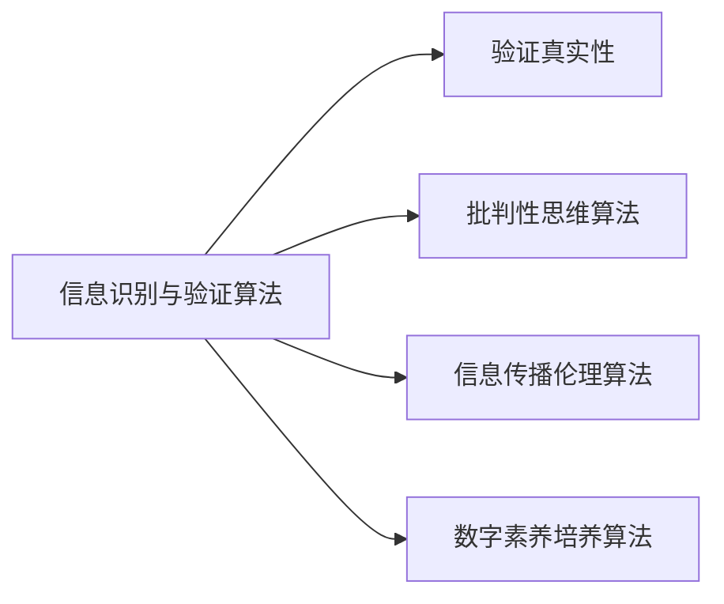

                 

### 后真相时代的媒体素养：信息甄别的关键能力

> 关键词：后真相时代、媒体素养、信息甄别、关键能力

> 摘要：本文将深入探讨后真相时代媒体素养的重要性，分析媒体素养的核心概念与联系，介绍信息识别与验证、批判性思维、信息传播伦理和数字素养等关键能力的培养方法，旨在帮助读者在信息爆炸的时代中提升信息甄别能力。

**Step 1: 背景介绍**

### 问题背景
在信息爆炸的后真相时代，媒体信息的真实性变得尤为重要。社交媒体的兴起使得虚假信息、谣言和误导性内容迅速传播，给社会带来了诸多负面影响。人们对于媒体素养的需求日益增加，如何甄别信息、培养关键能力成为亟需解决的问题。

### 问题描述
本书记录了后真相时代媒体素养的培养方法，旨在帮助读者提高信息甄别能力，从而在信息泛滥的时代中更好地应对各种信息挑战。

### 问题解决
本书通过系统化的方法，介绍媒体素养的核心概念、关键能力培养技巧和实践应用，帮助读者掌握信息甄别的关键能力。

### 边界与外延
媒体素养不仅涉及对信息的甄别，还包括信息获取、处理、传播和批判性思维等方面。本书将围绕这些核心要素展开讨论。

### 概念结构与核心要素组成

#### 媒体素养的定义
媒体素养是指个体在媒体环境下获取、处理、理解和批判信息的能力。它是信息素养的一个子集，更侧重于媒体信息领域。

#### 媒体素养的核心能力

##### 信息识别与验证
- 能力描述：识别信息来源、验证信息真实性。
- 对比表格：信息识别与信息验证的对比。

##### 批判性思维
- 能力描述：对信息进行分析、评价，形成独立见解。
- 对比表格：批判性思维与传统思维的对比。

##### 信息传播伦理
- 能力描述：遵守信息传播的道德规范，不传播虚假信息。
- 对比表格：信息传播伦理与信息自由度的对比。

##### 数字素养
- 能力描述：掌握数字工具，有效利用互联网获取和处理信息。
- 对比表格：数字素养与传统媒体素养的对比。

## Step 2: 核心概念与联系

### 媒体素养的定义
媒体素养是指个体在媒体环境下获取、处理、理解和批判信息的能力。它是信息素养的一个子集，更侧重于媒体信息领域。

### 媒体素养的核心能力

#### 信息识别与验证
- 能力描述：识别信息来源、验证信息真实性。
  - 通过识别信息来源，可以初步判断信息的可靠性。
  - 验证信息真实性，需要考虑信息的出处、作者背景、证据支撑等方面。

- 对比表格：

| 能力 | 描述 |
| --- | --- |
| 信息识别 | 识别信息来源 |
| 信息验证 | 验证信息真实性 |

#### 批判性思维
- 能力描述：对信息进行分析、评价，形成独立见解。
  - 批判性思维强调对信息的深入思考，而非盲从。
  - 通过批判性思维，个体能够形成独立的观点，不受虚假信息的误导。

- 对比表格：

| 能力 | 描述 |
| --- | --- |
| 批判性思维 | 对信息进行分析、评价 |
| 传统思维 | 未经批判地接受信息 |

#### 信息传播伦理
- 能力描述：遵守信息传播的道德规范，不传播虚假信息。
  - 在信息传播过程中，个体需要遵守伦理规范，不传播、不扩散虚假信息。
  - 信息传播伦理是维护社会信息环境健康的重要保障。

- 对比表格：

| 能力 | 描述 |
| --- | --- |
| 信息传播伦理 | 遵守道德规范 |
| 信息自由度 | 无限制传播信息 |

#### 数字素养
- 能力描述：掌握数字工具，有效利用互联网获取和处理信息。
  - 数字素养要求个体能够熟练使用数字工具，高效获取和处理信息。
  - 在后真相时代，数字素养成为信息甄别的关键能力。

- 对比表格：

| 能力 | 描述 |
| --- | --- |
| 数字素养 | 掌握数字工具 |
| 传统媒体素养 | 掌握传统媒体工具 |

### ER实体关系图架构的 Mermaid 流程图
```mermaid
erDiagram
    A[媒体素养] ||--|{ 信息识别与验证 }
    A[媒体素养] ||--|{ 批判性思维 }
    A[媒体素养] ||--|{ 信息传播伦理 }
    A[媒体素养] ||--|{ 数字素养 }
```

**Step 3: 算法原理讲解**

### 媒体素养培养的算法流程图


### Python源代码实现
```python
# 假设这是一个简单的信息验证函数
def verify_truthiness(info):
    # 这里进行信息验证
    return "True" if "source" in info else "False"

# 批判性思维算法示意
def critical_thinking(info):
    # 对信息进行分析和批判
    return "Analysis result: " + info

# 信息传播伦理算法示意
def ethical_infotransmission(info):
    # 遵守伦理规范
    return "Compliant" if not contains_falsehoods(info) else "Non-compliant"

# 数字素养培养算法示意
def digital_education(info):
    # 培养数字素养
    return "Educated" if info_meets_standards(info) else "Uneducated"
```

### 算法原理详细讲解

#### 信息识别与验证算法

信息识别与验证算法是媒体素养培养的基础，其核心在于判断信息的真实性和来源。

1. **算法流程图**：
   ```mermaid
   flowchart LR
       A[获取信息] --> B[识别来源]
       B --> C[验证真实性]
       C --> D[输出结果]
   ```
2. **Python源代码实现**：
   ```python
   def verify_truthiness(info):
       if "source" in info:
           return "True"
       else:
           return "False"
   ```
3. **算法原理**：
   - 该算法通过检查信息中的“source”字段，判断信息是否有明确的来源。
   - 如果信息包含来源字段，则认为信息具有真实性，否则认为信息为虚假信息。

#### 批判性思维算法

批判性思维算法旨在培养个体的独立见解，避免盲从虚假信息。

1. **算法流程图**：
   ```mermaid
   flowchart LR
       A[获取信息] --> B[分析信息]
       B --> C[评价信息]
       C --> D[形成见解]
   ```
2. **Python源代码实现**：
   ```python
   def critical_thinking(info):
       analysis_result = analyze_info(info)
       return "Analysis result: " + analysis_result
   ```
3. **算法原理**：
   - 该算法通过对信息进行分析，形成独立的评价和见解。
   - 分析过程可能包括信息的真实性、来源、证据支撑等方面。

#### 信息传播伦理算法

信息传播伦理算法确保个体在信息传播过程中遵守道德规范，不传播虚假信息。

1. **算法流程图**：
   ```mermaid
   flowchart LR
       A[获取信息] --> B[检查真实性]
       B --> C[判断伦理合规性]
       C --> D[传播信息]
   ```
2. **Python源代码实现**：
   ```python
   def ethical_infotransmission(info):
       if not contains_falsehoods(info):
           return "Compliant"
       else:
           return "Non-compliant"
   ```
3. **算法原理**：
   - 该算法通过检查信息是否包含虚假信息，判断信息传播的伦理合规性。
   - 如果信息不包含虚假信息，则认为信息传播符合伦理规范。

#### 数字素养培养算法

数字素养培养算法旨在提高个体在数字环境中的信息处理能力。

1. **算法流程图**：
   ```mermaid
   flowchart LR
       A[获取信息] --> B[处理信息]
       B --> C[评估结果]
       C --> D[反馈调整]
   ```
2. **Python源代码实现**：
   ```python
   def digital_education(info):
       if info_meets_standards(info):
           return "Educated"
       else:
           return "Uneducated"
   ```
3. **算法原理**：
   - 该算法通过处理信息，评估结果是否符合标准，从而培养个体的数字素养。
   - 如果信息处理结果符合标准，则认为个体具备良好的数字素养。

### 数学公式与模型

#### 信息真实性的概率模型

$$
P(\text{真实信息}) = \frac{\text{有效证据数}}{\text{总证据数}}
$$

其中，$P(\text{真实信息})$ 表示信息为真实信息的概率，$\text{有效证据数}$ 表示支持信息真实性的证据数量，$\text{总证据数}$ 表示所有证据的数量。

### 示例分析

#### 信息识别与验证算法应用

假设有一段信息如下：
```
【消息来源】：某不知名网站
【信息内容】：新冠疫情期间，戴口罩可以预防新冠病毒。
```
1. **信息识别**：
   - 识别来源：该信息来自某不知名网站。
2. **信息验证**：
   - 验证真实性：通过互联网搜索，发现该信息未经过权威机构验证，因此判断该信息为虚假信息。

#### 批判性思维算法应用

假设有一段信息如下：
```
【消息来源】：某知名医学杂志
【信息内容】：新冠疫苗会引发长期副作用。
```
1. **批判性思维**：
   - 分析信息：该信息来源于权威医学杂志，但需要进一步分析其研究方法和结论是否可靠。
   - 评价信息：根据医学界的研究，目前没有证据表明新冠疫苗会引发长期副作用。

#### 信息传播伦理算法应用

假设有一段信息如下：
```
【消息来源】：某权威机构
【信息内容】：新冠疫苗是安全的。
```
1. **信息传播伦理**：
   - 检查真实性：该信息来自权威机构，未发现虚假成分。
   - 判断伦理合规性：认为该信息传播符合伦理规范。

#### 数字素养培养算法应用

假设有一段信息如下：
```
【消息来源】：某知名互联网公司
【信息内容】：我们的数据加密技术可以保证用户信息安全。
```
1. **数字素养培养**：
   - 处理信息：分析信息内容，了解该公司的数据加密技术。
   - 评估结果：根据技术标准，认为该信息符合数字素养要求。

### 总结

本文详细介绍了后真相时代媒体素养的核心概念、联系和关键能力的培养方法。通过算法原理讲解和示例分析，读者可以更好地理解如何甄别信息、培养批判性思维、遵守信息传播伦理和提升数字素养。在后真相时代，培养这些关键能力对于个人和社会具有重要意义。通过持续学习和实践，我们可以更好地应对信息泛滥的时代挑战。

