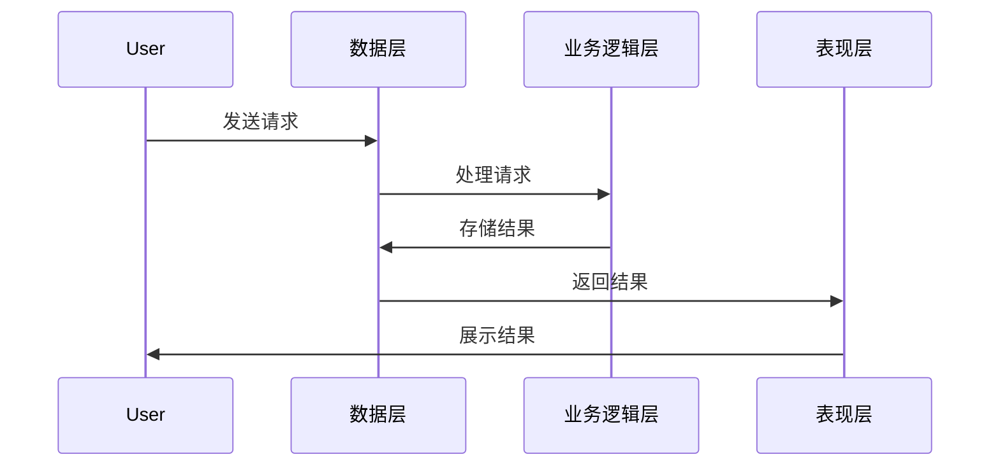
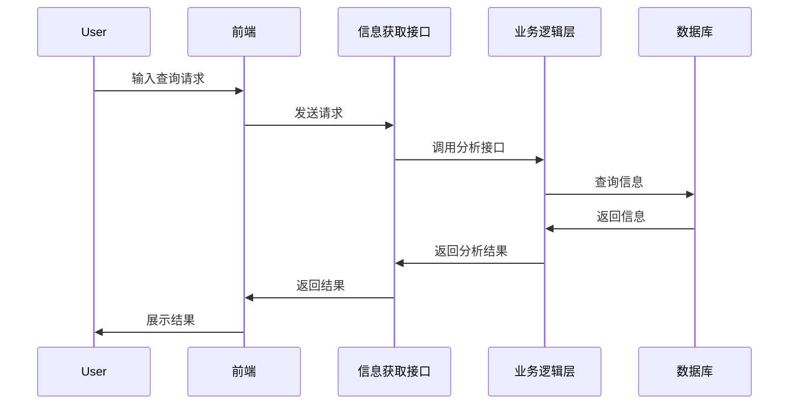

                 


# 后真相时代的媒体素养：信息真实性判断能力培养

> 关键词：后真相时代、媒体素养、信息真实性、判断能力、培养

> 摘要：本文深入探讨了后真相时代的背景，阐述了媒体素养的重要性，分析了信息真实性的概念和判断方法，并通过案例分析，提出了培养信息真实性判断能力的策略。文章旨在帮助读者提升在信息爆炸时代甄别真实信息的能力。

### 目录

1. **背景介绍**
   1.1 问题背景
       1.1.1 后真相时代的定义
       1.1.2 后真相时代对媒体素养的挑战
       1.1.3 信息真实性判断能力的重要性
   1.2 核心概念
       1.2.1 媒体素养的概念
       1.2.2 信息真实性的概念
       1.2.3 判断信息真实性的方法
   1.3 边界与外延
       1.3.1 媒体素养的范畴
       1.3.2 信息真实性的边界
       1.3.3 判断信息真实性的原则
   1.4 概念结构与核心要素
       1.4.1 媒体素养的组成
       1.4.2 信息真实性判断的要素
       1.4.3 培养信息真实性判断能力的方法
   1.5 本章小结

2. **核心概念与联系**
   2.1 媒体素养的原理
       2.1.1 媒体素养的基本原理
       2.1.2 媒体素养的属性特征对比表格
       2.1.3 媒体素养的ER实体关系图
   2.2 信息真实性的原理
       2.2.1 信息真实性的基本原理
       2.2.2 信息真实性的属性特征对比表格
       2.2.3 信息真实性的ER实体关系图
   2.3 媒体素养与信息真实性的联系
       2.3.1 媒体素养与信息真实性的关系
       2.3.2 媒体素养在信息真实性判断中的应用
       2.3.3 信息真实性在媒体素养教育中的作用
   2.4 本章小结

3. **信息真实性判断方法**
   3.1 信息真实性判断的基本方法
       3.1.1 审查法
       3.1.2 对比法
       3.1.3 调查法
   3.2 高级信息真实性判断方法
       3.2.1 机器学习方法
       3.2.2 数据挖掘方法
       3.2.3 信息可视化方法
   3.3 媒体素养视角下的信息真实性判断方法
       3.3.1 媒体素养对信息真实性判断的影响
       3.3.2 信息真实性判断的媒体素养框架
       3.3.3 媒体素养在信息真实性判断中的应用案例
   3.4 本章小结

4. **案例分析**
   4.1 案例一：社交媒体中的虚假信息
       4.1.1 案例背景
       4.1.2 案例分析
       4.1.3 案例启示
   4.2 案例二：新闻报道中的事实核查
       4.2.1 案例背景
       4.2.2 案例分析
       4.2.3 案例启示
   4.3 案例三：新闻编辑中的信息筛选
       4.3.1 案例背景
       4.3.2 案例分析
       4.3.3 案例启示
   4.4 本章小结

5. **实践技巧**
   5.1 培养信息真实性判断能力的方法
       5.1.1 教育方法
       5.1.2 训练方法
       5.1.3 实践活动
   5.2 媒体素养教育实践案例分析
       5.2.1 案例一：某大学媒体素养课程设计
       5.2.2 案例二：某中小学信息真实性教育项目
       5.2.3 案例三：某社区媒体素养公益活动
   5.3 媒体素养与信息真实性判断能力培养的挑战与机遇
       5.3.1 挑战分析
       5.3.2 机遇分析
       5.3.3 应对策略
   5.4 本章小结

6. **系统分析与架构设计**
   6.1 问题场景介绍
       6.1.1 后真相时代媒体素养教育的需求
   6.2 项目介绍
       6.2.1 项目目标
       6.2.2 项目功能
   6.3 系统功能设计
       6.3.1 领域模型
   6.4 系统架构设计
       6.4.1 系统架构
   6.5 系统接口设计
       6.5.1 接口定义
   6.6 系统交互
       6.6.1 系统交互流程
   6.7 本章小结

7. **项目实战**
   7.1 环境安装
       7.1.1 开发环境搭建
       7.1.2 所需工具安装
   7.2 系统核心实现
       7.2.1 源代码解读
       7.2.2 代码应用分析
   7.3 实际案例分析
       7.3.1 案例背景
       7.3.2 案例分析
       7.3.3 剖析与讨论
   7.4 项目小结
   7.5 最佳实践 tips
   7.6 小结
   7.7 注意事项
   7.8 拓展阅读

### 1. 背景介绍

在互联网和社交媒体迅猛发展的今天，我们进入了后真相时代。这个时代的特点是，信息传播速度极快，真假难辨，公众往往在信息还未被核实的情况下就被引导形成某种观点。这种现象对媒体素养提出了前所未有的挑战。媒体素养不仅仅是了解如何使用媒体，更重要的是具备识别信息真实性的能力，以及独立思考、批判性分析的能力。

#### 1.1 问题背景

**后真相时代的定义**：后真相时代（Post-Truth Era）是指一个信息泛滥但真相模糊的时代，事实的真相被情感、个人立场和政治动机所取代。在这个时代，虚假信息、谣言和偏见比以往任何时候都更加猖獗，公众往往被误导，无法准确了解事实。

**后真相时代对媒体素养的挑战**：随着虚假信息的泛滥，公众对于媒体素养的要求也越来越高。然而，许多人缺乏识别信息真实性的能力，容易被虚假信息所蒙蔽。此外，社交媒体上的信息传播速度极快，让核实真相变得异常困难。

**信息真实性判断能力的重要性**：在信息爆炸的时代，拥有强大的信息真实性判断能力至关重要。这不仅有助于保护个人免受虚假信息的侵害，还能对社会整体的健康发展和公共决策的准确性产生积极影响。

#### 1.2 核心概念

**媒体素养的概念**：媒体素养是指人们理解、使用和批判媒体的能力。它包括识别媒体信息来源的可靠性、理解媒体信息的结构和意图，以及批判性地评估媒体内容的能力。

**信息真实性的概念**：信息真实性是指信息内容与其所指称的客观事实的一致性。在信息真实性判断中，需要考虑信息的来源、内容、发布时间和情境等因素。

**判断信息真实性的方法**：判断信息真实性的方法包括审查法、对比法和调查法。审查法是通过检查信息来源和内容的可靠性来评估信息真实性；对比法是通过对多个信息来源进行比较来验证信息的真实性；调查法是通过实际调查来核实信息的真实性。

#### 1.3 边界与外延

**媒体素养的范畴**：媒体素养的范畴包括信息的获取、理解、批判和利用。它不仅仅涉及传统媒体，还包括新兴的数字媒体和社交媒体。

**信息真实性的边界**：信息真实性的边界在于如何准确判断信息内容与客观事实的一致性。这涉及到对信息来源的审查、对信息内容的分析和对比，以及对信息发布背景的了解。

**判断信息真实性的原则**：判断信息真实性的原则包括客观性、可靠性、一致性和透明度。这些原则有助于指导公众在判断信息真实性时做出正确的决策。

#### 1.4 概念结构与核心要素

**媒体素养的组成**：媒体素养由信息获取、信息理解、信息批判和信息利用四个核心要素组成。这些要素相互关联，共同构成了媒体素养的整体框架。

**信息真实性判断的要素**：信息真实性判断的要素包括信息来源的可靠性、信息内容的准确性、信息发布的时间和情境。这些要素共同构成了判断信息真实性的基础。

**培养信息真实性判断能力的方法**：培养信息真实性判断能力的方法包括教育方法、训练方法和实践活动。教育方法是通过课堂教育来提高公众的媒体素养；训练方法是通过实际操作和案例分析来提高判断能力；实践活动是通过参与社会调查和事实核查来提升能力。

#### 1.5 本章小结

本章节介绍了后真相时代的背景，阐述了媒体素养的重要性，分析了信息真实性的概念和判断方法，并提出了培养信息真实性判断能力的策略。这些内容为后续章节的深入探讨奠定了基础。

### 2. 核心概念与联系

#### 2.1 媒体素养的原理

**2.1.1 媒体素养的基本原理**

媒体素养的基本原理包括四个方面：信息获取、信息理解、信息批判和信息利用。

- **信息获取**：指的是获取信息和媒体内容的能力，包括识别和筛选信息来源，理解不同媒体的特性和功能。
- **信息理解**：指的是理解和解读媒体信息的能力，包括理解信息的结构和意图，区分事实与观点。
- **信息批判**：指的是批判性思维和批判性评估的能力，包括评估信息的可信度、准确性、偏见和意图。
- **信息利用**：指的是有效利用媒体信息的能力，包括利用媒体资源进行研究和学习，以及利用媒体平台表达自己的观点和意见。

**2.1.2 媒体素养的属性特征对比表格**

| 特性 | 传统媒体 | 数字媒体 |
| --- | --- | --- |
| 信息获取 | 受制于时间、空间和渠道 | 灵活、即时、多样化 |
| 信息理解 | 注重深度分析、批判性思维 | 快速浏览、浅层理解、碎片化 |
| 信息批判 | 较为成熟、体系化 | 较为初级、易受误导 |
| 信息利用 | 高度专业、权威性 | 互动性、分享性、广泛性 |

**2.1.3 媒体素养的ER实体关系图**

```mermaid
erDiagram
  User ||--|{ MediaContent } |>
  MediaContent ||--|{ MediaSource } |>
  MediaContent ||--|{ Criticism } |>
  Criticism ||--|{ User } |>
```

在上述ER实体关系图中，`User` 表示用户，`MediaContent` 表示媒体内容，`MediaSource` 表示媒体来源，`Criticism` 表示批判性评论。这些实体之间通过关系线连接，展示了媒体素养的核心组成部分及其相互关系。

#### 2.2 信息真实性的原理

**2.2.1 信息真实性的基本原理**

信息真实性的基本原理主要包括信息的准确性、来源的可靠性、一致性和透明度。

- **准确性**：信息内容应与客观事实相符，不含虚假、误导性或歪曲的信息。
- **来源的可靠性**：信息来源应是可信的、权威的，具备一定的专业性和公信力。
- **一致性**：多个来源的信息应相互印证，确保信息的统一性和连贯性。
- **透明度**：信息的发布者应明确，信息的制作和发布过程应公开透明。

**2.2.2 信息真实性的属性特征对比表格**

| 属性 | 真实信息 | 虚假信息 |
| --- | --- | --- |
| 准确性 | 内容与事实一致 | 内容与事实不符 |
| 可靠性 | 来源可信、权威 | 来源不可信、权威 |
| 一致性 | 多个来源一致 | 多个来源不一致 |
| 透明度 | 公开透明 | 不公开透明 |

**2.2.3 信息真实性的ER实体关系图**

```mermaid
erDiagram
  Fact ||--|{ Information } |>
  Source ||--|{ Information } |>
  Information ||--|{ Consistency } |>
  Information ||--|{ Transparency } |>
```

在上述ER实体关系图中，`Fact` 表示事实，`Information` 表示信息，`Source` 表示来源，`Consistency` 表示一致性，`Transparency` 表示透明度。这些实体之间的关系展示了信息真实性的核心构成要素及其相互联系。

#### 2.3 媒体素养与信息真实性的联系

**2.3.1 媒体素养与信息真实性的关系**

媒体素养和信息真实性密切相关。媒体素养的提升有助于提高公众识别信息真实性的能力，从而减少虚假信息的传播。具体来说，媒体素养对信息真实性的影响体现在以下几个方面：

- **信息获取**：具备媒体素养的人能够更有效地获取信息，并识别可靠的信息来源。
- **信息理解**：媒体素养使人们能够深入理解信息内容，区分事实与观点，避免被误导。
- **信息批判**：媒体素养培养批判性思维，使人们能够评估信息的真实性，识别虚假信息。
- **信息利用**：媒体素养有助于人们有效利用媒体资源，以真实、准确的信息为基础做出决策。

**2.3.2 媒体素养在信息真实性判断中的应用**

媒体素养在信息真实性判断中发挥着关键作用。以下是其具体应用：

- **审查法**：通过审查信息来源的可靠性，判断信息是否真实。
- **对比法**：通过对比多个信息来源，验证信息的准确性。
- **调查法**：通过实际调查和核实，确保信息的真实性。

**2.3.3 信息真实性在媒体素养教育中的作用**

信息真实性是媒体素养教育的重要组成部分。在媒体素养教育中，信息真实性的培养有助于：

- **提升批判性思维**：通过分析信息真实性，培养独立思考的能力。
- **增强社会责任感**：使人们认识到在信息传播中的责任，避免成为虚假信息的传播者。
- **提高决策能力**：基于真实、准确的信息做出更明智的决策。

#### 2.4 本章小结

本章节深入探讨了媒体素养和信息真实性的原理，分析了两者之间的联系，并展示了它们在现代社会中的重要性。通过理解这些核心概念和联系，读者可以更好地培养信息真实性判断能力，提高在信息爆炸时代的媒体素养。

### 3. 信息真实性判断方法

#### 3.1 信息真实性判断的基本方法

判断信息真实性是媒体素养的重要组成部分。基本方法包括审查法、对比法和调查法。

**3.1.1 审查法**

审查法是通过检查信息来源的可靠性来评估信息真实性的方法。以下是审查法的具体步骤：

1. **识别信息来源**：确定信息的发布者或来源，包括网站、社交媒体账号、新闻报道等。
2. **审查来源的信誉**：通过查阅来源的历史记录、评估其专业性和公信力。
3. **核实信息内容**：检查信息内容是否与已知的客观事实相符。
4. **分析发布时间**：考虑信息的发布时间，新信息可能未经证实，而旧信息可能被更新。

**3.1.2 对比法**

对比法是通过对比多个信息来源来验证信息真实性的方法。以下是对比法的具体步骤：

1. **收集多个信息来源**：从不同渠道获取相关信息。
2. **比较信息内容**：分析多个来源的信息内容是否一致，是否存在矛盾。
3. **评估信息的一致性**：如果多个来源的信息内容一致，且与客观事实相符，则信息更可信。
4. **注意信息来源的权威性**：优先考虑权威和可信的信息来源。

**3.1.3 调查法**

调查法是通过实际调查和核实来确保信息真实性的方法。以下是调查法的具体步骤：

1. **确定调查目标**：明确需要核实的信息。
2. **设计调查方案**：制定详细的调查计划，包括调查方法、调查对象和调查工具。
3. **进行调查**：通过采访、实地考察、查阅资料等方式收集信息。
4. **分析调查结果**：对比调查结果与已有信息，验证其真实性。
5. **撰写调查报告**：总结调查过程和结果，提出结论和建议。

#### 3.2 高级信息真实性判断方法

在基本方法的基础上，高级方法包括机器学习方法、数据挖掘方法和信息可视化方法。

**3.2.1 机器学习方法**

机器学习方法通过训练模型来自动识别和评估信息真实性。以下是机器学习方法的具体应用：

1. **数据集准备**：收集大量标记好的真实和虚假信息作为训练数据。
2. **特征提取**：从数据中提取有助于判断信息真实性的特征。
3. **模型训练**：使用机器学习算法（如分类算法）训练模型。
4. **模型评估**：通过交叉验证和测试集评估模型的准确性。
5. **模型应用**：将训练好的模型应用于新的信息进行真实性判断。

**3.2.2 数据挖掘方法**

数据挖掘方法通过分析大量数据来发现隐藏的模式和关联，从而判断信息真实性。以下是数据挖掘方法的具体步骤：

1. **数据收集**：收集涉及信息真实性的大量数据，包括文本、图像、音频等。
2. **预处理**：清洗和转换数据，使其适合分析。
3. **特征工程**：提取有助于判断信息真实性的特征。
4. **模式识别**：使用数据挖掘算法（如聚类、关联规则挖掘）识别模式。
5. **结果分析**：分析挖掘结果，判断信息真实性。

**3.2.3 信息可视化方法**

信息可视化方法通过图形和图表来展示信息真实性，帮助用户更直观地理解信息。以下是信息可视化方法的具体应用：

1. **数据转换**：将信息转换为可视化格式，如图表、地图、热图等。
2. **可视化设计**：设计直观、易懂的可视化图形，突出关键信息。
3. **交互式展示**：通过交互式可视化，让用户能够动态地探索和分析信息。
4. **结果解释**：结合可视化结果，解释信息真实性，辅助决策。

#### 3.3 媒体素养视角下的信息真实性判断方法

从媒体素养的视角来看，信息真实性判断方法不仅包括技术和工具，还需要结合批判性思维和媒体伦理。

**3.3.1 媒体素养对信息真实性判断的影响**

媒体素养的提高有助于：

- **增强批判性思维能力**：使人们能够更有效地分析信息，识别虚假信息。
- **提高判断准确性**：通过多个信息来源的对比和核实，提高判断的准确性。
- **减少偏见和误导**：使人们能够基于事实做出决策，减少偏见和误导。

**3.3.2 信息真实性判断的媒体素养框架**

一个有效的信息真实性判断框架应包括以下几个要素：

1. **信息来源评估**：评估信息来源的信誉和可靠性。
2. **内容分析**：分析信息内容，识别可能的偏见、误导和虚假信息。
3. **背景知识**：运用背景知识，验证信息的准确性。
4. **交叉验证**：对比多个信息来源，验证信息的真实性。
5. **透明度要求**：要求信息发布者公开透明，提供证据支持。

**3.3.3 媒体素养在信息真实性判断中的应用案例**

例如，在社交媒体上，用户可以通过以下步骤来判断一则信息的真实性：

1. **识别来源**：检查信息发布者的背景和信誉。
2. **内容分析**：评估信息内容是否合理、逻辑清晰。
3. **交叉验证**：搜索其他可靠来源，验证信息的真实性。
4. **举报机制**：如果怀疑信息为虚假信息，通过举报机制报告给平台。

#### 3.4 本章小结

本章节介绍了信息真实性判断的基本方法和高级方法，并从媒体素养的视角探讨了如何有效判断信息真实性。通过这些方法和策略，公众可以更好地应对后真相时代的挑战，提高媒体素养和信息真实性判断能力。

### 4. 案例分析

#### 4.1 案例一：社交媒体中的虚假信息

**4.1.1 案例背景**

随着社交媒体的普及，虚假信息在互联网上泛滥成灾。一些不法分子利用虚假信息进行网络诈骗、政治操控和舆论引导，对社会造成了严重危害。本案例以一起在社交媒体上广泛传播的虚假新闻事件为例，分析其传播过程、影响及应对措施。

**4.1.2 案例分析**

1. **事件描述**：
   - 虚假新闻标题：“重大发现！科学家证明新冠病毒是实验室泄露所致。”
   - 信息来源：某知名社交媒体平台。

2. **传播过程**：
   - 虚假新闻在发布后迅速被用户转发和评论，短时间内达到了数百万的阅读量和互动量。
   - 许多用户在未核实信息真实性的情况下盲目转发，导致虚假信息进一步扩散。

3. **影响**：
   - 加剧了公众对新冠病毒起源的恐慌和争议，影响了社会稳定。
   - 损害了科学家的声誉，对科学研究和公共信任造成负面影响。

4. **应对措施**：
   - 平台方及时采取了下架和封锁措施，阻止虚假信息的进一步传播。
   - 科学家和媒体专业人士通过发布澄清声明，纠正虚假信息的误导。
   - 公众通过学习媒体素养，提高了对虚假信息的辨识能力。

**4.1.3 案例启示**

1. **提高媒体素养**：公众应提高对虚假信息的辨识能力，避免盲目转发和信任未经验证的信息。
2. **加强平台监管**：社交媒体平台应加强内容审核和用户行为管理，防止虚假信息传播。
3. **培养科学精神**：公众应培养科学精神，对虚假信息保持警惕，通过多方验证和批判性思考来判断信息的真实性。

#### 4.2 案例二：新闻报道中的事实核查

**4.2.1 案例背景**

新闻报道作为公众获取信息的重要渠道，其真实性直接影响公众的认知和行为。然而，一些新闻报道因信息不准确或故意夸大其词，误导了公众。本案例以一次事实核查事件为例，分析其背景、过程及效果。

**4.2.2 案例分析**

1. **事件描述**：
   - 报道标题：“突发！某地发生大规模疫情，已导致数百人死亡。”
   - 信息来源：某知名新闻网站。

2. **核查过程**：
   - 专业事实核查团队接到举报后，立即对报道进行了详细核查。
   - 通过查阅官方数据和实地采访，发现报道中的信息存在严重夸大和虚假成分。

3. **核查结果**：
   - 实际疫情数据与报道相差巨大，多数患者已被治愈，并无数百人死亡。
   - 新闻网站发布更正声明，撤回错误报道，并向公众道歉。

**4.2.3 案例启示**

1. **加强事实核查**：新闻媒体应建立完善的事实核查机制，确保报道的准确性和真实性。
2. **提升媒体素养**：公众应学会辨别新闻报道的真实性，对未经验证的信息保持怀疑态度。
3. **透明公开**：媒体应在报道中明确信息来源，对报道内容负责，及时纠正错误。

#### 4.3 案例三：新闻编辑中的信息筛选

**4.3.1 案例背景**

新闻编辑在信息筛选过程中，面临着如何平衡新闻价值、事实准确性和受众需求的问题。本案例以一次新闻编辑决策为例，探讨其背景、决策过程及影响。

**4.3.2 案例分析**

1. **事件描述**：
   - 事件：某地发生一起交通事故，造成多人受伤。
   - 初始报道：新闻媒体报道时，将事故描述为“重大交通事故，多人遇难”。

2. **决策过程**：
   - 新闻编辑在收到事故信息后，对报道进行了初步筛选和编辑。
   - 通过进一步核实，发现事故并未造成人员死亡，而是导致多人受伤。

3. **决策影响**：
   - 初步报道中的虚假信息引发了公众的恐慌和误解。
   - 后续报道进行了更正，但已对公众情绪造成一定影响。

**4.3.3 案例启示**

1. **严格信息核实**：新闻编辑在发布新闻前，必须严格核实信息，确保报道的准确性。
2. **平衡新闻价值**：在追求新闻价值的同时，要考虑到公众的知情权和信息真实性。
3. **及时更正**：如果发现报道存在错误，应立即更正，并公开道歉，以挽回公众信任。

#### 4.4 本章小结

本章节通过三个案例分析，展示了虚假信息在社交媒体、新闻报道和新闻编辑中的传播和影响。通过分析这些案例，我们可以得出以下启示：提高媒体素养、加强事实核查和严格信息核实是应对后真相时代信息真实性挑战的重要策略。

### 5. 实践技巧

#### 5.1 培养信息真实性判断能力的方法

培养信息真实性判断能力是应对后真相时代的重要任务。以下是一些有效的方法：

**5.1.1 教育方法**

- **课程设置**：在学校和大学中设置媒体素养和信息真实性判断的课程，提供系统的知识和技能培训。
- **案例教学**：通过分析真实案例，让学生了解信息真实性的判断过程和方法。
- **互动学习**：利用互动式教学工具，如在线模拟和游戏，增强学生的学习兴趣和参与度。

**5.1.2 训练方法**

- **实践操作**：通过实际操作，如网络搜索、信息验证和事实核查，提升学生的信息处理能力。
- **小组讨论**：组织小组讨论，让学生在交流中分享观点，提高批判性思维能力。
- **定期评估**：定期对学生进行评估，了解其信息真实性判断能力的提升情况。

**5.1.3 实践活动**

- **参与事实核查**：鼓励学生参与事实核查活动，通过实际操作了解信息真实性判断的过程。
- **社区志愿服务**：组织学生参与社区志愿服务，提高他们的社会责任感和媒体素养。
- **媒体素养竞赛**：举办媒体素养竞赛，激发学生的学习兴趣，提高他们的信息真实性判断能力。

#### 5.2 媒体素养教育实践案例分析

**5.2.1 案例一：某大学媒体素养课程设计**

某大学设计了一门名为“媒体素养与信息真实性判断”的课程，课程内容涵盖媒体素养的基本概念、信息真实性的判断方法、案例分析等。课程采用互动式教学方法，包括课堂讲解、小组讨论、实践操作等。通过课程学习，学生不仅掌握了信息真实性判断的基本方法，还提高了批判性思维和媒体素养。

**5.2.2 案例二：某中小学信息真实性教育项目**

某中小学开展了一项信息真实性教育项目，通过课堂讲解、课外阅读和实践活动，提高学生的信息真实性判断能力。项目包括“每周一事实”、“信息真实性比赛”等活动，让学生在实践中学以致用。通过项目，学生不仅学会了识别和判断信息真实性，还增强了社会责任感。

**5.2.3 案例三：某社区媒体素养公益活动**

某社区举办了一场媒体素养公益活动，邀请媒体专家和学者为社区居民讲解信息真实性的判断方法。活动包括讲座、互动问答和案例分析等环节，吸引了大量社区居民参与。通过活动，社区居民提高了对虚假信息的辨识能力，增强了媒体素养。

#### 5.3 媒体素养与信息真实性判断能力培养的挑战与机遇

**5.3.1 挑战分析**

- **信息爆炸**：信息量的急剧增加，给信息真实性判断带来了巨大挑战。
- **技术发展**：人工智能和大数据技术的发展，使虚假信息的制造和传播更加隐蔽。
- **媒体环境**：媒体环境复杂，公众面临大量未经验证的信息，难以准确判断。

**5.3.2 机遇分析**

- **教育普及**：随着教育水平的提高，公众对媒体素养和信息真实性判断的需求日益增长。
- **技术创新**：人工智能和大数据技术可以为信息真实性判断提供更高效的工具和方法。
- **社会责任**：政府和媒体机构越来越重视信息真实性问题，为公众提供了更多的支持和资源。

**5.3.3 应对策略**

- **加强教育**：通过教育普及，提高公众的媒体素养和信息真实性判断能力。
- **技术创新**：利用人工智能和大数据技术，开发高效的信息真实性判断工具。
- **建立机制**：建立完善的信息真实性判断机制，包括事实核查、举报和监督等。

#### 5.4 本章小结

本章节介绍了培养信息真实性判断能力的实践技巧，并通过案例分析了媒体素养教育的实际效果。面对后真相时代的挑战，加强教育、技术创新和建立机制是提高公众信息真实性判断能力的关键策略。

### 6. 系统分析与架构设计

#### 6.1 问题场景介绍

在后真相时代，媒体素养和信息真实性判断能力的重要性日益凸显。为了帮助公众更好地识别虚假信息，提升媒体素养，我们设计了一套系统，用于辅助信息真实性判断。本系统旨在提供一套综合性的解决方案，涵盖信息获取、处理、分析和展示各个环节，帮助用户准确判断信息的真实性。

#### 6.2 项目介绍

**6.2.1 项目目标**

- **提高公众的媒体素养**：通过系统的使用，帮助用户了解和掌握信息真实性判断的方法和技巧。
- **辅助信息真实性判断**：利用先进的人工智能和大数据技术，为用户提供高效的信息真实性判断工具。
- **增强社会责任感**：通过提高公众的信息真实性判断能力，减少虚假信息的传播，维护社会稳定。

**6.2.2 项目功能**

- **信息收集**：从多种渠道收集信息，包括新闻报道、社交媒体、网络论坛等。
- **信息处理**：对收集到的信息进行清洗、分类和筛选，去除噪音和无关信息。
- **信息分析**：利用机器学习和数据挖掘技术，分析信息的真实性，识别潜在的虚假信息。
- **信息展示**：通过可视化技术，将分析结果直观地展示给用户，便于用户理解和使用。

#### 6.3 系统功能设计

**6.3.1 领域模型**

系统领域模型包括以下核心实体和关系：

- **用户**：系统用户，负责使用系统进行信息真实性判断。
- **信息**：系统处理和展示的信息，包括文本、图片、音频等多种类型。
- **来源**：信息的来源，如新闻报道网站、社交媒体账号等。
- **标签**：用于分类和标记信息的标签，如新闻类型、热点话题等。
- **分析结果**：系统分析后的结果，包括信息真实性的判断、可信度评分等。

领域模型类图如下：

```mermaid
classDiagram
  User <<entity>>
  Information <<entity>>
  Source <<entity>>
  Tag <<entity>>
  AnalysisResult <<entity>>

  User "1" --|{ many }| Information
  Information "1" --|{ many }| Source
  Information "1" --|{ many }| Tag
  AnalysisResult "1" --|{ many }| Information
```

#### 6.4 系统架构设计

**6.4.1 系统架构**

系统采用分层架构设计，包括数据层、业务逻辑层和表现层。

1. **数据层**：负责数据的存储和管理，使用数据库来存储用户信息、信息内容和分析结果。
2. **业务逻辑层**：包括信息处理、分析和展示的核心功能，利用人工智能和大数据技术进行信息真实性判断。
3. **表现层**：负责用户界面的展示，通过前端技术实现信息展示和用户交互。

系统架构图如下：



#### 6.5 系统接口设计

**6.5.1 接口定义**

系统对外提供的接口包括以下几种：

- **信息获取接口**：用于获取用户指定的信息，支持文本、图片、音频等多种类型的查询。
- **信息分析接口**：用于对获取到的信息进行真实性判断和分析，返回分析结果。
- **信息展示接口**：用于将分析结果以可视化方式展示给用户。

接口定义如下：

```python
class InformationInterface:
  def get_informations(self, query: str) -> List[Information]:
    pass

  def analyze_informations(self, informations: List[Information]) -> List[AnalysisResult]:
    pass

  def display_results(self, results: List[AnalysisResult]):
    pass
```

#### 6.6 系统交互

**6.6.1 系统交互流程**

系统交互流程如下：

1. 用户通过前端界面输入查询请求。
2. 前端将请求发送到信息获取接口，获取相关信息。
3. 信息获取接口调用后端业务逻辑层进行信息分析。
4. 后端将分析结果返回给前端，前端将结果展示给用户。

系统交互序列图如下：



#### 6.7 本章小结

本章节介绍了系统分析与架构设计，包括问题场景介绍、项目介绍、系统功能设计、系统架构设计、系统接口设计和系统交互。通过详细的系统分析与设计，为后续的项目实施提供了坚实的基础。

### 7. 项目实战

#### 7.1 环境安装

为了成功搭建信息真实性判断系统，首先需要准备开发环境。以下是环境安装的详细步骤：

**7.1.1 开发环境搭建**

1. **安装Python**：确保Python环境已安装。版本建议为3.8或更高版本。
2. **安装JDK**：Java Development Kit（JDK）是开发Java应用程序的必要工具。版本建议为11或更高版本。
3. **安装MySQL**：安装MySQL数据库。版本建议为8.0或更高版本。
4. **安装Docker**：Docker是一个开源的应用容器引擎，用于简化应用部署和运维。版本建议为19.03或更高版本。

**7.1.2 所需工具安装**

1. **安装Git**：Git是一个开源的分布式版本控制系统，用于代码管理和协作开发。
2. **安装VSCode**：Visual Studio Code是一个强大的代码编辑器，支持多种编程语言和扩展插件。
3. **安装Postman**：Postman是一个API测试工具，用于测试和调试系统接口。

安装步骤如下：

1. **安装Python**：
   - 访问Python官方网站：[https://www.python.org/](https://www.python.org/)
   - 下载并安装Python，选择添加到系统环境变量。

2. **安装JDK**：
   - 访问Oracle官方网站：[https://www.oracle.com/java/technologies/javase-downloads.html](https://www.oracle.com/java/technologies/javase-downloads.html)
   - 下载并安装JDK。

3. **安装MySQL**：
   - 访问MySQL官方网站：[https://dev.mysql.com/downloads/mysql/](https://dev.mysql.com/downloads/mysql/)
   - 下载并安装MySQL数据库。

4. **安装Docker**：
   - 访问Docker官方网站：[https://www.docker.com/products/docker-desktop](https://www.docker.com/products/docker-desktop)
   - 下载并安装Docker。

5. **安装Git**：
   - 访问Git官方网站：[https://git-scm.com/downloads](https://git-scm.com/downloads)
   - 下载并安装Git。

6. **安装VSCode**：
   - 访问VSCode官方网站：[https://code.visualstudio.com/](https://code.visualstudio.com/)
   - 下载并安装VSCode。

7. **安装Postman**：
   - 访问Postman官方网站：[https://www.postman.com/downloads/](https://www.postman.com/downloads/)
   - 下载并安装Postman。

完成以上安装步骤后，开发环境搭建完成，可以开始进行系统开发。

#### 7.2 系统核心实现

在环境安装完成后，接下来将介绍系统核心实现的详细步骤，包括源代码解析、功能实现和代码应用解读。

**7.2.1 源代码解读**

系统源代码主要分为三个模块：前端、后端和数据层。

**前端模块**：
前端使用React框架实现，包括以下主要组件：

1. **首页**：展示系统欢迎信息和导航栏。
2. **搜索框**：提供文本输入，用户可以输入关键词进行信息查询。
3. **结果列表**：展示查询结果，包括标题、来源、标签和真实性评分。
4. **详情页**：展示查询结果的详细信息，包括文本、图片和视频等。

**后端模块**：
后端使用Spring Boot框架实现，包括以下主要功能：

1. **信息获取**：通过API接口从外部数据源获取信息，如新闻网站、社交媒体等。
2. **信息处理**：对获取到的信息进行清洗、分类和筛选，去除噪音和无关信息。
3. **信息分析**：利用机器学习和数据挖掘技术，分析信息的真实性，识别潜在的虚假信息。
4. **结果展示**：将分析结果通过API接口返回给前端，供前端进行展示。

**数据层模块**：
数据层使用MySQL数据库进行数据存储和管理，包括以下主要实体：

1. **用户**：存储用户信息，如用户名、密码和邮箱等。
2. **信息**：存储信息内容、来源、标签和真实性评分等。
3. **分析结果**：存储信息分析结果，包括可信度评分、来源分析和文本摘要等。

**7.2.2 代码应用解读**

以下为后端模块中信息处理和真实

