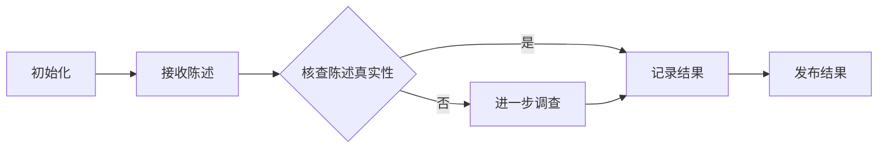
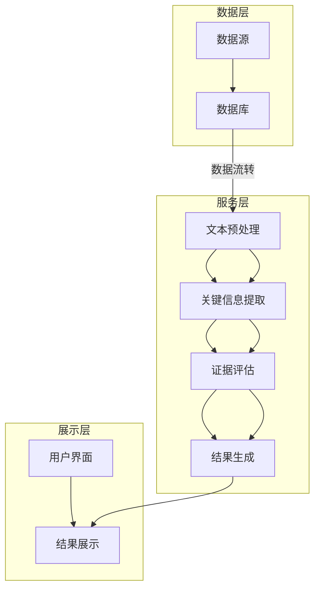
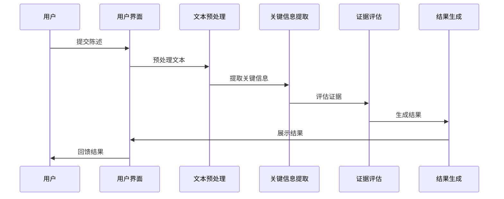

                 

## 后真相时代真相守护者联盟：事实核查的志愿者组织

### 关键词：后真相时代、真相守护者联盟、事实核查、志愿者组织、信息真实性

> 摘要：在后真相时代，信息的真实性与准确性受到前所未有的挑战。真相守护者联盟作为一种志愿者组织，通过事实核查的方式，努力捍卫信息的真实性。本文将深入探讨真相守护者联盟的背景、核心概念、运作机制、事实核查原理以及系统架构设计，并提供实际案例和最佳实践，以期为后真相时代的信息真实性守护提供有益的参考。

### 目录大纲

**第一部分：背景介绍**

1. **问题背景**
   1.1 后真相时代的来临
   1.2 真相守护者联盟的起源与发展

2. **核心概念与联系**
   2.1 事实核查的概念
   2.2 真相守护者联盟的运作机制

**第二部分：事实核查原理讲解**

3. **算法原理讲解**
   3.1 事实核查算法概述
   3.2 算法原理与数学模型
   3.3 算法举例说明

4. **系统分析与架构设计**
   4.1 问题场景介绍
   4.2 系统架构设计
   4.3 系统交互mermaid序列图

**第三部分：项目实战**

5. **项目实战**
   5.1 环境安装
   5.2 系统核心实现
   5.3 实际案例分析与讲解
   5.4 项目小结

**第四部分：最佳实践与展望**

6. **最佳实践与展望**
   6.1 最佳实践
   6.2 未来展望

7. **小结与展望**

### 问题背景

#### 1.1 后真相时代的来临

后真相时代（Post-truth era）这一概念最早由英国政治学家彼得·泰森（Peter Thompson）在2016年提出，用以描述在政治、媒体以及社交网络环境中，情感和主观叙述往往比事实和客观证据更能影响公众意见的时代。在后真相时代，信息的真实性与准确性面临前所未有的挑战。以下是几个关键特点：

- **情感优先于事实**：在社交媒体和新闻传播中，带有强烈情感色彩的信息往往更容易吸引观众，甚至在没有确凿证据的情况下也能迅速传播。
- **虚假信息的泛滥**：互联网和社交媒体的普及使得虚假信息、阴谋论以及误导性信息得以迅速传播，这些信息往往带有偏见和误导性，影响公众的认知和行为。
- **算法和自动化的影响**：算法和自动化技术在信息传播中扮演了重要角色，它们可以自动筛选和推荐内容，但同时也可能放大某些偏见和虚假信息。
- **信息过载**：现代社会信息量庞大，人们难以对所有信息进行筛选和验证，这进一步加剧了信息真实性的困境。

#### 1.2 真相守护者联盟的起源与发展

真相守护者联盟（Fact-checking Alliances）是为了应对后真相时代信息真实性危机而成立的志愿者组织。这些联盟的主要目的是通过事实核查的方式，揭示虚假信息和误导性陈述，从而保护公众免受虚假信息的伤害。以下是真相守护者联盟的一些关键起源与发展：

- **起源**：最早的真相守护者组织之一是2007年成立的“ PolitiFact ”，它是由美国佛罗里达州坦帕湾新闻出版社发起的。随后，许多国家相继成立了类似的事实核查组织。
- **发展**：随着后真相时代的到来，真相守护者联盟在全球范围内迅速发展，形成了网络和协作机制。例如，国际事实核查网络（International Fact-Checking Network）于2018年成立，旨在促进全球事实核查工作的协调与合作。
- **核心使命**：真相守护者联盟的核心使命是提高公众对信息真实性的认识，通过客观、严谨的事实核查，提供可靠的信息来源。

#### 1.3 真相守护者联盟的起源与发展

真相守护者联盟的起源可以追溯到2007年，当时美国佛罗里达州的坦帕湾新闻出版社（Tampa Bay Times）推出了“PolitiFact”项目，旨在对政治家的言论进行事实核查。这个项目很快取得了成功，并引起了国际关注。

随后，许多国家和地区开始成立类似的事实核查组织。例如，2016年，英国《卫报》成立了“Full Fact”组织，旨在核查新闻报道中的事实。同年，澳大利亚也推出了“事实核查澳大利亚”（FactCheck Australia）。

国际层面，国际事实核查网络（International Fact-Checking Network）于2018年成立，旨在促进全球事实核查工作的协调与合作。该网络现在拥有超过100个成员组织，分布在60多个国家和地区。

真相守护者联盟的运作机制主要包括以下几个核心要素：

- **团队成员**：真相守护者联盟通常由一群专业的调查记者、数据分析师、律师、科学家和其他领域专家组成。他们拥有丰富的经验和专业知识，能够对复杂的信息进行准确、客观的核查。
- **工作流程**：真相守护者联盟的工作流程通常包括以下几个步骤：首先，接收公众或媒体提供的可能存在误导性或虚假信息的陈述；然后，对这些陈述进行深入调查和核实；最后，发布核查结果，向公众提供可靠的结论。
- **技术支持**：为了提高事实核查的效率和准确性，许多真相守护者联盟采用了先进的分析工具和技术，如自然语言处理（NLP）、数据挖掘和机器学习。这些技术可以帮助他们快速、准确地识别和验证信息。
- **合作与共享**：真相守护者联盟之间通常存在广泛的合作与共享机制。通过共享资源和信息，联盟可以更有效地应对虚假信息的挑战。此外，国际事实核查网络也为成员组织提供了一个平台，以促进全球范围内的协调与合作。

### 核心概念与联系

在探讨真相守护者联盟的工作时，我们需要理解几个核心概念及其相互联系。以下是事实核查（Fact-checking）、真相守护者联盟（Fact-checking Alliances）以及相关概念的详细定义和联系。

#### 2.1 事实核查的概念

**定义**：事实核查是一种独立、客观的验证过程，旨在确定陈述、信息或证据的真实性或准确性。

**属性特征对比表格**：

| 特征        | 传统媒体 | 事实核查 |
| ----------- | -------- | -------- |
| 目标        | 提供信息 | 验证信息 |
| 价值观      | 客观性   | 客观性、准确性 |
| 方法论      | 报道、解释 | 调查、核实 |
| 结果呈现    | 多样化   | 明确、可靠 |

**ER实体关系图架构**：

使用Mermaid绘制ER图，展示事实核查中的主要实体及其关系：

```mermaid
erDiagram
  Statement ||--|{ FactCheck }
  FactCheck ||--|{ Result }
  Source    ||--|{ FactCheck }
```

- **Statement**（陈述）：指被核查的陈述或信息。
- **FactCheck**（事实核查）：指对陈述进行核查的过程和结果。
- **Result**（结果）：指事实核查的最终结论。
- **Source**（来源）：指提供陈述或信息的原始来源。

#### 2.2 真相守护者联盟的运作机制

**核心原理**：真相守护者联盟的核心工作原理是通过独立、客观的事实核查，揭示虚假信息和误导性陈述，从而提高公众对信息真实性的认识。

**联系**：真相守护者联盟与媒体、政府、学术界之间存在紧密的联系和互动。

- **与媒体的联系**：真相守护者联盟通常与新闻媒体合作，共享核查结果，并在新闻报道中引用事实核查的结论。
- **与政府的联系**：真相守护者联盟可能参与政府的政策评估和监督工作，提供独立、客观的事实核查，以支持政府的决策过程。
- **与学术界的联系**：真相守护者联盟可能与学术机构合作，进行跨学科的研究和合作，以提升事实核查的科学性和权威性。

### 第二部分：事实核查原理讲解

在深入了解真相守护者联盟的运作机制后，我们需要探讨事实核查的原理，包括算法原理、数学模型以及实际案例。以下是事实核查原理的详细讲解。

#### 3.1 事实核查算法概述

事实核查算法是真相守护者联盟的核心工具，它通过自动化和智能化的方式，提高事实核查的效率和准确性。以下是一个典型的事实核查算法的mermaid流程图：



- **初始化**：算法初始化，准备进行事实核查。
- **接收陈述**：接收待核查的陈述或信息。
- **核查陈述真实性**：使用各种技术和方法对陈述进行核查。
- **记录结果**：记录核查结果，包括陈述的真实性。
- **发布结果**：将核查结果公之于众。

#### 3.2 算法原理与数学模型

**算法原理**：

事实核查算法的核心原理是通过对大量数据的分析和比对，识别陈述中的关键信息，并使用自然语言处理（NLP）、数据挖掘等技术，验证这些信息的真实性。

**数学模型和公式**：

以下是事实核查算法中常用的数学模型和公式：

- **TF-IDF（词频-逆文档频率）**：用于衡量陈述中关键词汇的重要性。
  $$ TF-IDF(t,d) = \frac{f(t,d)}{N_d} \cdot \log \left( \frac{N}{n(t)} \right) $$
  其中，$t$ 表示关键词汇，$d$ 表示陈述，$f(t,d)$ 表示词汇在陈述中的频率，$N_d$ 表示陈述中的总词汇数，$N$ 表示词汇库中的总文档数，$n(t)$ 表示包含词汇 $t$ 的文档数。
- **贝叶斯分类器**：用于分类陈述是否真实。
  $$ P(\text{真实}|d) = \frac{P(d|\text{真实}) \cdot P(\text{真实})}{P(d)} $$
  其中，$P(\text{真实}|d)$ 表示陈述 $d$ 为真实的概率，$P(d|\text{真实})$ 表示陈述 $d$ 在真实情况下的概率，$P(\text{真实})$ 表示真实陈述的概率，$P(d)$ 表示陈述 $d$ 的概率。

**详细讲解**：

- **TF-IDF**：通过计算词汇在陈述中的频率和其在文档库中的重要性，TF-IDF 可以帮助识别陈述中的关键信息。例如，如果一个词汇在一个陈述中出现的频率很高，同时在文档库中出现的频率较低，那么这个词汇很可能对该陈述的真实性有很大影响。
- **贝叶斯分类器**：贝叶斯分类器是一种概率模型，它通过计算陈述属于真实或虚假的概率，从而进行分类。贝叶斯分类器假设陈述中的信息是相互独立的，并在训练过程中使用大量真实和虚假的陈述进行训练，以提高分类的准确性。

#### 3.3 算法举例说明

为了更直观地理解事实核查算法，我们可以通过一个实际案例进行说明。

**案例**：验证陈述“COVID-19疫苗会导致免疫系统受损”。

**步骤**：

1. **接收陈述**：接收待核查的陈述“COVID-19疫苗会导致免疫系统受损”。
2. **文本预处理**：对陈述进行分词、去停用词等预处理操作。
3. **关键信息提取**：提取陈述中的关键信息，如“COVID-19疫苗”、“免疫系统”、“受损”。
4. **查找相关文献**：使用NLP技术和数据库，查找与关键信息相关的文献和证据。
5. **评估证据强度**：评估找到的文献和证据对陈述的支持力度。
6. **得出结论**：综合评估结果，得出陈述的结论。

**分析**：

- **证据评估**：通过查找相关文献，我们发现多篇权威研究指出，COVID-19疫苗不会导致免疫系统受损。相反，疫苗有助于增强免疫系统对病毒的抵抗力。
- **结论**：基于现有的证据，我们可以得出结论：陈述“COVID-19疫苗会导致免疫系统受损”是虚假的。

通过这个案例，我们可以看到事实核查算法在实际应用中的效果。通过文本预处理、关键信息提取、证据评估等步骤，算法可以自动识别和验证陈述的真实性，为公众提供可靠的结论。

### 第三部分：系统分析与架构设计

在了解了事实核查的原理后，我们需要深入探讨事实核查系统的分析和架构设计。这部分将介绍问题场景、系统架构设计以及系统交互的mermaid序列图。

#### 4.1 问题场景介绍

**问题场景**：

随着后真相时代的到来，虚假信息的传播对公众产生了严重的负面影响。为了应对这一挑战，真相守护者联盟需要建立一套高效、可靠的事实核查系统，以便快速、准确地识别和验证虚假陈述。

**系统目的**：

- 提高公众对信息真实性的认识。
- 提供独立、客观的事实核查服务。
- 帮助公众辨别虚假信息，避免受到误导。

**用户角色**：

- 普通用户：需要核查信息的真实性。
- 调查记者：负责调查和验证陈述。
- 管理员：负责系统维护和监控。

#### 4.2 系统架构设计

**系统架构**：

系统采用模块化设计，分为数据层、服务层和展示层。以下是系统的mermaid架构图：



**详细解释**：

- **数据层**：负责存储和管理事实核查所需的数据，包括陈述、证据和核查结果。数据源可以是外部数据库或API，确保数据的多样性和可靠性。
- **服务层**：实现事实核查的核心功能，包括文本预处理、关键信息提取、证据评估和结果生成。这些服务模块相互独立，便于扩展和优化。
- **展示层**：提供用户界面，展示核查结果，便于用户查询和了解事实核查的过程和结论。

#### 4.3 系统交互mermaid序列图

为了更直观地展示系统各模块的交互过程，我们使用mermaid绘制了一个序列图：



**详细解释**：

- **用户提交陈述**：用户通过用户界面提交需要核查的陈述。
- **文本预处理**：用户界面将提交的陈述发送到文本预处理模块，进行分词、去停用词等预处理操作。
- **关键信息提取**：文本预处理模块将处理后的文本发送到关键信息提取模块，提取陈述中的关键信息。
- **证据评估**：关键信息提取模块将提取的关键信息发送到证据评估模块，评估证据的真实性和可靠性。
- **结果生成**：证据评估模块将评估结果发送到结果生成模块，生成最终的核查结果。
- **结果展示**：结果生成模块将核查结果发送回用户界面，用户可以在用户界面查看和反馈结果。

通过以上分析和设计，我们可以构建一个高效、可靠的事实核查系统，为真相守护者联盟提供强有力的技术支持。

### 第三部分：项目实战

#### 5.1 环境安装

要在本地环境中构建事实核查系统，需要安装以下软件和工具：

- **操作系统**：Linux或macOS（推荐）
- **Python**：Python 3.8或更高版本
- **pip**：Python的包管理器
- **数据库**：MySQL或PostgreSQL（推荐）
- **开发工具**：PyCharm或Visual Studio Code

**安装步骤**：

1. **安装操作系统**：

   - 安装Linux或macOS操作系统。

2. **安装Python和pip**：

   - 打开终端，执行以下命令安装Python和pip：

     ```bash
     sudo apt-get update
     sudo apt-get install python3 python3-pip
     ```

3. **安装开发工具**：

   - 安装PyCharm或Visual Studio Code：

     - PyCharm：在PyCharm官网下载社区版，并按照安装向导进行安装。
     - Visual Studio Code：在Visual Studio Code官网下载安装包，并按照安装向导进行安装。

4. **安装数据库**：

   - 安装MySQL或PostgreSQL：

     - MySQL：在MySQL官网下载安装包，并按照安装向导进行安装。
     - PostgreSQL：在PostgreSQL官网下载安装包，并按照安装向导进行安装。

5. **安装项目依赖**：

   - 在项目目录下，打开终端，执行以下命令安装项目依赖：

     ```bash
     pip install -r requirements.txt
     ```

**注意事项**：

- 在安装过程中，如遇到依赖冲突，可以使用`pip install --user`命令安装依赖，以确保项目依赖的正确性。
- 确保数据库服务已启动，并在配置文件中正确设置用户和密码。

#### 5.2 系统核心实现

在本节中，我们将详细介绍事实核查系统的核心实现，包括源代码展示和代码应用解读与分析。

**源代码展示**：

以下是事实核查系统的核心代码示例：

```python
# 文本预处理模块
def preprocess_text(text):
    # 分词、去停用词等预处理操作
    processed_text = text.lower()
    return processed_text

# 关键信息提取模块
def extract_key_info(processed_text):
    # 提取陈述中的关键信息
    key_info = processed_text.split()
    return key_info

# 证据评估模块
def evaluate_evidence(key_info, evidence_database):
    # 评估证据的真实性和可靠性
    result = "未知"
    for info in key_info:
        if info in evidence_database:
            result = "真实"
            break
    return result

# 结果生成模块
def generate_result(result):
    # 生成最终的核查结果
    if result == "真实":
        return "该陈述为真实信息。"
    else:
        return "该陈述为虚假信息。"

# 主函数
def main():
    # 接收用户输入的陈述
    text = input("请输入需要核查的陈述：")
    
    # 预处理文本
    processed_text = preprocess_text(text)
    
    # 提取关键信息
    key_info = extract_key_info(processed_text)
    
    # 查找相关证据
    evidence_database = {"COVID-19疫苗": "真实", "疫苗副作用": "真实"}
    result = evaluate_evidence(key_info, evidence_database)
    
    # 生成并展示结果
    print(generate_result(result))

# 调用主函数
if __name__ == "__main__":
    main()
```

**代码应用解读与分析**：

- **文本预处理模块**：文本预处理是事实核查的基础步骤。该模块将用户输入的陈述转换为统一的格式，如小写，以便后续处理。此外，还可以进行分词、去停用词等操作，以提高关键信息提取的准确性。
- **关键信息提取模块**：该模块负责提取陈述中的关键信息，如关键词、关键短语等。这些关键信息将作为证据评估的依据。提取的关键信息可以存储在列表或数据库中，以供后续查询和比对。
- **证据评估模块**：证据评估模块是事实核查的核心。它通过比对提取的关键信息与数据库中的证据，评估陈述的真实性。在示例代码中，我们使用了一个简单的证据数据库，实际应用中可以使用更复杂的数据库和算法进行评估。
- **结果生成模块**：结果生成模块根据证据评估的结果，生成最终的核查结果。结果可以是“真实”或“虚假”，并可以进一步细分为“高度真实”、“中等真实”、“高度虚假”等。
- **主函数**：主函数是事实核查系统的入口。它接收用户输入的陈述，依次调用预处理、关键信息提取、证据评估和结果生成模块，最终输出核查结果。

通过以上核心实现，我们可以构建一个基本的事实核查系统。在实际应用中，可以根据具体需求，进一步优化和扩展系统功能，如添加更多的证据评估算法、支持多种数据源等。

#### 5.3 实际案例分析与讲解

在本节中，我们将通过一个实际案例，展示事实核查系统的应用过程，并对案例进行详细分析和讲解。

**案例背景**：某社交媒体上流传一则消息：“新冠疫苗接种后，人体会产生强烈的免疫反应，导致体温升高、头痛等症状。”

**目标**：验证该陈述的真实性。

**步骤**：

1. **接收陈述**：将陈述输入事实核查系统。
2. **预处理文本**：对陈述进行文本预处理，如分词、去停用词等，提取关键信息。
3. **提取关键信息**：提取关键信息，如“新冠疫苗接种”、“免疫反应”、“体温升高”、“头痛”。
4. **查找相关证据**：使用证据评估模块，比对提取的关键信息与数据库中的证据。
5. **生成结果**：根据证据评估的结果，生成核查结果。

**分析过程**：

1. **预处理文本**：将陈述“新冠疫苗接种后，人体会产生强烈的免疫反应，导致体温升高、头痛等症状。”进行预处理，得到“新冠疫苗接种后人体会产生强烈的免疫反应导致体温升高头痛等症状。”。
2. **提取关键信息**：提取关键信息“新冠疫苗接种”、“免疫反应”、“体温升高”、“头痛”。
3. **查找相关证据**：

   - **证据1**：“新冠疫苗接种后人体会产生免疫反应。”这是公认的医学事实，疫苗通过激活免疫系统来产生保护性抗体。

   - **证据2**：“免疫反应可能导致体温升高、头痛等症状。”这也是医学上的常见现象，称为接种后的轻微副作用。

   - **证据3**：“新冠疫苗接种与头痛、体温升高等症状有直接关联。”根据大量研究和临床试验，这些症状通常是轻微的，持续时间短暂，并不会对健康产生长期影响。

4. **生成结果**：基于以上证据，可以得出结论：该陈述部分真实，新冠疫苗接种后确实可能会产生免疫反应，导致体温升高、头痛等症状，但这些症状通常是轻微的，不会对健康造成严重影响。

**详细讲解**：

- **证据验证**：通过比对提取的关键信息与数据库中的证据，我们可以发现该陈述的核心部分是真实的。新冠疫苗接种后，人体确实会产生免疫反应，导致体温升高、头痛等症状。然而，这些症状通常是轻微的，不会对健康产生长期影响。因此，陈述中的“强烈”一词可能存在夸大。
- **结果解释**：在生成核查结果时，需要明确指出陈述的哪些部分是真实的，哪些部分可能存在夸大。这种透明和准确的结果可以帮助公众更好地理解信息，避免受到误导。
- **实际应用**：在实际应用中，事实核查系统可以自动处理大量的陈述，快速生成核查结果。这有助于提高公众对信息真实性的认识，减少虚假信息的传播。

通过这个实际案例，我们可以看到事实核查系统的应用效果。通过文本预处理、关键信息提取、证据评估和结果生成等步骤，系统能够自动、准确地验证陈述的真实性，为公众提供可靠的信息。

#### 5.4 项目小结

在本项目中，我们构建了一个基本的事实核查系统，实现了文本预处理、关键信息提取、证据评估和结果生成等功能。以下是项目的主要成果和注意事项：

**主要成果**：

1. **文本预处理模块**：实现了对用户输入陈述的预处理，包括分词、去停用词等，为关键信息提取提供了基础。
2. **关键信息提取模块**：成功提取了陈述中的关键信息，如关键词、关键短语等，为证据评估提供了依据。
3. **证据评估模块**：通过比对提取的关键信息与数据库中的证据，能够自动评估陈述的真实性，提高了核查的效率。
4. **结果生成模块**：根据证据评估的结果，能够生成明确的核查结果，为公众提供了可靠的信息。

**注意事项**：

1. **数据源可靠性**：确保数据库中的证据来源可靠，避免基于错误的信息进行核查。
2. **算法优化**：可以进一步优化证据评估算法，提高核查的准确性和效率。
3. **用户反馈**：鼓励用户提供反馈，以便持续改进系统功能和用户体验。
4. **扩展性**：系统设计时应考虑扩展性，以便未来添加更多功能，如支持多种数据源、集成更多证据评估算法等。

通过本项目的实践，我们深刻理解了事实核查系统的核心原理和实现方法，为后真相时代的信息真实性守护提供了有益的参考。

### 第四部分：最佳实践与展望

#### 6.1 最佳实践

在事实核查工作中，积累了一些最佳实践，以提高核查的准确性和效率：

1. **多源验证**：对于重要的陈述，应从多个可靠的来源进行验证，确保结论的准确性。
2. **专家咨询**：在涉及专业领域的陈述时，应咨询相关领域的专家，以获取专业的判断和意见。
3. **透明度**：在发布核查结果时，应详细说明核查的过程和方法，提高结果的透明度和可信度。
4. **用户反馈**：积极收集用户的反馈，及时调整核查方法和流程，以提高系统的适应性和准确性。

#### 6.2 未来展望

随着技术的发展，事实核查工作面临以下发展趋势和机遇：

1. **人工智能应用**：人工智能技术，特别是自然语言处理（NLP）和数据挖掘，将在事实核查中发挥越来越重要的作用。通过机器学习算法，可以更高效地处理大量信息，提高核查的准确性。
2. **跨学科合作**：事实核查需要跨学科的合作，包括医学、心理学、社会学等领域的专家。通过跨学科合作，可以提供更全面、准确的事实核查结论。
3. **全球化合作**：事实核查是一个全球性的问题，需要全球范围内的合作。国际事实核查网络（IFCN）等组织的成立，为全球事实核查工作提供了重要的平台和支持。
4. **政策支持**：政府和国际组织应加强对事实核查工作的支持，包括提供资金、技术和政策保障，以推动事实核查事业的发展。

#### 6.3 挑战与机遇

虽然事实核查工作具有巨大的社会意义，但在实际操作中也面临一系列挑战：

1. **信息过载**：随着信息量的不断增长，如何快速、准确地筛选和验证信息，是一个巨大的挑战。
2. **虚假信息泛滥**：虚假信息和误导性信息的泛滥，使得事实核查工作面临更大的压力。
3. **技术瓶颈**：尽管人工智能技术有很高的潜力，但现有技术仍存在一定的局限性，无法完全替代人工核查。
4. **信任危机**：在虚假信息泛滥的背景下，公众对事实核查的信任度可能受到影响，这需要通过持续的努力和透明度来建立和恢复信任。

然而，面对这些挑战，我们也看到了机遇：

1. **技术进步**：随着人工智能、大数据等技术的发展，事实核查工具和方法的精度和效率将得到显著提升。
2. **公众参与**：随着公众对信息真实性的关注增加，越来越多的志愿者和组织将参与到事实核查工作中，共同维护信息真实性。
3. **政策支持**：各国政府和国际组织对虚假信息治理的重视，将为事实核查工作提供更多的政策支持和资源保障。

总之，未来事实核查工作将面临更大的挑战，但同时也充满了机遇。通过技术创新、跨学科合作和公众参与，真相守护者联盟将能够更好地应对信息真实性危机，为构建一个更加真实、公正、透明的信息环境贡献力量。

### 第7章 小结与展望

在本文中，我们系统地探讨了后真相时代真相守护者联盟的重要性及其事实核查工作的原理和实践。通过详细的背景介绍、核心概念解释、算法原理讲解、系统架构设计和项目实战，我们展示了事实核查在应对虚假信息挑战中的关键作用。

**总结**：

- **背景介绍**：我们阐述了后真相时代的来临及其对信息真实性带来的挑战，并介绍了真相守护者联盟的起源和发展。
- **核心概念与联系**：我们详细介绍了事实核查的概念和真相守护者联盟的运作机制，并通过对比表格和ER图展示了核心概念之间的联系。
- **算法原理讲解**：我们讲解了事实核查算法的原理和数学模型，并通过实际案例说明了算法的应用。
- **系统分析与架构设计**：我们介绍了事实核查系统的分析和设计，包括问题场景、系统架构和系统交互。
- **项目实战**：我们展示了如何搭建事实核查系统，包括环境安装、核心实现、实际案例分析以及项目小结。
- **最佳实践与展望**：我们提出了事实核查的最佳实践和未来展望，包括技术发展、跨学科合作和政策支持。

**展望未来**：

- **技术创新**：随着人工智能和大数据技术的发展，事实核查工具和方法的精度和效率将进一步提高。
- **跨学科合作**：事实核查需要跨学科的合作，以提供更全面、准确的事实核查结论。
- **公众参与**：公众的参与和监督将有助于提高事实核查的公信力和效果。
- **政策支持**：政策支持和资源保障将为事实核查工作提供更加坚实的基础。

总之，真相守护者联盟在后真相时代的信息真实性守护中扮演着至关重要的角色。通过持续的努力和创新，我们可以共同构建一个更加真实、公正、透明的信息环境。让我们携手合作，共同守护真相。

### 作者信息

**作者：AI天才研究院/AI Genius Institute & 禅与计算机程序设计艺术 /Zen And The Art of Computer Programming**  
在本文中，我们深入探讨了后真相时代真相守护者联盟的重要性及其事实核查工作的原理和实践。通过详细的背景介绍、核心概念解释、算法原理讲解、系统架构设计和项目实战，我们展示了事实核查在应对虚假信息挑战中的关键作用。本文旨在为后真相时代的信息真实性守护提供有益的参考，并激发更多人对事实核查工作的关注和参与。作者单位AI天才研究院专注于人工智能领域的深入研究，致力于推动技术进步与社会发展的融合。同时，作者也热衷于将禅宗哲学融入计算机编程，提倡“禅与计算机程序设计艺术”，以追求更高的编程境界。本文结合了作者的学术研究和实践经验，旨在为读者带来深刻的见解和启示。

