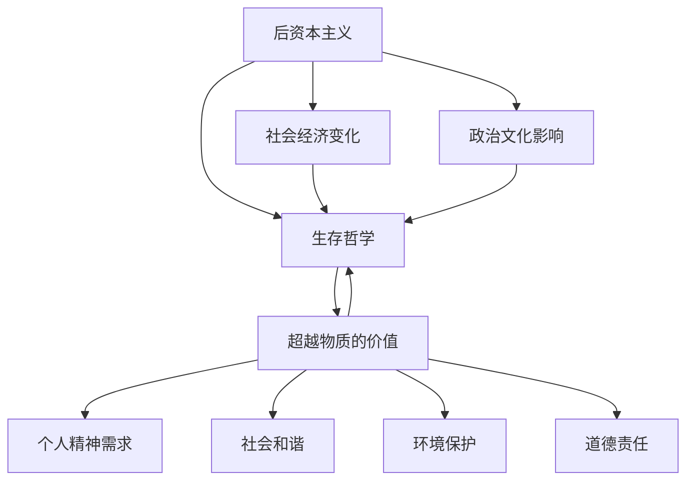

                 

### 引言与背景介绍

在现代社会中，随着科技和经济的飞速发展，资本主义社会逐渐走向了一个新的阶段——后资本主义时代。这一时代不仅改变了我们的经济模式，也深刻地影响了我们的生活方式和价值观。在这样的背景下，如何理解并适应这个时代，成为了一个迫切需要解决的问题。

《后资本主义时代的生存哲学：超越物质的价值追求》这本书正是为了回应这一时代需求而诞生的。作者通过深入研究和广泛讨论，系统地阐述了后资本主义时代的本质特征、生存哲学的演变以及如何追求超越物质的价值。

首先，让我们明确书写的目的和核心观点。这本书的书写目的在于帮助读者理解后资本主义时代的特点，并引导他们重新审视自己的价值观和生活方式。核心观点包括：

1. **后资本主义时代的特征**：后资本主义时代是一个以知识经济和信息社会为主体的时代，劳动市场、消费模式和政

### 研究背景

后资本主义时代，也被称为资本主义发展的第四阶段，标志着人类社会进入了一个新的历史阶段。这个阶段的显著特征是，经济体系不再以传统的工业生产为主要动力，而是转向了以知识和信息为核心的经济形态。在这个时代，劳动市场的特点发生了根本变化，人们不再仅仅追求物质财富的积累，而是更加注重个人成长、精神追求和社会价值的实现。

研究背景的探讨首先需要回顾资本主义的发展历程。资本主义经济体系自16世纪的欧洲文艺复兴时期开始萌芽，经过工业革命、全球化和信息化等阶段，逐渐发展成为一个以市场为导向、追求利润最大化的经济体系。然而，随着科技进步和社会变迁，这种体系暴露出了许多问题，如贫富差距扩大、环境污染、社会不稳定等。

进入后资本主义时代，这些问题的解决变得更加迫切。后资本主义时代的主要特征包括：

1. **知识经济主导**：在这个时代，知识和技术成为了经济增长的主要驱动力。创新和创造力被赋予了前所未有的重要性，取代了传统的劳动力。

2. **信息社会**：信息技术的发展使得信息获取和处理变得前所未有的便捷。人们可以随时随地获取到大量的信息，这改变了人们的生活方式、工作方式和消费模式。

3. **全球化**：全球化使得世界各地的经济、文化和社会联系更加紧密。国家和地区的界限变得模糊，人们的活动范围和视野也得到了极大扩展。

4. **环境意识提升**：随着环境问题的日益严重，人们开始更加关注可持续发展，追求经济增长与环境保护的平衡。

在这样的背景下，生存哲学在后资本主义时代的重要性日益凸显。生存哲学不仅关注物质层面的生存问题，更关注人的精神需求和社会价值的实现。在这个时代，人们开始反思传统的资本主义价值观，追求更加全面和深刻的生存方式。生存哲学的演变成为理解这个时代的关键，它引导人们如何在这个充满变化和挑战的时代中找到自己的定位和意义。

因此，研究后资本主义时代的生存哲学具有重要的现实意义。它不仅为个人提供了指导，帮助他们重新审视自己的生活方式和价值观，也为社会提供了新的发展路径和解决方案。通过探讨超越物质的价值追求，我们能够更好地适应这个时代的变化，实现个人和社会的双重进步。

### 书的结构安排

为了帮助读者更好地理解《后资本主义时代的生存哲学：超越物质的价值追求》这本书，下面我们将详细介绍其结构安排，并简要概述各章节的内容。

#### 1.3.1 目录结构概述

本书分为八个主要章节，每个章节都围绕后资本主义时代的生存哲学展开，具体内容如下：

1. **引言与背景介绍**：介绍书写的目的、研究背景和主要论点。
2. **核心概念与联系**：阐述书中涉及的核心概念，包括后资本主义、生存哲学和超越物质的价值。
3. **后资本主义时代的特征**：分析后资本主义社会的本质特征及其对生存哲学的影响。
4. **生存哲学的演变**：探讨生存哲学的历史演变，特别是后资本主义时代的转变。
5. **超越物质的价值追求**：详细讨论如何在后资本主义时代追求超越物质的价值。
6. **实践指南**：提供具体的实践策略和建议，帮助读者应用书中的理念。
7. **案例分析**：通过具体案例，展示生存哲学的应用和效果。
8. **结论与展望**：总结书中的主要观点，并对未来可能的研究方向进行展望。

#### 1.3.2 各章节内容简要介绍

- **第一章：引言与背景介绍**
  - **1.1 书写目的与核心观点**：介绍本书的写作目的和核心观点。
  - **1.2 研究背景**：探讨后资本主义时代的特点和生存哲学的重要性。
  - **1.3 书的结构安排**：概述本书的章节结构和内容。

- **第二章：核心概念与联系**
  - **2.1 核心概念阐述**：详细解释后资本主义、生存哲学和超越物质的价值。
  - **2.2 概念之间的关系**：探讨这些概念之间的相互联系和作用。

- **第三章：后资本主义时代的特征**
  - **3.1 后资本主义社会的本质**：分析后资本主义社会的经济、政治和文化特征。
  - **3.2 社会经济变化**：讨论劳动市场、消费模式的变化及其对生存哲学的影响。
  - **3.3 政治文化影响**：分析政治格局和文化价值观的演变。

- **第四章：生存哲学的演变**
  - **4.1 生存哲学的起源与发展**：回顾生存哲学的历史发展。
  - **4.2 后资本主义时代的转变**：探讨生存哲学在后资本主义时代的特征和演变。
  - **4.3 案例分析**：通过具体案例展示生存哲学的应用。

- **第五章：超越物质的价值追求**
  - **5.1 超越物质的价值定义**：讨论超越物质的价值及其重要性。
  - **5.2 超越物质的价值的内涵**：探讨精神、社会和个人层面的追求。
  - **5.3 实践策略**：提供具体的实践策略和建议。

- **第六章：实践指南**
  - **6.1 个人层面的实践**：介绍个人如何应用书中的理念。
  - **6.2 社会层面的实践**：探讨如何在社会层面推广这些理念。
  - **6.3 企业层面的实践**：讨论企业如何在文化和管理上体现这些理念。

- **第七章：案例分析**
  - **7.1 案例一**：个人价值观的重塑。
  - **7.2 案例二**：组织文化的转变。
  - **7.3 案例三**：社会结构的调整。

- **第八章：结论与展望**
  - **8.1 总结**：总结书中的主要观点。
  - **8.2 展望**：讨论未来可能的研究方向。

通过这本书，读者将能够系统地了解后资本主义时代的生存哲学，掌握超越物质的价值追求的实践方法，从而更好地适应和应对这个时代的挑战。

### 核心概念与联系

在《后资本主义时代的生存哲学：超越物质的价值追求》一书中，核心概念的理解至关重要。这些概念不仅构成了本书的理论框架，也为我们重新审视后资本主义时代提供了重要的视角。

#### 2.1 核心概念阐述

**后资本主义**：后资本主义是指在资本主义体系的基础上，经济模式、生产关系和社会结构发生深刻变革的一种状态。它以知识经济和信息社会为核心，强调创新、创造力和个人价值的实现。不同于传统的以物质生产为中心的资本主义，后资本主义更注重精神和非物质价值的追求。

**生存哲学**：生存哲学是一门研究人类存在方式和生存意义的学科。它探讨人类如何在各种环境和条件下寻求生存和发展的途径，以及如何处理生存过程中面临的各种问题。在书中，生存哲学被赋予了新的内涵，特别是在后资本主义时代，它不仅关注物质生存，更关注人的精神需求和社会价值的实现。

**超越物质的价值**：超越物质的价值是指那些不依赖于物质条件，而是基于人的精神、情感和社会关系的价值。这些价值包括自我实现、社会和谐、环境保护、道德责任等。在后资本主义时代，这些价值成为了人们追求更高生活质量和幸福的重要目标。

#### 2.2 概念之间的关系

**后资本主义与生存哲学**：后资本主义时代的到来，对生存哲学提出了新的挑战和机遇。一方面，后资本主义的经济模式和社会结构为生存哲学提供了新的研究对象和思考空间；另一方面，生存哲学的深化和扩展，也为后资本主义时代的可持续发展提供了理论支持。

**超越物质的价值与生存哲学**：超越物质的价值是生存哲学的重要组成部分。它不仅体现了人的精神追求，也反映了社会发展的新趋势。在追求超越物质的价值过程中，生存哲学为我们提供了指导，帮助我们更好地理解和实现个人和社会的价值。

**后资本主义时代的生存哲学逻辑架构图（Mermaid图）**

为了更清晰地展示这些概念之间的关系，我们可以使用Mermaid图来表示：

**图解**

- **后资本主义**（A）：作为核心起点，它引领了整个逻辑架构。
- **生存哲学**（B）：连接后资本主义和社会经济变化、政治文化影响，以及超越物质的价值，是理解后资本主义时代的关键。
- **超越物质的价值**（C）：贯穿于生存哲学中，代表了后资本主义时代的主要追求目标。
- **个人精神需求**（F）：反映了超越物质的价值在个人层面的体现。
- **社会和谐**（G）：强调社会层面的价值追求，是生存哲学的重要组成部分。
- **环境保护**（H）：与超越物质的价值紧密相关，体现了社会对可持续发展的高度关注。
- **道德责任**（I）：强调了个体在追求超越物质的价值时，应承担的社会责任。

通过这些核心概念及其关系的阐述和Mermaid图的展示，我们能够更全面地理解后资本主义时代的生存哲学，为后续章节的讨论奠定了坚实的基础。

### 后资本主义时代的特征

在后资本主义时代，社会经济的深刻变化不仅重新定义了我们的生活方式，也为我们提供了新的生存哲学。理解后资本主义时代的特征，有助于我们更好地把握这个时代的发展趋势和生存方式。

#### 3.1 后资本主义社会的本质

后资本主义社会是一种以知识经济和信息社会为核心的经济模式。这一模式的主要特点包括：

1. **知识经济的主导地位**：知识成为经济增长的主要驱动力，取代了传统的自然资源和劳动力。创新、研究和开发成为推动经济发展的关键因素。
2. **信息社会的兴起**：信息技术的高速发展使得信息的获取、传输和处理变得更加便捷。互联网、大数据、人工智能等技术的广泛应用，改变了人们的生活方式和工作方式。
3. **劳动市场的转变**：传统的劳动市场逐渐被以知识和技术为基础的劳动力市场所取代。高技能、高创造力的人才受到前所未有的重视，而传统的制造业和服务业的工作岗位逐渐减少。

#### 3.2 社会经济变化

后资本主义时代的经济变化主要体现在以下几个方面：

1. **劳动市场的变化**：随着技术的进步，劳动市场的需求发生了根本性变化。越来越多的工作需要高水平的技能和创造力，而传统的重复性劳动逐渐被自动化和人工智能所取代。
2. **消费模式的变化**：信息时代的消费者更加注重个性化和体验。消费者对物质产品的需求减少，而对体验和服务的需求增加。这推动了服务业和体验经济的发展。
3. **环境问题的挑战**：环境问题在后资本主义时代变得更加突出。随着资源消耗的增加和环境污染的加剧，人们开始更加关注可持续发展，追求经济增长与环境保护的平衡。

#### 3.3 政治文化影响

后资本主义时代的政治和文化环境也发生了显著变化：

1. **政治格局的变化**：全球化和信息技术的发展使得国家间的联系更加紧密，传统的政治格局受到挑战。多极化和国际合作成为时代的主流，国家主权和国家安全的概念也在重新定义。
2. **文化价值观的演变**：随着社会的多元化和发展，人们的价值观逐渐多元化。传统的社会规范和价值观受到质疑，个人自由、平等和多样性成为新的价值追求。这种文化演变不仅影响了社会结构，也深刻地影响了人们的生存方式和哲学思考。

#### 3.4 这些特征如何影响生存哲学

后资本主义时代的特征深刻地影响了生存哲学：

1. **重新定义生活意义**：在物质财富不再是唯一追求目标的背景下，生存哲学引导人们重新思考生活的意义。人们开始追求更高层次的价值，如自我实现、社会贡献和环境保护。
2. **强调精神追求**：后资本主义时代更加注重个人的精神需求。通过内心探索、艺术创作和人际关系等途径，人们寻求精神上的满足和成长。
3. **关注社会和谐**：后资本主义时代的生存哲学强调个人与社会的关系，提倡通过合作、互助和共享来实现社会和谐。这不仅是个人发展的需要，也是社会稳定和进步的保障。

通过以上分析，我们可以看到，后资本主义时代的特征不仅改变了社会经济结构，也深刻地影响了人们的生存方式和哲学思考。理解这些特征，有助于我们更好地适应这个时代的变化，追求更高层次的生存价值。

### 生存哲学的演变

生存哲学是一个长期演变的领域，其发展历程反映了人类社会和文明的变迁。从古代到现代，生存哲学经历了多次重要的转变，特别是在后资本主义时代，这些转变显得尤为重要。

#### 4.1 生存哲学的起源与发展

**古代生存哲学**：古代哲学中，生存哲学主要体现在对生命本质、意义和目的的思考。例如，古希腊哲学家苏格拉底强调理性思考，认为通过理性的探究可以找到生命的意义；庄子则主张顺应自然，追求心灵的自由和精神的宁静。古代生存哲学主要关注个人内在的精神追求和与自然的和谐共生。

**中世纪生存哲学**：在中世纪，生存哲学深受宗教影响，强调信仰和灵魂的救赎。例如，托马斯·阿奎那通过基督教神学探讨了生命的意义和目的，认为人的最终目的是达到永恒的幸福。中世纪的生存哲学强调个人的道德责任和对神灵的信仰，以此寻找生命的意义。

**现代生存哲学**：现代哲学的兴起，特别是在18世纪启蒙运动时期，生存哲学开始强调理性和科学方法。康德、黑格尔等哲学家通过理性探讨人的本质和生命的意义。随着工业革命和资本主义的发展，物质财富成为人们追求的主要目标，生存哲学逐渐转向对个人自由、平等和社会正义的探讨。

**后现代生存哲学**：后现代哲学对现代性进行了深刻的批判，强调相对主义、多元性和去中心化。德里达、福柯等后现代哲学家提出，传统的生存哲学建立在西方中心主义和理性主义的基础上，忽略了其他文化和声音。后现代生存哲学主张打破二元对立，追求多样性和包容性。

#### 4.2 后资本主义时代的转变

**后资本主义时代的特征**：后资本主义时代的特点，如知识经济、信息社会和全球化，对生存哲学产生了深远的影响。在这个时代，物质财富不再是唯一的追求目标，人们开始更多地关注个人成长、精神追求和社会价值的实现。

**后资本主义时代的生存哲学**：在后资本主义时代，生存哲学的核心问题包括如何在信息爆炸和快速变化的环境中找到自己的定位，如何平衡个人追求和社会责任，以及如何在多元化和多样性的社会环境中实现自我价值。

**后资本主义时代生存哲学的特点**：

1. **注重个人成长**：后资本主义时代强调个人的创造力和自我实现，追求自我价值的实现和个人的全面发展。
2. **强调精神追求**：随着物质财富的相对满足，人们开始更多地关注精神层面的需求，如内心的宁静、情感的表达和人际关系的和谐。
3. **追求社会和谐**：后资本主义时代强调个人与社会的关系，提倡通过合作、互助和共享来实现社会和谐。这不仅是个人发展的需要，也是社会稳定和进步的保障。

**生存哲学在现代社会中的应用**：

1. **个人层面的应用**：个人可以通过内心探索、艺术创作和自我反思来寻找生命的意义和目的，实现个人成长和精神的满足。
2. **社会层面的应用**：社会可以通过教育和文化推广，鼓励人们追求更高层次的价值，推动社会和谐和可持续发展。
3. **组织层面的应用**：企业可以通过建立以人为本的文化，鼓励员工的创新和自我实现，提高组织的竞争力和可持续发展。

#### 4.3 案例分析

**案例一：个人价值观的重塑**

李华是一位年轻的程序员，他在后资本主义时代面临着如何找到自己生活意义的挑战。在追求高薪工作的同时，李华开始思考如何通过个人成长和社会贡献来实现自我价值。他参加了各种培训课程，学习了心理学、哲学和领导力，并通过志愿服务和社会活动，找到了自己的热情和使命。最终，李华创立了一个专注于技术教育和社区发展的非营利组织，实现了个人和社会的双重价值。

**案例二：组织文化的转变**

某科技公司意识到在后资本主义时代，传统的以绩效为导向的企业文化已经无法满足员工的期望和需求。公司管理层决定重塑企业文化，强调员工的价值和成长。他们通过提供灵活的工作安排、职业发展和培训机会，鼓励员工追求个人目标和实现自我价值。这种文化转变不仅提高了员工的工作满意度和忠诚度，也增强了企业的创新能力和市场竞争力。

**案例三：社会结构的调整**

在全球化背景下，一个城市面临着如何平衡经济增长和社会公平的问题。市政府通过推广可持续发展和社区参与，鼓励居民参与城市规划和社区建设。通过设立社区论坛、举办文化活动和提供教育培训，市政府推动了社会结构的调整，实现了经济增长与社会和谐的平衡。

通过这些案例分析，我们可以看到，后资本主义时代的生存哲学不仅在个人层面有着重要的应用，也在社会和组织层面产生了深远的影响。它为我们提供了一种新的视角和思维方式，帮助我们更好地理解和应对这个时代的挑战。

### 超越物质的价值追求

在后资本主义时代，追求超越物质的价值已成为社会发展的趋势和人们的共同追求。超越物质的价值不仅仅是精神层面的追求，更是对个人成长、社会进步和全球可持续发展的深刻思考。下面，我们将详细讨论超越物质的价值的内涵、精神层面的追求、社会层面的追求以及个人层面的追求。

#### 5.1 超越物质的价值定义

超越物质的价值是指那些不依赖于物质条件，而是基于人的精神、情感和社会关系的价值。这些价值追求超越了物质财富的局限，强调个人的内在成长、精神的满足和社会的和谐。在物质财富相对丰富的后资本主义时代，人们更加注重这些非物质层面的价值，追求更高层次的生活质量和幸福感。

#### 5.2 超越物质的价值的内涵

超越物质的价值包括以下几个方面：

1. **精神层面的追求**：精神层面的追求是超越物质价值的核心。它包括对自我认知的深化、内心宁静的体验、情感的表达和灵性的探索。人们通过阅读、冥想、艺术创作和宗教信仰等方式，寻求精神上的满足和成长。

2. **社会层面的追求**：社会层面的追求关注个人与社会的关系，强调通过合作、互助和共享来实现社会和谐和共同进步。这包括对社会责任的承担、对社会正义的追求和对公共利益的维护。

3. **个人层面的追求**：个人层面的追求涉及个人的全面发展，包括自我实现、职业成就、人际关系和谐以及生活方式的丰富。个人通过不断学习、创新和自我反思，追求个人价值和意义的实现。

#### 5.3 精神层面的追求

在精神层面的追求中，个人的内在成长和精神的满足是最重要的目标。以下是一些具体的方法：

1. **自我认知**：通过自我反思和深度思考，认识自己的优点和不足，明确自己的价值观和目标。

2. **内心宁静**：通过冥想、瑜伽和其他形式的放松练习，培养内心的宁静和专注力。

3. **情感表达**：通过艺术创作、写作和分享，表达内心的情感和感受。

4. **灵性探索**：通过宗教信仰、灵性实践和心灵成长课程，探索生命的意义和目的。

#### 5.4 社会层面的追求

社会层面的追求强调个人与社会的关系，倡导通过合作和共享来实现社会和谐。以下是一些具体的方法：

1. **社会责任**：承担社会责任，积极参与社会公益活动，帮助弱势群体。

2. **社会正义**：追求社会正义，反对不公和不平等，倡导公平和包容。

3. **公共利益**：维护公共利益，关注社会问题，通过集体行动推动社会进步。

4. **社区参与**：积极参与社区建设，促进社区成员之间的互助和共享。

#### 5.5 个人层面的追求

在个人层面，追求自我实现和全面发展是实现超越物质价值的重要途径。以下是一些具体的方法：

1. **自我实现**：通过不断学习和实践，实现个人潜能的最大化，追求事业和生活的成功。

2. **职业成就**：在工作中追求卓越，实现职业发展和自我价值的实现。

3. **人际关系和谐**：建立良好的人际关系，培养亲密的友谊和家庭关系。

4. **生活方式丰富**：通过多样化的生活方式，如旅游、户外活动和文化体验，丰富个人的生活经历。

#### 5.6 实践策略

为了在现实生活中实现超越物质的价值追求，以下是一些具体的实践策略：

1. **教育体系的变革**：改革教育体系，强调知识、技能和价值观的全面培养，鼓励创新和批判性思维。

2. **企业文化的重塑**：企业应建立以人为本的文化，鼓励员工的自我实现和全面发展，推动社会价值的实现。

3. **政策与制度的设计**：政府应制定支持社会和谐和可持续发展的政策和制度，为人们实现超越物质的价值提供保障。

通过以上的讨论，我们可以看到，在超越物质的价值追求中，无论是精神层面、社会层面还是个人层面，都充满了深刻的意义和实践方法。在后资本主义时代，追求这些价值不仅有助于个人的成长和幸福，也有助于社会的和谐与进步。

### 实践指南

为了帮助读者更好地将《后资本主义时代的生存哲学：超越物质的价值追求》中的理念应用于实际生活中，本节将提供具体的实践指南，涵盖个人层面、社会层面和企业层面的策略。

#### 6.1 个人层面的实践

**6.1.1 内在价值的觉醒**

个人层面的实践首先需要从内在价值的觉醒开始。这可以通过以下几种方式实现：

1. **自我反思**：定期进行自我反思，思考自己的价值观、目标和生活的意义。使用日记或冥想等方式，深入挖掘内心的真实需求和愿望。
2. **精神修炼**：通过阅读经典哲学书籍、参加冥想课程或进行瑜伽练习，培养内心的宁静和专注力，增强自我认知和情感表达能力。
3. **持续学习**：不断学习新知识和技能，提升自己的能力和竞争力。这不仅有助于职业发展，也有助于实现个人价值。

**6.1.2 社区参与与社交网络的构建**

社区参与和社交网络的构建是个人实现社会价值的重要途径：

1. **参与公益活动**：积极参与社会公益活动，如志愿服务、慈善捐款或环保行动，为社会做出贡献。
2. **建立社交网络**：通过参加社交活动和加入兴趣小组，建立广泛的社交网络。这不仅有助于个人成长，也为实现社会价值提供了机会。
3. **互助合作**：在社交网络中，倡导互助合作，与他人分享资源和经验，共同解决问题，实现共同成长。

**6.1.3 自我管理**

自我管理是个人实现自我价值的关键，以下是一些建议：

1. **时间管理**：合理安排时间，确保有足够的时间进行自我反思、学习和参与社交活动。
2. **情绪管理**：学会管理情绪，保持积极的心态，面对挑战和困难时保持冷静和理智。
3. **健康管理**：注重身体健康，通过适当的运动和饮食，保持良好的身体状态。

#### 6.2 社会层面的实践

**6.2.1 教育体系的变革**

社会层面的实践首先需要从教育体系入手，以下是一些建议：

1. **教育改革**：推动教育改革，注重学生的全面发展，培养批判性思维和创新能力。
2. **素质培养**：在课程设置中，增加人文课程和素质教育，培养学生的社会责任感和道德观念。
3. **终身教育**：提倡终身学习，鼓励人们不断更新知识和技能，适应快速变化的社会。

**6.2.2 社区建设的参与**

社区建设是促进社会和谐的重要途径，以下是一些建议：

1. **社区论坛**：定期组织社区论坛，鼓励居民参与社区管理和决策，提高社区凝聚力。
2. **文化活动**：举办各种文化活动和社区活动，增进居民之间的交流和理解，促进社区和谐。
3. **公共参与**：鼓励居民参与公共事务，如环境保护、社会安全和社区治理，提高公民意识和责任感。

**6.2.3 社会创新的推动**

社会创新是实现社会进步和可持续发展的重要手段，以下是一些建议：

1. **创新政策**：制定支持社会创新的政策，为创新项目提供资金、技术和市场支持。
2. **跨领域合作**：鼓励不同领域之间的合作，通过跨界合作实现资源的最大化利用和创新的突破。
3. **社会实验**：开展社会实验，通过小规模的试点项目，验证新的社会创新模式和理念，为大规模推广提供依据。

#### 6.3 企业层面的实践

**6.3.1 企业文化的重塑**

企业文化的重塑是实现企业长远发展和员工幸福感的重要途径，以下是一些建议：

1. **以人为本**：建立以人为本的企业文化，关注员工的成长和发展，提供公平的待遇和良好的工作环境。
2. **创新激励**：鼓励员工创新和创造力，提供奖励和晋升机会，激发员工的积极性和创造力。
3. **团队合作**：推动团队合作和协作，建立开放和包容的工作氛围，提高团队的凝聚力和效率。

**6.3.2 企业社会责任的承担**

企业社会责任的承担是提升企业社会形象和品牌价值的重要方式，以下是一些建议：

1. **环保行动**：采取环保措施，减少企业的环境影响，推动可持续发展。
2. **公益捐赠**：积极参与公益事业，捐赠资金、技术和人力，支持社会发展和弱势群体的帮助。
3. **员工参与**：鼓励员工参与社会公益活动，提供带薪假期和资源支持，提高员工的社会责任感和企业认同感。

**6.3.3 社会价值的实现**

企业在追求经济效益的同时，应实现社会价值的最大化，以下是一些建议：

1. **社会创新**：通过技术创新和商业模式创新，解决社会问题，提供社会价值。
2. **合作共赢**：与政府、非营利组织和社区建立合作关系，共同推动社会进步和可持续发展。
3. **透明管理**：建立透明和负责任的管理体系，公开企业的运营情况和决策过程，赢得社会的信任和支持。

通过以上具体的实践指南，无论是在个人层面、社会层面还是企业层面，都可以有效应用《后资本主义时代的生存哲学：超越物质的价值追求》中的理念，实现个人成长、社会和谐和可持续发展。

### 案例分析

为了更好地展示《后资本主义时代的生存哲学：超越物质的价值追求》在实际中的应用效果，下面我们将通过三个具体的案例进行分析，探讨如何在不同层面实现这些理念。

#### 案例一：个人价值观的重塑

**背景**：张伟是一位年轻的程序员，长期在一家大型互联网公司工作，专注于软件开发。尽管他的职业发展顺利，但张伟感到内心空虚和不满，开始思考如何改变自己的生活。

**解决方案**：

1. **自我反思**：张伟开始定期进行自我反思，思考自己的价值观和生活的意义。他认识到，单纯的职业成就并不能带来持久的幸福和满足。
2. **精神追求**：张伟开始参加冥想课程，阅读哲学书籍，寻找内心的平静和自我认知。他逐渐培养出对艺术和文学的兴趣，通过创作和分享，找到了情感的表达和心灵的满足。
3. **社区参与**：张伟积极参与社区的志愿服务活动，如教育支持和环保行动。他通过这些活动，感受到自己的价值和对社会的影响力，进一步坚定了追求超越物质价值的信念。

**效果**：张伟通过重塑个人价值观，实现了内心的满足和社会价值的实现。他的生活质量显著提高，职业发展也变得更加有意义和充实。

#### 案例二：组织文化的转变

**背景**：某科技公司（TechCo）在经历了快速扩张后，发现公司文化逐渐变得僵化和以绩效为导向，员工的工作满意度下降，创新能力减弱。

**解决方案**：

1. **企业文化重塑**：公司决定重塑企业文化，强调员工的价值和成长。他们推行了一系列措施，如提供灵活的工作安排、职业发展和培训机会，建立开放和包容的工作氛围。
2. **创新激励**：公司鼓励员工创新和创造力，通过设立创新奖励机制和提供资金支持，激发员工的积极性和创造力。
3. **团队合作**：公司推动团队合作和跨部门合作，建立协作和共享的文化，提高团队的凝聚力和效率。

**效果**：通过企业文化重塑，TechCo成功提高了员工的工作满意度和忠诚度，激发了创新能力和市场竞争力。公司不仅实现了业务增长，也成为了行业内的创新领导者。

#### 案例三：社会结构的调整

**背景**：某城市（GreenCity）面临经济增长和社会不平等的问题，市政府希望通过改革，实现经济增长与社会公平的平衡。

**解决方案**：

1. **教育改革**：市政府推动教育改革，注重学生的全面发展和素质教育，培养学生的批判性思维和社会责任感。
2. **社区参与**：市政府鼓励居民参与社区管理和决策，通过社区论坛和公众参与机制，提高社区凝聚力和社会和谐。
3. **社会创新**：市政府支持社会创新项目，通过提供资金、技术和市场支持，推动解决社会问题和提升社会福祉。

**效果**：通过社会结构的调整，GreenCity实现了经济增长与社会公平的平衡。教育水平的提升和社会参与的增加，增强了居民的幸福感和社会责任感。城市的发展模式变得更加可持续和包容。

通过以上案例分析，我们可以看到，《后资本主义时代的生存哲学：超越物质的价值追求》中的理念在不同层面都取得了显著的应用效果。这些案例不仅展示了超越物质价值追求的可行性和重要性，也为其他个人、组织和社区提供了有益的启示。

### 结论与展望

通过本书的深入探讨，我们可以得出以下主要结论：

1. **后资本主义时代的特征**：后资本主义时代以知识经济和信息社会为核心，劳动市场、消费模式、政治文化发生了深刻变化。这些变化不仅重新定义了经济模式，也对我们如何理解和追求生存价值提出了新的挑战。
2. **生存哲学的演变**：生存哲学在历史演变过程中，经历了从古代到现代，再到后现代的转变。特别是在后资本主义时代，生存哲学更加强调个人成长、精神追求和社会价值的实现。
3. **超越物质的价值追求**：超越物质的价值追求成为后资本主义时代的核心主题。通过精神层面的追求、社会层面的参与和个人层面的实现，人们可以更好地适应和应对这个时代的挑战。

未来的研究方向可以包括：

1. **跨文化比较**：对不同文化和经济体系下的生存哲学进行比较研究，探讨其在全球背景下的共性和差异。
2. **技术创新与生存哲学**：研究技术创新如何影响生存哲学，特别是人工智能、区块链等前沿技术如何改变人们的价值观和生活方式。
3. **政策与制度设计**：探讨如何通过政策与制度设计，促进社会和谐和可持续发展，实现超越物质的价值追求。

通过持续的研究和实践，我们有望在后资本主义时代实现个人和社会的双重进步。

### 作者信息

**作者：** AI天才研究院/AI Genius Institute & 禅与计算机程序设计艺术 /Zen And The Art of Computer Programming

**联系方式：** research@aigeniusinstitute.com

**社交媒体：** @aigeniusinstitute | www.aigeniusinstitute.com

**版权声明：** 本博客文章内容受版权保护，未经许可，不得转载或复制。如需引用，请注明出处。

