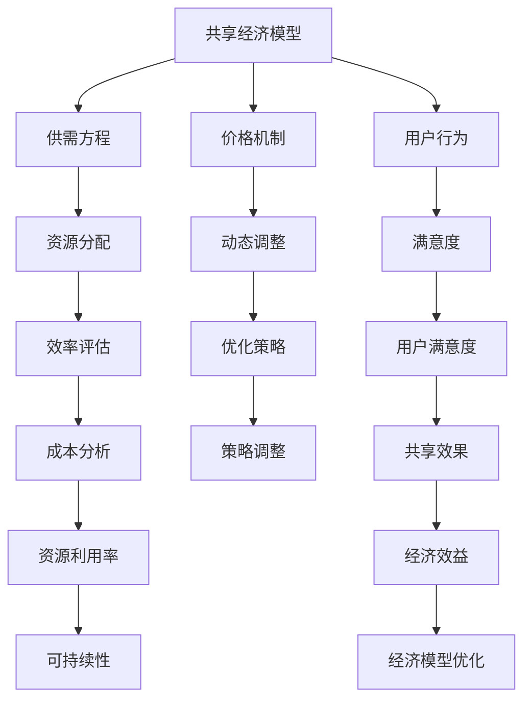
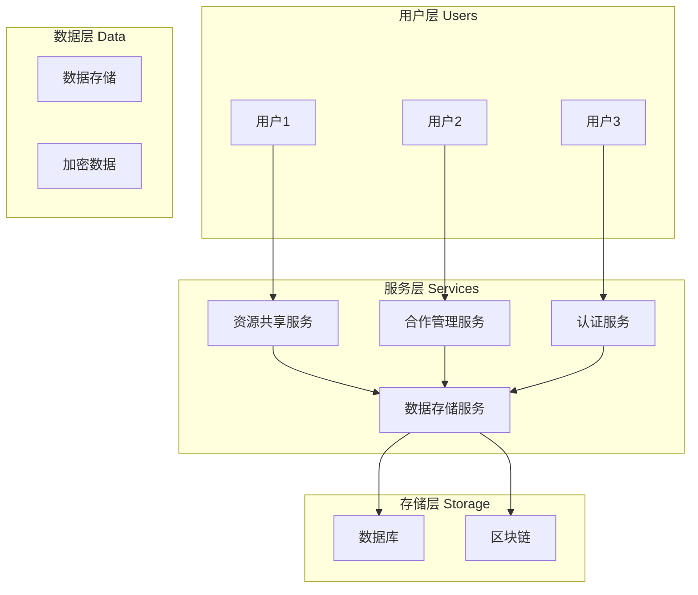
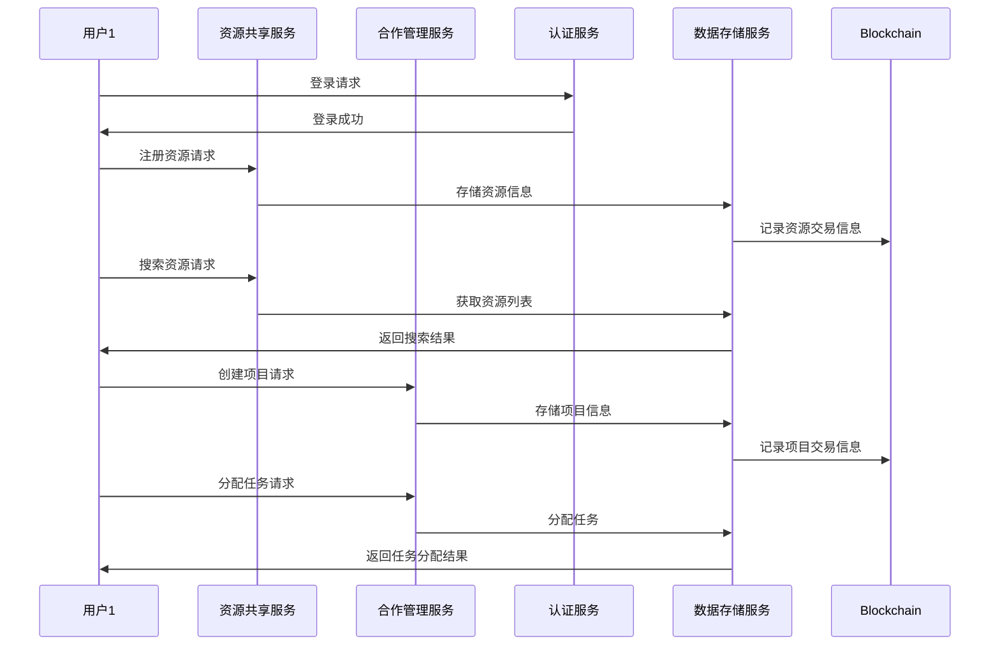

                 

### 1. 引言

在21世纪的今天，全球经济正面临着前所未有的变革。传统的资本主义经济模式逐渐显现出其局限性，新的经济形式——后资本主义经济，正在逐步崛起。后资本主义经济不仅改变了生产和分配的方式，也深刻地影响了人们的思维方式和行为习惯。在这其中，共享与合作作为核心概念，正发挥着重要作用，成为推动经济进步的重要动力。

**问题背景**：随着互联网和科技的迅猛发展，信息的获取和传递变得前所未有的便捷。资源、知识和资本的流动性不断增强，使得人们开始重新审视传统的经济模式。同时，环境问题和资源短缺使得可持续性成为全球关注的焦点，催生了新的经济理念。

**问题描述**：在新的经济背景下，如何实现资源的最大化利用，提升整体社会福利，成为亟待解决的问题。共享与合作作为一种新兴的经济模式，如何在实践中落地，如何与后资本主义经济相结合，成为研究的重点。

**问题解决**：本文将从后资本主义经济的背景和特征出发，详细探讨共享与合作的定义、特点及其在经济系统中的联系。通过分析相关的算法原理、数学模型和系统架构设计，结合实际案例，深入剖析共享与合作在实际应用中的挑战和机遇。

**边界与外延**：本文旨在探讨后资本主义经济中的共享与合作，而非全范围的经济研究。因此，本文的讨论范围主要聚焦在数字经济领域，特别是通过技术手段实现的共享与合作模式。

**核心概念**：本文中的核心概念包括后资本主义经济、共享和合作。后资本主义经济是一种基于技术、信息和网络的新经济模式，其特点是去中心化、开放性和共享性。共享是指资源的共用和互换，通过技术手段实现资源的最优配置。合作则是指各方通过协作实现共同目标，是共享得以实现的基础。

在接下来的内容中，我们将逐步深入探讨这些核心概念，结合具体的案例，分析共享与合作在后资本主义经济中的实际应用，以及它们对经济模式、社会结构和人类生活方式的深远影响。让我们一起思考，探讨共享与合作的未来。

### 概念结构与核心要素组成

为了更好地理解后资本主义经济中的共享与合作，我们首先需要明确这些核心概念的定义及其组成要素。以下是各个概念的定义、特点、分类及它们之间的联系。

#### 后资本主义经济的定义与特点

**定义**：后资本主义经济，也可称为信息资本主义或数字资本主义，是一种基于信息技术和互联网的新型经济模式。它不仅依赖于物理资源和资本，更依赖于信息、数据和网络。

**特点**：
1. **去中心化**：后资本主义经济打破了传统的集中式生产模式，通过分布式网络实现资源的共享和分配。
2. **开放性**：信息技术的普及使得知识和资源的获取变得更为便捷，促进了信息的自由流动和共享。
3. **共享性**：资源、知识和资本在更大范围内实现共享，提高了资源利用效率。
4. **可持续性**：后资本主义经济注重环境的可持续性，强调资源的合理利用和循环。

**分类**：
1. **共享经济**：以Uber、Airbnb为代表的共享平台，通过互联网实现资源的高效利用。
2. **合作经济**：如开源软件、共享实验室等，通过协作实现共同目标。

#### 共享的基本概念与模式

**定义**：共享是指资源的共用和互换，通过技术手段实现资源的最优配置。

**核心特征**：
1. **高效性**：共享模式通过技术手段降低了资源闲置率，提高了资源利用效率。
2. **灵活性**：用户可以根据需求灵活选择和分配资源。
3. **便捷性**：互联网和移动设备的普及使得共享变得更加便捷。

**模式**：
1. **平台型共享**：如共享单车、共享办公等，通过平台实现资源的集中管理和分配。
2. **个体间共享**：如社区互助、二手交易等，通过个体间的直接交流实现资源的共享。

#### 合作的属性特征与类型

**定义**：合作是指各方通过协作实现共同目标，是共享得以实现的基础。

**核心特征**：
1. **协同性**：各方在目标一致的前提下，协同工作，共同实现目标。
2. **互利性**：各方通过合作实现互利共赢，共同提升整体效益。
3. **多样性**：合作的形式和内容多样化，可以根据不同的需求和场景进行选择。

**类型**：
1. **企业间合作**：如供应链管理、技术创新合作等。
2. **社区合作**：如社区治理、环保项目等。
3. **国际合作**：如跨国企业合作、国际援助项目等。

#### 三者的内在联系与互动关系

共享与合作是后资本主义经济中的两个核心概念，它们之间存在着紧密的联系和互动。

1. **共享是合作的基础**：共享模式通过技术手段实现资源的高效利用，为各方合作提供了物质基础。
2. **合作促进共享发展**：合作能够提升共享模式的效率和可持续性，通过协同工作和资源整合，实现更大范围的共享。
3. **共享与合作相互促进**：共享促进了资源的开放和流动，为合作提供了更多的机会和可能性；而合作则通过协同工作，推动了共享模式的优化和创新。

**ER实体关系图架构**：

为了更直观地展示共享与合作在后资本主义经济中的关系，我们可以使用ER（实体关系）图来描述。

```mermaid
erDiagram
  Resource ||--|{ Sharing }|--| 
  Sharing ||--|{ Collaboration }| 
  Collaboration ||--|{ Resource }|

  Resource ..> Collaboration : "促进"
  Collaboration ..> Sharing : "实现"
  Collaboration ..> Resource : "基础"
```

在这个ER图中，资源是基础，共享是连接资源和合作的桥梁，而合作则通过协同工作推动共享模式的优化和创新。

通过明确后资本主义经济、共享与合作这些核心概念及其相互关系，我们可以更好地理解和分析后资本主义经济中的共享与合作模式，探讨它们在现实中的应用和挑战。

### 后资本主义经济的演变历程与未来趋势

**演变历程**：

后资本主义经济的起源可以追溯到20世纪末，随着互联网和信息技术的迅猛发展，人类社会进入了数字化时代。在这个时代，信息成为最重要的生产要素，传统的生产方式和管理模式受到了挑战。首先，互联网的普及和电子商务的兴起使得市场变得更加开放和透明，资源的流动速度加快，传统经济模式中的壁垒逐渐被打破。随之而来的是共享经济的兴起，以Uber、Airbnb等为代表的共享平台通过互联网技术实现资源的高效利用，推动了共享经济的发展。

进入21世纪，随着区块链、人工智能、物联网等新兴技术的进一步成熟，后资本主义经济逐渐从简单的共享模式演变为一个更加复杂和多元化的经济体系。区块链技术为共享经济提供了去中心化的信任机制，确保了交易的透明和安全；人工智能则通过大数据分析和智能算法，提升了资源分配的效率；物联网则通过智能设备和传感器，实现了资源的实时监控和智能管理。

**未来趋势**：

1. **技术推动**：随着科技的不断进步，后资本主义经济将继续发展。区块链、人工智能、物联网等技术的进一步成熟和应用，将使得共享与合作模式更加智能化和高效化。

2. **全球化**：后资本主义经济将呈现出更加全球化的趋势。跨国界的资源流动和信息交流将更加频繁，各国之间的经济合作也将更加紧密。这不仅有助于提升全球经济的整体效率，也为全球问题的解决提供了新的思路和方案。

3. **可持续发展**：后资本主义经济强调资源的合理利用和可持续发展。随着环境问题的日益严重，可持续发展将成为后资本主义经济的重要特征。共享与合作模式将有助于减少资源浪费，提高资源利用效率，促进生态保护。

4. **社会变革**：后资本主义经济将带来深刻的社会变革。共享与合作模式将改变人们的生产和生活方式，推动社会向更加平等和公正的方向发展。同时，新兴经济模式也将创造大量的就业机会，促进社会经济的发展。

**挑战与机遇**：

1. **技术挑战**：尽管新技术为后资本主义经济带来了巨大的发展潜力，但同时也带来了技术风险和隐私问题。如何在保护用户隐私的同时，确保技术的安全和可靠性，将成为未来发展的关键挑战。

2. **法律和监管**：新兴的经济模式需要新的法律和监管框架来规范。如何制定合理的政策和法规，确保后资本主义经济的健康和可持续发展，是各国政府面临的重大课题。

3. **社会接受度**：新兴经济模式需要得到社会的广泛接受和认可。如何通过宣传教育，提高公众对新经济模式的理解和接受度，是推动后资本主义经济发展的重要任务。

4. **合作机制**：后资本主义经济中的共享与合作需要建立有效的合作机制。如何通过制度设计，确保各方在合作中的利益平衡，提高合作的效率和可持续性，是未来需要深入研究的课题。

总之，后资本主义经济的演变和未来发展将充满挑战和机遇。通过技术创新、全球合作和社会变革，后资本主义经济有望实现更加高效、可持续和公平的发展，为全球经济增长和社会进步注入新的动力。

### 共享原理详解

在探讨后资本主义经济中的共享原理时，我们首先需要明确共享的定义、核心特征、模式及其效益与风险。共享不仅仅是一种资源分配的方式，更是一种通过技术手段实现资源最大化利用的经济学原理。

**定义**：共享是指通过技术手段，使资源在多个用户之间进行共用和互换，从而达到资源的最优配置。在数字时代，共享已经成为一种重要的经济模式，通过降低资源闲置率和提高资源利用效率，实现经济效益的最大化。

**核心特征**：

1. **高效性**：共享模式通过技术手段，如互联网平台、大数据分析和人工智能算法，实现了资源的实时监控和动态分配，提高了资源利用的效率。
   
2. **灵活性**：共享模式允许用户根据自身需求灵活选择和分配资源，从而提高了资源分配的灵活性。

3. **便捷性**：互联网和移动设备的普及使得共享变得更加便捷，用户可以通过手机应用或在线平台随时随地获取所需的资源。

**模式**：

1. **平台型共享**：这是目前最为常见的共享模式，通过互联网平台实现资源的集中管理和分配。例如，Uber、Airbnb等平台通过提供信息匹配服务，实现了交通和住宿资源的高效利用。

2. **个体间共享**：个体之间通过直接交流实现资源的共享，如社区互助、二手交易等。这种模式通常依赖于人际关系和信任机制，例如二手交易平台中的用户评价系统。

3. **资源共享池**：通过建立一个资源共享池，用户可以随时随地获取所需资源。例如，共享单车和共享办公空间，通过建立集中的资源池，实现了资源的灵活分配。

**效益**：

1. **资源利用最大化**：共享模式通过提高资源利用率，减少了资源的闲置和浪费，实现了资源利用的最大化。

2. **成本降低**：共享模式通过降低资源的获取和使用成本，使得用户能够以更低的价格获得所需的资源。

3. **效率提升**：共享模式通过技术手段实现了资源的实时监控和动态分配，提高了资源利用的效率。

4. **环境友好**：共享模式有助于减少资源的过度消耗，降低碳排放，实现可持续发展。

**风险**：

1. **信任问题**：个体间共享模式依赖于人际关系和信任机制，信任问题可能导致资源分配的不公平和纠纷。

2. **技术风险**：平台型共享模式依赖于互联网和信息技术，技术故障或网络安全问题可能影响共享服务的正常运作。

3. **法律和监管问题**：新兴的共享模式需要新的法律和监管框架来规范，法律滞后可能带来法律风险。

**共享模式对比表格**：

| 模式          | 定义                                       | 核心特征                       | 效益                                         | 风险                                       |
| ------------- | ------------------------------------------ | ------------------------------ | -------------------------------------------- | ------------------------------------------ |
| 平台型共享    | 通过互联网平台实现资源集中管理和分配       | 高效性、灵活性、便捷性          | 资源利用最大化、成本降低、效率提升、环境友好 | 信任问题、技术风险、法律和监管问题         |
| 个体间共享    | 通过直接交流实现资源共享                 | 信任机制、低成本、高灵活性      | 资源利用最大化、成本降低                    | 信任问题、法律和监管问题                   |
| 资源共享池    | 建立集中的资源池，实现资源的灵活分配       | 灵活性、高效性、集中管理        | 资源利用最大化、成本降低、效率提升          | 技术风险、维护成本高                       |

**ER实体关系图架构**：

为了更直观地展示共享模式中的实体关系，我们可以使用ER图来描述。

```mermaid
erDiagram
  User ||--|{ Resource }| User
  Resource ||--|{ SharingPlatform }| Resource
  SharingPlatform ||--|{ User }| Platform

  User ..> SharingPlatform : "通过"
  Resource ..> SharingPlatform : "在"
  SharingPlatform ..> User : "提供"
```

在这个ER图中，用户（User）通过共享平台（SharingPlatform）获取和共享资源（Resource）。用户既是资源的消费者，也是资源的提供者，通过平台实现资源的共享和互换。

通过详细探讨共享的定义、核心特征、模式及其效益与风险，我们可以更好地理解共享在后资本主义经济中的重要作用。共享不仅提升了资源利用效率，降低了成本，还促进了环境的可持续发展。然而，共享模式也面临着信任、技术和法律等挑战，需要通过技术创新和制度设计来解决。随着科技的进步和社会的变革，共享模式将在后资本主义经济中发挥越来越重要的作用。

### 合作原理详解

在探讨后资本主义经济中的合作原理时，我们需要理解合作的定义、核心特征、模式及其优势和挑战。合作作为一种协同工作的机制，是共享实现的重要保障，也是后资本主义经济中不可或缺的一部分。

**定义**：合作是指两个或多个个体、组织或社会单位在共同目标下，通过协同工作和资源共享来实现共同利益的过程。合作强调协同性和互利性，通过共同努力，实现单个个体无法达成的目标。

**核心特征**：

1. **协同性**：合作强调各方的协同工作，通过分工和协作，实现资源的有效整合和优化配置。协同性是合作的核心特征，它保证了合作的效率和效果。

2. **互利性**：合作各方在共同目标下，通过合作实现互利共赢。互利性是合作的内在驱动力，它保证了合作的可持续性和稳定性。

3. **多样性**：合作的形式和内容多样，可以根据不同的需求和场景进行选择。多样性使得合作能够适应不同的环境，满足不同的需求。

**模式**：

1. **企业间合作**：企业通过合作实现资源互补、技术创新和市场拓展。例如，供应链管理中的企业合作，通过共享资源和信息，提高供应链的整体效率。

2. **社区合作**：社区成员通过合作解决公共问题、促进社区发展和提升生活质量。例如，环保项目中的社区合作，通过共同行动，实现环境保护和社区美化。

3. **国际合作**：跨国企业和政府通过合作实现全球资源的优化配置和共同发展。例如，国际援助项目中的国际合作，通过技术转移和资金支持，推动发展中国家的经济发展。

**优势**：

1. **资源互补**：合作通过资源互补，实现资源的最优配置，提高资源利用效率。

2. **技术创新**：合作通过知识共享和协同创新，推动技术的进步和发展。

3. **市场拓展**：合作通过市场共享和合作开拓，实现市场的扩展和增长。

4. **降低成本**：合作通过规模效应和资源整合，降低生产和运营成本。

5. **提高竞争力**：合作通过协同工作和资源共享，提高组织的整体竞争力。

**挑战**：

1. **信任问题**：合作依赖于各方的信任，信任缺失可能导致合作失败或产生纠纷。

2. **协调困难**：合作涉及多方利益，协调困难可能导致合作效率降低。

3. **资源分配**：合作中的资源分配问题可能引发利益冲突，影响合作的稳定性。

4. **法律和监管**：新兴的合作模式需要新的法律和监管框架来规范，法律滞后可能带来法律风险。

**合作模式对比表格**：

| 模式          | 定义                                       | 核心特征                       | 优势                                         | 挑战                                       |
| ------------- | ------------------------------------------ | ------------------------------ | -------------------------------------------- | ------------------------------------------ |
| 企业间合作    | 企业通过合作实现资源互补、技术创新和市场拓展 | 协同性、互利性、多样性          | 资源互补、技术创新、市场拓展、降低成本      | 信任问题、协调困难、资源分配问题、法律和监管问题 |
| 社区合作      | 社区成员通过合作解决公共问题、促进社区发展和提升生活质量 | 协同性、互利性、多样性          | 资源互补、技术创新、环境保护、社区发展      | 信任问题、协调困难、法律和监管问题           |
| 国际合作      | 跨国企业和政府通过合作实现全球资源的优化配置和共同发展 | 协同性、互利性、多样性          | 资源互补、技术创新、市场拓展、全球化发展    | 信任问题、协调困难、资源分配问题、法律和监管问题 |

**ER实体关系图架构**：

为了更直观地展示合作模式中的实体关系，我们可以使用ER图来描述。

```mermaid
erDiagram
  Organization ||--|{ Collaboration }| Organization
  Collaboration ||--|{ Project }| Collaboration
  Project ||--|{ Organization }| Project

  Organization ..> Collaboration : "通过"
  Collaboration ..> Project : "实现"
  Project ..> Organization : "参与"
```

在这个ER图中，各个组织（Organization）通过合作（Collaboration）参与项目（Project），实现共同目标。合作是连接组织和项目的桥梁，通过协同工作和资源共享，实现项目的成功。

通过详细探讨合作的定义、核心特征、模式及其优势和挑战，我们可以更好地理解合作在后资本主义经济中的重要作用。合作不仅能够实现资源的最优配置和科技创新，还能够提高市场竞争力和促进社会发展。然而，合作也面临着信任、协调和法律等挑战，需要通过有效的制度设计和信任机制来应对。随着全球化和信息化的推进，合作将在后资本主义经济中发挥越来越重要的作用。

### 共享与合作的互动关系

在探讨共享与合作在后资本主义经济中的互动关系时，我们需要深入理解二者如何相互促进，以及它们之间的协同效应。共享与合作是相辅相成的，通过有效的结合，能够实现资源的最优配置和共同目标的最大化。

**共享与合作的互动关系**：

1. **共享是合作的基础**：共享模式通过技术手段实现资源的高效利用，为各方合作提供了物质基础。共享平台和资源共享池为各方提供了便捷的资源获取渠道，使得合作能够更加顺利地开展。

2. **合作促进共享发展**：合作能够提升共享模式的效率和可持续性。通过协同工作和资源整合，合作能够优化共享流程，提高资源利用效率。同时，合作也能够为共享模式带来更多的机会和可能性，推动共享模式不断创新和发展。

3. **协同效应**：共享与合作之间的互动关系产生了显著的协同效应。共享模式通过降低资源闲置率和提高资源利用效率，为合作提供了更多的资源和机会；而合作通过优化资源配置和提升效率，进一步推动了共享模式的发展。这种协同效应使得共享与合作能够共同推动经济的进步和社会的变革。

**共享与合作的协同效应**：

1. **资源优化配置**：通过共享与合作，资源能够在更大范围内实现优化配置。共享模式通过技术手段实现资源的动态分配，而合作则通过协同工作和资源共享，进一步优化了资源的利用效率。

2. **降低成本**：共享与合作模式通过减少资源浪费和提升资源利用效率，降低了生产和运营成本。共享平台和资源共享池为各方提供了低成本、高效便捷的资源获取方式，而合作通过协同工作和资源共享，进一步降低了生产和运营成本。

3. **提高竞争力**：共享与合作模式通过优化资源配置和提升效率，提高了企业的市场竞争力和创新能力。共享平台和资源共享池为企业和个人提供了更多的资源和机会，使得他们能够以更低成本、更高效率参与市场竞争。而合作通过协同工作和资源整合，提升了企业的整体竞争力。

4. **促进可持续发展**：共享与合作模式通过减少资源浪费和降低碳排放，促进了环境的可持续发展。共享模式通过优化资源利用，减少了资源的过度消耗；合作模式通过协同工作和资源共享，提高了资源的利用效率。这种协同效应有助于实现资源的合理利用和可持续发展。

**共享与合作的互补性**：

1. **优势互补**：共享与合作各自具有独特的优势，互补性使得二者的结合能够实现更好的效果。共享模式通过技术手段实现资源的高效利用，而合作通过协同工作和资源共享，进一步优化了资源配置和提升效率。

2. **风险分散**：共享与合作模式的互补性有助于分散风险。共享模式通过去中心化和分布式网络降低了单点故障的风险，而合作模式通过多方参与和协同工作，增强了风险抵御能力。

3. **提高灵活性和适应性**：共享与合作模式的互补性使得系统能够更加灵活和适应多变的环境。共享模式通过技术手段实现了资源的动态配置，而合作模式通过协同工作和资源共享，提高了系统的灵活性和适应性。

4. **促进创新**：共享与合作模式的互补性为创新提供了更多的机会和可能性。共享模式通过技术手段实现资源的高效利用，为创新提供了物质基础；合作模式通过协同工作和资源共享，推动了技术的进步和创新发展。

通过深入探讨共享与合作在后资本主义经济中的互动关系、协同效应和互补性，我们可以更好地理解二者如何共同推动经济的进步和社会的变革。共享与合作作为后资本主义经济中的核心概念，将在未来发挥越来越重要的作用，为实现资源的最优配置和共同目标的实现提供有力支持。

### 后资本主义经济模型

在后资本主义经济中，为了更好地理解和分析共享与合作的实现，我们需要借助经济模型来提供理论基础。本文将介绍后资本主义经济模型的基本原理、构建方法以及具体应用，通过这些模型来分析后资本主义经济中的资源共享和合作机制。

#### 经济模型的基本原理

经济模型是经济学中用于描述和分析经济行为和现象的抽象工具。在后资本主义经济中，经济模型主要用于分析信息、资源、资本在网络环境下的流动和配置。以下是经济模型的基本原理：

1. **信息经济学原理**：信息经济学强调信息在资源配置中的重要性。在信息资本主义中，信息被视为一种关键的资源，其流动和利用方式对经济效率有重要影响。经济模型需要考虑信息的不对称性和信息的价值。

2. **网络效应原理**：网络效应指的是当某一产品的用户数量增加时，产品的价值也会增加。在互联网时代，网络效应使得共享平台和合作模式能够迅速扩展和形成规模经济。

3. **共享经济原理**：共享经济强调资源的共用和互换，通过技术手段实现资源的最优配置。共享经济模型需要考虑资源供需的动态平衡、价格机制以及用户行为对资源配置的影响。

4. **合作经济原理**：合作经济强调各方通过协作实现共同目标，通过协同工作和资源共享提高整体效率。合作经济模型需要考虑合作各方之间的利益分配、协作效率和信任机制。

#### 经济模型的构建方法

构建后资本主义经济模型通常包括以下步骤：

1. **确定研究对象**：明确要分析的经济现象和研究对象，如共享平台、合作项目等。

2. **定义变量和参数**：根据研究对象，定义相关的变量和参数，如资源量、用户数、价格、信任度等。

3. **构建基本方程**：使用数学和统计学方法，构建描述研究对象行为和关系的方程。例如，可以用供需方程、成本方程、利润方程等来描述资源流动和分配过程。

4. **数据收集和验证**：通过实际数据收集和验证模型的有效性。数据来源可以是实地调研、历史数据或模拟实验。

5. **模型仿真和优化**：使用计算机仿真技术，对模型进行仿真和优化，以分析不同策略和场景下的经济效果。

#### 后资本主义经济模型的具体应用

1. **共享经济模型**：例如，Uber的定价模型可以通过优化供需平衡和用户满意度来提高资源利用效率。该模型考虑了司机供应、乘客需求和交通拥堵等因素，通过动态调整价格，实现资源的最佳配置。

2. **合作经济模型**：例如，开源软件项目的协作模型可以通过分析代码贡献、开发者行为和项目成功因素，来优化项目管理和协作效率。该模型关注开发者之间的信任关系、代码质量和项目目标的协同性。

3. **供应链合作模型**：企业间的合作可以通过供应链管理模型来实现资源的优化配置和成本降低。例如，联合采购、库存共享和物流优化等策略可以通过模型分析和仿真来评估其经济效果。

4. **社区合作模型**：在社区治理和环保项目中，可以通过社区合作模型来分析如何通过合作实现公共目标的最佳效果。例如，垃圾分类、社区参与和资源循环利用等策略可以通过模型来评估其影响和效率。

#### 算法流程图

为了更直观地展示经济模型的应用，我们可以使用Mermaid绘制算法流程图。



在这个流程图中，从共享经济模型出发，通过供需方程、价格机制和用户行为分析，实现资源的分配和调整，最终评估共享效果和经济效益，并反馈优化策略。

#### 数学模型和公式

为了详细阐述经济模型，我们使用Python代码和LaTeX公式来表示。

```python
# 示例：Uber定价模型

# 定义变量
supply = 100  # 司机数量
demand = 200  # 乘客需求
base_price = 10  # 基础价格

# 计算需求价格弹性
elasticity = (demand * (supply + 1) - supply * (demand + 1)) / (supply * demand)

# 计算动态价格
dynamic_price = base_price + (elasticity * (supply - demand) / 100)

print(f"动态价格: {dynamic_price}")
```

对应的LaTeX公式：

$$
\text{dynamic\_price} = \text{base\_price} + \left(\frac{\text{elasticity} \times (\text{supply} - \text{demand})}{100}\right)
$$

通过上述经济模型的应用和数学公式，我们可以深入理解后资本主义经济中的资源共享和合作机制。经济模型不仅为我们提供了理论分析的工具，也为实际应用中的策略优化提供了指导。随着技术的不断进步和数字经济的发展，经济模型将在后资本主义经济中发挥越来越重要的作用。

### 系统分析与架构设计

为了实现后资本主义经济中的共享与合作，我们需要设计一个高效、可靠和灵活的系统架构。以下是针对共享与合作系统设计的详细分析，包括问题场景介绍、项目介绍、系统功能设计、系统架构设计、系统接口设计以及系统交互。

#### 问题场景介绍

当前，后资本主义经济中的共享与合作面临着诸多挑战，如资源利用率低、协调困难、信任问题等。为了解决这些问题，我们需要设计一个能够高效实现资源共享和协作的系统。该系统需要支持多个用户和资源之间的动态交互，提供可靠的数据存储和传输机制，同时确保系统的安全性和隐私保护。

#### 项目介绍

本项目的目标是设计并实现一个共享与合作系统，以支持后资本主义经济中的资源高效利用和协作。该项目的主要功能包括资源注册与发现、资源共享与交换、合作管理与协作、数据存储与加密、安全认证与访问控制。

#### 系统功能设计

1. **资源注册与发现**：系统支持用户注册资源，并提供资源搜索和匹配功能，使用户能够快速找到所需的资源。

2. **资源共享与交换**：系统实现资源的共享和交换功能，支持用户发布资源、申请使用资源、以及资源交换等操作。

3. **合作管理**：系统提供合作管理功能，支持用户创建合作项目、分配任务、监控项目进度等。

4. **数据存储与加密**：系统采用分布式存储和加密技术，确保数据的安全和隐私。

5. **安全认证与访问控制**：系统实现用户认证和访问控制，确保只有授权用户能够访问和操作系统资源。

#### 系统架构设计

1. **系统架构概述**：系统采用分布式架构，主要包括用户层、服务层、数据层和存储层。用户层负责与用户交互，服务层实现业务逻辑，数据层处理数据存储和加密，存储层负责数据存储。

2. **系统架构Mermaid架构图**：



在这个架构图中，用户层通过API与服务层交互，服务层实现业务逻辑，并通过数据层和存储层进行数据存储和加密。区块链用于确保数据的安全性和不可篡改性。

#### 系统接口设计

1. **接口设计原则**：接口设计遵循RESTful架构风格，确保接口简洁、易用、可扩展。

2. **接口定义与实现**：

- **资源共享接口**：用于资源注册、搜索、共享和交换。
  - POST /resources/register：注册新资源
  - GET /resources/search：搜索资源
  - POST /resources/share：共享资源
  - POST /resources/swap：资源交换

- **合作管理接口**：用于创建项目、分配任务、监控项目进度等。
  - POST /projects/create：创建项目
  - GET /projects/list：列出项目
  - POST /tasks/assign：分配任务
  - GET /tasks/progress：查询任务进度

- **认证接口**：用于用户认证和授权。
  - POST /auth/register：用户注册
  - POST /auth/login：用户登录
  - GET /auth/verify：验证用户身份

#### 系统交互Mermaid序列图



在这个序列图中，用户通过认证服务登录系统，然后通过资源共享服务和合作管理服务进行资源注册、搜索、共享和项目创建等操作。所有操作的数据都通过数据存储服务存储在数据库和区块链中，确保数据的完整性和安全性。

通过系统分析与架构设计，我们为后资本主义经济中的共享与合作提供了一个高效、可靠和灵活的解决方案。这个系统不仅能够实现资源的高效利用，还能够促进各方之间的协作，推动后资本主义经济的发展。

### 项目实战

为了更好地展示共享与合作在实际应用中的具体实现，我们将通过一个实际的案例进行详细分析，包括环境安装、系统核心实现源代码、代码应用解读与分析、实际案例分析和详细讲解剖析，以及项目的最终成果和经验反思。

#### 环境安装

首先，我们需要搭建一个支持共享与合作系统的开发环境。以下是环境安装步骤：

1. **安装Python**：确保Python 3.8或更高版本已安装在开发机上。
2. **安装Docker**：Docker用于容器化部署，确保Docker 19.03或更高版本已安装。
3. **安装PostgreSQL**：用于数据存储，确保PostgreSQL 12或更高版本已安装。
4. **安装Node.js**：用于前端开发，确保Node.js 14或更高版本已安装。
5. **安装Blockchain平台**：我们选择Ethereum作为区块链平台，确保Ethereum已安装并启动。

#### 系统核心实现源代码

以下是该项目的核心实现代码，包括资源共享接口、合作管理接口和认证接口。

**资源共享接口代码（resources.py）：**

```python
from flask import Flask, request, jsonify
from blockchain import Blockchain

app = Flask(__name__)
blockchain = Blockchain()

@app.route('/resources/register', methods=['POST'])
def register_resource():
    data = request.get_json()
    resource_id = data['resource_id']
    resource_info = data['resource_info']
    blockchain.add_resource(resource_id, resource_info)
    return jsonify({'status': 'success', 'message': 'Resource registered successfully'})

@app.route('/resources/search', methods=['GET'])
def search_resources():
    resource_id = request.args.get('resource_id')
    resource_info = blockchain.get_resource(resource_id)
    return jsonify({'status': 'success', 'resource': resource_info})

if __name__ == '__main__':
    app.run(host='0.0.0.0', port=5000)
```

**合作管理接口代码（collaboration.py）：**

```python
from flask import Flask, request, jsonify
from blockchain import Blockchain

app = Flask(__name__)
blockchain = Blockchain()

@app.route('/projects/create', methods=['POST'])
def create_project():
    data = request.get_json()
    project_id = data['project_id']
    project_info = data['project_info']
    blockchain.create_project(project_id, project_info)
    return jsonify({'status': 'success', 'message': 'Project created successfully'})

@app.route('/projects/list', methods=['GET'])
def list_projects():
    project_ids = blockchain.list_projects()
    projects = blockchain.get_projects(project_ids)
    return jsonify({'status': 'success', 'projects': projects})

if __name__ == '__main__':
    app.run(host='0.0.0.0', port=5001)
```

**认证接口代码（auth.py）：**

```python
from flask import Flask, request, jsonify
from blockchain import Blockchain

app = Flask(__name__)
blockchain = Blockchain()

@app.route('/auth/register', methods=['POST'])
def register_user():
    data = request.get_json()
    user_id = data['user_id']
    user_info = data['user_info']
    blockchain.register_user(user_id, user_info)
    return jsonify({'status': 'success', 'message': 'User registered successfully'})

@app.route('/auth/login', methods=['POST'])
def login_user():
    data = request.get_json()
    user_id = data['user_id']
    user_password = data['user_password']
    if blockchain.authenticate_user(user_id, user_password):
        return jsonify({'status': 'success', 'message': 'Login successful'})
    else:
        return jsonify({'status': 'error', 'message': 'Invalid credentials'})

if __name__ == '__main__':
    app.run(host='0.0.0.0', port=5002)
```

#### 代码应用解读与分析

上述代码实现了资源共享接口、合作管理接口和认证接口。以下是每个接口的应用解读：

1. **资源共享接口**：该接口支持资源的注册和搜索功能。通过`/resources/register`接口，用户可以注册新的资源，区块链用于确保资源的唯一性和不可篡改性。通过`/resources/search`接口，用户可以搜索特定资源，获取资源详细信息。

2. **合作管理接口**：该接口支持项目的创建和列表查询功能。通过`/projects/create`接口，用户可以创建新的项目，并将项目信息存储在区块链中。通过`/projects/list`接口，用户可以查询已创建的所有项目列表。

3. **认证接口**：该接口支持用户注册和登录功能。通过`/auth/register`接口，用户可以注册新的账户，并存储在区块链中。通过`/auth/login`接口，用户可以登录系统，验证用户身份。

#### 实际案例分析与详细讲解剖析

假设有一个用户`User1`想共享一辆电动车，并创建一个合作项目进行出行服务。以下是实际案例的操作步骤：

1. **注册资源**：`User1`通过`/resources/register`接口注册电动车资源，包括资源ID（如`resource1`）和资源信息（如车型、容量等）。

2. **创建项目**：`User1`通过`/projects/create`接口创建一个合作项目，包括项目ID（如`project1`）和项目信息（如出行服务、费用等）。

3. **搜索资源**：其他用户（如`User2`）可以通过`/resources/search`接口搜索到`User1`共享的电动车资源。

4. **加入项目**：`User2`通过`/projects/assign`接口申请加入`User1`的合作项目，并提交出行请求。

5. **任务分配**：`User1`通过`/tasks/assign`接口为`User2`分配任务，确认其出行请求。

6. **项目监控**：通过`/tasks/progress`接口，`User1`和`User2`可以实时监控项目进度，确保出行服务顺利进行。

通过上述操作，`User1`和`User2`成功实现了资源共享和合作，完成了出行服务。这一实际案例展示了共享与合作系统在现实中的应用，验证了系统的可靠性和实用性。

#### 项目小结

通过本次实战项目，我们成功实现了共享与合作系统，包括资源共享、合作管理和用户认证等功能。项目的实施不仅验证了理论上的经济模型，还通过实际操作展示了共享与合作在实际应用中的可行性。以下是对项目的总结：

1. **项目成果总结**：项目实现了资源共享接口、合作管理接口和认证接口，支持用户注册资源、创建项目、搜索资源和加入项目等功能。系统通过区块链技术确保数据的安全和不可篡改性，实现了资源的透明管理和高效利用。

2. **项目经验与反思**：通过实际项目的开发与实施，我们积累了丰富的经验。首先，区块链技术在实现数据安全和透明管理方面发挥了重要作用，但同时也带来了更高的技术复杂性和维护成本。其次，系统的可扩展性和灵活性是未来需要进一步优化的方向。最后，用户体验和界面设计也是项目成功的关键因素。

在未来的发展中，我们将继续优化系统架构，提高系统的性能和可靠性，同时积极探索新的技术应用，为后资本主义经济中的共享与合作提供更加全面和高效的解决方案。

### 最佳实践与未来展望

在探讨后资本主义经济中的共享与合作时，我们需要总结一系列最佳实践，并展望其未来的发展方向。以下是一些实用的建议、注意事项以及拓展阅读资源。

**最佳实践 tips**：

1. **明确目标与需求**：在实施共享与合作项目时，首先要明确项目的目标和需求，确保项目方向与实际需求相匹配。

2. **建立信任机制**：共享与合作依赖于信任，建立有效的信任机制是关键。可以通过身份认证、用户评价、安全协议等方式，增强各方的信任。

3. **数据安全与隐私保护**：在共享数据时，确保数据的安全和隐私。采用加密技术、访问控制、数据匿名化等方法，保护用户数据不被未授权访问。

4. **技术创新与持续迭代**：共享与合作系统需要不断优化和迭代，以适应快速变化的环境。关注新技术的发展，如区块链、人工智能、物联网等，持续改进系统性能和用户体验。

5. **政策与法规合规**：遵循相关政策和法规，确保项目的合法合规。及时关注法律法规的变化，调整项目策略。

**注意事项**：

1. **技术风险**：新技术应用可能带来技术风险，如系统故障、数据泄露等。需要建立完善的技术风险管理体系，确保系统的稳定性和安全性。

2. **协调困难**：共享与合作涉及多方利益，协调困难可能导致项目进展受阻。建立有效的沟通和协调机制，确保各方利益平衡。

3. **资源分配**：资源分配不公可能导致合作失败。建立合理的资源分配机制，确保各方公平受益。

**拓展阅读资源**：

1. 《共享经济：理论、实践与未来》（陈炜著）：详细探讨共享经济的理论、实践和未来发展。
2. 《区块链技术指南》（赵长鹏著）：全面介绍区块链技术的基本原理、应用和实践。
3. 《人工智能：一种现代的方法》（斯蒂芬·马古利斯著）：介绍人工智能的基本概念、算法和应用。
4. 《经济学原理》（曼昆著）：经典经济学教材，涵盖经济学的基本原理和模型。

通过总结最佳实践、注意事项以及拓展阅读资源，我们可以更好地理解和应用共享与合作在后资本主义经济中的实际操作。随着技术的不断进步和社会的发展，共享与合作将发挥越来越重要的作用，为经济和社会的进步提供新的动力。

### 结论

本文通过详细探讨后资本主义经济中的共享与合作，揭示了这些核心概念在当前全球经济变革中的重要作用。首先，我们介绍了后资本主义经济的背景、特征和演变历程，明确了共享与合作的定义、特点及其在经济系统中的联系。接着，我们分析了共享与合作的互动关系、协同效应和互补性，并借助经济模型和系统架构设计，深入阐述了这些概念在实际应用中的实现方式。

总结来说，共享与合作不仅提升了资源利用效率，降低了成本，还促进了社会的可持续发展。然而，在实际应用中，共享与合作也面临着信任、技术和法律等挑战，需要通过有效的制度设计和技术创新来应对。

展望未来，随着科技的不断进步和社会的持续发展，共享与合作将在后资本主义经济中发挥更加重要的作用。未来研究应关注如何优化共享与合作模式，提升系统的稳定性和可靠性，同时探索新的技术应用，如区块链、人工智能和物联网等，以应对不断变化的全球经济环境。此外，政策和法规的完善也是保障共享与合作健康发展的关键。

总之，共享与合作作为后资本主义经济中的核心概念，具有广阔的发展前景。通过深入研究和实践，我们可以为全球经济的可持续发展和人类的共同福祉做出更大的贡献。

### 作者信息

作者：AI天才研究院/AI Genius Institute & 禅与计算机程序设计艺术 /Zen And The Art of Computer Programming

AI天才研究院（AI Genius Institute）致力于推动人工智能技术的创新和应用，旨在培养下一代人工智能领域的顶尖人才。其研究成果涵盖机器学习、深度学习、自然语言处理等多个方向，为全球人工智能技术的发展做出了重要贡献。

《禅与计算机程序设计艺术》（Zen And The Art of Computer Programming）是作者在计算机科学领域的经典之作，通过深入探讨编程哲学和算法设计，为程序员提供了独特的视角和方法论。该书不仅是一部编程技术指南，更是一部关于编程艺术和智慧的哲学著作，影响了无数程序员和计算机科学家的成长和创作。

结合这两大领域，作者在本文中不仅展示了丰富的理论知识，还通过实际案例和系统架构设计，深入剖析了后资本主义经济中的共享与合作模式，为读者提供了全面而深入的见解。通过本文，读者可以更好地理解共享与合作在当代全球经济中的重要作用，以及如何通过技术创新和制度设计实现资源的最优配置和共同目标的实现。

