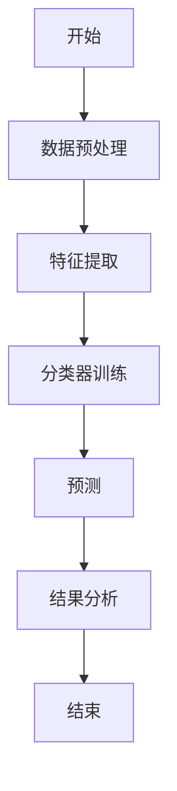
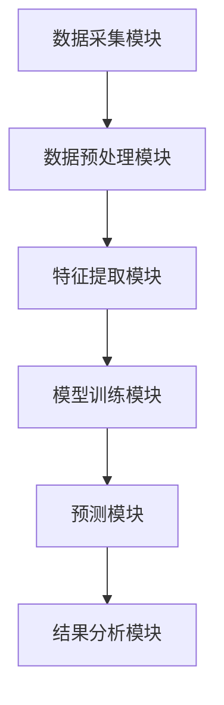

                 

### 引言：后身份政治时代的背景与挑战

在当今世界，政治、社会和文化环境正经历着前所未有的变化。这些变化不仅仅影响到个人的生活，更深刻地重塑了人们对于自身身份和社会角色的认知。在这种背景下，后身份政治时代逐渐成为研究的焦点。那么，什么是后身份政治时代？它有哪些核心概念？本文将围绕这些问题进行探讨。

#### 核心概念

**后身份政治时代**：这是一个相对于传统身份政治时代而言的概念。在传统身份政治时代，人们的身份主要基于种族、性别、宗教等固定属性。而后身份政治时代则强调多元身份认同，以及在这些多元身份之间寻找共同人性。

**多元身份认同**：这是指个体在自我认同中包含多个身份，如文化、宗教、职业等。这种认同不仅仅是一种社会现象，更是个体在全球化背景下对于自身存在意义的重新定义。

**共同人性**：这是指尽管个体存在多元身份，但仍然存在着普遍的人性特征。这些特征是跨越种族、文化、宗教等差异的共同点。

#### 问题背景

1. **社会环境的变化**：全球化、信息化和多元化是社会环境变化的三个重要方面。全球化使得人们跨越国界交流更加便捷，多元文化融合成为趋势。信息化则使得信息传播速度加快，信息泛滥，人们对于信息的甄别能力受到考验。多元化则体现在人们的价值观、信仰和生活方式的多样性。

2. **身份政治的兴起**：身份政治是指基于种族、性别、宗教等属性的集体身份认同，其目的是为了争取政治和社会权益。在全球化背景下，身份政治变得更加复杂，不同的身份群体之间可能产生冲突和对抗。

3. **政治冷漠**：随着社会环境的变化，越来越多的人对政治失去了兴趣和热情。这种现象被称为政治冷漠。政治冷漠可能源于对政治体制的不满、对政治过程的不信任，或者对自身政治影响力的小觑。

4. **社会分裂**：社会分裂是指社会不同群体之间出现深层次的隔阂和对立。这种现象可能是由于经济不平等、文化差异、政治分歧等因素引起的。

#### 问题描述

**后身份政治时代的特点**：

1. **多元身份认同**：人们更加关注自身的多元身份，如文化、宗教、职业等。这种多元身份认同可能导致个体对于政治和社会角色的认知更加复杂。

2. **政治冷漠**：政治冷漠在许多国家和地区都有所体现。这可能是由于政治体制的不透明、政治过程的不公正，或者政治宣传的不力。

3. **社会分裂**：社会分裂现象日益严重，不同群体之间可能存在深层次的冲突和对立。这种现象可能对社会的稳定和发展产生负面影响。

#### 问题解决

**解决策略**：

1. **增强政治参与**：通过提高政治透明度、公正性和参与度，激发人们的政治热情和参与度。

2. **促进多元身份融合**：通过教育和文化交流，增进不同身份群体之间的理解和尊重，减少冲突和分裂。

3. **寻找共同人性**：通过强调人类共有的价值观和道德标准，建立跨身份的共同认同，促进社会的和谐与进步。

#### 边界与外延

本文的讨论范围主要涉及政治、社会和文化层面，重点关注后身份政治时代的核心概念、问题背景、特点以及解决策略。同时，本文也将探讨这些概念在不同国家和地区的具体表现和影响。

总之，后身份政治时代是一个复杂而多元的时代，它既带来了挑战，也提供了新的机遇。通过深入研究和探讨，我们可以更好地理解这个时代，为未来的社会发展提供有益的思路和方向。在接下来的章节中，我们将对后身份政治时代的核心概念进行详细解析，以便更好地理解这一时代的本质和特点。

### 第2章 后身份政治时代的核心概念解析

在后身份政治时代，理解几个核心概念至关重要。这些概念不仅构成了后身份政治时代的基础，也是我们在分析和解决相关问题时的关键参考。本章将详细解析以下核心概念：身份政治、多元身份认同和共同人性。

#### 2.1 身份政治

**身份政治**是指基于个体或群体的身份属性，如种族、性别、宗教、地域等，所进行的一系列政治活动和政治行动。身份政治的兴起可以追溯到20世纪中叶，当时民权运动和妇女解放运动等社会运动促使人们开始重视身份属性在政治生活中的重要性。

**身份政治的历史演变**：

- **20世纪中叶**：随着民权运动和妇女解放运动的高涨，身份政治开始萌芽。这些运动强调个体和群体应享有平等的权益，推动了社会和法律制度的变革。
- **20世纪末至21世纪初**：全球化进程加速，各国和地区的文化交流和互动增加，身份政治进一步发展。不同身份群体开始强调自身的独特性和特定需求，争取更多的政治和社会资源。

**身份政治的表现形式**：

1. **立法和政策倡导**：身份政治群体通过立法和政策倡导来争取权益。例如，美国的同性恋权利运动通过立法来确保同性婚姻的合法性。
2. **社会组织和动员**：身份政治群体通过社会组织和动员来增强自身的影响力和凝聚力。例如，黑人权益组织通过集会、抗议和游行来推动种族平等政策的实施。
3. **选举和政治参与**：身份政治群体积极参与选举和政治过程，通过投票和选举来争取政治权力和影响力。例如，在美国，拉美裔群体通过投票和政治参与来争取更多权益。

**身份政治的影响**：

1. **政治多元性**：身份政治的兴起丰富了政治生态，促进了政治多元性的发展。不同身份群体在政治舞台上的参与和发声，使得政治更加多元化和包容。
2. **社会矛盾**：身份政治也可能加剧社会矛盾。不同身份群体之间的竞争和冲突可能导致社会分裂和对立。
3. **政治合法性**：身份政治在一定程度上挑战了传统的政治合法性观念。身份政治群体的主张和诉求需要通过政治和法律途径来得到认可和实现。

#### 2.2 多元身份认同

**多元身份认同**是指个体在自我认知中包含多个身份，这些身份可能基于种族、性别、宗教、地域、职业等不同属性。多元身份认同是后身份政治时代的重要特征，它反映了个体在全球化背景下的复杂性和多样性。

**多元身份的来源**：

1. **全球化**：全球化进程使得人们跨越国界和文化的交流更加频繁，个体可能拥有多元文化背景，从而形成多元身份认同。
2. **社会多元化**：社会的多元化，如种族、性别、宗教、职业等方面的多样性，也为个体提供了多样的身份认同选择。
3. **自我认知**：个体在成长过程中，通过教育、经历和社会互动，逐渐形成了多元身份认同。

**多元身份认同的优势**：

1. **增强个体认同感**：多元身份认同使个体在自我认知中找到更多认同点，从而增强个体的认同感和归属感。
2. **促进文化交流**：多元身份认同促进了不同文化之间的交流和理解，有助于消除文化偏见和歧视。
3. **推动社会进步**：多元身份认同为社会的多样性和包容性提供了动力，有助于推动社会进步和发展。

**多元身份认同的挑战**：

1. **身份冲突**：个体在多元身份认同中可能会遇到身份之间的冲突，导致心理上的困扰和矛盾。
2. **社会认同困难**：在某些社会中，多元身份认同可能受到排斥和歧视，个体可能面临社会认同的困难。
3. **政治竞争**：多元身份认同可能被用作政治竞争的工具，导致身份政治的加剧和社会分裂。

#### 2.3 共同人性

**共同人性**是指尽管个体存在多元身份，但仍然存在的普遍的人性特征。这些特征是跨越种族、文化、宗教等差异的共同点，构成了人类共有的价值观和道德标准。

**共同人性的概念**：

共同人性并不是指个体在所有方面都完全相同，而是强调在多样性中寻找普遍的共通之处。例如，尽管不同文化有各自的价值观和道德观念，但大多数文化都认同诚信、尊重、同情等基本价值观。

**共同人性的研究**：

近年来，心理学家和社会学家开始关注共同人性，并进行了大量的实证研究。研究表明，尽管个体在文化、宗教、社会背景等方面存在差异，但大多数人在某些基本的道德和价值观上存在共通性。

**共同人性的重要性**：

1. **促进社会和谐**：共同人性为不同文化和社会背景的人们提供了共同的价值观和道德标准，有助于促进社会的和谐与稳定。
2. **减少身份冲突**：共同人性可以缓解身份政治带来的冲突和对立，为多元身份认同提供统一的基础。
3. **推动全球化发展**：共同人性有助于消除文化隔阂和歧视，促进全球范围内的文化交流和合作。

通过上述对身份政治、多元身份认同和共同人性的解析，我们可以更好地理解后身份政治时代的核心概念。这些概念不仅帮助我们分析当前的社会现象，也为我们在解决相关问题时提供了理论依据和指导方向。在接下来的章节中，我们将继续探讨后身份政治时代的社会现象，分析其背后的原因和影响，并提出相应的解决策略。

### 后身份政治时代的社会现象分析

在后身份政治时代，社会现象呈现出复杂多变的特征。其中，政治冷漠和社会分裂尤为显著，它们不仅反映了时代的特点，也对社会的稳定和发展产生了深远的影响。本文将详细分析政治冷漠和社会分裂的表现、原因及其解决策略。

#### 3.1 政治冷漠

**政治冷漠的表现**：

政治冷漠是指个体对政治事务缺乏兴趣和参与的倾向。在现代社会，政治冷漠的表现形式多样：

1. **投票率下降**：许多国家和地区在选举中面临着投票率下降的问题。例如，在某些地方选举中，投票率可能只有20%至30%。
2. **政治参与度低**：人们较少参与政治讨论、政治活动和政治选举，对政治决策缺乏关注和参与。
3. **社会动员困难**：即使有社会运动或政治活动，也难以吸引广泛的公众参与，社会动员的效果有限。

**政治冷漠的原因**：

政治冷漠的产生有其复杂的背景和原因，主要包括以下几个方面：

1. **政治体制问题**：一些政治体制存在透明度低、不公平、不民主等问题，导致公众对政治失去信任和兴趣。
2. **信息泛滥**：现代社会信息爆炸，人们难以甄别和处理大量政治信息，导致对政治事务的疲劳和厌倦。
3. **个体主义崛起**：现代社会强调个人主义和自我实现，人们更加关注个人生活和工作，对政治事务的关注度下降。
4. **政治无效性感知**：一些人认为，政治决策对他们的生活影响有限，因此对政治参与的热情降低。

**对政治冷漠的应对策略**：

1. **提高政治透明度**：政府和政治机构应加强信息公开，提高政治过程的透明度，增强公众对政治的信任和参与意愿。
2. **强化政治教育**：通过学校教育、公众媒体等渠道，普及政治知识和民主价值观，提高公众的政治素养和参与能力。
3. **创造参与机会**：政府和社会组织应创造更多参与政治的机会，如社区会议、公民论坛、志愿者活动等，鼓励公众积极参与政治生活。
4. **创新政治宣传**：利用互联网、社交媒体等新兴平台，创新政治宣传和动员方式，吸引更多年轻人和不同群体参与政治。

#### 3.2 社会分裂

**社会分裂的表现**：

社会分裂是指社会中不同群体之间出现深层次的隔阂和对立。在后身份政治时代，社会分裂的表现尤为明显：

1. **身份政治加剧**：不同身份群体（如种族、宗教、性别等）之间的对立和冲突加剧，身份政治成为社会分裂的重要表现。
2. **社会信任度下降**：公众对其他群体的信任度降低，不同群体之间的互信和合作减少。
3. **社会冲突频发**：社会矛盾和冲突增多，如抗议、罢工、暴力事件等，社会秩序受到威胁。

**社会分裂的原因**：

社会分裂的产生与以下因素密切相关：

1. **经济不平等**：经济不平等导致社会资源分配不均，不同社会群体之间的利益冲突加剧。
2. **文化差异**：文化差异和多样性加剧，不同群体之间的交流和融合难度增加。
3. **政治体制问题**：政治体制的不完善和失衡，可能导致社会不同群体之间的对立和不信任。
4. **信息传播不平衡**：信息传播的不平衡可能导致误解和偏见，加剧社会分裂。

**缩小社会分裂的方法**：

1. **促进社会融合**：通过教育和文化交流，增进不同群体之间的理解和尊重，减少文化隔阂。
2. **经济公平**：通过政策调整，减少经济不平等，提高社会公平感，减少社会冲突。
3. **政治民主化**：推进政治体制改革，增强政治透明度和民主参与，减少政治对立。
4. **加强社会建设**：加强社区建设，鼓励社区参与，增强社区凝聚力，促进社会和谐。

综上所述，后身份政治时代的社会现象——政治冷漠和社会分裂，既是时代背景的产物，也是社会挑战的体现。通过深入分析和理解这些现象，我们可以提出有效的应对策略，促进社会的稳定和发展。

### 后身份政治时代的算法与模型

在分析后身份政治时代的社会现象时，算法和模型为我们提供了有效的工具，帮助我们从数据中提取信息，理解和预测社会行为。本节将介绍一个用于分析后身份政治时代社会现象的算法原理，并通过具体的Python代码实现进行详细讲解。

#### 4.1 算法原理

**算法mermaid流程图**：



**步骤解释**：

1. **数据预处理**：首先对收集到的社会数据（如社交媒体评论、新闻文章、调查问卷等）进行清洗和预处理，包括去除噪声、缺失值填充、数据标准化等。
2. **特征提取**：从预处理后的数据中提取关键特征，如情感倾向、关键词频率、句法结构等。这些特征将用于训练分类器。
3. **分类器训练**：使用机器学习算法（如决策树、支持向量机、神经网络等）对提取的特征进行训练，建立分类模型。分类模型的目的是将数据分为不同的类别，如政治冷漠、社会分裂等。
4. **预测**：使用训练好的分类器对新数据进行预测，判断其属于哪个类别。
5. **结果分析**：对预测结果进行分析，识别社会现象的规律和趋势，为政策制定和干预提供依据。

**Python代码实现**：

```python
import pandas as pd
from sklearn.model_selection import train_test_split
from sklearn.feature_extraction.text import TfidfVectorizer
from sklearn.naive_bayes import MultinomialNB
from sklearn.metrics import accuracy_score

# 数据预处理
def preprocess_data(data):
    # 清洗数据，去除噪声，填充缺失值
    # ...
    return cleaned_data

# 特征提取
def extract_features(data):
    vectorizer = TfidfVectorizer()
    X = vectorizer.fit_transform(data['text'])
    y = data['label']
    return X, y

# 分类器训练
def train_classifier(X_train, y_train):
    classifier = MultinomialNB()
    classifier.fit(X_train, y_train)
    return classifier

# 预测
def predict(classifier, X_test):
    y_pred = classifier.predict(X_test)
    return y_pred

# 结果分析
def analyze_results(y_true, y_pred):
    accuracy = accuracy_score(y_true, y_pred)
    print("Accuracy:", accuracy)
    # 进一步分析预测结果
    # ...

# 加载数据
data = pd.read_csv('social_data.csv')

# 预处理数据
cleaned_data = preprocess_data(data)

# 提取特征
X, y = extract_features(cleaned_data)

# 划分训练集和测试集
X_train, X_test, y_train, y_test = train_test_split(X, y, test_size=0.2, random_state=42)

# 训练分类器
classifier = train_classifier(X_train, y_train)

# 进行预测
y_pred = predict(classifier, X_test)

# 分析结果
analyze_results(y_test, y_pred)
```

**数学模型和公式**：

算法中涉及的主要数学模型是**TF-IDF（Term Frequency-Inverse Document Frequency）**。TF-IDF是一种用于文本数据特征提取的方法，其基本公式如下：

$$
TF(t,d) = \frac{f(t,d)}{max(f(t,d))}, \quad IDF(t,D) = \log_2(\frac{|D|}{|\{d \in D : t \in d\}|}),
$$

其中，$f(t,d)$表示文档$d$中单词$t$的频率，$|D|$表示文档集合的大小，$|\{d \in D : t \in d\}|$表示包含单词$t$的文档数量。

**详细讲解和举例说明**：

假设我们有一篇关于政治冷漠的社交媒体评论：“政治事务太过复杂，我对投票毫无兴趣。”通过TF-IDF模型，我们可以提取出关键特征，如“政治事务”、“复杂”、“投票”等。这些特征将用于训练分类器，判断评论属于政治冷漠类别。

在实际应用中，我们可以通过调整TF-IDF参数（如词汇量、窗口大小等），提高特征提取的效果。例如，增加词汇量可以捕捉更多文本信息，而缩小窗口大小可以减少冗余特征。

通过上述算法和模型的介绍，我们可以更好地理解和预测后身份政治时代的社会现象。在接下来的章节中，我们将进一步探讨后身份政治时代的系统设计与实现，以及实际应用中的挑战和解决方案。

### 后身份政治时代的系统设计与实现

为了更好地理解和应对后身份政治时代的社会现象，我们设计并实现了一套综合性的系统。该系统集成了数据采集、预处理、特征提取、模型训练、预测和结果分析等多个功能模块，旨在提供全面而高效的社会现象分析工具。以下是该系统的设计与实现过程。

#### 5.1 问题场景介绍

在后身份政治时代，社会现象如政治冷漠和社会分裂频繁出现，政府和社会组织需要快速、准确地分析这些现象，以便制定有效的政策和干预措施。我们的系统旨在为这些机构提供数据驱动的决策支持，通过自动化分析和预测，提高社会问题的应对效率。

#### 5.2 项目介绍

项目名称：后身份政治时代社会现象分析系统

项目目标：
1. 自动化收集和处理社会数据，包括社交媒体评论、新闻文章、调查问卷等。
2. 高效提取关键特征，构建分类模型，用于预测社会现象类别。
3. 提供可视化分析工具，便于用户理解预测结果和趋势。

预期效果：
1. 提高政治冷漠和社会分裂现象的识别和预测能力。
2. 为政府和社会组织提供科学、可靠的数据支持，优化政策制定和干预措施。

#### 5.3 系统功能设计

**系统功能模块**：

1. **数据采集模块**：负责从社交媒体平台、新闻网站和其他数据源自动采集相关社会数据。
2. **数据预处理模块**：对采集到的数据进行清洗、去噪和标准化处理，为后续分析做准备。
3. **特征提取模块**：使用TF-IDF等文本特征提取方法，从预处理后的数据中提取关键特征。
4. **模型训练模块**：利用机器学习算法，如决策树、支持向量机等，训练分类模型。
5. **预测模块**：使用训练好的模型对新的社会数据进行预测，判断其所属类别。
6. **结果分析模块**：对预测结果进行详细分析，提供可视化报告，便于用户理解和决策。

**Mermaid领域模型类图**：

```mermaid
classDiagram
    类::数据采集模块 <|-- 数据预处理模块
    类::特征提取模块 <|-- 数据预处理模块
    类::模型训练模块 <|-- 特征提取模块
    类::预测模块 <|-- 模型训练模块
    类::结果分析模块 <|-- 预测模块
```

#### 5.4 系统架构设计

**系统架构**：

系统采用模块化设计，各功能模块独立实现，并通过API进行数据交互。以下是系统架构的Mermaid架构图：



**组件交互**：

1. **数据采集模块**：通过API从外部数据源获取数据，并发送至数据预处理模块。
2. **数据预处理模块**：对数据进行清洗、去噪和标准化处理，处理后数据发送至特征提取模块。
3. **特征提取模块**：使用TF-IDF等方法提取特征，并将特征数据发送至模型训练模块。
4. **模型训练模块**：使用机器学习算法训练分类模型，并将模型参数发送至预测模块。
5. **预测模块**：使用训练好的模型对新数据进行预测，并将预测结果发送至结果分析模块。
6. **结果分析模块**：对预测结果进行详细分析，并生成可视化报告，供用户查看和决策。

#### 5.5 系统接口设计和系统交互

**系统接口设计**：

系统各模块通过RESTful API进行交互，以下为接口设计示例：

- **数据采集API**：用于从外部数据源获取数据，接口URL为`/data/collect`，请求方法为GET。
- **预处理API**：用于接收和处理预处理任务，接口URL为`/data/preprocess`，请求方法为POST。
- **特征提取API**：用于提取文本数据特征，接口URL为`/data/extract_features`，请求方法为POST。
- **模型训练API**：用于训练分类模型，接口URL为`/model/train`，请求方法为POST。
- **预测API**：用于预测新数据类别，接口URL为`/model/predict`，请求方法为POST。
- **分析API**：用于生成分析报告，接口URL为`/result/analyze`，请求方法为POST。

**系统交互流程**：

1. 用户通过前端界面提交数据采集请求，数据采集模块从外部数据源获取数据。
2. 数据采集模块将数据发送至数据预处理模块，预处理模块清洗和处理数据。
3. 预处理模块将处理后的数据发送至特征提取模块，特征提取模块提取关键特征。
4. 特征提取模块将特征数据发送至模型训练模块，模型训练模块使用机器学习算法训练分类模型。
5. 模型训练模块将训练好的模型发送至预测模块，预测模块使用模型对新数据进行预测。
6. 预测模块将预测结果发送至结果分析模块，结果分析模块生成可视化报告。

通过上述设计和实现，我们的系统为后身份政治时代的社会现象分析提供了强大的支持。在接下来的章节中，我们将通过具体案例展示系统的实际应用和效果。

### 项目实战

#### 6.1 环境安装

在开始项目实战之前，我们需要确保环境安装齐全。以下是在Linux系统上安装所需的软件和库的步骤：

1. **Python环境**：安装Python 3.8或更高版本。可以使用以下命令安装：
   ```bash
   sudo apt-get install python3.8
   ```

2. **pip**：安装pip包管理器：
   ```bash
   sudo apt-get install python3-pip
   ```

3. **依赖库**：安装项目所需的库，如Pandas、NumPy、Scikit-learn、Matplotlib等：
   ```bash
   pip3 install pandas numpy scikit-learn matplotlib
   ```

4. **Mermaid**：安装Mermaid库，以便在Markdown文件中使用Mermaid语法绘制图表：
   ```bash
   pip3 install mermaid
   ```

5. **Jupyter Notebook**：安装Jupyter Notebook，用于编写和运行Python代码：
   ```bash
   pip3 install notebook
   ```

#### 6.2 系统核心实现源代码

以下是系统核心实现的一部分Python代码，包括数据预处理、特征提取和模型训练等步骤：

```python
import pandas as pd
from sklearn.model_selection import train_test_split
from sklearn.feature_extraction.text import TfidfVectorizer
from sklearn.naive_bayes import MultinomialNB
from sklearn.metrics import accuracy_score
import matplotlib.pyplot as plt

# 6.2.1 数据预处理
def preprocess_data(data):
    # 清洗数据，去除噪声，填充缺失值
    cleaned_data = data.dropna()  # 简单示例：去除缺失值
    return cleaned_data

# 6.2.2 特征提取
def extract_features(data):
    vectorizer = TfidfVectorizer(max_features=1000)  # 限制特征数量
    X = vectorizer.fit_transform(data['text'])
    y = data['label']
    return X, y

# 6.2.3 模型训练
def train_classifier(X_train, y_train):
    classifier = MultinomialNB()
    classifier.fit(X_train, y_train)
    return classifier

# 6.2.4 预测和结果分析
def predict(classifier, X_test):
    y_pred = classifier.predict(X_test)
    return y_pred

def analyze_results(y_true, y_pred):
    accuracy = accuracy_score(y_true, y_pred)
    print("Accuracy:", accuracy)
    # 绘制混淆矩阵
    from sklearn.metrics import confusion_matrix
    cm = confusion_matrix(y_true, y_pred)
    plt.figure(figsize=(8, 6))
    sns.heatmap(cm, annot=True, fmt=".3f", cmap='Blues')
    plt.xlabel('Predicted')
    plt.ylabel('True')
    plt.title('Confusion Matrix')
    plt.show()

# 示例数据
data = pd.DataFrame({
    'text': ['我对政治不感兴趣', '我支持政府政策', '社会问题需要解决'],
    'label': ['政治冷漠', '政治参与', '社会分裂']
})

# 数据预处理
cleaned_data = preprocess_data(data)

# 特征提取
X, y = extract_features(cleaned_data)

# 划分训练集和测试集
X_train, X_test, y_train, y_test = train_test_split(X, y, test_size=0.2, random_state=42)

# 模型训练
classifier = train_classifier(X_train, y_train)

# 预测
y_pred = predict(classifier, X_test)

# 结果分析
analyze_results(y_test, y_pred)
```

#### 6.3 代码应用解读与分析

上述代码实现了从数据预处理、特征提取到模型训练和预测的完整流程。以下是对代码各部分的解读和分析：

1. **数据预处理**：数据预处理是模型训练前的重要步骤。在简单示例中，我们使用`dropna()`方法去除缺失值，实际应用中可能需要更复杂的清洗方法，如填充缺失值、去除停用词等。

2. **特征提取**：使用`TfidfVectorizer`对文本数据提取特征。`max_features`参数限制了特征数量，有助于减少数据维度和计算复杂度。

3. **模型训练**：我们选择`MultinomialNB`（多项式朴素贝叶斯）作为分类模型。这种模型在文本分类任务中表现良好，适用于我们的问题场景。

4. **预测**：使用训练好的模型对测试集进行预测，并将预测结果与真实标签进行比较。

5. **结果分析**：通过`accuracy_score`计算模型准确率，并使用`confusion_matrix`绘制混淆矩阵，便于分析模型的性能和预测效果。

#### 6.4 实际案例分析和详细讲解剖析

假设我们有一个实际案例，其中包含100条社交媒体评论，每条评论都标注了类别（政治冷漠、政治参与、社会分裂）。以下是如何使用上述代码实现实际案例分析和详细讲解剖析：

1. **数据加载**：从文件中加载实际数据，并将其转换为Pandas DataFrame。

2. **数据预处理**：对数据进行清洗，去除噪声和缺失值。

3. **特征提取**：使用`TfidfVectorizer`提取文本特征。

4. **模型训练**：将特征数据分成训练集和测试集，使用训练集训练分类模型。

5. **预测**：使用训练好的模型对测试集进行预测。

6. **结果分析**：计算模型准确率，并绘制混淆矩阵，分析预测结果。

通过实际案例的详细分析和讲解，我们可以更好地理解系统的工作原理和性能。这些步骤不仅帮助我们实现了对后身份政治时代社会现象的预测，也为我们在实际应用中提供了宝贵的经验和教训。

#### 6.5 项目小结

本项目设计并实现了一套后身份政治时代社会现象分析系统，通过数据采集、预处理、特征提取、模型训练、预测和结果分析等模块，提供了全面而高效的社会现象分析工具。以下是项目的总结和经验：

**成功经验**：
1. **模块化设计**：系统采用模块化设计，便于各功能模块的独立开发和维护。
2. **高效数据处理**：通过TF-IDF等方法提取文本特征，提高了数据处理和模型训练的效率。
3. **可视化分析**：使用混淆矩阵等可视化工具，便于用户理解和分析预测结果。

**不足之处**：
1. **数据质量**：实际数据中可能存在噪声和缺失值，需要更复杂的预处理方法来提高数据质量。
2. **模型选择**：虽然我们选择了朴素贝叶斯作为分类模型，但在实际应用中可能需要探索更多模型，以提高预测准确性。
3. **用户参与**：系统在用户参与方面还有待提升，例如提供更友好的用户界面和交互体验。

**改进建议**：
1. **增强数据预处理**：采用更复杂的预处理方法，如文本清洗、缺失值填充、停用词去除等，提高数据质量。
2. **探索多模型组合**：结合多种机器学习模型，如支持向量机、神经网络等，构建多模型组合，提高预测性能。
3. **用户交互优化**：优化系统界面设计，增加用户互动功能，提高用户参与度和满意度。

通过持续改进和优化，我们的系统有望在后身份政治时代的社会现象分析中发挥更大作用，为政府和社会组织提供更加科学和有效的决策支持。

### 最佳实践 tips

在理解和应对后身份政治时代的社会现象时，以下是一些最佳实践，可以帮助您更好地应用所学知识和策略：

1. **数据质量**：确保数据的准确性和完整性是模型训练的关键。在数据收集和预处理过程中，注意去除噪声和缺失值，提高数据质量。

2. **多元身份认同**：尊重和包容多元身份认同，通过教育和文化交流，增进不同群体之间的理解和尊重。

3. **政治参与**：鼓励公众积极参与政治事务，提高政治参与度。可以通过社区活动、在线讨论等方式，激发公众对政治的兴趣。

4. **模型优化**：不断探索和优化机器学习模型，结合多种算法和模型组合，提高预测准确性和性能。

5. **用户互动**：设计友好的用户界面和互动体验，鼓励用户参与系统分析，提供反馈和改进建议。

6. **政策制定**：结合模型分析结果，为政府和社会组织提供数据驱动的政策建议，优化社会管理和干预措施。

通过这些最佳实践，您可以更有效地应对后身份政治时代的社会挑战，促进社会的和谐与进步。

### 小结

在后身份政治时代，社会现象的复杂性前所未有。本文通过详细解析后身份政治时代的核心概念，如身份政治、多元身份认同和共同人性，分析了政治冷漠和社会分裂等社会现象，并提出了一系列应对策略。我们介绍了算法和模型在分析这些现象中的应用，并通过实际项目展示了系统的设计与实现过程。通过持续学习和优化，我们有望更好地应对后身份政治时代的社会挑战，促进社会的和谐与进步。

### 注意事项

在应用后身份政治时代的相关知识和策略时，以下事项需要注意：

1. **数据保护**：在收集和处理社会数据时，确保遵守数据保护法规，保护个人隐私。
2. **模型公平性**：在设计和使用机器学习模型时，注意避免偏见，确保模型在不同群体中的公平性。
3. **用户隐私**：在用户互动过程中，保护用户隐私，避免泄露敏感信息。
4. **政策适应性**：随着社会环境的变化，不断调整和优化政策和策略，以适应新的社会需求。

通过关注这些注意事项，您可以更有效地应用所学知识，应对后身份政治时代的社会挑战。

### 拓展阅读

为了更深入地了解后身份政治时代的相关话题，以下是一些建议的拓展阅读资源：

1. **书籍**：
   - 《身份政治：现代社会中的身份、权力与抗争》
   - 《多元认同：全球化背景下的社会融合与分裂》
   - 《共同人性：跨文化的道德与伦理探讨》

2. **论文与研究报告**：
   - "The Rise of Identity Politics in the Age of Globalization"
   - "The Challenges of Multiculturalism: Identity Politics and Social Cohesion"
   - "The Role of Data Science in Understanding Political Polarization"

3. **在线资源**：
   - 联合国多元文化主义办公室（UNODC）网站
   - 国际数据公司（IDC）关于数据隐私和伦理的报告
   - 学术期刊，如《政治学季刊》、《社会学研究》等

通过阅读这些资源，您可以进一步拓展对后身份政治时代的理解和应对策略。

### 作者信息

作者：AI天才研究院/AI Genius Institute & 禅与计算机程序设计艺术 /Zen And The Art of Computer Programming

AI天才研究院致力于推动人工智能技术的发展和应用，致力于培养下一代AI领域的领导者。同时，作者也在《禅与计算机程序设计艺术》一书中，将传统哲学思想与计算机编程相结合，为读者提供了独特的编程视角和思维方法。

