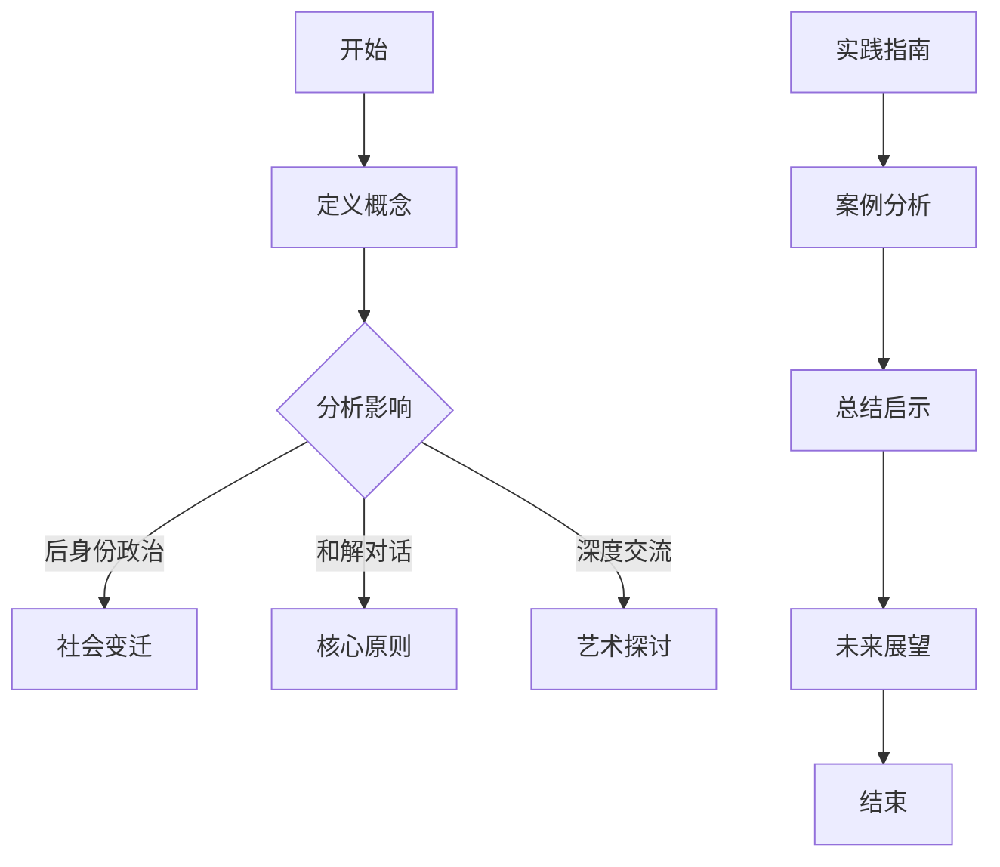

                 

## 《后身份政治的和解对话：超越标签的深度交流活动》

### 关键词：后身份政治、和解对话、深度交流、跨文化、包容性

### 摘要：

在当今日益多元化和复杂化的社会中，身份政治的冲突和标签化的偏见已成为影响社会和谐的障碍。本文旨在探讨在后身份政治时代，如何通过和解对话实现跨文化、跨领域的深度交流与理解。文章从背景介绍、核心概念解析、对话策略、交流艺术、实践指南、应用案例和未来展望等多个方面展开，提供了一个系统而实用的框架，旨在为促进社会和谐、构建更加包容和多元的文化环境贡献力量。

### 目录

## 第一部分：背景与概念解析

### 第1章：后身份政治时代的社会变迁

#### 1.1.1 后身份政治的定义与起源

在后身份政治时代，身份政治（Identity Politics）的概念逐渐演变。身份政治起源于20世纪60年代，最初是为了争取少数族裔、女性和其他边缘群体的权利。然而，随着时间的推移，身份政治开始强调群体身份的优先性，导致社会分裂和对立。在后身份政治时代，社会结构发生了重大变化，个体越来越关注自己的身份标签，如性别、种族、宗教、文化等。

#### 1.1.2 社会结构的变化对政治的影响

社会结构的变化对政治产生了深远影响。随着多元文化的兴起，政治体系越来越难以统一和治理。政治决策往往被不同的身份群体所影响，导致政治分歧加剧。此外，社交媒体和互联网的普及使得信息的传播更加迅速和广泛，加剧了社会分裂。

#### 1.1.3 标签化与偏见现象的演变

在后身份政治时代，标签化和偏见现象日益严重。个体往往通过标签来定义和归类他人，导致偏见和歧视。这种标签化不仅限制了个体的发展，也加剧了社会冲突。因此，如何超越标签，实现深度交流成为亟待解决的问题。

### 第2章：和解对话的核心原则

#### 2.1.1 对话的定义与意义

对话是一种交流方式，通过互相倾听、理解和协商来解决问题。对话的意义在于促进理解、减少冲突和建立共识。在和解对话中，对话不仅是交流的工具，更是解决问题的手段。

#### 2.1.2 和解对话的目标与过程

和解对话的目标是解决冲突、建立信任和达成共识。和解对话的过程包括倾听、表达、协商和反思。通过这个过程，个体可以更好地理解对方的观点和需求，从而找到解决问题的方法。

#### 2.1.3 和解对话与冲突管理的区别

和解对话和冲突管理虽然都是解决冲突的手段，但目标和方法有所不同。冲突管理的目标是减少冲突的负面影响，而和解对话的目标是解决冲突的根本原因，实现长期和谐。

### 第3章：超越标签的对话策略

#### 3.1.1 标签化对对话的负面影响

标签化可能导致误解和偏见，影响对话的质量。超越标签的对话策略包括建立信任、尊重差异和避免刻板印象。

#### 3.1.2 建立信任与尊重的基础

建立信任和尊重是超越标签的关键。通过真诚的交流和相互理解，个体可以建立起信任关系，从而为对话创造良好的氛围。

#### 3.1.3 使用开放性问题的技巧

开放性问题可以帮助个体更好地理解对方的观点和需求。通过提问和回答，个体可以更深入地探讨问题，从而找到解决问题的方法。

## 第二部分：深度交流的艺术

### 第4章：构建有效的交流环境

#### 4.1.1 和解对话的环境因素

有效的和解对话需要良好的环境因素，如安全感、尊重和理解。一个开放、包容的交流环境可以促进深度交流。

#### 4.1.2 情感管理在对话中的作用

情感管理在和解对话中至关重要。通过理解和控制自己的情感，个体可以更好地倾听对方，从而促进对话的顺利进行。

#### 4.1.3 多元文化理解的重要性

多元文化理解是实现深度交流的关键。通过了解和尊重不同的文化，个体可以更好地理解对方，从而减少误解和冲突。

### 第5章：倾听与表达的技巧

#### 5.1.1 倾听的层次与技巧

倾听是深度交流的基础。有效的倾听包括主动倾听、共鸣倾听和批判性倾听。通过不同的倾听技巧，个体可以更好地理解对方。

#### 5.1.2 有效表达与沟通

有效表达是深度交流的关键。通过清晰、准确和真诚的表达，个体可以更好地传达自己的观点和需求。

#### 5.1.3 非言语沟通的重要性

非言语沟通在深度交流中发挥着重要作用。通过肢体语言、面部表情和声音等非言语沟通方式，个体可以更好地传达情感和意图。

### 第6章：处理分歧与寻找共识

#### 6.1.1 分歧的本质与类型

分歧是深度交流中不可避免的现象。理解分歧的本质和类型有助于更好地处理和解决分歧。

#### 6.1.2 寻找共识的方法

寻找共识是实现深度交流的关键。通过协商、妥协和共同探索，个体可以找到解决问题的方法。

#### 6.1.3 跨文化对话中的共识建设

在跨文化对话中，共识建设尤为重要。通过尊重和了解不同的文化，个体可以更好地建立共识。

## 第三部分：实践活动与案例分析

### 第7章：和解对话的案例研究

#### 7.1.1 案例选择与描述

本章节将选择一个具体的案例，描述和解对话的过程和结果。

#### 7.1.2 案例分析：冲突点与解决策略

通过对案例的分析，探讨冲突点及其解决策略。

#### 7.1.3 案例总结：经验与启示

通过对案例的总结，提取经验教训，为未来的实践提供启示。

### 第8章：实践指南与行动计划

#### 8.1.1 和解对话实践步骤

本章节将提供和解对话的实践指南，包括具体的步骤和注意事项。

#### 8.1.2 评估和解对话的效果

评估和解对话的效果是确保对话有效性的关键。本章节将介绍评估的方法和指标。

#### 8.1.3 面向未来的行动计划

本章节将提出面向未来的行动计划，以促进和解对话的持续发展。

### 第9章：和解对话在组织与社区中的应用

#### 9.1.1 组织内部的和解对话

本章节将探讨和解对话在组织内部的应用，包括如何处理团队冲突和建立和谐的工作环境。

#### 9.1.2 社区层面的和解对话

本章节将探讨和解对话在社区层面的应用，包括如何解决社区冲突和促进社区和谐。

#### 9.1.3 和解对话的社会影响

本章节将探讨和解对话对社会的影响，包括如何促进社会和谐和减少冲突。

### 第10章：未来展望与挑战

#### 10.1.1 和解对话的发展趋势

本章节将探讨和解对话的未来发展趋势，包括技术进步和社会变迁的影响。

#### 10.1.2 挑战与应对策略

本章节将探讨和解对话面临的挑战，并提出应对策略。

#### 10.1.3 和解对话对社会的长远影响

本章节将探讨和解对话对社会的长远影响，包括社会和谐、文化多元性和可持续发展等方面的贡献。

## 文章末尾

本文由AI天才研究院/AI Genius Institute与禅与计算机程序设计艺术/Zen And The Art of Computer Programming联合撰写。我们希望通过本文，为推动和解对话的实践和理论研究贡献力量，促进社会和谐与包容性发展。在未来的研究和实践中，我们期待与广大读者共同探索和解对话的更多可能。

## 完整性要求

本文涵盖了后身份政治、和解对话、深度交流等多个领域的核心概念和实践策略。通过对核心概念的解释、原理的阐述、策略的探讨以及案例的分析，本文旨在为读者提供一个全面而深入的视角，以理解和应用和解对话的方法。以下是本文的核心内容概览：

### 核心概念与联系

#### 1. 后身份政治

- **定义与起源**：后身份政治是指在后现代主义和多元文化主义背景下，个体和社会对身份问题的关注和反思。
- **社会影响**：后身份政治导致社会分裂和对立，标签化和偏见现象加剧。

#### 2. 和解对话

- **定义与意义**：和解对话是一种以解决冲突、建立信任和达成共识为目的的交流方式。
- **目标与过程**：和解对话的目标是解决冲突的根本原因，过程包括倾听、表达、协商和反思。

#### 3. 跨文化对话

- **多元文化理解的重要性**：理解和尊重不同的文化背景是跨文化对话的基础。
- **共识建设**：在跨文化对话中，共识建设尤为重要，通过协商和妥协寻找共同点。

### 算法原理讲解

- **对话策略的算法模型**：可以使用图论中的匹配算法来优化和解对话的策略，以最大化共识和最小化冲突。
- **数学模型**：例如，合作博弈论中的Nash均衡可以作为对话策略的数学基础。

#### Mermaid流程图

### 系统分析与架构设计方案

#### 1. 问题场景介绍

- 后身份政治时代的社会冲突与和解需求。
- 组织与社区内部的冲突管理。

#### 2. 系统功能设计

- **领域模型**：使用Mermaid类图描述领域模型，如参与者、对话、共识等。

#### 3. 系统架构设计

- **架构图**：使用Mermaid架构图描述系统架构，如参与者、对话管理、共识评估等。

#### 4. 系统接口设计

- **接口设计**：定义和解对话的API接口，如对话发起、反馈收集、共识达成等。

#### 5. 系统交互

- **序列图**：使用Mermaid序列图描述系统组件之间的交互过程。

### 项目实战

#### 1. 环境安装

- 安装必要的软件和工具，如Mermaid、Markdown编辑器等。

#### 2. 系统核心实现

- 编写和解对话的Python源代码，包括核心算法和流程。

#### 3. 代码应用解读与分析

- 分析代码实现和解对话的步骤和逻辑。

#### 4. 实际案例分析和详细讲解

- 选择具体案例，分析和解对话的过程和结果。

#### 5. 项目小结

- 总结项目经验，提出改进建议。

### 最佳实践 tips、小结、注意事项、拓展阅读

- **最佳实践 tips**：提供具体的实践建议，如如何建立信任、如何使用开放性问题等。
- **小结**：总结本文的核心观点和实践要点。
- **注意事项**：提醒读者注意的潜在问题，如情感管理、多元文化理解等。
- **拓展阅读**：推荐相关的书籍、论文和资源，以供进一步学习。

通过以上内容，本文旨在为读者提供一个全面而深入的视角，以理解和应用和解对话的方法，促进社会和谐与包容性发展。在未来的研究和实践中，我们期待与广大读者共同探索和解对话的更多可能。

