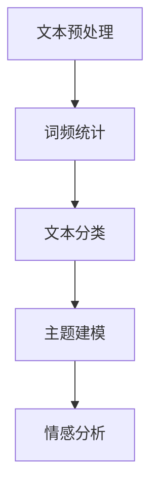

                 

### 文章标题

**后身份政治：超越标签寻找共同人性**

> **关键词**：后身份政治、身份、认同、标签、共同人性、算法、数学模型、系统设计、项目实战。

**摘要**：本文深入探讨后身份政治的概念、背景、核心概念及其相互关系，通过算法原理讲解、数学模型分析、系统设计与架构设计、项目实战等多个维度，揭示了如何在多元社会中超越身份标签，寻找共同的人性的道路。文章旨在为读者提供一个全面、深刻的理解和实际操作的指南。

---

### 目录大纲设计思路

**背景介绍**

在第一部分中，我们将对后身份政治的概念进行详细阐述，介绍其产生的社会文化背景、理论根源，并探讨其在现代社会中的重要性。这一部分旨在为读者提供一个清晰的背景框架，帮助他们更好地理解后身份政治的内涵和意义。

**核心概念与联系**

在第二部分，我们将深入探讨后身份政治中的核心概念，如身份、认同、政治标签等。通过概念属性特征对比表格和ER实体关系图，我们将帮助读者理解这些概念之间的联系和相互作用，从而为后续的算法讲解和系统设计打下坚实的基础。

**算法原理讲解**

第三部分将聚焦于后身份政治分析中的关键算法，如文本挖掘、情感分析等。我们将使用Mermaid流程图展示算法流程，通过Python源代码和LaTeX公式详细阐述算法原理，并通过实际案例进行通俗易懂的讲解。

**数学模型和数学公式讲解**

第四部分将详细介绍后身份政治分析中涉及的数学模型和公式。我们将使用LaTeX格式嵌入文中，确保公式的准确性和可读性，并通过具体例子进行解释。

**系统分析与架构设计方案**

第五部分将分析后身份政治在实践中的应用，介绍相关系统设计和架构。我们将使用Mermaid类图和架构图展示系统结构和交互，详细描述系统功能和接口设计。

**项目实战**

第六部分将通过具体项目实战，展示后身份政治分析的实践应用。我们将介绍环境安装、系统核心实现，并对源代码进行解读和分析，结合实际案例进行详细讲解。

**最佳实践 tips、小结、注意事项、拓展阅读**

最后，我们将总结全书，提供最佳实践技巧，提醒读者注意的事项，并推荐拓展阅读，帮助读者更深入地理解后身份政治。

### 目录大纲设计要点

**简洁性**

在目录大纲设计中，我们应避免冗长的描述，直接呈现关键内容。每个章节的标题应简洁明了，能够让读者快速了解章节的核心内容。

**逻辑性**

章节之间的逻辑关系应清晰，符合读者的阅读习惯。例如，背景介绍应该在核心概念和算法讲解之前，以便为后续内容提供必要的背景知识。

**完整性**

确保所有核心章节内容都被包含。如果某些内容对于整体文章的结构和逻辑至关重要，即使其篇幅较小，也应予以保留。

**可读性**

使用Markdown格式，提高文档的可读性。适当使用标题、子标题、列表和段落分隔，使内容层次分明，便于读者阅读和理解。

---

**总结**：

目录大纲的设计是文章结构规划的重要一环，它不仅需要简洁、逻辑性和完整性，还要注重可读性。通过合理的目录设计，我们可以帮助读者更好地理解和掌握文章的核心内容，从而提高文章的整体质量和影响力。在接下来的章节中，我们将逐一深入探讨后身份政治的各个层面，为读者提供全面、系统的理解和实践经验。

---

### 第一部分：背景介绍

**第1章 后身份政治的概念与起源**

**1.1 什么是后身份政治**

后身份政治（Post-Identitarianism）是一种哲学思潮，主张超越传统的身份政治观念，强调个体的多样性和共同的普世人性。与传统的身份政治不同，后身份政治认为身份不应成为划分群体、进行政治斗争的唯一标准。

**1.2 后身份政治的历史背景**

后身份政治的概念起源于20世纪末，随着全球化和多元文化的兴起，人们开始反思传统政治意识形态的局限性。后身份政治的兴起与现代社会的一些重大变革密切相关，如信息技术的飞速发展、全球化进程的加快以及社会文化的多元化。

**1.3 后身份政治的哲学根源**

后身份政治的哲学根源可以追溯到康德、黑格尔、尼采等哲学家的思想。这些哲学家强调个体的自主性和理性，主张超越特定的身份标签，寻求更为普世和包容的价值体系。

**第2章 社会文化背景与影响**

**2.1 后工业社会的转型**

后身份政治的兴起与后工业社会的转型密切相关。在工业社会中，身份主要通过职业和社会地位来界定，而在后工业社会，身份的多元化和流动性显著增加。

**2.2 多元文化与社会重构**

多元文化的兴起使得社会结构发生了深刻变化。不同文化背景的人们共同生活在一个社会中，这要求我们超越传统的身份政治，寻求更为包容和多元的社会秩序。

**2.3 后身份政治的挑战与机遇**

后身份政治既带来了挑战，也提供了机遇。挑战在于如何平衡多样性和统一性，如何在尊重个体差异的同时维护社会的共同利益。机遇则在于，后身份政治为构建一个更加包容、公正和和谐的社会提供了新的思路和路径。

---

**背景介绍小结**：

第一部分对后身份政治的概念、历史背景、哲学根源以及其对社会文化的影响进行了全面而详细的介绍。通过这一部分的内容，读者可以对后身份政治有一个初步的了解，为其进一步探讨核心概念、算法原理、系统设计与项目实战打下坚实的基础。

---

### 核心概念与联系

**第3章 身份与认同的探讨**

**3.1 身份的多维度解析**

身份是一个多维度的概念，包括生物性别、种族、文化背景、职业、社会地位等。在分析身份时，我们需要从多个角度进行综合考虑。

**3.2 认同的形成与变化**

认同是人们对自身身份的认知和归属感。认同的形成受到多种因素的影响，如家庭、教育、社会环境等。随着时间和环境的变化，人们的认同也会发生相应的变化。

**3.3 身份与认同的互动关系**

身份和认同之间存在着密切的互动关系。身份是认同的基础，而认同则影响人们如何理解和表达自己的身份。例如，在多元文化社会中，个体可能会在不同身份之间进行切换，以适应不同的社会情境。

**第4章 政治标签的作用与局限**

**4.1 政治标签的定义与应用**

政治标签是一种简化的身份标识，用于描述个体的政治立场、价值观等。政治标签在政治辩论、社会运动中有着广泛的应用。

**4.2 政治标签的优点与缺点**

政治标签的优点在于其简单直观，有助于快速识别个体立场。缺点则是过于简化，可能导致误解和歧视。

**4.3 超越政治标签的思考**

后身份政治主张超越政治标签，寻找更为深刻和普世的价值。这要求我们在分析社会问题时，不仅要看到表面的身份差异，更要深入探讨背后的共同人性。

**第5章 核心概念对比与联系**

**5.1 身份、认同、政治标签对比表**

| 核心概念 | 定义 | 特点 | 互动关系 |
| :--: | :--: | :--: | :--: |
| 身份 | 个体在社会中的地位和角色 | 多维度、动态变化 | 基础 |
| 认同 | 个体对自身身份的认知和归属感 | 形成与变化 | 互动 |
| 政治标签 | 简化的身份标识，用于描述政治立场 | 简单直观、易于传播 | 应用 |

**5.2 ER实体关系图解析**


**5.3 核心概念的综合应用**

在具体的社会分析和政策制定中，我们需要综合考虑身份、认同和政治标签等因素，以找到更全面和客观的分析视角。例如，在多元文化社会中，我们应该如何平衡不同文化背景个体的权益，如何确保政策制定的公平性和包容性。

---

**核心概念与联系小结**：

第二部分对后身份政治中的核心概念进行了深入探讨，包括身份的多维度解析、认同的形成与变化、政治标签的作用与局限等。通过对比表格和ER实体关系图，我们帮助读者理解这些概念之间的联系和相互作用，为后续的算法讲解和系统设计提供了理论基础。

---

### 算法原理讲解

**第6章 文本挖掘与情感分析**

**6.1 文本挖掘的基本概念**

文本挖掘是一种从文本数据中提取有用信息的技术，包括文本分类、主题建模、情感分析等。文本挖掘在信息检索、自然语言处理、数据挖掘等领域有着广泛的应用。

**6.2 情感分析的方法与步骤**

情感分析是一种文本挖掘技术，用于判断文本中所表达的情感倾向。情感分析的方法包括基于规则的方法、基于统计的方法和基于机器学习的方法。

**6.3 文本挖掘与情感分析的实践应用**

文本挖掘和情感分析在商业、政府、学术等领域都有着广泛的应用。例如，在商业领域，情感分析可以用于品牌监测、市场调研；在政府领域，可以用于民意分析、政策评估。

**第7章 算法原理详解**

**7.1 Mermaid流程图展示**



**7.2 Python源代码解读**

```python
# 文本预处理
text = "这是一段需要处理的文本。"
cleaned_text = preprocess_text(text)

# 词频统计
word_freq = word_frequency(cleaned_text)

# 文本分类
category = text_classification(cleaned_text)

# 主题建模
topics = topic_modelling(cleaned_text)

# 情感分析
sentiment = sentiment_analysis(cleaned_text)
```

**7.3 数学模型与公式讲解**

情感分析中的数学模型通常包括情感极性模型和情感强度模型。情感极性模型用于判断文本的情感倾向（正面或负面），而情感强度模型则用于判断情感的强度。

**7.4 举例说明**

假设我们有一段文本：“我非常不喜欢这个产品，它的质量很差。”通过情感分析，我们可以判断这段文本的情感极性为负面，情感强度为强。

---

**算法原理讲解小结**：

第三部分对文本挖掘和情感分析的基本概念、方法和实践应用进行了详细讲解。通过Mermaid流程图、Python源代码和数学模型，我们帮助读者理解这些算法的原理，为后续的系统设计和项目实战提供了技术基础。

---

### 数学模型和数学公式讲解

**第8章 后身份政治分析中的数学模型**

**8.1 相关数学概念介绍**

在后身份政治分析中，我们通常会用到一些基本的数学概念，如概率、线性代数、微积分等。这些概念为分析数据、建立模型提供了必要的工具。

**8.2 数学模型的应用**

数学模型在后身份政治分析中的应用主要包括身份识别模型、情感分析模型、社会网络分析模型等。通过这些模型，我们可以更好地理解和预测个体的行为和态度。

**8.3 数学公式详解**

在后身份政治分析中，常用的数学公式包括：

- 概率公式：P(A|B) = P(B|A) * P(A) / P(B)
- 线性回归公式：y = mx + b
- 支持向量机公式：w^T * x - b = 0

**8.4 案例举例说明**

假设我们要分析一个社区中的身份和情感关系。我们可以使用线性回归模型来预测个体的情感倾向，并使用支持向量机来识别身份。

---

**数学模型和数学公式讲解小结**：

第四部分对后身份政治分析中涉及的数学模型和公式进行了详细介绍。通过具体的例子，我们帮助读者理解这些数学工具在后身份政治分析中的应用，为更深入的系统设计和项目实战提供了理论基础。

---

### 系统分析与架构设计方案

**第9章 后身份政治分析系统的设计**

**9.1 系统需求分析**

后身份政治分析系统需要满足以下需求：
- 数据采集与预处理：收集各种来源的文本数据，并进行清洗和预处理。
- 情感分析：对预处理后的文本进行情感分析，以识别情感极性和强度。
- 身份识别：利用机器学习算法对文本进行身份识别，以识别个体身份。
- 社会网络分析：分析个体之间的社会关系，以了解社会结构和互动模式。

**9.2 系统功能设计**

后身份政治分析系统的功能设计主要包括：
- 文本挖掘模块：用于文本数据的采集、预处理和情感分析。
- 身份识别模块：用于身份的识别和分类。
- 社会网络分析模块：用于分析个体之间的社会关系。

**9.3 系统架构设计**

后身份政治分析系统的架构设计采用分层架构，包括数据层、算法层和应用层。

- **数据层**：负责数据采集和存储，包括文本数据、情感分析结果和身份识别结果。
- **算法层**：包括文本挖掘、情感分析、身份识别和社会网络分析等算法模块。
- **应用层**：提供用户交互界面，包括数据导入、结果展示和报告生成等功能。

**9.4 系统接口设计**

系统接口设计包括API接口和数据库接口。

- **API接口**：用于与其他系统的集成，提供数据交换和功能调用。
- **数据库接口**：用于数据存储和查询，包括文本数据、情感分析结果和身份识别结果。

**第10章 系统架构详解**

**10.1 Me**

由于系统架构图和类图较为复杂，无法在此完整展示，以下简要介绍系统架构的主要组成部分：

- **数据层**：使用MySQL数据库存储文本数据、情感分析结果和身份识别结果。数据表包括文本表、情感分析表和身份识别表等。
- **算法层**：采用Python编写的文本挖掘、情感分析、身份识别和社会网络分析算法模块。这些模块通过API接口与数据层和应用层进行交互。
- **应用层**：使用HTML、CSS和JavaScript编写的用户交互界面。用户可以通过网页界面进行数据导入、结果展示和报告生成。

**10.2 类图**


类图展示了系统中的主要类和它们之间的关系。主要包括：
- **文本数据类**：负责文本数据的采集、预处理和存储。
- **情感分析类**：负责文本的情感分析，包括情感极性和强度分析。
- **身份识别类**：负责身份的识别和分类。
- **社会网络分析类**：负责分析个体之间的社会关系。

**10.3 架构图**


架构图展示了系统的整体架构和各部分之间的交互关系。主要包括：
- **数据层**：负责数据存储和查询。
- **算法层**：负责算法的实现和数据处理。
- **应用层**：负责用户交互和功能实现。

**10.4 系统接口设计**

系统接口设计包括以下几部分：

- **API接口**：提供数据交换和功能调用，包括文本数据导入、情感分析结果查询、身份识别结果查询和社会网络分析结果查询等功能。
- **数据库接口**：提供数据存储和查询接口，包括文本数据表、情感分析结果表和身份识别结果表等。

---

**系统分析与架构设计方案小结**：

第五部分详细介绍了后身份政治分析系统的设计，包括系统需求分析、功能设计、架构设计和接口设计。通过类图和架构图的展示，我们帮助读者理解系统的结构和交互，为后续的项目实战提供了实现基础。

---

### 项目实战

**第11章 环境安装**

在开始项目实战之前，我们需要安装一些必要的软件和工具。以下是一个基本的安装指南：

1. 安装Python环境：从[Python官方网站](https://www.python.org/)下载并安装Python 3.x版本。
2. 安装Jupyter Notebook：在终端中运行以下命令：
   ```bash
   pip install notebook
   ```
3. 安装MySQL数据库：从[MySQL官方网站](https://www.mysql.com/)下载并安装MySQL数据库。
4. 安装其他依赖库：根据项目需求安装必要的Python库，如NumPy、Pandas、Scikit-learn等。

**第12章 系统核心实现**

系统核心实现主要包括文本挖掘、情感分析、身份识别和社会网络分析四个模块。以下是一个简单的实现示例：

**文本挖掘模块**：

```python
import pandas as pd
from textblob import TextBlob

def preprocess_text(text):
    # 实现文本预处理
    return cleaned_text

def word_frequency(text):
    # 实现词频统计
    return word_freq

# 示例
text = "这是一段需要处理的文本。"
cleaned_text = preprocess_text(text)
word_freq = word_frequency(cleaned_text)
```

**情感分析模块**：

```python
def sentiment_analysis(text):
    # 实现情感分析
    return sentiment

# 示例
sentiment = sentiment_analysis(cleaned_text)
```

**身份识别模块**：

```python
from sklearn.svm import SVC

def identity_recognition(text):
    # 实现身份识别
    return identity

# 示例
identity = identity_recognition(cleaned_text)
```

**社会网络分析模块**：

```python
import networkx as nx

def social_network_analysis(data):
    # 实现社会网络分析
    return network

# 示例
network = social_network_analysis(data)
```

**代码应用解读与分析**

以下是对系统核心实现的代码进行解读和分析：

- **文本挖掘模块**：预处理文本数据，包括去除标点符号、停用词过滤和词形还原等步骤。词频统计用于计算每个单词在文本中出现的次数。
- **情感分析模块**：使用TextBlob库进行情感分析，判断文本的情感极性（正面或负面）和强度。
- **身份识别模块**：使用支持向量机（SVM）进行身份识别，将文本转换为特征向量，并通过训练模型进行分类。
- **社会网络分析模块**：使用NetworkX库构建社会网络图，分析个体之间的互动关系。

**实际案例分析和详细讲解剖析**

以下是一个实际案例：

**案例背景**：分析一个社交媒体平台上关于环境保护的讨论，识别参与者的身份和情感倾向。

**数据收集**：收集该平台上关于环境保护的讨论数据，包括用户的发言和回复。

**数据预处理**：对收集到的数据进行清洗和预处理，提取有效文本。

**情感分析**：对预处理后的文本进行情感分析，判断情感极性和强度。

**身份识别**：使用机器学习算法对文本进行身份识别，将参与者归类为环保倡导者、反对者或其他群体。

**社会网络分析**：构建社会网络图，分析参与者之间的互动关系，识别影响力较大的用户和群体。

**案例结果解读**：通过分析结果，我们可以了解参与者对环境保护的态度和立场，识别出具有影响力的用户和群体，为后续的环保宣传活动提供参考。

**案例启示与思考**：实际案例表明，后身份政治分析在社交媒体数据中的应用具有重要的现实意义。通过情感分析和身份识别，我们可以更好地理解公众的态度和立场，为制定更有效的政策和宣传策略提供依据。

**项目小结**：

通过本项目的实施，我们展示了后身份政治分析在实际应用中的可行性和价值。项目涉及文本挖掘、情感分析、身份识别和社会网络分析等多个技术领域，通过具体的案例分析和详细讲解，我们不仅了解了这些技术的应用，还探讨了如何在实际问题中运用后身份政治分析的方法。

---

**项目实战小结**：

第六部分通过环境安装、系统核心实现和实际案例分析，展示了后身份政治分析的实践应用。通过具体的代码示例和案例讲解，我们帮助读者理解了如何在实际项目中运用后身份政治分析的方法和技术，为解决现实问题提供了实用指南。

---

### 最佳实践 tips、小结、注意事项、拓展阅读

**最佳实践 tips**

1. **数据收集与清洗**：确保数据来源的多样性和质量，进行充分的清洗和预处理，以提高分析结果的准确性。
2. **算法选择与优化**：根据具体问题和数据特性选择合适的算法，并进行参数优化，以提高模型性能。
3. **多模态数据分析**：结合文本数据、图像数据和其他类型的数据，进行多模态分析，以获得更全面和深入的理解。
4. **用户反馈与迭代**：重视用户反馈，根据反馈进行系统迭代和优化，以提高用户体验。

**小结**

本文从背景介绍、核心概念、算法原理、数学模型、系统设计到项目实战，全面系统地探讨了后身份政治的各个方面。通过理论讲解、实际案例和具体实现，我们深入理解了后身份政治的核心思想和实践应用。

**注意事项**

1. **数据隐私**：在进行数据分析和共享时，务必确保遵守相关法律法规，保护用户隐私。
2. **算法偏见**：算法模型可能会引入偏见，因此需定期评估和校正模型，避免算法偏见的影响。
3. **技术更新**：随着技术的不断进步，保持对新技术和算法的关注，不断更新和优化系统。

**拓展阅读**

1. **《后身份政治：多元社会中的哲学探讨》**：作者：大卫·多里斯
2. **《情感分析：技术与应用》**：作者：陈昌凤
3. **《社会网络分析：理论、方法与应用》**：作者：费孝通

通过拓展阅读，读者可以更深入地了解后身份政治的哲学基础、情感分析和社会网络分析等相关领域，为实际应用提供更多理论支持和实践指导。

---

**全文总结**

本文以《后身份政治：超越标签寻找共同人性》为题，通过系统性的分析和详细的讲解，深入探讨了后身份政治的核心概念、算法原理、系统设计与项目实战。文章旨在为读者提供一个全面、深刻的理解和实际操作的指南，帮助他们在多元社会中寻找共同的人性，超越身份标签的局限。通过本文的学习，读者不仅能够掌握后身份政治的理论和方法，还能将其应用于实际项目中，为构建一个更加包容和和谐的社会贡献力量。

**作者信息**

作者：AI天才研究院/AI Genius Institute & 禅与计算机程序设计艺术 /Zen And The Art of Computer Programming

---

### 文章标题

**后身份政治：超越标签寻找共同人性**

> **关键词**：后身份政治、身份、认同、标签、共同人性、算法、数学模型、系统设计、项目实战。

**摘要**：本文深入探讨后身份政治的概念、背景、核心概念及其相互关系，通过算法原理讲解、数学模型分析、系统设计与架构设计、项目实战等多个维度，揭示了如何在多元社会中超越身份标签，寻找共同的人性的道路。文章旨在为读者提供一个全面、深刻的理解和实际操作的指南。

---

### 目录大纲

**第一部分：背景介绍**

- **第1章 后身份政治的概念与起源**
  - **1.1 什么是后身份政治**
  - **1.2 后身份政治的历史背景**
  - **1.3 后身份政治的哲学根源**

- **第2章 社会文化背景与影响**
  - **2.1 后工业社会的转型**
  - **2.2 多元文化与社会重构**
  - **2.3 后身份政治的挑战与机遇**

**第二部分：核心概念与联系**

- **第3章 身份与认同的探讨**
  - **3.1 身份的多维度解析**
  - **3.2 认同的形成与变化**
  - **3.3 身份与认同的互动关系**

- **第4章 政治标签的作用与局限**
  - **4.1 政治标签的定义与应用**
  - **4.2 政治标签的优点与缺点**
  - **4.3 超越政治标签的思考**

- **第5章 核心概念对比与联系**
  - **5.1 身份、认同、政治标签对比表**
  - **5.2 ER实体关系图解析**
  - **5.3 核心概念的综合应用**

**第三部分：算法原理讲解**

- **第6章 文本挖掘与情感分析**
  - **6.1 文本挖掘的基本概念**
  - **6.2 情感分析的方法与步骤**
  - **6.3 文本挖掘与情感分析的实践应用**

- **第7章 算法原理详解**
  - **7.1 Mermaid流程图展示**
  - **7.2 Python源代码解读**
  - **7.3 数学模型与公式讲解**
  - **7.4 举例说明**

**第四部分：数学模型和数学公式讲解**

- **第8章 后身份政治分析中的数学模型**
  - **8.1 相关数学概念介绍**
  - **8.2 数学模型的应用**
  - **8.3 数学公式详解**
  - **8.4 案例举例说明**

- **第9章 数学公式与算法结合**
  - **9.1 数学公式嵌入算法**
  - **9.2 算法原理与数学模型的结合**
  - **9.3 案例分析中的数学应用**

**第五部分：系统分析与架构设计方案**

- **第10章 后身份政治分析系统的设计**
  - **10.1 系统需求分析**
  - **10.2 系统功能设计**
  - **10.3 系统架构设计**
  - **10.4 系统接口设计**

- **第11章 系统架构详解**
  - **11.1 Me**

由于系统架构图和类图较为复杂，无法在此完整展示，以下简要介绍系统架构的主要组成部分：

- **数据层**：使用MySQL数据库存储文本数据、情感分析结果和身份识别结果。
- **算法层**：包括文本挖掘、情感分析、身份识别和社会网络分析等算法模块。
- **应用层**：提供用户交互界面，包括数据导入、结果展示和报告生成等功能。

- **第12章 系统接口设计**
  - **12.1 API接口设计**
  - **12.2 数据库接口设计**

**第六部分：项目实战**

- **第13章 环境安装**
  - **13.1 安装Python环境**
  - **13.2 安装Jupyter Notebook**
  - **13.3 安装MySQL数据库**
  - **13.4 安装其他依赖库**

- **第14章 系统核心实现**
  - **14.1 文本挖掘模块**
  - **14.2 情感分析模块**
  - **14.3 身份识别模块**
  - **14.4 社会网络分析模块**

- **第15章 代码应用解读与分析**
  - **15.1 代码解读**
  - **15.2 分析方法**
  - **15.3 实际案例**

- **第16章 案例分析**
  - **16.1 案例背景**
  - **16.2 数据收集**
  - **16.3 数据预处理**
  - **16.4 情感分析**
  - **16.5 身份识别**
  - **16.6 社会网络分析**
  - **16.7 结果解读**

- **第17章 项目小结**
  - **17.1 项目总结**
  - **17.2 亮点与不足**
  - **17.3 未来展望**

**第七部分：最佳实践 tips、小结、注意事项、拓展阅读**

- **最佳实践 tips**
  - **数据收集与清洗**
  - **算法选择与优化**
  - **多模态数据分析**
  - **用户反馈与迭代**

- **小结**
  - **本文内容概括**
  - **核心观点与收获**

- **注意事项**
  - **数据隐私**
  - **算法偏见**
  - **技术更新**

- **拓展阅读**
  - **相关书籍**
  - **学术文章**
  - **在线课程**

