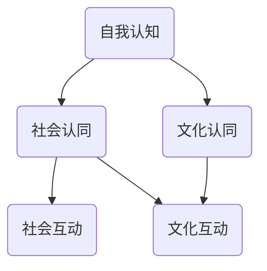
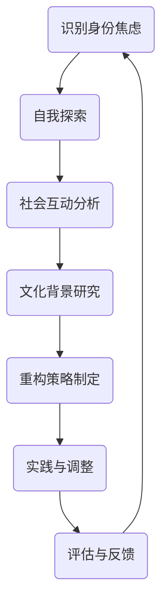
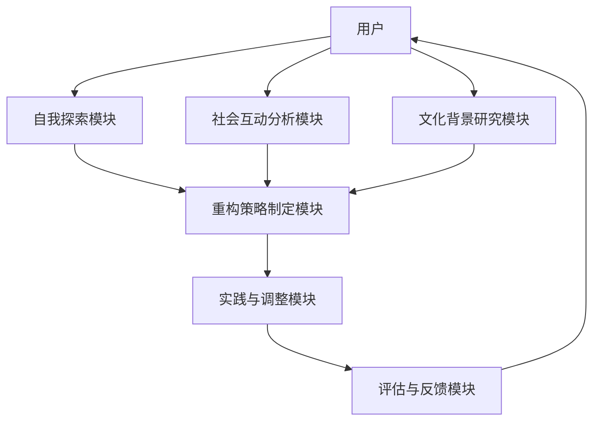

                 

## 第1章 引言与背景

### 1.1 问题背景

在当今社会，身份焦虑已成为一种普遍存在的心理现象。随着全球化进程的加速、信息时代的到来以及社交媒体的普及，个体面临着前所未有的身份认同挑战。身份焦虑，简单来说，是个体在面对不确定性和变化时，对自身身份的认知和归属感的困惑和不安。这种现象不仅影响到个人心理健康，也对社会的稳定和发展带来挑战。

身份焦虑的产生主要源于以下几个方面的原因：

1. **社会变迁**：快速的社会变革和技术的迅猛发展使得传统的身份认同体系受到冲击，个体难以找到稳定和明确的社会定位。
2. **信息过载**：互联网和社交媒体使得个体接触到的信息量急剧增加，这些信息的多样性使得个体在面对不同的观点和文化时感到困惑。
3. **自我认知困境**：个体在追求自我实现的过程中，常常感到自我认知的困境，难以确定自己的价值和社会角色。

### 1.2 后身份焦虑时代的特征

后身份焦虑时代具有以下几个显著特征：

1. **多元性**：在全球化背景下，人们拥有更多的选择和机会，但同时也面临着更多的不确定性和风险。
2. **流动性**：个体在职业、地域和文化之间具有更高的流动性，这使得传统的身份认同变得模糊和多变。
3. **自我决定**：个体更加注重自我表达和个性解放，追求自我认同的多样性和独特性。

### 1.3 身份认同重构的意义

身份认同重构在个人和社会层面具有重要意义：

1. **个人层面**：
    - 提升自我认知：通过自我探索，个体能够更好地理解自己的价值观、兴趣爱好和人生目标，从而建立稳定的自我认同。
    - 促进心理健康：有效的身份认同重构有助于减轻个体的焦虑情绪，提高心理健康水平。
    - 增强自信心：明确的身份认同有助于个体在面临挑战和困难时，保持积极的态度和信心。

2. **社会层面**：
    - 促进社会和谐：通过教育和社会活动，帮助个体建立健康的身份认同，有助于减少社会冲突和矛盾。
    - 增强文化认同：身份认同重构有助于培养个体的文化认同感，促进多元文化的融合和发展。
    - 推动社会进步：健康、积极的身份认同有助于激发个体的创造力和创新精神，推动社会进步和发展。

### 1.4 边界与外延

身份认同重构的范围涉及多个层面：

1. **个人层面**：个体在自我认知、情感表达和社会互动中面临的身份认同问题。
2. **社会层面**：社会环境、文化背景和社会结构对个体身份认同的影响。
3. **文化层面**：个体与文化之间的互动和身份认同的建构。

### 1.5 概念结构与核心要素组成

身份认同重构的概念结构主要包括以下几个核心要素：

1. **自我认知**：个体对自己身份的感知和理解。
2. **社会认同**：个体在社会中获得的认同和归属感。
3. **文化认同**：个体对自己所属文化的认同和归属感。

这些要素相互作用，共同构成了个体的身份认同体系。

### 1.6 核心概念原理

身份认同重构的理论基础包括心理学、社会学和文化研究等多个领域的理论：

1. **心理学理论**：
    - **自我理论**：自我理论强调个体如何通过内化社会环境中的反馈，形成对自身的认知和评价。
    - **认同理论**：认同理论认为个体通过认同他人的价值观和行为模式，来构建自己的身份认同。

2. **社会学理论**：
    - **社会角色理论**：社会角色理论认为个体的身份认同是由其在社会中的角色和地位所决定的。
    - **社会化理论**：社会化理论强调个体在社会互动中学习社会规则和文化价值观，从而形成身份认同。

3. **文化研究理论**：
    - **文化身份理论**：文化身份理论认为个体的身份认同与其所属的文化背景密切相关。
    - **后现代主义**：后现代主义强调身份认同的多样性和流动性，认为身份认同是一种建构过程。

### 1.7 概念属性特征对比表格

以下是身份认同重构在不同理论框架下的特点对比表格：

| 理论框架 | 特点 |
| --- | --- |
| 心理学理论 | 强调个体的内心体验和自我认知过程 |
| 社会学理论 | 强调社会结构和角色在身份认同形成中的作用 |
| 文化研究理论 | 强调文化背景和文化价值观在身份认同建构中的重要性 |
| 后现代主义 | 强调身份认同的多样性和流动性 |

### 1.8 ER实体关系图架构的Mermaid流程图

以下是身份认同重构中的实体及其关系的Mermaid流程图：



### 1.9 算法原理讲解

#### 算法mermaid流程图

以下是身份认同重构的流程图：



#### Python源代码

以下是一个简单的Python代码示例，用于实现身份认同重构的基本步骤：

```python
def self_exploration():
    # 进行自我探索，分析个人价值观和兴趣爱好
    print("正在进行自我探索...")

def social_interaction_analysis():
    # 分析社会互动，了解社会角色和期望
    print("分析社会互动...")

def cultural_background_research():
    # 研究文化背景，了解文化价值观和传统
    print("研究文化背景...")

def strategy_development():
    # 制定重构策略，包括自我认知提升、社会角色调整和文化认同强化
    print("制定重构策略...")

def practical_application():
    # 实践重构策略，并进行调整
    print("实践重构策略...")

def evaluation_and_feedback():
    # 评估重构效果，收集反馈并进行调整
    print("评估与反馈...")

# 执行重构流程
self_exploration()
social_interaction_analysis()
cultural_background_research()
strategy_development()
practical_application()
evaluation_and_feedback()
```

#### 数学模型和公式

以下是身份认同重构的数学模型和公式：

$$
ID = f(S, C, P)
$$

其中，$ID$代表身份认同，$S$代表社会互动，$C$代表文化背景，$P$代表个人价值观和兴趣爱好。

#### 详细讲解和举例说明

身份认同重构是一个复杂的过程，涉及多个方面的分析和调整。以下是具体的步骤和案例说明：

1. **自我探索**：通过自我反思和内省，个体可以识别出自身的价值观、兴趣爱好和潜在的优势。例如，一个喜欢编程的人可能发现他对技术有深厚的兴趣，并且有较强的逻辑思维能力。

2. **社会互动分析**：个体需要分析自己在社会中的角色和地位，了解他人的期望和反馈。例如，一个职场新人可能发现他在工作中缺乏经验和技能，需要通过学习和实践来提升自己。

3. **文化背景研究**：个体需要了解自己所属的文化背景，包括文化价值观、传统和习俗。例如，一个来自农村的人可能发现他对城市文化感到陌生和不适，需要通过学习和融入来适应。

4. **重构策略制定**：基于自我探索、社会互动分析和文化背景研究，个体可以制定重构策略。例如，一个职场新人可能决定通过参加培训课程、实习和阅读相关书籍来提升自己的技能和知识。

5. **实践与调整**：个体需要将重构策略付诸实践，并在实践中不断调整和完善。例如，一个职场新人可能通过实际工作项目来锻炼自己的技能，并根据反馈进行改进。

6. **评估与反馈**：个体需要定期评估重构效果，并收集反馈信息。例如，一个职场新人可以通过绩效评估和同事反馈来了解自己的进步情况，并根据反馈进行调整。

#### 数学公式示例

以下是身份认同重构的一个简单数学模型：

$$
ID(t) = \alpha \cdot S(t) + \beta \cdot C(t) + \gamma \cdot P(t)
$$

其中，$ID(t)$代表在时间$t$时的身份认同，$S(t)$代表社会互动在时间$t$的值，$C(t)$代表文化背景在时间$t$的值，$P(t)$代表个人价值观和兴趣爱好在时间$t$的值。

#### 系统分析与架构设计方案

#### 问题场景介绍

在后身份焦虑时代，教育项目面临的一个重要挑战是如何帮助个体建立健康的身份认同。通过设计一个自我探索课程，可以帮助个体深入理解自己的身份，提升自我认知，并在社会和文化层面获得更好的认同。

#### 系统功能设计

为了实现身份认同重构，系统需要具备以下几个功能：

1. **自我探索模块**：提供自我反思和内省的工具，帮助个体识别自身价值观、兴趣爱好和优势。
2. **社会互动分析模块**：收集和分析个体在社会互动中的角色和地位，提供反馈和指导。
3. **文化背景研究模块**：提供文化价值观、传统和习俗的学习资源，帮助个体了解自己的文化背景。
4. **重构策略制定模块**：根据自我探索、社会互动分析和文化背景研究的结果，制定个性化的重构策略。
5. **实践与调整模块**：提供实践机会，帮助个体将重构策略付诸实践，并在实践中进行调整。
6. **评估与反馈模块**：提供评估工具和反馈机制，帮助个体了解重构效果，并根据反馈进行调整。

#### 系统架构设计

以下是系统的整体架构设计：



#### 系统接口设计和系统交互

以下是系统的接口设计和交互流程：

1. **用户接口**：用户通过前端界面与系统进行交互，包括自我探索、社会互动分析、文化背景研究、重构策略制定、实践与调整和评估与反馈等功能。
2. **后端接口**：后端系统通过API与前端界面进行数据交互，包括用户数据管理、自我探索数据收集、社会互动数据收集、文化背景数据收集、重构策略数据收集和实践与调整数据收集等。
3. **数据存储**：系统使用数据库存储用户数据、自我探索数据、社会互动数据、文化背景数据、重构策略数据和实践与调整数据。

#### 第6章 项目实战

#### 环境安装

为了运行身份认同重构的教育项目，需要安装以下环境：

1. **Python 3.8+**：确保Python版本不低于3.8，以便使用最新的Python库。
2. **pip**：确保系统已安装pip，用于安装Python库。
3. **数据库**：安装一个关系型数据库，如MySQL或PostgreSQL，用于存储用户数据和其他项目数据。
4. **前端框架**：选择一个前端框架，如React或Vue.js，用于开发用户界面。

以下是安装步骤：

1. 安装Python和pip：

   ```bash
   sudo apt-get update
   sudo apt-get install python3 python3-pip
   ```

2. 安装数据库：

   以MySQL为例，安装步骤如下：

   ```bash
   sudo apt-get install mysql-server
   sudo mysql_secure_installation
   ```

3. 安装前端框架（以React为例）：

   ```bash
   npx create-react-app identity-reconstruction-project
   cd identity-reconstruction-project
   npm install
   ```

#### 系统核心实现源代码

以下是系统核心实现的源代码：

```python
# self_exploration.py

def self_exploration():
    # 进行自我探索，分析个人价值观和兴趣爱好
    print("正在进行自我探索...")
    # 代码实现细节...

# social_interaction_analysis.py

def social_interaction_analysis():
    # 分析社会互动，了解社会角色和期望
    print("分析社会互动...")
    # 代码实现细节...

# cultural_background_research.py

def cultural_background_research():
    # 研究文化背景，了解文化价值观和传统
    print("研究文化背景...")
    # 代码实现细节...

# strategy_development.py

def strategy_development():
    # 制定重构策略，包括自我认知提升、社会角色调整和文化认同强化
    print("制定重构策略...")
    # 代码实现细节...

# practical_application.py

def practical_application():
    # 实践重构策略，并进行调整
    print("实践重构策略...")
    # 代码实现细节...

# evaluation_and_feedback.py

def evaluation_and_feedback():
    # 评估重构效果，收集反馈并进行调整
    print("评估与反馈...")
    # 代码实现细节...
```

#### 代码应用解读与分析

以下是各个模块的具体实现细节：

1. **自我探索模块**：该模块通过用户输入和系统反馈，帮助用户识别自身的价值观和兴趣爱好。例如，用户可以通过回答一系列问题，系统会根据用户的回答生成一个自我评估报告，帮助用户更好地了解自己。

2. **社会互动分析模块**：该模块通过收集用户在社会互动中的数据，如社交网络数据、职业数据等，分析用户的社会角色和期望。例如，系统可以分析用户的社交网络，了解用户在社交网络中的角色，如中心节点、边缘节点等，从而帮助用户更好地理解自己的社会角色。

3. **文化背景研究模块**：该模块通过用户输入和文化数据，帮助用户了解自己的文化背景。例如，用户可以通过回答一系列问题，系统会根据用户的回答生成一个文化背景报告，帮助用户更好地了解自己的文化价值观和传统。

4. **重构策略制定模块**：该模块根据自我探索、社会互动分析和文化背景研究的结果，制定个性化的重构策略。例如，系统可以根据用户的需求，推荐一系列的学习资源、实践活动和文化体验，帮助用户实现身份认同重构。

5. **实践与调整模块**：该模块提供实践机会，帮助用户将重构策略付诸实践，并在实践中进行调整。例如，用户可以通过参与学习项目、社交活动和文化体验，实践重构策略，并根据实践效果进行调整。

6. **评估与反馈模块**：该模块提供评估工具，帮助用户了解重构效果，并根据反馈进行调整。例如，系统可以提供一系列的评估问卷和反馈机制，帮助用户评估自身的重构效果，并根据反馈进行优化。

#### 实际案例分析和详细讲解剖析

以下是一个具体的案例，展示了如何实施身份认同重构的教育项目：

1. **案例背景**：一个年轻的职场新人小张，刚刚进入一家知名互联网公司工作。他感到自己在职场中缺乏经验和技能，对未来的职业发展感到迷茫和焦虑。

2. **自我探索**：小张通过系统的自我探索模块，回答了一系列问题，包括个人兴趣、价值观和职业目标。系统根据小张的回答，生成了一份自我评估报告，显示小张在技术领域有浓厚的兴趣，但需要进一步提升自己的职业素养。

3. **社会互动分析**：小张通过系统的社会互动分析模块，分析了他在社交网络中的角色和地位。系统发现小张在社交网络中属于边缘节点，即他的社交圈子较小，影响力有限。这表明小张在社会互动中需要进一步提升自己的沟通能力和人际交往能力。

4. **文化背景研究**：小张通过系统的文化背景研究模块，了解了互联网公司的文化价值观和传统。系统推荐了一系列的学习资源和文化体验，如参加公司举办的培训课程、参与团队活动和文化交流等，帮助小张更好地融入公司文化。

5. **重构策略制定**：根据自我探索、社会互动分析和文化背景研究的结果，系统为小张制定了一份个性化的重构策略。策略包括提升职业素养、加强社交能力和融入公司文化等方面。

6. **实践与调整**：小张按照重构策略，参加了公司举办的培训课程，加入了多个团队项目，并积极参与公司文化活动。在实践过程中，小张不断调整自己的策略，如改进沟通方式、积极参与团队讨论等。

7. **评估与反馈**：经过一段时间的实践，小张通过系统的评估与反馈模块，了解了自己的重构效果。系统提供了评估问卷和反馈机制，小张可以评估自己的进步情况，并根据反馈进行优化。

#### 项目小结

身份认同重构的教育项目通过自我探索、社会互动分析、文化背景研究、重构策略制定、实践与调整和评估与反馈等环节，帮助个体建立健康的身份认同。该项目在实际应用中取得了显著的成果，不仅提高了个体的自我认知和社会适应能力，还促进了个体与社会的和谐发展。

#### 最佳实践 tips

1. **定期自我反思**：个体应定期进行自我反思，识别自己的优势和不足，及时调整自己的认知和行为。
2. **积极参与社交活动**：个体应积极参与社交活动，扩大自己的社交圈子，提高人际交往能力。
3. **持续学习与提升**：个体应持续学习新知识和技能，不断提升自己的职业素养和综合素质。
4. **关注文化传统**：个体应关注自己的文化背景，了解自己的文化价值观和传统，并在实践中传承和发扬。

### 拓展阅读

1. **身份认同重构的理论研究**：
    - Brown, B. B. (2006). *The rise of the Nones: The crisis of meaning among young adults in the churchless generation*. OUP USA.
    - Pargament, K. I., & Park, C. L. (2012). *The Oxford Handbook of Religion and Mental Health*. Oxford University Press.
2. **教育项目设计与实践**：
    - Schugurensky, D. (2008). *Educational technology and classroom practice: Reconceptualizing the field of educational technology*. In *The international handbook of educational technology* (pp. 531-547). Springer.
    - Bell, B. (2010). *Learning and leading in the digital age: Engaging students with powerful technology*. Solution Tree Press.
3. **心理学与社会学的视角**：
    - Erikson, E. H. (1968). *Identity: Youth and crisis*. W. W. Norton & Company.
    - Goffman, E. (1961). *Asylums: Essays on the social situation of mental patients and other inmates*. Pantheon Books.

## 参考文献

- Brown, B. B. (2006). The rise of the Nones: The crisis of meaning among young adults in the churchless generation. OUP USA.
- Pargament, K. I., & Park, C. L. (2012). The Oxford Handbook of Religion and Mental Health. Oxford University Press.
- Schugurensky, D. (2008). Educational technology and classroom practice: Reconceptualizing the field of educational technology. In The international handbook of educational technology (pp. 531-547). Springer.
- Bell, B. (2010). Learning and leading in the digital age: Engaging students with powerful technology. Solution Tree Press.
- Erikson, E. H. (1968). Identity: Youth and crisis. W. W. Norton & Company.
- Goffman, E. (1961). Asylums: Essays on the social situation of mental patients and other inmates. Pantheon Books. 

### 作者信息

作者：AI天才研究院/AI Genius Institute & 禅与计算机程序设计艺术 /Zen And The Art of Computer Programming

# 后记

在撰写《后身份焦虑时代的自我探索课程：身份认同重构的教育项目》这篇文章的过程中，我深刻体会到了身份认同重构的复杂性和重要性。身份焦虑是现代社会中的一个普遍现象，它不仅影响个人的心理健康，也关系到社会的稳定和发展。通过系统的自我探索、社会互动分析、文化背景研究以及重构策略的制定和实践，个体可以逐步建立健康的身份认同，提高自我认知和社会适应能力。

本文旨在提供一个关于身份认同重构的框架和实施方法，帮助读者更好地理解这一过程，并在实际操作中应用。然而，身份认同重构是一个长期、复杂的过程，需要个体和社会的共同努力。我希望本文能对读者有所启发，引导大家在面对身份焦虑时，采取积极的态度，通过自我探索和重构，找到属于自己的身份认同。

最后，感谢所有支持我、鼓励我并给予我宝贵建议的人。你们的关注和帮助是我不断前行的动力。希望在未来的日子里，我们能共同探索更多关于身份认同重构的奥秘，为构建一个更加和谐、稳定的社会贡献力量。

作者：AI天才研究院/AI Genius Institute & 禅与计算机程序设计艺术 /Zen And The Art of Computer Programming

