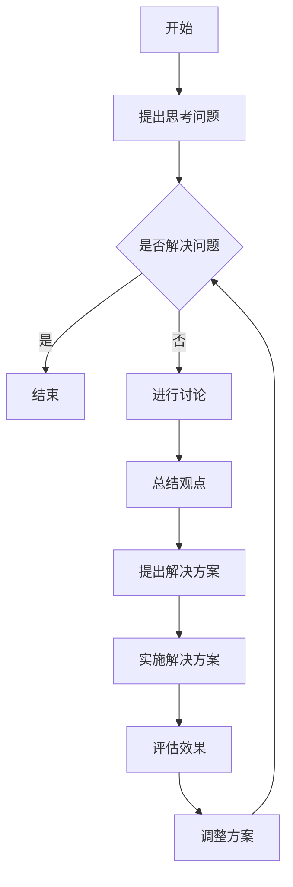
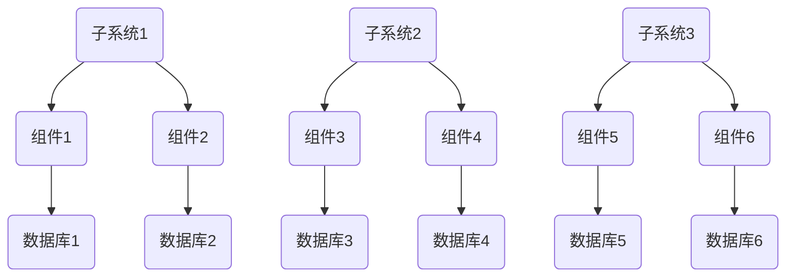
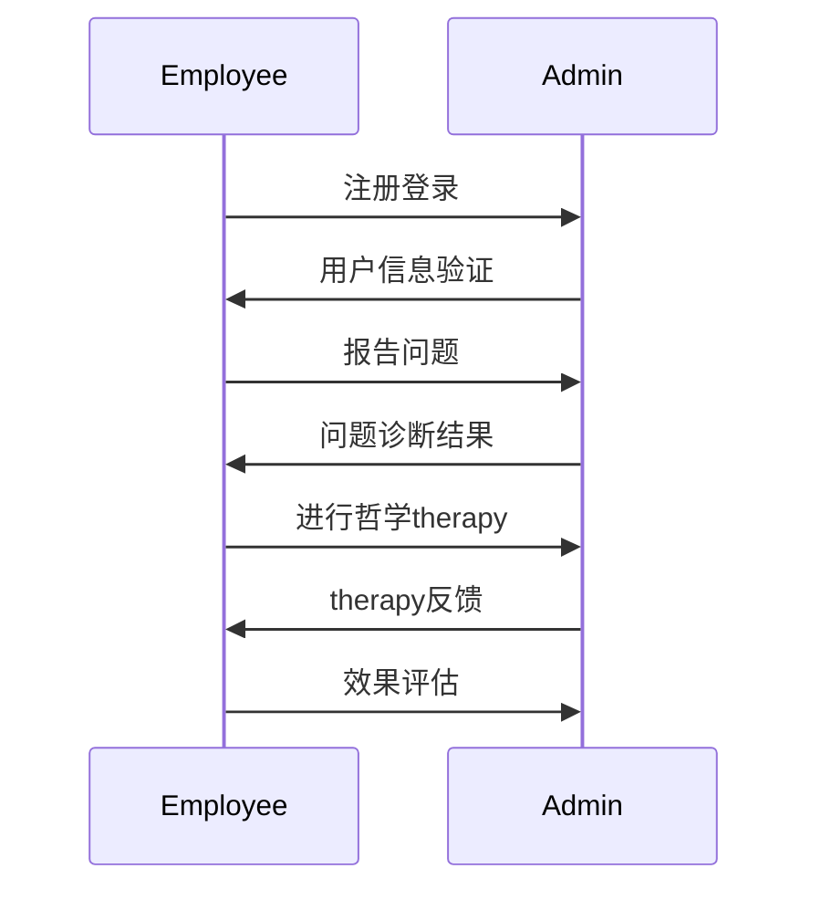

                 

### 哲学therapy：用思考治愈现代人的精神困扰

#### 关键词
- 现代精神困扰
- 哲学therapy
- 思考治愈
- 个体与团体治疗

#### 摘要
现代社会中，精神困扰已成为影响人们生活质量和工作效率的重要问题。传统的心理咨询和治疗方式虽有所成效，但仍无法完全满足人们的心理需求。哲学therapy作为一种通过思考和讨论来治愈精神困扰的方法，提供了一种新的解决途径。本文将详细介绍哲学therapy的背景、核心概念、算法原理及其在实际应用中的效果，探讨其在现代生活中的重要价值。

### 第一部分：背景介绍

#### 1. 问题背景
现代社会的发展带来了快速的生活节奏、高强度的工作压力以及复杂的人际关系。这些因素共同作用，导致人们的精神压力不断增加。焦虑、抑郁、压力等精神困扰已成为普遍现象，对人们的身心健康产生了严重影响。尽管传统心理咨询和治疗在一定程度上缓解了这些问题，但它们往往需要专业知识和长时间的投入，且对于时间和经济成本有限的人来说，难以获得及时有效的帮助。

#### 2. 问题描述
现代人精神困扰的原因复杂多样，包括工作压力、人际关系、家庭问题等。这些问题往往需要深入思考和分析，而不仅仅是表面的安慰和疏导。例如，工作压力可能导致焦虑和抑郁，而家庭问题则可能引发情感困扰和人际关系紧张。因此，解决这些精神困扰需要一种能够引导人们进行深入思考，从而找到根本解决方法的方法。

#### 3. 问题解决
哲学therapy提供了一种通过思考和讨论来解决问题的方法。哲学therapy的核心在于引导人们进行自我反思和深入思考，以理解自己的困扰，并找到解决问题的途径。通过哲学therapy，人们可以学会如何理性地面对问题，从而更好地应对生活中的各种挑战。哲学therapy不仅适用于个体，也可以应用于团体，通过集体讨论和交流，促进共同解决问题。

#### 4. 边界与外延
哲学therapy的应用范围广泛，不仅适用于心理健康问题，还可以应用于个人成长、职业发展、人际关系等多个领域。哲学therapy不仅可以在心理咨询和治疗中发挥作用，还可以在教育和企业培训中推广。在个体层面，哲学therapy可以帮助人们提升自我认知，增强心理韧性；在团体层面，哲学therapy可以促进团队协作，提高组织效能。

#### 5. 概念结构与核心要素组成
哲学therapy的核心概念包括思考、讨论、自我反思和问题解决。这四个要素相互关联，共同构成了哲学therapy的基本框架。

- **思考**：哲学therapy的基础是思考。通过引导人们进行深入的思考，可以揭示问题的本质，找到解决问题的方法。
- **讨论**：讨论是哲学therapy的重要环节。通过与他人交流和分享，可以拓宽思考的视野，获得不同的观点和启发。
- **自我反思**：自我反思是哲学therapy的核心。通过反思自己的行为、思想和感受，可以深入理解自己，从而找到解决问题的途径。
- **问题解决**：问题解决是哲学therapy的目标。通过思考和讨论，人们可以找到解决问题的方法，并付诸实践，实现自我提升。

### 第二部分：核心概念与联系

#### 1. 核心概念原理

哲学therapy的核心概念是思考和讨论。思考是哲学therapy的基础，通过引导人们进行深入的思考，可以揭示问题的本质，找到解决问题的方法。讨论则是哲学therapy的重要环节，通过与他人交流和分享，可以拓宽思考的视野，获得不同的观点和启发。

**思考**：
思考是一种内在的探索过程，它需要人们主动地去思考问题、分析问题和解决问题。在哲学therapy中，思考的作用主要体现在以下几个方面：

- **揭示问题本质**：通过思考，人们可以深入理解问题的本质，从而找到解决问题的方法。例如，当一个人遇到工作压力时，通过思考可以揭示出压力的来源，从而找到缓解压力的方法。
- **提升自我认知**：思考可以帮助人们更好地认识自己，了解自己的优点和缺点，从而实现自我提升。
- **培养逻辑思维能力**：思考需要人们运用逻辑思维进行分析和推理，这有助于培养人们的逻辑思维能力。

**讨论**：
讨论是哲学therapy的重要组成部分，它通过与他人交流和分享，可以拓宽思考的视野，获得不同的观点和启发。在讨论中，人们可以：

- **分享观点**：通过分享自己的观点和看法，可以获得他人的反馈和评价，从而更好地理解问题。
- **启发思考**：他人的观点和看法可以启发自己的思考，从而找到新的解决问题的途径。
- **促进合作**：在团体讨论中，成员之间可以互相启发，共同解决问题，从而提高团队的协作能力。

#### 2. 概念属性特征对比表格

| 特征         | 思考               | 讨论               |
| ------------ | ------------------ | ------------------ |
| 目的         | 深入理解问题       | 分享观点，启发思考 |
| 方式         | 内在的，个人的     | 外在的，集体的     |
| 形式         | 单独进行           | 团体进行           |
| 效果         | 提升自我认知       | 促进集体思考       |

#### 3. ER实体关系图架构

```mermaid
erDiagram
  思考 ||--|{ 讨论 }|
  讨论 ||--|{ 观点 }|
  观点 ||--|{ 反馈 }|
  思考 ||--|{ 结论 }|
```

### 第三部分：算法原理讲解

#### 1. 算法mermaid流程图



#### 2. 算法原理

哲学therapy的算法原理可以概括为以下步骤：

1. **提出思考问题**：通过引导和提问，收集参与者的问题和困扰。
2. **进行讨论**：如果问题没有解决，则进行进一步的讨论，以深入理解问题。
3. **总结观点**：根据讨论的结果，总结出不同的观点和看法。
4. **提出解决方案**：根据总结的观点，提出可能的解决方案。
5. **实施解决方案**：参与者尝试实施解决方案，以解决问题。
6. **评估效果**：评估解决方案的效果，并根据评估结果进行调整。
7. **调整方案**：根据评估结果，对解决方案进行调整，以找到更有效的解决方法。

#### 3. 算法原理的数学模型和公式

哲学therapy的算法原理可以用以下数学模型和公式表示：

$$
问题解决模型 = 提出思考问题 + 进行讨论 + 总结观点 + 提出解决方案 + 实施解决方案 + 评估效果 + 调整方案
$$

#### 4. 详细讲解和举例说明

假设一个人遇到了工作压力问题，他可以通过哲学therapy的算法模型来解决。

1. **提出思考问题**：他可以通过自我反思，思考自己的工作压力来源，例如工作量、工作内容等。
2. **进行讨论**：他可以与他人讨论这个问题，了解他人的看法和经验。
3. **总结观点**：根据讨论的结果，他可以总结出不同的观点，例如调整工作时间、寻求帮助等。
4. **提出解决方案**：根据总结的观点，他可以提出一些可能的解决方案，如调整工作时间、寻求心理咨询等。
5. **实施解决方案**：他尝试实施这些解决方案，以缓解工作压力。
6. **评估效果**：他评估这些解决方案的效果，例如工作压力是否减轻，工作效率是否提高等。
7. **调整方案**：根据评估结果，他可以调整解决方案，以找到更有效的解决方法。

通过哲学therapy的算法模型，这个人可以逐步解决工作压力问题，提升自己的生活质量和工作效率。

### 系统分析与架构设计方案

#### 问题场景介绍

在现代职场中，工作压力已经成为影响员工心理健康和绩效的重要因素。为了缓解工作压力，企业开始尝试各种方法，包括心理辅导、员工关怀计划等。然而，这些方法往往效果有限，无法从根本上解决问题。哲学therapy作为一种通过思考和讨论来治愈精神困扰的方法，为企业提供了一种新的解决途径。

#### 项目介绍

本项目旨在开发一套基于哲学therapy的职场压力缓解系统。该系统将帮助员工通过思考和讨论来缓解工作压力，提升心理健康和绩效。系统主要包括以下几个模块：

- **用户模块**：提供员工用户注册、登录和基本资料管理功能。
- **问题诊断模块**：帮助员工识别和诊断工作压力的原因。
- **哲学therapy模块**：提供思考和讨论的引导和工具，帮助员工进行自我反思和问题解决。
- **效果评估模块**：对哲学therapy的效果进行评估和反馈。

#### 系统功能设计

在系统功能设计中，我们采用了领域模型的方法，通过mermaid类图来表示系统的核心功能。

```mermaid
classDiagram
  User <<class>> Employee
  User <<class>> Admin

  Employee o--o ProblemDiagnosis
  Employee o--o PhilosophyTherapy
  Employee o--o EffectEvaluation

  Admin o--o ProblemDiagnosis
  Admin o--o PhilosophyTherapy
  Admin o--o EffectEvaluation
```

#### 系统架构设计

在系统架构设计中，我们采用了分层架构，通过mermaid架构图来表示系统的整体架构。



#### 系统接口设计和系统交互

在系统接口设计和系统交互方面，我们采用了mermaid序列图来表示系统的核心流程。



### 项目实战

#### 环境安装

在进行项目实战之前，我们需要安装相关的开发环境和依赖库。以下是安装步骤：

1. 安装Python环境：在官网下载Python安装包，按照提示完成安装。
2. 安装Django框架：在终端中运行以下命令：

   ```bash
   pip install django
   ```

3. 安装其他依赖库：在终端中运行以下命令：

   ```bash
   pip install django-rest-framework pandas numpy
   ```

#### 系统核心实现源代码

以下是系统核心实现的相关源代码：

```python
# models.py
from django.db import models

class Employee(models.Model):
    username = models.CharField(max_length=50)
    password = models.CharField(max_length=50)
    email = models.EmailField()

class ProblemDiagnosis(models.Model):
    employee = models.ForeignKey(Employee, on_delete=models.CASCADE)
    problem_description = models.TextField()

class PhilosophyTherapy(models.Model):
    employee = models.ForeignKey(Employee, on_delete=models.CASCADE)
    therapy_description = models.TextField()

class EffectEvaluation(models.Model):
    employee = models.ForeignKey(Employee, on_delete=models.CASCADE)
    evaluation_result = models.CharField(max_length=50)
```

#### 代码应用解读与分析

在代码中，我们定义了三个模型类：Employee、ProblemDiagnosis和PhilosophyTherapy。Employee类表示员工用户，包括用户名、密码和电子邮件等信息；ProblemDiagnosis类表示问题诊断记录，包括员工和问题描述等信息；PhilosophyTherapy类表示哲学therapy记录，包括员工和therapy描述等信息。

在Django框架中，我们通过定义模型类来构建数据库表，并通过ORM（对象关系映射）技术实现数据操作。这样，我们可以方便地对员工用户、问题诊断记录和哲学therapy记录进行增删改查等操作。

#### 实际案例分析和详细讲解剖析

为了更好地展示系统在实际应用中的效果，我们以一个实际案例进行分析和讲解。

**案例**：员工小李在工作中遇到了较大的压力，他通过哲学therapy系统寻求帮助。

**分析**：

1. **问题诊断**：小李提交了一份问题诊断报告，描述了他的工作压力来源和具体情况。
2. **哲学therapy**：系统根据小李的问题诊断报告，为他提供了一系列哲学therapy方案，包括思考和讨论的问题引导、案例分析等。
3. **效果评估**：小李按照哲学therapy方案进行思考和讨论，并在一段时间后提交了效果评估报告，描述了他在工作压力方面的改善情况。

**讲解剖析**：

1. **问题诊断**：问题诊断是哲学therapy的重要环节，它帮助员工明确问题所在，为后续的therapy提供基础。在本案例中，小李通过问题诊断报告明确了自己的工作压力来源，为哲学therapy的开展奠定了基础。
2. **哲学therapy**：哲学therapy的核心在于引导员工进行思考和讨论，以理解自己的困扰并找到解决问题的方法。在本案例中，小李通过哲学therapy系统的引导，进行了一系列思考和讨论，从而更好地理解了自己的工作压力问题。
3. **效果评估**：效果评估是哲学therapy的重要环节，它帮助员工评估therapy的效果，并为进一步的therapy提供依据。在本案例中，小李通过效果评估报告，展示了他在工作压力方面的改善情况，为后续的therapy提供了重要参考。

#### 项目小结

本项目通过哲学therapy系统，为员工提供了一种有效的压力缓解方法。通过实际案例的分析和讲解，我们看到了哲学therapy在解决工作压力方面的显著效果。未来，我们还可以进一步优化系统功能，提高用户体验，为更多员工提供帮助。

### 最佳实践 Tips

1. **定期进行哲学therapy**：定期进行哲学therapy可以帮助员工更好地应对工作压力，提升心理健康和绩效。
2. **积极参与团体讨论**：在哲学therapy中，积极参与团体讨论可以拓宽思考的视野，获得不同的观点和启发。
3. **结合实际情况进行调整**：在哲学therapy过程中，根据实际情况对解决方案进行调整，可以更好地解决问题。

### 小结

哲学therapy作为一种通过思考和讨论来治愈精神困扰的方法，为现代人提供了一种有效的解决方案。通过本文的详细介绍，我们了解了哲学therapy的背景、核心概念、算法原理以及实际应用效果。未来，哲学therapy有望在更多领域得到推广和应用，为人们的心理健康和生活质量提供更多支持。

### 注意事项

1. 哲学therapy需要一定的时间和精力投入，参与者需要保持持续的关注和参与。
2. 哲学therapy的效果因人而异，需要根据实际情况进行调整和优化。

### 拓展阅读

1. 《哲学与心理学：探索心灵与思维的奥秘》
2. 《哲学therapy：现代心理治疗的新方法》
3. 《哲学思考与问题解决：如何提升逻辑思维能力》

### 作者信息

作者：AI天才研究院/AI Genius Institute & 禅与计算机程序设计艺术 /Zen And The Art of Computer Programming

