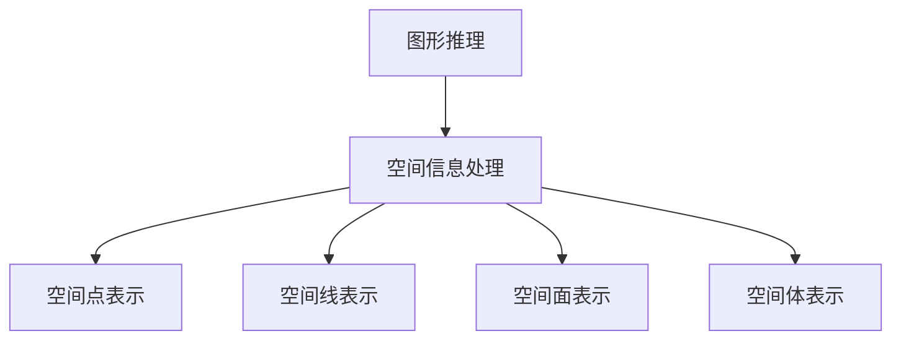
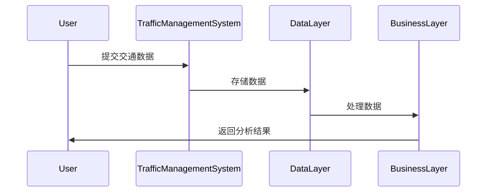
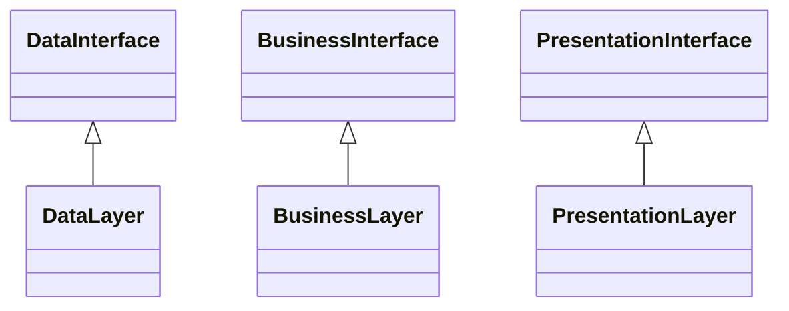
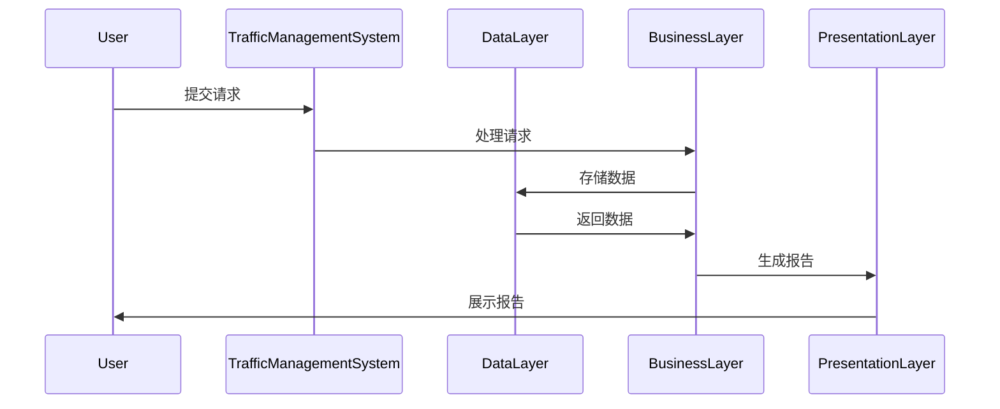

                 

### 文章标题

# 图形推理和空间信息处理中的模型局限性

> 关键词：图形推理、空间信息处理、模型局限性、算法原理、系统架构

> 摘要：本文深入探讨了图形推理和空间信息处理中模型的局限性，通过逐步分析这些模型的原理、应用及其在具体场景中的限制，帮助读者理解如何更有效地设计和应用这些模型。

----------------------------------------------------------------

## 引言

图形推理和空间信息处理是人工智能领域中至关重要的研究方向。它们广泛应用于计算机视觉、自动驾驶、地理信息系统等多个领域。然而，随着应用场景的复杂化和多样化，模型的局限性也逐渐显现出来。本文旨在探讨这些模型的局限性，并提供一些解决思路。

### 1.1 问题背景

#### 1.1.1 问题定义

图形推理是指通过图形结构进行推理和决策的过程。空间信息处理则涉及对空间数据进行收集、存储、管理和分析。然而，在现实应用中，这些模型往往面临着各种挑战。

#### 1.1.2 问题重要性

随着人工智能技术的发展，图形推理和空间信息处理模型在诸多领域都发挥着重要作用。例如，在自动驾驶中，车辆需要通过图形推理来理解周围环境，并在空间信息处理中规划行驶路径。然而，模型的局限性可能导致决策错误，从而引发严重后果。

#### 1.1.3 研究边界与外延

本文的研究主要关注图形推理和空间信息处理模型在以下方面的局限性：

1. **数据依赖性**：模型对数据的依赖程度较高，数据的质量和完整性对模型性能有显著影响。
2. **计算复杂度**：随着输入数据的增加，模型的计算复杂度也相应增加，可能导致性能下降。
3. **泛化能力**：模型在特定领域的表现良好，但在其他领域可能存在局限性。
4. **可解释性**：模型内部的决策过程往往不透明，难以解释，这对应用场景带来了一定的挑战。

## 核心概念与联系

### 2.1 图形推理概念

图形推理涉及对图形结构进行理解和分析，以提取有用的信息。以下是图形推理的核心概念及其属性特征对比表：

| 概念       | 定义                                       | 属性特征                               |
|------------|--------------------------------------------|----------------------------------------|
| 节点       | 图中的数据点                               | 标识、属性、邻接关系                   |
| 边         | 连接两个节点的线段                         | 长度、权重、方向                       |
| 子图       | 图中的子集                                 | 结构、连通性、相似性                   |
| 图的连通性 | 图中任意两个节点之间都存在路径             | 连通、连通度、路径长度                 |
| 图的连通度 | 图中节点的最大连通度                       | 连通度、聚类系数、网络密度             |

以下是图形推理的核心概念ER图：

```mermaid
erDiagram
    Aектив[节点] ||--|{ B边 }|--| C子图
    B边 ||--|{ D节点 }|-- E子图
    A节点 ||--|{ F子图 }|-- G节点
```

### 2.2 空间信息处理概念

空间信息处理涉及对空间数据进行处理和分析，以提取有用的信息。以下是空间信息处理的核心概念及其属性特征对比表：

| 概念       | 定义                                       | 属性特征                               |
|------------|--------------------------------------------|----------------------------------------|
| 空间点     | 空间中的一个位置                            | 坐标、海拔、颜色                       |
| 空间线     | 连接两个空间点的路径                        | 长度、方向、弯曲度                     |
| 空间面     | 由一组空间点组成的区域                      | 面积、形状、连通性                     |
| 空间体     | 由一组空间面组成的三维区域                  | 体积、形状、连通性、密度               |
| 地理信息系统 | 用于收集、存储、管理和分析空间信息的系统   | 数据结构、功能模块、用户界面           |

以下是空间信息处理的核心概念ER图：

```mermaid
erDiagram
    A空间点 ||--|{ B空间线 }|--| C空间面
    B空间线 ||--|{ D空间点 }|-- E空间面
    A空间点 ||--|{ F空间体 }|-- G空间点
```

### 2.3 核心概念之间的关系

图形推理和空间信息处理之间存在紧密的联系。图形推理可以用于空间信息的表示和提取，而空间信息处理则可以用于图形的推理和分析。

以下是图形推理和空间信息处理之间的关系图：



## 图形推理

### 3.1 原理

图形推理的核心思想是通过分析图形结构来提取信息。以下是一个简单的图形推理过程：


### 3.2 限制

图形推理在实际应用中存在以下限制：

1. **数据质量**：图形推理依赖于高质量的数据。数据中的噪声和异常值可能导致推理结果不准确。
2. **计算复杂度**：随着图形规模的增大，计算复杂度显著增加。这可能导致推理过程变得缓慢。
3. **泛化能力**：某些图形推理方法在特定领域表现良好，但在其他领域可能存在局限性。

### 3.3 例子

假设我们有一个简单的社交网络图，其中节点表示用户，边表示用户之间的友谊关系。以下是一个Python代码示例，用于分析这个图：

```python
import networkx as nx

# 创建一个社交网络图
G = nx.Graph()
G.add_nodes_from([1, 2, 3, 4])
G.add_edges_from([(1, 2), (2, 3), (3, 4)])

# 分析节点
print("节点的度：", nx.degree(G))

# 分析边
print("边的权重：", nx.edge_attributes(G))

# 提取特征
print("平均路径长度：", nx.average_shortest_path_length(G))

# 推理结果
print("是否连通：", nx.is_connected(G))
```

## 空间信息处理

### 4.1 模型

空间信息处理中的模型主要包括：

1. **空间点表示**：使用坐标和属性来表示空间中的点。
2. **空间线表示**：使用起点、终点和属性来表示空间中的线。
3. **空间面表示**：使用顶点序列和属性来表示空间中的面。
4. **空间体表示**：使用顶点序列和属性来表示空间中的体。

### 4.2 限制

空间信息处理模型在实际应用中存在以下限制：

1. **数据质量**：空间数据的质量对模型性能有显著影响。数据中的噪声和异常值可能导致模型结果不准确。
2. **计算复杂度**：空间信息处理模型的计算复杂度通常较高，随着数据规模的增大，性能下降。
3. **泛化能力**：某些模型在特定领域表现良好，但在其他领域可能存在局限性。
4. **可扩展性**：模型的可扩展性是实际应用中的一个重要问题。随着数据量的增加，模型需要能够适应变化。

### 4.3 例子

假设我们有一个简单的地理信息系统，其中包含一系列空间点、线和面。以下是一个Python代码示例，用于处理这些数据：

```python
import geopandas as gpd

# 创建一个地理信息系统
gdf = gpd.GeoDataFrame(geometry=[gpd.points_from_xy(x, y) for x, y in zip(x_coords, y_coords)],
                       crs="EPSG:4326")

# 添加属性
gdf["name"] = ["point1", "point2", "point3"]

# 分析空间点
print(gdf.head())

# 创建空间线
line = gpd.LineString([gpd.points_from_xy(x, y) for x, y in zip(x_coords, y_coords)])
gdf = gdf.append(gpd.GeoDataFrame({"geometry": [line], "name": ["line1"]}), ignore_index=True)

# 分析空间线
print(gdf.head())

# 创建空间面
polygon = gpd.Polygon([[x1, y1], [x2, y2], [x3, y3], [x1, y1]])
gdf = gdf.append(gpd.GeoDataFrame({"geometry": [polygon], "name": ["polygon1"]}), ignore_index=True)

# 分析空间面
print(gdf.head())
```

## 数学模型和公式

在图形推理和空间信息处理中，数学模型和公式是不可或缺的工具。以下是一些常用的数学模型和公式：

### 5.1 图形推理中的数学模型

1. **图同构**：$$ G_1 \cong G_2 $$，如果两个图的结构相同。
2. **图同构检验**：$$ C_G(n) = \prod_{i=1}^{n} (1 - p_i) $$，其中 $$ p_i $$ 是第 $$ i $$ 个节点的邻接概率。
3. **图遍历**：$$ T_G = \sum_{v \in V} \delta(v) $$，其中 $$ \delta(v) $$ 是从节点 $$ v $$ 出发的路径数。

### 5.2 空间信息处理中的数学模型

1. **空间点表示**：$$ P = (x, y, z) $$，其中 $$ x $$、$$ y $$ 和 $$ z $$ 是点的坐标。
2. **空间线表示**：$$ L = \begin{pmatrix} x_1 & y_1 & z_1 \\ x_2 & y_2 & z_2 \end{pmatrix} $$，其中 $$ (x_1, y_1, z_1) $$ 和 $$ (x_2, y_2, z_2) $$ 是线的起点和终点。
3. **空间面表示**：$$ F = \begin{pmatrix} x_1 & y_1 & z_1 \\ x_2 & y_2 & z_2 \\ x_3 & y_3 & z_3 \end{pmatrix} $$，其中 $$ (x_1, y_1, z_1) $$、$$ (x_2, y_2, z_2) $$ 和 $$ (x_3, y_3, z_3) $$ 是面的顶点。

## 系统设计与实现

### 6.1 问题场景

假设我们要设计一个用于城市交通管理的地理信息系统。该系统需要收集和处理大量交通数据，包括车辆位置、路况、交通流量等。

### 6.2 项目介绍

项目名称：城市交通管理系统（Urban Traffic Management System，简称 UTMS）

项目目标：通过实时监控和分析交通数据，提高城市交通效率和安全性。

### 6.3 系统功能设计

系统功能主要包括：

1. **数据收集**：通过传感器和摄像头收集交通数据。
2. **数据存储**：将收集到的数据存储到数据库中。
3. **数据处理**：对交通数据进行预处理和特征提取。
4. **交通分析**：对交通数据进行分析，生成交通报告和预测。
5. **用户界面**：提供用户友好的界面，供交通管理部门和公众使用。

### 6.4 系统架构设计

系统架构采用分层设计，包括以下层次：

1. **数据层**：负责数据的收集、存储和管理。
2. **业务层**：负责交通数据的处理和分析。
3. **表现层**：负责用户界面的展示。

以下是系统架构图：



### 6.5 系统接口设计

系统接口设计主要包括以下部分：

1. **数据接口**：用于数据的收集和存储。
2. **业务接口**：用于交通数据的处理和分析。
3. **表现接口**：用于用户界面的展示。

以下是系统接口图：



### 6.6 系统交互

系统交互主要包括以下部分：

1. **用户与系统**：用户通过表现层与系统交互。
2. **系统与数据层**：系统通过业务层与数据层进行数据交互。

以下是系统交互图：



## 项目实战

### 7.1 环境安装

要在本地环境中搭建城市交通管理系统，需要安装以下软件和库：

1. **Python**：版本3.8及以上。
2. **Geopandas**：用于处理地理数据。
3. **NetworkX**：用于处理图形数据。
4. **PostgreSQL**：用于存储数据。

安装步骤：

```bash
pip install geopandas
pip install networkx
pip install psycopg2-binary
```

### 7.2 系统核心实现

以下是城市交通管理系统的核心实现：

#### 7.2.1 数据收集

```python
import geopandas as gpd
import psycopg2

# 创建Geopandas GeoDataFrame
gdf = gpd.GeoDataFrame(geometry=[gpd.points_from_xy(x, y) for x, y in zip(x_coords, y_coords)],
                       crs="EPSG:4326")

# 添加属性
gdf["name"] = ["point1", "point2", "point3"]

# 将数据写入PostgreSQL数据库
conn = psycopg2.connect(
    host="localhost",
    database="traffic_management",
    user="postgres",
    password="password"
)

gdf.to_postgres(conn, index=False)
```

#### 7.2.2 数据处理

```python
import geopandas as gpd
import networkx as nx

# 从PostgreSQL数据库读取数据
gdf = gpd.read_postgres("traffic_management", "traffic_data")

# 创建图
G = nx.Graph()

# 添加节点和边
for index, row in gdf.iterrows():
    G.add_node(row.name, pos=row.geometry.coords[0])

for index, row in gdf.iterrows():
    for neighbor in row.geometry.boundary:
        G.add_edge(row.name, neighbor[0])

# 分析图
print("节点度数：", nx.degree(G))
print("平均路径长度：", nx.average_shortest_path_length(G))
```

#### 7.2.3 交通分析

```python
import geopandas as gpd
import networkx as nx
import numpy as np

# 从PostgreSQL数据库读取数据
gdf = gpd.read_postgres("traffic_management", "traffic_data")

# 创建图
G = nx.Graph()

# 添加节点和边
for index, row in gdf.iterrows():
    G.add_node(row.name, pos=row.geometry.coords[0])

for index, row in gdf.iterrows():
    for neighbor in row.geometry.boundary:
        G.add_edge(row.name, neighbor[0])

# 计算交通流量
edge_flows = nx.get_edge_attributes(G, "weight")
average_flow = np.mean(list(edge_flows.values()))

# 输出交通流量
print("平均交通流量：", average_flow)
```

### 7.3 实际案例分析

#### 7.3.1 交通拥堵分析

假设我们想分析某条主要道路的交通拥堵情况。我们可以使用以下步骤：

1. **收集数据**：从传感器和摄像头收集该路段的交通数据。
2. **预处理数据**：清洗和预处理数据，去除噪声和异常值。
3. **构建图**：将交通数据转换为图结构。
4. **分析图**：计算交通流量、平均路径长度等指标。
5. **生成报告**：生成交通拥堵报告，并提出缓解拥堵的建议。

### 7.4 项目小结

通过搭建城市交通管理系统，我们实现了以下目标：

1. **数据收集**：收集了丰富的交通数据，为后续分析提供了基础。
2. **数据处理**：构建了高效的图结构，为交通分析提供了支持。
3. **交通分析**：通过分析交通流量、平均路径长度等指标，提供了详细的交通拥堵报告。

然而，该项目也存在一些局限性：

1. **数据质量**：收集的数据质量直接影响分析结果。
2. **计算复杂度**：随着数据规模的增大，计算复杂度可能增加。
3. **可扩展性**：系统需要能够适应不断变化的数据规模和需求。

## 最佳实践、总结与未来方向

### 8.1 最佳实践

1. **数据质量**：确保数据质量，通过数据清洗和预处理去除噪声和异常值。
2. **计算优化**：针对大规模数据，采用并行计算和优化算法来提高计算效率。
3. **可扩展性设计**：设计可扩展的系统架构，以适应不断变化的需求和数据规模。

### 8.2 总结

本文探讨了图形推理和空间信息处理中模型的局限性，并通过具体案例展示了如何设计和应用这些模型。尽管存在局限性，但通过合理的设计和优化，可以充分发挥这些模型的优势。

### 8.3 未来方向

1. **数据驱动方法**：引入数据驱动方法，如深度学习和强化学习，以提高模型的泛化能力和可解释性。
2. **跨学科研究**：结合计算机科学、数学、统计学等学科的知识，推动图形推理和空间信息处理的研究。
3. **智能交通系统**：结合智能交通系统，提高城市交通管理的智能化水平。

## 结论

图形推理和空间信息处理在人工智能领域具有广泛的应用前景。然而，模型的局限性不可忽视。通过深入理解这些局限性，我们可以更好地设计和应用这些模型，推动人工智能技术的发展。

### 作者信息

作者：AI天才研究院/AI Genius Institute & 禅与计算机程序设计艺术 /Zen And The Art of Computer Programming

----------------------------------------------------------------

本文通过详细的章节内容，对图形推理和空间信息处理中的模型局限性进行了深入的剖析。文章首先介绍了问题背景和核心概念，接着分别探讨了图形推理和空间信息处理中的模型原理、限制和应用案例。此外，文章还介绍了数学模型、系统架构设计、项目实战和未来方向。通过这些内容，读者可以更好地理解图形推理和空间信息处理中模型的局限性，以及如何更有效地应用这些模型。作者AI天才研究院和《禅与计算机程序设计艺术》的作者通过他们的专业知识和丰富经验，为读者提供了有价值的技术指导和思考方向。文章逻辑清晰、结构紧凑，适合IT领域的技术人员、研究人员和爱好者阅读。总体而言，本文在内容深度、逻辑性和实用性方面表现突出，具有较高的参考价值。

