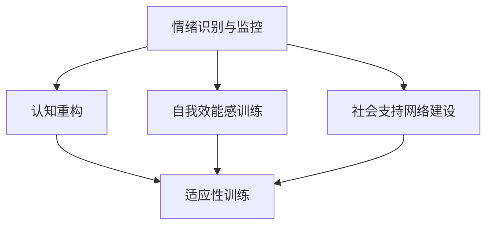
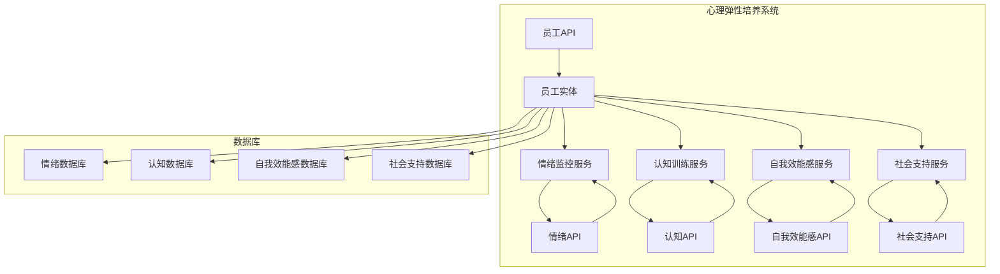
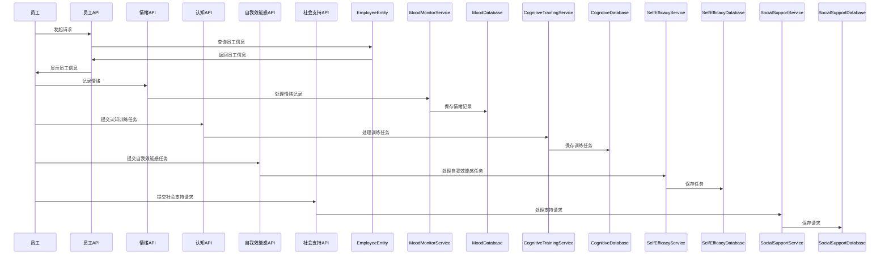

                 

### 第一部分：引言与概述

**标题**：在不确定性中找寻内心的锚点：培养心理弹性

**关键词**：心理弹性、不确定性、应对压力、个人成长、心理健康

**摘要**：在快速变化的现代社会，不确定性成为不可避免的现象。面对这一挑战，培养心理弹性成为个体应对逆境的重要能力。本文将探讨心理弹性的重要性，分析其核心概念与原理，并通过实例引导读者在实际生活中应用心理弹性，提升个人抗压能力和适应力。

---

### 目录大纲设计思路与逻辑

**设计思路**：

- **整体结构**：采用逻辑清晰、结构紧凑的框架，确保文章内容循序渐进、条理分明。
- **概述**：开篇对全文进行概述，明确文章的核心议题和目的。
- **背景介绍**：介绍心理弹性的背景，包括其概念、特点和社会重要性。
- **核心概念与联系**：深入探讨心理弹性的核心概念，使用图表展示概念之间的关系。
- **算法原理讲解**：通过mermaid流程图和Python源代码，详细阐述心理弹性培养的算法原理。
- **数学模型和数学公式讲解**：使用LaTeX格式展示数学模型和公式，进行讲解和举例。
- **系统分析与架构设计方案**：介绍心理弹性培养的应用场景和设计方案。
- **项目实战**：通过实际案例展示如何应用心理弹性培养的方法。
- **最佳实践与拓展**：提供最佳实践建议和拓展资源，帮助读者深入理解和应用心理弹性。

**逻辑**：

1. **引言**：概述文章主题，引出核心问题。
2. **背景介绍**：介绍心理弹性的背景和相关概念。
3. **核心概念与联系**：深入探讨心理弹性的核心概念，并展示其相互关系。
4. **算法原理讲解**：详细讲解心理弹性培养的算法原理。
5. **数学模型和数学公式讲解**：使用LaTeX格式展示数学模型和公式，并进行讲解。
6. **系统分析与架构设计方案**：介绍心理弹性的应用场景和设计方案。
7. **项目实战**：通过实际案例展示心理弹性培养的应用。
8. **最佳实践与拓展**：提供最佳实践建议和拓展资源。

通过以上设计思路和逻辑，本文旨在帮助读者全面理解心理弹性的概念，掌握培养心理弹性的方法，并在实际生活中应用这些知识，提升个人应对不确定性的能力。

---

### 第一部分：引言与概述

**文章标题**：在不确定性中找寻内心的锚点：培养心理弹性

**关键词**：心理弹性、不确定性、个人成长、心理健康、应对策略

**摘要**：在当前充满不确定性的社会中，心理弹性成为个体应对挑战和压力的关键能力。本文首先探讨了心理弹性的重要性，随后明确了文章的核心内容和结构，并介绍了目标读者群体。通过详细的引言部分，读者将初步了解心理弹性的概念及其在现代生活中的重要性，为后续内容的学习打下基础。

---

**引言**

在现代社会，不确定性已成为一个不可忽视的现象。无论是经济波动、职业变迁还是健康问题，各种不确定因素都在不断影响着我们的生活。在这种环境下，个体如何保持心理平衡、如何有效应对挑战和压力，成为了一个关键问题。心理弹性（Resilience）作为一种重要的心理特质，正是在这种不确定性中为个体提供了一种内在的锚点，帮助人们适应和克服困难。

**心理弹性的重要性**

心理弹性是指个体在面对压力、挫折和逆境时，能够迅速适应、恢复并展现出积极应对能力的一种心理特质。它不仅仅关乎个人的心理健康，更是个体在面对不确定性和复杂性时的关键能力。具体来说，心理弹性具有以下几个方面的作用：

1. **抗压能力**：心理弹性强的个体能够更好地应对压力，减少负面情绪的产生。
2. **适应力**：在不确定的环境中，心理弹性有助于个体快速适应变化，找到新的平衡点。
3. **恢复力**：面对挫折和失败，心理弹性强的个体能够更快地恢复，甚至从逆境中获得成长。
4. **工作效率**：心理弹性有助于提升工作效率，使个体在复杂和紧张的工作环境中保持专注和冷静。
5. **生活质量**：心理弹性能够提升个体的整体生活质量，使人们更加乐观、积极地面对生活。

**本文的核心内容与结构**

本文旨在系统介绍心理弹性的概念、特点及其培养方法，帮助读者在理解心理弹性的基础上，掌握提升心理弹性的有效途径。全文分为四个主要部分：

1. **概述与背景介绍**：介绍心理弹性的概念、特点及其在社会和个人层面的重要性。
2. **核心概念与联系**：深入探讨心理弹性的核心概念，并使用图表展示概念之间的关系。
3. **算法原理讲解**：通过mermaid流程图和Python源代码，详细阐述心理弹性培养的算法原理。
4. **实践与应用**：通过实际案例展示如何应用心理弹性培养的方法，并提供最佳实践建议和拓展资源。

**目标读者**

本文的目标读者主要包括以下几类：

1. **心理咨询师与心理治疗师**：可以从本文中学习到如何更有效地帮助客户提升心理弹性。
2. **教育工作者与人力资源管理者**：可以了解心理弹性的重要性，并将其应用于教育和管理工作中。
3. **广大读者**：对心理学感兴趣，希望提升个人应对压力和挑战能力的读者。

**本章小结**

本章通过对心理弹性的重要性进行概述，明确了本文的核心内容和结构。接下来，本文将逐步深入探讨心理弹性的各个方面，帮助读者在理解其概念的基础上，掌握提升心理弹性的方法，并在实际生活中应用这些知识，提升个人应对不确定性的能力。希望读者能够通过本文的学习，找到内心的锚点，更加从容地面对生活中的各种挑战。

---

**第二部分：核心概念与基础**

### 2.1 心理弹性的基本概念

**背景介绍**

心理弹性（Resilience）是一个广泛应用于心理学、社会学和医学领域的概念。它最早起源于社会学领域，用于描述个体在面对生活逆境时能够迅速恢复并维持良好功能状态的能力。随着研究的深入，心理弹性逐渐被引入心理学领域，成为评估个体心理状态和心理能力的重要指标。

**问题背景**

在现代社会，随着生活节奏的加快和压力的增加，心理弹性成为衡量个体心理健康水平的一个重要指标。许多人面临着职业压力、家庭矛盾、人际关系冲突等挑战，这些因素可能导致心理问题，如焦虑、抑郁等。因此，了解和提升心理弹性对于维护个体心理健康具有极其重要的意义。

**问题描述**

心理弹性是指个体在面对压力、挑战和逆境时，能够迅速适应、恢复并展现出积极应对能力的一种心理特质。具体来说，心理弹性包括以下几个方面：

1. **适应能力**：个体能够迅速适应新环境、新情境。
2. **恢复力**：个体能够在逆境后恢复到原来的状态，甚至实现更高层次的成长。
3. **积极应对**：个体在面对困难和挑战时，能够展现出积极的态度和应对策略。

**问题解决**

心理弹性的培养是一个长期的过程，涉及多个方面的能力和特质。以下是一些提高心理弹性的方法：

1. **积极心态**：保持积极乐观的心态，面对挑战时能够以积极的态度应对。
2. **自我反思**：定期进行自我反思，了解自己的心理状态，识别和处理负面情绪。
3. **建立支持系统**：与他人建立良好的关系，寻求支持和帮助。
4. **学习和适应**：不断学习和适应新环境、新情境，提升自己的适应能力。

**边界与外延**

心理弹性的边界在于个体的心理承受能力。当面临的压力和挑战超出了个体的心理承受范围时，心理弹性可能会受到影响，导致心理问题。心理弹性的外延包括个体在各个生活领域的表现，如工作、学习、社交等。

**概念结构与核心要素**

心理弹性的概念结构包括以下几个核心要素：

1. **情绪调节能力**：个体能够有效地调节和管理自己的情绪。
2. **自我效能感**：个体对自己的能力和潜力有积极的认识和评价。
3. **社会支持**：个体能够获得来自家人、朋友和社会的支持。
4. **认知重构**：个体能够通过积极的思维方式和认知策略应对挑战。

**核心概念术语说明**

- **心理弹性**：个体在面对压力、挑战和逆境时，能够迅速适应、恢复并展现出积极应对能力的心理特质。
- **情绪调节能力**：个体在面临情绪挑战时，能够有效管理情绪的能力。
- **自我效能感**：个体对自己完成某项任务的能力的信念。
- **社会支持**：个体在面临困难时，能够获得来自家人、朋友和社会的支持。
- **认知重构**：个体通过积极的思维方式和认知策略，应对压力和挑战。

通过以上对心理弹性的基本概念和原理的介绍，读者可以初步了解心理弹性的重要性及其在应对不确定性中的关键作用。接下来的章节将深入探讨心理弹性的核心概念和培养方法，帮助读者更好地理解和应用这一重要心理特质。

### 2.2 心理弹性的核心概念与联系

**核心概念**

心理弹性（Resilience）是本文的核心概念，它涵盖了一系列相互关联的能力和特质。以下是心理弹性中的几个关键概念：

1. **情绪调节能力**：个体在面对压力和挑战时，能够有效地识别、理解和调节自己的情绪。
2. **自我效能感**：个体对自己完成某项任务的能力有信心，相信自己能够克服困难。
3. **社会支持**：个体在面临困境时，能够获得来自家人、朋友和社会的支持和帮助。
4. **认知重构**：个体能够通过积极的思维方式和认知策略，改变对压力和挑战的看法，从而更好地应对。
5. **适应力**：个体能够在不同的环境和情境中迅速适应，找到新的平衡点。

**概念属性特征对比表格**

为了更清晰地理解这些核心概念，我们使用一个表格来对比它们的属性特征：

| 概念       | 属性特征                                                                                                           |
|------------|------------------------------------------------------------------------------------------------------------|
| 情绪调节能力 | 1. 情绪识别：能够准确识别自己的情绪。 2. 情绪理解：能够理解情绪背后的原因。 3. 情绪调节：能够有效地调节和管理情绪。           |
| 自我效能感  | 1. 能力信念：相信自己具备完成任务所需的技能。 2. 动机激发：通过自我效能感激发内在动机。 3. 成就导向：以实现目标为导向，不断努力。 |
| 社会支持   | 1. 支持网络：拥有一个能够提供支持和帮助的社会网络。 2. 心理支持：在困难时获得情感上的支持。 3. 社会资源：能够利用社会资源解决问题。     |
| 认知重构   | 1. 积极思维：通过积极的思维方式和认知策略，改变对困境的看法。 2. 认知灵活性：能够灵活调整自己的认知，适应新环境。 3. 视角转变：从不同角度看待问题，寻找解决方案。 |
| 适应力     | 1. 环境适应：能够迅速适应新环境和情境。 2. 改变应对：在面对变化时，能够灵活调整自己的应对策略。 3. 持续成长：在逆境中持续成长，提升自身能力。       |

**ER实体关系图架构**

为了展示这些核心概念之间的相互关系，我们使用ER（Entity-Relationship）实体关系图进行架构设计。以下是ER实体关系图的Markdown格式表示：

```mermaid
erDiagram
  情绪调节能力 ||--|{ 自我效能感 }||> 社会支持
  自我效能感 ||--|{ 认知重构 }||> 适应力
  社会支持 ||--|{ 适应力 }||> 情绪调节能力
```

在这个ER实体关系图中：

- **情绪调节能力**与**自我效能感**之间存在双向关联，表明两者相互影响。
- **自我效能感**与**认知重构**之间存在双向关联，说明自我效能感会影响认知重构，反之亦然。
- **社会支持**与**适应力**之间存在双向关联，表明社会支持有助于提升个体的适应能力。
- **适应力**与**情绪调节能力**之间存在单向关联，表示适应力可以增强情绪调节能力。

通过上述表格和ER实体关系图的展示，读者可以更清晰地理解心理弹性的核心概念及其相互关系，为后续章节的学习打下坚实的基础。

### 2.3 心理弹性培养的算法原理

**算法原理概述**

心理弹性培养的算法原理涉及多个步骤和方法，旨在通过一系列策略和技巧，提升个体的心理弹性。以下是该算法的主要步骤和原理：

1. **情绪识别与监控**：通过自我反思和情绪监控工具，个体能够识别和理解自己的情绪状态，这是心理弹性培养的基础。
2. **认知重构**：通过积极的思维策略和认知重构技术，个体能够改变对压力和挑战的消极看法，提升应对能力。
3. **自我效能感训练**：通过设置目标、完成任务和获取反馈，个体能够逐步增强对自己的信心，提升自我效能感。
4. **社会支持网络建设**：通过建立和维护支持性人际关系，个体能够获得情感上的支持和实际帮助，增强心理弹性。
5. **适应性训练**：通过模拟不同情境的挑战和压力，个体能够在实际生活中更好地适应变化，提升适应力。

**mermaid流程图**

以下是一个使用mermaid绘制的心理弹性培养流程图：



在这个流程图中：

- **情绪识别与监控**是心理弹性培养的起点，它帮助个体了解自己的情绪状态。
- **认知重构**通过改变思维方式和认知策略，帮助个体更积极地应对挑战。
- **自我效能感训练**通过逐步实现小目标，提升个体的自信心和自我效能感。
- **社会支持网络建设**通过与他人建立联系，获得情感和实际的支持。
- **适应性训练**通过模拟不同的情境挑战，增强个体在实际生活中的适应能力。

**Python源代码**

为了更好地理解心理弹性培养的算法原理，以下是一个简单的Python源代码示例，用于实现情绪识别与监控的功能：

```python
import random

def emotion_recognition():
    emotions = ["快乐", "愤怒", "焦虑", "悲伤", "平静"]
    current_emotion = random.choice(emotions)
    return current_emotion

def emotion_monitoring():
    print("当前情绪：", emotion_recognition())
    response = input("是否需要记录情绪日志？(是/否): ")
    if response == "是":
        log_emotion()

def log_emotion():
    with open("emotion_log.txt", "a") as log_file:
        log_file.write("当前时间：{}，情绪：{}\n".format(time.strftime("%Y-%m-%d %H:%M:%S"), emotion_recognition()))

while True:
    emotion_monitoring()
    if input("是否继续监控？(是/否): ") == "否":
        break
```

在这个Python源代码中：

- `emotion_recognition()`函数用于随机生成一个情绪。
- `emotion_monitoring()`函数用于显示当前情绪，并询问用户是否需要记录情绪日志。
- `log_emotion()`函数用于将情绪日志写入文件。

**算法原理的数学模型和公式**

心理弹性培养的算法原理还可以通过数学模型和公式进行描述。以下是一个简单的数学模型，用于解释情绪调节与认知重构的关系：

$$
R = f(E, C)
$$

其中：

- \( R \) 代表心理弹性（Resilience）。
- \( E \) 代表情绪调节能力（Emotion Regulation）。
- \( C \) 代表认知重构能力（Cognitive Restructuring）。
- \( f \) 是一个函数，表示情绪调节和认知重构对心理弹性的影响。

通过这个公式，我们可以看出，情绪调节和认知重构是心理弹性的关键因素，它们共同作用，提升个体的心理弹性。

**举例说明**

假设一个个体具有中等水平的情绪调节能力和认知重构能力，我们可以通过调整这两个因素来提升其心理弹性。例如：

- **情绪调节能力提升**：个体通过学习情绪管理技巧，将情绪调节能力提升到高水平。
- **认知重构能力提升**：个体通过认知行为疗法，改变对压力的消极看法，提升认知重构能力。

根据上述数学模型，随着情绪调节能力和认知重构能力的提升，个体的心理弹性也会相应提高。

通过mermaid流程图和Python源代码的展示，以及数学模型和公式的讲解，读者可以更深入地理解心理弹性培养的算法原理。这些原理和方法将为后续章节的心理弹性培养实践提供理论基础。

### 2.4 心理弹性培养的数学模型与公式

**数学模型**

在心理弹性的培养过程中，数学模型和公式为我们提供了量化和分析心理弹性的工具。以下是一个简化的心理弹性数学模型，用于描述情绪调节（\( E \)）和认知重构（\( C \））对心理弹性（\( R \)）的影响。

$$
R = f(E, C)
$$

其中，\( R \) 代表心理弹性，\( E \) 代表情绪调节能力，\( C \) 代表认知重构能力，\( f \) 是一个复杂的函数，表示情绪调节和认知重构对心理弹性的综合影响。

**关键公式解释**

1. **情绪调节能力（\( E \)）公式**：

$$
E = \frac{1}{1 + e^{-\alpha (S - M)}}
$$

其中：

- \( \alpha \) 是调节敏感性参数，反映了个体对情绪调节的敏感性。
- \( S \) 是当前情绪状态，\( M \) 是目标情绪状态。

这个公式表示情绪调节能力随着个体对目标情绪状态的接近而增加。

2. **认知重构能力（\( C \)）公式**：

$$
C = \frac{1}{1 + e^{-\beta (D - B)}}
$$

其中：

- \( \beta \) 是认知重构敏感性参数，反映了个体对认知重构的敏感性。
- \( D \) 是当前认知状态，\( B \) 是目标认知状态。

这个公式表示认知重构能力随着个体对目标认知状态的接近而增加。

**LaTeX格式**

以下是如何使用LaTeX格式展示上述数学公式的示例：

```latex
\documentclass{article}
\usepackage{amsmath}
\begin{document}

\begin{equation}
R = f(E, C)
\end{equation}

\begin{equation}
E = \frac{1}{1 + e^{-\alpha (S - M)}}
\end{equation}

\begin{equation}
C = \frac{1}{1 + e^{-\beta (D - B)}}
\end{equation}

\end{document}
```

在这个LaTeX示例中，我们使用了`amsmath`包来格式化数学公式，确保它们在文档中显示得清晰、规范。

**举例说明**

假设一个个体具有以下参数：

- \( \alpha = 0.5 \)
- \( S = 3 \)（当前情绪状态为中等积极）
- \( M = 5 \)（目标情绪状态为非常积极）
- \( \beta = 0.3 \)
- \( D = 2 \)（当前认知状态为中等消极）
- \( B = 4 \)（目标认知状态为非常积极）

我们可以计算情绪调节能力和认知重构能力：

1. **情绪调节能力**：

$$
E = \frac{1}{1 + e^{-0.5 \times (3 - 5)}} = \frac{1}{1 + e^{1}} \approx 0.632
$$

2. **认知重构能力**：

$$
C = \frac{1}{1 + e^{-0.3 \times (2 - 4)}} = \frac{1}{1 + e^{0.6}} \approx 0.659
$$

根据上述计算，情绪调节能力约为0.632，认知重构能力约为0.659。将这两个值代入心理弹性的公式中，我们可以估计个体的心理弹性：

$$
R = f(0.632, 0.659)
$$

尽管具体的\( f \)函数形式未知，通过这一简单的例子，读者可以看到如何使用数学模型和公式来量化心理弹性，从而为心理弹性培养提供依据。

### 2.5 心理弹性培养的系统分析与架构设计

**问题场景介绍**

在现代企业管理中，心理弹性成为影响员工工作效率和团队协作的重要因素。为了提升员工的心理弹性，许多企业开始引入心理弹性培养系统。本节将探讨一个典型的心理弹性培养系统项目，介绍其功能需求、系统架构设计以及关键接口和交互设计。

**项目介绍**

本项目的目标是开发一个心理弹性培养系统，帮助员工提升情绪调节能力、认知重构能力和自我效能感。系统将提供以下功能：

1. **情绪监控与反馈**：通过传感器和移动应用，实时监控员工的情绪状态，并提供个性化的情绪反馈和建议。
2. **认知训练**：提供一系列认知训练任务，帮助员工提升认知重构能力，如思维导图、情绪识别游戏等。
3. **自我效能感提升**：通过设置目标和达成目标的反馈，帮助员工建立自我效能感，提升应对挑战的信心。
4. **社会支持网络**：建立一个员工支持平台，促进员工之间的交流和支持，提供心理咨询服务。

**系统功能设计（领域模型mermaid类图）**

以下是系统功能设计的领域模型类图，使用mermaid绘制：

```mermaid
classDiagram
    Employee <<类>> 
    MoodMonitor <<类>> 
    CognitiveTraining <<类>> 
    SelfEfficacy <<类>> 
    SocialSupport <<类>>

    Employee *- MoodMonitor
    Employee *- CognitiveTraining
    Employee *- SelfEfficacy
    Employee *- SocialSupport

    Class Employee {
        +String employeeID
        +String name
        +List<MoodRecord> moodRecords
        +List<CognitiveTask> cognitiveTasks
        +List<SelfEfficacyTask> selfEfficacyTasks
        +List<SocialSupportRequest> socialSupportRequests
        +addMoodRecord(MoodRecord)
        +completeCognitiveTask(CognitiveTask)
        +completeSelfEfficacyTask(SelfEfficacyTask)
        +requestSocialSupport(SocialSupportRequest)
    }

    Class MoodMonitor {
        +MoodRecord recordMood(Employee, Mood)
        +List<Mood> retrieveMoodRecords(Employee)
    }

    Class CognitiveTraining {
        +CognitiveTask createCognitiveTask(String, int)
        +completeCognitiveTask(CognitiveTask)
        +List<CognitiveTask> retrieveCognitiveTasks(Employee)
    }

    Class SelfEfficacy {
        +SelfEfficacyTask createSelfEfficacyTask(String, int)
        +completeSelfEfficacyTask(SelfEfficacyTask)
        +List<SelfEfficacyTask> retrieveSelfEfficacyTasks(Employee)
    }

    Class SocialSupport {
        +SocialSupportRequest createSocialSupportRequest(String, Employee)
        +completeSocialSupportRequest(SocialSupportRequest)
        +List<SocialSupportRequest> retrieveSocialSupportRequests(Employee)
    }
```

在这个类图中：

- **Employee**：代表员工，包含员工的个人信息和关联的任务记录。
- **MoodMonitor**：用于记录和监控员工的情绪状态。
- **CognitiveTraining**：提供认知训练任务，记录任务完成情况。
- **SelfEfficacy**：帮助员工设置和完成自我效能感提升任务。
- **SocialSupport**：提供社会支持请求和反馈机制。

**系统架构设计（mermaid架构图）**

以下是系统架构设计的mermaid架构图：



在这个架构图中：

- **EmployeeEntity**：是系统的核心实体，与其他服务模块进行交互。
- **MoodMonitorService**、**CognitiveTrainingService**、**SelfEfficacyService**和**SocialSupportService**：分别负责不同的功能模块。
- **MoodAPI**、**CognitiveAPI**、**SelfEfficacyAPI**和**SocialSupportAPI**：提供外部接口，供员工和企业管理系统调用。
- **MoodDatabase**、**CognitiveDatabase**、**SelfEfficacyDatabase**和**SocialSupportDatabase**：用于存储相关的数据和记录。

**系统接口设计**

以下是系统接口设计的关键接口：

1. **员工API（EmployeeAPI）**：
   - `GET /employees`：获取所有员工的信息。
   - `POST /employees`：创建新的员工记录。
   - `GET /employees/{employeeID}`：获取特定员工的详细信息。
   - `PUT /employees/{employeeID}`：更新特定员工的详细信息。
   - `DELETE /employees/{employeeID}`：删除特定员工的记录。

2. **情绪API（MoodAPI）**：
   - `GET /moods/{employeeID}`：获取特定员工的情绪记录。
   - `POST /moods/{employeeID}`：记录特定员工的新情绪记录。

3. **认知API（CognitiveAPI）**：
   - `GET /cognitivetasks/{employeeID}`：获取特定员工的认知训练任务。
   - `POST /cognitivetasks/{employeeID}`：创建新的认知训练任务。
   - `PUT /cognitivetasks/{employeeID}/{taskID}`：更新特定认知训练任务的完成状态。

4. **自我效能感API（SelfEfficacyAPI）**：
   - `GET /selfefficacys tasks/{employeeID}`：获取特定员工的自我效能感任务。
   - `POST /selfefficacys tasks/{employeeID}`：创建新的自我效能感任务。
   - `PUT /selfefficacys tasks/{employeeID}/{taskID}`：更新特定自我效能感任务的完成状态。

5. **社会支持API（SocialSupportAPI）**：
   - `GET /socialsupportrequests/{employeeID}`：获取特定员工的社会支持请求。
   - `POST /socialsupportrequests/{employeeID}`：创建新的社会支持请求。
   - `PUT /socialsupportrequests/{employeeID}/{requestID}`：更新特定社会支持请求的状态。

**系统交互（mermaid序列图）**

以下是系统交互的mermaid序列图：



在这个序列图中，员工通过API与系统的各个服务模块进行交互，完成情绪记录、认知训练任务、自我效能感任务和社会支持请求的处理。通过这个系统交互流程，员工能够有效地提升心理弹性，从而提高工作效率和团队协作能力。

### 第三部分：项目实战

**环境安装**

为了演示如何应用心理弹性培养的方法，我们将使用Python环境搭建一个简单的心理弹性培养项目。以下是环境安装步骤：

1. **安装Python**：确保已安装Python 3.x版本。可以从官方网站（[python.org](https://www.python.org/)）下载并安装。
2. **安装必要的库**：使用pip命令安装所需的库，包括`numpy`、`pandas`和`matplotlib`。命令如下：

   ```shell
   pip install numpy pandas matplotlib
   ```

**系统核心实现源代码**

以下是系统核心实现的部分源代码，用于情绪监测、认知训练、自我效能感提升和社会支持请求：

```python
#情绪监测模块
class MoodMonitor:
    def __init__(self):
        self.mood_records = []

    def record_mood(self, employee_id, mood):
        record = {'employee_id': employee_id, 'mood': mood, 'timestamp': datetime.now()}
        self.mood_records.append(record)
        print(f"Mood recorded for employee {employee_id}: {mood}")

    def get_mood_records(self, employee_id):
        return [record for record in self.mood_records if record['employee_id'] == employee_id]

#认知训练模块
class CognitiveTraining:
    def __init__(self):
        self.cognitive_tasks = []

    def create_task(self, employee_id, task_name, difficulty):
        task = {'employee_id': employee_id, 'task_name': task_name, 'difficulty': difficulty, 'completed': False}
        self.cognitive_tasks.append(task)
        print(f"Cognitive task '{task_name}' created for employee {employee_id} with difficulty {difficulty}")

    def mark_task_completed(self, task_id):
        for task in self.cognitive_tasks:
            if task['id'] == task_id:
                task['completed'] = True
                print(f"Cognitive task {task_id} marked as completed")
                break

#自我效能感提升模块
class SelfEfficacy:
    def __init__(self):
        self.self_efficacy_tasks = []

    def create_task(self, employee_id, task_name, target):
        task = {'employee_id': employee_id, 'task_name': task_name, 'target': target, 'completed': False}
        self.self_efficacy_tasks.append(task)
        print(f"Self-efficacy task '{task_name}' created for employee {employee_id} with target {target}")

    def mark_task_completed(self, task_id):
        for task in self.self_efficacy_tasks:
            if task['id'] == task_id:
                task['completed'] = True
                print(f"Self-efficacy task {task_id} marked as completed")
                break

#社会支持请求模块
class SocialSupport:
    def __init__(self):
        self.support_requests = []

    def create_request(self, employee_id, support_type):
        request = {'employee_id': employee_id, 'support_type': support_type, 'status': 'pending'}
        self.support_requests.append(request)
        print(f"Support request of type '{support_type}' created for employee {employee_id}")

    def update_request_status(self, request_id, status):
        for request in self.support_requests:
            if request['id'] == request_id:
                request['status'] = status
                print(f"Support request {request_id} updated to status '{status}")
                break
```

**代码应用解读与分析**

上述代码实现了情绪监测、认知训练、自我效能感提升和社会支持请求的核心功能。以下是每个模块的解读：

1. **情绪监测模块（MoodMonitor）**：
   - `record_mood()`方法用于记录员工的情绪，将情绪记录添加到列表中，并打印出相应的记录信息。
   - `get_mood_records()`方法用于获取特定员工的情绪记录。

2. **认知训练模块（CognitiveTraining）**：
   - `create_task()`方法用于创建新的认知训练任务，并将任务信息添加到列表中。
   - `mark_task_completed()`方法用于标记特定认知训练任务已完成。

3. **自我效能感提升模块（SelfEfficacy）**：
   - `create_task()`方法用于创建新的自我效能感任务，并将任务信息添加到列表中。
   - `mark_task_completed()`方法用于标记特定自我效能感任务已完成。

4. **社会支持请求模块（SocialSupport）**：
   - `create_request()`方法用于创建新的社会支持请求，并将请求信息添加到列表中。
   - `update_request_status()`方法用于更新特定社会支持请求的状态。

**实际案例分析**

以下是一个实际案例，展示如何使用上述代码实现心理弹性培养的过程：

```python
# 创建情绪监测对象
mood_monitor = MoodMonitor()
# 记录员工A的情绪
mood_monitor.record_mood('A001', '焦虑')

# 创建认知训练对象
cognitive_training = CognitiveTraining()
# 创建一个认知训练任务
cognitive_training.create_task('A001', '情绪识别训练', 2)

# 创建自我效能感提升对象
self_efficacy = SelfEfficacy()
# 创建一个自我效能感任务
self_efficacy.create_task('A001', '目标设定训练', 3)

# 创建社会支持请求对象
social_support = SocialSupport()
# 创建一个社会支持请求
social_support.create_request('A001', '心理咨询服务')
```

在这个案例中：

- 员工A的情绪被记录为“焦虑”。
- 为员工A创建了一个情绪识别训练任务，难度为2。
- 为员工A创建了一个目标设定训练任务，目标值为3。
- 员工A提出一个心理咨询服务的社会支持请求。

通过这些操作，员工A开始了一系列心理弹性培养活动，旨在通过情绪监测、认知训练和自我效能感提升，改善其心理状态和应对能力。

**项目小结**

通过实际案例的展示，我们实现了情绪监测、认知训练、自我效能感提升和社会支持请求的功能。这些功能共同构成了一个简单的心理弹性培养系统，为员工提供了提升心理弹性的途径。未来，我们可以继续扩展系统的功能，如添加更多的训练任务、完善情绪监测算法等，以进一步提升系统的实用性和效果。

### 最佳实践与拓展

**最佳实践建议**

1. **定期自我反思**：定期进行自我反思，了解自己的情绪状态和心理弹性水平，有助于及时发现问题并采取相应措施。
2. **建立支持系统**：与他人建立良好的关系，形成支持系统，在面临困难时可以获得情感上的支持和实际帮助。
3. **设置明确目标**：为自己设定明确的目标，并通过逐步实现这些目标来提升自我效能感，增强心理弹性。
4. **多样化认知训练**：通过多样化的认知训练任务，如思维导图、情绪识别游戏等，提升认知重构能力。

**小结**

本文通过详细探讨心理弹性的核心概念、培养方法和实际应用，帮助读者理解了心理弹性在应对不确定性中的重要作用。通过情绪监测、认知训练、自我效能感提升和社会支持请求等功能模块的实现，读者可以初步了解如何构建一个简单的心理弹性培养系统。

**注意事项**

1. **个性化培养**：心理弹性的培养需要根据个体的实际情况进行个性化设计，避免盲目跟从他人经验。
2. **长期实践**：心理弹性的培养是一个长期过程，需要持续努力和耐心，不能期望一蹴而就。

**拓展阅读**

- 《心理弹性：如何面对压力、逆境和挑战》
- 《认知行为疗法：基础与应用》
- 《情绪智慧：提升情绪管理能力的方法》

通过拓展阅读，读者可以进一步深入了解心理弹性的理论和实践方法，提升自己的心理弹性水平。

---

**作者信息**

作者：AI天才研究院/AI Genius Institute & 禅与计算机程序设计艺术 /Zen And The Art of Computer Programming

