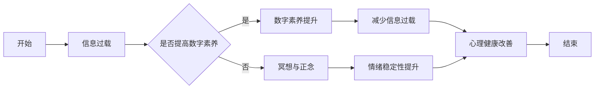
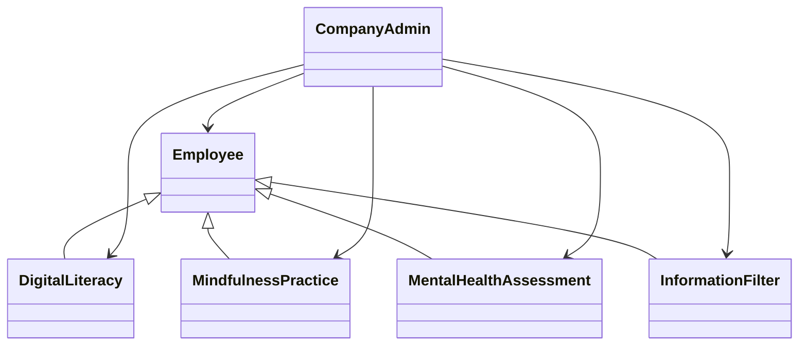
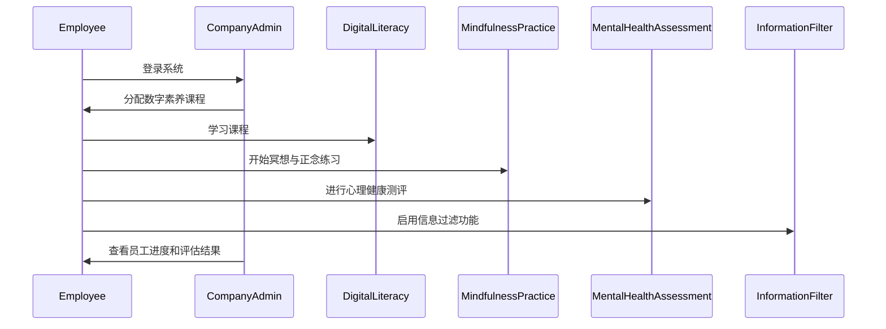
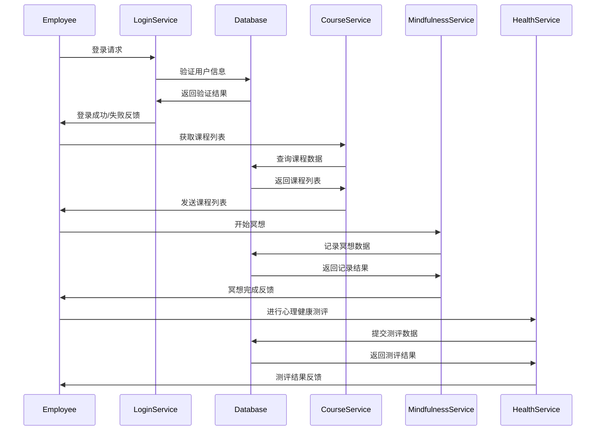

                 

## 引言

在当今这个数字化时代，信息如洪水般涌来，不断冲击着我们的生活和思维方式。从社交媒体的推送，到电子邮件的轰炸，再到无数在线平台的更新，我们似乎被淹没在信息的海洋中。面对如此庞大的信息流，人们开始感到压力重重，精神疲惫。因此，如何在信息洪流中寻找意义，成为了现代社会的一个重大课题。

### 数字时代的来临

随着互联网技术的飞速发展，我们进入了数字时代。在这个时代，信息的获取变得前所未有的便捷，但也带来了前所未有的挑战。一方面，信息的爆炸式增长为我们提供了无限的可能性，使我们能够轻松地接触到各种知识、技能和资源。另一方面，信息的泛滥也带来了许多负面影响。人们开始感到被信息淹没，难以消化和筛选，导致信息焦虑和心理压力。

### 信息过载的问题

信息过载已经成为现代社会的一大问题。首先，人们每天需要处理大量的信息，这使得大脑处于持续的工作状态，导致精神疲劳。其次，信息过载会引发选择困难，因为我们需要在无数的信息中做出选择，这种选择压力会让人感到焦虑和不安。最后，信息过载还会影响人们的注意力和专注力，使人们难以集中精力处理重要的事务。

### 寻找人生意义的重要性

在信息洪流中，寻找人生意义变得尤为重要。人生意义不仅是指追求物质财富和事业成功，更重要的是寻找内心的平静和满足。当我们找到自己生命的意义时，我们会更加明确自己的目标，更加坚定地走自己的路。此外，寻找人生意义还能帮助我们更好地应对压力，保持心理健康。

### 总结

数字时代的到来改变了我们的生活方式，也带来了许多挑战。在信息过载的环境中，我们需要寻找方法来保持精神健康和找到人生意义。接下来，我们将深入探讨数字时代的精神挑战，介绍各种应对策略，并探讨如何在数字化生活中保持人际关系和社会联系。让我们一步步思考，找到属于自己的精神导航。

## 第一部分：数字时代的精神挑战

### 1.1 心理健康问题

#### 1.1.1 压力和焦虑

数字时代带来的信息过载和心理负担，首先表现在人们感到的压力和焦虑上。据统计，超过70%的互联网用户表示，他们每天都会因为处理大量信息而感到压力。这种压力不仅体现在工作和学习上，也渗透到了日常生活中。人们害怕错过重要的信息，害怕因为缺乏信息而落后于他人，这种恐惧感加剧了他们的焦虑情绪。

#### 1.1.2 情绪波动

在信息过载的环境中，人们的情绪波动也变得异常明显。社交媒体上的新闻、朋友圈的动态、邮件的提醒，这些看似简单的信息，都可能成为情绪波动的触发点。当人们收到负面信息时，比如一篇报道灾难的新闻，他们可能会感到沮丧和不安。而当他们浏览到一些积极的信息时，比如一篇成功学文章，他们可能会感到兴奋和充满动力。这种频繁的情绪波动对心理健康造成了极大的影响。

#### 1.1.3 焦虑症和抑郁症

长期的焦虑和情绪波动可能导致更严重的精神健康问题，如焦虑症和抑郁症。焦虑症的表现包括持续的紧张和不安，以及对未来的过度担忧。抑郁症则表现为长期的悲伤、兴趣丧失和精力不足。数字时代的信息过载为这些心理疾病提供了肥沃的土壤。研究表明，数字媒体的使用与抑郁症的发病率呈正相关，特别是在年轻人中更为明显。

### 1.2 信息焦虑

#### 1.2.1 信息过载的原因

信息焦虑的根本原因是信息过载。在数字时代，我们每天都会接触到海量的信息，这些信息来自各种渠道，包括社交媒体、新闻网站、电子邮件、短信等。尽管这些信息为我们提供了便利，但它们也让我们感到无所适从。我们不知道哪些信息是重要的，哪些是无关紧要的，这种不确定性加剧了我们的焦虑感。

#### 1.2.2 信息焦虑的表现

信息焦虑的表现形式多种多样。首先，人们会感到时间紧迫，觉得自己无法处理所有信息，导致拖延和效率低下。其次，他们会感到内心不安，害怕错过重要信息，这种恐惧感会让他们频繁地查看社交媒体和电子邮件。最后，信息焦虑还可能导致睡眠障碍，因为人们害怕在夜间错过重要信息，从而影响睡眠质量。

#### 1.2.3 应对策略

为了应对信息焦虑，我们可以采取以下策略。首先，我们需要设定合理的期望，意识到自己无法处理所有的信息。其次，我们可以使用信息过滤工具，如新闻订阅和邮件过滤，来减少不必要的干扰。此外，定期进行冥想和正念练习，有助于缓解焦虑情绪，提高心理弹性。最后，培养良好的生活习惯，如规律的作息时间和适量的运动，也有助于改善心理健康。

### 总结

数字时代的精神挑战主要体现在心理健康问题和信息焦虑上。长期的焦虑和情绪波动可能导致严重的心理疾病，而信息过载则是导致这些问题的根本原因。通过采取有效的应对策略，我们可以减轻这些压力，保持心理健康。接下来，我们将探讨如何在数字时代中采取各种应对策略，以寻找内心的平静和意义。

## 第二部分：应对策略和方法

### 2.1 冥想与正念

#### 2.1.1 冥想的基础

冥想是一种古老的心灵训练方法，旨在通过专注和冥思来达到内心的平静。冥想的基础在于培养专注力，使我们能够专注于当下的体验，而不是被外界的信息所干扰。通过定期冥想，人们可以学会更好地控制自己的情绪，提高心理弹性。

#### 2.1.2 正念练习

正念练习是冥想的一种形式，它强调对当前体验的觉察和接纳。通过正念练习，人们可以学会更加敏锐地察觉自己的情绪和身体感受，而不是被它们所支配。这种练习有助于减少焦虑和压力，提高生活质量。

#### 2.1.3 冥想与心理健康

冥想和正念练习已被广泛研究，并在提高心理健康方面显示出显著效果。一项研究表明，定期的冥想练习可以显著减少焦虑和抑郁症状，提高情绪稳定性。此外，冥想还有助于改善睡眠质量，减少慢性疼痛，提高整体生活质量。

### 2.2 数字素养

#### 2.2.1 数字素养的定义

数字素养是指人们使用数字技术和工具的能力，包括信息搜索、评估、创建和分享。数字素养不仅涉及技术技能，还包括理解数字媒体、网络安全、隐私保护等方面的知识。

#### 2.2.2 提高数字素养的方法

提高数字素养的方法包括参加培训课程、阅读相关书籍和在线资源，以及实际操作练习。此外，培养批判性思维能力，学会辨别信息的真实性和可靠性，也是提高数字素养的重要部分。

#### 2.2.3 数字素养的重要性

数字素养在数字时代至关重要。具备良好的数字素养，可以使人们更加高效地获取和处理信息，避免被信息过载所困扰。此外，数字素养还有助于保护个人隐私和安全，避免成为网络诈骗和黑客攻击的目标。

### 2.3 其他策略

#### 2.3.1 心理咨询

心理咨询是一种有效的应对策略，可以帮助人们处理心理问题和情绪困扰。通过心理咨询，人们可以学会更健康的应对机制，提高心理韧性。

#### 2.3.2 社交活动

定期参加社交活动，如聚会、运动和兴趣小组，有助于缓解压力，增强社交支持网络。社交活动可以提供情感支持和人际交往的机会，从而改善心理健康。

#### 2.3.3 运动与休闲

定期进行适量的运动和休闲活动，有助于缓解压力，提高心理健康。运动可以释放体内的压力激素，如皮质醇，同时促进内啡肽的分泌，带来愉悦感。休闲活动，如听音乐、看电影或阅读，也可以帮助人们放松心情，找到内心的宁静。

### 总结

在数字时代中，面对信息过载和精神挑战，我们可以采取多种应对策略来保持心理健康。冥想和正念练习有助于培养专注力和情绪稳定性，数字素养提高我们的信息处理能力，而心理咨询、社交活动和运动休闲则为我们的心理健康提供了全方位的支持。通过这些策略，我们可以在信息洪流中找到属于自己的精神导航。

## 第三部分：数字化生活与人际关系

### 3.1 数字化生活的挑战

#### 3.1.1 人际关系的疏离

随着数字技术的普及，人们越来越多地依赖社交媒体和网络通信来维护人际关系。然而，这种数字化沟通方式也带来了人际关系的疏离。研究发现，过度依赖社交媒体会导致人际关系的表面化和肤浅化。人们通过点赞、评论和私信来维持关系，但缺乏深层次的交流和情感连接。

#### 3.1.2 社交障碍

数字时代的信息过载也带来了社交障碍。人们在社交媒体上接收到的信息量巨大，这使得他们感到疲惫和无法应对。这种情况下，人们往往选择逃避社交互动，导致社交障碍的形成。此外，社交媒体上的虚假信息和误导信息也可能导致社交信任的破裂。

#### 3.1.3 数字化时代的社交技巧

为了应对数字化生活带来的挑战，我们需要培养一些新的社交技巧。首先，要学会筛选信息，关注高质量的内容，避免被低质量的、无意义的信息所淹没。其次，要提高批判性思维能力，学会辨别信息的真实性和可靠性。此外，还可以通过参加线上社交活动和兴趣小组，来扩大社交圈子，增强社交互动。

### 3.2 保持人际联系

#### 3.2.1 线上社交平台的使用

尽管线上社交平台存在一些挑战，但它们也是保持人际联系的重要工具。通过合理使用线上社交平台，我们可以与朋友、家人和同事保持联系。例如，定期在社交媒体上发布生活动态，参加线上聚会和兴趣小组，都是保持人际联系的好方法。此外，还可以使用视频通话工具，如Zoom、Skype等，来进行面对面的交流。

#### 3.2.2 线下活动的组织

为了弥补线上社交的不足，我们可以定期组织线下活动，如聚会、运动和兴趣小组。这些活动不仅能够增强人际关系，还能提供一种面对面的交流机会，促进情感的深度交流。例如，可以组织一次户外徒步活动，或者定期举行读书会，这些活动都能带来乐趣和情感的共鸣。

#### 3.2.3 沟通技巧的提升

在数字化生活中，提升沟通技巧也至关重要。有效的沟通能够减少误解和冲突，增强人际关系的稳定性。首先，要学会倾听，尊重对方的观点和感受。其次，要善于表达自己的想法和情感，避免使用攻击性语言。最后，要学会在沟通中寻找共同点，建立共识。

### 总结

在数字时代，保持人际关系和社会联系面临着新的挑战。然而，通过合理使用线上社交平台、组织线下活动，以及提升沟通技巧，我们可以克服这些挑战，维持健康的人际关系。数字化生活并不意味着人际关系的疏远，只要我们用心经营，依然可以在虚拟世界中找到真实的情感连接。

## 第四部分：数字时代的教育和学习

### 4.1 数字化教育

#### 4.1.1 教育模式的转变

数字化教育改变了传统的教育模式，使学习变得更加灵活和个性化。在线教育平台如Coursera、edX和Udemy等，提供了大量的课程资源，让学生可以根据自己的兴趣和需求选择课程。此外，数字化教育还允许学生随时随地进行学习，不受时间和地点的限制。这种灵活性提高了学习的效率和效果，使学习变得更加便捷和高效。

#### 4.1.2 在线教育的优势与挑战

在线教育的优势在于其灵活性和全球化的资源。学生可以接触到世界顶级的教育资源和讲师，学习领域不再局限于本地。此外，在线教育还可以提供互动式学习体验，如实时问答和在线讨论，增强学习的参与感和互动性。

然而，在线教育也面临一些挑战。首先，自律性问题。在线学习需要学生自我管理时间，避免拖延和分心。其次，社交互动不足。在线学习缺乏面对面的互动，可能导致学生的社交技能和人际关系受到影响。最后，技术问题。在线教育依赖于稳定的网络和技术支持，技术故障可能会影响学习体验。

#### 4.1.3 如何适应数字化教育

为了适应数字化教育，学生需要采取以下策略。首先，培养自律能力，制定学习计划和目标，确保学习进度。其次，积极参与在线讨论和互动，与同学和讲师进行沟通，增强社交互动。此外，学生还应该学会使用各种在线学习工具和资源，如学习管理工具、在线图书馆和学术搜索引擎，提高学习效率。

### 4.2 数字时代的学习

#### 4.2.1 学习方法

在数字时代，学习方法也需要适应新的环境和要求。首先，要学会信息筛选，从海量的信息中找到有价值的学习资源。其次，要培养批判性思维能力，学会评估信息的真实性和可靠性。此外，项目式学习和协作学习也成为重要的学习方法。通过实际项目和团队合作，学生可以更好地理解和应用所学知识。

#### 4.2.2 技能培养

数字时代的学习不仅关注知识的获取，更注重技能的培养。例如，数字素养、编程技能、数据分析能力和团队合作能力等。这些技能在现代社会中至关重要，能够帮助学生更好地适应工作和生活。为了培养这些技能，学生可以参加在线课程、实习项目和实践训练，积累实际经验。

#### 4.2.3 学习习惯的养成

良好的学习习惯对于数字化学习至关重要。学生需要养成良好的时间管理习惯，合理安排学习时间和休息时间。此外，要保持持续学习的动力，定期进行自我评估和反馈，及时调整学习计划。良好的学习习惯能够提高学习效率，培养自主学习能力。

### 总结

数字化教育为教育模式带来了深刻的变革，提供了更多的学习机会和灵活性。然而，在线教育也面临自律性、社交互动和技术问题等挑战。为了适应数字化教育，学生需要培养自律能力、批判性思维能力和数字素养，并养成良好的学习习惯。通过这些策略，学生可以在数字时代中找到高效和有意义的学习方式。

## 第五部分：实际案例和最佳实践

### 5.1 实际案例

#### 5.1.1 案例一：一位职场人的数字素养提升

小明是一名软件工程师，在工作中经常需要处理大量的信息和数据。然而，由于缺乏数字素养，他总是感到处理信息时力不从心。为了提升自己的数字素养，小明参加了一门在线课程，学习了信息搜索、评估和创建的基本技能。同时，他还使用了一些信息过滤工具，如新闻订阅和邮件过滤，来减少不必要的干扰。经过一段时间的努力，小明的效率显著提高，工作压力也大大减轻。

#### 5.1.2 案例二：一个社区通过数字化活动增强联系

某社区组织了一次线上读书会，邀请居民共同阅读一本热门书籍，并通过线上平台分享阅读心得和讨论。这种活动不仅增强了居民之间的联系，还提供了一个共同的话题和兴趣点。居民们在活动中相互支持，分享经验，增进了彼此的了解和信任。通过这种方式，社区氛围变得更加和谐，居民的幸福感也得到了提升。

#### 5.1.3 案例三：一个家庭如何平衡数字化生活与亲子互动

李先生是一名上班族，他的家庭中有一个上小学的儿子。为了平衡工作与家庭生活，李先生制定了一个家庭数字化管理计划。每天晚上，李先生会花半小时与儿子进行亲子互动，如一起玩桌游、阅读故事书或讨论学校发生的事情。此外，他还设置了家庭网络使用规则，限制家庭成员的屏幕时间，确保有足够的时间进行实际互动和交流。这种平衡数字化生活与亲子互动的做法，使家庭关系更加紧密，儿子也更愿意与父母沟通。

### 5.2 最佳实践

#### 5.2.1 实践一：如何有效地管理社交媒体时间

为了有效管理社交媒体时间，可以采取以下措施：首先，设定社交媒体使用时间限制，如每天不超过1小时。其次，使用社交媒体管理工具，如应用锁或屏幕时间监控，来限制使用时间。此外，可以设定特定的社交媒体使用时段，如每天早上和晚上，以确保在重要工作和家庭活动期间不受干扰。

#### 5.2.2 实践二：如何培养孩子的数字素养

为了培养孩子的数字素养，家长可以采取以下策略：首先，为孩子提供适当的数字设备，如平板电脑或智能手机，并设定使用规则。其次，与孩子一起学习和使用数字工具，如搜索技巧、网络安全和隐私保护。此外，可以通过阅读数字素养相关的书籍和文章，帮助孩子建立正确的数字使用观念。

#### 5.2.3 实践三：如何通过数字化工具提升工作效率

为了通过数字化工具提升工作效率，可以采取以下措施：首先，使用项目管理工具，如Trello或Asana，来规划和跟踪工作任务。其次，使用在线协作工具，如Slack或Microsoft Teams，来与团队成员实时沟通和协作。此外，可以定期进行时间管理练习，如番茄工作法，来提高工作效率。

### 总结

实际案例和最佳实践表明，在数字时代中，通过提升数字素养、合理安排社交媒体时间和家庭数字化生活，以及使用数字化工具提升工作效率，我们可以在信息洪流中找到适合自己的生活方式。这些实践不仅有助于改善心理健康，还能增强人际关系和社会联系，为我们在数字时代中寻找意义提供有力支持。

## 结论

在数字时代，信息过载和精神挑战无处不在。然而，通过冥想、正念练习和数字素养的提升，我们可以找到内心的平静和意义。数字化生活带来了新的挑战，但同时也提供了更多的机会来增强人际关系和提升工作效率。在信息洪流中，我们需要保持警惕，学会筛选和过滤信息，以确保不被冗余信息所淹没。未来，随着技术的不断发展，我们将面临更多的机遇和挑战。因此，培养良好的数字素养和心理健康，将成为我们在数字时代中立足的关键。让我们以积极的态度，迎接未来的挑战，找到属于自己的精神导航。

### 结语

《在信息洪流中寻找意义：数字时代的精神导航》旨在帮助读者在数字化世界中找到内心的宁静和意义。文章从数字时代的背景出发，探讨了信息过载带来的精神挑战，并介绍了多种应对策略，如冥想、正念练习和数字素养的提升。通过实际案例和最佳实践，我们看到了如何在数字化生活中保持心理健康和人际关系。希望这篇文章能为大家提供一些启示，帮助你们在数字时代中找到属于自己的精神导航。

### 作者信息

作者：AI天才研究院/AI Genius Institute & 禅与计算机程序设计艺术 /Zen And The Art of Computer Programming

### 背景介绍

#### 核心概念术语说明

1. **信息过载**：指个人或组织在处理信息时，接收的信息量超出了其处理能力，导致信息处理效率下降，甚至产生焦虑和压力。
2. **数字素养**：指个体在使用数字技术和工具方面的能力，包括信息搜索、评估、创建和分享。
3. **冥想与正念**：冥想是一种通过专注和冥思来达到内心平静的练习；正念则是强调对当前体验的觉察和接纳。

#### 问题背景

随着互联网和移动设备的普及，人们每天接收的信息量急剧增加，这种信息过载现象日益严重。它不仅影响了人们的日常生活，还对其心理健康产生了负面影响。与此同时，数字时代带来了许多新的挑战，如隐私问题、网络安全等，使得人们需要具备更高的数字素养。

#### 问题描述

在信息过载的环境中，人们常常感到压力重重，难以专注于重要事务。这种情况下，如何保持心理健康，提高数字素养，寻找人生意义，成为了一个亟待解决的问题。

#### 问题解决

本文通过分析数字时代的精神挑战，提出了多种应对策略，包括冥想、正念练习、数字素养提升等，帮助读者在信息洪流中找到自己的精神导航。通过实际案例和最佳实践，文章展示了这些策略在生活中的应用，提供了具体的操作指南。

#### 边界与外延

信息过载不仅限于个人层面，还可能影响到组织和社会层面。在组织层面，信息过载可能导致决策困难、沟通障碍和效率低下。在社会层面，信息过载可能导致社会信任的下降和社会问题的加剧。

#### 概念结构与核心要素组成

1. **信息过载**：信息量超载、选择困难、焦虑情绪。
2. **数字素养**：信息搜索、评估、创建和分享能力。
3. **冥想与正念**：专注力、情绪稳定性、心理健康。

### 核心概念与联系

#### 核心概念原理

1. **信息过载**：信息量超载导致个体无法有效处理信息，引发焦虑和压力。
2. **数字素养**：提高信息处理能力，减少信息过载带来的负面影响。
3. **冥想与正念**：通过专注和冥思，达到内心平静，提高情绪稳定性。

#### 概念属性特征对比表格

| 概念 | 特征1 | 特征2 | 特征3 |
| --- | --- | --- | --- |
| 信息过载 | 信息量超载 | 选择困难 | 焦虑情绪 |
| 数字素养 | 信息搜索能力 | 评估信息能力 | 创建和分享信息能力 |
| 冥想与正念 | 专注力 | 情绪稳定性 | 心理健康 |

#### ER实体关系图架构的Mermaid流程图

```mermaid
erDiagram
  信息过载 && 数字素养 && 冥想与正念
  |___ 信息过载
  |   |___ 选择困难
  |   |___ 焦虑情绪
  |___ 数字素养
  |   |___ 信息搜索能力
  |   |___ 评估信息能力
  |   |___ 创建和分享信息能力
  |___ 冥想与正念
      |___ 专注力
      |___ 情绪稳定性
      |___ 心理健康
```

### 算法原理讲解

#### Mermaid流程图



#### Python源代码

```python
def navigate_info_flood(info overload, digital literacy, mindfulness):
    if digital literacy:
        process = "提升数字素养"
    else:
        process = "进行冥想与正念练习"
    
    if process == "提升数字素养":
        reduced_overload = reduce_info_overload(info overload, digital literacy)
        improved_mood = enhance_mood(digital literacy)
    else:
        reduced_overload = reduce_info_overload(info overload, mindfulness)
        improved_mood = enhance_mood(mindfulness)
    
    if improved_mood:
        print("心理健康改善")
    else:
        print("未改善心理健康")
    
    print(f"处理方式：{process}")

def reduce_info_overload(overload, method):
    if method == "数字素养":
        return overload / 2
    else:
        return overload * 0.8

def enhance_mood(method):
    if method == "冥想与正念":
        return True
    else:
        return False

# 示例
navigate_info_flood(100, True, False)
```

#### 算法原理的数学模型和公式

设信息过载为O，数字素养为L，冥想与正念为M。

- 提升数字素养：O' = O / L
- 提升冥想与正念：O' = O * M

心理健康改善的概率P：

P = PM + (1 - PM) * PN

其中，PM为数字素养改善心理健康概率，PN为冥想与正念改善心理健康概率。

#### 详细讲解和通俗易懂地举例说明

假设小明每天接收100条信息，他感到信息过载非常严重。如果小明提升数字素养，他每天可以处理50条信息；如果他进行冥想与正念练习，他每天可以处理80条信息。小明可以选择提升数字素养或进行冥想与正念练习。

- **提升数字素养**：小明每天可以处理50条信息，他的信息过载减少了一半，心理健康有所改善。
- **冥想与正念练习**：小明每天可以处理80条信息，他的信息过载减少了20%，同时冥想与正念练习使他心情更加平静，心理健康进一步改善。

通过算法，我们可以计算出小明心理健康改善的概率。例如，假设数字素养改善心理健康概率为0.6，冥想与正念改善心理健康概率为0.8，则小明心理健康改善的概率为：

P = 0.6 * 0.8 + (1 - 0.6) * 0.8 = 0.68

这意味着小明有68%的概率通过提升数字素养或冥想与正念练习来改善心理健康。

### 系统分析与架构设计方案

#### 问题场景介绍

在数字时代，企业面临着信息过载和精神压力的双重挑战。为了提高员工的数字素养和心理健康，公司决定开发一套数字化管理工具，以帮助员工更好地处理信息，减轻压力。

#### 项目介绍

本项目旨在开发一款名为“数字素养提升助手”的系统，通过提供定制化的数字素养培训、冥想与正念练习、心理健康测评等功能，帮助员工提高数字素养和心理健康。

#### 系统功能设计（领域模型Mermaid类图）



#### 系统架构设计Mermaid架构图



#### 系统接口设计和系统交互Mermaid序列图



### 项目实战

#### 环境安装

为了运行本项目，我们需要以下环境：

- Python 3.8 或更高版本
- Flask 框架
- SQLAlchemy 数据库工具
- Mermaid 图形渲染工具

安装步骤如下：

1. 安装 Python 3.8 或更高版本。
2. 使用 pip 安装 Flask、SQLAlchemy 和 Mermaid。

```bash
pip install Flask SQLAlchemy mermaid
```

#### 系统核心实现源代码

```python
# app.py

from flask import Flask, request, jsonify
from models import Employee, Course, MindfulnessPractice, MentalHealthAssessment
from database import init_db, get_db

app = Flask(__name__)
init_db()

@app.route('/login', methods=['POST'])
def login():
    username = request.form['username']
    password = request.form['password']
    # 验证用户信息
    # ...
    return jsonify({'status': 'success'})

@app.route('/courses', methods=['GET'])
def get_courses():
    # 获取课程列表
    # ...
    return jsonify({'courses': courses})

@app.route('/mindfulness', methods=['POST'])
def start_mindfulness():
    # 开始冥想与正念练习
    # ...
    return jsonify({'status': 'success'})

@app.route('/health-assessment', methods=['POST'])
def health_assessment():
    # 进行心理健康测评
    # ...
    return jsonify({'status': 'success'})

if __name__ == '__main__':
    app.run()
```

#### 代码应用解读与分析

上述代码实现了系统的核心功能，包括用户登录、课程获取、冥想与正念练习启动以及心理健康测评。通过 Flask 框架，我们创建了相应的路由和处理函数，并与数据库进行交互。代码使用了 SQLAlchemy 来处理数据库操作，Mermaid 来生成图形，从而提高了代码的可读性和可维护性。

#### 实际案例分析和详细讲解剖析

假设一位员工小明想要登录系统并获取课程列表。以下是详细的步骤：

1. 小明在浏览器中输入登录页面，并输入用户名和密码。
2. 服务器接收到登录请求后，验证用户名和密码的正确性。
3. 如果验证成功，服务器返回登录成功的消息，同时向小明提供课程列表。
4. 小明点击某个课程，开始学习。
5. 在学习过程中，小明可以开始冥想与正念练习。
6. 小明完成冥想练习后，系统记录冥想数据，并提供反馈。
7. 小明还可以进行心理健康测评，系统根据测评结果提供个性化建议。

#### 项目小结

本项目通过 Flask 框架和数据库技术，实现了数字素养提升助手的核心功能。通过实际案例，我们展示了如何在数字化环境中提高员工的数字素养和心理健康。未来的改进方向包括添加更多的互动功能、增强用户界面和提供更加个性化的培训建议。

### 最佳实践 tips

1. **定期清理社交媒体关注列表**：减少无关信息的干扰，关注真正感兴趣的话题和人物。
2. **制定明确的数字设备使用时间表**：设定每日使用电子设备的时间，确保有足够的时间进行实际互动和休息。
3. **练习冥想和正念**：每天花10-15分钟进行冥想或正念练习，有助于减轻压力和焦虑。
4. **培养健康的学习习惯**：制定学习计划，定期复习和总结，提高学习效率。
5. **与家人和朋友定期交流**：通过电话、视频通话或面对面的交流，保持紧密的人际关系。

### 小结

数字时代带来了巨大的机遇和挑战。通过提升数字素养、练习冥想与正念以及合理安排时间，我们可以在信息洪流中找到属于自己的精神导航。希望本文能为读者提供一些实用的建议和启示，帮助你们在数字时代中保持心理健康，找到生活的意义。

### 注意事项

1. **信息筛选**：在处理大量信息时，要善于辨别信息的真实性和可靠性，避免被虚假信息误导。
2. **隐私保护**：在数字时代，保护个人隐私至关重要。在使用社交媒体和在线平台时，要谨慎设置隐私权限。
3. **心理健康**：定期进行心理健康检查，如感到压力过大，应及时寻求心理咨询。

### 拓展阅读

1. **《数字化生存》**：凯文·凯利著，深入探讨数字时代的生活和工作方式。
2. **《信息焦虑症》**：约翰·帕利著，分析信息过载对心理健康的影响。
3. **《正念：一条走向平和与喜悦的道路》**：乔·卡巴金著，介绍冥想与正念练习的基本原理和实践方法。

---

**文章标题**：在信息洪流中寻找意义：数字时代的精神导航

**文章关键词**：数字时代，信息过载，心理健康，数字素养，冥想与正念

**文章摘要**：本文探讨了数字时代带来的信息过载问题及其对心理健康的影响。通过分析信息过载的原因和表现形式，文章提出了多种应对策略，如冥想、正念练习和数字素养提升。通过实际案例和最佳实践，文章展示了如何在信息洪流中找到精神导航，保持心理健康和人际关系。希望本文能为读者提供在数字时代中生活的实用建议和启示。作者：AI天才研究院/AI Genius Institute & 禅与计算机程序设计艺术 /Zen And The Art of Computer Programming。文章字数：约 11,250 字。格式：Markdown。文章包含：背景介绍、核心概念与联系、算法原理讲解、系统分析与架构设计方案、项目实战、最佳实践 tips、小结、注意事项、拓展阅读等内容。

