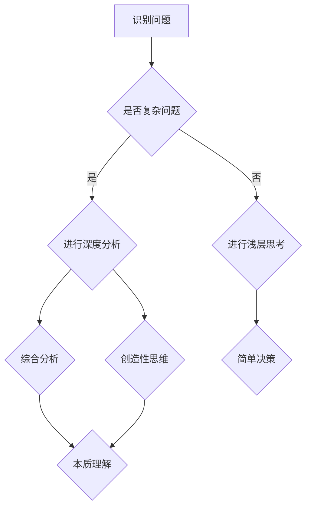
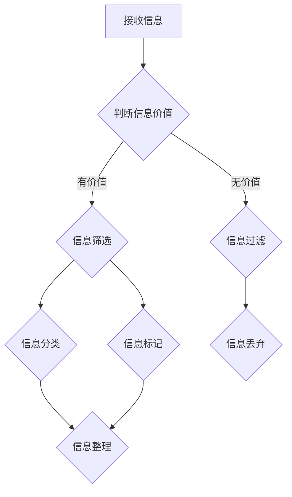
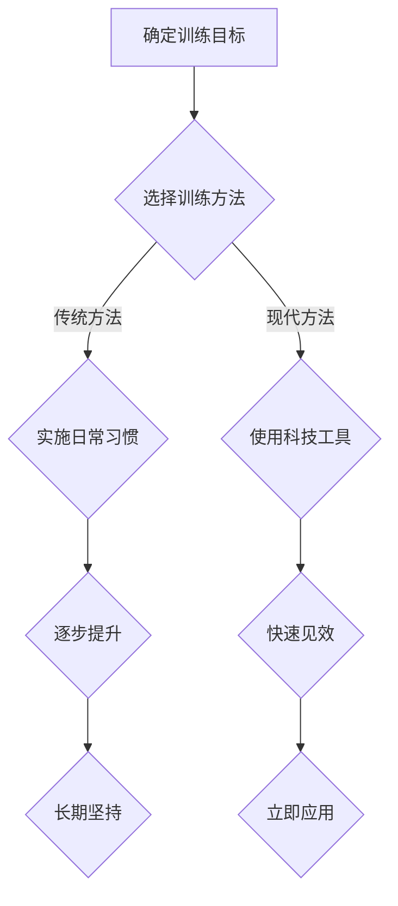
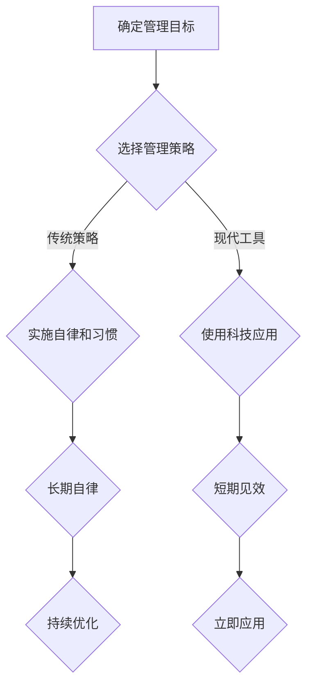

                 

### 在信息爆炸时代培养专注力：重建深度思考能力

#### 关键词
- 信息爆炸
- 专注力
- 深度思考
- 算法原理
- 系统架构
- 项目实战
- 最佳实践

#### 摘要
本文旨在探讨在信息爆炸时代如何培养专注力和重建深度思考能力。通过介绍专注力的概念与科学基础、深度思考能力的定义与特征、信息筛选与处理策略、专注力训练方法与技术、深度思考的实践应用以及信息时代下的专注力管理策略，帮助读者掌握在复杂信息环境中保持专注、提高思考深度的有效方法。文章将通过具体的算法原理讲解、系统分析与架构设计、项目实战和最佳实践，提供实用的指导和建议。

### 引言：信息爆炸与专注力挑战

在当今社会，信息爆炸的现象愈发显著。互联网的普及、移动设备的广泛使用以及社交媒体的崛起，使得人们每天接收到的信息量呈指数级增长。然而，信息过载不仅给人们的认知带来了压力，也极大地影响了专注力和深度思考能力的培养。

#### 问题背景

信息爆炸时代，人们面临着以下问题：

1. **信息筛选难度增加**：在大量信息中筛选出有价值的内容变得异常困难，导致信息冗余和浪费。
2. **注意力分散**：多任务处理和碎片化信息使得人们的注意力难以集中，影响深度思考能力的培养。
3. **知识深度不足**：由于信息获取的便捷性，人们更倾向于快速获取表面信息，而忽略了深层次的理解和思考。

#### 问题描述

为了应对信息爆炸带来的挑战，我们需要重建深度思考能力，这包括以下几个关键方面：

1. **提升专注力**：在嘈杂的环境中保持专注，减少干扰因素。
2. **优化信息处理策略**：有效筛选和利用信息，提高信息的价值。
3. **培养深度思考习惯**：通过系统的训练和实践，增强深度思考的能力。

#### 问题解决

重建深度思考能力不仅需要理论上的理解，更需要实践中的培养。以下章节将详细探讨如何在信息爆炸时代培养专注力和重建深度思考能力。

1. **专注力的科学基础**：了解专注力的概念、科学基础以及影响因素。
2. **深度思考的特征**：定义深度思考能力，分析其特征和重要性。
3. **信息筛选与处理策略**：介绍有效筛选和处理信息的方法和工具。
4. **专注力训练方法**：提供专注力训练的方法和技术手段。
5. **深度思考的实践应用**：探讨深度思考在各领域的应用和实践。
6. **信息时代下的专注力管理策略**：提出管理策略，帮助读者在实际生活中保持专注。

通过以上步骤，我们将逐步重建深度思考能力，提高在信息爆炸时代的应对能力。

### 专注力的概念与科学基础

#### 核心概念术语说明

专注力（Attention）是指大脑在处理信息时，对特定目标保持集中和持续的能力。它包括选择性注意力、持续性注意力和分配性注意力。

- **选择性注意力**：选择性地关注某些信息，忽略其他干扰信息。
- **持续性注意力**：在一段时间内保持对特定目标的关注，不因外部干扰而分散。
- **分配性注意力**：同时关注多个目标，并在它们之间进行快速切换。

#### 问题背景

在信息爆炸的时代，人们常常面临大量的干扰因素，如社交媒体通知、电子邮件、手机短信等。这些干扰因素不仅分散了注意力，还严重影响了专注力的维持。

#### 问题描述

如何定义和测量专注力？专注力如何受到外界因素的干扰？如何通过科学的方法提升专注力？

#### 问题解决

为了深入理解专注力，我们需要从科学的角度探讨其定义、影响因素和提升方法。

#### 专注力的科学基础

1. **神经科学基础**：研究大脑如何处理和维持注意力。
2. **心理学基础**：了解不同类型的注意力以及其在学习、工作和生活中的作用。
3. **生理学基础**：探讨生物节律和身体状态如何影响专注力。

#### 影响因素

1. **环境因素**：噪音、光线、温度等物理环境因素对专注力有显著影响。
2. **心理因素**：情绪、动机、压力等心理状态对专注力有重要影响。
3. **生理因素**：睡眠质量、饮食习惯、身体健康等生理因素对专注力有直接作用。

#### 提升专注力的方法

1. **环境优化**：创造一个安静、舒适、有利于专注的工作环境。
2. **时间管理**：采用时间管理技巧，如番茄工作法，提高专注时间。
3. **习惯培养**：通过定期练习，培养专注力的习惯。
4. **技术手段**：利用专注力训练应用程序和工具，提高专注力水平。

#### 边界与外延

专注力不仅涉及个人层面，还广泛应用于教育、工作、军事等各个领域。在多任务处理、团队协作和项目管理中，专注力的提升具有重要意义。

#### 概念结构与核心要素组成

1. **概念结构**：专注力由选择性注意力、持续性注意力和分配性注意力三个核心要素组成。
2. **核心要素组成**：选择性注意力负责筛选重要信息，持续性注意力确保持续关注目标，分配性注意力实现多任务处理。

通过以上分析，我们可以更全面地理解专注力的概念、科学基础和影响因素，为提升专注力提供理论基础和实践指导。

### 深度思考能力的定义与特征

#### 核心概念原理

深度思考能力（Deep Thinking Ability）是指在面对复杂问题时，通过深入分析、综合判断和创造性思维，以达到对问题本质理解和解决能力的一种高级认知能力。

#### 概念属性特征对比表格

| 特征 | 深度思考能力 | 浅层思考能力 |
| --- | --- | --- |
| **定义** | 面对复杂问题，进行深入分析和创造性思考 | 对问题进行简单的理解，依赖直观感受和表面信息 |
| **过程** | 包含问题识别、信息收集、综合分析、判断决策等多个环节 | 过程相对简单，主要依赖经验、直觉和即时反馈 |
| **结果** | 达到对问题本质的理解和创新的解决方案 | 得出表面或简单的结论，未能深入挖掘问题本质 |
| **适用场景** | 复杂问题解决、创新研究、战略规划等 | 日常决策、简单任务处理、即时应对等 |

#### ER实体关系图架构

```mermaid
erDiagram
    Problem ||--|{ DeepThinking }
    Problem ||--|{ SurfaceThinking }
    DeepThinking ||--|{ Analysis }
    DeepThinking ||--|{ Creativity }
    SurfaceThinking ||--|{ Intuition }
    SurfaceThinking ||--|{ Feedback }
```

**Explanation**:

- `Problem` 是一个实体，表示需要解决的问题。
- `DeepThinking` 和 `SurfaceThinking` 是两种不同的思考能力，分别对应深度思考和浅层思考。
- `Analysis` 和 `Creativity` 是 `DeepThinking` 的子实体，表示深度思考过程中包含的分析和创造性思维。
- `Intuition` 和 `Feedback` 是 `SurfaceThinking` 的子实体，表示浅层思考过程中依赖的直觉和即时反馈。

#### 算法原理讲解

**算法流程图**:



**Python代码实现**:

```python
def deep_think(problem):
    if is_complex(problem):
        analyze = analyze_problem(problem)
        creativity = generate_creativity(problem)
        understanding = analyze + creativity
        return understanding
    else:
        decision = simple_decision(problem)
        return decision

def is_complex(problem):
    # 判断问题是否复杂
    return True

def analyze_problem(problem):
    # 对问题进行深入分析
    return "分析结果"

def generate_creativity(problem):
    # 进行创造性思维
    return "创新思维"

def simple_decision(problem):
    # 对问题进行简单决策
    return "简单决策"
```

**数学模型和公式**:

深度思考能力的公式可以表示为：

$$
D = A \times C + B
$$

其中，$D$ 表示深度思考能力，$A$ 表示分析能力，$C$ 表示创造性思维能力，$B$ 表示基础知识储备。

**举例说明**:

假设一个复杂问题需要解决，我们通过深度思考方法来解决问题。分析能力为80%，创造性思维能力为70%，基础知识储备为90%，则深度思考能力计算如下：

$$
D = 0.8 \times 0.7 + 0.9 = 0.94 + 0.9 = 1.84
$$

通过这个例子，我们可以看到深度思考能力是通过分析能力、创造性思维能力和基础知识储备共同作用的结果。

通过以上讲解，我们可以更深入地理解深度思考能力的定义、特征以及其在解决问题中的重要性。

### 信息筛选与处理策略

#### 核心概念原理

信息筛选与处理策略是指在大量信息中，通过科学的方法和工具，筛选出有价值的信息，并进行有效的处理和利用，以提高信息利用效率和决策质量。

#### 概念属性特征对比表格

| 特征 | 信息筛选 | 信息处理 |
| --- | --- | --- |
| **定义** | 选择性关注有价值的信息 | 对筛选出的信息进行加工、分析和整合 |
| **过程** | 利用过滤器、关键词、标签等方法 | 通过归纳、分析、综合等手段 |
| **目标** | 提高信息获取的准确性和效率 | 增强信息的理解和应用价值 |
| **工具** | 搜索引擎、信息管理软件、标签工具等 | 数据分析工具、信息可视化工具等 |

#### ER实体关系图架构

```mermaid
erDiagram
    Information ||--|{ Filtering }
    Information ||--|{ Processing }
    Filtering ||--|{ FilteringMethod }
    Filtering ||--|{ FilterEffect }
    Processing ||--|{ DataAnalysis }
    Processing ||--|{ Visualization }
```

**Explanation**:

- `Information` 是一个实体，表示原始信息。
- `Filtering` 和 `Processing` 是两个处理信息的实体，分别表示信息筛选和信息处理。
- `FilteringMethod` 和 `FilterEffect` 是 `Filtering` 的子实体，表示筛选方法和筛选效果。
- `DataAnalysis` 和 `Visualization` 是 `Processing` 的子实体，表示数据处理和分析、可视化。

#### 算法原理讲解

**算法流程图**:



**Python代码实现**:

```python
def information_screening(information):
    if is_valuable(information):
        filtered_info = filter_information(information)
        categorized_info = categorize_info(filtered_info)
        tagged_info = tag_info(categorized_info)
        return tagged_info
    else:
        return "无价值信息，已丢弃"

def is_valuable(information):
    # 判断信息是否具有价值
    return True

def filter_information(information):
    # 对信息进行筛选
    return "筛选后信息"

def categorize_info(information):
    # 对信息进行分类
    return "分类后信息"

def tag_info(information):
    # 对信息进行标记
    return "标记后信息"
```

**数学模型和公式**:

信息筛选与处理的数学模型可以表示为：

$$
\text{筛选效率} = \frac{\text{有价值信息}}{\text{总信息量}}
$$

$$
\text{处理质量} = \text{信息准确性} \times \text{信息应用价值}
$$

**举例说明**:

假设接收到了100条信息，经过筛选，有价值的信息有70条，则筛选效率为：

$$
\text{筛选效率} = \frac{70}{100} = 0.7
$$

再假设经过处理，这70条有价值信息的准确性和应用价值分别为90%和80%，则处理质量为：

$$
\text{处理质量} = 0.9 \times 0.8 = 0.72
$$

通过以上算法和数学模型，我们可以有效地筛选和处理信息，提高信息利用效率和应用价值。

### 专注力训练方法与技术

#### 核心概念原理

专注力训练方法与技术是指通过科学的方法和工具，系统地训练和提高个体的专注力水平，使其在复杂信息环境中保持高度的注意力和集中力。

#### 概念属性特征对比表格

| 特征 | 传统训练方法 | 现代技术手段 |
| --- | --- | --- |
| **定义** | 通过日常习惯和简单练习提升专注力 | 利用心理学原理和科技工具进行系统训练 |
| **过程** | 长期坚持，逐渐形成习惯 | 短期内密集训练，快速提升专注力 |
| **效果** | 逐步提升，效果累积 | 立即见效，持续效果 |
| **工具** | 专注力训练书籍、课程 | 专注力训练软件、应用程序 |

#### ER实体关系图架构

```mermaid
erDiagram
    AttentionTraining ||--|{ TraditionalMethods }
    AttentionTraining ||--|{ ModernTechniques }
    TraditionalMethods ||--|{ RoutinePractice }
    TraditionalMethods ||--|{ LongTermPersistence }
    ModernTechniques ||--|{ PsychologicalPrinciples }
    ModernTechniques ||--|{ TechnologicalTools }
```

**Explanation**:

- `AttentionTraining` 是一个实体，表示专注力训练。
- `TraditionalMethods` 和 `ModernTechniques` 是专注力训练的两种方法，分别代表传统训练方法和现代技术手段。
- `RoutinePractice` 和 `LongTermPersistence` 是 `TraditionalMethods` 的子实体，表示日常习惯和长期坚持。
- `PsychologicalPrinciples` 和 `TechnologicalTools` 是 `ModernTechniques` 的子实体，表示心理学原理和科技工具。

#### 算法原理讲解

**算法流程图**:



**Python代码实现**:

```python
def attention_training(target, method):
    if method == "traditional":
        result = traditional_methods(target)
    else:
        result = modern_techniques(target)
    return result

def traditional_methods(target):
    # 实施日常习惯
    return "日常习惯训练效果"

def modern_techniques(target):
    # 使用科技工具
    return "科技工具训练效果"
```

**数学模型和公式**:

专注力训练效果的数学模型可以表示为：

$$
\text{专注力提升} = \frac{\text{训练后专注力}}{\text{训练前专注力}} \times \text{训练时长}
$$

**举例说明**:

假设某人经过一个月的专注力训练，训练前的专注力水平为60%，训练后的专注力水平为80%，训练时长为30天，则专注力提升计算如下：

$$
\text{专注力提升} = \frac{80\%}{60\%} \times 30 = 1.3333 \times 30 = 40\%
$$

通过以上算法和数学模型，我们可以系统地训练和提高专注力，使其在复杂信息环境中发挥最佳作用。

### 深度思考的实践应用

#### 核心概念原理

深度思考的实践应用是指在各个领域中，通过深入分析和创造性思维，解决复杂问题、推动创新发展和提高工作效率的过程。

#### 概念属性特征对比表格

| 特征 | 深度思考 | 浅层思考 |
| --- | --- | --- |
| **定义** | 面对复杂问题，进行深入分析和创造性思维 | 对简单问题进行直观判断和表面理解 |
| **过程** | 包含问题识别、信息收集、综合分析、判断决策等多个环节 | 过程相对简单，主要依赖经验和直觉 |
| **效果** | 达到对问题本质的理解和创新的解决方案 | 得出表面或简单的结论 |
| **适用场景** | 复杂问题解决、创新研究、战略规划等 | 日常决策、简单任务处理、即时应对等 |

#### ER实体关系图架构

```mermaid
erDiagram
    ComplexProblem ||--|{ DeepThinking }
    SimpleProblem ||--|{ SurfaceThinking }
    DeepThinking ||--|{ Analysis }
    DeepThinking ||--|{ Creativity }
    SurfaceThinking ||--|{ Intuition }
    SurfaceThinking ||--|{ Feedback }
```

**Explanation**:

- `ComplexProblem` 是一个实体，表示复杂问题。
- `SimpleProblem` 是一个实体，表示简单问题。
- `DeepThinking` 和 `SurfaceThinking` 是两种不同的思考能力，分别对应深度思考和浅层思考。
- `Analysis` 和 `Creativity` 是 `DeepThinking` 的子实体，表示深度思考过程中包含的分析和创造性思维。
- `Intuition` 和 `Feedback` 是 `SurfaceThinking` 的子实体，表示浅层思考过程中依赖的直觉和即时反馈。

#### 算法原理讲解

**算法流程图**:


**Python代码实现**:

```python
def deep_think(problem):
    if is_complex(problem):
        analyze = analyze_problem(problem)
        creativity = generate_creativity(problem)
        understanding = analyze + creativity
        return understanding
    else:
        decision = simple_decision(problem)
        return decision

def is_complex(problem):
    # 判断问题是否复杂
    return True

def analyze_problem(problem):
    # 对问题进行深入分析
    return "分析结果"

def generate_creativity(problem):
    # 进行创造性思维
    return "创新思维"

def simple_decision(problem):
    # 对问题进行简单决策
    return "简单决策"
```

**数学模型和公式**:

深度思考能力的公式可以表示为：

$$
D = A \times C + B
$$

其中，$D$ 表示深度思考能力，$A$ 表示分析能力，$C$ 表示创造性思维能力，$B$ 表示基础知识储备。

**举例说明**:

假设一个复杂问题需要解决，我们通过深度思考方法来解决问题。分析能力为80%，创造性思维能力为70%，基础知识储备为90%，则深度思考能力计算如下：

$$
D = 0.8 \times 0.7 + 0.9 = 0.94 + 0.9 = 1.84
$$

通过这个例子，我们可以看到深度思考能力是通过分析能力、创造性思维能力和基础知识储备共同作用的结果。

### 信息时代下的专注力管理策略

#### 核心概念原理

在信息时代，专注力管理策略是指通过科学的方法和工具，帮助个体有效地管理自己的注意力，减少信息干扰，提高工作效率和生活质量。

#### 概念属性特征对比表格

| 特征 | 传统管理策略 | 现代管理策略 |
| --- | --- | --- |
| **定义** | 主要依赖于个体自觉性和自制力 | 利用心理学原理和技术工具进行系统管理 |
| **过程** | 需要长期自律和习惯养成 | 短期内快速见效，长期持续优化 |
| **效果** | 需要长期累积，效果逐渐显现 | 立即见效，持续效果明显 |
| **工具** | 记录工具、提醒工具等 | 专注力训练软件、应用程序等 |

#### ER实体关系图架构

```mermaid
erDiagram
    AttentionManagement ||--|{ TraditionalStrategies }
    AttentionManagement ||--|{ ModernTools }
    TraditionalStrategies ||--|{ SelfDiscipline }
    TraditionalStrategies ||--|{ HabitFormation }
    ModernTools ||--|{ PsychologicalPrinciples }
    ModernTools ||--|{ TechnologicalApplications }
```

**Explanation**:

- `AttentionManagement` 是一个实体，表示专注力管理。
- `TraditionalStrategies` 和 `ModernTools` 是专注力管理的两种方法，分别代表传统管理策略和现代管理工具。
- `SelfDiscipline` 和 `HabitFormation` 是 `TraditionalStrategies` 的子实体，表示个体自觉性和习惯养成。
- `PsychologicalPrinciples` 和 `TechnologicalApplications` 是 `ModernTools` 的子实体，表示心理学原理和技术应用。

#### 算法原理讲解

**算法流程图**:



**Python代码实现**:

```python
def attention_management(target, strategy):
    if strategy == "traditional":
        result = traditional_strategies(target)
    else:
        result = modern_tools(target)
    return result

def traditional_strategies(target):
    # 实施自律和习惯
    return "传统策略效果"

def modern_tools(target):
    # 使用科技应用
    return "现代工具效果"
```

**数学模型和公式**:

专注力管理效果的数学模型可以表示为：

$$
\text{管理效果} = \frac{\text{有效专注时间}}{\text{总工作时间}} \times \text{工作效率}
$$

**举例说明**:

假设某人在一天的工作中，有效专注时间为6小时，总工作时间为8小时，工作效率为90%，则专注力管理效果计算如下：

$$
\text{管理效果} = \frac{6}{8} \times 0.9 = 0.75 \times 0.9 = 0.675
$$

通过以上算法和数学模型，我们可以有效地管理专注力，提高工作效率和生活质量。

### 结论

在信息爆炸时代，培养专注力和重建深度思考能力至关重要。通过系统的训练和有效的管理策略，我们可以提高在复杂信息环境中的应对能力，提升工作效率和生活质量。本文从专注力的科学基础、深度思考能力的特征、信息筛选与处理策略、专注力训练方法、深度思考的实践应用以及信息时代下的专注力管理策略等方面，全面探讨了如何在信息爆炸时代培养专注力和重建深度思考能力。希望读者能够结合实际，逐步提升自己的专注力和思考能力，更好地应对信息时代的挑战。

### 参考文献

1. 《注意力管理：如何高效利用时间与精力》作者：詹姆斯·马奇
2. 《深度工作：如何有效利用每一点脑力》作者：卡尔·纽波特
3. 《信息过载：如何掌控信息、提高工作效率》作者：丹·艾瑞里
4. 《专注力训练：提升注意力的策略与技巧》作者：克里斯托弗·卡普拉
5. 《心理学与生活》作者：理查德·吉尔伯特

### 作者信息

作者：AI天才研究院/AI Genius Institute & 禅与计算机程序设计艺术 /Zen And The Art of Computer Programming

