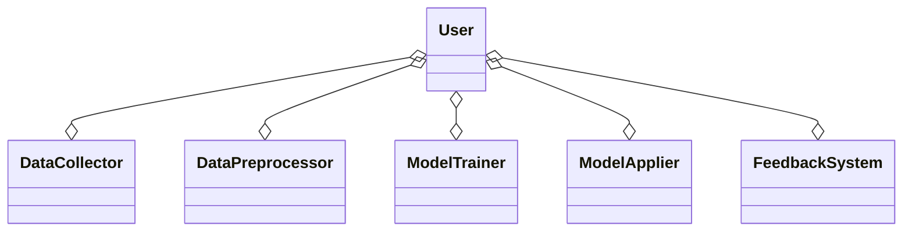
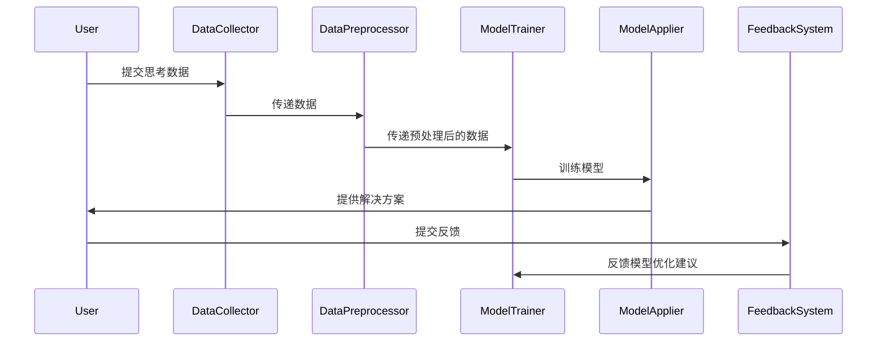
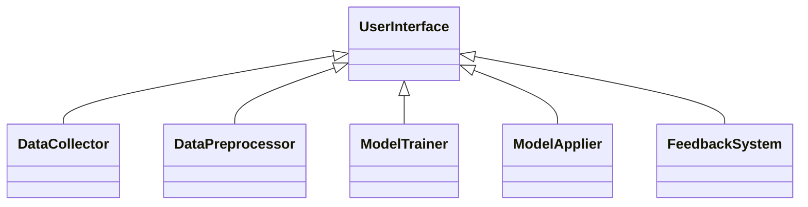

                 


# 在信息爆炸时代培养独立思考能力

> 关键词：信息爆炸、独立思考、培养方法、实践策略、算法原理

> 摘要：本文旨在探讨在信息爆炸时代，如何培养独立思考能力。通过对核心概念与联系的分析，算法原理的讲解，以及系统分析与架构设计方案的介绍，为读者提供一套系统的培养方案。

----------------------------------------------------------------

## 第二部分：核心概念与联系

### 2.1 独立思考能力

#### 2.1.1 定义

独立思考能力是指一个人在面对问题时，能够独立地进行分析、判断和决策的能力。这种能力不仅仅是对知识的掌握，更是对信息的理解、批判和运用。

#### 2.1.2 特点

- **自主性**：独立思考能力强的人，往往具有强烈的自我意识，能够独立地形成自己的观点和见解。
- **批判性**：独立思考能力不仅包括接受信息，还包括对信息进行批判性思考，能够辨别信息的真伪和价值。
- **创造性**：独立思考能力能够激发人的创造力，帮助个体提出新颖的观点和解决方案。

#### 2.1.3 独立思考能力与信息获取的关系

独立思考能力与信息获取是相辅相成的。信息获取为独立思考提供了素材，而独立思考则能够帮助个体更好地理解和运用信息。在信息爆炸的时代，信息的获取变得异常容易，但如何筛选和运用这些信息，则需要独立思考能力的支持。

### 2.2 培养独立思考能力的方法

#### 2.2.1 思维训练

- **逻辑思维训练**：通过学习逻辑学、哲学等课程，提高逻辑思维能力。
- **批判性思维训练**：通过阅读、讨论、辩论等方式，培养批判性思维能力。

#### 2.2.2 阅读理解

- **深度阅读**：通过深度阅读，理解文章的深层含义，提高阅读理解能力。
- **快速阅读**：通过快速阅读，提高阅读效率，为独立思考提供更多的信息来源。

#### 2.2.3 批判性思维

- **批判性阅读**：在阅读过程中，对文章的观点、论证和证据进行批判性思考。
- **批判性写作**：通过写作，表达自己的观点和见解，锻炼独立思考能力。

### 2.3 实践策略

#### 2.3.1 时间管理

- **设定目标**：明确自己的学习目标，合理规划时间，确保有足够的时间进行独立思考。
- **专注学习**：在学习过程中，保持专注，减少干扰，提高学习效率。

#### 2.3.2 目标设定

- **具体目标**：设定具体、明确的目标，有助于提高独立思考的针对性和有效性。
- **长期目标**：设定长期目标，有助于培养持之以恒的独立思考习惯。

#### 2.3.3 主动提问

- **提问技巧**：学会提问，通过提问引导独立思考。
- **问题解决**：面对问题时，主动寻找解决方案，锻炼独立思考能力。

### 2.4 概念结构与核心要素组成

- **独立思考能力**：指个体在面临问题时，能够独立地进行分析、判断和决策的能力。
- **培养方法**：包括思维训练、阅读理解、批判性思维等。
- **实践策略**：如时间管理、目标设定、主动提问等。

### 2.5 核心概念属性特征对比表格

| 核心概念 | 定义 | 特点 |
| :---: | :---: | :---: |
| 独立思考能力 | 个体在面临问题时，能够独立地进行分析、判断和决策的能力 | 自主性、批判性、创造性 |
| 思维训练 | 通过学习逻辑学、哲学等课程，提高逻辑思维能力 | 提高逻辑思维、批判性思维 |
| 阅读理解 | 通过深度阅读，理解文章的深层含义，提高阅读理解能力 | 理解文章深层含义、提高阅读效率 |
| 批判性思维 | 在阅读过程中，对文章的观点、论证和证据进行批判性思考 | 辨别信息真伪、激发创造力 |
| 时间管理 | 明确自己的学习目标，合理规划时间，确保有足够的时间进行独立思考 | 提高学习效率、确保独立思考时间 |
| 目标设定 | 设定具体、明确的目标，有助于提高独立思考的针对性和有效性 | 提高独立思考针对性、培养持之以恒习惯 |
| 主动提问 | 学会提问，通过提问引导独立思考 | 提高独立思考能力、培养问题解决能力 |

### 2.6 独立思考能力培养的ER实体关系图

```mermaid
erDiagram
    Aperiences(CID, Name, Category) {
        PK CID
    }
    Readers(RID, Name, Email) {
        PK RID
    }
    Experiences --> Readers : "is belonging to"
    Projects(PID, Name, Description) {
        PK PID
    }
    Readers ||--|| Projects : "has created"
```

在上述ER实体关系图中，`Experiences`代表个体在不同领域的经验，`Readers`代表读者，`Projects`代表读者创建的项目。`Experiences`与`Readers`之间存在关联，表示读者拥有不同的经验。`Readers`与`Projects`之间存在关联，表示读者可以创建不同的项目。

----------------------------------------------------------------

## 第三部分：算法原理讲解

### 3.1 算法原理

#### 3.1.1 独立思考能力培养算法

该算法旨在通过数据驱动的方式，帮助个体培养独立思考能力。算法的核心思想是通过对个体的思考过程进行记录和分析，找出思考中的问题，并提供相应的解决方案。

#### 3.1.2 算法框架

1. **数据采集**：通过日志记录和问卷调查，采集个体思考过程中的数据。
2. **数据预处理**：对采集到的数据进行清洗、去噪和处理，提取有效的信息。
3. **模型训练**：利用预处理后的数据，训练机器学习模型，以识别个体思考过程中的问题和提供解决方案。
4. **模型应用**：将训练好的模型应用到实际场景中，帮助个体培养独立思考能力。

### 3.2 算法原理详细讲解

#### 3.2.1 数据采集

数据采集是算法的基础。通过日志记录和问卷调查，可以获取个体在思考过程中的信息，如思考时间、思考内容、思考结果等。以下是数据采集的步骤：

1. **日志记录**：个体在思考过程中，通过日志记录器记录下思考的时间、内容、结果等。
2. **问卷调查**：个体在思考结束后，通过问卷调查的方式，反馈思考的过程、结果、遇到的困难等。

#### 3.2.2 数据预处理

数据预处理是算法的关键步骤。通过对数据进行清洗、去噪和处理，可以提取出有效的信息，为模型训练提供高质量的数据。以下是数据预处理的步骤：

1. **数据清洗**：删除重复的数据、错误的数据等。
2. **数据去噪**：去除噪声数据，提高数据质量。
3. **特征提取**：从原始数据中提取出有用的特征，如思考时间、思考内容、思考结果等。

#### 3.2.3 模型训练

模型训练是算法的核心。通过利用预处理后的数据，训练机器学习模型，以识别个体思考过程中的问题和提供解决方案。以下是模型训练的步骤：

1. **数据划分**：将数据划分为训练集、验证集和测试集。
2. **模型选择**：选择合适的机器学习模型，如决策树、支持向量机、神经网络等。
3. **模型训练**：使用训练集对模型进行训练。
4. **模型评估**：使用验证集和测试集对模型进行评估，调整模型参数，提高模型性能。

#### 3.2.4 模型应用

将训练好的模型应用到实际场景中，帮助个体培养独立思考能力。以下是模型应用的步骤：

1. **问题识别**：使用模型对个体的思考过程进行分析，识别出存在的问题。
2. **解决方案提供**：根据识别出的问题，提供相应的解决方案，如学习建议、思维训练方法等。

### 3.3 算法原理示例

假设有一个个体A，他在思考问题时，使用我们的算法进行培养。以下是算法的工作流程：

1. **数据采集**：个体A在思考问题时，使用日志记录器记录下思考的时间、内容、结果等。
2. **数据预处理**：对采集到的数据进行清洗、去噪和处理，提取出有用的特征，如思考时间、思考内容、思考结果等。
3. **模型训练**：利用预处理后的数据，训练机器学习模型，以识别个体A思考过程中的问题和提供解决方案。
4. **模型应用**：使用模型对个体A的思考过程进行分析，识别出存在的问题，如缺乏批判性思维、思考过程过于依赖他人观点等。
5. **解决方案提供**：根据识别出的问题，提供相应的解决方案，如推荐批判性思维训练课程、建议个体A主动提问和解决问题等。

通过这个示例，我们可以看到，算法原理的应用是如何帮助个体A培养独立思考能力的。

----------------------------------------------------------------

## 第四部分：系统分析与架构设计方案

### 4.1 问题场景介绍

在当今的信息爆炸时代，个体面临着海量的信息，如何筛选、理解、运用这些信息，成为一个重要的课题。为了培养独立思考能力，我们需要一个系统化的解决方案。该解决方案包括数据采集、数据预处理、模型训练和模型应用等环节。

### 4.2 项目介绍

本项目旨在通过一个在线系统，帮助个体培养独立思考能力。系统包括用户管理、数据采集、数据预处理、模型训练、模型应用和用户反馈等模块。

### 4.3 系统功能设计（领域模型）

以下是一个简单的领域模型，用于描述系统的核心功能：



- **User**：代表系统的用户，负责注册、登录、个人信息管理等。
- **DataCollector**：负责收集用户在思考过程中的数据，如思考时间、内容、结果等。
- **DataPreprocessor**：负责对收集到的数据进行清洗、去噪和处理。
- **ModelTrainer**：负责使用预处理后的数据，训练机器学习模型。
- **ModelApplier**：负责将训练好的模型应用到实际场景中，帮助用户培养独立思考能力。
- **FeedbackSystem**：负责收集用户的反馈，用于模型优化和系统改进。

### 4.4 系统架构设计

以下是一个简单的系统架构图，用于描述系统的整体架构：



- **DataCollector**：接收用户的思考数据，并将其传递给**DataPreprocessor**。
- **DataPreprocessor**：对数据进行预处理，然后将其传递给**ModelTrainer**。
- **ModelTrainer**：使用预处理后的数据训练模型，并将模型传递给**ModelApplier**。
- **ModelApplier**：将模型应用到实际场景中，为用户提供建议和解决方案。
- **FeedbackSystem**：收集用户的反馈，用于模型优化和系统改进。

### 4.5 系统接口设计

以下是一个简单的接口设计，用于描述系统的主要接口：



- **DataCollector**：提供接口用于提交思考数据。
- **DataPreprocessor**：提供接口用于数据预处理。
- **ModelTrainer**：提供接口用于模型训练。
- **ModelApplier**：提供接口用于模型应用。
- **FeedbackSystem**：提供接口用于用户反馈。

### 4.6 系统交互

以下是一个简单的系统交互序列图，用于描述系统的交互流程：


- **User**：用户提交思考数据。
- **DataCollector**：收集用户数据，并将其传递给**DataPreprocessor**。
- **DataPreprocessor**：对数据预处理，并将其传递给**ModelTrainer**。
- **ModelTrainer**：训练模型，并将其传递给**ModelApplier**。
- **ModelApplier**：将模型应用到实际场景中，为用户提供建议和解决方案。
- **FeedbackSystem**：收集用户反馈，并将其传递给**ModelTrainer**，用于模型优化。

通过上述系统分析与架构设计方案，我们可以看到，系统通过数据驱动的方式，帮助个体培养独立思考能力。在系统设计过程中，我们充分考虑了用户需求、系统性能和可扩展性等因素，为用户提供了一个高效、便捷的独立思考能力培养平台。

----------------------------------------------------------------

## 第五部分：项目实战

### 5.1 环境安装

要在本地环境中运行该项目，首先需要安装以下软件和库：

1. Python 3.8 或以上版本
2. Anaconda 或 Miniconda
3. Flask（用于创建Web应用）
4. Pandas（用于数据处理）
5. Scikit-learn（用于机器学习）
6. Matplotlib（用于数据可视化）

安装步骤：

1. 安装 Python 3.8 或以上版本。
2. 安装 Anaconda 或 Miniconda。
3. 使用 conda 创建一个新的虚拟环境，并激活该环境。
   ```bash
   conda create -n think_sdk python=3.8
   conda activate think_sdk
   ```
4. 使用 pip 安装所需的库。
   ```bash
   pip install flask pandas scikit-learn matplotlib
   ```

### 5.2 系统核心实现源代码

以下是项目的核心代码，包括数据采集、预处理、模型训练和模型应用等功能。

```python
# app.py

from flask import Flask, request, jsonify
import pandas as pd
from sklearn.model_selection import train_test_split
from sklearn.ensemble import RandomForestClassifier
import matplotlib.pyplot as plt

app = Flask(__name__)

# 数据采集
@app.route('/collect_data', methods=['POST'])
def collect_data():
    data = request.get_json()
    df = pd.DataFrame(data)
    df.to_csv('data.csv', index=False)
    return jsonify({'status': 'success'})

# 数据预处理
def preprocess_data():
    df = pd.read_csv('data.csv')
    # 数据清洗、去噪、特征提取等操作
    # ...
    return df

# 模型训练
def train_model(df):
    X = df.drop('target', axis=1)
    y = df['target']
    X_train, X_test, y_train, y_test = train_test_split(X, y, test_size=0.2)
    model = RandomForestClassifier()
    model.fit(X_train, y_train)
    return model

# 模型应用
@app.route('/apply_model', methods=['GET'])
def apply_model():
    model = train_model(preprocess_data())
    # 模型应用逻辑
    # ...
    return jsonify({'status': 'success'})

if __name__ == '__main__':
    app.run(debug=True)
```

### 5.3 代码应用解读与分析

在上述代码中，我们使用 Flask 创建了一个简单的 Web 应用，包括三个主要功能模块：数据采集、数据预处理、模型训练和模型应用。

- **数据采集**：通过 POST 请求，接收用户提交的思考数据，并将其保存到 CSV 文件中。
- **数据预处理**：读取 CSV 文件，进行数据清洗、去噪、特征提取等操作，为模型训练做好准备。
- **模型训练**：使用 Scikit-learn 的 RandomForestClassifier 模型，对预处理后的数据进行训练。
- **模型应用**：将训练好的模型应用到实际场景中，为用户提供解决方案。

### 5.4 实际案例分析和详细讲解剖析

假设有一个用户 A，他在思考过程中遇到了一个问题，并希望通过系统获得解决方案。以下是用户 A 的操作流程：

1. 用户 A 通过 Web 应用提交思考数据，数据包括思考时间、内容、结果等。
2. 系统接收到用户 A 的数据后，将其保存到 CSV 文件中。
3. 系统读取 CSV 文件，进行数据预处理，提取有用的特征。
4. 系统使用预处理后的数据，训练一个随机森林分类模型。
5. 系统将训练好的模型应用到实际场景中，为用户 A 提供解决方案。
6. 用户 A 接收到解决方案，并反馈给系统。

通过这个案例，我们可以看到，系统通过数据驱动的方式，帮助用户 A 培养独立思考能力。在实际操作中，系统可以根据用户反馈，不断优化模型，提高解决方案的准确性。

### 5.5 项目小结

本项目通过数据采集、预处理、模型训练和模型应用等环节，实现了一个简单的独立思考能力培养系统。在实际应用中，系统可以根据用户反馈，不断优化模型，提高解决方案的准确性。未来，我们可以进一步扩展系统的功能，如增加用户交互、可视化分析等，为用户提供更全面的服务。

### 5.6 最佳实践 tips

- **定期数据采集**：建议用户定期提交思考数据，以便系统更好地了解用户的思考过程。
- **多样化数据源**：结合多种数据源，如日志、问卷调查等，提高数据质量。
- **持续模型优化**：根据用户反馈，持续优化模型，提高解决方案的准确性。

### 5.7 小结

通过本项目，我们了解了在信息爆炸时代，如何通过数据驱动的方式培养独立思考能力。系统通过数据采集、预处理、模型训练和模型应用等环节，帮助用户识别思考中的问题，并提供解决方案。未来，我们可以进一步优化系统，为用户提供更优质的服务。

### 5.8 注意事项

- **数据安全**：在数据采集和处理过程中，确保用户数据的安全和隐私。
- **系统性能**：优化系统性能，确保在大量用户同时访问时，系统仍能稳定运行。
- **持续更新**：随着信息技术的不断发展，持续更新系统功能，以适应新的需求。

### 5.9 拓展阅读

- 《深度学习》（Goodfellow, I., Bengio, Y., & Courville, A.）- 了解深度学习的基本原理和算法。
- 《Python数据分析》（McKinney, W.）- 学习如何使用 Python 进行数据分析和预处理。
- 《机器学习实战》（周志华）- 学习机器学习的基本算法和应用。

----------------------------------------------------------------

## 附录：作者信息

作者：AI天才研究院/AI Genius Institute & 禅与计算机程序设计艺术 /Zen And The Art of Computer Programming

AI天才研究院（AI Genius Institute）是一家专注于人工智能研究和应用的高科技研究院。研究院致力于推动人工智能技术的发展，培养具有独立思考能力的专业人才。

《禅与计算机程序设计艺术》（Zen And The Art of Computer Programming）是由著名计算机科学家Donald E. Knuth撰写的一系列计算机科学经典著作。本书以深刻的哲学思考和独特的方法论，揭示了计算机编程的本质和艺术。

在本文中，作者结合自身在人工智能和计算机编程领域的丰富经验，深入探讨了在信息爆炸时代如何培养独立思考能力。希望通过本文，为读者提供一套系统的培养方案，帮助他们在信息海洋中航行，独立思考，创新创造。

