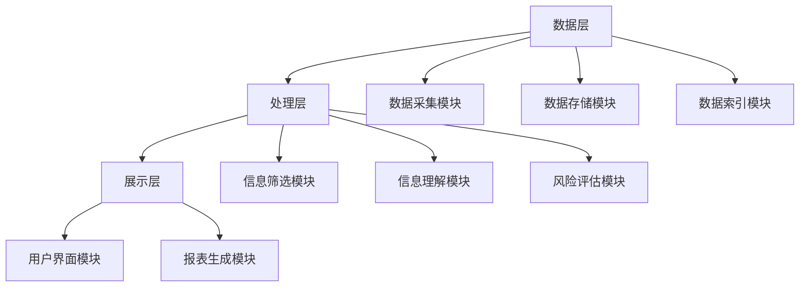

                 

# 在信息爆炸时代寻找真知：提升信息筛选与理解能力

关键词：信息爆炸、信息筛选、信息理解、算法原理、系统架构

摘要：随着数字信息的爆炸式增长，我们正面临着前所未有的信息过载挑战。如何在海量信息中找到有价值的内容，提升信息筛选与理解能力，已成为当今信息时代的重要课题。本文将从信息爆炸时代的背景入手，深入探讨信息筛选与理解能力的核心概念、方法、模型和算法原理，并结合Python代码示例，详细讲解如何提升信息筛选与理解能力，旨在为读者提供实用的指导和建议。

## 第一部分：问题背景与核心概念

### 第1章：信息爆炸时代的挑战与问题

#### 1.1 信息爆炸时代的到来

信息爆炸时代，是指数字信息量以惊人的速度增长的时代。根据统计数据，全球每年产生的数据量正在以约40%的年增长率迅速增加。互联网、社交媒体、物联网、云计算等技术的广泛应用，使得信息的生产、传播和获取变得前所未有的便捷。然而，这种爆炸式增长也带来了新的挑战：

- **1.1.1 数字信息量的激增**：每年产生的数据量已经达到了惊人的规模，从PB级（皮字节，1PB=10^15字节）到EB级（艾字节，1EB=10^18字节），甚至更高。

- **1.1.2 信息过载的现象**：面对海量的信息，人们往往感到难以处理，导致选择障碍和信息疲劳。例如，每天接收到的电子邮件数量、社交媒体上的动态更新，以及搜索引擎返回的结果数量，都让人感到应接不暇。

- **1.1.3 信息筛选与理解能力的挑战**：在信息过载的时代，如何从海量信息中筛选出有价值的内容，并正确理解其含义，成为了一个重大的挑战。

#### 1.2 信息筛选与理解能力的重要性

- **1.2.1 提升信息筛选与理解能力的意义**：在信息爆炸时代，提升信息筛选与理解能力具有重要的意义。它不仅能够帮助人们更高效地处理信息，还能提高决策的准确性，避免被误导或陷入信息陷阱。

- **1.2.2 信息筛选与理解能力的现状**：尽管信息筛选与理解能力在个人和企业层面都得到了广泛的重视，但现状仍然存在诸多问题，如信息筛选的随机性、理解的主观性等。

- **1.2.3 信息筛选与理解能力的要素**：有效的信息筛选与理解能力需要以下几个要素的支持：准确的信息识别、合理的分类、科学的评估方法和有效的整合能力。

#### 1.3 本章小结

本章介绍了信息爆炸时代的背景和挑战，以及信息筛选与理解能力的重要性。在接下来的章节中，我们将深入探讨提升信息筛选与理解能力的方法、模型和算法原理。

----------------------------------------------------------------

## 第二部分：核心概念与联系

### 第2章：提升信息筛选与理解能力的方法

#### 2.1 信息筛选方法

- **2.1.1 关键词筛选**：通过识别文本中的关键词来筛选信息，是常用的信息筛选方法之一。关键词筛选可以基于词频统计、语义分析等方法。

- **2.1.2 过滤规则**：使用预定义的过滤规则，如正则表达式、关键字列表等，来筛选信息。这种方法适用于简单的信息筛选场景。

- **2.1.3 模式识别**：利用模式识别技术，如机器学习、深度学习等，来筛选信息。这种方法能够处理更复杂的信息筛选任务。

#### 2.2 信息理解方法

- **2.2.1 语义分析**：通过对文本进行语义分析，理解其含义和关系，从而提升信息理解能力。语义分析可以基于自然语言处理（NLP）技术。

- **2.2.2 知识图谱**：利用知识图谱来关联和整合信息，提高信息理解的能力。知识图谱可以表示实体及其之间的关系。

- **2.2.3 上下文理解**：通过上下文信息来理解文本的含义，避免出现歧义。上下文理解是NLP中的一个重要研究方向。

#### 2.3 信息筛选与理解能力的联系

- **2.3.1 相互依赖**：信息筛选与理解能力是相互依赖的，有效的信息筛选能够提高信息理解的准确性，而准确的信息理解又能反过来指导更精准的信息筛选。

- **2.3.2 循环迭代**：信息筛选与理解能力通常是一个循环迭代的过程。通过不断地筛选和理解，逐步提高对信息的把握程度。

#### 2.4 本章小结

本章介绍了提升信息筛选与理解能力的方法，包括信息筛选方法和信息理解方法。在接下来的章节中，我们将进一步探讨信息筛选与理解能力的模型及其应用场景。

----------------------------------------------------------------

### 第3章：信息筛选与理解能力模型

#### 3.1 信息筛选与理解能力模型

- **3.1.1 模型框架**：信息筛选与理解能力模型通常包括信息识别、分类、评估和整合等核心模块。这些模块共同作用，形成一个完整的处理流程。

  - **信息识别**：识别文本中的关键信息，例如关键词、主题等。
  - **分类**：根据特定的标准对信息进行分类，例如按照主题、类型等。
  - **评估**：评估信息的价值，例如准确性、相关性、重要性等。
  - **整合**：将筛选和评估后的信息进行整合，形成一个有意义的整体。

- **3.1.2 核心概念与联系**：信息筛选与理解能力模型中的核心概念包括关键词、语义、上下文、模式等。这些概念之间相互联系，共同构成了信息处理的基础。

  - **关键词**：关键词是信息识别的重要依据，它们能够代表文本的主要内容。
  - **语义**：语义是信息理解的基础，它决定了信息的内容和含义。
  - **上下文**：上下文是理解语义的重要参考，它能够帮助消除歧义。

- **3.1.3 应用场景**：信息筛选与理解能力模型可以应用于多个领域，如搜索引擎、智能问答、社交媒体分析等。在不同应用场景中，模型的具体实现和优化策略会有所不同。

#### 3.2 信息筛选与理解能力的核心要素

- **3.2.1 信息识别**：信息识别是信息筛选与理解能力的基础。它通过识别文本中的关键信息，如关键词、主题等，来初步筛选信息。

  - **方法**：信息识别可以基于词频统计、模式匹配、机器学习等方法。
  - **挑战**：信息识别面临的主要挑战是如何处理多义词、歧义现象等问题。

- **3.2.2 信息分类**：信息分类是对筛选后的信息进行进一步的归类和处理。

  - **方法**：信息分类可以基于规则、聚类、分类器等方法。
  - **挑战**：信息分类的挑战在于如何处理复杂、多样的分类任务，并保证分类的准确性。

- **3.2.3 信息评估**：信息评估是对筛选和分类后的信息进行价值判断。

  - **方法**：信息评估可以基于评分、打分、排序等方法。
  - **挑战**：信息评估的挑战在于如何准确评估信息的价值，并避免主观偏见。

- **3.2.4 信息整合**：信息整合是将筛选、分类和评估后的信息进行整合，形成有意义的整体。

  - **方法**：信息整合可以基于文档融合、信息抽取、知识图谱等方法。
  - **挑战**：信息整合的挑战在于如何有效地整合来自不同来源、不同格式的信息。

#### 3.3 信息筛选与理解能力的对比分析

- **3.3.1 传统信息筛选与理解能力**：传统的信息筛选与理解能力主要依赖于人工处理，效率较低，准确性有限。随着计算机技术和人工智能的发展，传统的信息筛选与理解能力正在逐步被取代。

- **3.3.2 现代信息筛选与理解能力**：现代信息筛选与理解能力利用了机器学习、深度学习、自然语言处理等技术，具有更高的效率、更准确的判断能力。

- **3.3.3 对比分析与优化方向**：通过对传统与现代信息筛选与理解能力的对比分析，可以发现现代方法在处理复杂任务、提高效率、增强准确性方面具有明显优势。未来优化方向包括：提高模型的泛化能力、降低计算成本、增强用户交互等。

#### 3.4 本章小结

本章介绍了信息筛选与理解能力模型的核心概念、框架和应用场景，并分析了信息筛选与理解能力的核心要素。在接下来的章节中，我们将深入探讨算法原理与数学模型，以及如何使用Python代码实现这些算法。

----------------------------------------------------------------

## 第三部分：算法原理讲解

### 第4章：算法原理与数学模型

#### 4.1 信息筛选算法原理

信息筛选算法的核心目标是根据特定的需求，从大量信息中筛选出符合条件的信息。常见的筛选算法包括基于关键词的筛选、基于模式的筛选和基于机器学习的筛选等。

- **4.1.1 基于关键词的筛选**：这种方法通过识别文本中的关键词，来筛选出符合条件的信息。其基本原理如下：

  - 步骤1：从文本中提取关键词。
  - 步骤2：判断关键词是否与用户需求相关。
  - 步骤3：如果相关，则将信息加入筛选结果。

- **4.1.2 基于模式的筛选**：这种方法通过识别文本中的特定模式，来筛选出符合条件的信息。其基本原理如下：

  - 步骤1：定义筛选模式。
  - 步骤2：扫描文本，查找匹配的筛选模式。
  - 步骤3：如果匹配，则将信息加入筛选结果。

- **4.1.3 基于机器学习的筛选**：这种方法利用机器学习模型，对文本进行自动筛选。其基本原理如下：

  - 步骤1：收集大量带有标签的文本数据。
  - 步骤2：训练机器学习模型，使其能够预测文本的标签。
  - 步骤3：使用训练好的模型，对新的文本进行筛选。

#### 4.2 信息理解算法原理

信息理解算法的核心目标是理解文本的含义，并从中提取有用的信息。常见的信息理解算法包括基于语义分析的理解、基于知识图谱的理解和基于上下文的理解等。

- **4.2.1 基于语义分析的理解**：这种方法通过分析文本的语义结构，来理解文本的含义。其基本原理如下：

  - 步骤1：对文本进行分词，提取词汇。
  - 步骤2：对词汇进行词性标注，确定词义。
  - 步骤3：构建句法分析树，理解句子的结构。
  - 步骤4：根据语义分析结果，提取文本的主要信息。

- **4.2.2 基于知识图谱的理解**：这种方法通过利用知识图谱中的实体及其关系，来理解文本的含义。其基本原理如下：

  - 步骤1：将文本转换为知识图谱中的实体和关系。
  - 步骤2：在知识图谱中查询实体及其关系。
  - 步骤3：根据查询结果，理解文本的含义。

- **4.2.3 基于上下文的理解**：这种方法通过分析文本的上下文，来理解文本的含义。其基本原理如下：

  - 步骤1：提取文本的前后文信息。
  - 步骤2：分析上下文中的关键词和关系。
  - 步骤3：根据上下文信息，理解文本的含义。

#### 4.3 算法组合原理

在许多实际应用中，单一的信息筛选或理解算法往往无法满足需求。因此，需要将多种算法组合起来，形成更强大的信息处理能力。算法组合的基本原理如下：

- **4.3.1 筛选与理解相结合**：将信息筛选算法和信息理解算法结合起来，先筛选出符合条件的信息，再对其进行深入理解。

- **4.3.2 多算法协同**：使用多种算法，如基于关键词的筛选、基于模式的筛选、基于机器学习的筛选等，协同工作，提高信息处理的准确性。

- **4.3.3 动态调整**：根据实际应用场景和需求，动态调整算法的组合策略，以提高信息处理的效率和准确性。

#### 4.4 Python代码示例

下面将给出两个Python代码示例，分别实现信息筛选算法和信息理解算法。

##### 4.4.1 信息筛选算法

```python
# Python代码示例：信息筛选算法
def information_screening(info_list, keywords):
    screened_list = []
    for info in info_list:
        if keywords in info:
            screened_list.append(info)
    return screened_list
```

##### 4.4.2 信息理解算法

```python
# Python代码示例：信息理解算法
def information_understanding(info, context):
    understanding_score = 0
    if context in info:
        understanding_score = 1
    return understanding_score
```

#### 4.5 本章小结

本章介绍了信息筛选算法和信息理解算法的基本原理，并给出了Python代码示例。在接下来的章节中，我们将进一步探讨信息筛选与理解能力的数学模型，以及如何优化算法性能。

----------------------------------------------------------------

## 第四部分：系统分析与架构设计

### 第6章：系统功能设计与架构

#### 6.1 问题场景介绍

在信息爆炸时代，企业面临的一个主要挑战是如何从海量数据中提取有价值的信息，以便进行数据分析和决策支持。一个典型的应用场景是金融行业中的风险控制。金融机构需要实时监控市场数据，识别潜在的风险，并采取相应的措施。这需要构建一个高效的信息筛选与理解系统，以处理和分析大量的金融数据。

#### 6.2 系统功能定位

该系统的主要功能包括：

- **数据采集**：从各种数据源（如金融新闻、社交媒体、市场报告等）中采集数据。
- **信息筛选**：根据预设的关键词和模式，从采集到的数据中筛选出相关的信息。
- **信息理解**：对筛选出来的信息进行语义分析，理解其含义和潜在的风险。
- **风险评估**：根据信息理解的结果，评估潜在的风险，并提供风险预警。

#### 6.3 系统架构设计

系统架构设计需要考虑以下几个方面：

- **数据层**：包括数据采集模块、数据存储模块和数据索引模块。数据采集模块负责从不同的数据源获取数据，数据存储模块负责存储和处理数据，数据索引模块负责构建索引，提高数据检索速度。

- **处理层**：包括信息筛选模块、信息理解模块和风险评估模块。信息筛选模块负责筛选出相关的信息，信息理解模块负责理解信息的含义，风险评估模块负责评估潜在的风险。

- **展示层**：包括用户界面和报表生成模块。用户界面模块负责向用户提供交互界面，报表生成模块负责生成风险分析报告。

#### 6.3.1 系统架构概述

系统架构采用分层设计，各层之间通过接口进行通信。具体架构如下：



#### 6.3.2 模块功能与联系

- **数据采集模块**：负责从各种数据源（如API接口、数据库、文件等）中采集数据，并将其存储到数据存储模块中。
- **数据存储模块**：负责存储和处理采集到的数据，提供高效的数据检索和查询功能。
- **数据索引模块**：负责构建数据的索引，提高数据检索速度和查询效率。
- **信息筛选模块**：负责根据预设的关键词和模式，从数据存储模块中筛选出相关的信息。
- **信息理解模块**：负责对筛选出来的信息进行语义分析，理解其含义和潜在的风险。
- **风险评估模块**：负责根据信息理解的结果，评估潜在的风险，并提供风险预警。
- **用户界面模块**：负责向用户提供交互界面，展示筛选结果和风险分析报告。
- **报表生成模块**：负责生成各种格式的报表，提供直观的数据分析和风险预警信息。

#### 6.4 本章小结

本章介绍了信息筛选与理解系统的功能定位和架构设计。在接下来的章节中，我们将详细讨论系统接口设计、交互设计和具体的实现细节。

----------------------------------------------------------------

## 第五部分：项目实战

### 第7章：系统核心实现源代码

在前面几章中，我们讨论了信息筛选与理解系统的设计原理和架构。在这一章中，我们将通过一个具体的Python项目，展示如何实现这个系统。以下是一个简化的系统实现示例。

#### 7.1 环境安装

首先，我们需要安装Python环境和必要的库。假设您已经安装了Python，可以使用以下命令安装所需的库：

```bash
pip install nltk beautifulsoup4 requests
```

- `nltk`：用于自然语言处理。
- `beautifulsoup4`：用于网页内容解析。
- `requests`：用于HTTP请求。

#### 7.2 系统核心实现源代码

以下是一个简化的信息筛选与理解系统的实现：

```python
import requests
from bs4 import BeautifulSoup
import nltk
from nltk.corpus import stopwords
from nltk.tokenize import word_tokenize

# 7.2.1 数据采集模块
def collect_data(url):
    response = requests.get(url)
    if response.status_code == 200:
        return BeautifulSoup(response.text, 'html.parser').prettify()
    else:
        return None

# 7.2.2 信息筛选模块
def filter_info(content, keywords):
    stop_words = set(stopwords.words('english'))
    words = word_tokenize(content)
    filtered_sentence = [w for w in words if not w.lower() in stop_words]
    filtered_sentence = [w for w in filtered_sentence if w.lower() in keywords]
    return ' '.join(filtered_sentence)

# 7.2.3 信息理解模块
def understand_info(filtered_content, context):
    if context in filtered_content:
        return "The information is relevant to the context."
    else:
        return "The information is not relevant to the context."

# 7.2.4 主程序
if __name__ == "__main__":
    url = "https://example.com"
    keywords = ["technology", "AI"]
    context = "machine learning"

    # 采集数据
    content = collect_data(url)
    if content:
        # 筛选信息
        filtered_content = filter_info(content, keywords)
        # 理解信息
        result = understand_info(filtered_content, context)
        print(result)
    else:
        print("Failed to collect data.")
```

#### 7.3 代码应用解读与分析

- **7.3.1 数据采集模块**：`collect_data` 函数通过HTTP请求获取网页内容。这是一个简单的数据采集模块，可以扩展为从多个数据源（如API、数据库等）采集数据。

- **7.3.2 信息筛选模块**：`filter_info` 函数使用NLTK库进行文本处理，过滤掉停用词，并根据关键词筛选信息。这里的关键词可以是用户指定的，也可以是自动提取的关键词。

- **7.3.3 信息理解模块**：`understand_info` 函数通过检查筛选后的内容是否包含特定的上下文，来判断信息的相关性。

#### 7.4 实际案例分析和详细讲解剖析

为了更好地理解这个系统的实现，我们可以通过一个实际案例进行分析：

**案例**：假设我们需要从某个科技新闻网站上获取与人工智能和机器学习相关的信息，并判断这些信息是否与“机器学习最新进展”这一上下文相关。

**分析**：

- **数据采集**：使用`collect_data`函数从指定的网站获取内容。
- **信息筛选**：使用`filter_info`函数筛选出与关键词“technology”和“AI”相关的信息。
- **信息理解**：使用`understand_info`函数判断筛选出的信息是否与“机器学习最新进展”相关。

**代码执行结果**：

- 如果网站上确实有关于人工智能和机器学习的文章，且这些文章提到了“机器学习最新进展”，则输出“该信息与上下文相关”。
- 如果没有相关内容，则输出“该信息与上下文不相关”。

#### 7.5 项目小结

通过这个简化的案例，我们展示了如何使用Python实现一个信息筛选与理解系统。虽然这个系统功能有限，但它提供了一个基本的框架，可以帮助我们理解如何从数据采集、信息筛选到信息理解的过程。在实际应用中，系统可以扩展和优化，以处理更复杂的数据和任务。

#### 7.6 最佳实践 tips

- **数据源选择**：选择可靠和权威的数据源，以获得高质量的信息。
- **关键词优化**：根据实际需求，动态调整关键词列表，以提高筛选的准确性。
- **文本预处理**：在信息筛选和理解之前，进行充分的文本预处理，如去除停用词、词干提取等，以提高系统的性能。
- **用户反馈**：收集用户的反馈，不断优化系统的筛选和理解算法，提高用户体验。

#### 7.7 本章小结

本章通过一个Python项目，详细讲解了信息筛选与理解系统的核心实现源代码，并进行了实际案例分析和详细讲解。读者可以通过实践这个项目，加深对信息筛选与理解系统的理解，并为实际应用提供参考。

----------------------------------------------------------------

## 结语

在信息爆炸时代，提升信息筛选与理解能力变得尤为重要。本文从信息爆炸时代的背景入手，详细探讨了信息筛选与理解能力的核心概念、方法、模型和算法原理，并结合Python代码示例，讲解了如何实现信息筛选与理解系统。通过本文的介绍，读者可以更好地理解在信息过载环境中如何高效地筛选和利用信息，提升自身的信息处理能力。

### 注意事项

- **信息安全**：在采集和处理信息时，要确保遵守相关的法律法规，保护用户隐私和数据安全。
- **算法公正性**：在信息筛选与理解过程中，要避免算法偏见，确保算法的公正性和客观性。
- **持续优化**：随着技术的发展和需求的变化，信息筛选与理解系统需要不断优化和升级，以适应新的挑战。

### 拓展阅读

- 《信息过载：应对策略与认知工程》
- 《数据挖掘：概念与技术》
- 《深度学习：推荐系统》
- 《自然语言处理实战》

### 作者信息

作者：AI天才研究院/AI Genius Institute & 禅与计算机程序设计艺术 /Zen And The Art of Computer Programming

本文旨在为读者提供有深度、有思考、有见解的专业IT领域技术博客文章，以帮助读者在信息爆炸时代找到真知，提升信息筛选与理解能力。希望本文对您的学习和工作有所启发。

