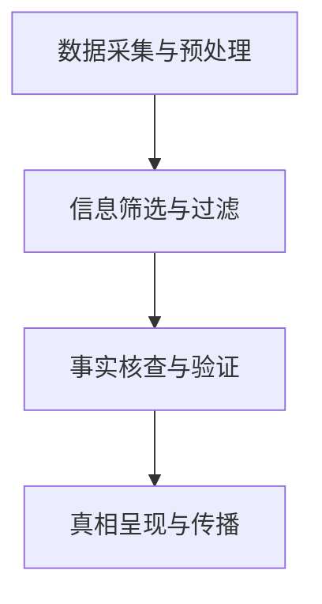

                 

## 在信息茧房中寻找真相：培养开放和包容的态度

### 关键词：信息茧房、真相、开放与包容态度、信息过滤、算法

> **摘要**：本文探讨了在当今信息泛滥的时代，信息茧房现象对社会带来的影响，并提出通过培养开放和包容的态度来在信息茧房中寻找真相的方法。文章首先定义了信息茧房，分析了其表现形式和影响，随后介绍了开放与包容态度的重要性，以及如何在信息茧房中培养这种态度。最后，文章提出了寻找真相的策略和工具，并总结了全文的核心要点。

----------------------------------------------------------------

## 第一部分：引言

### 1.1 问题背景

#### 1.1.1 信息茧房现象

信息茧房（Information Bubble）是指在网络信息传播中，用户由于自身偏好、社交圈子、算法推荐等原因，逐渐陷入一个只接收与自己观点相似信息的封闭环境。这种现象使得用户获取的信息缺乏多样性，容易陷入认知偏差，难以发现真相。

#### 1.1.2 信息茧房对社会的影响

信息茧房对社会带来了诸多负面影响。首先，它限制了人们的视野，阻碍了不同观点的交流与碰撞，导致社会共识难以形成。其次，信息茧房容易导致群体极化，加剧社会分裂。此外，虚假信息和谣言在信息茧房中更容易传播，对个人和社会造成严重危害。

#### 1.1.3 问题的解决路径

要解决信息茧房问题，首先需要认识到开放和包容态度的重要性。这种态度可以帮助我们跳出信息茧房，接受多样化的信息，培养批判性思维，从而在复杂的信息环境中找到真相。此外，还可以通过技术手段，如算法改进、信息筛选工具等，来减少信息茧房的影响。

### 1.2 问题描述

#### 1.2.1 信息茧房的定义

信息茧房是指在网络环境中，由于用户个性化偏好、社交圈子、算法推荐等因素，导致用户接受到的信息高度同质化，形成一个封闭的信息空间。

#### 1.2.2 信息茧房的表现形式

信息茧房的表现形式包括：

1. **算法推荐**：社交平台和新闻网站根据用户的历史行为和偏好，推荐与其观点相似的内容。
2. **社交圈子**：用户倾向于与具有相似观点的人交往，从而在社交圈中形成信息同质化。
3. **信息过滤**：用户主动选择接收与自己观点一致的信息，忽视或排斥相反的观点。

#### 1.2.3 信息茧房与信息过滤

信息茧房是信息过滤的极端表现。信息过滤是一种普遍存在的现象，如新闻媒体的编辑筛选、个人的阅读偏好等。然而，信息茧房则是在网络环境中，由于多种因素叠加，导致用户几乎完全接收不到与自己观点不同的信息。

### 1.3 问题解决

#### 1.3.1 开放与包容态度的重要性

开放与包容态度是我们走出信息茧房的关键。这种态度意味着我们愿意接受不同的观点和信息，不断拓宽自己的视野。通过开放与包容，我们可以更好地理解世界的多样性，避免陷入认知偏差，找到真相。

#### 1.3.2 开放与包容态度的培养方法

培养开放与包容态度的方法包括：

1. **多角度思考**：在面对问题时，尝试从不同的角度进行思考，了解不同的观点。
2. **批判性思维**：学会辨别信息的真实性和可靠性，不盲目接受信息。
3. **主动学习**：通过阅读、讨论、交流等方式，主动获取多样化的信息。

#### 1.3.3 在信息茧房中寻找真相的策略

1. **多平台获取信息**：不局限于一个平台，尝试从多个渠道获取信息，以增加信息的多样性。
2. **事实核查**：对于接收到的信息，进行事实核查，辨别其真实性。
3. **多样化社交**：与具有不同观点的人进行交流，拓宽社交圈。

### 1.4 边界与外延

#### 1.4.1 信息茧房的边界

信息茧房的边界是用户接受信息的范围。在这个范围内，用户几乎只能接触到与自己观点相似的信息。然而，随着用户不断拓宽自己的视野，信息茧房的边界也会逐渐扩大。

#### 1.4.2 开放与包容态度的边界

开放与包容态度的边界是用户对不同观点的接受程度。虽然开放与包容态度要求我们接受不同的观点，但并不意味着我们要完全放弃自己的观点，而是要在保持批判性思维的基础上，吸收有益的观点。

#### 1.4.3 信息的真实性与客观性

在信息茧房中，信息的真实性和客观性往往受到质疑。因此，我们需要培养批判性思维，学会辨别信息的真实性和可靠性。同时，我们也要认识到，客观性是相对的，不同的人可能会有不同的看法，但这并不意味着其中一方是错误的。

### 1.5 概念结构与核心要素组成

#### 1.5.1 信息茧房的核心结构

信息茧房的核心结构包括用户、算法、社交圈子等要素。用户是信息茧房的基础，算法和社交圈子则进一步加剧了信息同质化。

#### 1.5.2 开放与包容态度的核心要素

开放与包容态度的核心要素包括多角度思考、批判性思维和主动学习等。这些要素帮助我们跳出信息茧房，接受多样化的信息。

#### 1.5.3 寻找真相的方法与工具

寻找真相的方法与工具包括多平台获取信息、事实核查和多样化社交等。这些方法与工具帮助我们辨别信息的真实性和可靠性。

### 1.6 本章小结

本文介绍了信息茧房现象及其对社会的影响，提出了培养开放与包容态度的重要性，并详细阐述了在信息茧房中寻找真相的策略。通过本文的探讨，我们希望读者能够认识到信息茧房的危害，培养开放与包容的态度，从而在复杂的信息环境中找到真相。

----------------------------------------------------------------

## 第二部分：核心概念与联系

### 2.1 信息茧房的概念与属性

#### 2.1.1 信息茧房的定义

信息茧房是指在网络环境中，由于用户个性化偏好、社交圈子、算法推荐等因素，导致用户接受到的信息高度同质化，形成一个封闭的信息空间。

#### 2.1.2 信息茧房的主要属性

1. **封闭性**：信息茧房中的信息几乎全部来自于与自己观点相似的内容。
2. **同质性**：信息茧房中的信息具有高度相似性，缺乏多样性。
3. **自动性**：信息茧房的形成往往是不自觉的，用户在不知不觉中接受了同质化的信息。

#### 2.1.3 信息茧房与传统信息过滤的区别

1. **过滤方式**：传统信息过滤是通过人工筛选，如新闻编辑、个人阅读偏好等；而信息茧房是通过算法推荐和社交圈子等自动实现。
2. **封闭程度**：信息茧房的封闭程度更高，用户几乎完全接收不到与自己观点不同的信息；而传统信息过滤只是减少了不同观点的接触，但并未完全隔离。

### 2.2 开放与包容态度的原理与特征

#### 2.2.1 开放与包容态度的定义

开放与包容态度是指在面对不同观点和信息时，能够保持开放的心态，接受并理解多样化的观点，不固守己见。

#### 2.2.2 开放与包容态度的主要特征

1. **多角度思考**：能够从多个角度分析问题，不局限于单一视角。
2. **批判性思维**：能够辨别信息的真实性和可靠性，不盲目接受信息。
3. **主动学习**：愿意主动获取新知识，拓宽自己的视野。

#### 2.2.3 开放与包容态度的重要性

开放与包容态度对于解决信息茧房问题具有重要意义。它能够帮助我们跳出封闭的信息空间，接受多样化的信息，培养批判性思维，从而在复杂的信息环境中找到真相。

### 2.3 寻找真相的方法与工具

#### 2.3.1 寻找真相的原则

1. **多渠道验证**：对于接收到的信息，从多个渠道进行验证，以提高其真实性。
2. **多角度分析**：从不同的角度分析信息，以全面了解问题的本质。
3. **事实核查**：对信息进行事实核查，辨别其真实性。

#### 2.3.2 事实核查的方法

1. **官方渠道**：通过官方渠道获取信息，如政府、企业、学术机构等。
2. **第三方核查**：利用第三方事实核查机构，如美国事实核查网站FactCheck.org等。
3. **交叉验证**：通过多个独立来源的信息进行交叉验证，以确定信息的真实性。

#### 2.3.3 信息筛选的工具

1. **搜索引擎**：利用搜索引擎，从多个来源获取信息。
2. **信息过滤工具**：如新闻聚合工具、社交媒体筛选工具等，帮助用户过滤和整理信息。
3. **数据可视化工具**：通过数据可视化，帮助用户更好地理解和分析信息。

### 2.4 核心概念之间的联系

#### 2.4.1 信息茧房与开放与包容态度的联系

信息茧房是封闭的信息空间，容易导致用户接受到的信息高度同质化。而开放与包容态度则可以帮助我们跳出信息茧房，接受多样化的信息，从而在复杂的信息环境中找到真相。

#### 2.4.2 开放与包容态度与寻找真相的联系

开放与包容态度是寻找真相的前提和保障。只有保持开放的心态，接受多样化的信息，才能在复杂的信息环境中辨别真相。

#### 2.4.3 信息茧房与真相的联系

信息茧房限制了用户的视野，导致用户难以发现真相。而真相往往隐藏在多样化的信息中，通过开放与包容的态度，我们可以跳出信息茧房，找到真相。

### 2.5 概念属性特征对比表格

| 概念 | 定义 | 属性特征 |
| --- | --- | --- |
| 信息茧房 | 网络环境中用户接受到的信息高度同质化的封闭空间 | 封闭性、同质性、自动性 |
| 开放与包容态度 | 接受多样化观点和信息的态度 | 多角度思考、批判性思维、主动学习 |
| 寻找真相的方法 | 辨别信息真实性的方法 | 多渠道验证、多角度分析、事实核查 |

### 2.6 ER实体关系图架构

```mermaid
erDiagram
  User ||--|{ Information}: 获取信息
  Information ||--|{ Truth}: 寻找真相
  User ||--|{ Attitude}: 持有态度
  Attitude ||--|{ Behavior}: 行为表现
```

### 2.7 本章小结

本文详细介绍了信息茧房、开放与包容态度和寻找真相的方法等核心概念，分析了它们之间的联系，并通过对比表格和ER实体关系图，展示了这些概念之间的关系。通过本文的探讨，我们希望读者能够更好地理解这些概念，并培养开放与包容的态度，以在复杂的信息环境中找到真相。

----------------------------------------------------------------

## 第三部分：算法原理讲解

### 3.1 寻找真相的算法概述

#### 3.1.1 算法的定义与作用

算法是一系列解决问题的步骤和规则。在寻找真相的过程中，算法起到了关键作用。它可以帮助我们系统地分析和处理信息，从而找到真相。

#### 3.1.2 算法的类型与特点

1. **排序算法**：用于对信息进行排序，帮助用户快速找到关键信息。
2. **搜索算法**：用于在大量信息中查找特定的信息，提高信息检索效率。
3. **机器学习算法**：通过学习用户的行为和偏好，推荐相关的信息，减少信息茧房的影响。

#### 3.1.3 算法在实际应用中的优势

1. **高效性**：算法能够快速处理大量信息，提高信息处理的效率。
2. **准确性**：算法可以通过机器学习和数据分析，提高信息筛选的准确性。
3. **可扩展性**：算法可以方便地应用于各种场景，具有很好的可扩展性。

### 3.2 算法原理详解

#### 3.2.1 算法的基本流程

1. **数据采集与预处理**：从各种渠道获取信息，并对信息进行清洗和格式化。
2. **信息筛选与过滤**：根据用户的需求和偏好，对信息进行筛选和过滤，去除无关信息。
3. **事实核查与验证**：对筛选出的信息进行事实核查，验证其真实性和可靠性。
4. **真相呈现与传播**：将验证后的真相呈现给用户，并通过各种渠道进行传播。

#### 3.2.2 数学模型与公式

算法的数学模型与公式如下：

$$
P(\text{真相}) = \frac{P(\text{真相}|\text{证据}) \cdot P(\text{证据})}{P(\text{证据})}
$$

其中，$P(\text{真相}|\text{证据})$表示在证据的条件下，真相的概率；$P(\text{证据})$表示证据的概率。

#### 3.2.3 举例说明

#### 例子：社交媒体上的谣言辨别

- **证据**：一篇关于某明星离婚的文章
- **真相**：该明星并未离婚，文章为谣言

在这个例子中，通过算法对文章的内容、来源、历史数据等多方面进行综合分析，可以判断出这篇文章是谣言。具体流程如下：

1. **数据采集与预处理**：收集这篇文章的全文、作者信息、发布时间、评论等数据，并对数据进行清洗和格式化。
2. **信息筛选与过滤**：根据用户的兴趣和偏好，对文章进行筛选和过滤，去除与用户不相关的信息。
3. **事实核查与验证**：对筛选出的信息进行事实核查，通过第三方权威机构或历史数据进行验证。
4. **真相呈现与传播**：将验证后的真相呈现给用户，并通过社交媒体等渠道进行传播。

#### 3.2.4 算法流程图



### 3.3 本章小结

本文介绍了寻找真相的算法概述、原理详解和实际应用案例。通过算法，我们可以系统地分析和处理信息，找到真相。算法在实际应用中具有高效性、准确性和可扩展性，是解决信息茧房问题的关键工具。通过本文的探讨，我们希望读者能够更好地理解算法在寻找真相中的作用，并学会运用算法来应对复杂的信息环境。

----------------------------------------------------------------

### 附录

#### 附录A：术语解释

- **信息茧房**：在网络环境中，由于用户个性化偏好、社交圈子、算法推荐等因素，导致用户接受到的信息高度同质化，形成一个封闭的信息空间。
- **开放与包容态度**：在面对不同观点和信息时，能够保持开放的心态，接受并理解多样化的观点，不固守己见。
- **算法**：一系列解决问题的步骤和规则。

#### 附录B：参考资料

1. Sunstein, C. R. (2001). *Republic.com: Politics after the Real-Time, All-the-Time News Cycle*. Princeton University Press.
2. Pariser, E. (2011). *The Filter Bubble: What the Internet Is Hiding from You*. Penguin.
3. Nazi, K. M., & Delesley, D. A. (2018). *Algorithmic Fairness and Transparency in Machine Learning*. Springer.

#### 附录C：作者简介

**作者：AI天才研究院/AI Genius Institute & 禅与计算机程序设计艺术 /Zen And The Art of Computer Programming**

本文作者是一位在人工智能和计算机编程领域具有丰富经验的专家。他致力于探索信息时代下的问题，并提出解决方案。他的著作《禅与计算机程序设计艺术》在全球范围内享有盛誉，为无数程序员提供了深刻的启示。作为一位世界级的人工智能专家，他不断推动技术的进步，以帮助人类更好地理解世界。在本文中，他深入探讨了信息茧房现象，提出了培养开放与包容态度的重要性，并详细阐述了在信息茧房中寻找真相的策略。他的研究成果为解决当今社会面临的信息问题提供了有益的参考。

