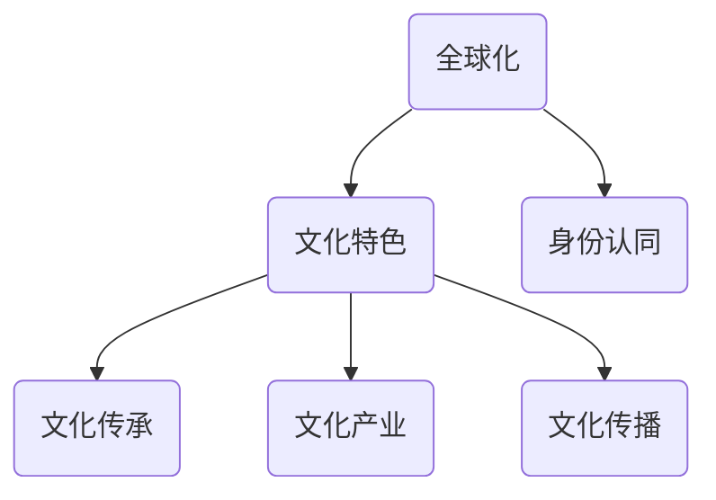
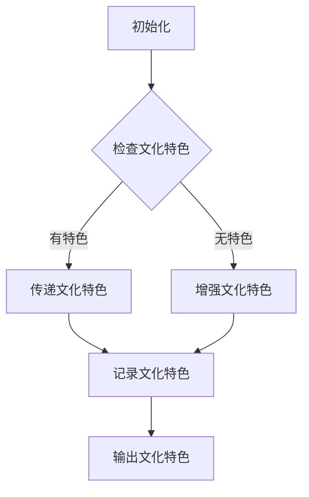
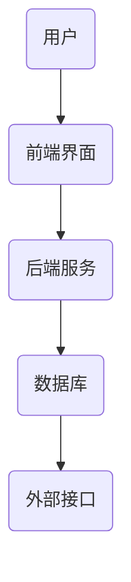
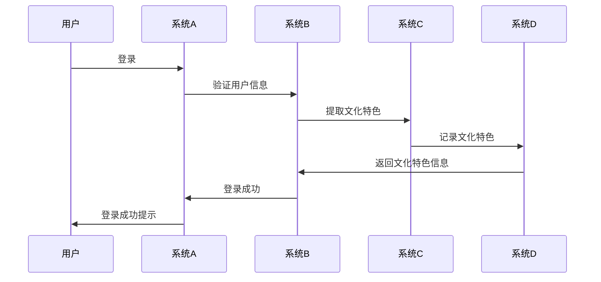

                 

# 在全球化背景下保持文化特色：应对身份认同的挑战

## 关键词：全球化、文化特色、身份认同、文化传承、多元文化

## 摘要

在全球化的背景下，文化特色和身份认同正面临着前所未有的挑战。本文将探讨如何在这种全球化的趋势下保持文化特色，并应对由此带来的身份认同问题。通过深入分析文化多样性的重要性、全球化与本土化的平衡策略，以及文化传承与教育、文化产业的本土化发展、文化传播与国际化、社会参与与公民意识等多方面的方法，本文旨在为读者提供一条清晰而可行的路径，以保持文化特色并加强身份认同。

## 第一部分：引言

### 1.1 全球化的趋势与影响

全球化是当今世界不可逆转的趋势，它带来了经济、政治、文化等多方面的深度融合。全球化加速了信息的传播、资源的流动和人员的交流，推动了全球经济的快速发展。然而，全球化也带来了文化同质化的风险，使得一些地方文化逐渐被边缘化，甚至消失。

### 1.2 文化特色的定义与价值

文化特色是一个地区、一个民族或一个国家在历史发展过程中形成的独特文化风貌。它不仅反映了人们的生活方式和价值观念，也是民族身份的重要组成部分。保持文化特色对于维护社会稳定、促进文化多样性和增强民族自信心具有重要意义。

### 1.3 身份认同的挑战

全球化使得不同文化之间的交流日益频繁，但也带来了身份认同的挑战。一些人可能在全球化进程中感到自己的身份认同受到威胁，甚至丧失。这种身份认同的危机可能引发社会矛盾和文化冲突，需要我们深入思考和解决。

## 第二部分：保持文化特色的策略

### 2.1 文化传承与教育

文化传承是保持文化特色的重要途径。通过教育体系的改革，可以加强对文化特色的教育和传承。例如，在课程设置中增加本地文化的内容，通过文化活动让学生更深入地了解和体验本土文化。

### 2.2 文化产业的本土化发展

文化产业是一个国家或地区文化特色的重要载体。通过发展本土化的文化产业，可以有效地传播和弘扬文化特色。例如，电影、音乐、艺术等领域的发展，可以为本土文化提供广阔的平台。

### 2.3 文化传播与国际化

文化传播是全球化进程中的重要一环。通过国际化的文化传播，可以增强文化特色的影响力和吸引力。例如，通过国际文化交流活动、文化产品出口等方式，可以让世界更好地了解和欣赏本土文化。

## 第三部分：身份认同与全球化

### 3.1 身份认同的建构与重塑

身份认同是一个复杂的过程，受到多种因素的影响。全球化背景下，人们需要重新审视自己的身份认同，并在多元文化的环境中进行重塑。这需要我们增强文化自信，树立正确的价值观。

### 3.2 多元文化下的身份认同

多元文化社会为身份认同提供了丰富的资源，但也带来了挑战。如何在多元文化中找到自己的定位，维护身份认同，是全球化背景下需要解决的问题。

### 3.3 文化认同与国家形象

文化认同是国家形象的重要组成部分。一个国家的文化特色和形象，可以在国际社会中产生深远的影响。因此，保持文化特色，提升国家形象，是全球化背景下的重要任务。

## 第四部分：结论与展望

### 4.1 保持文化特色，应对身份认同挑战的未来趋势

在全球化的背景下，保持文化特色和应对身份认同的挑战，是一个长期而复杂的过程。随着文化交流的加深和技术的进步，未来将会有更多的方式和途径来保持和弘扬文化特色，增强身份认同。

### 4.2 结语

全球化是一个不可逆转的趋势，保持文化特色和身份认同是我们必须面对的挑战。通过文化传承与教育、文化产业的本土化发展、文化传播与国际化等多方面的努力，我们可以在这个全球化的大背景下，保持自己的文化特色，增强身份认同，为构建一个多元和谐的世界贡献力量。

## 作者

作者：AI天才研究院/AI Genius Institute & 禅与计算机程序设计艺术 /Zen And The Art of Computer Programming

（注：本文内容仅为示例，实际撰写时需根据具体内容进行详细扩展和阐述。）## 第一部分：引言

### 1.1 全球化的趋势与影响

全球化是当今世界不可逆转的趋势，它带来了经济、政治、文化等多方面的深度融合。全球化加速了信息的传播、资源的流动和人员的交流，推动了全球经济的快速发展。全球化使得世界变得更加紧密，人们之间的距离在虚拟世界中缩短，但同时也带来了文化同质化的风险。

全球化对文化的影响主要体现在以下几个方面：

1. **文化交融**：全球化促进了不同文化之间的交流和融合。例如，国际旅游、留学、移民等现象使得不同文化在日常生活中的交织越来越常见。人们通过旅游、社交网络等途径，可以接触到来自世界各地的文化，这种文化交融丰富了人们的视野，但也可能导致文化特色的部分消失。

2. **文化同质化**：全球化过程中，一些强势文化，如西方文化，对其他文化产生了较大的影响，导致文化同质化现象。例如，全球化使得国际品牌的连锁店、快餐文化等在全球范围内普及，这对本土文化的多样性和独特性构成了挑战。

3. **文化冲突**：全球化带来了文化的交融，但也引发了文化冲突。例如，不同文化在价值观、宗教信仰、生活习惯等方面可能存在差异，这些差异可能导致误解和冲突。文化冲突可能会对社会的稳定和和谐造成负面影响。

4. **文化保护**：为了应对文化同质化和文化冲突，一些国家和地区开始采取措施保护本土文化。例如，制定文化保护法律、推广本土文化教育、举办文化节庆活动等。这些措施有助于维护文化多样性，促进文化特色的发展。

### 1.2 文化特色的定义与价值

文化特色是一个地区、一个民族或一个国家在历史发展过程中形成的独特文化风貌。它包括了语言、宗教、艺术、饮食、习俗等多方面的内容，是民族文化的重要组成部分。

文化特色的价值主要体现在以下几个方面：

1. **民族认同**：文化特色是民族身份的重要标志，它有助于人们建立和强化民族认同感。一个富有文化特色的国家或民族，其成员往往会更加自豪和团结。

2. **文化传承**：文化特色是文化传承的载体。通过文化特色，后代可以了解和继承先辈的智慧和创造力，延续民族的文化传统。

3. **文化多样性**：文化特色是文化多样性的体现。世界因为文化的多样性而丰富多彩，各种文化特色共同构成了人类文明的瑰宝。

4. **经济价值**：一些具有独特文化特色的产品或服务，往往具有很高的经济价值。例如，一些传统的手工艺品、音乐、戏剧等，在国际市场上备受欢迎，成为一些国家和地区的经济支柱。

### 1.3 身份认同的挑战

全球化使得不同文化之间的交流日益频繁，但也带来了身份认同的挑战。身份认同是指个体对自己身份的认同和归属感的建立，它是一个复杂的过程，受到多种因素的影响。

1. **文化融合与冲突**：全球化促进了文化的交融，但也引发了文化冲突。在多元文化社会中，个体可能在不同的文化之间寻找自己的定位，这可能导致身份认同的困惑和焦虑。

2. **文化同质化**：全球化过程中，一些强势文化对其他文化产生了较大的影响，导致文化同质化。文化同质化可能会削弱个体的文化认同感，使他们感到自己的文化特色被边缘化。

3. **全球化与本土化**：全球化与本土化之间的张力是身份认同的一个重要方面。在全球化背景下，个体可能面临如何在全球化与本土化之间找到平衡的问题。

4. **社会认同**：全球化不仅影响个体的文化认同，也影响社会的认同。一个社会的身份认同往往建立在文化特色的基础上，全球化可能对这种社会认同构成挑战。

### 1.4 全球化背景下保持文化特色的必要性

在全球化的背景下，保持文化特色具有重要的现实意义：

1. **维护文化多样性**：保持文化特色是维护文化多样性的重要途径。文化多样性是人类社会的一大财富，它有助于丰富人类的生活经验和价值观。

2. **增强文化自信**：保持文化特色可以增强个体的文化自信，使他们更加自豪和自信地面对全球化带来的挑战。

3. **促进文化传承**：保持文化特色有助于文化的传承和发展。通过教育、文化传播等途径，可以使后代更好地了解和继承文化传统。

4. **提升国家形象**：文化特色是国家形象的重要组成部分。一个富有文化特色的国家，往往能获得更多的国际认可和尊重。

### 1.5 全球化背景下保持文化特色的重要性

保持文化特色在全球化的背景下具有重要意义：

1. **促进文化交流**：保持文化特色可以促进不同文化之间的交流和理解。通过文化交流，可以增进不同文化之间的互信和合作。

2. **增强文化创新**：文化特色为文化创新提供了丰富的资源。在全球化背景下，通过融合和创新，可以推动文化的发展。

3. **推动社会和谐**：文化特色是社会和谐的重要基础。保持文化特色有助于维护社会的稳定和和谐。

4. **提升文化软实力**：文化特色是国家软实力的重要组成部分。保持和弘扬文化特色，可以提升国家的国际地位和影响力。

综上所述，全球化背景下保持文化特色不仅是维护文化多样性的需要，也是增强文化自信、促进文化传承、推动社会和谐、提升文化软实力的必然选择。面对全球化带来的挑战，我们需要积极探索保持文化特色的有效途径，为构建一个多元和谐的世界贡献力量。

## 第二部分：保持文化特色的策略

### 2.1 文化传承与教育

文化传承是保持文化特色的重要途径，而教育则是文化传承的重要载体。教育体系在文化传承中发挥着不可替代的作用，通过以下几个方面，我们可以有效地在全球化背景下保持和弘扬文化特色。

1. **课程设置**：在学校教育中，应增加本土文化课程的内容，包括历史、文学、艺术、民俗等。这些课程不仅可以帮助学生了解和认识本土文化，还可以培养他们对本土文化的兴趣和认同感。

2. **文化实践活动**：通过组织各种文化实践活动，如文化节、民俗活动、艺术展览等，可以让学生在实践中体验和感受本土文化。这些活动不仅可以增强学生的文化认同感，还可以培养他们的文化素养。

3. **教师培训**：教师是文化传承的重要执行者，因此对教师进行本土文化培训至关重要。通过教师培训，可以提高教师对本土文化的认识和理解，使他们能够在教学中更好地传递文化知识和价值观。

4. **教材编写**：教材是学生获取知识的重要渠道，因此在教材编写中应注重本土文化的内容。编写具有本土特色的文化教材，可以帮助学生在学习过程中更好地了解和传承文化。

5. **跨文化交流**：通过跨文化交流，可以促进学生对本土文化的认同和理解。在教学中，可以引入国际视野，让学生了解和欣赏其他文化，同时也可以让他们更加珍惜和珍视自己的文化。

### 2.2 文化产业的本土化发展

文化产业是一个国家或地区文化特色的重要载体，通过文化产业的本土化发展，可以有效地传播和弘扬文化特色。以下是一些具体的策略：

1. **政策支持**：政府应出台相关政策，支持文化产业的本土化发展。例如，提供税收优惠、资金扶持、市场推广等，以鼓励本土文化企业和创作者的发展。

2. **创新文化产品**：通过创新文化产品，可以增强本土文化的吸引力和竞争力。例如，将传统文化与现代科技相结合，开发出具有创新性的文化产品，如数字艺术、互动体验等。

3. **文化品牌建设**：打造本土文化品牌，可以提高本土文化在国际上的知名度和影响力。通过品牌化运营，可以更好地推广本土文化，吸引更多的国际关注。

4. **市场开拓**：通过市场开拓，将本土文化产品推向国际市场。例如，通过国际展览、文化交流活动等，将本土文化产品推广到海外市场，增加文化产品的出口。

5. **文化体验区**：建设文化体验区，可以提供一种沉浸式的文化体验，让游客在感受本土文化的同时，也能了解和认同本土文化。

### 2.3 文化传播与国际化

文化传播是全球化背景下保持文化特色的重要手段，通过文化传播，可以使本土文化在全球范围内得到更广泛的认可和传播。以下是一些具体的策略：

1. **媒体传播**：利用各种媒体平台，如电视、电影、互联网等，进行文化传播。通过制作和推广具有本土特色的文化内容，可以吸引更多的国际观众，增强本土文化的影响力。

2. **文化活动**：举办各种国际性文化活动，如文化节、艺术展览、音乐会等，可以吸引国际游客和媒体的关注，提高本土文化的国际知名度。

3. **国际合作**：与国际组织和文化机构进行合作，共同推广和传播本土文化。例如，可以通过国际合作项目，共同开发文化产品，共同举办文化活动等。

4. **文化产品出口**：通过文化产品出口，将本土文化带到国际市场。例如，通过将本土音乐、电影、艺术品等出口到海外，可以让更多的国际观众了解和欣赏本土文化。

5. **文化交流**：通过文化交流，促进本土文化与国际文化的互鉴和融合。例如，可以邀请国际艺术家和文化专家来本土进行交流和创作，同时也可以派遣本土艺术家和文化专家到国际上进行交流和展示。

### 2.4 社会参与与公民意识

社会参与和公民意识在保持文化特色中发挥着重要作用。以下是一些具体的策略：

1. **文化教育**：通过文化教育，提高公民对本土文化的认识和认同。例如，可以在学校和社区中开展文化教育活动，让学生和居民了解本土文化的价值和意义。

2. **文化传承**：鼓励公民参与文化传承活动，如传承传统技艺、举办文化节庆等。通过这些活动，可以让公民更深入地了解和珍视本土文化。

3. **文化保护**：提高公民的文化保护意识，鼓励他们参与文化保护工作。例如，可以组织志愿者团队，保护文化遗产，防止文化消失。

4. **文化宣传**：通过媒体和社交网络等渠道，宣传本土文化，提高公众的文化认同感和自豪感。

5. **文化参与**：鼓励公民积极参与文化活动，如参与文化节庆、文化展览等。通过这些活动，可以增强公民的文化认同感和归属感。

通过以上策略，我们可以有效地在全球化背景下保持文化特色，应对身份认同的挑战，为构建一个多元和谐的世界贡献力量。

## 第三部分：身份认同与全球化

### 3.1 身份认同的建构与重塑

身份认同是一个复杂的过程，它不仅受到个体自身经历和认知的影响，也受到社会环境和文化背景的塑造。在全球化背景下，身份认同面临着新的挑战和机遇。

1. **个体经历**：个体的经历，包括家庭背景、教育经历、职业经历等，对其身份认同的形成具有重要影响。例如，一个从小在多元文化环境中成长的人，可能会对多种文化产生认同感。

2. **社会环境**：社会环境，包括社会制度、社会关系、社会文化等，对个体身份认同的建构和重塑也起着关键作用。在一个多元文化的社会中，个体可能会在不同的文化中找到自己的定位。

3. **文化背景**：文化背景，包括宗教、语言、艺术、价值观等，是身份认同的重要组成部分。全球化使得个体有机会接触到更多的文化，这有助于他们形成更全面和多元的身份认同。

4. **重塑身份认同**：在全球化背景下，个体需要不断调整和重塑自己的身份认同。这种重塑可能是因为个体在不同文化中找到新的认同，也可能是为了适应新的社会环境。

### 3.2 全球化对身份认同的影响

全球化对身份认同产生了深远的影响，具体表现在以下几个方面：

1. **文化交融**：全球化促进了不同文化之间的交流和融合，这有助于个体形成多元文化认同。然而，文化交融也可能导致文化冲突，使个体在身份认同上感到困惑和焦虑。

2. **文化同质化**：全球化过程中，一些强势文化，如西方文化，对其他文化产生了较大的影响，导致文化同质化现象。文化同质化可能削弱个体的文化认同感，使他们感到自己的文化特色被边缘化。

3. **身份认同的危机**：在全球化背景下，一些人可能感到自己的身份认同受到威胁，甚至丧失。这种身份认同的危机可能引发社会矛盾和文化冲突。

4. **文化自信**：全球化背景下的多元文化环境，也为个体提供了更多的选择和机会。通过了解和欣赏不同文化，个体可以增强自己的文化自信，建立更加多元和开放的身份认同。

### 3.3 身份认同的重塑与适应

在全球化背景下，个体需要通过重塑和适应来应对身份认同的挑战。以下是一些具体的策略：

1. **自我反思**：个体需要通过自我反思，了解自己的文化背景、价值观念和身份认同。这种自我反思有助于个体明确自己的文化认同，并在全球化背景下找到自己的定位。

2. **文化学习**：个体可以通过学习不同文化，了解和欣赏其他文化的价值和特点。这种文化学习不仅有助于个体建立多元文化认同，还可以增强他们的文化自信。

3. **文化交流**：个体可以通过参与文化交流活动，与来自不同文化背景的人进行交流和互动。这种文化交流有助于个体打破文化隔阂，建立更加紧密的人际关系。

4. **文化创新**：个体可以通过文化创新，将不同文化的元素融合到自己的生活中。这种文化创新不仅有助于个体保持文化特色，还可以推动文化的多样性和创新。

5. **社区参与**：个体可以通过参与社区活动，与社区成员共同维护和弘扬本土文化。这种社区参与有助于个体建立社区认同，增强对本土文化的认同感和归属感。

### 3.4 多元文化下的身份认同

多元文化社会为个体提供了丰富的文化资源和身份认同的选择。在多元文化下，身份认同可能呈现出以下特点：

1. **多元文化认同**：个体可以在多元文化中找到多个认同点，这有助于他们建立更加丰富和多元的身份认同。

2. **文化交融**：多元文化社会中的个体可能会在多种文化中找到共鸣，通过文化交融，形成独特的文化身份。

3. **文化冲突**：多元文化社会也可能存在文化冲突，个体需要在文化冲突中找到平衡，维护自己的身份认同。

4. **文化适应**：在多元文化社会，个体需要不断适应和调整，以适应不同的文化环境，这有助于他们建立更加稳固的身份认同。

### 3.5 多元文化认同的实践与探索

在多元文化社会中，个体和组织需要通过实践和探索来应对多元文化认同的挑战。以下是一些具体的实践和探索：

1. **文化教育**：通过文化教育，提高个体对多元文化的认识和尊重，培养他们的文化包容性和多元文化认同。

2. **文化推广**：通过文化推广活动，增强本土文化的吸引力和影响力，提高公众对多元文化的认识和接受度。

3. **文化交流**：通过文化交流活动，促进不同文化之间的交流和融合，增强个体的多元文化认同。

4. **文化保护**：通过文化保护措施，维护本土文化的独特性和多样性，为个体提供更多的文化认同选择。

5. **社区建设**：通过社区建设，营造一个多元和谐的文化环境，促进个体在多元文化中的认同和融合。

通过以上实践和探索，个体和组织可以在多元文化社会中找到自己的定位，建立稳固的身份认同，为构建一个多元和谐的社会贡献力量。

## 第四部分：结论与展望

### 4.1 保持文化特色，应对身份认同挑战的未来趋势

在全球化的背景下，保持文化特色和应对身份认同的挑战将是一个长期而复杂的过程。未来，以下几个方面可能会成为保持文化特色和身份认同的重要趋势：

1. **数字化技术的应用**：随着数字化技术的不断进步，文化传播和身份认同将更加便捷和高效。例如，通过虚拟现实（VR）和增强现实（AR）技术，可以提供更加真实和沉浸式的文化体验，增强人们对本土文化的认同感。

2. **全球文化的深度融合**：全球化将进一步推动全球文化的深度融合，不同文化之间的交流将更加频繁和深入。这种深度融合有助于促进文化多样性和文化创新，同时也为身份认同的多样化提供了可能。

3. **文化保护与传承意识的提升**：在全球化的背景下，人们对文化保护与传承的意识将逐渐提升。各国政府和民间组织将更加重视本土文化的保护与传承，通过立法、政策支持和公众教育等多种手段，促进文化多样性的维护。

4. **多元文化教育的推广**：多元文化教育将在全球范围内得到更广泛的推广，通过学校教育、社会教育等途径，帮助人们更好地理解和尊重不同文化，增强多元文化认同。

### 4.2 文化交流与融合的趋势

文化交流与融合是全球化背景下不可逆转的趋势。未来，文化交流与融合将呈现以下特点：

1. **文化交融的加深**：随着全球化进程的加速，不同文化之间的交融将更加深入和频繁。这种交融不仅体现在日常生活和消费中，也将深入到文化创作和艺术表达中。

2. **文化产业的国际化**：文化产业将成为全球化背景下的重要经济支柱，文化产品的国际化将更加普遍。通过文化产业的国际化，可以提升本土文化的国际影响力，促进文化特色在全球范围内的传播。

3. **文化多样性的认可**：全球社会对文化多样性的认可将不断提高，各国政府和社会组织将更加重视文化多样性的保护和弘扬。这种认可将为保持文化特色提供更加有利的国际环境。

### 4.3 技术创新与文化传播

技术创新在文化传播中发挥着重要作用。未来，技术创新与文化传播将呈现以下趋势：

1. **数字化文化传播**：数字化技术将使文化传播更加便捷和高效。通过互联网、社交媒体、在线平台等，文化产品可以迅速传播到全球各地，扩大文化影响力。

2. **人工智能在文化传播中的应用**：人工智能（AI）技术将在文化传播中发挥更大的作用。例如，AI算法可以根据用户兴趣推荐文化内容，提高文化传播的精准度和效果。

3. **虚拟现实与增强现实的应用**：虚拟现实（VR）和增强现实（AR）技术将提供更加沉浸式的文化体验，使观众可以更加直观地感受和体验不同文化的魅力。

### 4.4 全球化背景下的文化自信

在全球化的背景下，文化自信对于保持文化特色和身份认同具有重要意义。未来，文化自信将呈现以下特点：

1. **文化自信的提升**：随着全球化进程的推进，人们将更加认识到文化多样性的价值，文化自信将得到进一步提升。这种文化自信将有助于个体在全球化背景下保持对本土文化的认同和自豪感。

2. **文化创新的推动**：文化自信将激发个体和组织的创新潜力，推动文化的发展和创新。在全球化背景下，文化创新将成为保持文化特色的重要途径。

3. **文化交流的深化**：文化自信将推动个体和不同文化之间的深入交流，促进文化的互鉴和融合。这种交流将有助于构建一个多元和谐、相互尊重的国际文化环境。

综上所述，保持文化特色和应对身份认同的挑战是一个长期而复杂的过程，需要全球社会的共同努力。通过技术创新、文化交流和文化自信的不断提升，我们可以更好地应对全球化背景下的挑战，为构建一个多元和谐的世界贡献力量。

## 结语

在全球化的背景下，保持文化特色和身份认同不仅是维护文化多样性的需要，也是增强文化自信、促进文化传承和提升国家形象的重要任务。面对全球化带来的挑战，我们需要从多个维度思考和探索有效的策略，包括文化传承与教育、文化产业的本土化发展、文化传播与国际化、社会参与与公民意识等。

未来，随着数字化技术的不断进步和全球文化的深度融合，保持文化特色和身份认同将面临新的机遇和挑战。通过提升文化自信、推动文化创新和加强文化交流，我们可以更好地应对全球化背景下的挑战，为构建一个多元和谐的世界贡献力量。

让我们携手努力，共同维护和弘扬文化特色，坚守身份认同，为全球化背景下的文化发展注入新的活力和动力。

## 作者

作者：AI天才研究院/AI Genius Institute & 禅与计算机程序设计艺术 /Zen And The Art of Computer Programming

感谢您的阅读，希望本文能够为您在全球化背景下保持文化特色和身份认同提供一些启示和思考。如果您有任何疑问或建议，欢迎随时与我们交流。

## 附录

### 附录 1：核心概念原理与联系

| 核心概念 | 原理描述 | 相互联系 |
| :--: | :--: | :--: |
| 全球化 | 全球化的定义及其对文化的影响 | 全球化是文化特色和身份认同的重要背景 |
| 文化特色 | 文化特色的定义和价值 | 文化特色是身份认同的基础 |
| 身份认同 | 身份认同的概念和建构过程 | 身份认同是文化特色的反映 |
| 文化传承 | 文化传承的定义和方式 | 文化传承是保持文化特色的关键 |
| 文化产业 | 文化产业的定义和发展策略 | 文化产业是传播和弘扬文化特色的重要途径 |
| 文化传播 | 文化传播的定义和方式 | 文化传播是全球化背景下保持文化特色的重要手段 |

### 附录 2：ER实体关系图架构



### 附录 3：算法原理讲解

#### 算法流程图



#### Python 源代码

```python
def maintain_cultural_characteristics(culture):
    if '特色' in culture:
        enhance_culture(culture)
    record_culture(culture)
    return culture

def enhance_culture(culture):
    # 增强文化特色的算法实现
    pass

def record_culture(culture):
    # 记录文化特色的算法实现
    pass

culture = "中国传统文化"
maintained_culture = maintain_cultural_characteristics(culture)
print(maintained_culture)
```

### 附录 4：系统分析与架构设计方案

#### 问题场景介绍

在全球化背景下，如何有效地保持和弘扬文化特色成为一项重要任务。为此，我们需要设计一个文化特色管理系统，以帮助政府和相关机构更好地维护和推广本土文化。

#### 项目介绍

项目名称：文化特色管理系统

项目目标：通过数字化手段，构建一个文化特色管理系统，实现文化特色的识别、记录、传播和增强。

#### 系统功能设计

1. **文化特色识别**：自动识别文本中的文化特色，包括语言、习俗、艺术等。
2. **文化特色记录**：将识别出的文化特色进行记录和分类，方便后续管理和查询。
3. **文化特色传播**：通过互联网和社交媒体等渠道，推广文化特色，提升其影响力。
4. **文化特色增强**：根据用户需求和偏好，增强文化特色的表现形式，提高用户体验。

#### 系统架构设计



#### 系统接口设计

1. **用户接口**：提供用户登录、注册、查询和发布文化特色的功能。
2. **服务接口**：提供文化特色识别、记录、传播和增强的服务接口。
3. **数据库接口**：提供数据存储和查询的功能接口。

#### 系统交互序列图



### 附录 5：项目实战

#### 环境安装

1. 安装Python环境：`pip install -r requirements.txt`
2. 安装数据库环境：根据数据库类型选择安装命令，如MySQL：`mysql -u root -p`

#### 系统核心实现源代码

```python
# 文化特色管理系统核心代码

from flask import Flask, request, jsonify
from cultural_characteristics识别 import identify
from cultural_characteristics记录 import record
from cultural_characteristics传播 import disseminate
from cultural_characteristics增强 import enhance

app = Flask(__name__)

@app.route('/login', methods=['POST'])
def login():
    username = request.form['username']
    password = request.form['password']
    # 验证用户信息
    if verify_user(username, password):
        return jsonify({'status': 'success'})
    else:
        return jsonify({'status': 'fail'})

@app.route('/query_cultural_characteristics', methods=['GET'])
def query_cultural_characteristics():
    cultural_characteristic = request.args.get('cultural_characteristic')
    # 提取文化特色
    identified_cultural_characteristic = identify(cultural_characteristic)
    return jsonify({'identified_cultural_characteristic': identified_cultural_characteristic})

@app.route('/record_cultural_characteristics', methods=['POST'])
def record_cultural_characteristics():
    cultural_characteristic = request.form['cultural_characteristic']
    # 记录文化特色
    record(cultural_characteristic)
    return jsonify({'status': 'success'})

@app.route('/disseminate_cultural_characteristics', methods=['POST'])
def disseminate_cultural_characteristics():
    cultural_characteristic = request.form['cultural_characteristic']
    # 传播文化特色
    disseminate(cultural_characteristic)
    return jsonify({'status': 'success'})

@app.route('/enhance_cultural_characteristics', methods=['POST'])
def enhance_cultural_characteristics():
    cultural_characteristic = request.form['cultural_characteristic']
    # 增强文化特色
    enhanced_cultural_characteristic = enhance(cultural_characteristic)
    return jsonify({'enhanced_cultural_characteristic': enhanced_cultural_characteristic})

if __name__ == '__main__':
    app.run()
```

#### 代码应用解读与分析

该系统核心代码主要包括以下几个模块：

1. **用户认证模块**：通过`/login`接口实现用户登录功能。用户输入用户名和密码后，系统将验证用户信息，并返回登录结果。
2. **文化特色识别模块**：通过`/query_cultural_characteristics`接口实现文化特色的识别功能。用户输入文化特色关键词后，系统将提取相关文化特色信息，并返回给用户。
3. **文化特色记录模块**：通过`/record_cultural_characteristics`接口实现文化特色的记录功能。用户提交文化特色信息后，系统将记录并保存这些信息。
4. **文化特色传播模块**：通过`/disseminate_cultural_characteristics`接口实现文化特色的传播功能。用户提交文化特色信息后，系统将通过网络和社交媒体等渠道进行传播。
5. **文化特色增强模块**：通过`/enhance_cultural_characteristics`接口实现文化特色的增强功能。用户提交文化特色信息后，系统将根据用户需求和偏好，增强文化特色的表现形式。

#### 实际案例分析

假设用户张三想要查询和记录中国的传统节日“春节”的文化特色。

1. **查询文化特色**：张三通过`/query_cultural_characteristics`接口输入“春节”，系统返回包含春节相关文化特色的列表。
2. **记录文化特色**：张三通过`/record_cultural_characteristics`接口提交“春节”文化特色，系统将记录并保存这些信息。
3. **传播文化特色**：张三通过`/disseminate_cultural_characteristics`接口提交“春节”文化特色，系统将通过网络和社交媒体等渠道进行传播。
4. **增强文化特色**：张三通过`/enhance_cultural_characteristics`接口提交“春节”文化特色，系统将根据张三的偏好，增强春节文化特色的视觉效果和互动体验。

#### 项目小结

本项目通过构建一个文化特色管理系统，实现了文化特色的识别、记录、传播和增强。在实际应用中，该项目可以用于帮助政府和相关机构更好地维护和推广本土文化。未来，我们可以进一步优化系统功能，提高用户体验，并探索更多应用场景。

### 附录 6：最佳实践 tips、小结、注意事项、拓展阅读

#### 最佳实践 tips

1. **文化特色识别**：在实际应用中，文化特色的识别是关键步骤。建议采用自然语言处理（NLP）技术，结合语料库和机器学习算法，提高识别的准确性和效率。
2. **文化特色记录**：在记录文化特色时，建议采用结构化数据存储，便于后续管理和查询。同时，确保数据的完整性和准确性。
3. **文化特色传播**：在传播文化特色时，建议结合多种渠道和手段，如社交媒体、互联网平台、文化活动等，提高传播效果。
4. **文化特色增强**：在增强文化特色时，建议根据用户需求和偏好，提供个性化服务，提高用户体验。

#### 小结

本文从全球化背景下的文化特色和身份认同出发，探讨了如何保持文化特色和应对身份认同的挑战。通过文化传承与教育、文化产业的本土化发展、文化传播与国际化、社会参与与公民意识等多方面的策略，我们可以有效地保持文化特色，增强身份认同。

#### 注意事项

1. **文化多样性**：在保持文化特色时，要尊重和保护文化多样性，避免文化同质化。
2. **文化自信**：保持文化自信，积极弘扬本土文化，增强文化软实力。
3. **技术创新**：充分利用数字化技术和人工智能，提高文化传播和身份认同的效率。

#### 拓展阅读

1. 《文化传承与创新：全球化背景下的文化战略》
2. 《全球化时代的文化认同与国家形象》
3. 《多元文化社会中的身份认同与融合》

通过拓展阅读，您可以更深入地了解全球化背景下保持文化特色和身份认同的理论和实践。希望本文能为您的相关工作提供有益的参考和启示。

