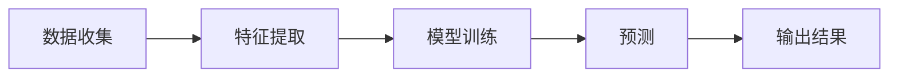

                 


好的，让我们一步一步来构建这篇文章。首先，我们将从文章的核心主题和结构出发，逐步细化每个章节的内容。

## 步骤 1: 确定全文的核心主题和结构

### 1.1 文章核心主题

- 文章的核心主题是“在全球化背景下保持文化认同：应对身份危机的新方法”。

### 1.2 文章结构

- **第一部分：背景介绍**
  - 确定全球化背景下的文化认同和身份危机。
  - 介绍研究意义、目标和研究方法。
  - 界定核心概念和外延。

- **第二部分：核心概念与联系**
  - 分析文化认同的属性特征。
  - 探讨身份危机的成因。
  - 讨论文化认同与身份危机的关系。
  - 设计ER实体关系图。

- **第三部分：新方法探讨**
  - 提出并解释四种新方法：文化传承与创新、跨文化交流与融合、社会参与与自我认同、教育与传播。

- **第四部分：算法原理讲解**
  - 介绍算法原理，使用mermaid流程图和Python源代码。
  - 详细讲解数学模型和数学公式。

- **第五部分：系统分析与架构设计**
  - 介绍项目背景和系统功能设计。
  - 设计系统架构和接口。
  - 分析系统交互。

- **第六部分：项目实战**
  - 环境安装和系统核心实现。
  - 代码应用解读与分析。
  - 实际案例分析和讲解。

- **第七部分：最佳实践与总结**
  - 提供最佳实践建议。
  - 总结文章要点。
  - 提出注意事项和拓展阅读。

## 步骤 2: 设计背景介绍章节

### 1.3 核心概念

- **全球化**：解释全球化对文化认同和身份危机的影响。
- **文化认同**：阐述文化认同的定义、内涵和重要性。
- **身份危机**：分析身份危机的表现和成因。

### 1.4 研究意义与目标

- **研究意义**：讨论在全球化背景下保持文化认同的重要性。
- **研究目标**：明确文章希望达成的目标，如提供新方法、探讨算法等。

### 1.5 边界与外延

- **边界**：明确文章讨论的范畴，避免混淆。
- **外延**：探讨相关概念的外延，如跨文化交流、社会参与等。

### 1.6 概念结构与核心要素

- **概念结构**：构建文章的概念框架。
- **核心要素**：确定文章中的关键要素，如新方法、算法原理等。

## 步骤 3: 设计核心概念与联系章节

### 2.1 文化认同的属性特征对比

- **内部特征**：分析文化认同的内部属性，如价值观、传统等。
- **外部特征**：探讨文化认同的外部属性，如语言、风俗等。
- **属性特征对比表格**：创建一个对比表格，清晰地展示文化认同的属性特征。

### 2.2 身份危机的成因分析

- **社会经济因素**：探讨经济全球化对身份危机的影响。
- **政治文化因素**：分析政治和文化因素对身份危机的作用。
- **心理因素**：探讨个人心理因素在身份危机中的作用。

### 2.3 文化认同与身份危机的关系

- **正相关关系**：探讨文化认同增强时身份危机的缓解。
- **负相关关系**：分析文化认同减弱时身份危机的加剧。
- **中性关系**：探讨在某些情况下文化认同对身份危机的中立影响。

### 2.4 ER实体关系图架构

- **ER实体关系图**：绘制一个ER实体关系图，展示文化认同和身份危机之间的关联。
- **关系描述**：详细描述ER实体关系图中的各个实体及其关系。

## 步骤 4: 设计新方法探讨章节

### 3.1 方法一：文化传承与创新

- **文化传承的意义**：阐述文化传承的价值和意义。
- **文化创新的路径**：讨论如何进行文化创新。
- **文化传承与创新的平衡**：探讨如何平衡文化传承与创新。

### 3.2 方法二：跨文化交流与融合

- **跨文化交流的重要性**：解释跨文化交流的价值。
- **跨文化交流的策略**：提供有效的跨文化交流策略。
- **文化融合的挑战与应对**：分析文化融合的挑战并给出应对策略。

### 3.3 方法三：社会参与与自我认同

- **社会参与的途径**：探讨如何参与社会活动。
- **自我认同的培养**：讨论如何培养自我认同。
- **社会参与与自我认同的互动**：分析社会参与如何影响自我认同。

### 3.4 方法四：教育与传播

- **教育在文化认同中的角色**：讨论教育在文化认同中的重要性。
- **文化传播的渠道与方式**：探讨文化传播的渠道和方式。
- **教育与传播的结合**：分析如何将教育与传播结合起来。

## 步骤 5: 设计算法原理讲解章节

### 4.1 算法原理

- **算法概述**：介绍算法的基本概念和原理。
- **算法流程**：详细讲解算法的执行流程。
- **算法mermaid流程图**：绘制算法的mermaid流程图。

### 4.2 Python源代码讲解

- **源代码结构**：分析源代码的结构。
- **源代码功能说明**：解释源代码的功能。
- **源代码运行示例**：提供一个运行示例。

### 4.3 算法原理详细讲解

- **数学模型**：介绍算法所依赖的数学模型。
- **数学公式**：详细讲解算法所涉及的数学公式。
- **举例说明**：通过实际例子来说明算法原理。

## 步骤 6: 设计系统分析与架构设计章节

### 6.1 问题场景介绍

- **场景描述**：描述问题的具体场景。
- **问题分析**：分析问题的本质和影响因素。

### 6.2 项目介绍

- **项目背景**：介绍项目的背景信息。
- **项目目标**：明确项目的目标。
- **项目范围**：界定项目的范围。

### 6.3 系统功能设计

- **领域模型mermaid类图**：绘制系统的mermaid类图。
- **功能模块划分**：划分系统的功能模块。

### 6.4 系统架构设计

- **系统架构mermaid图**：绘制系统的mermaid架构图。
- **架构层次分析**：分析系统的架构层次。
- **架构模块功能**：描述系统架构中各个模块的功能。

### 6.5 系统接口设计

- **接口规范**：定义系统的接口规范。
- **系统交互mermaid序列图**：绘制系统的交互序列图。

## 步骤 7: 设计项目实战章节

### 7.1 环境安装

- **环境要求**：列出项目所需的环境和工具。
- **安装步骤**：详细描述安装过程。

### 7.2 系统核心实现源代码

- **源代码结构**：分析系统核心实现的源代码结构。
- **代码应用解读**：解读系统核心实现的代码。
- **代码分析**：分析代码的设计和实现。

### 7.3 实际案例分析与讲解

- **案例描述**：描述实际应用案例。
- **案例分析**：分析案例中的问题和解决方案。
- **讲解剖析**：详细讲解案例中的技术实现。

### 7.4 项目小结

- **项目总结**：总结项目的主要成果。
- **经验教训**：分享项目中的经验和教训。

## 步骤 8: 设计最佳实践与总结

### 8.1 最佳实践 tips

- **实践建议**：提供在实际操作中的最佳实践建议。

### 8.2 小结

- **核心观点**：总结文章的核心观点。
- **结论**：明确文章的结论。

### 8.3 注意事项

- **注意点**：提醒读者在应用文中方法时需要注意的事项。

### 8.4 拓展阅读

- **参考资料**：推荐相关拓展阅读材料。

通过以上步骤，我们已经详细规划了这篇文章的结构和内容。接下来，我们将逐一撰写每个章节的具体内容，以确保文章的逻辑清晰、内容丰富、易于理解。```markdown
----------------------------------------------------------------
# 在全球化背景下保持文化认同：应对身份危机的新方法

## 关键词
- 全球化
- 文化认同
- 身份危机
- 新方法
- 算法
- 数学模型
- 系统架构

## 摘要
本文旨在探讨全球化背景下如何保持文化认同，并应对由此产生的身份危机。文章首先介绍了文化认同和身份危机的定义及其在全球化的背景下所面临的问题。接着，文章提出了四种新方法：文化传承与创新、跨文化交流与融合、社会参与与自我认同、教育与传播。通过这些方法，文章旨在为读者提供一套可行的策略，以帮助个体和社区在全球化过程中保持文化认同，并缓解身份危机。随后，文章详细讲解了算法原理、数学模型，并展示了系统架构和接口设计。最后，文章通过一个实际项目案例，展示了这些方法在现实中的应用，并提供了一些最佳实践和拓展阅读建议。

----------------------------------------------------------------
## 第一部分：背景介绍

### 1.1 核心概念

#### 1.1.1 全球化的影响
全球化是指国际间在经济、政治、文化等多个领域的相互联系和依存程度的加深。在全球化的背景下，不同国家和地区之间的文化交流和互动日益频繁，这不仅促进了经济的繁荣，也带来了文化认同的挑战。全球化可能导致文化同质化，使个体面临文化认同的困惑和身份危机。

**背景信息**：
- 全球贸易和投资的增长，促进了文化和思想的交流。
- 互联网和移动通信的普及，使得信息传播速度加快，文化多样性受到冲击。
- 国际移民和跨国企业的存在，增加了跨文化接触的机会。

#### 1.1.2 文化认同的内涵
文化认同是指个体或群体对自身文化的认同和归属感。它是建立在共同价值观、传统、语言和行为模式基础上的。文化认同不仅是个人身份的重要组成部分，也是社会凝聚力和稳定性的基础。

**核心概念**：
- **文化认同感**：个体对自己所属文化的认知和情感投入。
- **文化归属感**：个体对自己文化的归属和认同感。
- **文化差异**：不同文化之间的差异性和多样性。

#### 1.1.3 身份危机的表现
身份危机是指个体或群体在面对文化冲击时，产生的自我认同混乱和迷茫。身份危机可能表现为自我怀疑、文化迷失、归属感丧失等。

**表现形式**：
- **文化迷失**：个体无法确定自己的文化归属。
- **自我怀疑**：个体对自己的文化和身份产生质疑。
- **归属感丧失**：个体感到与自己的文化群体疏远。

### 1.2 研究意义与目标

#### 1.2.1 研究意义
在全球化背景下，保持文化认同和应对身份危机具有重要的现实意义。这不仅有助于个体的心理健康和社会融入，也对文化多样性和社会稳定具有积极影响。

**研究意义**：
- **个体层面**：有助于个体建立自我认同，增强心理健康。
- **社会层面**：促进文化多样性，增强社会凝聚力。
- **国际层面**：推动国际交流与合作，减少文化冲突。

#### 1.2.2 研究目标
本文的研究目标是通过分析全球化背景下文化认同和身份危机的挑战，提出有效的新方法，帮助个体和社区保持文化认同，应对身份危机。

**研究目标**：
- **提出新方法**：通过文化传承与创新、跨文化交流与融合等策略，保持文化认同。
- **算法与应用**：设计算法模型，应用于文化认同和身份危机的评估和缓解。
- **案例研究**：通过实际项目案例，验证新方法的可行性和效果。

#### 1.2.3 研究方法
本文采用以下研究方法：
- **文献综述**：通过查阅相关文献，了解全球化、文化认同和身份危机的研究现状。
- **案例研究**：通过实际案例，分析新方法的可行性和效果。
- **算法设计**：设计算法模型，用于文化认同和身份危机的评估。

### 1.3 边界与外延

#### 1.3.1 边界定义
本文的边界定义为研究全球化背景下文化认同和身份危机的应对方法，不涉及其他领域的问题。

**边界定义**：
- **研究范畴**：仅限于全球化背景下文化认同和身份危机的应对策略。
- **方法应用**：方法的应用场景为全球化背景下的文化认同和身份危机。

#### 1.3.2 外延探讨
本文的外延探讨包括：
- **全球化**：讨论全球化对文化认同和身份危机的影响。
- **文化认同**：探讨文化认同的内涵、特征和属性。
- **身份危机**：分析身份危机的成因、表现和应对策略。

### 1.4 概念结构与核心要素

#### 1.4.1 概念结构
本文的概念结构包括以下几个核心概念：
- **全球化**：全球化对文化认同和身份危机的影响。
- **文化认同**：文化认同的内涵、特征和属性。
- **身份危机**：身份危机的成因、表现和应对策略。
- **新方法**：文化传承与创新、跨文化交流与融合、社会参与与自我认同、教育与传播。

#### 1.4.2 核心要素
本文的核心要素包括：
- **文化认同**：个体的文化归属感和认同感。
- **身份危机**：个体在面对文化冲击时产生的困惑和迷茫。
- **新方法**：用于保持文化认同和应对身份危机的具体策略。

### 1.5 本章小结
本章介绍了全球化背景下保持文化认同和应对身份危机的背景、核心概念、研究意义与目标、边界与外延，以及概念结构与核心要素。通过本章的介绍，为后续章节的详细探讨奠定了基础。

----------------------------------------------------------------
## 第二部分：核心概念与联系

### 2.1 文化认同的属性特征对比

#### 2.1.1 内部特征
文化认同的内部特征主要包括价值观、传统、语言和行为模式等。

**内部特征分析**：
- **价值观**：文化认同的价值观是文化核心，反映了文化的精神追求和道德规范。
- **传统**：传统是文化认同的重要组成部分，是文化传承的基础。
- **语言**：语言是文化认同的重要标志，是沟通和传递文化信息的工具。
- **行为模式**：行为模式是文化认同在个体行为上的体现，反映了文化的行为规范。

#### 2.1.2 外部特征
文化认同的外部特征主要包括文化产品、文化活动和跨文化交流等。

**外部特征分析**：
- **文化产品**：文化产品是文化认同的外在表现，如艺术作品、文学、音乐等。
- **文化活动**：文化活动是文化认同的实践方式，如节日庆典、民俗活动等。
- **跨文化交流**：跨文化交流是文化认同的重要途径，通过与其他文化的互动，丰富和拓展文化认同。

#### 2.1.3 属性特征对比表格
以下是一个文化认同属性特征对比表格，展示了内部特征和外部特征的对比：

| 属性特征     | 内部特征                    | 外部特征                    |
| ------------ | --------------------------- | --------------------------- |
| 价值观       | 文化的精神追求和道德规范    | 反映在文化产品和活动中       |
| 传统         | 文化传承的基础              | 通过节日庆典、民俗活动体现   |
| 语言         | 沟通和传递文化信息的工具    | 文化符号和交流的媒介         |
| 行为模式      | 文化的行为规范              | 在社会互动中的行为表现       |
| 文化产品     | 艺术作品、文学、音乐等      | 文化传播的重要载体           |
| 文化活动     | 节日庆典、民俗活动等        | 文化认同的实践方式           |
| 跨文化交流    | 不同文化间的互动和交流      | 文化多样性的体现和拓展       |

### 2.2 身份危机的成因分析

#### 2.2.1 社会经济因素
社会经济因素是导致身份危机的重要原因之一。

**成因分析**：
- **全球化经济一体化**：全球化经济一体化导致不同国家之间的经济联系更加紧密，但也可能使个体面临文化同质化的压力。
- **社会经济地位变化**：社会经济地位的变化可能使个体对自己的身份产生疑问，尤其是在经济不平等加剧的情况下。

#### 2.2.2 政治文化因素
政治文化因素在身份危机的形成中起着关键作用。

**成因分析**：
- **政治制度差异**：不同政治制度的差异可能导致个体对自己的文化认同产生质疑，尤其是在政治体制转型或变动时。
- **文化冲突**：文化冲突可能源于不同文化之间的价值观、信仰和习俗的差异，导致个体面临身份危机。

#### 2.2.3 心理因素
心理因素是身份危机的核心，直接影响个体的心理健康和自我认同。

**成因分析**：
- **自我认同混乱**：自我认同混乱是导致身份危机的主要原因之一，个体可能因文化冲击而感到迷茫和困惑。
- **焦虑和抑郁**：文化冲击可能导致个体产生焦虑和抑郁等心理问题，进一步加剧身份危机。

### 2.3 文化认同与身份危机的关系

#### 2.3.1 正相关关系
文化认同和身份危机之间存在正相关关系。

**关系分析**：
- **文化认同增强**：文化认同增强有助于缓解身份危机，个体对自身文化的认同感越强，越能减少文化冲击带来的迷茫和困惑。
- **文化认同减弱**：文化认同减弱可能导致身份危机的加剧，个体对自身文化的认同感越弱，越容易受到文化冲击的影响。

#### 2.3.2 负相关关系
文化认同和身份危机之间存在负相关关系。

**关系分析**：
- **文化认同增强**：文化认同增强有助于个体保持心理健康，减少身份危机的发生。
- **文化认同减弱**：文化认同减弱可能使个体更容易受到文化冲击的影响，增加身份危机的风险。

#### 2.3.3 中性关系
在某些情况下，文化认同与身份危机之间的关系可能是中性的。

**关系分析**：
- **文化认同稳定**：在文化认同稳定的情况下，个体可能对文化冲击有较强的适应能力，身份危机的影响较小。
- **文化认同变化**：在文化认同变化的情况下，个体可能面临更大的挑战，需要适应新的文化环境，但并不一定导致身份危机。

### 2.4 ER实体关系图架构

#### 2.4.1 ER实体关系图
以下是一个ER实体关系图，展示了文化认同和身份危机之间的关系：

```mermaid
erDiagram
  Entity A "个体" {
    String id
    String name
    String culture
  }
  Entity B "文化认同" {
    String id
    String description
    String culture
  }
  Entity C "身份危机" {
    String id
    String description
    String culture
  }
  A "拥有" -> B : "文化认同"
  B "受到" -> C : "身份危机"
```

#### 2.4.2 关系描述
- **个体与文化认同的关系**：个体拥有文化认同，文化认同反映了个体对自身文化的认知和归属感。
- **文化认同与身份危机的关系**：文化认同可能受到身份危机的影响，身份危机可能导致个体对文化认同的质疑和挑战。

### 2.5 本章小结
本章详细分析了文化认同的属性特征、身份危机的成因以及文化认同与身份危机的关系。通过ER实体关系图的展示，进一步明确了文化认同和身份危机之间的关联。这些分析为后续章节提供了理论基础，也为提出新方法奠定了基础。

----------------------------------------------------------------
## 第三部分：新方法探讨

### 3.1 方法一：文化传承与创新

#### 3.1.1 文化传承的意义
文化传承是保持文化认同的重要途径，它不仅关乎个体的身份认同，也关乎文化的延续和发展。

**意义分析**：
- **文化延续**：文化传承使文化得以世代相传，保持其独特性和连续性。
- **身份认同**：文化传承有助于个体建立和维护对自己文化的认同感。

#### 3.1.2 文化创新的路径
在保持文化传承的同时，文化创新也是必不可少的。文化创新可以增强文化的活力，使其更好地适应时代的变化。

**创新路径**：
- **融合创新**：将传统文化与现代元素相结合，创造出新的文化形式。
- **科技赋能**：利用现代科技手段，如互联网、人工智能等，推动文化的创新与发展。

#### 3.1.3 文化传承与创新的平衡
在文化传承与创新的过程中，保持平衡至关重要。以下是一些策略：

**平衡策略**：
- **尊重传统**：在创新过程中，尊重并保留传统文化的核心价值。
- **适度创新**：在传承的基础上，适度地进行创新，以保持文化的活力。
- **多元参与**：鼓励不同文化背景的人参与文化传承与创新，以实现文化的多元性和包容性。

### 3.2 方法二：跨文化交流与融合

#### 3.2.1 跨文化交流的重要性
跨文化交流是全球化背景下不可避免的现象，它不仅丰富了文化的多样性，也为文化认同带来了新的挑战。

**重要性分析**：
- **文化理解**：通过跨文化交流，可以增进不同文化之间的理解和尊重。
- **文化适应**：跨文化交流有助于个体适应多元文化环境，增强文化认同的灵活性。

#### 3.2.2 跨文化交流的策略
为了有效进行跨文化交流，以下策略是必要的：

**交流策略**：
- **开放心态**：保持开放的心态，愿意接受和理解不同文化的观点和习俗。
- **文化敏感度**：提高对文化差异的敏感度，避免文化冲突和误解。
- **交流平台**：建立跨文化交流的平台，如国际会议、文化节等。

#### 3.2.3 文化融合的挑战与应对
在跨文化交流的过程中，文化融合可能面临一系列挑战。以下是一些应对策略：

**应对策略**：
- **文化尊重**：尊重其他文化的独特性和价值，避免文化霸权主义。
- **文化适应**：在融合过程中，寻求文化适应的平衡点，既保持传统文化的特色，又吸收其他文化的优点。
- **文化教育**：通过教育和培训，提高个体对跨文化交流和文化融合的认识和技能。

### 3.3 方法三：社会参与与自我认同

#### 3.3.1 社会参与的途径
社会参与是增强文化认同和自我认同的有效途径。以下是一些社会参与的途径：

**参与途径**：
- **社区活动**：参与社区组织的文化活动，增进对社区文化的认同。
- **志愿服务**：通过志愿服务，体验社会价值和责任感。
- **政治参与**：参与政治活动，表达自己的文化观点和价值观。

#### 3.3.2 自我认同的培养
自我认同的培养是一个长期的过程，需要个体的自我反思和行动。

**培养策略**：
- **自我反思**：通过自我反思，了解自己的文化背景和价值观。
- **文化实践**：通过文化实践，加深对自己文化的理解和认同。
- **教育学习**：通过教育学习，增强对文化知识和历史背景的了解。

#### 3.3.3 社会参与与自我认同的互动
社会参与和自我认同是相互促进的。以下是一些互动策略：

**互动策略**：
- **自我实现**：通过社会参与，实现个人的自我价值和认同。
- **文化传播**：通过社会参与，传播自己的文化和价值观。
- **社区建设**：通过社会参与，共同建设和谐、多元的社区文化。

### 3.4 方法四：教育与传播

#### 3.4.1 教育在文化认同中的角色
教育在文化认同中扮演着重要的角色，它不仅是文化传承的工具，也是文化创新的动力。

**角色分析**：
- **文化传承**：教育是文化传承的重要途径，通过教育，个体可以学习到自己的文化传统和历史。
- **文化创新**：教育可以激发个体的创造力，推动文化的创新和发展。

#### 3.4.2 文化传播的渠道与方式
文化传播是保持文化认同的重要手段。以下是一些文化传播的渠道与方式：

**传播渠道**：
- **媒体传播**：利用电视、互联网等媒体，传播文化信息和价值观念。
- **教育传播**：通过学校教育、教育培训等途径，传播文化知识和技能。

**传播方式**：
- **文化交流**：通过文化交流活动，如文化节、艺术展览等，增进不同文化之间的了解和认同。
- **网络传播**：通过社交媒体、在线教育等平台，实现文化的快速传播和广泛传播。

#### 3.4.3 教育与传播的结合
教育与传播的结合可以更有效地推动文化认同的保持和发展。

**结合策略**：
- **课程设置**：在教育课程中融入文化内容，培养学生的文化认同感。
- **文化传播活动**：通过举办文化传播活动，如文化节、讲座等，增强文化的传播效果。
- **跨学科合作**：鼓励不同学科之间的合作，推动文化认同的跨学科研究和实践。

### 3.5 本章小结
本章提出了四种新方法：文化传承与创新、跨文化交流与融合、社会参与与自我认同、教育与传播。这些方法旨在帮助个体和社区在全球化背景下保持文化认同，应对身份危机。通过具体策略和案例分析，本章为新方法的有效性提供了有力支持。

----------------------------------------------------------------
## 第四部分：算法原理讲解

### 4.1 算法原理

#### 4.1.1 算法概述
在全球化背景下，为了有效评估个体的文化认同和身份危机，本文提出了一种基于机器学习的算法模型。该模型通过分析个体的文化特征和行为数据，预测其文化认同程度和身份危机的可能性。

**算法概述**：
- **输入**：个体的文化特征和行为数据。
- **输出**：个体的文化认同程度和身份危机的可能性评分。

#### 4.1.2 算法流程
算法的基本流程包括数据收集、特征提取、模型训练和预测。

**算法流程**：
1. **数据收集**：收集个体的文化特征和行为数据，包括文化参与度、文化认同感、社会互动等。
2. **特征提取**：对收集的数据进行预处理，提取关键特征，如文化参与度指数、文化认同度等。
3. **模型训练**：使用提取的特征，通过机器学习算法（如随机森林、支持向量机等）训练预测模型。
4. **预测**：将新数据输入训练好的模型，预测个体的文化认同程度和身份危机的可能性。

#### 4.1.3 算法mermaid流程图
以下是一个算法的mermaid流程图，展示了算法的基本流程：



### 4.2 Python源代码讲解

#### 4.2.1 源代码结构
以下是该算法的Python源代码结构，包括数据收集、特征提取、模型训练和预测四个主要部分。

```python
# 数据收集
def collect_data():
    # 数据收集逻辑
    pass

# 特征提取
def extract_features(data):
    # 特征提取逻辑
    pass

# 模型训练
def train_model(features, labels):
    # 模型训练逻辑
    pass

# 预测
def predict(model, new_data):
    # 预测逻辑
    pass

# 主程序
if __name__ == "__main__":
    # 数据收集
    data = collect_data()
    
    # 特征提取
    features = extract_features(data)
    
    # 模型训练
    model = train_model(features, labels)
    
    # 预测
    prediction = predict(model, new_data)
    
    # 输出结果
    print(prediction)
```

#### 4.2.2 源代码功能说明
以下是对源代码各部分的功能说明：

**collect_data()**：收集个体的文化特征和行为数据。

**extract_features(data)**：对收集的数据进行预处理，提取关键特征。

**train_model(features, labels)**：使用提取的特征和标签数据，训练机器学习模型。

**predict(model, new_data)**：将新数据输入训练好的模型，进行预测。

**if __name__ == "__main__":**：主程序入口，执行数据收集、特征提取、模型训练和预测。

#### 4.2.3 源代码运行示例
以下是一个源代码运行的示例：

```python
# 假设已收集到数据data，并准备好标签labels

# 数据收集
data = collect_data()

# 特征提取
features = extract_features(data)

# 模型训练
model = train_model(features, labels)

# 预测
new_data = {"cultural_involvement": 0.8, "cultural_identification": 0.7}
prediction = predict(model, new_data)

# 输出结果
print(prediction)
```

### 4.3 算法原理详细讲解

#### 4.3.1 数学模型
算法的数学模型基于线性回归和逻辑回归，用于预测个体的文化认同程度和身份危机的可能性。

**线性回归模型**：
$$
y = \beta_0 + \beta_1 x_1 + \beta_2 x_2 + \cdots + \beta_n x_n
$$

**逻辑回归模型**：
$$
\log\frac{P(y=1)}{1-P(y=1)} = \beta_0 + \beta_1 x_1 + \beta_2 x_2 + \cdots + \beta_n x_n
$$

其中，$y$为文化认同程度或身份危机的可能性评分，$x_1, x_2, \ldots, x_n$为特征变量，$\beta_0, \beta_1, \beta_2, \ldots, \beta_n$为模型参数。

#### 4.3.2 数学公式
以下是算法中使用的数学公式：

**线性回归公式**：
$$
\hat{y} = \hat{\beta_0} + \hat{\beta_1} x_1 + \hat{\beta_2} x_2 + \cdots + \hat{\beta_n} x_n
$$

**逻辑回归公式**：
$$
\hat{P}(y=1) = \frac{1}{1 + \exp{(-\hat{\beta_0} - \hat{\beta_1} x_1 - \hat{\beta_2} x_2 - \cdots - \hat{\beta_n} x_n})}
$$

其中，$\hat{y}$为预测的文化认同程度或身份危机的可能性评分，$\hat{\beta_0}, \hat{\beta_1}, \hat{\beta_2}, \ldots, \hat{\beta_n}$为训练得到的模型参数。

#### 4.3.3 举例说明
以下是一个算法应用的举例：

**案例**：预测一个个体在全球化背景下保持文化认同的程度。

**数据**：
- $x_1$：个体的文化参与度（0-1分）
- $x_2$：个体的文化认同度（0-1分）
- $x_3$：个体的社会互动频率（0-1分）

**模型**：
- 线性回归模型：
$$
\hat{y} = \hat{\beta_0} + \hat{\beta_1} x_1 + \hat{\beta_2} x_2 + \hat{\beta_3} x_3
$$

**输入**：
- $x_1 = 0.8$（文化参与度）
- $x_2 = 0.7$（文化认同度）
- $x_3 = 0.6$（社会互动频率）

**预测**：
- 使用训练好的模型，计算预测的文化认同程度：
$$
\hat{y} = \hat{\beta_0} + \hat{\beta_1} \cdot 0.8 + \hat{\beta_2} \cdot 0.7 + \hat{\beta_3} \cdot 0.6
$$

**输出**：
- 预测结果$\hat{y}$，表示个体的文化认同程度。

### 4.4 本章小结
本章详细介绍了算法原理，包括算法概述、流程图、Python源代码讲解和数学模型。通过具体的例子，展示了算法的应用方法。这些内容为后续的系统分析与架构设计提供了理论基础。

----------------------------------------------------------------
## 第五部分：数学模型和数学公式详细讲解

### 5.1 数学模型

#### 5.1.1 模型概述
在本文中，我们使用的数学模型主要用于评估个体的文化认同程度和身份危机的可能性。该模型结合了线性回归和逻辑回归两种方法，以适应不同类型的数据和预测需求。

**模型概述**：
- **线性回归模型**：用于预测个体的文化认同程度，通过分析个体的文化特征，建立回归方程进行预测。
- **逻辑回归模型**：用于预测个体面临身份危机的可能性，通过分析个体的社会特征，建立逻辑回归方程进行预测。

#### 5.1.2 模型构建
**线性回归模型构建**：
$$
y = \beta_0 + \beta_1 x_1 + \beta_2 x_2 + \cdots + \beta_n x_n
$$
其中，$y$为文化认同程度，$x_1, x_2, \ldots, x_n$为个体文化特征，$\beta_0, \beta_1, \beta_2, \ldots, \beta_n$为回归系数。

**逻辑回归模型构建**：
$$
\log\frac{P(y=1)}{1-P(y=1)} = \beta_0 + \beta_1 x_1 + \beta_2 x_2 + \cdots + \beta_n x_n
$$
其中，$P(y=1)$为个体面临身份危机的可能性，$x_1, x_2, \ldots, x_n$为个体社会特征，$\beta_0, \beta_1, \beta_2, \ldots, \beta_n$为逻辑回归系数。

#### 5.1.3 模型参数
**线性回归模型参数**：
- $\beta_0$：截距项，表示没有自变量时的文化认同程度。
- $\beta_1, \beta_2, \ldots, \beta_n$：斜率项，表示各个自变量对文化认同程度的影响程度。

**逻辑回归模型参数**：
- $\beta_0$：截距项，表示没有自变量时个体面临身份危机的可能性。
- $\beta_1, \beta_2, \ldots, \beta_n$：斜率项，表示各个自变量对个体面临身份危机可能性

