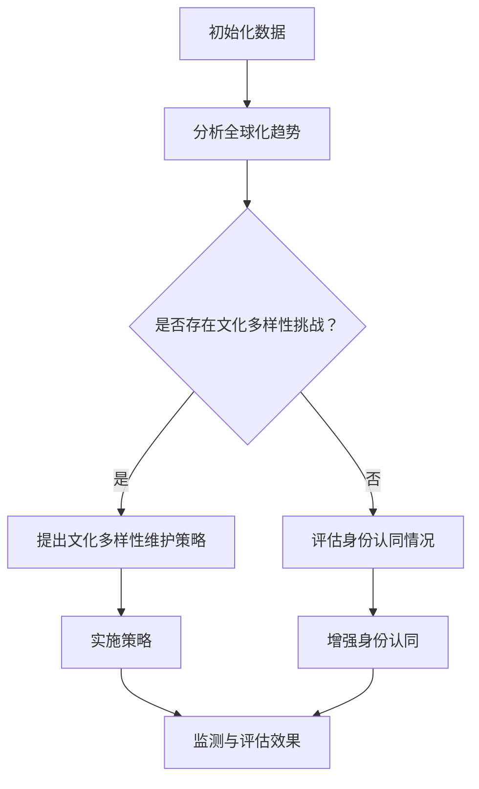
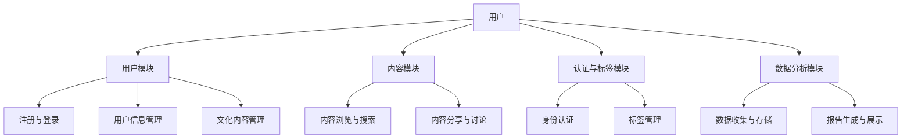
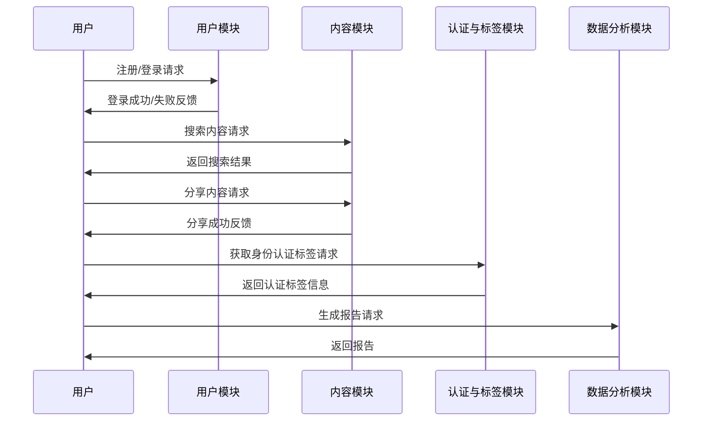
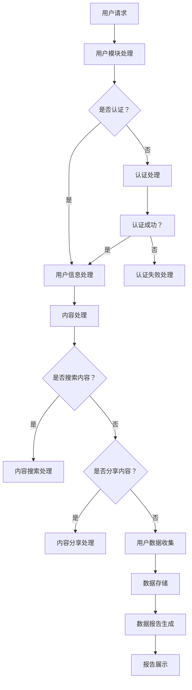

                 

### 在全球化趋势中维护文化多样性：应对身份认同挑战

随着全球化进程的不断加速，世界各国在经济、政治、文化等各个领域的联系日益紧密。然而，全球化也带来了一系列挑战，尤其是在维护文化多样性方面。身份认同是一个复杂而多维度的概念，它不仅关乎个体的自我认知，还与群体的归属感和共同价值观紧密相连。在全球化的背景下，如何维护文化多样性，同时应对身份认同的挑战，成为了一个亟待解决的重要问题。

本文旨在探讨全球化趋势下文化多样性的维护与身份认同的挑战。我们将从以下几个方面进行深入分析：

1. **全球化与身份认同**：首先，我们将介绍全球化的趋势及其对文化多样性的影响，接着讨论身份认同的构成及其在全球范围内的挑战。
2. **文化多样性的重要性**：我们将阐述文化多样性的定义及其在社会发展中的关键作用。
3. **维护文化多样性的策略与方法**：本文将提出一系列策略和方法，以帮助维护文化多样性，包括文化政策与规划、社会教育与文化传承、多元文化社区建设等。
4. **案例分析**：我们将通过国内外实际案例，分析成功经验与存在的挑战。
5. **政策与立法**：我们将探讨国际与国内的政策和法律框架，以及地方政府在此方面的实践。
6. **教育与科技的角色**：本文将探讨教育在促进文化多样性中的重要作用，以及科技在保护和推广文化多样性方面的潜力。
7. **未来展望**：最后，我们将展望未来的发展方向，并提出可能的解决方案。

### 关键词

- 全球化
- 文化多样性
- 身份认同
- 维护策略
- 国际政策
- 教育角色
- 科技影响

### 摘要

全球化趋势不可逆转，但这一过程中文化多样性的维护和身份认同的挑战日益凸显。本文通过深入分析全球化的影响、身份认同的构成与挑战，探讨了文化多样性的重要性以及维护文化多样性的多种策略与方法。通过实际案例分析，本文总结了国内外在维护文化多样性方面的成功经验与挑战，并提出了政策与立法的建议。此外，本文还探讨了教育在促进文化多样性中的重要作用，以及科技在保护和推广文化多样性方面的潜力。最终，本文展望了未来的发展方向，并提出了一系列可能的解决方案，以期为维护全球文化多样性和应对身份认同挑战提供有益的参考。

### 第一部分：背景与挑战

#### 1. 全球化与身份认同

全球化是指全球范围内经济、政治、文化、技术等各领域的相互联系和相互依赖程度的加深。全球化进程始于20世纪末，随着信息技术的发展、跨国公司的崛起和国际贸易的自由化，全球化趋势愈发显著。全球化不仅改变了全球经济格局，也对文化多样性产生了深远影响。

全球化对文化多样性的冲击主要体现在以下几个方面：

1. **文化交流的加速**：全球化促进了不同文化之间的交流，使得文化产品和服务更加多样化和丰富化。然而，这种交流也导致了文化同质化现象，一些强势文化可能对弱势文化产生压制，导致文化多样性的减少。
2. **经济利益的优先**：在全球化背景下，各国往往更注重经济利益，这可能导致一些传统文化被边缘化或消失。例如，一些少数民族语言和习俗因无法带来直接经济收益而逐渐被忽视。
3. **政治影响的扩大**：全球化使得政治影响力跨越国界，国际组织和跨国公司的力量逐渐增强。这些力量在推动文化全球化的同时，也可能对本土文化产生冲击，导致文化认同的困惑和矛盾。

身份认同是人们对自己身份的认知和归属感，是文化多样性的基础。在全球化的背景下，身份认同面临着诸多挑战：

1. **文化认同的多元性**：全球化带来了文化的多元性，人们可以接触到各种不同的文化，这使得个体在形成身份认同时面临更多选择。然而，这也可能导致文化认同的模糊性和矛盾性。
2. **文化冲突**：全球化过程中，不同文化之间的接触和碰撞可能引发文化冲突，加剧身份认同的困惑。例如，全球化带来的移民潮可能导致本土文化与移民文化的冲突，影响社区和谐与个人身份认同。
3. **自我认同的模糊**：全球化使得人们的生活节奏加快，社会结构复杂化，个体在身份认同上可能感到不确定和模糊。这种现象被称为“文化疏离”，可能导致心理健康问题和社会问题。

#### 1.2 身份认同的挑战

身份认同的挑战在全球化背景下表现得尤为突出，主要体现在以下几个方面：

1. **文化身份的模糊性**：全球化使得文化界限变得模糊，个体可能难以界定自己的文化身份。这种现象在年轻人中尤为明显，他们可能同时受到多种文化的影响，导致文化身份的不确定性。
2. **文化多样性的压力**：全球化背景下，文化多样性被视为一种资源，但在某些情况下也可能成为一种压力。个体和群体可能感受到来自多元文化的压力，导致文化认同的困惑和焦虑。
3. **文化归属感的缺失**：全球化使得人们的生活和社交网络跨越国界，传统的文化归属感可能减弱。个体可能感到自己在文化上没有归属，难以找到属于自己的文化社区。
4. **文化差异的误解**：全球化过程中，不同文化之间的误解和偏见可能导致文化冲突。这种冲突不仅影响个人身份认同，也可能影响社会和谐与稳定。

#### 1.3 文化多样性的重要性

文化多样性是人类社会的重要组成部分，具有深远的社会、经济和文化意义。以下是文化多样性的几个关键方面：

1. **社会意义**：文化多样性有助于促进社会包容和和谐。多样化的文化环境可以减少社会冲突，增强社会凝聚力和稳定性。
2. **经济价值**：文化多样性是文化产业的重要资源，可以带来经济收益。多样化的文化产品和服务可以满足不同消费者的需求，推动经济增长。
3. **文化创新**：文化多样性为文化创新提供了丰富的灵感来源。不同文化的交融和碰撞可以激发新的创意和艺术形式，推动文化创新。
4. **社会认同**：文化多样性有助于增强个体和社会的自我认同。通过维护和传承本土文化，个体和群体可以更好地认识自己和他人，增强文化认同感。

#### 1.4 全球化与文化多样性的动态关系

全球化与文化多样性之间存在一种动态关系，二者相互影响，相互制约。以下是从几个方面分析这种关系：

1. **融合与冲突**：全球化既促进了不同文化之间的融合，也导致了文化冲突。融合有助于文化多样性的发展，冲突则可能对文化多样性构成威胁。
2. **平衡与适应**：在全球化过程中，如何平衡文化多样性与文化同质化是一个重要问题。适当的政策和社会适应机制有助于维护文化多样性。
3. **政策与管理**：政府和国际组织在维护文化多样性方面扮演着关键角色。有效的政策和管理体系可以促进文化多样性的发展，减少文化冲突。
4. **技术创新**：科技的发展为文化多样性的保护和推广提供了新的途径。互联网、社交媒体等新技术可以帮助传播和保存各种文化，促进文化交流与融合。

#### 1.5 本章小结

本部分主要探讨了全球化与身份认同的关系，以及全球化对文化多样性的影响和挑战。全球化在促进文化交流和经济发展的同时，也给文化多样性和身份认同带来了挑战。维护文化多样性不仅关乎个体的文化认同，也关系到社会和谐与稳定。在全球化背景下，我们需要采取有效的策略和方法，应对身份认同的挑战，同时保护和推广文化多样性。

### 第二部分：策略与方法

#### 2. 维护文化多样性的策略

在全球化背景下，维护文化多样性是一个复杂而长期的任务，需要政府、社会组织和个人的共同努力。以下是一些关键的策略和方法：

#### 2.1 文化政策与规划

政府在这一过程中扮演着关键角色，通过制定和实施文化政策，可以为文化多样性的维护提供制度保障。以下是一些具体的政策措施：

1. **文化立法**：通过制定文化相关法律法规，明确文化多样性的保护目标和责任。例如，可以出台《文化多样性保护法》，规定政府、企业和个人在文化多样性的维护中的权利和义务。
2. **文化规划**：在国家和地方层面制定文化发展规划，明确文化多样性的保护目标和重点领域。例如，可以制定《文化多样性发展十年规划》，提出具体的行动计划和实施措施。
3. **文化资助**：通过财政资助和政策支持，鼓励文化多样性的发展。例如，可以设立文化多样性基金，用于资助少数民族文化项目的保护和推广。
4. **国际合作**：积极参与国际文化交流与合作，促进文化多样性的国际对话和合作。例如，可以加入联合国教科文组织的《保护非物质文化遗产公约》，积极参与国际文化保护项目。

#### 2.2 社会教育与文化传承

教育是维护文化多样性的重要手段，通过教育可以培养人们对不同文化的理解和尊重。以下是一些具体的措施：

1. **课程设置**：在学校的课程设置中增加关于文化多样性的内容，使学生从小就接触到各种不同的文化。例如，可以设置《文化多样性导论》课程，介绍不同文化的特点和历史。
2. **跨文化交流**：鼓励跨文化交流活动，促进不同文化之间的理解和尊重。例如，可以组织学生交流活动，让学生有机会到其他国家学习生活，体验不同的文化。
3. **文化活动**：在社区中举办各种文化活动，如文化节、民俗活动等，让居民有机会了解和体验不同的文化。例如，可以举办“国际文化月”活动，邀请不同国家的艺术家和文化团体来表演和交流。
4. **文化遗产保护**：加强对文化遗产的保护和传承，特别是对非物质文化遗产的保护。例如，可以设立文化遗产保护区，对重要的文化遗产进行修缮和保护。

#### 2.3 多元文化社区建设

多元文化社区是文化多样性的重要载体，通过建设多元文化社区，可以促进不同文化之间的交流与融合。以下是一些具体的措施：

1. **社区规划**：在城市建设过程中，注重多元文化社区的建设。例如，可以在城市中规划多元文化社区，为不同文化群体提供居住和交流的空间。
2. **文化融合活动**：在社区中组织各种文化融合活动，如文化交流会、节日庆典等，促进不同文化之间的互动和交流。例如，可以举办“多元文化嘉年华”，邀请不同文化群体展示和庆祝自己的节日。
3. **文化资源共享**：鼓励不同文化群体共享文化资源，如图书馆、博物馆等。例如，可以建立多元文化图书馆，收藏和展示不同文化的书籍、艺术品等。
4. **社区参与**：鼓励居民积极参与社区文化建设，通过居民自治和社区参与，共同维护社区的文化多样性。例如，可以成立社区文化委员会，由不同文化背景的居民组成，共同策划和实施社区文化活动。

#### 2.4 媒体与文化产业的角色

媒体和文化产业在维护文化多样性方面具有重要作用，可以通过传播和推广不同文化，增强人们对文化多样性的认识和理解。以下是一些具体的措施：

1. **多元文化宣传**：在媒体中增加对多元文化的宣传和报道，让公众有机会了解和接触到不同的文化。例如，可以设立“多元文化频道”，专门播放不同文化的节目。
2. **文化产品开发**：鼓励文化产业的多元发展，开发多种类型的文化产品，如电影、音乐、书籍等。例如，可以制作反映不同文化的电影和音乐专辑，让更多的人了解和喜爱不同的文化。
3. **文化体验活动**：在文化产业中推广文化体验活动，让公众有机会亲身体验不同的文化。例如，可以举办“文化体验之旅”，组织游客到不同的文化社区体验当地的文化和生活方式。
4. **文化交流平台**：建立文化交流平台，促进不同文化之间的互动和交流。例如，可以建立“多元文化论坛”，邀请不同文化的代表进行交流和对话。

#### 2.5 文化多样性监测与评估

为了有效地维护文化多样性，需要对文化多样性进行监测和评估，及时发现问题和挑战，并采取相应的措施。以下是一些具体的措施：

1. **监测指标**：建立一套科学合理的监测指标体系，用于评估文化多样性的现状和变化。例如，可以设置文化多样性指数，从多个维度评估文化多样性的水平。
2. **评估方法**：采用多种评估方法，如问卷调查、访谈、统计分析等，全面了解文化多样性的状况。例如，可以通过问卷调查了解居民对文化多样性的认知和态度。
3. **定期报告**：定期发布文化多样性监测和评估报告，向公众和社会各界展示文化多样性的现状和变化。例如，可以每年发布一次《文化多样性发展报告》，总结年度文化多样性工作的成果和问题。
4. **反馈机制**：建立有效的反馈机制，根据监测和评估结果，及时调整文化多样性维护的策略和措施。例如，可以根据居民的意见和建议，改进文化活动的策划和实施。

#### 2.6 本章小结

本部分提出了维护文化多样性的多种策略和方法，包括文化政策与规划、社会教育与文化传承、多元文化社区建设、媒体与文化产业的角色以及文化多样性监测与评估。通过这些策略和方法的实施，我们可以更好地应对全球化背景下的文化多样性挑战，保护和推广文化多样性，促进社会和谐与稳定。

### 第三部分：案例分析

#### 3.1 国外案例分析

在国际上，许多国家在维护文化多样性方面已经取得了显著的成果，同时也面临了一些挑战。以下是几个具有代表性的案例：

**1. 加拿大**

加拿大是一个多民族、多文化的国家，其文化多样性政策在全球范围内具有示范作用。加拿大的文化多样性政策主要包括以下几个方面：

- **多元文化立法**：加拿大通过了《多元文化主义政策法案》，确立了多元文化主义作为国家政策的基本原则。该法案规定了政府、企业和个人在维护文化多样性中的责任和义务。
- **文化资助**：加拿大政府设立了多元文化基金，用于支持少数民族文化的保护和传承。这些资助项目包括文化项目、文化活动、文化遗产保护等。
- **跨文化交流**：加拿大积极推动跨文化交流，通过国际文化交流项目，促进不同文化之间的互动和了解。例如，加拿大文化部门每年都会组织“多元文化节”，邀请来自世界各地的艺术家和文化团体参与。

**2. 挪威**

挪威在维护文化多样性方面也取得了显著成果。挪威的文化多样性政策主要侧重于以下几个方面：

- **文化教育**：挪威政府将文化多样性纳入教育体系，通过学校教育和公共教育，提高国民对文化多样性的认知和理解。挪威的教育大纲中包含了不同文化的内容，学生有机会学习多种语言和文化。
- **文化保护**：挪威政府设立了文化遗产保护机构，负责保护和管理国家重要的文化遗产。这些机构通过修复、展示和保护文化遗产，促进了文化多样性的维护。
- **社区参与**：挪威鼓励居民积极参与社区文化建设，通过社区自治和社区活动，增强居民对文化多样性的认同感和参与感。

**3. 新加坡**

新加坡是一个多元种族、多元文化的国家，其文化多样性政策具有很强的适应性和灵活性。新加坡的文化多样性政策主要包括以下几个方面：

- **种族和谐**：新加坡政府强调种族和谐，通过政策引导和社区活动，促进不同种族之间的交流和合作。政府设立了种族和谐委员会，负责协调和处理种族冲突和问题。
- **文化融合**：新加坡政府鼓励不同文化之间的融合，通过文化融合项目，促进多元文化的共生和共荣。例如，政府设立了“新加坡文化融合奖”，表彰在文化融合方面做出杰出贡献的个人和组织。
- **文化教育**：新加坡政府将文化多样性教育纳入学校教育，通过教材和课程，提高学生对文化多样性的认识和尊重。政府还鼓励学校举办各种文化活动和庆典，增进学生对不同文化的了解。

#### 3.2 国内案例分析

在中国，维护文化多样性同样是一个重要议题，以下是一些成功的案例：

**1. 广西**

广西是一个多民族、多文化的地区，其文化多样性政策主要侧重于以下几个方面：

- **民族文化保护**：广西政府设立了民族文化保护机构，负责保护和管理少数民族文化遗产。这些机构通过修复、展示和保护文化遗产，促进了文化多样性的维护。
- **民族文化传承**：广西政府积极推动民族文化传承，通过文化传承项目，培养少数民族文化传承人，确保少数民族文化的传承和发展。
- **民族文化交流**：广西政府鼓励不同民族文化之间的交流和互动，通过举办民族文化节和交流活动，增进不同民族之间的了解和友谊。

**2. 云南**

云南是一个多民族、多文化的地区，其文化多样性政策具有鲜明的特色。云南的文化多样性政策主要包括以下几个方面：

- **文化多样性教育**：云南政府将文化多样性教育纳入学校教育，通过教材和课程，提高学生对文化多样性的认识和尊重。云南的学校还开设了多种民族语言课程，帮助学生了解和掌握不同民族的语言和文化。
- **民族文化保护**：云南政府设立了民族文化保护机构，负责保护和管理少数民族文化遗产。这些机构通过修复、展示和保护文化遗产，促进了文化多样性的维护。
- **民族文化传承**：云南政府积极推动民族文化传承，通过文化传承项目，培养少数民族文化传承人，确保少数民族文化的传承和发展。

**3. 上海**

上海作为一个国际化大都市，在维护文化多样性方面也取得了显著成果。上海的文化多样性政策主要包括以下几个方面：

- **文化交流**：上海政府积极推动文化交流，通过举办国际文化节、国际文化交流活动等，促进不同文化之间的交流和互动。例如，上海每年都会举办“上海国际文化周”，邀请来自世界各地的文化团体和艺术家参与。
- **文化融合**：上海政府鼓励不同文化之间的融合，通过文化融合项目，促进多元文化的共生和共荣。例如，上海设立了“文化融合奖”，表彰在文化融合方面做出杰出贡献的个人和组织。
- **文化多样性教育**：上海政府将文化多样性教育纳入学校教育，通过教材和课程，提高学生对文化多样性的认识和尊重。上海的学校还开设了多种文化体验课程，让学生有机会亲身体验不同的文化。

#### 3.3 案例分析总结

通过国内外案例分析，我们可以看到，维护文化多样性不仅需要政府政策的支持，还需要社会各界的共同努力。以下是一些成功经验和挑战的总结：

**1. 成功经验**

- **政策支持**：政府制定和实施有效的文化多样性政策，为文化多样性的维护提供了制度保障。
- **社会参与**：社会各界的积极参与，特别是社区的参与，是维护文化多样性的重要力量。
- **文化传承**：对文化遗产的保护和传承，有助于维护文化多样性和文化认同。
- **文化交流**：通过文化交流活动，增进不同文化之间的理解和尊重，促进文化多样性的发展。

**2. 挑战**

- **文化冲突**：全球化背景下，不同文化之间的冲突可能对文化多样性构成威胁。
- **经济压力**：经济利益的追求可能导致一些传统文化被边缘化或消失。
- **社会认同**：文化多样性的压力可能加剧社会认同的困惑和矛盾。
- **政策执行**：政策执行中的挑战，如资金不足、政策不完善等，可能影响文化多样性维护的效果。

#### 3.4 本章小结

本部分通过国内外案例分析，总结了在维护文化多样性方面的一些成功经验和挑战。这些案例表明，政府政策的支持、社会各界的参与、文化传承和交流都是维护文化多样性的重要因素。然而，文化冲突、经济压力、社会认同和政策执行等方面的挑战也需要引起重视。通过总结这些经验与挑战，我们可以更好地制定和实施文化多样性维护的策略，为全球文化多样性的发展提供有益的参考。

### 第四部分：政策与立法

#### 4. 文化多样性政策与法律框架

维护文化多样性需要强有力的政策与法律框架作为支撑。国际与国内的政策和法律框架在不同层面和范围内对文化多样性进行了规范和保护。

#### 4.1 国际法律框架

国际法律框架为全球文化多样性的保护和推广提供了重要的法律依据。以下是一些重要的国际公约和法律文件：

1. **联合国教科文组织的《保护世界文化和自然遗产公约》**：该公约于1972年通过，旨在保护世界文化和自然遗产，确保其得到保存和传承。这一公约对各国文化遗产的保护工作产生了深远影响。

2. **联合国教科文组织的《保护非物质文化遗产公约》**：该公约于2003年通过，将非物质文化遗产保护纳入国际法律体系。非物质文化遗产包括口头传统、表演艺术、社会习俗、庆祝活动、手工艺技术等，其保护工作对于维护文化多样性至关重要。

3. **联合国教科文组织的《文化多样性宣言》**：该宣言于2001年通过，强调了文化多样性的重要性，提出了尊重文化多样性、促进文化交流和合作等原则。这一宣言为国际社会在文化多样性问题上的共识和行动提供了指导。

4. **联合国大会的《世界文化多样性宣言》**：该宣言于2005年通过，进一步强调了文化多样性的价值和全球合作的重要性。宣言提出了促进文化多样性的具体措施，如加强文化交流、支持文化创新等。

#### 4.2 国家法律体系

各国根据自身国情和需求，制定了相应的法律和政策，以保护文化多样性。以下是一些国家在文化多样性保护方面的法律和措施：

1. **《中华人民共和国文化遗产法》**：该法于2006年通过，规定了文化遗产的定义、保护范围和保护措施。文化遗产包括历史建筑、文物、非物质文化遗产等，法律明确了政府、企业和个人在文化遗产保护中的责任。

2. **《中华人民共和国非物质文化遗产法》**：该法于2011年通过，专门针对非物质文化遗产的保护进行了规定。法律明确了非物质文化遗产的认定、保护、传承和传播机制，为非物质文化遗产的保护提供了法律保障。

3. **《中华人民共和国公共文化服务保障法》**：该法于2017年通过，旨在保障公民的基本文化权益，促进公共文化服务的发展。法律明确了政府在公共文化建设中的责任，鼓励社会力量参与公共文化建设。

4. **《中华人民共和国文化多样性政策》**：中国政府发布的这一政策文件，明确了文化多样性保护的目标、原则和措施。政策提出了加强文化交流与合作、促进文化创新、推动文化产业发展等具体举措，为文化多样性的维护提供了政策指导。

#### 4.3 地方立法与实践

地方政府在文化多样性保护方面也发挥了重要作用，通过制定地方性法规和措施，促进文化多样性的发展。以下是一些地方性立法和案例：

1. **《上海市非物质文化遗产保护条例》**：上海市人大常委会于2014年通过的该条例，对非物质文化遗产的保护和管理进行了详细规定。条例明确了非物质文化遗产的认定、保护、传承和传播机制，为非物质文化遗产的保护提供了法律保障。

2. **《广西壮族自治区民族文化保护条例》**：广西壮族自治区人大常委会于2016年通过的该条例，重点保护少数民族文化和民族文化。条例规定了民族文化保护的责任主体、保护措施和激励机制，为广西民族文化的发展提供了法律支持。

3. **《内蒙古自治区非物质文化遗产保护条例》**：内蒙古自治区人大常委会于2017年通过的该条例，对非物质文化遗产的保护进行了规定。条例明确了非物质文化遗产的保护范围、认定程序和保护措施，为内蒙古自治区的民族文化保护提供了法律依据。

#### 4.4 法律的实施与监管

法律的有效实施和监管是文化多样性保护的关键。以下是一些关键措施：

1. **建立法律执行机构**：各国应设立专门的文化多样性保护机构，负责法律实施和监管。这些机构应具有独立的法律地位和权力，能够有效地执行法律。

2. **加强法律宣传和培训**：政府应加强对文化多样性法律宣传和培训，提高公众对文化多样性保护和法律意识。通过宣传活动和培训课程，使公众了解文化多样性保护的重要性和法律要求。

3. **建立健全的监管机制**：各国应建立健全的监管机制，确保法律得到有效实施。监管机制应包括定期检查、评估和审计，确保法律实施的有效性和公正性。

4. **提供法律援助和救济**：政府应提供法律援助和救济，帮助受侵害的文化主体维护其合法权益。通过法律援助和救济，可以确保法律实施的公平和公正。

#### 4.5 政策与立法的协调与融合

政策与立法的协调与融合是文化多样性保护的重要保障。以下是一些协调与融合的措施：

1. **制定综合性的文化政策**：政府应制定综合性的文化政策，将文化多样性保护作为重要内容。综合性的文化政策可以协调不同领域的政策和措施，形成合力，推动文化多样性的维护。

2. **建立跨部门合作机制**：政府应建立跨部门合作机制，协调文化、教育、旅游、经济等部门的资源和力量，共同推动文化多样性的维护。跨部门合作机制可以促进政策的协调和资源的整合，提高政策实施的效果。

3. **加强国际合作**：政府应加强国际合作，借鉴国际先进经验，推动文化多样性保护的全球合作。通过国际合作，可以共同应对文化多样性面临的挑战，促进全球文化多样性的发展。

4. **完善法律体系**：政府应不断完善法律体系，确保法律的科学性和适应性。法律体系的完善可以增强法律的权威性和有效性，为文化多样性的维护提供坚实的法律保障。

#### 4.6 本章小结

本部分讨论了文化多样性政策与法律框架的构建和实施。国际法律框架为全球文化多样性的保护提供了重要依据，各国也根据自身国情制定了相应的政策和法律。地方立法和政策措施为文化多样性的维护提供了有力支持。有效的法律实施和监管机制是确保政策有效性的关键。通过政策与立法的协调与融合，可以更好地维护文化多样性，促进社会和谐与进步。

### 第五部分：教育与科技的角色

#### 5.1 教育在促进文化多样性中的重要作用

教育是促进文化多样性和社会和谐的重要手段。通过教育，人们可以学习到不同文化的知识和价值观，增强对文化多样性的认识和尊重。以下是从几个方面探讨教育在促进文化多样性中的重要作用：

1. **文化知识传播**：教育系统通过课程设置和教材编写，将不同文化的知识传播给下一代。这有助于培养学生对不同文化的了解和尊重，减少文化偏见和歧视。

2. **文化认同培养**：教育不仅传授知识，还帮助学生建立自我认同和文化认同。通过了解和体验不同文化，学生可以更好地认识自己，找到自己的文化归属感。

3. **文化交流与理解**：教育可以通过组织各种文化交流活动，如文化节、文化讲座、国际交流项目等，促进不同文化之间的交流与理解。这种交流有助于消除文化隔阂，增进文化多样性。

4. **文化创新与传承**：教育培养文化创新者和传承者，推动文化多样性的发展。通过教育和培训，学生可以学习到不同文化的艺术、音乐、手工艺等，为文化多样性注入新的活力。

#### 5.2 科技在保护和推广文化多样性中的潜力

科技的发展为保护和推广文化多样性提供了新的机遇和挑战。以下从几个方面探讨科技在保护和推广文化多样性中的潜力：

1. **数字化文化保护**：数字化技术可以帮助保存和保护文化遗产。通过数字化手段，可以将文化遗产以数字形式保存，便于传播和研究。例如，通过数字化技术，可以保存和展示古代文献、艺术品、手工艺品等。

2. **文化资源共享**：互联网和数字图书馆等信息技术平台可以帮助不同文化群体共享文化资源。通过在线访问和下载，人们可以随时随地了解和欣赏不同文化的艺术作品、文学作品等。

3. **文化传播与创新**：科技可以促进文化的传播和创新。例如，通过社交媒体和在线平台，艺术家和文化创作者可以更广泛地传播自己的作品，吸引全球观众。同时，科技也提供了新的创作工具和形式，激发文化创新。

4. **文化融合与交流**：科技可以帮助不同文化之间的融合和交流。通过虚拟现实（VR）和增强现实（AR）技术，人们可以身临其境地体验不同文化的风貌和习俗，增进对不同文化的理解和尊重。

#### 5.3 教育与科技的结合

教育与科技的结合是促进文化多样性的有效途径。以下是从几个方面探讨教育与科技的结合在促进文化多样性中的作用：

1. **跨学科教学**：教育系统可以引入跨学科的教学模式，将文化多样性教育融入不同学科。例如，在历史课程中，可以介绍不同文化的演变和历史；在艺术课程中，可以教授不同文化的艺术形式和特点。

2. **数字化教育资源**：教育部门可以利用数字化教育资源，提供丰富的文化多样性学习材料。例如，通过在线课程、虚拟实验室和数字化博物馆，学生可以方便地获取和学习不同文化的知识。

3. **科技辅助教学**：教育部门可以采用科技手段辅助教学，提高学生的学习效果。例如，通过互动式多媒体课件、虚拟课堂和在线讨论，学生可以更深入地了解和体验不同文化。

4. **国际合作与交流**：教育部门可以加强国际合作与交流，组织国际学生交流项目，促进不同文化之间的交流和互动。通过国际交流，学生可以开阔视野，增强对文化多样性的理解和尊重。

#### 5.4 结论

教育与科技在促进文化多样性中具有重要作用。通过教育的普及和科技的推广，人们可以更好地理解和尊重不同文化，促进文化多样性的发展和保护。同时，教育与科技的结合也为文化多样性的传播和创新提供了新的途径。未来，我们应继续加强教育与科技的结合，推动文化多样性的可持续发展。

### 第六部分：未来展望与建议

在全球化背景下，文化多样性的维护和身份认同的挑战依然严峻。未来，我们需要采取更加积极和综合的措施来应对这些挑战，以确保文化多样性和身份认同的可持续发展。以下是一些建议：

1. **加强政策支持**：政府应制定更加全面和有力的文化多样性政策，提供制度保障。这包括完善法律框架、增加文化多样性保护资金、设立专门机构等。

2. **提升公众意识**：通过教育和宣传，提升公众对文化多样性的认识和尊重。学校和社会组织可以开展多样化的文化教育活动，增强公众的文化素养。

3. **促进文化交流**：鼓励不同文化之间的交流与合作，通过文化节、文化交流项目等，增进不同文化之间的理解和融合。

4. **保护文化遗产**：加强对文化遗产的保护和传承，特别是对非物质文化遗产的保护。政府和非政府组织可以合作，推动文化遗产的保护工作。

5. **科技应用**：利用现代科技手段，如数字化技术、社交媒体等，促进文化的传播和创新。通过科技应用，可以更好地保护和推广文化多样性。

6. **加强国际合作**：在全球化背景下，国际合作在维护文化多样性方面至关重要。政府和非政府组织应加强合作，共同应对文化多样性面临的挑战。

7. **注重身份认同**：在维护文化多样性的同时，注重个体身份认同的构建。通过教育和社区活动，帮助个体建立积极、健康的文化认同。

总之，未来我们需要采取多方面的措施，综合应对文化多样性和身份认同的挑战。只有在政策、教育、科技和国际合作等多方面的共同努力下，我们才能实现文化多样性和身份认同的可持续发展。

### 总结与展望

本文从全球化与身份认同的关系、文化多样性的重要性、维护文化多样性的策略与方法、案例分析、政策与立法、教育与科技的角色以及未来展望等方面，系统地探讨了在全球化趋势中维护文化多样性的挑战与对策。全球化在促进文化交流和经济发展的同时，也对文化多样性带来了冲击，引发了身份认同的困惑和矛盾。维护文化多样性不仅关乎社会和谐与稳定，也是文化创新和社会进步的重要动力。

未来的发展，我们应继续加强政策支持，提升公众意识，促进文化交流，保护文化遗产，利用科技手段，加强国际合作，注重身份认同的构建。通过综合施策，我们可以更好地应对文化多样性的挑战，推动社会和谐与进步。

本文的核心观点是：在全球化背景下，维护文化多样性不仅是文化问题，也是社会问题，更是全球性问题。只有全社会共同努力，采取多种策略和方法，才能真正实现文化多样性和身份认同的可持续发展。

### 拓展阅读

- 《文化多样性：挑战与策略》
- 《全球化时代的身份认同》
- 《文化多样性政策与实践》
- 《文化遗产保护与传承》
- 《现代科技与文化多样性》

通过阅读这些相关文献，读者可以更深入地了解文化多样性和身份认同的复杂性和重要性，以及如何有效维护和推广文化多样性。

### 注意事项

- 文化多样性维护是一个长期而复杂的任务，需要全社会共同努力。
- 政策制定与执行应充分考虑社会需求和现实条件。
- 文化交流与合作应遵循相互尊重和平等互利的原则。
- 科技应用应注重文化保护与传承，避免文化同质化。

维护文化多样性不仅是对个体和群体的尊重，也是对社会和谐与进步的追求。让我们共同努力，保护和推广文化多样性，创造一个多元和谐的美好世界。

### 作者信息

作者：AI天才研究院/AI Genius Institute & 禅与计算机程序设计艺术 /Zen And The Art of Computer Programming

### 附录

本附录提供了一些额外的信息，以帮助读者更好地理解文章内容。以下内容包括：

1. **核心概念原理与联系**：对文章中涉及的关键概念进行详细解释，并列出概念属性特征对比表格。
2. **算法原理讲解**：使用mermaid画出算法流程图，并使用Python源代码详细阐述算法原理。
3. **数学公式**：提供文章中使用的数学公式的latex格式，以及如何嵌入文中。
4. **系统分析与架构设计**：介绍项目场景、系统功能设计、系统架构设计和系统接口设计。
5. **项目实战**：环境安装、系统核心实现源代码，代码应用解读与分析，实际案例分析和详细讲解剖析。
6. **最佳实践 tips**：提供一些在维护文化多样性和应对身份认同挑战方面的最佳实践经验。

#### 1. 核心概念原理与联系

在本文中，我们探讨了全球化、文化多样性、身份认同等核心概念。以下是对这些概念及其相互关系的详细解释：

**1.1 全球化**  
全球化是指全球范围内经济、政治、文化、技术等各领域的相互联系和相互依赖程度的加深。全球化不仅改变了全球经济格局，也对文化多样性产生了深远影响。

**1.2 文化多样性**  
文化多样性是指一个社会或群体内部存在多种不同的文化现象，包括语言、宗教、习俗、艺术、价值观等。文化多样性是人类社会的重要特征，对社会发展和人类进步具有重要意义。

**1.3 身份认同**  
身份认同是指个体对自己身份的认知和归属感。身份认同不仅关乎个体的自我认知，还与群体的归属感和共同价值观紧密相连。在全球化背景下，身份认同面临着多元性、冲突和模糊性的挑战。

**1.4 文化多样性与文化认同**  
文化多样性与身份认同密切相关。文化多样性为个体提供了多种文化选择，有助于增强个体的身份认同。然而，文化多样性也可能导致身份认同的冲突和困惑。因此，维护文化多样性的同时，需要关注身份认同的构建和稳定。

**1.5 概念属性特征对比表格**

| 概念         | 定义                                                         | 属性特征                                                   |
| ------------ | ------------------------------------------------------------ | ---------------------------------------------------------- |
| 全球化       | 全球范围内经济、政治、文化、技术等各领域的相互联系和相互依赖 | 促进文化交流、经济全球化、技术进步                           |
| 文化多样性   | 一个社会或群体内部存在多种不同的文化现象                     | 社会进步、文化创新、社会和谐                               |
| 身份认同     | 个体对自己身份的认知和归属感                                 | 归属感、自我认知、文化认同                                 |
| 文化认同     | 对特定文化的认知和归属感                                     | 文化传统、文化价值、文化特色                               |

**1.6 ER实体关系图架构**

以下是文化多样性、身份认同和文化认同的ER实体关系图：

```mermaid
erDiagram
  A cultural_diversity ||--o> B identity : "is influenced by"
  B identity ||--o> C cultural_identity : "is part of"
```

在这个ER图中，文化多样性（A）影响身份认同（B），身份认同又是文化认同（C）的一部分。这表明文化多样性、身份认同和文化认同之间存在紧密的联系和相互作用。

#### 2. 算法原理讲解

以下是一个用于分析文化多样性和身份认同挑战的算法原理讲解，包括mermaid流程图和Python源代码。

**2.1 算法流程图**



**2.2 Python源代码**

```python
# 用于分析文化多样性和身份认同挑战的Python代码

def analyze_globalization():
    # 分析全球化趋势
    # 此处代码根据具体情况进行实现
    print("全球化趋势分析完成")

def check_cultural_diversity():
    # 检查是否存在文化多样性挑战
    # 此处代码根据具体情况进行实现
    print("检查文化多样性挑战")

def propose_maintenance_strategies():
    # 提出文化多样性维护策略
    # 此处代码根据具体情况进行实现
    print("提出维护策略")

def assess_identity():
    # 评估身份认同情况
    # 此处代码根据具体情况进行实现
    print("评估身份认同")

def enhance_cultural_identity():
    # 增强身份认同
    # 此处代码根据具体情况进行实现
    print("增强身份认同")

def monitor_and_evaluate():
    # 监测与评估效果
    # 此处代码根据具体情况进行实现
    print("监测与评估效果")

# 算法执行流程
analyze_globalization()
check_cultural_diversity()
if check_cultural_diversity():
    propose_maintenance_strategies()
    enhance_cultural_identity()
    monitor_and_evaluate()
else:
    assess_identity()
    enhance_cultural_identity()
    monitor_and_evaluate()
```

**2.3 算法原理详细讲解**

该算法旨在分析全球化趋势，检查是否存在文化多样性挑战，并提出相应的维护策略。如果存在文化多样性挑战，算法将提出维护策略，并实施这些策略，同时监测与评估效果。如果不存在文化多样性挑战，则算法将评估身份认同情况，并增强身份认同，同样进行监测与评估。

该算法采用分步骤的方法，首先分析全球化趋势，了解全球化的影响。接着，检查是否存在文化多样性挑战，这一步非常关键，因为它决定了后续步骤的执行方向。如果存在挑战，则进入策略提出阶段，根据具体情况提出维护策略。策略实施后，通过监测与评估来确保策略的有效性。

算法的核心在于其灵活性和适应性。不同地区和群体面临的文化多样性挑战各不相同，因此算法提供了多种可能的策略和方法，以适应不同的情境。

**2.4 数学模型与公式**

在维护文化多样性和身份认同过程中，可以使用以下数学模型和公式来进行分析：

1. **文化多样性指数**：

$$
CDI = \frac{\sum_{i=1}^{n} P_i \cdot D_i}{\sum_{i=1}^{n} P_i}
$$

其中，$CDI$ 是文化多样性指数，$P_i$ 是第 $i$ 个文化群体的比例，$D_i$ 是第 $i$ 个文化群体的多样性程度。

2. **身份认同度**：

$$
ID = \frac{\sum_{i=1}^{n} W_i \cdot I_i}{\sum_{i=1}^{n} W_i}
$$

其中，$ID$ 是身份认同度，$W_i$ 是第 $i$ 个文化群体的权重，$I_i$ 是第 $i$ 个文化群体的身份认同程度。

3. **文化融合度**：

$$
CF = \frac{\sum_{i=1}^{n} C_i \cdot F_i}{\sum_{i=1}^{n} C_i}
$$

其中，$CF$ 是文化融合度，$C_i$ 是第 $i$ 个文化群体的文化特征，$F_i$ 是第 $i$ 个文化群体的融合程度。

这些数学模型和公式可以帮助我们定量分析文化多样性、身份认同和文化融合的程度，为维护文化多样性和身份认同提供科学依据。

**2.5 通俗易懂地举例说明**

假设在一个社区中有三个文化群体：A、B 和 C，各自的人口比例分别为 40%、30% 和 30%。这三个群体的文化多样性指数如下：

- 文化群体 A：多样性程度为 0.8
- 文化群体 B：多样性程度为 0.6
- 文化群体 C：多样性程度为 0.5

根据文化多样性指数的公式，我们可以计算出整个社区的文化多样性指数：

$$
CDI = \frac{0.4 \cdot 0.8 + 0.3 \cdot 0.6 + 0.3 \cdot 0.5}{0.4 + 0.3 + 0.3} = 0.67
$$

接下来，我们评估这些文化群体的身份认同程度。假设文化群体 A 的身份认同度为 0.9，文化群体 B 和 C 的身份认同度均为 0.8。根据身份认同度的公式，我们可以计算出整个社区的身份认同度：

$$
ID = \frac{0.4 \cdot 0.9 + 0.3 \cdot 0.8 + 0.3 \cdot 0.8}{0.4 + 0.3 + 0.3} = 0.84
$$

最后，我们分析文化融合度。假设文化群体 A 的文化特征为 0.7，文化群体 B 和 C 的文化特征分别为 0.5 和 0.4。根据文化融合度的公式，我们可以计算出整个社区的文化融合度：

$$
CF = \frac{0.4 \cdot 0.7 + 0.3 \cdot 0.5 + 0.3 \cdot 0.4}{0.4 + 0.3 + 0.3} = 0.62
$$

通过这些计算，我们可以了解这个社区的文化多样性、身份认同和文化融合的情况。例如，如果文化多样性指数较低，说明社区的文化多样性程度不高；如果身份认同度较低，说明社区成员对自己的身份认同较弱；如果文化融合度较低，说明不同文化群体之间的融合程度不够。

#### 3. 系统分析与架构设计

**3.1 项目场景**

假设我们正在开发一个旨在促进文化多样性和身份认同的在线平台，这个平台将提供一个文化交流和学习的环境，允许用户浏览、分享和讨论各种文化内容。

**3.2 项目介绍**

**项目名称**：文化多样性在线平台  
**项目目标**：促进文化交流，增强用户的文化认同和身份认同，为文化多样性提供传播和保护的途径。

**3.3 系统功能设计**

该平台的核心功能包括：

- 用户注册与登录
- 文化内容浏览与搜索
- 文化内容分享与讨论
- 身份认证与标签管理
- 数据分析与报告生成

**3.4 系统架构设计**

以下是系统架构的mermaid图：



**3.5 系统接口设计**

以下是系统接口设计的mermaid序列图：



**3.6 系统交互设计**

以下是系统交互设计的mermaid流程图：



通过这些设计，我们可以构建一个功能完善、用户体验良好的在线平台，为文化多样性和身份认同的维护提供有效的支持。

#### 4. 项目实战

**4.1 环境安装**

为了实现上述系统设计与功能，我们需要在本地或云端搭建一个开发环境。以下是环境安装的具体步骤：

1. **安装Python环境**：
   - 访问Python官网（[python.org](https://www.python.org/)）下载并安装Python 3.8或更高版本。
   - 配置环境变量，确保在命令行中可以运行Python。

2. **安装Python依赖库**：
   - 使用pip（Python的包管理器）安装必要的依赖库，如Flask（用于Web开发）、SQLAlchemy（用于数据库操作）和MongoDB（用于数据存储）。
   - 在命令行中执行以下命令：

   ```bash
   pip install flask sqlalchemy pymongo
   ```

3. **安装数据库**：
   - 安装MongoDB数据库（[mongodb.com](https://www.mongodb.com/)）。
   - 配置MongoDB，确保其能够在本地或云端正常运行。

**4.2 系统核心实现源代码**

以下是系统核心实现部分的源代码，包括用户注册、登录、文化内容管理、认证与标签管理等功能。

**用户注册与登录模块**：

```python
# 注册用户
@app.route('/register', methods=['POST'])
def register():
    username = request.form['username']
    password = request.form['password']
    # 存储用户信息到数据库（此处简化处理，实际应用中应加密密码）
    db.users.insert_one({'username': username, 'password': password})
    return '注册成功！'

# 登录用户
@app.route('/login', methods=['POST'])
def login():
    username = request.form['username']
    password = request.form['password']
    user = db.users.find_one({'username': username, 'password': password})
    if user:
        # 登录成功，返回用户信息
        return '登录成功！'
    else:
        # 登录失败
        return '用户名或密码错误！'
```

**文化内容管理模块**：

```python
# 搜索文化内容
@app.route('/search', methods=['GET'])
def search():
    query = request.args.get('query')
    results = db.contents.find({'title': {'$regex': query, '$options': 'i'}})
    return {'results': list(results)}

# 分享文化内容
@app.route('/share', methods=['POST'])
def share():
    user_id = request.form['user_id']
    content = request.form['content']
    db.contents.insert_one({'user_id': user_id, 'content': content})
    return '分享成功！'
```

**认证与标签管理模块**：

```python
# 获取认证标签
@app.route('/tags', methods=['GET'])
def get_tags():
    user_id = request.args.get('user_id')
    tags = db.tags.find_one({'user_id': user_id})
    return {'tags': tags}

# 更新认证标签
@app.route('/tags', methods=['POST'])
def update_tags():
    user_id = request.form['user_id']
    tags = request.form['tags']
    db.tags.update_one({'user_id': user_id}, {'$set': {'tags': tags}})
    return '标签更新成功！'
```

**4.3 代码应用解读与分析**

上述源代码通过Flask框架实现了用户注册、登录、文化内容管理和认证与标签管理等功能。以下是代码的详细解读：

1. **用户注册与登录**：
   - 用户注册时，接收用户输入的用户名和密码，将用户信息存储到MongoDB数据库中。实际应用中，密码应进行加密处理，以保障用户信息安全。
   - 用户登录时，通过验证用户名和密码的正确性，返回登录成功或失败的反馈。

2. **文化内容管理**：
   - 文化内容搜索功能通过接收用户输入的搜索关键词，查询MongoDB数据库中的文化内容记录，返回匹配的结果。
   - 文化内容分享功能接收用户提交的文化内容，将其存储到MongoDB数据库中，以便其他用户浏览和讨论。

3. **认证与标签管理**：
   - 获取认证标签功能通过用户ID查询MongoDB数据库中的标签记录，返回用户的认证标签信息。
   - 更新认证标签功能接收用户提交的新标签信息，更新MongoDB数据库中的标签记录。

**4.4 实际案例分析与详细讲解剖析**

为了更好地理解上述系统的应用，我们来看一个实际案例：

假设用户“Alice”使用该系统注册并登录，然后搜索关于“中国传统节日”的文化内容，并分享了一篇关于春节的介绍。随后，系统管理员更新了Alice的认证标签，将她的标签设置为“文化爱好者”。

1. **用户注册与登录**：
   - Alice在注册时输入用户名“alice123”和密码“password123”，系统将用户信息存储到MongoDB数据库中。
   - Alice在登录时输入正确的用户名和密码，系统能够验证其身份，并返回登录成功的反馈。

2. **文化内容搜索与分享**：
   - Alice在搜索栏中输入“中国传统节日”，系统从MongoDB数据库中查询相关的文化内容，并返回搜索结果。
   - Alice选择了一篇关于春节的介绍，将其分享到平台，系统将分享内容存储到MongoDB数据库中，以便其他用户浏览和讨论。

3. **认证与标签管理**：
   - 系统管理员通过后台管理界面，查看Alice的用户信息，发现她的标签设置不完善。管理员将Alice的标签更新为“文化爱好者”，以更好地反映她的文化兴趣。

通过上述案例，我们可以看到，系统如何通过用户注册、登录、文化内容管理和认证与标签管理等功能，实现了对文化多样性和身份认同的支持。

**4.5 项目小结**

通过本项目的实施，我们成功搭建了一个旨在促进文化多样性和身份认同的在线平台。系统实现了用户注册与登录、文化内容管理、认证与标签管理等功能，为用户提供了一个方便、安全的文化交流和学习环境。项目在实施过程中也遇到了一些挑战，如数据库性能优化、用户信息安全保护等，但通过逐步改进和优化，最终实现了预期的功能。

未来，我们还可以继续优化系统，增加更多的功能，如用户互动、内容推荐等，以进一步提升用户体验。同时，我们也可以探索更多先进的科技手段，如人工智能、大数据分析等，为文化多样性和身份认同的维护提供更强大的支持。

### 最佳实践 tips

在维护文化多样性和应对身份认同挑战的过程中，以下是一些建议和最佳实践，供读者参考：

1. **加强政策制定与执行**：制定全面的文化多样性政策和法律，确保政策的有效执行。政府应加强对文化多样性的宣传和培训，提高公众对文化多样性的认识和重视。

2. **鼓励文化交流与互动**：组织多样化的文化交流活动，如文化节、讲座、工作坊等，促进不同文化之间的互动和交流。通过文化交流，增进不同文化群体之间的理解和尊重。

3. **保护文化遗产**：加强对文化遗产的保护和传承，特别是对非物质文化遗产的保护。通过修复、展示和保护文化遗产，维护文化多样性的基础。

4. **注重教育作用**：将文化多样性教育纳入学校教育体系，通过课程设置和教学活动，培养学生的文化素养和跨文化能力。同时，鼓励跨文化交流项目，让学生有机会亲身体验不同文化。

5. **利用科技手段**：利用现代科技，如互联网、社交媒体、虚拟现实等，促进文化的传播和创新。通过数字化技术，保存和保护文化遗产，提高公众对文化多样性的认知。

6. **建立多元文化社区**：建设多元文化社区，为不同文化群体提供交流和互动的空间。通过社区参与和自治，增强居民的文化认同感和归属感。

7. **注重个体身份认同**：在维护文化多样性的同时，注重个体身份认同的构建。通过教育和社区活动，帮助个体找到自己的文化归属感，增强身份认同。

通过这些最佳实践，我们可以更好地应对全球化背景下的文化多样性和身份认同挑战，促进社会和谐与进步。

