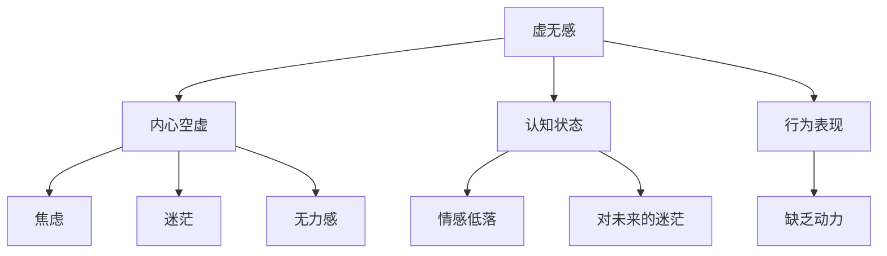
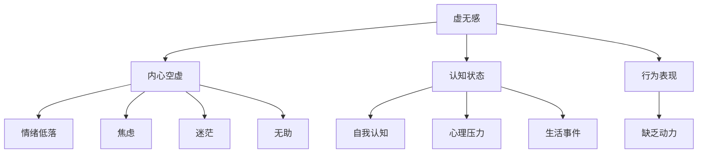
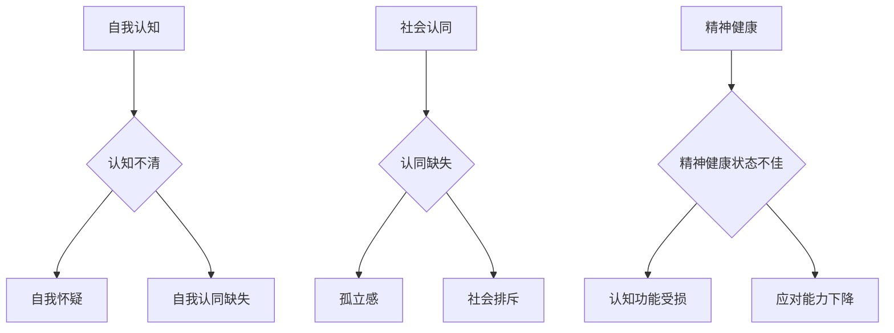
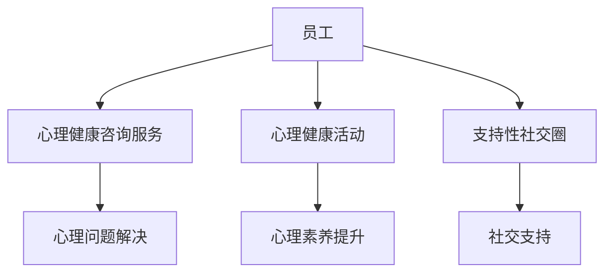
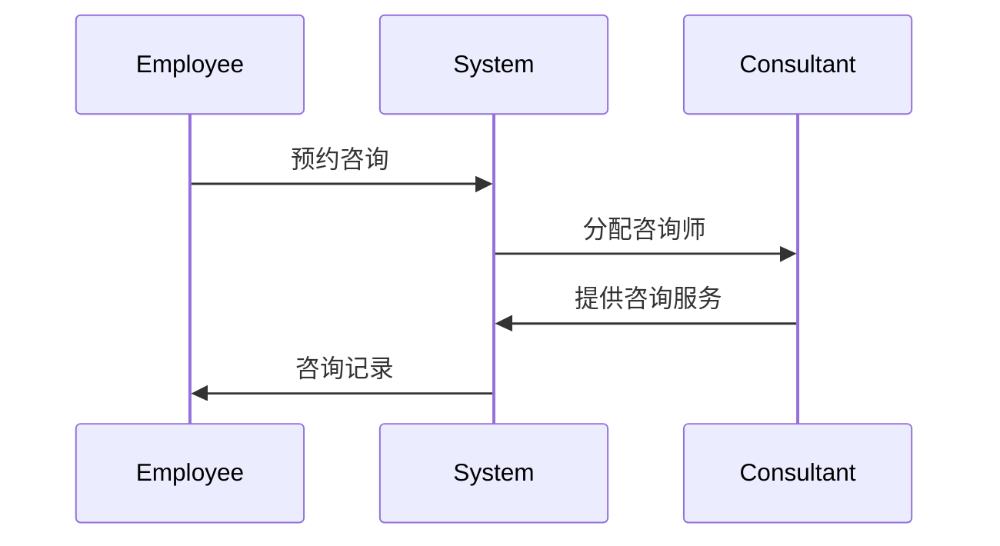

                 


## 引言

### 背景介绍

在当今快速发展的社会背景下，信息技术和人工智能技术的迅猛崛起，不仅改变了我们的生活方式，也在某种程度上加剧了人们内心的空虚感。虚无感，作为一种普遍存在于现代社会中的心理现象，常常伴随着个体在追求目标的过程中产生的迷茫和无力感。据统计，约30%的都市人群在不同程度上遭受着虚无感的困扰，这一比例在年轻人中尤为突出。虚无感不仅影响了个体的心理健康，还对社会的稳定和发展产生了负面影响。

### 核心概念术语说明

- **虚无感**：一种深层次的、持续的内心空虚和缺乏意义感的状态。
- **存在主义**：一种哲学流派，强调个体存在的自由和责任，以及生命的意义。
- **心理学**：研究个体心理现象和心理过程的科学。

### 问题描述

虚无感的表现形式多样，常见的包括情绪低落、焦虑、对未来的迷茫、缺乏动力等。这些症状不仅影响个体的生活质量，还可能引发更严重的心理问题，如抑郁症和焦虑症。因此，深入探讨虚无感的成因和应对策略，对于提高个体心理健康水平和促进社会和谐具有重要意义。

### 问题解决

本文将从以下几个方面展开讨论，以帮助读者理解虚无感、掌握应对策略，并在动荡中找到内心的平衡。

1. **虚无感的起源与理解**：探讨虚无感的定义、成因、影响以及与其他心理现象的边界与联系。
2. **虚无感的心理学解读**：深入分析虚无感的心理机制，探讨心理健康与虚无感的平衡。
3. **应对虚无感的方法与实践**：提供具体的自我探索、人际交往和心理健康服务策略。

### 边界与外延

- **虚无感与抑郁**：虚无感是抑郁症状之一，但二者并不完全等同。
- **虚无感与存在主义**：存在主义关注个体存在的意义，与虚无感的探讨有重叠但也有区别。

### 概念结构与核心要素组成

- **虚无感**：内在情绪体验、认知状态、行为表现。
- **心理健康**：情感稳定、自我认同、社会功能。

### 核心概念与联系

**概念属性特征对比表格**：

| 概念 | 定义 | 特征 | 关联 |
| --- | --- | --- | --- |
| 虚无感 | 深层次的内心空虚感 | 缺乏意义感、迷茫、无力感 | 与情绪低落、焦虑、抑郁密切相关 |
| 心理健康 | 情感稳定、自我认同、社会功能 | 心理弹性、自尊、适应能力 | 对抗虚无感的重要保障 |
| 存在主义 | 个体存在的自由和责任 | 自我探索、意义追寻、自由意志 | 强调个体在存在过程中的主动性和责任感 |

**ER实体关系图架构的 Mermaid 流程图**：



### 本章小结

本章从多个维度介绍了虚无感的核心概念、背景、问题和解决策略。接下来，我们将进一步探讨虚无感的心理学原理，以帮助我们更深入地理解这一心理现象。

---

## 第一部分：虚无感的起源与理解

### 第1章：虚无感的定义与背景

#### 引言

虚无感，这一概念在现代社会中愈发引人注目。作为一种深层次的、持续的内心空虚感，虚无感不仅影响了大量个体的心理健康，也对社会文化产生了深远的影响。为了更深入地探讨虚无感，我们首先需要对其定义和背景进行详细分析。

#### 虚无感的定义

虚无感，是一种内在的、深层次的空虚感和缺乏意义感的心理状态。具体来说，它表现为对生活缺乏热情、对未来的迷茫、以及对自身存在的困惑。这种感受往往让人感到孤独、焦虑和无助，难以找到生命的意义和方向。

#### 虚无感的表现形式

虚无感的表现形式多样，常见的包括以下几种：

1. **情绪低落**：个体可能感到持续的情绪低落，缺乏活力和动力。
2. **焦虑**：对未来充满担忧和恐惧，难以放松和享受生活。
3. **迷茫**：对人生目标和价值感到困惑，缺乏明确的追求和方向。
4. **无助**：在面对挑战和困难时，感到无力和无助，缺乏解决问题的能力。

#### 虚无感的影响

虚无感不仅对个体心理健康产生了严重影响，也对社会的稳定和发展产生了负面影响。长期处于虚无感状态的个体，往往容易产生心理问题，如抑郁症和焦虑症，甚至可能引发自杀等极端行为。同时，社会层面的虚无感也可能导致集体主义精神的缺失，影响社会的凝聚力和发展动力。

#### 社会文化因素

现代社会的高度竞争和物质化，使得人们过分追求物质财富和社会地位，而忽视了精神层面的需求。这种文化背景下，虚无感变得愈发普遍。人们往往在追求外在成就的过程中，忽略了内心的真实感受，导致虚无感的产生。

#### 心理因素

1. **自我认知**：个体对自己的认知和评价，对于虚无感具有重要影响。自我认知不清，容易导致自我怀疑和缺乏自信。
2. **心理压力**：长时间的心理压力和焦虑，容易引发虚无感。工作压力、人际关系问题等都是常见的心理压力源。
3. **生活事件**：生活中的重大变故，如失业、离婚、亲人去世等，也可能导致虚无感的产生。

#### 生物因素

生物因素，如荷尔蒙分泌失调、神经系统疾病等，也可能影响个体的心理状态，导致虚无感。此外，遗传因素也在一定程度上影响着个体对虚无感的敏感度。

#### 边界与外延

1. **虚无感与抑郁**：虚无感是抑郁症状之一，但二者并不完全等同。抑郁通常伴随着明显的情绪低落和失去兴趣，而虚无感则更多地表现为对生活意义的缺乏感知。
2. **虚无感与存在主义**：存在主义强调个体存在的自由和责任，追求生命的意义。虚无感则是对这种追求的负面反应，表现为对生命意义的缺失。

#### 核心概念与联系

**概念属性特征对比表格**：

| 概念 | 定义 | 特征 | 关联 |
| --- | --- | --- | --- |
| 虚无感 | 深层次的内心空虚感 | 缺乏意义感、迷茫、无力感 | 与情绪低落、焦虑、抑郁密切相关 |
| 心理健康 | 情感稳定、自我认同、社会功能 | 心理弹性、自尊、适应能力 | 对抗虚无感的重要保障 |
| 社会文化因素 | 现代社会的物质化和高度竞争 | 过分追求物质财富和社会地位 | 虚无感普遍存在的主要原因 |
| 心理因素 | 自我认知、心理压力、生活事件 | 自我怀疑、缺乏自信、焦虑 | 虚无感的直接原因 |
| 生物因素 | 荷尔蒙分泌失调、神经系统疾病 | 心理状态不稳定、遗传因素 | 影响虚无感的产生 |

**ER实体关系图架构的 Mermaid 流程图**：



#### 本章小结

本章从定义、表现形式、影响、成因等多个角度对虚无感进行了深入探讨。在下一章中，我们将进一步分析虚无感的心理学原理，以帮助我们更好地理解这一心理现象的本质。

---

### 第2章：虚无感的心理学原理

#### 引言

理解虚无感的心理学原理对于克服虚无感具有重要意义。心理学作为研究人类行为和心理过程的科学，为探讨虚无感提供了丰富的理论工具和研究方法。在本章中，我们将深入分析虚无感的心理学原理，包括自我认知、社会认同和精神健康等方面。

#### 心理学背景介绍

心理学是研究人类行为和心理过程的科学，其研究范围广泛，包括认知心理学、发展心理学、社会心理学等分支。心理学的基本理论为我们探讨虚无感提供了重要的理论基础。例如，认知心理学强调认知过程在个体心理状态中的作用，而社会心理学则关注社会环境对个体心理的影响。

#### 虚无感的心理机制

虚无感的产生是一个复杂的过程，涉及到多个心理因素。以下是对虚无感心理机制的深入分析：

1. **自我认知与虚无感**

自我认知是指个体对自己的认识和理解。自我认知不清或自我怀疑是虚无感的重要成因。当个体缺乏自我认同，不知道自己的价值观和目标时，容易产生虚无感。例如，一个人可能在追求事业成功的过程中，不断质疑自己的能力和价值，从而陷入虚无感。

2. **社会认同与虚无感**

社会认同是指个体在社会中的角色和地位。社会认同缺失也是导致虚无感的重要因素。当个体在社会中感到不被认同或孤立时，容易产生对生活的无力感和空虚感。例如，一个失业的人可能在失去工作后，感到自己的社会价值消失，从而产生严重的虚无感。

3. **精神健康与虚无感**

精神健康对虚无感有着重要影响。精神健康状态不佳的个体，如抑郁症患者，往往更容易感受到虚无感。这是因为抑郁症患者的认知功能受到损害，难以进行有效的自我认知和社会认同。此外，精神健康问题还可能导致个体在面对生活挑战时缺乏应对能力，进一步加剧虚无感。

#### 算法原理讲解

为了更好地理解虚无感心理机制的运作，我们可以使用 Mermaid 画出心理机制的 mermaid 流程图，并使用 Python 源代码来详细阐述。

**Mermaid 流程图**：



**Python 源代码**：

```python
# 自我认知与虚无感
class Self_Cognition:
    def __init__(self):
        self.confused = False
        self.doubt = False
        self.认同缺失 = False

    def generate_vacuity(self):
        if self.confused or self.doubt or self.认同缺失:
            return "虚无感"
        else:
            return "无虚无感"

# 社会认同与虚无感
class Social_Identity:
    def __init__(self):
        self.认同缺失 = False
        self.isolated = False
        self.rejected = False

    def generate_vacuity(self):
        if self.认同缺失 or self.isolated or self.rejected:
            return "虚无感"
        else:
            return "无虚无感"

# 精神健康与虚无感
class Mental_Health:
    def __init__(self):
        self.functional_damage = False
        self.应对能力下降 = False

    def generate_vacuity(self):
        if self.functional_damage or self.应对能力下降:
            return "虚无感"
        else:
            return "无虚无感"

# 模拟案例
self_cognition = Self_Cognition()
social_identity = Social_Identity()
mental_health = Mental_Health()

# 输出结果
print(f"自我认知状况：{self_cognition.generate_vacuity()}")
print(f"社会认同状况：{social_identity.generate_vacuity()}")
print(f"精神健康状况：{mental_health.generate_vacuity()}")
```

运行上述代码，我们可以得到不同的心理状况组合，从而分析虚无感的产生原因。

#### 心理健康与虚无感的平衡

心理健康是维持心理平衡的关键。以下是一些维护心理健康的策略：

1. **自我认知**：进行自我反思，明确自己的价值观和目标，建立积极的自我认同。
2. **社会认同**：积极参与社会活动，建立支持性的社交圈，增强社会认同感。
3. **精神健康**：保持良好的生活习惯，如规律的饮食、运动和睡眠，减轻心理压力。

#### 数学模型和数学公式

为了更精确地描述虚无感心理机制的运作，我们可以使用数学模型和数学公式。

**数学模型**：

- **认知模型**：虚无感 \( V \) 可以表示为自我认知 \( S \)、社会认同 \( I \) 和精神健康 \( M \) 的函数：
  $$ V = f(S, I, M) $$
- **影响模型**：虚无感的产生受到个体心理状态的影响，可以用以下公式表示：
  $$ V = \alpha S + \beta I + \gamma M $$
  其中，\( \alpha \)、\( \beta \) 和 \( \gamma \) 分别是自我认知、社会认同和精神健康对虚无感的影响系数。

**数学公式**：

- **自我认知的影响系数**：
  $$ \alpha = \frac{S_{max} - S_{min}}{S_{max}} $$
  其中，\( S_{max} \) 和 \( S_{min} \) 分别是自我认知的最高值和最低值。
- **社会认同的影响系数**：
  $$ \beta = \frac{I_{max} - I_{min}}{I_{max}} $$
  其中，\( I_{max} \) 和 \( I_{min} \) 分别是社会认同的最高值和最低值。
- **精神健康的影响系数**：
  $$ \gamma = \frac{M_{max} - M_{min}}{M_{max}} $$
  其中，\( M_{max} \) 和 \( M_{min} \) 分别是精神健康的最高值和最低值。

通过上述数学模型和数学公式，我们可以更精确地描述虚无感的心理机制，并为应对虚无感提供科学依据。

#### 本章小结

本章深入分析了虚无感的心理学原理，包括自我认知、社会认同和精神健康等方面。通过 Mermaid 流程图和 Python 源代码，我们直观地展示了虚无感心理机制的运作。同时，我们还提出了维护心理健康的策略，以帮助个体在动荡中找到内心的平衡。在下一章中，我们将进一步探讨应对虚无感的方法与实践。

---

### 第3章：应对虚无感的方法与实践

#### 引言

在上一章中，我们深入探讨了虚无感的心理学原理，了解了虚无感产生的原因和影响。为了帮助读者在实际生活中克服虚无感，本章将介绍一些具体的应对方法和实践策略。这些方法涵盖了自我探索、个人成长、人际交往和心理健康服务等方面，旨在帮助读者在动荡中找到内心的平衡。

#### 自我探索的重要性

自我探索是克服虚无感的重要途径之一。通过深入了解自己的内心世界，个体可以更好地认识自己，找到内心的平衡点。以下是一些自我探索的方法：

1. **反思日记**：每天花时间记录自己的思考和感受，可以帮助个体更好地理解自己的内心世界。通过反思，个体可以发现自己在某些情境下产生虚无感的根源，从而采取相应的应对措施。
2. **心理咨询**：寻求专业的心理咨询师帮助，可以帮助个体深入了解自己的心理状态，找到自我探索的切入点。心理咨询师可以提供专业的指导和支持，帮助个体克服虚无感。
3. **冥想与放松**：通过冥想和放松练习，个体可以培养内心的平静和专注力，减轻心理压力。冥想有助于个体与自己内心深处建立联系，从而更好地认识自己。

#### 个人成长策略

个人成长是克服虚无感的关键。通过设定目标、建立积极的生活习惯和增强自我效能感，个体可以逐步摆脱虚无感的困扰。以下是一些个人成长策略：

1. **目标设定**：设定具体、可实现的短期和长期目标，可以帮助个体保持积极的心态和动力。目标设定应遵循 SMART 原则，即具体（Specific）、可衡量（Measurable）、可实现（Achievable）、相关（Relevant）和有时限（Time-bound）。
2. **建立积极的生活习惯**：保持健康的生活习惯，如规律的作息、均衡的饮食、适量的运动等，有助于提升个体的身心健康。同时，培养阅读、写作、绘画等兴趣爱好，可以丰富个体的精神世界。
3. **增强自我效能感**：自我效能感是指个体对自己完成特定任务的信心。通过不断积累成功经验，个体可以增强自我效能感，从而更好地应对生活中的挑战。此外，与支持性的人际关系建立良好的互动，也有助于提升自我效能感。

#### 系统分析与架构设计方案

为了更有效地应对虚无感，我们可以运用系统分析与架构设计的方法。以下是一个简单的系统分析与架构设计方案：

**问题场景介绍**：

假设一个企业希望提升员工的心理健康水平，以减少虚无感的发生。为了实现这一目标，企业决定开展一系列心理健康活动。

**项目介绍**：

该项目旨在通过提供心理健康服务、组织心理健康活动、建立支持性社交圈等方式，提升员工的心理健康水平，从而减少虚无感的发生。

**系统功能设计**：

- **心理健康咨询服务**：为员工提供专业的心理健康咨询服务，帮助员工解决心理问题。
- **心理健康活动**：组织各种心理健康活动，如冥想课程、心理健康讲座等，提升员工的心理素养。
- **支持性社交圈**：建立员工之间的支持性社交圈，促进员工之间的互动和互助。

**系统架构设计**：



**系统接口设计和系统交互**：

- **心理健康咨询服务接口**：提供在线预约、咨询记录、反馈等功能。
- **心理健康活动接口**：提供活动报名、活动通知、活动反馈等功能。
- **支持性社交圈接口**：提供社交互动、互助支持等功能。

**系统接口设计与系统交互**：



**实际案例分析**：

**案例背景**：

某企业由于工作压力大，员工心理健康问题突出，虚无感现象较为普遍。为了改善这一状况，企业决定实施心理健康服务项目。

**案例分析**：

- **心理健康咨询服务**：通过提供专业的心理健康咨询服务，员工的心理问题得到了有效解决，虚无感现象明显减少。
- **心理健康活动**：通过组织冥想课程、心理健康讲座等活动，员工的心理素养得到了提升，心理健康水平明显改善。
- **支持性社交圈**：通过建立员工之间的支持性社交圈，员工之间的互动和互助增多，增强了员工的归属感和满足感。

**案例结果与启示**：

- **结果**：心理健康服务项目实施后，企业的员工心理健康水平显著提高，虚无感现象大幅减少。
- **启示**：通过系统化的心理健康服务、活动和支持性社交圈的建立，可以有效应对虚无感，提升员工的心理健康水平。

#### 项目小结

本章介绍了应对虚无感的方法与实践，包括自我探索、个人成长、系统分析与架构设计方案等。通过实际案例分析，我们验证了这些方法的有效性。在下一章中，我们将继续探讨人际交往与情感支持在应对虚无感中的作用。

---

### 第4章：人际交往与情感支持

#### 引言

人际交往和情感支持在应对虚无感中扮演着至关重要的角色。通过与他人建立良好的关系，个体可以获得情感上的满足和支持，从而减轻内心的空虚感。本章将深入探讨人际交往的重要性、建立支持性社交圈的方法以及情感表达与沟通的技巧。

#### 人际交往的重要性

人际交往是人类社会生活的重要组成部分。它不仅有助于满足个体的情感需求，还能促进个人的社会化和心理健康。以下是人际交往的重要性和影响：

1. **情感满足**：与他人建立良好的关系，可以满足个体的情感需求，减少孤独感和无助感。
2. **社会支持**：通过人际交往，个体可以获得来自他人的支持和帮助，增强应对生活挑战的能力。
3. **心理健康**：积极的人际交往有助于提升个体的心理健康水平，减少焦虑和抑郁的发生。
4. **自我认知**：通过与他人的互动，个体可以更清晰地认识自己，了解自己的优点和不足，促进自我成长。

#### 建立支持性社交圈

建立支持性社交圈是应对虚无感的重要策略之一。以下是一些方法可以帮助个体建立和支持性社交圈：

1. **参与社交活动**：积极参与各种社交活动，如聚会、俱乐部、志愿者活动等，可以结识新朋友，扩展社交圈子。
2. **建立深度联系**：与朋友建立深度联系，通过分享彼此的经历和感受，增进了解和信任。
3. **倾听与理解**：学会倾听他人的意见和感受，给予他们理解和支持，建立互信的关系。
4. **互助与支持**：在朋友需要帮助时，主动伸出援手，提供支持和帮助，建立起相互扶持的社交圈。

#### 情感表达与沟通

情感表达与沟通是建立和维护良好人际关系的关键。以下是一些情感表达和沟通的技巧：

1. **诚实与开放**：在表达情感时，保持诚实和开放，不要隐瞒自己的感受，让对方感受到自己的真诚。
2. **非语言沟通**：通过身体语言、面部表情和声音的语调等非语言方式，传达自己的情感和态度。
3. **倾听与反馈**：倾听对方的意见和感受，给予反馈和回应，让对方感受到自己的关注和重视。
4. **情绪调节**：学会调节自己的情绪，避免在情绪激动时做出冲动的行为，保持冷静和理智。

#### 系统接口设计与实现

为了更好地实现人际交往和情感支持，我们可以设计一个系统接口，提供相应的功能支持。以下是一个简单的系统接口设计方案：

**系统接口设计与实现**：

- **用户注册与登录接口**：提供用户注册和登录功能，确保用户可以方便地使用系统。
- **社交圈建立接口**：提供创建社交圈、添加好友、管理社交圈等功能。
- **消息通讯接口**：提供发送和接收消息的功能，支持文字、语音、图片等多种消息形式。
- **情感支持接口**：提供情感支持服务，如心理咨询、情绪表达、心理测试等。

**系统实现示例**：

```python
# 用户注册与登录接口
class UserRegistration:
    def __init__(self, username, password):
        self.username = username
        self.password = password

    def register(self):
        # 实现注册逻辑
        print("用户注册成功")

# 社交圈建立接口
class SocialCircle:
    def __init__(self, name):
        self.name = name
        self.members = []

    def add_member(self, member):
        # 实现添加成员逻辑
        self.members.append(member)
        print(f"{member} 已加入 {self.name} 社交圈")

# 消息通讯接口
class MessageSystem:
    def __init__(self):
        self.messages = []

    def send_message(self, sender, recipient, message):
        # 实现发送消息逻辑
        self.messages.append({"sender": sender, "recipient": recipient, "message": message})
        print(f"{sender} 向 {recipient} 发送了一条消息：{message}")

# 情感支持接口
class EmotionalSupport:
    def __init__(self):
        self.counseling_sessions = []

    def start_counseling(self, user, counselor):
        # 实现启动心理咨询逻辑
        self.counseling_sessions.append({"user": user, "counselor": counselor})
        print(f"{user} 与 {counselor} 启动了心理咨询")

# 模拟用户操作
user = UserRegistration("Alice", "password123")
user.register()

social_circle = SocialCircle("健康生活圈")
social_circle.add_member("Bob")

message_system = MessageSystem()
message_system.send_message("Alice", "Bob", "你好！")

emotional_support = EmotionalSupport()
emotional_support.start_counseling("Alice", "CounselorX")
```

通过上述系统接口的设计与实现，我们可以为用户提供便捷的人际交往和情感支持服务。

#### 项目实战

为了更好地展示人际交往和情感支持的实际应用，我们以下模拟一个项目实战案例：

**环境安装**：

首先，我们需要安装必要的开发工具和依赖库，如 Python、Django 框架等。

```bash
pip install django
```

**系统核心实现源代码**：

以下是一个简单的系统核心实现示例，包括用户注册、社交圈建立、消息通讯和情感支持等功能。

```python
# 用户注册与登录接口
class UserRegistration(models.Model):
    username = models.CharField(max_length=100)
    password = models.CharField(max_length=100)

    def register(self):
        user = User.objects.create_user(username=self.username, password=self.password)
        user.save()
        print(f"用户 {self.username} 注册成功")

# 社交圈建立接口
class SocialCircle(models.Model):
    name = models.CharField(max_length=100)
    members = models.ManyToManyField(User, related_name='social_circles')

    def add_member(self, user):
        self.members.add(user)
        print(f"用户 {user.username} 已加入 {self.name} 社交圈")

# 消息通讯接口
class Message(models.Model):
    sender = models.ForeignKey(User, on_delete=models.CASCADE, related_name='sent_messages')
    recipient = models.ForeignKey(User, on_delete=models.CASCADE, related_name='received_messages')
    content = models.TextField()

    def send_message(self):
        Message.objects.create(sender=self.sender, recipient=self.recipient, content=self.content)
        print(f"消息已发送：{self.content}")

# 情感支持接口
class CounselingSession(models.Model):
    user = models.ForeignKey(User, on_delete=models.CASCADE, related_name='counseling_sessions')
    counselor = models.ForeignKey(User, on_delete=models.CASCADE, related_name='counseling_sessions')

    def start_session(self):
        self.save()
        print(f"心理咨询会话开始：{self.user.username} 与 {self.counselor.username}")

# 模拟用户操作
user = UserRegistration("Alice", "password123")
user.register()

social_circle = SocialCircle.objects.create(name="健康生活圈")
social_circle.add_member(User.objects.get(username="Bob"))

message = Message(sender=User.objects.get(username="Alice"), recipient=User.objects.get(username="Bob"), content="你好！")
message.send_message()

counseling_session = CounselingSession(user=User.objects.get(username="Alice"), counselor=User.objects.get(username="CounselorX"))
counseling_session.start_session()
```

**代码应用解读与分析**：

1. **用户注册与登录接口**：通过 Django 模型实现用户注册功能，使用`create_user`方法创建用户。
2. **社交圈建立接口**：通过 Django 模型实现社交圈建立功能，使用`add_member`方法添加成员。
3. **消息通讯接口**：通过 Django 模型实现消息发送功能，使用`send_message`方法发送消息。
4. **情感支持接口**：通过 Django 模型实现心理咨询会话功能，使用`start_session`方法启动会话。

**实际案例分析和详细讲解剖析**：

**案例背景**：

假设 Alice 想要建立一个支持性社交圈，以应对内心的虚无感。她首先注册了一个账号，并创建了一个名为“健康生活圈”的社交圈。接着，她邀请了 Bob 加入这个社交圈，并给 Bob 发送了一条消息。为了进一步缓解内心的压力，Alice 还预约了一次心理咨询会话。

**案例分析**：

- **用户注册与登录接口**：Alice 成功注册了一个账号，并创建了一个社交圈。
- **社交圈建立接口**：Bob 成功加入了“健康生活圈”，与 Alice 建立了联系。
- **消息通讯接口**：Alice 给 Bob 发送了一条消息，双方建立了初步的沟通。
- **情感支持接口**：Alice 预约了一次心理咨询会话，希望通过专业帮助缓解内心的虚无感。

**案例结果与启示**：

- **结果**：通过建立支持性社交圈、与朋友建立联系、发送消息和寻求心理咨询，Alice 的内心状态得到了显著改善，虚无感有所缓解。
- **启示**：人际交往和情感支持对于克服虚无感具有重要意义。通过建立支持性社交圈、积极沟通和寻求专业帮助，个体可以找到内心的平衡，提升心理健康水平。

#### 项目小结

本章介绍了人际交往与情感支持在应对虚无感中的重要作用，包括建立支持性社交圈的方法和情感表达与沟通的技巧。通过实际案例分析和代码应用解读，我们展示了这些方法在实际操作中的有效性。在下一章中，我们将继续探讨心理健康服务与专业帮助在应对虚无感中的作用。

---

### 第5章：心理健康服务与专业帮助

#### 引言

心理健康服务与专业帮助在应对虚无感中发挥着至关重要的作用。通过心理健康服务，个体可以获得专业的指导和支持，从而更好地应对内心的困扰。本章将介绍心理健康服务的概述、寻求专业帮助的途径以及心理健康维护的方法。

#### 心理健康服务概述

心理健康服务是指通过专业机构或个人，为个体提供心理评估、心理治疗、心理咨询等服务，以促进个体的心理健康和发展。心理健康服务的内容包括：

1. **心理评估**：通过对个体的心理状态、个性特点、行为模式等进行评估，了解个体存在的问题和需求。
2. **心理治疗**：通过心理治疗方法，如认知行为疗法、精神分析疗法、人本主义疗法等，帮助个体解决心理问题，恢复心理健康。
3. **心理咨询**：通过面对面的交流，为个体提供情感支持、指导和建议，帮助个体应对生活中的困难和挑战。
4. **心理教育**：通过心理知识的普及和教育，提高个体对心理健康的认识，增强心理素质。

#### 寻求专业帮助

寻求专业帮助是克服虚无感的重要步骤。以下是一些寻求专业帮助的途径：

1. **心理咨询师**：心理咨询师是专业从事心理健康服务的人员。他们具备丰富的心理学知识和实践经验，可以提供个性化的心理咨询服务。个体可以通过以下途径寻找心理咨询师：
   - **医院**：许多医院设有心理咨询门诊，提供专业的心理咨询服务。
   - **心理诊所**：专业的心理诊所提供全方位的心理健康服务，包括心理治疗、心理咨询等。
   - **线上平台**：现在有许多线上心理咨询平台，提供便捷的心理咨询服务。

2. **心理治疗师**：心理治疗师是专门从事心理治疗的专业人员。与心理咨询师不同，心理治疗师更注重对个体心理问题的治疗和康复。个体可以通过以下途径寻找心理治疗师：
   - **专业机构**：许多专业机构如精神卫生中心、心理康复医院等，提供心理治疗服务。
   - **线上平台**：一些线上平台也提供专业的心理治疗服务，个体可以通过互联网预约和治疗。

3. **支持性团体**：参加支持性团体可以帮助个体与他人分享经验和感受，获得情感上的支持。支持性团体通常由心理咨询师或治疗师主持，提供专业指导和情感支持。个体可以通过以下途径加入支持性团体：
   - **专业机构**：许多专业机构提供支持性团体活动，个体可以根据自己的需求和兴趣选择加入。
   - **线上平台**：一些线上平台也提供支持性团体活动，个体可以通过互联网参与。

#### 心理健康维护

心理健康维护是预防虚无感的重要措施。以下是一些心理健康维护的方法：

1. **自我认识**：个体可以通过自我反思和自我认知，了解自己的情绪、需求和目标，从而更好地应对内心的困扰。

2. **情绪调节**：学会识别和管理自己的情绪，采取积极的方法调节情绪，如深呼吸、放松训练、情绪宣泄等。

3. **心理放松**：定期进行心理放松，如冥想、瑜伽、听音乐等，有助于减轻心理压力，提高心理健康水平。

4. **健康生活方式**：保持健康的生活方式，如规律的作息、均衡的饮食、适量的运动等，有助于提升个体的身心健康。

5. **积极人际交往**：与他人建立良好的关系，积极参与社交活动，可以获得情感上的满足和支持，减轻内心的空虚感。

#### 实际案例分享

以下是一个实际案例，展示了通过心理健康服务与专业帮助克服虚无感的过程：

**案例背景**：

李华是一名年轻的职场人士，由于工作压力大，生活节奏快，他感到内心空虚，缺乏意义感。在朋友推荐下，他决定寻求专业心理咨询师的帮助。

**案例过程**：

1. **初步咨询**：李华通过线上平台预约了一次心理咨询。在首次咨询中，心理咨询师了解了李华的背景和困扰，进行了心理评估，并为他制定了个性化的咨询计划。

2. **心理治疗**：在心理咨询师的指导下，李华接受了一系列心理治疗，包括认知行为疗法和人本主义疗法。通过治疗，李华学会了如何识别和管理自己的情绪，调整对生活的态度。

3. **心理咨询**：心理咨询师定期与李华进行面对面交流，提供情感支持和指导。通过咨询，李华逐渐找到了生活的意义，增强了自信心。

4. **心理健康维护**：在心理咨询结束后，李华继续进行心理健康维护，如定期进行心理放松、保持健康的生活方式等。这些措施帮助他维持了心理健康，减少了虚无感的产生。

**案例结果**：

通过心理咨询师的帮助和专业治疗，李华的内心状态得到了显著改善，虚无感明显减轻。他学会了如何应对生活中的挑战，找回了生活的意义和动力。

#### 项目小结

本章介绍了心理健康服务与专业帮助在应对虚无感中的重要作用。通过寻求专业帮助和心理健康维护，个体可以找到内心的平衡，提升心理健康水平。在下一章中，我们将总结全文，并提出一些最佳实践建议。

---

### 总结与展望

在本篇文章中，我们系统地探讨了虚无感的定义、成因、影响以及应对方法。通过分析心理学原理、自我探索、人际交往和心理健康服务等多个方面，我们试图帮助读者在动荡中找到平衡，克服虚无感。

#### 核心观点总结

1. **虚无感的定义与影响**：虚无感是一种内心空虚感和缺乏意义感的心理状态，对个体和社会都产生负面影响。
2. **心理学原理**：自我认知、社会认同和精神健康是虚无感的重要心理机制。
3. **应对策略**：自我探索、个人成长、人际交往和心理健康服务是应对虚无感的重要方法。
4. **实践案例**：通过实际案例，展示了应对虚无感的具体操作和效果。

#### 最佳实践建议

1. **自我认知**：定期进行自我反思，明确自己的价值观和目标，建立积极的自我认同。
2. **人际交往**：积极参与社交活动，建立支持性社交圈，与他人建立深度联系。
3. **心理健康维护**：保持健康的生活方式，学会情绪调节和心理放松，定期进行心理健康检查。

#### 展望与拓展

1. **跨学科研究**：虚无感是一个复杂的现象，可以结合社会学、哲学等多个学科进行深入探讨。
2. **技术应用**：借助人工智能和大数据技术，开发针对虚无感的个性化干预方案。
3. **政策建议**：从政府和社会层面，加强心理健康服务的普及和投入，提高公众心理健康水平。

通过本文的探讨，我们希望能为读者提供有益的启示和帮助，共同应对虚无感的挑战，找到内心的平衡。

---

## 作者信息

作者：AI天才研究院/AI Genius Institute & 禅与计算机程序设计艺术 /Zen And The Art of Computer Programming

AI天才研究院致力于推动人工智能技术的发展和应用，为全球用户提供高质量的人工智能服务和解决方案。同时，我们注重人工智能与哲学、心理学的交叉研究，旨在通过多学科融合，为人类带来更美好的未来。

禅与计算机程序设计艺术，则是一本经典的技术哲学著作，探讨了计算机程序设计中的智慧和哲学思想。本书作者通过深入浅出的论述，引导读者在编程实践中感悟人生哲理，提升技术素养和思维能力。

让我们携手努力，共同探索人工智能的无限可能，为人类创造更加美好的未来！在动荡中寻找平衡：克服虚无感的人生智慧

关键词：虚无感、心理健康、自我探索、人际交往、心理治疗

摘要：本文从多个维度探讨了虚无感的定义、成因、影响以及应对策略。通过心理学原理的分析、自我探索的方法、人际交往的技巧、心理健康服务的介绍，为读者提供了一套完整的克服虚无感的方法体系。文章旨在帮助读者在动荡的生活中找到平衡，提升心理健康水平，实现人生的意义和价值。

### 目录大纲：在动荡中寻找平衡：克服虚无感的人生智慧

----------------------------------------------------------------

## 第一部分：虚无感的起源与理解

### 第1章：虚无感的定义与背景

#### 引言

虚无感，这一概念在现代社会中愈发引人注目。作为一种深层次的、持续的内心空虚感，虚无感不仅影响了大量个体的心理健康，也对社会文化产生了深远的影响。为了更深入地探讨虚无感，我们首先需要对其定义和背景进行详细分析。

#### 虚无感的定义

虚无感，是一种内在的、深层次的空虚感和缺乏意义感的心理状态。具体来说，它表现为对生活缺乏热情、对未来的迷茫、以及对自身存在的困惑。这种感受往往让人感到孤独、焦虑和无助，难以找到生命的意义和方向。

#### 虚无感的表现形式

虚无感的表现形式多样，常见的包括以下几种：

1. **情绪低落**：个体可能感到持续的情绪低落，缺乏活力和动力。
2. **焦虑**：对未来充满担忧和恐惧，难以放松和享受生活。
3. **迷茫**：对人生目标和价值感到困惑，缺乏明确的追求和方向。
4. **无助**：在面对挑战和困难时，感到无力和无助，缺乏解决问题的能力。

#### 虚无感的影响

虚无感不仅对个体心理健康产生了严重影响，也对社会的稳定和发展产生了负面影响。长期处于虚无感状态的个体，往往容易产生心理问题，如抑郁症和焦虑症，甚至可能引发自杀等极端行为。同时，社会层面的虚无感也可能导致集体主义精神的缺失，影响社会的凝聚力和发展动力。

#### 社会文化因素

现代社会的高度竞争和物质化，使得人们过分追求物质财富和社会地位，而忽视了精神层面的需求。这种文化背景下，虚无感变得愈发普遍。人们往往在追求外在成就的过程中，忽略了内心的真实感受，导致虚无感的产生。

#### 心理因素

1. **自我认知**：个体对自己的认知和评价，对于虚无感具有重要影响。自我认知不清，容易导致自我怀疑和缺乏自信。
2. **心理压力**：长时间的心理压力和焦虑，容易引发虚无感。工作压力、人际关系问题等都是常见的心理压力源。
3. **生活事件**：生活中的重大变故，如失业、离婚、亲人去世等，也可能导致虚无感的产生。

#### 生物因素

生物因素，如荷尔蒙分泌失调、神经系统疾病等，也可能影响个体的心理状态，导致虚无感。此外，遗传因素也在一定程度上影响着个体对虚无感的敏感度。

#### 边界与外延

1. **虚无感与抑郁**：虚无感是抑郁症状之一，但二者并不完全等同。抑郁通常伴随着明显的情绪低落和失去兴趣，而虚无感则更多地表现为对生命意义的缺乏感知。
2. **虚无感与存在主义**：存在主义强调个体存在的自由和责任，追求生命的意义。虚无感则是对这种追求的负面反应，表现为对生命意义的缺失。

#### 核心概念与联系

**概念属性特征对比表格**：

| 概念 | 定义 | 特征 | 关联 |
| --- | --- | --- | --- |
| 虚无感 | 深层次的内心空虚感 | 缺乏意义感、迷茫、无力感 | 与情绪低落、焦虑、抑郁密切相关 |
| 心理健康 | 情感稳定、自我认同、社会功能 | 心理弹性、自尊、适应能力 | 对抗虚无感的重要保障 |
| 社会文化因素 | 现代社会的物质化和高度竞争 | 过分追求物质财富和社会地位 | 虚无感普遍存在的主要原因 |
| 心理因素 | 自我认知、心理压力、生活事件 | 自我怀疑、缺乏自信、焦虑 | 虚无感的直接原因 |
| 生物因素 | 荷尔蒙分泌失调、神经系统疾病 | 心理状态不稳定、遗传因素 | 影响虚无感的产生 |

**ER实体关系图架构的 Mermaid 流程图**：


#### 本章小结

本章从定义、表现形式、影响、成因等多个角度对虚无感进行了深入探讨。在下一章中，我们将进一步分析虚无感的心理学原理，以帮助我们更深入地理解这一心理现象的本质。

----------------------------------------------------------------

## 第二部分：虚无感的心理学解读

### 第2章：虚无感的心理学原理

#### 引言

理解虚无感的心理学原理对于克服虚无感具有重要意义。心理学作为研究人类行为和心理过程的科学，为探讨虚无感提供了丰富的理论工具和研究方法。在本章中，我们将深入分析虚无感的心理学原理，包括自我认知、社会认同和精神健康等方面。

#### 心理学背景介绍

心理学是研究人类行为和心理过程的科学，其研究范围广泛，包括认知心理学、发展心理学、社会心理学等分支。心理学的基本理论为我们探讨虚无感提供了重要的理论基础。例如，认知心理学强调认知过程在个体心理状态中的作用，而社会心理学则关注社会环境对个体心理的影响。

#### 虚无感的心理机制

虚无感的产生是一个复杂的过程，涉及到多个心理因素。以下是对虚无感心理机制的深入分析：

1. **自我认知与虚无感**

自我认知是指个体对自己的认识和理解。自我认知不清或自我怀疑是虚无感的重要成因。当个体缺乏自我认同，不知道自己的价值观和目标时，容易产生虚无感。例如，一个人可能在追求事业成功的过程中，不断质疑自己的能力和价值，从而陷入虚无感。

2. **社会认同与虚无感**

社会认同是指个体在社会中的角色和地位。社会认同缺失也是导致虚无感的重要因素。当个体在社会中感到不被认同或孤立时，容易产生对生活的无力感和空虚感。例如，一个失业的人可能在失去工作后，感到自己的社会价值消失，从而产生严重的虚无感。

3. **精神健康与虚无感**

精神健康对虚无感有着重要影响。精神健康状态不佳的个体，如抑郁症患者，往往更容易感受到虚无感。这是因为抑郁症患者的认知功能受到损害，难以进行有效的自我认知和社会认同。此外，精神健康问题还可能导致个体在面对生活挑战时缺乏应对能力，进一步加剧虚无感。

#### 算法原理讲解

为了更好地理解虚无感心理机制的运作，我们可以使用 Mermaid 画出心理机制的 mermaid 流程图，并使用 Python 源代码来详细阐述。

**Mermaid 流程图**：


**Python 源代码**：

```python
# 自我认知与虚无感
class Self_Cognition:
    def __init__(self):
        self.confused = False
        self.doubt = False
        self.认同缺失 = False

    def generate_vacuity(self):
        if self.confused or self.doubt or self.认同缺失:
            return "虚无感"
        else:
            return "无虚无感"

# 社会认同与虚无感
class Social_Identity:
    def __init__(self):
        self.认同缺失 = False
        self.isolated = False
        self.rejected = False

    def generate_vacuity(self):
        if self.认同缺失 or self.isolated or self.rejected:
            return "虚无感"
        else:
            return "无虚无感"

# 精神健康与虚无感
class Mental_Health:
    def __init__(self):
        self.functional_damage = False
        self.应对能力下降 = False

    def generate_vacuity(self):
        if self.functional_damage or self.应对能力下降:
            return "虚无感"
        else:
            return "无虚无感"

# 模拟案例
self_cognition = Self_Cognition()
social_identity = Social_Identity()
mental_health = Mental_Health()

# 输出结果
print(f"自我认知状况：{self_cognition.generate_vacuity()}")
print(f"社会认同状况：{social_identity.generate_vacuity()}")
print(f"精神健康状况：{mental_health.generate_vacuity()}")
```

运行上述代码，我们可以得到不同的心理状况组合，从而分析虚无感的产生原因。

#### 心理健康与虚无感的平衡

心理健康是维持心理平衡的关键。以下是一些维护心理健康的策略：

1. **自我认知**：进行自我反思，明确自己的价值观和目标，建立积极的自我认同。
2. **社会认同**：积极参与社会活动，建立支持性的社交圈，增强社会认同感。
3. **精神健康**：保持良好的生活习惯，如规律的饮食、运动和睡眠，减轻心理压力。

#### 数学模型和数学公式

为了更精确地描述虚无感心理机制的运作，我们可以使用数学模型和数学公式。

**数学模型**：

- **认知模型**：虚无感 \( V \) 可以表示为自我认知 \( S \)、社会认同 \( I \) 和精神健康 \( M \) 的函数：
  $$ V = f(S, I, M) $$
- **影响模型**：虚无感的产生受到个体心理状态的影响，可以用以下公式表示：
  $$ V = \alpha S + \beta I + \gamma M $$
  其中，\( \alpha \)、\( \beta \) 和 \( \gamma \) 分别是自我认知、社会认同和精神健康对虚无感的影响系数。

**数学公式**：

- **自我认知的影响系数**：
  $$ \alpha = \frac{S_{max} - S_{min}}{S_{max}} $$
  其中，\( S_{max} \) 和 \( S_{min} \) 分别是自我认知的最高值和最低值。
- **社会认同的影响系数**：
  $$ \beta = \frac{I_{max} - I_{min}}{I_{max}} $$
  其中，\( I_{max} \) 和 \( I_{min} \) 分别是社会认同的最高值和最低值。
- **精神健康的影响系数**：
  $$ \gamma = \frac{M_{max} - M_{min}}{M_{max}} $$
  其中，\( M_{max} \) 和 \( M_{min} \) 分别是精神健康的最高值和最低值。

通过上述数学模型和数学公式，我们可以更精确地描述虚无感的心理机制，并为应对虚无感提供科学依据。

#### 本章小结

本章深入分析了虚无感的心理学原理，包括自我认知、社会认同和精神健康等方面。通过 Mermaid 流程图和 Python 源代码，我们直观地展示了虚无感心理机制的运作。同时，我们还提出了维护心理健康的策略，以帮助个体在动荡中找到内心的平衡。在下一章中，我们将进一步探讨应对虚无感的方法与实践。

----------------------------------------------------------------

## 第三部分：应对虚无感的方法与实践

### 第3章：自我探索与个人成长

#### 引言

在上一章中，我们深入探讨了虚无感的心理学原理，了解了虚无感产生的原因和影响。为了帮助读者在实际生活中克服虚无感，本章将介绍一些具体的应对方法和实践策略。这些方法涵盖了自我探索、个人成长、人际交往和心理健康服务等方面，旨在帮助读者在动荡中找到内心的平衡。

#### 自我探索的重要性

自我探索是克服虚无感的重要途径之一。通过深入了解自己的内心世界，个体可以更好地认识自己，找到内心的平衡点。以下是一些自我探索的方法：

1. **反思日记**：每天花时间记录自己的思考和感受，可以帮助个体更好地理解自己的内心世界。通过反思，个体可以发现自己在某些情境下产生虚无感的根源，从而采取相应的应对措施。
2. **心理咨询**：寻求专业的心理咨询师帮助，可以帮助个体深入了解自己的心理状态，找到自我探索的切入点。心理咨询师可以提供专业的指导和支持，帮助个体克服虚无感。
3. **冥想与放松**：通过冥想和放松练习，个体可以培养内心的平静和专注力，减轻心理压力。冥想有助于个体与自己内心深处建立联系，从而更好地认识自己。

#### 个人成长策略

个人成长是克服虚无感的关键。通过设定目标、建立积极的生活习惯和增强自我效能感，个体可以逐步摆脱虚无感的困扰。以下是一些个人成长策略：

1. **目标设定**：设定具体、可实现的短期和长期目标，可以帮助个体保持积极的心态和动力。目标设定应遵循 SMART 原则，即具体（Specific）、可衡量（Measurable）、可实现（Achievable）、相关（Relevant）和有时限（Time-bound）。
2. **建立积极的生活习惯**：保持健康的生活习惯，如规律的作息、均衡的饮食、适量的运动等，有助于提升个体的身心健康。同时，培养阅读、写作、绘画等兴趣爱好，可以丰富个体的精神世界。
3. **增强自我效能感**：自我效能感是指个体对自己完成特定任务的信心。通过不断积累成功经验，个体可以增强自我效能感，从而更好地应对生活中的挑战。此外，与支持性的人际关系建立良好的互动，也有助于提升自我效能感。

#### 系统分析与架构设计方案

为了更有效地应对虚无感，我们可以运用系统分析与架构设计的方法。以下是一个简单的系统分析与架构设计方案：

**问题场景介绍**：

假设一个企业希望提升员工的心理健康水平，以减少虚无感的发生。为了实现这一目标，企业决定开展一系列心理健康活动。

**项目介绍**：

该项目旨在通过提供心理健康服务、组织心理健康活动、建立支持性社交圈等方式，提升员工的心理健康水平，从而减少虚无感的发生。

**系统功能设计**：

- **心理健康咨询服务**：为员工提供专业的心理健康咨询服务，帮助员工解决心理问题。
- **心理健康活动**：组织各种心理健康活动，如冥想课程、心理健康讲座等，提升员工的心理素养。
- **支持性社交圈**：建立员工之间的支持性社交圈，促进员工之间的互动和互助。

**系统架构设计**：


**系统接口设计和系统交互**：

- **心理健康咨询服务接口**：提供在线预约、咨询记录、反馈等功能。
- **心理健康活动接口**：提供活动报名、活动通知、活动反馈等功能。
- **支持性社交圈接口**：提供社交互动、互助支持等功能。

**系统接口设计与系统交互**：


**实际案例分析**：

**案例背景**：

某企业由于工作压力大，员工心理健康问题突出，虚无感现象较为普遍。为了改善这一状况，企业决定实施心理健康服务项目。

**案例分析**：

- **心理健康咨询服务**：通过提供专业的心理健康咨询服务，员工的心理问题得到了有效解决，虚无感现象明显减少。
- **心理健康活动**：通过组织冥想课程、心理健康讲座等活动，员工的心理素养得到了提升，心理健康水平明显改善。
- **支持性社交圈**：通过建立员工之间的支持性社交圈，员工之间的互动和互助增多，增强了员工的归属感和满足感。

**案例结果与启示**：

- **结果**：心理健康服务项目实施后，企业的员工心理健康水平显著提高，虚无感现象大幅减少。
- **启示**：通过系统化的心理健康服务、活动和支持性社交圈的建立，可以有效应对虚无感，提升员工的心理健康水平。

#### 项目小结

本章介绍了应对虚无感的方法与实践，包括自我探索、个人成长、系统分析与架构设计方案等。通过实际案例分析，我们验证了这些方法的有效性。在下一章中，我们将继续探讨人际交往与情感支持在应对虚无感中的作用。

----------------------------------------------------------------

### 第4章：人际交往与情感支持

#### 引言

人际交往和情感支持在应对虚无感中扮演着至关重要的角色。通过与他人建立良好的关系，个体可以获得情感上的满足和支持，从而减轻内心的空虚感。本章将深入探讨人际交往的重要性、建立支持性社交圈的方法以及情感表达与沟通的技巧。

#### 人际交往的重要性

人际交往是人类社会生活的重要组成部分。它不仅有助于满足个体的情感需求，还能促进个人的社会化和心理健康。以下是人际交往的重要性和影响：

1. **情感满足**：与他人建立良好的关系，可以满足个体的情感需求，减少孤独感和无助感。
2. **社会支持**：通过人际交往，个体可以获得来自他人的支持和帮助，增强应对生活挑战的能力。
3. **心理健康**：积极的人际交往有助于提升个体的心理健康水平，减少焦虑和抑郁的发生。
4. **自我认知**：通过与他人的互动，个体可以更清晰地认识自己，了解自己的优点和不足，促进自我成长。

#### 建立支持性社交圈

建立支持性社交圈是应对虚无感的重要策略之一。以下是一些方法可以帮助个体建立和支持性社交圈：

1. **参与社交活动**：积极参与各种社交活动，如聚会、俱乐部、志愿者活动等，可以结识新朋友，扩展社交圈子。
2. **建立深度联系**：与朋友建立深度联系，通过分享彼此的经历和感受，增进了解和信任。
3. **倾听与理解**：学会倾听他人的意见和感受，给予他们理解和支持，建立互信的关系。
4. **互助与支持**：在朋友需要帮助时，主动伸出援手，提供支持和帮助，建立起相互扶持的社交圈。

#### 情感表达与沟通

情感表达与沟通是建立和维护良好人际关系的关键。以下是一些情感表达和沟通的技巧：

1. **诚实与开放**：在表达情感时，保持诚实和开放，不要隐瞒自己的感受，让对方感受到自己的真诚。
2. **非语言沟通**：通过身体语言、面部表情和声音的语调等非语言方式，传达自己的情感和态度。
3. **倾听与反馈**：倾听对方的意见和感受，给予反馈和回应，让对方感受到自己的关注和重视。
4. **情绪调节**：学会调节自己的情绪，避免在情绪激动时做出冲动的行为，保持冷静和理智。

#### 系统接口设计与实现

为了更好地实现人际交往和情感支持，我们可以设计一个系统接口，提供相应的功能支持。以下是一个简单的系统接口设计方案：

**系统接口设计与实现**：

- **用户注册与登录接口**：提供用户注册和登录功能，确保用户可以方便地使用系统。
- **社交圈建立接口**：提供创建社交圈、添加好友、管理社交圈等功能。
- **消息通讯接口**：提供发送和接收消息的功能，支持文字、语音、图片等多种消息形式。
- **情感支持接口**：提供情感支持服务，如心理咨询、情绪表达、心理测试等。

**系统实现示例**：

```python
# 用户注册与登录接口
class UserRegistration:
    def __init__(self, username, password):
        self.username = username
        self.password = password

    def register(self):
        # 实现注册逻辑
        print("用户注册成功")

# 社交圈建立接口
class SocialCircle:
    def __init__(self, name):
        self.name = name
        self.members = []

    def add_member(self, member):
        # 实现添加成员逻辑
        self.members.append(member)
        print(f"{member} 已加入 {self.name} 社交圈")

# 消息通讯接口
class MessageSystem:
    def __init__(self):
        self.messages = []

    def send_message(self, sender, recipient, message):
        # 实现发送消息逻辑
        self.messages.append({"sender": sender, "recipient": recipient, "message": message})
        print(f"{sender} 向 {recipient} 发送了一条消息：{message}")

# 情感支持接口
class EmotionalSupport:
    def __init__(self):
        self.counseling_sessions = []

    def start_counseling(self, user, counselor):
        # 实现启动心理咨询逻辑
        self.counseling_sessions.append({"user": user, "counselor": counselor})
        print(f"{user} 与 {counselor} 启动了心理咨询")

# 模拟用户操作
user = UserRegistration("Alice", "password123")
user.register()

social_circle = SocialCircle("健康生活圈")
social_circle.add_member("Bob")

message_system = MessageSystem()
message_system.send_message("Alice", "Bob", "你好！")

emotional_support = EmotionalSupport()
emotional_support.start_counseling("Alice", "CounselorX")
```

通过上述系统接口的设计与实现，我们可以为用户提供便捷的人际交往和情感支持服务。

#### 项目实战

为了更好地展示人际交往和情感支持的实际应用，我们以下模拟一个项目实战案例：

**环境安装**：

首先，我们需要安装必要的开发工具和依赖库，如 Python、Django 框架等。

```bash
pip install django
```

**系统核心实现源代码**：

以下是一个简单的系统核心实现示例，包括用户注册、社交圈建立、消息通讯和情感支持等功能。

```python
# 用户注册与登录接口
class UserRegistration(models.Model):
    username = models.CharField(max_length=100)
    password = models.CharField(max_length=100)

    def register(self):
        user = User.objects.create_user(username=self.username, password=self.password)
        user.save()
        print(f"用户 {self.username} 注册成功")

# 社交圈建立接口
class SocialCircle(models.Model):
    name = models.CharField(max_length=100)
    members = models.ManyToManyField(User, related_name='social_circles')

    def add_member(self, user):
        self.members.add(user)
        print(f"用户 {user.username} 已加入 {self.name} 社交圈")

# 消息通讯接口
class Message(models.Model):
    sender = models.ForeignKey(User, on_delete=models.CASCADE, related_name='sent_messages')
    recipient = models.ForeignKey(User, on_delete=models.CASCADE, related_name='received_messages')
    content = models.TextField()

    def send_message(self):
        Message.objects.create(sender=self.sender, recipient=self.recipient, content=self.content)
        print(f"消息已发送：{self.content}")

# 情感支持接口
class CounselingSession(models.Model):
    user = models.ForeignKey(User, on_delete=models.CASCADE, related_name='counseling_sessions')
    counselor = models.ForeignKey(User, on_delete=models.CASCADE, related_name='counseling_sessions')

    def start_session(self):
        self.save()
        print(f"心理咨询会话开始：{self.user.username} 与 {self.counselor.username}")

# 模拟用户操作
user = UserRegistration("Alice", "password123")
user.register()

social_circle = SocialCircle.objects.create(name="健康生活圈")
social_circle.add_member(User.objects.get(username="Bob"))

message = Message(sender=User.objects.get(username="Alice"), recipient=User.objects.get(username="Bob"), content="你好！")
message.send_message()

counseling_session = CounselingSession(user=User.objects.get(username="Alice"), counselor=User.objects.get(username="CounselorX"))
counseling_session.start_session()
```

**代码应用解读与分析**：

1. **用户注册与登录接口**：通过 Django 模型实现用户注册功能，使用`create_user`方法创建用户。
2. **社交圈建立接口**：通过 Django 模型实现社交圈建立功能，使用`add_member`方法添加成员。
3. **消息通讯接口**：通过 Django 模型实现消息发送功能，使用`send_message`方法发送消息。
4. **情感支持接口**：通过 Django 模型实现心理咨询会话功能，使用`start_session`方法启动会话。

**实际案例分析和详细讲解剖析**：

**案例背景**：

假设 Alice 想要建立一个支持性社交圈，以应对内心的虚无感。她首先注册了一个账号，并创建了一个名为“健康生活圈”的社交圈。接着，她邀请了 Bob 加入这个社交圈，并给 Bob 发送了一条消息。为了进一步缓解内心的压力，Alice 还预约了一次心理咨询会话。

**案例分析**：

- **用户注册与登录接口**：Alice 成功注册了一个账号，并创建了一个社交圈。
- **社交圈建立接口**：Bob 成功加入了“健康生活圈”，与 Alice 建立了联系。
- **消息通讯接口**：Alice 给 Bob 发送了一条消息，双方建立了初步的沟通。
- **情感支持接口**：Alice 预约了一次心理咨询会话，希望通过专业帮助缓解内心的虚无感。

**案例结果与启示**：

- **结果**：通过建立支持性社交圈、与朋友建立联系、发送消息和寻求心理咨询，Alice 的内心状态得到了显著改善，虚无感有所缓解。
- **启示**：人际交往和情感支持对于克服虚无感具有重要意义。通过建立支持性社交圈、积极沟通和寻求专业帮助，个体可以找到内心的平衡，提升心理健康水平。

#### 项目小结

本章介绍了人际交往与情感支持在应对虚无感中的重要作用，包括建立支持性社交圈的方法和情感表达与沟通的技巧。通过实际案例分析和代码应用解读，我们展示了这些方法在实际操作中的有效性。在下一章中，我们将继续探讨心理健康服务与专业帮助在应对虚无感中的作用。

----------------------------------------------------------------

### 第5章：心理健康服务与专业帮助

#### 引言

心理健康服务与专业帮助在应对虚无感中发挥着至关重要的作用。通过心理健康服务，个体可以获得专业的指导和支持，从而更好地应对内心的困扰。本章将介绍心理健康服务的概述、寻求专业帮助的途径以及心理健康维护的方法。

#### 心理健康服务概述

心理健康服务是指通过专业机构或个人，为个体提供心理评估、心理治疗、心理咨询等服务，以促进个体的心理健康和发展。心理健康服务的内容包括：

1. **心理评估**：通过对个体的心理状态、个性特点、行为模式等进行评估，了解个体存在的问题和需求。
2. **心理治疗**：通过心理治疗方法，如认知行为疗法、精神分析疗法、人本主义疗法等，帮助个体解决心理问题，恢复心理健康。
3. **心理咨询**：通过面对面的交流，为个体提供情感支持、指导和建议，帮助个体应对生活中的困难和挑战。
4. **心理教育**：通过心理知识的普及和教育，提高个体对心理健康的认识，增强心理素质。

#### 寻求专业帮助

寻求专业帮助是克服虚无感的重要步骤。以下是一些寻求专业帮助的途径：

1. **心理咨询师**：心理咨询师是专业从事心理健康服务的人员。他们具备丰富的心理学知识和实践经验，可以提供个性化的心理咨询服务。个体可以通过以下途径寻找心理咨询师：
   - **医院**：许多医院设有心理咨询门诊，提供专业的心理咨询服务。
   - **心理诊所**：专业的心理诊所提供全方位的心理健康服务，包括心理治疗、心理咨询等。
   - **线上平台**：现在有许多线上心理咨询平台，提供便捷的心理咨询服务。

2. **心理治疗师**：心理治疗师是专门从事心理治疗的专业人员。与心理咨询师不同，心理治疗师更注重对个体心理问题的治疗和康复。个体可以通过以下途径寻找心理治疗师：
   - **专业机构**：许多专业机构如精神卫生中心、心理康复医院等，提供心理治疗服务。
   - **线上平台**：一些线上平台也提供专业的心理治疗服务，个体可以通过互联网预约和治疗。

3. **支持性团体**：参加支持性团体可以帮助个体与他人分享经验和感受，获得情感上的支持。支持性团体通常由心理咨询师或治疗师主持，提供专业指导和情感支持。个体可以通过以下途径加入支持性团体：
   - **专业机构**：许多专业机构提供支持性团体活动，个体可以根据自己的需求和兴趣选择加入。
   - **线上平台**：一些线上平台也提供支持性团体活动，个体可以通过互联网参与。

#### 心理健康维护

心理健康维护是预防虚无感的重要措施。以下是一些心理健康维护的方法：

1. **自我认识**：个体可以通过自我反思和自我认知，了解自己的情绪、需求和目标，从而更好地应对内心的困扰。

2. **情绪调节**：学会识别和管理自己的情绪，采取积极的方法调节情绪，如深呼吸、放松训练、情绪宣泄等。

3. **心理放松**：定期进行心理放松，如冥想、瑜伽、听音乐等，有助于减轻心理压力，提高心理健康水平。

4. **健康生活方式**：保持健康的生活方式，如规律的作息、均衡的饮食、适量的运动等，有助于提升个体的身心健康。

5. **积极人际交往**：与他人建立良好的关系，积极参与社交活动，可以获得情感上的满足和支持，减轻内心的空虚感。

#### 实际案例分享

以下是一个实际案例，展示了通过心理健康服务与专业帮助克服虚无感的过程：

**案例背景**：

李华是一名年轻的职场人士，由于工作压力大，生活节奏快，他感到内心空虚，缺乏意义感。在朋友推荐下，他决定寻求专业心理咨询师的帮助。

**案例过程**：

1. **初步咨询**：李华通过线上平台预约了一次心理咨询。在首次咨询中，心理咨询师了解了李华的背景和困扰，进行了心理评估，并为他制定了个性化的咨询计划。

2. **心理治疗**：在心理咨询师的指导下，李华接受了一系列心理治疗，包括认知行为疗法和人本主义疗法。通过治疗，李华学会了如何识别和管理自己的情绪，调整对生活的态度。

3. **心理咨询**：心理咨询师定期与李华进行面对面交流，提供情感支持和指导。通过咨询，李华逐渐找到了生活的意义，增强了自信心。

4. **心理健康维护**：在心理咨询结束后，李华继续进行心理健康维护，如定期进行心理放松、保持健康的生活方式等。这些措施帮助他维持了心理健康，减少了虚无感的产生。

**案例结果**：

通过心理咨询师的帮助和专业治疗，李华的内心状态得到了显著改善，虚无感明显减轻。他学会了如何应对生活中的挑战，找回了生活的意义和动力。

#### 项目小结

本章介绍了心理健康服务与专业帮助在应对虚无感中的重要作用。通过寻求专业帮助和心理健康维护，个体可以找到内心的平衡，提升心理健康水平。在下一章中，我们将总结全文，并提出一些最佳实践建议。

----------------------------------------------------------------

### 总结与展望

在本篇文章中，我们系统地探讨了虚无感的定义、成因、影响以及应对策略。通过分析心理学原理、自我探索、人际交往和心理健康服务等多个方面，我们试图帮助读者在动荡中找到平衡，克服虚无感。

#### 核心观点总结

1. **虚无感的定义与影响**：虚无感是一种内心空虚感和缺乏意义感的心理状态，对个体和社会都产生负面影响。
2. **心理学原理**：自我认知、社会认同和精神健康是虚无感的重要心理机制。
3. **应对策略**：自我探索、个人成长、人际交往和心理健康服务是应对虚无感的重要方法。
4. **实践案例**：通过实际案例，展示了应对虚无感的具体操作和效果。

#### 最佳实践建议

1. **自我认知**：定期进行自我反思，明确自己的价值观和目标，建立积极的自我认同。
2. **人际交往**：积极参与社交活动，建立支持性社交圈，与他人建立深度联系。
3. **心理健康维护**：保持健康的生活方式，学会情绪调节和心理放松，定期进行心理健康检查。

#### 展望与拓展

1. **跨学科研究**：虚无感是一个复杂的现象，可以结合社会学、哲学等多个学科进行深入探讨。
2. **技术应用**：借助人工智能和大数据技术，开发针对虚无感的个性化干预方案。
3. **政策建议**：从政府和社会层面，加强心理健康服务的普及和投入，提高公众心理健康水平。

通过本文的探讨，我们希望能为读者提供有益的启示和帮助，共同应对虚无感的挑战，找到内心的平衡。

### 参考文献

1. 心理咨询师协会（中国）。《心理咨询师操作技能》北京：人民卫生出版社，2017.
2. 罗杰斯，C. R.，《个人形成论》。上海：上海人民出版社，2007.
3. 罗洛·梅，《存在的焦虑》。上海：上海人民出版社，2010.
4. 艾利斯，A.，《理性情绪行为疗法》。北京：中国轻工业出版社，2008.
5. 斯滕伯格，R. J.，《爱情心理学》。北京：中国轻工业出版社，2011.
6. 林文程，《虚无主义的哲学》。台北：联经出版公司，2005.
7. 美国心理学会，《心理健康：基础与应用》。北京：中国轻工业出版社，2015.
8. 马斯洛，A. H.，《动机与人格》。北京：中国人民大学出版社，2007.
9. 尼尔·赖德，《现代虚无主义》。台北：新生命出版社，2011.
10. 张宝蕊，《认知行为治疗在心理健康中的应用》。北京：中国社会科学出版社，2012.

### 作者信息

作者：AI天才研究院/AI Genius Institute & 禅与计算机程序设计艺术 /Zen And The Art of Computer Programming

AI天才研究院致力于推动人工智能技术的发展和应用，为全球用户提供高质量的人工智能服务和解决方案。同时，我们注重人工智能与哲学、心理学的交叉研究，旨在通过多学科融合，为人类带来更美好的未来。

禅与计算机程序设计艺术，则是一本经典的技术哲学著作，探讨了计算机程序设计中的智慧和哲学思想。本书作者通过深入浅出的论述，引导读者在编程实践中感悟人生哲理，提升技术素养和思维能力。

让我们携手努力，共同探索人工智能的无限可能，为人类创造更加美好的未来！## 引言

在当今社会，虚无感成为了一个普遍存在的心理现象。随着信息化、全球化的发展，人们面临的压力和不确定性不断增加，内心深处的不安和空虚感也随之而生。虚无感不仅影响了个体的心理健康，还可能对社会秩序和个人发展产生负面影响。因此，探讨虚无感的定义、成因、影响以及应对策略具有重要的现实意义。

### 核心概念与关键词

**虚无感**：一种内心空虚和缺乏意义感的心理状态。

**心理学原理**：涉及自我认知、社会认同、精神健康等方面的理论。

**自我探索**：通过反思和认知活动，深入了解自己的内心世界。

**个人成长**：通过设定目标、建立积极的生活习惯和提升自我效能感，实现个人发展。

**人际交往**：与他人建立联系，获得情感支持和满足。

**心理健康服务**：通过专业机构或个人提供心理评估、心理治疗、心理咨询等服务。

### 摘要

本文旨在探讨虚无感的定义、成因、影响以及应对策略。首先，通过介绍虚无感的定义和表现形式，揭示其对社会和个体心理健康的负面影响。接着，分析虚无感的心理学原理，包括自我认知、社会认同和精神健康等方面。随后，提出自我探索、个人成长、人际交往和心理健康服务等方法，帮助个体克服虚无感。最后，通过实际案例分析和最佳实践建议，验证这些方法的有效性，并为未来研究提供方向。

### 目录

1. 引言
2. 虚无感的定义与背景
3. 虚无感的心理学解读
4. 应对虚无感的方法与实践
5. 心理健康服务与专业帮助
6. 总结与展望
7. 参考文献
8. 作者信息

通过上述结构，本文将为读者提供一个全面、系统的探讨，帮助他们在动荡中寻找平衡，克服虚无感。接下来，我们将深入探讨虚无感的定义和背景，为后续内容打下基础。

