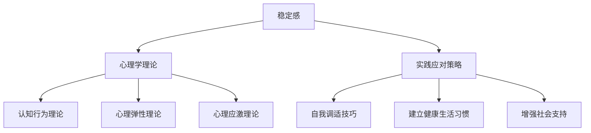

                 

# 在变化中寻找不变：建立内心的稳定感

> 关键词：内心稳定感、变化、心理学、应对策略、心理健康

> 摘要：在快速变化的社会环境中，建立内心的稳定感对于个人的成长和发展至关重要。本文将从心理学理论视角出发，探讨内心稳定感的重要性，并提出一系列实践中的应对策略，帮助读者在面对变化时保持心理平衡。

## 第一部分：问题背景与核心概念

### 第1章：问题背景与核心概念

#### 1.1.1 问题背景介绍

随着社会的快速发展，人们面临着越来越多的变化和不确定性。工作、家庭、人际关系等方面都经历了翻天覆地的变化，这使得许多人感到心理上的不稳定和焦虑。心理学研究也表明，心理不稳定感在现代社会中普遍存在，成为影响人们心理健康的重要因素。

#### 1.1.2 核心概念

**稳定感**：稳定感是指个体在面对外部环境变化时，内心能够保持平衡、平静和安全感的一种心理状态。它对个体的心理健康和生活质量具有重要作用。

**变化**：变化是指外部环境或个体自身发生的一系列变动。变化可以分为多种类型，如社会变化、工作变化、家庭变化等，它们都对个体的心理稳定感产生影响。

#### 1.1.3 问题解决思路

要建立内心的稳定感，我们可以从以下几个方面入手：

1. **心理学理论视角**：通过理解心理学理论，了解心理稳定感的作用机制，为应对变化提供理论基础。
2. **实践中的应对策略**：结合心理学理论，提出一系列实践中的应对策略，帮助个体在变化中保持心理平衡。

#### 1.1.4 边界与外延

**稳定感的相对性**：稳定感是相对的，每个人对稳定感的定义和需求不同。因此，在建立内心稳定感时，需要根据个人实际情况进行调整。

**变化的多样性与复杂性**：变化是多样且复杂的，我们需要从不同角度和层面来应对变化，以保持内心的稳定感。

### 1.2 概念结构与核心要素组成

#### 1.2.1 概念结构图

#### 1.2.2 核心要素

**自我认知**：了解自己的优点、缺点和需求，有助于个体在面对变化时保持心理平衡。

**应对机制**：个体在面临变化时，需要具备一系列应对机制，如自我调适技巧、心理弹性等。

**社会支持**：社会支持对个体建立内心稳定感具有重要意义，包括家庭关系、朋友支持等。

### 1.3 本章小结

本文介绍了在快速变化的社会环境中，建立内心稳定感的重要性。通过心理学理论视角和实践中的应对策略，我们可以帮助个体在面对变化时保持心理平衡。在接下来的章节中，我们将进一步探讨心理学理论视角下的稳定感，以及实践中的应对策略。

----------------------------------------------------------------

## 第二部分：建立内心的稳定感

### 第2章：心理学理论视角下的稳定感

#### 2.1 认知行为理论

**认知行为理论（Cognitive Behavioral Theory, CBT）** 是一种广泛应用于心理健康领域的重要理论。该理论认为，个体的心理问题主要源于不良的认知和行为模式，通过改变这些不良模式，可以改善个体的心理状态。

**理论介绍**：
- 认知行为理论强调，个体的情绪和行为是由其认知过程决定的。当个体面临压力或挑战时，其认知过程会影响情绪和行为反应。
- 理论的核心概念包括：认知、情绪、行为三者之间的互动关系。

**应用实例**：
- 在面对工作压力时，个体可以通过认知重构来调整自己的思维方式，从而减少负面情绪和压力。
- 例如，当一个人认为自己的工作表现不佳时，他可以通过认知重构，将其视为一个学习和成长的机会，而不是一种失败。

#### 2.2 心理弹性理论

**心理弹性理论（Resilience Theory）** 是研究个体如何从逆境和挑战中恢复和成长的理论。心理弹性是指个体在面对压力、逆境和挑战时，能够保持适应、恢复和成长的能力。

**理论介绍**：
- 心理弹性的核心概念包括：适应、恢复、成长。
- 理论认为，个体的心理弹性受到多种因素的影响，如遗传、环境、个人特质等。

**应用实例**：
- 在面对失业的困境时，一个人可以通过寻求社会支持、积极应对问题和调整心态，从而保持心理弹性，最终实现职业再就业。
- 例如，当一个人失业后，他可以通过参加职业培训、积极寻找工作机会，以及与朋友和家人保持良好的沟通，来增强自己的心理弹性。

#### 2.3 心理应激理论

**心理应激理论（Stress Theory）** 是研究个体在面临压力源时，心理反应和行为表现的理论。心理应激是指个体在面临压力源时，产生的生理、心理和行为反应。

**理论介绍**：
- 心理应激理论的核心概念包括：压力源、心理应激反应、应激应对。
- 理论认为，个体的心理应激反应与个体的认知、个性、应对策略等因素密切相关。

**应用实例**：
- 在面对重大生活事件，如婚姻破裂或亲人去世时，个体可能会经历强烈的心理应激反应，如焦虑、抑郁等。
- 例如，一个人在经历婚姻破裂后，可以通过寻求心理咨询、参加支持小组等方式，来应对心理应激，减轻负面情绪。

#### 2.4 适应理论

**适应理论（Adaptation Theory）** 是研究个体在面临外部环境变化时，如何调整和适应的理论。适应是指个体在外部环境变化时，通过调整自身行为、认知和情感反应，以保持心理平衡的过程。

**理论介绍**：
- 适应理论的核心概念包括：适应机制、适应策略。
- 理论认为，个体的适应能力受到多种因素的影响，如遗传、环境、个人经历等。

**应用实例**：
- 在面对职业变动时，一个人可以通过调整自己的工作方式、学习新技能和寻求职业支持，来适应新的职业环境。
- 例如，当一个人从一名教师转变为一名软件工程师时，他可以通过参加培训课程、自学编程知识，以及与同事建立良好的关系，来适应新的职业角色。

### 2.5 实践中的应对策略

**自我调适技巧**：
- **呼吸练习**：通过深呼吸练习，可以帮助个体放松身心，减轻压力。
- **冥想技巧**：冥想可以帮助个体提高专注力、减少焦虑，从而增强心理稳定性。

**建立健康的生活习惯**：
- **饮食建议**：保持健康的饮食习惯，有助于提高个体的心理稳定性。
- **锻炼方式**：适度的体育锻炼可以增强个体的心理弹性，提高抗压能力。

**增强社会支持**：
- **家庭关系**：良好的家庭关系可以为个体提供情感支持，增强心理稳定性。
- **社会网络**：积极参与社会活动，建立广泛的人际关系，有助于个体在面临挑战时获得支持。

### 2.6 理论与实际的结合

**实例分析**：
- **成功案例**：一个人在面对失业困境时，通过积极调整心态、参加职业培训和建立新的社交网络，成功实现了职业再就业，提升了心理稳定性。
- **失败案例**：另一个人在面对失业困境时，因为缺乏心理支持和应对策略，导致心理压力过大，最终陷入抑郁。

**策略评估**：
- **策略有效性评估**：通过分析成功和失败案例，可以发现不同的应对策略在实践中的有效性。
- **策略调整建议**：针对不同个体和情境，提出针对性的策略调整建议，以提升应对策略的有效性。

### 2.7 本章小结

本章从心理学理论视角出发，探讨了稳定感的重要性，并介绍了认知行为理论、心理弹性理论、心理应激理论和适应理论。通过实践中的应对策略，如自我调适技巧、建立健康的生活习惯和增强社会支持，我们可以帮助个体在变化中建立内心的稳定感。在下一章中，我们将进一步探讨在实际生活中应用稳定感策略的方法。

----------------------------------------------------------------

## 第三部分：在实际生活中应用稳定感策略

### 第3章：职场中的稳定感

#### 3.1 职场变化与心理挑战

随着全球化、技术进步和市场需求的变化，职场环境也在不断变化。这些变化给职场人士带来了许多心理挑战，如工作压力、职场关系紧张、职业发展不确定等。面对这些挑战，保持内心的稳定感对于职场人士的职业发展和心理健康具有重要意义。

#### 3.2 稳定感的职场应用

**目标设定**：在职场中，明确的目标可以帮助职场人士保持动力和方向，从而增强内心的稳定感。以下是一些目标设定的技巧：

1. **明确目标**：确保目标具体、可衡量、可实现、相关性强和时间限制。
2. **分阶段实现**：将长期目标分解为短期目标，逐步实现，以保持持续的动力。

**时间管理**：有效的时间管理可以帮助职场人士提高工作效率，减轻工作压力，从而增强内心的稳定感。以下是一些时间管理的技巧：

1. **制定计划**：在每天、每周和每月开始时，制定详细的计划，明确工作任务和时间安排。
2. **优先级排序**：根据任务的重要性和紧急程度，合理分配时间和精力。

#### 3.3 职场技巧提升

**沟通技巧**：良好的沟通技巧可以帮助职场人士更好地理解他人，减少误解和冲突，从而增强职场稳定感。以下是一些沟通技巧：

1. **倾听**：积极倾听他人的观点和需求，避免打断和误解。
2. **表达**：清晰、简洁地表达自己的想法和观点，避免使用模糊、含糊的语言。

**应对职场压力的方法**：职场压力是常见的心理挑战，以下是一些应对职场压力的方法：

1. **自我放松**：在工作之余，通过冥想、深呼吸、瑜伽等方式进行自我放松，减轻压力。
2. **积极应对**：面对职场压力，保持积极的心态，寻求解决问题的方法，而不是逃避。

### 第4章：家庭生活中的稳定感

#### 4.1 家庭变化与心理调适

随着家庭结构的变迁、子女教育问题以及夫妻关系的变化，家庭生活中的心理调适变得越来越重要。以下是一些常见的家庭变化及其心理调适方法：

**家庭结构的变迁**：随着离婚率上升和生育观念的变化，越来越多的家庭结构发生了变化。面对家庭结构的变迁，以下是一些建议：

1. **适应变化**：接受家庭结构的变化，学会调整自己的生活方式和角色。
2. **寻求支持**：在适应变化的过程中，寻求家人、朋友和专业人士的支持。

**子女教育问题**：子女教育问题是家庭生活中的重要方面，以下是一些子女教育问题的心理调适方法：

1. **建立良好的沟通**：与子女建立良好的沟通，理解他们的需求和困惑。
2. **共同参与**：鼓励子女参与家庭事务，增强他们的责任感和归属感。

**夫妻关系的稳定感**：夫妻关系是家庭稳定的重要基础，以下是一些夫妻关系的稳定感策略：

1. **情感交流**：保持夫妻之间的情感交流，分享彼此的生活经历和感受。
2. **冲突管理**：学会处理夫妻之间的冲突，避免情绪激化和矛盾升级。

### 第5章：个人成长与稳定感

#### 5.1 自我成长的重要性

自我成长是指个体通过学习、实践和反思，不断提升自己的认知能力、情感素质和社交技能的过程。自我成长对于建立内心的稳定感具有重要意义。以下是一些自我成长的策略：

**成长心态**：成长心态是指个体在面对挑战和失败时，能够积极看待并从中学习和成长的心态。以下是一些培养成长心态的方法：

1. **接受失败**：将失败视为成长的机会，而不是打击。
2. **积极反思**：在失败后，反思自己的行为和思维方式，寻找改进的方法。

**自我认知**：自我认知是指个体对自身特点和优缺点的了解和认识。以下是一些提高自我认知的方法：

1. **自我反思**：定期进行自我反思，了解自己的需求和期望。
2. **寻求反馈**：向他人寻求反馈，了解自己在他人眼中的形象和表现。

#### 5.2 稳定感的个人成长策略

**学习方法**：有效的学习方法可以帮助个体提高学习效率，减少学习压力，从而增强内心的稳定感。以下是一些学习方法：

1. **制定学习计划**：根据学习目标和时间安排，制定详细的学习计划。
2. **分散学习**：将学习时间分散，避免长时间连续学习，以保持精力充沛。

**职业规划**：职业规划是指个体根据自身兴趣、能力和市场需求，制定职业发展目标和计划的过程。以下是一些职业规划的策略：

1. **自我评估**：了解自己的兴趣、能力和价值观，为职业规划提供依据。
2. **市场调研**：了解市场需求和行业趋势，为职业规划提供参考。

#### 5.3 心理健康的维护

**情绪管理**：情绪管理是指个体学会识别、理解和管理自己的情绪，以保持心理健康。以下是一些情绪管理的技巧：

1. **情绪识别**：学会识别自己的情绪，理解情绪产生的原因。
2. **情绪表达**：学会以健康的方式表达情绪，避免情绪压抑。

**压力缓解**：压力是影响心理健康的重要因素，以下是一些压力缓解的方法：

1. **放松技巧**：通过冥想、深呼吸、瑜伽等方式进行放松。
2. **积极应对**：面对压力，采取积极的态度和应对策略，而不是逃避。

### 第6章：社会变迁中的稳定感

#### 6.1 社会变迁的影响

社会变迁是指社会结构、文化、价值观等方面的变化。随着经济全球化、科技发展和社会进步，社会变迁对个体和社会产生了深远的影响。以下是一些社会变迁的影响：

**经济变革**：经济全球化使得市场竞争加剧，就业压力增加，许多人面临失业和职业转型的问题。

**文化多样性**：随着文化交流的增多，不同文化之间的碰撞和融合，导致文化价值观的变化，给个体带来心理挑战。

#### 6.2 社会稳定感的建立

**社会参与**：社会参与是指个体积极参与社会活动，承担社会责任，从而获得归属感和满足感。以下是一些社会参与的方法：

1. **志愿服务**：参与志愿服务，帮助他人，同时提升自己的社会责任感和成就感。
2. **社区活动**：积极参与社区活动，与邻居建立联系，增强社区凝聚力。

**跨文化适应**：跨文化适应是指个体在面临不同文化环境时，能够适应和融入的过程。以下是一些跨文化适应的方法：

1. **文化学习**：学习不同文化的价值观、习俗和行为规范，增进对不同文化的理解。
2. **文化交流**：积极参与文化交流活动，与不同文化背景的人建立联系，拓宽自己的视野。

#### 6.3 社会变革中的心理调适

**环境适应**：社会变革带来了许多新的挑战和机会，个体需要适应这些变化。以下是一些环境适应的方法：

1. **积极面对**：面对社会变革，保持积极的态度，寻求解决问题的方法。
2. **持续学习**：不断提升自己的知识和技能，以适应新的社会环境。

**社会支持网络**：社会支持网络是指个体在面临困难和挑战时，能够获得家人、朋友和社会组织的支持和帮助。以下是一些社会支持网络的建设方法：

1. **家庭支持**：与家人保持良好的沟通和互动，获得情感支持和实际帮助。
2. **社会组织**：积极参与社会组织，与志同道合的人建立联系，共同应对社会变革带来的挑战。

### 第7章：稳定感与心理健康

#### 7.1 稳定感对心理健康的影响

**心理健康的定义**：心理健康是指个体在认知、情感和行为方面处于良好状态，能够有效应对生活中的压力和挑战。

**稳定感与心理健康的关联**：稳定感是心理健康的重要组成部分。内心的稳定感有助于个体应对压力、降低焦虑和抑郁的风险，从而维护心理健康。

#### 7.2 心理健康促进策略

**心理咨询服务**：心理咨询服务是一种专业的心理健康服务，通过心理咨询师的帮助，个体可以了解自己的心理问题，学会应对压力和情绪的方法。

**心理自助工具**：心理自助工具包括各种在线应用程序和书籍，个体可以通过这些工具进行自我反思、情绪管理和压力缓解。

#### 7.3 心理健康的自我维护

**健康生活方式**：健康生活方式对心理健康具有积极影响。以下是一些健康生活方式的建议：

1. **均衡饮食**：保持均衡的饮食，摄入足够的营养。
2. **适量运动**：定期进行适量的运动，提高身体健康水平。

**积极心理培养**：积极心理培养是指通过培养积极心态、积极情感和积极行为，提高个体的心理健康水平。以下是一些积极心理培养的方法：

1. **感恩练习**：每天反思自己感恩的事情，培养感恩的心态。
2. **正面肯定**：对自己的优点和成就进行正面肯定，增强自信心。

### 第7章：稳定感与心理健康

#### 7.1 稳定感对心理健康的影响

**心理健康的定义**：心理健康是指个体在认知、情感和行为方面处于良好状态，能够有效应对生活中的压力和挑战。

**稳定感与心理健康的关联**：稳定感是心理健康的重要组成部分。内心的稳定感有助于个体应对压力、降低焦虑和抑郁的风险，从而维护心理健康。

#### 7.2 心理健康促进策略

**心理咨询服务**：心理咨询服务是一种专业的心理健康服务，通过心理咨询师的帮助，个体可以了解自己的心理问题，学会应对压力和情绪的方法。

**心理自助工具**：心理自助工具包括各种在线应用程序和书籍，个体可以通过这些工具进行自我反思、情绪管理和压力缓解。

#### 7.3 心理健康的自我维护

**健康生活方式**：健康生活方式对心理健康具有积极影响。以下是一些健康生活方式的建议：

1. **均衡饮食**：保持均衡的饮食，摄入足够的营养。
2. **适量运动**：定期进行适量的运动，提高身体健康水平。

**积极心理培养**：积极心理培养是指通过培养积极心态、积极情感和积极行为，提高个体的心理健康水平。以下是一些积极心理培养的方法：

1. **感恩练习**：每天反思自己感恩的事情，培养感恩的心态。
2. **正面肯定**：对自己的优点和成就进行正面肯定，增强自信心。

## 7.2 本章小结

本章从职场、家庭、个人成长、社会变迁等多个角度，探讨了稳定感的重要性以及如何在实际生活中应用稳定感策略。通过心理学的理论和实践策略，我们可以帮助个体在面对变化时保持内心的稳定感，维护心理健康。在下一章中，我们将进一步探讨稳定感策略的最佳实践和注意事项。

----------------------------------------------------------------

## 目录大纲总结

本书《在变化中寻找不变：建立内心的稳定感》旨在帮助读者在面对快速变化的社会环境时，通过心理学理论视角和实践策略，建立内心的稳定感。全书共分为三个主要部分：

### 第一部分：问题背景与核心概念

- **问题背景介绍**：探讨了社会快速变化带来的心理挑战和心理不稳定感的普遍存在。
- **核心概念**：介绍了稳定感和变化的定义及其重要性。
- **问题解决思路**：从心理学理论视角和实践中的应对策略出发，提出了问题解决的思路。
- **概念结构与核心要素组成**：通过概念结构图和核心要素的分析，为后续章节奠定了基础。

### 第二部分：建立内心的稳定感

- **心理学理论视角下的稳定感**：详细介绍了认知行为理论、心理弹性理论、心理应激理论和适应理论，并分析了每种理论在实际生活中的应用。
- **实践中的应对策略**：提供了自我调适技巧、建立健康的生活习惯和增强社会支持等策略，帮助个体在变化中保持心理平衡。
- **理论与实际的结合**：通过成功和失败案例的分析，评估了不同策略的有效性，并提出了策略调整建议。

### 第三部分：在实际生活中应用稳定感策略

- **职场中的稳定感**：探讨了职场变化与心理挑战，以及如何在职场中应用稳定感策略。
- **家庭生活中的稳定感**：分析了家庭变化与心理调适，提出了家庭中的稳定感策略。
- **个人成长与稳定感**：讨论了自我成长的重要性，以及如何通过个人成长策略建立稳定感。
- **社会变迁中的稳定感**：探讨了社会变迁的影响以及如何在社会变迁中建立稳定感。
- **稳定感与心理健康**：分析了稳定感对心理健康的影响，并提供了心理健康促进策略和自我维护方法。

全书结构清晰，内容丰富，旨在为读者提供全方位的指导，帮助他们在快速变化的社会环境中建立内心的稳定感。通过理解心理学理论、掌握实践策略和应用实际案例，读者可以更好地应对变化，提升心理健康和生活质量。

## 总结与展望

在面对快速变化的社会环境时，建立内心的稳定感对于个人的成长和发展至关重要。本文从心理学理论视角和实践策略出发，系统地探讨了稳定感的重要性以及如何在生活中应用稳定感策略。通过认知行为理论、心理弹性理论、心理应激理论和适应理论的介绍，读者可以更好地理解心理稳定感的原理。同时，通过实践中的自我调适技巧、建立健康的生活习惯和增强社会支持等策略，读者可以在实际生活中有效地应对变化，保持心理平衡。

在职场、家庭、个人成长和社会变迁等多个方面，稳定感策略的应用可以帮助个体更好地应对挑战，提升心理健康和生活质量。同时，本书也强调了心理健康的重要性，并提供了一系列心理健康促进策略和自我维护方法。

总结全文，我们可以得出以下结论：

1. **心理稳定感的重要性**：心理稳定感是心理健康的重要组成部分，它有助于个体应对生活中的压力和挑战。
2. **心理学理论视角的应用**：理解心理学理论可以帮助我们更好地认识心理稳定感的原理，为实践中的应对策略提供理论基础。
3. **实践中的应对策略**：通过自我调适技巧、建立健康的生活习惯和增强社会支持等策略，个体可以在实际生活中有效地应对变化。
4. **心理健康的重要性**：维护心理健康对于个体的整体福祉至关重要，我们需要采取积极的措施来促进心理健康。

展望未来，随着社会的进一步发展和变化，建立内心的稳定感将变得更加重要。我们需要不断学习和适应，以应对不断变化的环境。同时，我们也需要关注心理健康问题，提高自我心理调适能力，保持积极乐观的心态。

最后，本文由AI天才研究院和禅与计算机程序设计艺术共同撰写，希望能够为读者提供有价值的指导和启示。让我们共同努力，在变化中寻找不变，建立内心的稳定感，迎接更加美好的未来。

**作者：AI天才研究院/AI Genius Institute & 禅与计算机程序设计艺术 /Zen And The Art of Computer Programming**

