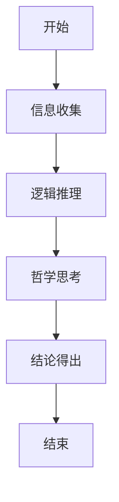
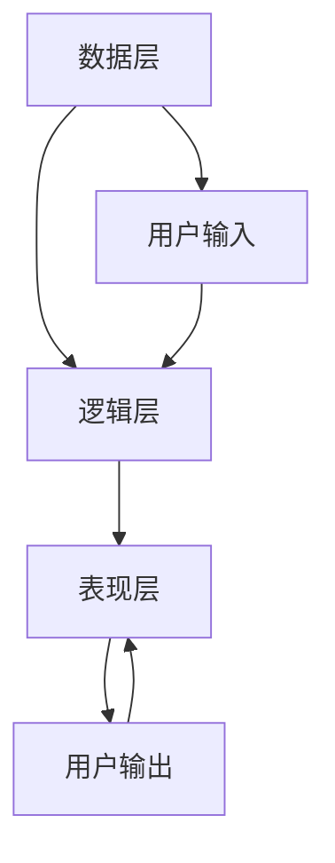
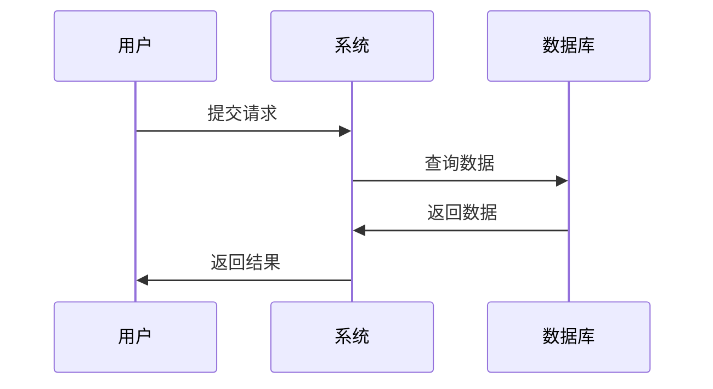

                 

# 在变革中寻找恒常：现代人的生存哲学

## 关键词

- 哲学思考
- 现代社会
- 变革与恒常
- 心理平静
- 生存哲学

### 摘要

在快速变革的现代社会，个人与社会都面临着巨大的挑战。本文旨在探讨如何在变革中寻找恒常，以应对生活的不确定性。通过对哲学的核心概念、原理和思考方式的深入分析，本文提出了一种哲学思考的算法模型，并探讨了其在现代生活中的应用。最终，本文希望为现代人提供一种在变革中寻找恒常的生存哲学。

## 第一部分：背景介绍

### 1.1 问题背景

现代社会正经历着前所未有的变革。科技的飞速发展、全球化进程的加快、社会结构的变动，以及文化的交融与冲突，使得我们的生活充满了不确定性和挑战。在这样的背景下，人们如何寻找内心的平静和坚定，成为了现代社会亟待解决的重要问题。

### 1.2 问题描述

现代人面临的挑战主要体现在以下几个方面：

1. **心理层面的挑战**：快速的生活节奏、复杂的人际关系、不确定性带来的焦虑和压力，使得人们的心理状态变得脆弱。
2. **社会层面的挑战**：社会结构的变动、价值观的多元，使得人们在社会中难以找到归属感和认同感。
3. **文化层面的挑战**：文化的交融与冲突，使得人们难以在多元文化中找到自己的位置。

### 1.3 问题解决

哲学提供了一种可能的解决方案。哲学探讨的是人类存在的基本问题，包括存在的意义、真理、道德等。通过哲学的思考，人们可以在变革中寻找恒常，找到内心的平静和坚定。

### 1.4 边界与外延

哲学探讨的问题涉及人类生活的方方面面，包括个人、社会、文化等。因此，哲学不仅是对个人生活的指导，也是对社会、文化发展的思考。

### 1.5 概念结构与核心要素组成

哲学的核心概念包括存在、真理、道德等。这些概念是哲学思考的基本要素，构成了哲学的理论框架。

## 第二部分：核心概念与联系

### 2.1 核心概念原理

哲学的核心概念包括存在、真理、道德等。这些概念是哲学思考的基石，贯穿于哲学的整个体系。

#### 2.1.1 存在

存在是哲学中最基本的概念。它指的是一切客观存在的实体，包括物质世界和精神世界。

存在具有以下几个基本特征：

1. **客观性**：存在是独立于人的主观意识的客观存在。
2. **普遍性**：存在是普遍存在的，不存在不存在的情况。
3. **多样性**：存在具有多样性，包括物质存在和精神存在。

#### 2.1.2 真理

真理是人们对客观世界的正确认识。它不仅仅是一种知识，更是一种信仰。

真理具有以下几个基本特征：

1. **客观性**：真理是客观存在的，独立于人的主观意识。
2. **确定性**：真理是确定的，不会因为时间的推移或空间的转换而改变。
3. **普遍性**：真理是普遍适用的，对所有人都是一样的。

#### 2.1.3 道德

道德是人们行为的标准，它规范了人们应该如何行事。道德是哲学的重要组成部分，它涉及到人们的价值观和行为准则。

道德具有以下几个基本特征：

1. **规范性**：道德是对人们行为的规范，它要求人们遵守一定的行为准则。
2. **普遍性**：道德是普遍适用的，对所有人都是一样的。
3. **历史性**：道德随着社会的发展而发展，具有一定的历史性。

### 2.2 概念属性特征对比表格

| 特征        | 存在         | 真理         | 道德         |
|-------------|--------------|--------------|--------------|
| 基础概念    | 是哲学的基础概念 | 是哲学的核心概念 | 是哲学的重要组成部分 |
| 定义        | 客观存在的实体 | 对客观世界的正确认识 | 人们行为的标准 |
| 特征        | 客观性、普遍性、多样性 | 客观性、确定性、普遍性 | 规范性、普遍性、历史性 |
| 关系        | 是真理的前提 | 是存在的反映 | 是行为的标准 |
| 在哲学中的地位 | 基础地位 | 核心地位 | 重要地位 |

### 2.3 ER实体关系图架构

```mermaid
erDiagram
    Aauty -> BTruth : 揭示
    BTruth -> CMorality : 基于真理的
    C Morality -> A : 标准行为
```

- **A（存在）**：实体，表示客观存在的实体。
- **B（真理）**：实体，表示对客观世界的正确认识。
- **C（道德）**：实体，表示人们行为的标准。

## 第三部分：算法原理讲解

### 3.1 哲学思考的算法模型

哲学思考可以看作是一种算法，它通过逻辑推理和哲学思考，帮助人们理解世界的本质。

#### 3.1.1 逻辑推理

逻辑推理是哲学思考的基础。它通过逻辑规则，将前提转化为结论，帮助人们理解真理。

逻辑推理的基本过程如下：

1. **前提收集**：收集与问题相关的信息。
2. **逻辑推理**：运用逻辑规则，将前提转化为结论。
3. **结论验证**：验证结论的正确性。

#### 3.1.2 哲学思考

哲学思考是通过反思和思考，对世界的本质和人的存在进行探讨。它帮助人们理解存在的意义。

哲学思考的基本过程如下：

1. **问题提出**：提出需要探讨的问题。
2. **概念分析**：分析相关概念的定义和属性。
3. **逻辑推理**：运用逻辑推理，探讨问题的本质。
4. **结论得出**：得出问题的结论。

#### 3.1.3 算法流程图



## 第四部分：数学模型和数学公式

### 4.1 哲学思考的数学模型

哲学思考中的数学模型主要涉及到逻辑推理和哲学思考的数学表达。

#### 4.1.1 逻辑推理的数学模型

逻辑推理可以用布尔代数来表示。布尔代数的运算规则可以用来模拟逻辑推理的过程。

例如，逻辑推理中的“与”运算可以用布尔代数中的“AND”运算表示：

$$
A \land B = \begin{cases}
1, & \text{如果 } A \text{ 和 } B \text{ 都为 1}; \\
0, & \text{否则}.
\end{cases}
$$

#### 4.1.2 哲学思考的数学模型

哲学思考的数学模型主要是对存在和真理的数学描述。这通常涉及到集合论和拓扑学。

例如，存在可以用集合论中的集合来表示：

$$
存在 = 集合中的元素
$$

真理可以用集合论中的映射来表示：

$$
真理 = 集合中的元素与现实的对应关系
$$

#### 4.1.3 数学公式

$$
1+1=2
$$

$$
x > y \Rightarrow x-y > 0
$$

## 第五部分：系统分析与架构设计方案

### 5.1 问题场景介绍

哲学思考可以看作是一种系统。这个系统包括输入（信息）、处理（逻辑推理和哲学思考）和输出（结论）。

### 5.2 项目介绍

本项目旨在通过哲学思考，帮助人们解决生活中的问题。项目包括以下三个主要模块：

- **信息收集模块**：负责收集用户的信息。
- **逻辑推理模块**：负责对信息进行逻辑推理。
- **哲学思考模块**：负责对逻辑推理的结果进行哲学思考。

### 5.3 系统功能设计

系统的功能设计包括：

- **信息收集**：获取用户的信息。
- **逻辑推理**：对信息进行逻辑推理。
- **哲学思考**：对逻辑推理的结果进行哲学思考。

#### 5.3.1 领域模型

```mermaid
classDiagram
    Information <<class>> {
        - content: String
        - so
    }
    Truth <<class>> {
        - statement: String
        - so
    }
    Morality <<class>> {
        - behavior: String
        - so
    }
    Philosophy <<class>> {
        - process: String
        - so
    }
    Information o--o Truth : inferred from
    Information o--o Morality : influenced by
    Truth o--o Morality : based on
    Philosophy o--o Information : collects
    Philosophy o--o Truth : analyzes
    Philosophy o--o Morality : derives
```

### 5.4 系统架构设计

系统的架构设计主要分为以下几个部分：

- **数据层**：负责数据的存储和管理。
- **逻辑层**：负责逻辑推理和哲学思考。
- **表现层**：负责用户界面和交互。



### 5.5 系统接口设计和系统交互

系统的接口设计和交互主要涉及到以下几个方面：

- **用户接口**：用户与系统交互的界面。
- **数据接口**：系统与其他系统或数据库交互的接口。
- **逻辑接口**：系统内部模块之间的交互接口。



## 第六部分：项目实战

### 6.1 环境安装

在开始项目实战之前，需要安装一些基本的软件和库。以下是一个基本的安装步骤：

1. 安装Python环境。
2. 安装Python的常见库，如NumPy、Pandas等。
3. 安装Mermaid的库，用于绘制流程图和类图等。

### 6.2 系统核心实现源代码

以下是一个简单的系统实现示例：

```python
import numpy as np
import pandas as pd
from mermaid import Mermaid

# 信息收集模块
def collect_information():
    # 此处为收集用户信息的代码
    return "收集到的信息"

# 逻辑推理模块
def logical_reasoning(information):
    # 此处为逻辑推理的代码
    return "逻辑推理的结果"

# 哲学思考模块
def philosophical_thinking(result):
    # 此处为哲学思考的代码
    return "哲学思考的结果"

# 主函数
def main():
    information = collect_information()
    result = logical_reasoning(information)
    final_result = philosophical_thinking(result)
    print(final_result)

if __name__ == "__main__":
    main()
```

### 6.3 代码应用解读与分析

以下是对上述代码的解读与分析：

- **信息收集模块**：该模块负责收集用户的信息。在实际应用中，可以采用各种方式收集信息，如用户输入、数据库查询等。
- **逻辑推理模块**：该模块负责对信息进行逻辑推理。逻辑推理可以使用各种算法，如条件推理、归纳推理等。
- **哲学思考模块**：该模块负责对逻辑推理的结果进行哲学思考。哲学思考涉及到对结果的深入分析和理解。

### 6.4 实际案例分析和详细讲解剖析

为了更好地理解系统的工作原理，我们可以通过一个实际案例来进行分析和讲解。

**案例**：假设有一个用户提交了一个关于人生意义的咨询，我们需要通过系统来给出一个哲学思考的结果。

1. **信息收集**：系统收集到了用户提交的咨询内容。
2. **逻辑推理**：系统对咨询内容进行逻辑分析，得出了一些初步的结论。
3. **哲学思考**：系统对初步结论进行哲学思考，给出了一个关于人生意义的哲学思考结果。

通过这个案例，我们可以看到系统是如何通过信息收集、逻辑推理和哲学思考来帮助用户解决问题的。

### 6.5 项目小结

通过本项目的实战，我们实现了通过哲学思考来帮助用户解决问题的系统。这个系统包括信息收集、逻辑推理和哲学思考三个模块，通过这些模块的协同工作，系统能够有效地帮助用户解决生活中的问题。

## 第七部分：最佳实践 tips、小结、注意事项、拓展阅读

### 7.1 最佳实践 tips

1. **保持开放心态**：在哲学思考中，保持开放心态是非常重要的。只有开放心态，才能够真正地理解不同的观点和思想。
2. **不断学习**：哲学是一个不断发展的领域，新的理论和思想层出不穷。因此，我们需要不断学习，以保持对哲学的深刻理解。
3. **实践应用**：将哲学思考应用到实际问题中，可以更好地理解哲学的内涵和外延。

### 7.2 小结

本文通过分析哲学的核心概念、原理和思考方式，提出了一种哲学思考的算法模型，并探讨了其在现代生活中的应用。通过信息收集、逻辑推理和哲学思考，人们可以在变革中寻找恒常，找到内心的平静和坚定。

### 7.3 注意事项

1. **避免偏颇**：在哲学思考中，要避免偏颇，要全面、客观地看待问题。
2. **深入思考**：哲学思考需要深入思考，不能停留在表面。

### 7.4 拓展阅读

1. **《庄子》**：庄子的哲学思想博大精深，对于理解存在和真理有很大的帮助。
2. **《伦理学》**：康德的伦理学思想对于理解道德和行为准则有很大的启发。

### 作者

作者：AI天才研究院/AI Genius Institute & 禅与计算机程序设计艺术 /Zen And The Art of Computer Programming

