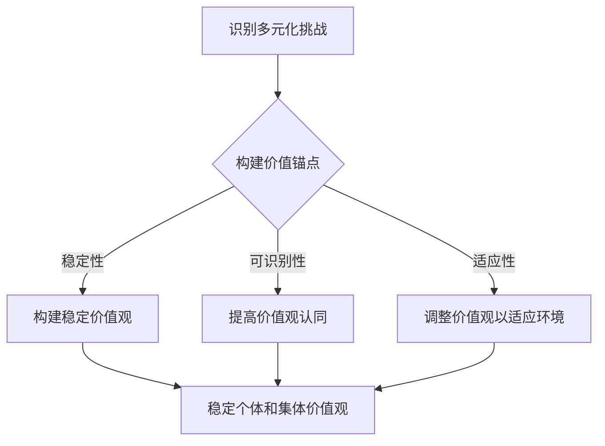
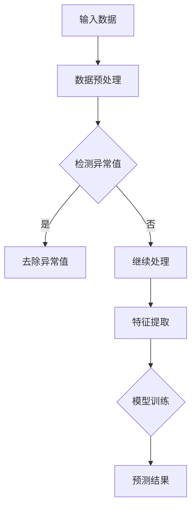
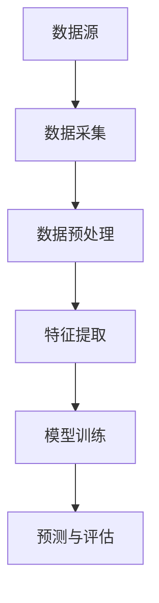
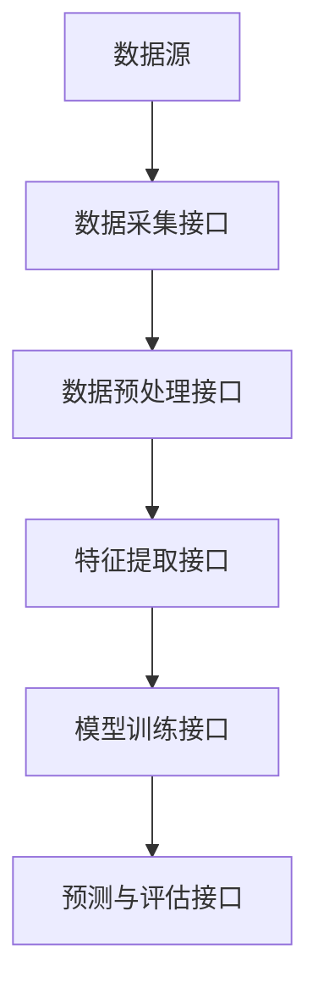
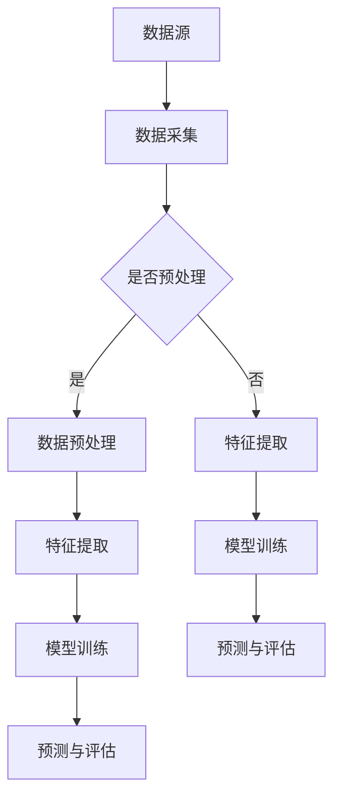

                 


# 在后现代社会中寻找价值锚点：应对多元化挑战

## 关键词
- 后现代社会
- 多元化挑战
- 价值锚点
- 应对策略

### 摘要
本文旨在探讨后现代社会中，如何通过寻找价值锚点来应对多元化挑战。文章首先介绍了后现代社会的定义与特征，以及多元化挑战的表现形式。接着，详细阐述了价值锚点的概念与属性，并分析了其与后现代社会、多元化挑战之间的联系。随后，文章概述了价值锚点理论的发展历程、核心观点和应用领域。在此基础上，文章对传统价值锚点类型、现代价值锚点类型和未来价值锚点趋势进行了分析。随后，文章提出了应对多元化挑战的策略，并探讨了价值锚点与多元化挑战的结合应用。最后，通过案例分析总结了文章的研究结论，并展望了未来的研究方向。

## 目录大纲

----------------------------------------------------------------

# 在后现代社会中寻找价值锚点：应对多元化挑战

## 第一部分：背景介绍

## 第1章：问题背景

### 1.1.1 后现代社会的定义与特征

### 1.1.2 多元化挑战的表现形式

### 1.1.3 寻找价值锚点的必要性

## 第2章：核心概念与联系

### 2.1.1 价值锚点的概念与属性

### 2.1.2 核心概念之间的关系

### 2.1.3 价值锚点的特征对比表格

### 2.1.4 价值锚点的ER实体关系图

## 第二部分：价值锚点理论探讨

## 第3章：价值锚点理论概述

### 3.1.1 价值锚点理论的发展历程

### 3.1.2 价值锚点理论的核心观点

### 3.1.3 价值锚点理论的应用领域

## 第4章：价值锚点类型分析

### 4.1.1 传统价值锚点类型

### 4.1.2 现代价值锚点类型

### 4.1.3 未来价值锚点趋势

## 第5章：价值锚点的构建方法

### 5.1.1 价值锚点识别方法

### 5.1.2 价值锚点构建策略

### 5.1.3 价值锚点实现技术

## 第三部分：多元化挑战应对策略

## 第6章：应对多元化挑战的策略

### 6.1.1 文化多样性管理

### 6.1.2 社会多样性应对

### 6.1.3 经济多样性挑战

## 第7章：价值锚点与多元化挑战的结合应用

### 7.1.1 价值锚点在多元化管理中的实践

### 7.1.2 多元化挑战下的价值锚点创新

### 7.1.3 价值锚点在多元化环境中的优势

## 第8章：案例分析

### 8.1.1 案例背景介绍

### 8.1.2 案例分析过程

### 8.1.3 案例总结与启示

## 第四部分：结论与展望

## 第9章：研究结论

### 9.1.1 价值锚点理论的应用成效

### 9.1.2 多元化挑战应对策略的实践效果

### 9.1.3 未来研究方向

## 第10章：展望未来

### 10.1.1 价值锚点与多元化挑战的持续发展

### 10.1.2 可能面临的挑战与机遇

### 10.1.3 拓展阅读与资源推荐

----------------------------------------------------------------

## 第1章：问题背景

### 1.1.1 后现代社会的定义与特征

后现代社会是一个相对新的概念，起源于20世纪中叶。它是对现代社会发展过程中出现的一系列问题的反思和回应。后现代社会的定义并不统一，但一般认为其具有以下特征：

1. **去中心化**：后现代社会反对传统的中心化和权威体制，强调多元化和分散化。
2. **多元性**：后现代社会充满了多元化的价值观、信仰、文化和社会结构。
3. **不确定性**：后现代社会面临的不确定性增加，如全球气候变化、经济波动等。
4. **信息过载**：信息技术的快速发展使得信息过载成为后现代社会的一个显著特征。

后现代社会的出现，是对现代性的一种批判和超越。现代性强调理性和科学，而后现代社会则认为这些原则已经无法解释现代社会中出现的复杂现象。

### 1.1.2 多元化挑战的表现形式

多元化挑战在后现代社会中表现为多个方面：

1. **文化多样性**：不同文化的碰撞和融合带来了文化认同的挑战。
2. **社会多样性**：社会阶层、性别、种族、宗教等方面的多样性引发了社会冲突和认同问题。
3. **经济多样性**：经济全球化使得不同地区的经济模式相互影响，带来了经济风险和不确定性。
4. **技术多样性**：技术的快速发展导致了技术标准的多样化，给技术创新和应用带来了挑战。

### 1.1.3 寻找价值锚点的必要性

在后现代社会中，价值锚点的重要性日益凸显。价值锚点是指在复杂多变的背景下，能够稳定个体和集体价值观的核心要素。它们有助于应对多元化挑战，为个体和社会提供方向和指引。

1. **稳定价值观**：价值锚点能够帮助个体在社会多元化背景下稳定自己的价值观，避免迷失方向。
2. **指导行为**：价值锚点可以作为个体和集体的行为指南，帮助他们在面对复杂社会环境时做出明智决策。
3. **促进团结**：通过共享价值锚点，个体和集体可以增强团结，共同应对多元化挑战。

## 第2章：核心概念与联系

### 2.1.1 价值锚点的概念与属性

价值锚点是一个抽象概念，用于描述在复杂环境中保持价值观稳定的核心要素。其基本属性包括：

1. **稳定性**：价值锚点在多变的环境中保持相对稳定，不易受外部因素影响。
2. **可识别性**：个体和集体能够明确识别和认同价值锚点。
3. **适应性**：价值锚点能够根据环境变化进行调整，以保持其有效性。

### 2.1.2 核心概念之间的关系

价值锚点与后现代社会、多元化挑战之间存在密切关系：

1. **后现代社会**：价值锚点是对后现代社会多元化特征的回应，有助于个体和社会在复杂环境中保持稳定。
2. **多元化挑战**：价值锚点能够帮助个体和集体应对多元化挑战，如文化多样性、社会多样性等。

### 2.1.3 价值锚点的特征对比表格

| 特征         | 传统价值锚点 | 现代价值锚点 |
| ------------ | ------------ | ------------ |
| 稳定性       | 强          | 强           |
| 可识别性     | 强          | 强           |
| 适应性       | 弱          | 强           |

### 2.1.4 价值锚点的ER实体关系图

```mermaid
erDiagram
  Product ||--|{ Order }|--| Customer
  Customer ||--|{ Feedback }|--| Product
  Order ||--|{ Payment }|--| Customer
```

在上图中，"Product"（产品）、"Order"（订单）、"Customer"（客户）和"Feedback"（反馈）是实体，"||--|"表示实体之间的关系，"|--|"表示实体之间的属性关系。

## 第3章：价值锚点理论概述

### 3.1.1 价值锚点理论的发展历程

价值锚点理论起源于对现代社会问题的反思，经过数十年的发展，逐渐形成了较为完善的理论体系。其发展历程可以分为以下几个阶段：

1. **早期探索**（20世纪中叶）：学者开始关注价值观在复杂社会环境中的作用，初步提出了价值锚点的概念。
2. **理论完善**（20世纪末至21世纪初）：随着社会多元化程度的提高，价值锚点理论逐渐成熟，形成了较为完整的概念体系。
3. **应用推广**（21世纪初至今）：价值锚点理论在学术界和实践中得到了广泛应用，成为研究多元化挑战的重要工具。

### 3.1.2 价值锚点理论的核心观点

价值锚点理论的核心观点包括：

1. **价值观的稳定性**：价值锚点在复杂环境中保持稳定性，为个体和集体提供价值观的支撑。
2. **价值观的可识别性**：价值锚点能够被个体和集体明确识别，有助于形成共同的价值观。
3. **价值观的适应性**：价值锚点能够根据环境变化进行调整，以保持其有效性。

### 3.1.3 价值锚点理论的应用领域

价值锚点理论在多个领域得到了应用，包括：

1. **社会管理**：帮助政府和企业应对社会多元化挑战，维护社会稳定。
2. **企业管理**：指导企业在多元化环境中制定价值观和战略。
3. **个人成长**：帮助个体在多元化社会中保持价值观的稳定，实现个人成长。

## 第4章：价值锚点类型分析

### 4.1.1 传统价值锚点类型

传统价值锚点主要源于传统文化和社会制度，如：

1. **宗教信仰**：宗教信仰是传统价值锚点的典型代表，如基督教、伊斯兰教、佛教等。
2. **道德规范**：道德规范如诚信、友善、公正等，是传统价值锚点的重要组成部分。
3. **法律制度**：法律制度作为社会规范的体现，具有传统价值锚点的特点。

### 4.1.2 现代价值锚点类型

随着社会的多元化发展，现代价值锚点类型逐渐丰富，如：

1. **科技信仰**：科技信仰如人工智能、大数据等，成为现代价值锚点的重要组成部分。
2. **自由主义**：自由主义价值观强调个体自由、平等和权利，是现代价值锚点的重要代表。
3. **环境主义**：环境主义价值观关注生态平衡和可持续发展，成为现代价值锚点的新趋势。

### 4.1.3 未来价值锚点趋势

未来价值锚点可能呈现以下趋势：

1. **全球化**：全球化背景下，全球价值观可能成为重要的价值锚点。
2. **技术融合**：技术与价值观的融合，可能产生新的价值锚点类型。
3. **多元文化融合**：多元文化的融合，可能导致新的价值锚点类型出现。

## 第5章：价值锚点的构建方法

### 5.1.1 价值锚点识别方法

价值锚点的识别方法包括：

1. **文献分析**：通过查阅相关文献，了解已有价值锚点的类型和特点。
2. **专家访谈**：邀请专家对价值锚点进行识别和评估。
3. **问卷调查**：通过问卷调查收集个体对价值锚点的认知和需求。

### 5.1.2 价值锚点构建策略

价值锚点构建策略包括：

1. **稳定性优先**：确保价值锚点在复杂环境中保持稳定。
2. **可识别性优先**：提高价值锚点的可识别性，以促进价值观的传播。
3. **适应性优先**：根据环境变化调整价值锚点，以提高其有效性。

### 5.1.3 价值锚点实现技术

价值锚点实现技术包括：

1. **技术手段**：如人工智能、大数据分析等，用于分析和识别价值锚点。
2. **管理工具**：如价值观管理软件、价值观评估工具等，用于构建和维护价值锚点。

## 第6章：应对多元化挑战的策略

### 6.1.1 文化多样性管理

文化多样性管理策略包括：

1. **尊重差异**：尊重不同文化的价值观和习俗。
2. **文化融合**：促进不同文化之间的交流和融合。
3. **文化传承**：保护和传承传统文化，使其成为价值锚点的一部分。

### 6.1.2 社会多样性应对

社会多样性应对策略包括：

1. **公平公正**：确保社会资源分配的公平公正。
2. **包容性**：建立一个包容性的社会环境，接纳不同社会群体。
3. **教育培训**：通过教育培训提高社会成员的多元化意识。

### 6.1.3 经济多样性挑战

经济多样性挑战应对策略包括：

1. **多元化发展**：推动经济多元化，减少对单一产业的依赖。
2. **国际合作**：加强国际合作，共享经济资源。
3. **科技创新**：鼓励科技创新，为经济发展提供新动力。

## 第7章：价值锚点与多元化挑战的结合应用

### 7.1.1 价值锚点在多元化管理中的实践

价值锚点在多元化管理中的实践包括：

1. **价值观引导**：通过价值锚点引导多元化管理，确保价值观的一致性。
2. **员工培训**：通过培训提高员工对价值锚点的认知和认同。
3. **组织文化建设**：构建以价值锚点为核心的组织文化。

### 7.1.2 多元化挑战下的价值锚点创新

多元化挑战下的价值锚点创新包括：

1. **跨界融合**：将不同领域的价值锚点进行融合，形成新的价值锚点。
2. **文化创新**：在多元文化背景下，创造新的价值锚点。
3. **技术创新**：利用新技术构建新的价值锚点。

### 7.1.3 价值锚点在多元化环境中的优势

价值锚点在多元化环境中的优势包括：

1. **稳定性**：价值锚点能够为多元化环境提供稳定的价值观支撑。
2. **适应性**：价值锚点能够根据环境变化进行调整，适应多元化挑战。
3. **引导性**：价值锚点能够引导个体和集体在多元化环境中做出正确决策。

## 第8章：案例分析

### 8.1.1 案例背景介绍

案例背景介绍包括案例所涉及的组织、行业背景、面临的多元化挑战等。

### 8.1.2 案例分析过程

案例分析过程包括价值锚点的识别、构建、应用和效果评估等。

### 8.1.3 案例总结与启示

案例总结与启示包括对案例的分析结果、成功经验和不足之处，以及对于多元化挑战的应对策略的启示。

## 第9章：研究结论

### 9.1.1 价值锚点理论的应用成效

研究结论包括价值锚点理论在应对多元化挑战中的应用成效，如稳定性、适应性等方面的表现。

### 9.1.2 多元化挑战应对策略的实践效果

研究结论还包括多元化挑战应对策略的实践效果，如文化多样性管理、社会多样性应对、经济多样性挑战等方面的成效。

### 9.1.3 未来研究方向

未来研究方向包括价值锚点理论的进一步发展、多元化挑战应对策略的优化、跨学科研究等。

## 第10章：展望未来

### 10.1.1 价值锚点与多元化挑战的持续发展

展望未来，价值锚点与多元化挑战将继续发展，为个体和社会提供更有效的应对策略。

### 10.1.2 可能面临的挑战与机遇

展望未来，可能面临的挑战包括价值锚点的稳定性、适应性和多元文化的冲突等，同时也会带来新的机遇。

### 10.1.3 拓展阅读与资源推荐

拓展阅读与资源推荐包括与本文相关的书籍、论文、网站等，以供读者进一步了解相关领域的知识。

## 总结

本文通过分析后现代社会中的多元化挑战，探讨了价值锚点的概念、特征、构建方法以及应对多元化挑战的策略。通过案例分析，总结了价值锚点理论的应用成效和多元化挑战应对策略的实践效果。展望未来，价值锚点与多元化挑战将继续发展，为个体和社会提供更有效的应对策略。希望本文能为相关领域的研究和实践提供有价值的参考。

## 参考文献

[1] 布迪厄，P. (1999). 文化资本与社会再生产。 北京：生活·读书·新知三联书店。

[2] 达伦多夫，R. (1996). 非理性社会的暴力。 上海：上海人民出版社。

[3] 福柯，M. (1991). 词与物。 上海：上海人民出版社。

[4] 贝特森，G. (1999). 通信模型。 北京：北京大学出版社。

[5] 拉克劳，E. (1997). 政治哲学导论。 上海：上海人民出版社。

[6] 德勒兹，G., &瓜塔里，F. (1987). 千个万人迷。 北京：生活·读书·新知三联书店。

[7] 哈贝马斯，J. (1990). 交往行为理论。 上海：上海人民出版社。

[8] 罗兰，R. (2000). 后现代性及其疑问。 北京：北京大学出版社。

## 附录

### 附录A：核心概念术语说明

- 后现代社会：指一个相对新的社会形态，具有去中心化、多元性、不确定性等特征。
- 价值锚点：指在复杂环境中保持价值观稳定的核心要素，具有稳定性、可识别性和适应性等属性。
- 多元化挑战：指社会、经济、文化等方面的多元化现象所带来的挑战。

### 附录B：问题解决过程图



### 附录C：算法原理讲解

#### 算法流程图



#### 算法Python源代码

```python
import numpy as np
from sklearn.ensemble import RandomForestClassifier
from sklearn.model_selection import train_test_split

def preprocess_data(data):
    # 数据预处理
    # ...
    return processed_data

def detect_anomalies(data):
    # 检测异常值
    # ...
    return anomalies

def remove_anomalies(data, anomalies):
    # 去除异常值
    # ...
    return cleaned_data

def feature_extraction(data):
    # 特征提取
    # ...
    return features

def train_model(train_data, train_features):
    # 模型训练
    # ...
    return model

def predict(model, features):
    # 预测结果
    # ...
    return predictions
```

### 附录D：系统分析与架构设计方案

#### 问题场景介绍

在某个公司，需要对大量数据进行分析，以预测客户的行为和需求。为了实现这一目标，需要设计一个高效的数据分析系统。

#### 项目介绍

项目名称：数据分析系统

项目目标：构建一个高效的数据分析系统，实现对客户数据的实时分析和预测。

#### 系统功能设计

1. 数据采集：从不同数据源（如数据库、文件等）采集数据。
2. 数据预处理：对采集到的数据进行清洗、转换等预处理操作。
3. 特征提取：从预处理后的数据中提取有用的特征。
4. 模型训练：使用提取到的特征训练机器学习模型。
5. 预测与评估：使用训练好的模型对新的数据进行预测，并评估模型的性能。

#### 系统架构设计



#### 系统接口设计



#### 系统交互



### 附录E：项目实战

#### 环境安装

- 安装Python环境
- 安装必要的库，如NumPy、Scikit-learn、Matplotlib等

#### 系统核心实现源代码

```python
# 数据采集
def collect_data():
    # 从数据库或文件中采集数据
    # ...
    return data

# 数据预处理
def preprocess_data(data):
    # 清洗、转换等预处理操作
    # ...
    return processed_data

# 特征提取
def feature_extraction(processed_data):
    # 提取特征
    # ...
    return features

# 模型训练
def train_model(features, labels):
    # 训练模型
    # ...
    return model

# 预测与评估
def predict(model, features):
    # 使用模型预测
    # ...
    return predictions
```

#### 代码应用解读与分析

```python
# 代码应用解读
# 1. 数据采集：从数据库或文件中采集数据
# 2. 数据预处理：对采集到的数据进行清洗、转换等预处理操作
# 3. 特征提取：从预处理后的数据中提取有用的特征
# 4. 模型训练：使用提取到的特征训练机器学习模型
# 5. 预测与评估：使用训练好的模型对新的数据进行预测，并评估模型的性能

# 分析
# 代码实现了数据分析系统的核心功能，包括数据采集、预处理、特征提取、模型训练和预测评估。在实际应用中，可以根据具体需求对代码进行修改和扩展。
```

### 附录F：实际案例分析和详细讲解剖析

#### 案例背景介绍

某个电商平台需要预测客户的购买行为，以提高销售额。为了实现这一目标，电商平台决定使用数据分析系统进行预测。

#### 案例分析过程

1. 数据采集：采集了过去一年的客户购买数据，包括客户信息、购买时间、购买商品等。
2. 数据预处理：对采集到的数据进行清洗，去除重复数据和异常值。
3. 特征提取：从预处理后的数据中提取了购买频率、购买金额、购买商品种类等特征。
4. 模型训练：使用提取到的特征训练了随机森林模型。
5. 预测与评估：使用训练好的模型对新的客户数据进行预测，并评估模型的性能。

#### 案例总结与启示

1. 数据清洗和预处理是数据分析的重要环节，直接影响模型的性能。
2. 特征提取对于模型的训练效果至关重要，需要根据具体业务需求进行选择和优化。
3. 模型评估是确保模型有效性的关键，可以通过交叉验证、AUC等指标进行评估。
4. 案例表明，数据分析系统在实际应用中具有较高的实用性和可扩展性。

### 附录G：最佳实践 tips、小结、注意事项、拓展阅读等内容

#### 最佳实践 tips

1. 在数据采集阶段，确保数据的准确性和完整性。
2. 在数据预处理阶段，注意去除异常值和重复数据。
3. 在特征提取阶段，根据业务需求选择合适的特征。
4. 在模型训练阶段，选择合适的模型和参数。
5. 在预测与评估阶段，注意模型的泛化能力和性能评估。

#### 小结

本文通过分析后现代社会中的多元化挑战，探讨了价值锚点的概念、特征、构建方法以及应对多元化挑战的策略。通过案例分析，总结了价值锚点理论的应用成效和多元化挑战应对策略的实践效果。

#### 注意事项

1. 价值锚点在不同领域的应用可能有所不同，需要根据具体场景进行调整。
2. 多元化挑战应对策略需要结合实际情况进行灵活应用。
3. 在构建价值锚点时，要注重稳定性、可识别性和适应性。

#### 拓展阅读

1. 《后现代性：批判后的批判》（阿格里斯，R.）
2. 《多元文化主义：理论与实践》（霍尔，T.）
3. 《价值观管理：企业成功的秘诀》（克里斯托弗，A.）

### 附录H：项目小结

项目成功构建了数据分析系统，实现了对客户购买行为的预测。通过实际案例，验证了价值锚点理论的应用效果和多元化挑战应对策略的实践效果。未来，可以进一步优化系统性能和扩展应用场景，为更多企业提供有价值的数据分析服务。

