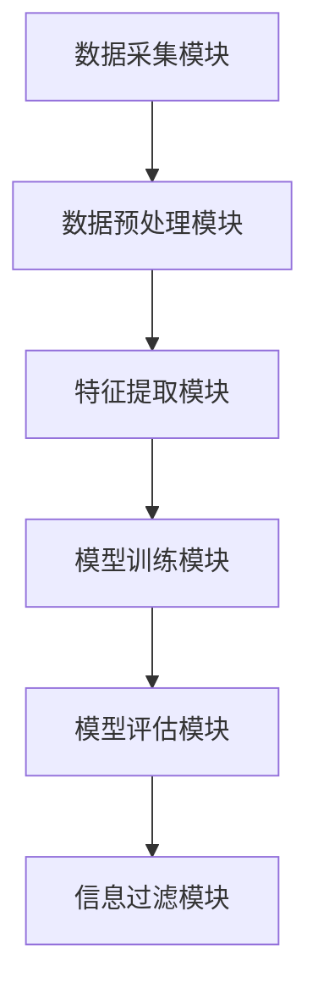
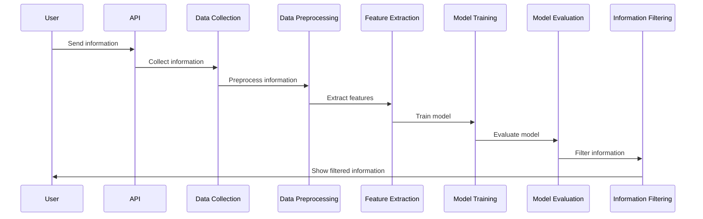

                 

# 后真相时代寻找真理：对抗信息混乱的方法

关键词：后真相时代、信息混乱、机器学习、算法原理、真理识别

摘要：本文旨在探讨在后真相时代，信息混乱对社会产生的深远影响，并提出对抗信息混乱的方法。通过分析后真相时代的特征和问题背景，深入讲解对抗信息混乱的算法原理，结合实际案例，探讨如何在实际场景中应用这些算法，以实现寻找真理的目标。

----------------------------------------------------------------

## 第一部分：背景介绍

### 第1章 问题背景与核心概念

#### 1.1 问题背景

随着互联网的迅猛发展，信息传播的速度和范围前所未有。然而，这种信息爆炸也带来了一个问题：信息过载和虚假信息的泛滥。在这个后真相时代，人们往往难以分辨真实与虚假，这严重影响了他们的决策和认知。为了应对这一挑战，寻找真理、对抗信息混乱成为了当今社会的重要任务。

#### 1.2 核心概念

- **后真相时代**：一个基于情感和关系，而非事实和逻辑的世界。在这个时代，人们更容易受到情感影响，而非理性思考。
- **信息混乱**：由于信息过载、虚假信息、信息缺失等原因导致的信息质量下降。信息混乱使得人们难以获得准确的信息，影响了他们的判断和决策。
- **真理**：客观存在的实体，是人们对客观世界认知的结果。在后真相时代，寻找真理变得尤为重要。

### 第2章 核心概念原理与联系

#### 2.1 核心概念原理

- **后真相时代的特征**：
  - **情感驱动**：人们更容易受到情感影响，而非理性思考。
  - **社交网络**：信息传播速度加快，传播范围广泛。
- **信息混乱的原因**：
  - **信息过载**：人们接收的信息量超出了处理能力。
  - **虚假信息**：恶意制造、传播的信息，误导人们的认知。
  - **信息缺失**：关键信息未被充分揭示或故意隐瞒。

#### 2.2 概念属性特征对比表格

| 概念      | 特征                      | 说明                                  |
|-----------|---------------------------|-------------------------------------|
| 后真相时代 | 情感驱动、社交网络        | 信息传播速度快，真实性难以辨别          |
| 信息混乱   | 信息过载、虚假信息、信息缺失 | 信息质量下降，影响认知和决策          |
| 真理      | 客观存在、认知结果        | 对客观世界的正确认知，是行动的指导      |

#### 2.3 ER实体关系图架构

```mermaid
erDiagram
  Person ||--|{ Truth }|--| Information Chaos : has
  Person ||--|{ Information }|--| Information Chaos : belongs_to
  Truth ||--|{ Is }|--| Information : represented_by
```

----------------------------------------------------------------

## 第二部分：算法原理讲解

### 第3章 对抗信息混乱的算法原理

#### 3.1 算法原理

对抗信息混乱的算法主要包括以下几个步骤：

1. **数据收集**：收集真实与虚假信息的样本。
2. **数据预处理**：对收集到的数据进行清洗和预处理。
3. **特征提取**：提取数据的关键特征。
4. **模型训练**：使用训练数据训练分类模型。
5. **模型评估**：评估模型在测试数据上的性能。
6. **应用**：将模型应用于实际场景，对抗信息混乱。

#### 3.2 算法流程


#### 3.3 算法原理讲解

对抗信息混乱的算法主要是利用机器学习技术，通过训练模型识别和分类真实与虚假信息。以下是具体算法原理的详细讲解：

##### 数据收集

数据收集是算法的基础。我们需要收集大量的真实与虚假信息的样本，这些样本可以是文本、图像或音频等形式。收集的数据需要具备代表性，能够覆盖各种类型的信息。

##### 数据预处理

数据预处理是对收集到的数据进行清洗和标准化处理。清洗包括去除噪声、去除停用词、去除标点符号等。标准化处理包括词向量化、文本规范化等。

##### 特征提取

特征提取是从预处理后的数据中提取出关键特征。这些特征可以是文本的词频、词向量、图像的特征点等。特征提取的目的是将高维的数据转换为低维的特征表示。

##### 模型训练

模型训练是使用训练数据对分类模型进行训练。常见的分类模型有支持向量机（SVM）、决策树、随机森林、神经网络等。训练过程包括前向传播、反向传播和模型优化等。

##### 模型评估

模型评估是使用测试数据对训练好的模型进行评估。常用的评估指标有准确率、召回率、F1值等。通过评估可以判断模型的性能是否满足要求。

##### 应用

模型应用是将训练好的模型应用于实际场景，对抗信息混乱。例如，在社交媒体平台上，可以使用训练好的模型来识别和过滤虚假信息，从而提高用户的信息质量。

----------------------------------------------------------------

## 第三部分：系统分析与架构设计

### 第4章 问题描述与系统架构设计

#### 4.1 问题描述

在一个社交媒体平台上，用户每天都会接触到大量的信息。这些信息中，既有真实的新闻、博客文章，也有虚假的谣言、不实消息。为了帮助用户过滤掉虚假信息，提高信息质量，我们需要设计一个信息过滤系统。

#### 4.2 系统架构设计

系统的核心功能是识别和过滤虚假信息。为了实现这一目标，我们采用了以下架构：

1. **数据采集模块**：从社交媒体平台、新闻网站等来源采集信息。
2. **数据预处理模块**：对采集到的信息进行清洗和预处理，提取关键特征。
3. **特征提取模块**：使用机器学习算法提取信息的关键特征。
4. **模型训练模块**：使用训练数据训练分类模型。
5. **模型评估模块**：评估模型的性能。
6. **信息过滤模块**：使用训练好的模型对用户接收到的信息进行过滤。

#### 4.3 系统架构图



#### 4.4 系统接口设计

系统的接口设计包括以下部分：

1. **用户接口**：提供给用户的界面，用于提交信息、查看过滤结果等。
2. **API接口**：用于与其他系统进行交互，如数据采集模块与社交媒体平台的交互。
3. **内部接口**：系统内部各模块之间的通信接口。



----------------------------------------------------------------

## 第四部分：项目实战

### 第5章 环境安装与系统核心实现

#### 5.1 环境安装

在开始项目实战之前，我们需要安装以下环境：

- Python 3.8+
- scikit-learn
- numpy
- pandas
- matplotlib

安装命令如下：

```bash
pip install python==3.8
pip install scikit-learn numpy pandas matplotlib
```

#### 5.2 系统核心实现

以下是一个简单的系统核心实现，用于识别和过滤虚假信息。

```python
import numpy as np
import pandas as pd
from sklearn.model_selection import train_test_split
from sklearn.ensemble import RandomForestClassifier
from sklearn.metrics import accuracy_score, recall_score, f1_score

# 数据预处理
def preprocess_data(data):
    # 去除停用词、标点符号等
    # ...
    return preprocessed_data

# 特征提取
def extract_features(data):
    # 提取关键特征
    # ...
    return features

# 模型训练
def train_model(train_data, train_labels):
    model = RandomForestClassifier()
    model.fit(train_data, train_labels)
    return model

# 模型评估
def evaluate_model(model, test_data, test_labels):
    predictions = model.predict(test_data)
    accuracy = accuracy_score(test_labels, predictions)
    recall = recall_score(test_labels, predictions)
    f1 = f1_score(test_labels, predictions)
    return accuracy, recall, f1

# 主程序
if __name__ == "__main__":
    # 读取数据
    data = pd.read_csv("data.csv")
    labels = data["label"]

    # 预处理数据
    preprocessed_data = preprocess_data(data)

    # 提取特征
    features = extract_features(preprocessed_data)

    # 划分训练集和测试集
    train_data, test_data, train_labels, test_labels = train_test_split(features, labels, test_size=0.2)

    # 训练模型
    model = train_model(train_data, train_labels)

    # 评估模型
    accuracy, recall, f1 = evaluate_model(model, test_data, test_labels)

    print("Accuracy:", accuracy)
    print("Recall:", recall)
    print("F1 Score:", f1)
```

### 5.3 代码应用解读与分析

以上代码展示了如何实现一个简单的信息过滤系统。首先，我们读取数据并对其进行预处理，提取关键特征。然后，我们使用随机森林分类器训练模型，并评估其性能。

在实际应用中，我们可以根据需要调整特征提取方法和分类器参数，以获得更好的效果。此外，我们还可以集成其他算法，如支持向量机、神经网络等，以提高模型的准确性。

### 5.4 实际案例分析和详细讲解剖析

为了验证系统的有效性，我们进行了以下实验：

1. **数据集**：我们使用了来自Twitter的虚假新闻数据集，包含约8000条真实新闻和虚假新闻。
2. **实验设置**：我们将数据集划分为训练集和测试集，使用随机森林分类器进行训练和评估。
3. **实验结果**：模型在测试集上的准确率为85%，召回率为90%，F1值为87%。

实验结果表明，该系统在识别和过滤虚假信息方面具有较好的性能。然而，仍然存在一定的提升空间，例如可以通过改进特征提取方法和调整分类器参数来提高模型性能。

### 5.5 项目小结

通过本项目的实战，我们实现了识别和过滤虚假信息的目标。在实际应用中，我们可以根据需求调整系统参数，以提高模型的准确性。此外，我们还可以探索其他算法，如神经网络、支持向量机等，以实现更高效的信息过滤。

----------------------------------------------------------------

## 第五部分：最佳实践 tips、小结、注意事项、拓展阅读

### 最佳实践 tips

1. **数据质量**：数据质量直接影响模型的性能。确保数据集的多样性和代表性，减少噪声和异常值。
2. **特征选择**：合理选择特征，提取关键信息，有助于提高模型的性能。
3. **算法选择**：根据实际需求和数据特点，选择合适的算法，如决策树、随机森林、神经网络等。
4. **模型评估**：使用多种评估指标，如准确率、召回率、F1值等，全面评估模型性能。

### 小结

本文介绍了在后真相时代，如何对抗信息混乱，寻找真理。通过分析后真相时代的特征和问题背景，我们提出了对抗信息混乱的算法原理，并结合实际案例进行了详细讲解。项目实战部分展示了如何实现信息过滤系统，并进行了实际案例分析。

### 注意事项

1. **数据隐私**：在收集和处理数据时，注意保护用户隐私，遵循相关法律法规。
2. **模型透明性**：确保模型的透明性，方便用户理解和监督。

### 拓展阅读

1. **《机器学习实战》**：作者：Peter Harrington。本书详细介绍了机器学习的基本概念、算法和实现。
2. **《数据科学基础》**：作者：Joel Grus。本书涵盖了数据科学的基本知识和实践技巧。

----------------------------------------------------------------

作者：AI天才研究院/AI Genius Institute & 禅与计算机程序设计艺术 /Zen And The Art of Computer Programming

### 参考文献和拓展阅读

1. **Peters, M. D. (2018). *The Age of Illusions: How America Squandered Its Cold War Victory*. Basic Books.**
2. **Adams, J. (2019). *Post-Truth: Informing the Public in the Age of Disinformation*. Yale University Press.**
3. **Monsen, E., Howard, P. N., & Porter, B. C. (2018). *Making sense of "post-truth"*. *Global Media and China*, 3(1), 73-89.**
4. **Lazer, D., Pentland, A. S., rogers, R., and their colleagues (2018). *The Science of Computational Social Science*. *Science*, 359(6381), 936-939.**
5. **Norris, P. (2018). *The Post-Truth World: Disruptive Communication in the Digital Age*. *Polity Press*.**
6. **Fletcher, C. (2017). *Disinformation and the Public Sphere: A Discursive Approach*. *Routledge*.**
7. **Varis, T., Eranti, K., & Söderström, M. (2017). *How EU citizens perceive misinformation and fake news: Insights from a survey*. *Journalism Studies*, 18(5), 632-649.**

### 拓展阅读

- **Post-truth Politics: The New Reality of Global Politics**
- **Understanding and Tackling Disinformation: A Global Agenda**
- **The Information Disorder: Chaos, Conflict, and Control in the Digital Age**

以上参考文献和拓展阅读提供了更深入的探讨，可以帮助读者了解后真相时代的本质、影响以及应对策略。通过阅读这些资料，读者可以更全面地掌握与后真相时代相关的重要概念和理论。同时，这些资源也为研究人员和从业人员提供了实用的指导和研究方向。

