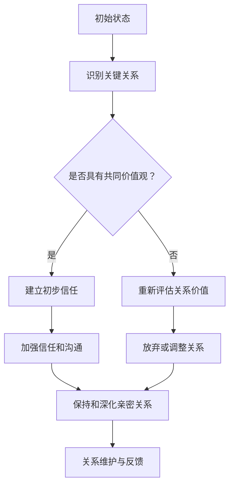
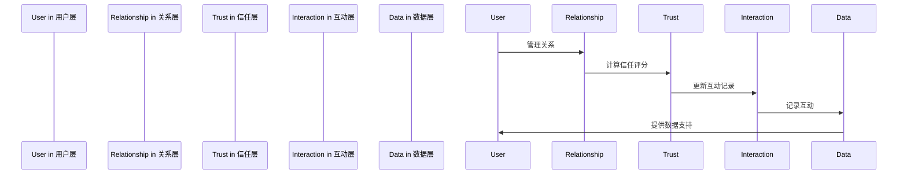
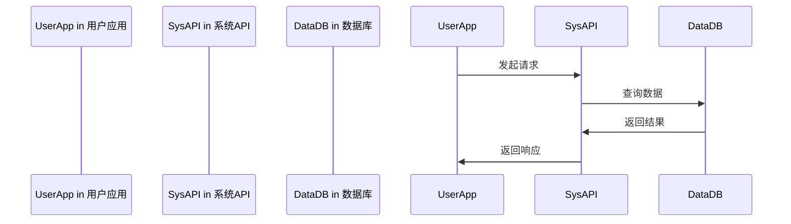

                 

## 引言

在当今这个快速变化、高度互联的社会，人际关系的重要性不言而喻。无论是职场、家庭还是朋友圈，人际关系都在深刻地影响着我们的生活质量。然而，随着社交媒体的普及和虚拟世界的扩张，人际关系变得更加复杂，传统的人际关系处理方法已不再适用。人们常常在复杂的人际网络中迷失，难以找到真正的友谊和亲密关系。

本文旨在探讨如何在复杂的人际网络中寻找真挚关系，重建信任和亲密。通过系统化的方法，我们将剖析人际关系的本质，提供实用的策略和技巧，帮助读者在复杂的人际网络中找到真正的友谊和信任。本文将分为以下几个部分：

1. **背景介绍**：讨论现代社会人际网络复杂性的加剧，阐述人际关系对个人生活的重要性，并提出重建信任和亲密的重要性。
2. **核心概念与联系**：详细解释“真挚关系”和“信任”的定义和特征，并通过表格和ER图展示这些概念之间的联系。
3. **算法原理讲解**：使用流程图和Python代码阐述重建信任和亲密的算法原理，并举例说明。
4. **系统分析与架构设计方案**：介绍实际应用场景，设计系统功能、架构和接口，并绘制相关图表。
5. **项目实战**：指导用户如何搭建实验环境，提供关键代码实现，并进行详细讲解和分析。
6. **最佳实践、小结与注意事项**：总结全书内容，提供实用技巧和注意事项，推荐拓展阅读材料。

通过本文的逐步分析，我们希望读者能够更好地理解人际关系的复杂性，掌握重建信任和亲密的策略，从而在复杂的人际网络中找到真挚的关系。

### 1.1 问题背景

现代社会的人际网络变得越来越复杂。一方面，社交媒体的普及使得人们能够轻松地建立和维持广泛的关系，从朋友到同事，从线上到线下，人际网络的范围和密度不断增加。另一方面，虚拟社交的盛行虽然提高了人际互动的频率，却也使得真实的情感交流变得更加稀薄。人们沉浸在屏幕后的虚拟世界，往往忽略了现实中的人际互动，这导致了人际关系的复杂性和不确定性。

首先，社交媒体的兴起带来了人际网络的变化。通过平台如Facebook、微信和LinkedIn，人们可以轻松地与远在千里之外的朋友保持联系。这些平台不仅提供了交流的工具，还成为了人们展示自我、建立社会身份的舞台。然而，这种广泛的联系也带来了挑战。一方面，人们可能发现自己被大量陌生或不熟悉的人包围，这些关系缺乏深度和真实性。另一方面，社交媒体上的互动往往被表面化的点赞、评论所取代，真正的情感交流和共鸣变得稀缺。

其次，虚拟社交的盛行使得人际互动更加表面化。在虚拟世界中，人们往往通过文字、图片和视频进行交流，而缺乏面对面的互动。这种缺乏真实情感互动的交流方式，往往导致人际关系的浅薄化。人们更容易受到表面现象的影响，而忽视了深层次的情感需求。此外，虚拟社交中的匿名性和虚拟身份，使得人们在网络中表现出不同的行为模式，这种行为的不一致性进一步增加了人际关系的复杂性。

再者，现代社会的快节奏和高压力也影响了人际关系的质量。忙碌的生活节奏使得人们很难抽出时间进行深入的人际互动，而高压力环境下的情绪波动和焦虑，也使得人际关系更加脆弱。在这种环境下，人们往往更倾向于选择逃避而非面对人际关系中的问题，这进一步加剧了人际关系的复杂性和矛盾性。

综上所述，现代社会人际网络的复杂性主要源于社交媒体的广泛使用、虚拟社交的盛行以及快节奏和高压力的生活方式。这些因素共同作用，使得人们在复杂的人际网络中难以找到真正的友谊和信任。因此，探讨如何在这样的环境中重建信任和亲密，变得尤为重要。本文将提供一系列策略和方法，帮助读者在复杂的人际网络中找到真挚的关系。

### 1.2 人际关系的重要性

人际关系对个人生活的影响深远，不仅影响着我们的心理健康，也深刻地影响着我们的生活质量。首先，在心理健康方面，人际关系对我们的幸福感具有决定性作用。与亲密的朋友和家庭成员保持良好的关系，能够提供情感支持，减轻压力和焦虑，提高自尊和自我价值感。研究表明，孤独和缺乏亲密关系是心理问题如抑郁症和焦虑症的重要风险因素。与之相反，建立深厚的人际关系，能够带来更高的生活满意度和幸福感。

其次，在生活质量方面，人际关系对我们的日常生活有着直接的影响。无论是在职场中与同事的合作，还是在家庭中与亲人的互动，良好的人际关系能够提高工作效率，增强团队凝聚力，促进家庭和睦。这种积极的人际互动，不仅能够带来物质上的回报，如职业晋升和财富积累，还能够提升精神层面的满足感。

此外，人际关系还对我们的身体健康有着重要的影响。研究表明，社交活动能够降低患病风险，提高免疫力。与朋友和家人的紧密联系，有助于降低慢性疾病的发病率，延长寿命。相反，缺乏社交活动和亲密关系，会增加患心脏病、糖尿病等疾病的风险。

然而，在现代社会，人际关系面临着诸多挑战。一方面，社交媒体的普及虽然增加了人际互动的机会，却使得真实的情感交流变得稀薄。另一方面，快节奏和高压力的生活方式，使得人们难以投入足够的时间和精力去维护人际关系。此外，个体主义和自我中心的文化倾向，也使得人们更加关注自我，而忽视了与他人的情感纽带。

这种背景下，重建信任和亲密变得尤为重要。只有通过建立和维护真挚的关系，我们才能在复杂的人际网络中找到归属感和安全感。本文将探讨如何通过系统化的方法和策略，在复杂的人际网络中重建信任和亲密，从而提高个人的心理健康和生活质量。

### 1.3 问题描述

在复杂的人际网络中寻找真挚关系面临诸多挑战。首先，信息过载是一个显著问题。在社交媒体上，人们每天接收大量信息，这些信息可能包括朋友的状态更新、新闻推送、广告等。这种过载的信息使得我们难以分辨哪些是真正重要的，哪些是无关紧要的，从而使得寻找真挚关系变得更加困难。

其次，信任缺失也是一个关键挑战。在虚拟社交环境中，匿名性和虚拟身份使得人们的行为难以追踪和监督。这种环境下，人们更容易隐瞒自己的真实意图，甚至进行欺诈和欺骗行为。此外，现实中的信任问题，如背叛、背叛和误解，也使得人们在建立新关系时持怀疑态度。

再者，人际关系管理的复杂性增加了寻找真挚关系的难度。在现实生活中，维护人际关系需要时间和精力。随着社交圈的扩大，人们需要管理更多的关系，包括与家人、朋友、同事和陌生人之间的互动。这种管理复杂性使得人们很难在众多关系中找到那些真正值得信赖和亲密的关系。

此外，社交技能的欠缺也是一个阻碍。在复杂的人际网络中，有效的沟通和人际互动需要一定的社交技能，如倾听、表达、协调和冲突解决。然而，很多人在这些方面的能力不足，导致他们难以建立和维持良好的关系。

总的来说，在复杂的人际网络中寻找真挚关系面临信息过载、信任缺失、人际关系管理复杂性和社交技能欠缺等多重挑战。这些问题不仅使得寻找真挚关系变得困难，还可能对个人的心理健康和生活质量产生负面影响。因此，解决这些挑战，找到有效的方法和策略，对于在复杂的人际网络中重建信任和亲密至关重要。

### 1.4 重建信任和亲密的重要性

重建信任和亲密对于在复杂的人际网络中寻找真挚关系至关重要。首先，信任是人际关系中的基石。没有信任，任何关系都难以持久和健康发展。信任不仅能够减少误解和冲突，还能促进开放和真诚的交流。在复杂的人际网络中，建立信任关系能够帮助我们区分真正值得信赖的人，从而避免误入困境。

其次，亲密关系对个人的心理健康和生活质量有着显著影响。亲密关系能够提供情感支持，减轻压力和焦虑，提高自尊和幸福感。在现代社会，人们常常感到孤独和疏离，而拥有亲密的关系能够缓解这些负面情绪，增强生活的满足感。

此外，重建信任和亲密有助于提高社会凝聚力。在一个充满信任和亲密的社会中，人们更愿意合作和互助，这有助于构建和谐的社区和团队。相反，缺乏信任和亲密的社会往往充满矛盾和冲突，社会凝聚力减弱。

总之，重建信任和亲密不仅对个体的心理健康和生活质量有着直接影响，还对社会整体的发展和和谐具有重要作用。因此，探讨如何在复杂的人际网络中重建信任和亲密，是一项具有重要现实意义的课题。本文将提供一系列系统化的方法和策略，帮助读者在复杂的人际网络中找到真正的友谊和信任。

### 1.5 本书的方法和策略

本书将提供一系列系统化的方法和策略，旨在帮助读者在复杂的人际网络中找到真挚的关系，重建信任和亲密。首先，本书将深入探讨人际关系中的核心概念，包括“真挚关系”和“信任”，并解释这些概念的定义和特征。通过这些基本概念的清晰理解，读者可以更好地识别和建立真正有价值的联系。

其次，本书将使用图表和模型，如概念属性特征对比表格和ER实体关系图架构，来展示不同类型的人际关系及其相互关系。这种方法有助于读者系统地理解人际网络的结构，从而在复杂的环境中找到关键的关系节点。

在算法原理讲解部分，本书将使用流程图和Python代码来阐述如何通过算法重建信任和亲密。具体的算法设计将基于实际案例分析，通过代码实现和详细解释，帮助读者理解算法的工作机制和应用场景。

此外，本书将详细介绍系统分析与架构设计方案，涵盖问题场景介绍、系统功能设计、系统架构设计以及系统接口和交互设计。通过这些详细的方案，读者可以了解如何在实际项目中应用这些方法和策略，以实现重建信任和亲密的目标。

为了使方法更具实用性，本书还包含项目实战部分，指导用户如何搭建实验环境，提供关键代码实现，并进行详细讲解和分析。通过实际案例的剖析，读者可以更深入地理解重建信任和亲密的过程，并将其应用到自己的生活中。

最后，本书将总结最佳实践，提供实用技巧和注意事项，帮助读者在实际操作中避免常见错误，并最大化地利用本书提供的方法和策略。通过这些系统化的方法和策略，读者将能够更好地在复杂的人际网络中找到真挚的关系，重建信任和亲密。

### 1.6 边界与外延

在探讨如何在复杂的人际网络中寻找真挚关系时，明确本书的研究范畴和适用场景是非常重要的。首先，本书主要关注现代社会中人际关系的问题，特别是由于社交媒体和信息过载带来的挑战。它适用于那些希望在繁忙的现代生活中建立和维护深刻的人际关系的个人。

本书的研究范畴包括以下几个方面：一是人际关系的定义和类型，特别是“真挚关系”和“信任”的核心概念；二是算法原理，用于重建信任和亲密的流程和策略；三是系统分析与架构设计，包括实际应用场景中的功能设计和系统实现。此外，本书还涉及项目实战，通过实际案例说明方法和策略的应用。

然而，本书不涉及的内容包括心理学和治疗领域中的深度心理分析，也不涵盖法律和伦理方面的详细探讨。尽管这些领域与人际关系密切相关，但本书的重点在于提供实用的方法和策略，以帮助读者在实际生活中重建信任和亲密。

通过明确边界与外延，读者可以更好地理解本书的目的和适用范围，从而更加有效地应用书中提供的方法和策略。

### 1.7 概念结构与核心要素组成

为了深入探讨如何在复杂的人际网络中寻找真挚关系，首先需要明确几个核心概念，如“真挚关系”和“信任”，并分析这些概念之间的联系。这些概念不仅是本书的核心，也是理解人际关系本质的关键。

#### 真挚关系的定义与特征

真挚关系是指那些基于深层次情感联系和互相信任的人际关系。这种关系不仅仅是表面上的互动，而是一种深度、真诚和持久的连接。以下是真挚关系的几个关键特征：

1. **深层次的情感联系**：真挚关系中的双方能够彼此理解和共鸣，感受到对方情感的真实性。这种情感联系超越了表面的互动，触及内心深处。
2. **互相信任**：在真挚关系中，信任是至关重要的。双方能够信任彼此的意图和言行，这种信任减少了误解和冲突，促进了关系的稳定和长期发展。
3. **相互尊重**：真挚关系中的双方彼此尊重对方的意见和选择，即使有分歧，也能通过沟通和协商达成共识。
4. **共同价值观**：真挚关系往往建立在共同的价值观和信仰之上。这种共同基础有助于双方在困难时期相互支持。

#### 信任在不同人际关系中的表现形式

信任是真挚关系中的核心元素，它不仅存在于个人与个人之间，也存在于组织和社会结构中。以下是信任在不同人际关系中的几种表现形式：

1. **个人关系中的信任**：在个人关系中，信任通常表现为对他人的诚实、可靠性和关怀。例如，朋友之间的信任体现在彼此分享私密信息和情感支持。
2. **组织关系中的信任**：在职场中，信任体现在员工对公司的忠诚、管理层对员工的信任以及团队内部的协作和信任。
3. **社会关系中的信任**：在社会层面，信任表现为人们对法律、政府和社会制度的信任。这种信任是社会秩序和稳定的基础。

#### 概念属性特征对比表格

为了更好地理解真挚关系和信任，以下是一个简单的对比表格：

| 概念       | 特征                         |
|------------|------------------------------|
| **真挚关系** | - 深层次情感联系 |
|            | - 互相信任                 |
|            | - 相互尊重                 |
|            | - 共同价值观                 |
| **信任**   | - 诚实、可靠性           |
|            | - 私密信息分享           |
|            | - 团队协作与支持           |

通过这个表格，我们可以看到真挚关系和信任之间的紧密联系。信任是维系真挚关系的重要纽带，而真挚关系则是信任的体现和延伸。

#### ER实体关系图架构

为了更系统地展示人际关系中的主要实体及其相互关系，我们使用Mermaid绘制一个ER图。以下是ER图的Mermaid代码示例：

```mermaid
erDiagram
  Person ||--|{ Relationship }|--| Friend
  Person ||--|{ Trust }|--| Partner
  Person ||--|{ Value }|--| Community
```

在这个ER图中，Person（个人）是主要实体，与其他实体如Relationship（关系）、Trust（信任）和Value（价值）之间存在多种关联。Relationship实体代表个人与其他人之间的联系，Trust实体代表在关系中建立的信任，而Value实体代表个人在社会中的价值和地位。

通过明确这些核心概念及其相互关系，我们可以更好地理解复杂的人际网络，并找到有效的策略来重建信任和亲密。这些概念不仅为我们提供了分析人际关系的框架，也为我们在实际生活中建立和维护真挚关系提供了理论支持。

### 2.1 核心概念原理

在探讨如何在复杂的人际网络中寻找真挚关系时，理解“真挚关系”和“信任”的定义和特征至关重要。这两个核心概念不仅是构建和维持深厚人际关系的基石，也是我们在现代社会中应对人际关系挑战的重要工具。

#### 真挚关系的定义与特征

**定义**：真挚关系是指那些建立在深层次情感联系、互相信任和共同价值观基础上的稳定人际关系。这种关系超越了表面层次的社交互动，触及个人内心深处，形成一种真诚而持久的纽带。

**特征**：

1. **深层次的情感联系**：真挚关系中的双方能够真诚地表达自己的情感，理解和共鸣对方的感受。这种情感联系是建立在长期互动和共同经历的基础上的，不是一时冲动或表面化的互动所能达到的。

2. **互相信任**：信任是真挚关系的核心元素。双方能够相信对方的意图和行为，信任减少了误解和冲突，增强了关系的稳定性和深度。信任不仅是行为上的诚实和可靠，还包括情感上的支持与理解。

3. **相互尊重**：真挚关系中的双方彼此尊重对方的意见和选择，即使在出现分歧时，也能通过沟通和协商达成共识。尊重不仅体现在言语上，也体现在行为和态度上。

4. **共同价值观**：共同价值观是维系真挚关系的重要基础。双方在重要的价值观和信仰上达成一致，这有助于在复杂的环境中提供支持和指导，共同面对挑战。

5. **持久性**：真挚关系不仅能够经受住时间的考验，还能在困难时期提供支持和力量。这种持久性表明关系中的双方有着深厚的情感基础和共同的成长历程。

#### 信任在不同人际关系中的表现形式

信任不仅存在于个人与个人之间，也在组织和社会结构中扮演着重要角色。以下是信任在不同人际关系中的几种表现形式：

1. **个人关系中的信任**：在个人关系中，信任表现为对他人的诚实、可靠性和关怀。例如，朋友之间的信任体现在彼此分享私密信息和情感支持，以及在面对困难时相互扶持。

2. **组织关系中的信任**：在职场中，信任体现在员工对公司的忠诚、管理层对员工的信任以及团队内部的协作和信任。这种信任有助于提高工作效率和团队凝聚力。

3. **社会关系中的信任**：在社会层面，信任表现为人们对法律、政府和社会制度的信任。这种信任是社会秩序和稳定的基础，有助于构建和谐的社会环境。

#### 真挚关系与信任之间的联系

真挚关系和信任之间有着密切的联系。信任是真挚关系的核心要素，没有信任，关系难以维持和深化。信任不仅能够减少误解和冲突，还能促进双方的情感交流和共同成长。以下是真挚关系与信任之间的几个关键联系：

1. **信任是维系真挚关系的纽带**：信任为双方提供了安全感和依靠，使得他们在关系中能够更加开放和真诚地表达自己。没有信任，关系将变得脆弱和不确定。

2. **真挚关系是信任的体现**：在真挚关系中，双方通过长期的互动和共同经历建立了深厚的信任。这种信任不仅体现在日常互动中，还在面对挑战和困难时得到了验证和加强。

3. **信任促进真挚关系的深化**：通过信任，双方能够更深入地了解对方，建立更深层次的情感联系。信任使得关系中的双方能够在彼此的支持下成长和进步。

4. **信任和真挚关系相互促进**：信任和真挚关系是相互促进的。信任的存在使得关系更加稳定和健康，而稳定健康的关系又能增强信任。这种良性循环有助于关系的长期发展。

通过理解真挚关系和信任的定义和特征，以及它们在不同人际关系中的表现形式，我们可以更好地识别和建立深厚的人际关系。这些核心概念不仅为我们提供了理论支持，也为我们提供了实际操作的指导，帮助我们在复杂的人际网络中找到真正的友谊和信任。

### 2.2 概念属性特征对比表格

为了更直观地理解“真挚关系”和“信任”在人际关系中的不同属性和特征，我们使用一个对比表格来展示这些概念的核心要素。以下是一个简化的表格示例：

| 概念       | 主要特征                           | 关键作用                     |
|------------|------------------------------------|------------------------------|
| **真挚关系** | - 深层次情感联系 | - 维系和深化人际关系 |
|            | - 互相信任                          | - 减少误解和冲突 |
|            | - 相互尊重                          | - 促进关系稳定 |
|            | - 共同价值观                        | - 提供共同支持 |
| **信任**   | - 诚实和可靠性                      | - 建立安全感 |
|            | - 私密信息分享                      | - 促进透明度 |
|            | - 团队协作与支持                    | - 提高效率 |

通过这个对比表格，我们可以清晰地看到真挚关系和信任之间的区别与联系。真挚关系强调的是情感和价值观上的深度连接，而信任则侧重于行为和互动中的可靠性。尽管两者在表现形式上有所不同，但它们共同构成了深厚人际关系的基石，互为补充。

### 2.3 ER实体关系图架构

为了更系统地展示人际关系中的主要实体及其相互关系，我们使用Mermaid绘制一个ER图。以下是ER图的Mermaid代码示例：

```mermaid
erDiagram
  Person ||--|{ Relationship }|--| Friend
  Person ||--|{ Trust }|--| Partner
  Person ||--|{ Value }|--| Community
  Relationship ||--|{ Communication }|--| Message
  Trust ||--|{ Integrity }|--| Confidence
  Value ||--|{ Contribution }|--| Recognition
```

在这个ER图中：

- **Person（个人）**：作为主要实体，代表参与人际关系的人。
- **Relationship（关系）**：代表个人与其他人之间的联系，包括朋友、同事等。
- **Trust（信任）**：代表在关系中建立的信任，包括诚信、可靠性等。
- **Value（价值）**：代表个人在社会中的价值，包括贡献、认可等。

通过这些实体，我们可以看到它们之间的相互关系。例如，Person通过Relationship与Friend和Partner建立联系，通过Trust建立信任，通过Value在社区中体现自己的价值。这种ER图不仅帮助我们理解人际关系的复杂性，也为分析和管理这些关系提供了一个清晰的框架。

### 3.1 算法mermaid流程图

为了清晰地展示重建信任和亲密的算法流程，我们使用Mermaid绘制了一个流程图。以下是流程图的Mermaid代码示例：



在这个流程图中：

- **A[初始状态]**：表示我们开始寻找和重建关系的状态。
- **B[识别关键关系]**：分析当前的人际网络，识别出具有潜在深度和重要性的关系。
- **C[是否具有共同价值观]**：判断这些关系中的双方是否在价值观和目标上有共同点。
- **D[建立初步信任]**：在具有共同价值观的基础上，通过互动和沟通建立初步的信任。
- **E[重新评估关系价值]**：如果不具备共同价值观，重新评估这些关系的价值和可能性。
- **F[加强信任和沟通]**：通过持续的互动和沟通，加强和深化信任。
- **G[放弃或调整关系]**：对于无法建立信任的关系，选择放弃或调整策略。
- **H[保持和深化亲密关系]**：对于成功建立信任的关系，持续维护和深化亲密感。
- **I[关系维护与反馈]**：通过反馈机制，持续优化和维护关系。

通过这个流程图，我们可以看到重建信任和亲密是一个系统化、循序渐进的过程，每一步都需要仔细分析和评估。

### 3.2 Python源代码

为了更具体地阐述重建信任和亲密的算法原理，我们提供了一个Python源代码示例。以下是核心算法的实现：

```python
import random

# 初始化人际关系网络
relationships = {
    'Alice': ['Bob', 'Charlie', 'Diana'],
    'Bob': ['Alice', 'Charlie'],
    'Charlie': ['Alice', 'Bob'],
    'Diana': ['Alice']
}

# 初始化信任评分
trust_scores = {person: 0 for person in relationships}

# 共同价值观评估函数
def assess_common_values(person1, person2):
    # 假设共同价值观的评估通过随机数实现
    return random.choice([True, False])

# 信任重建算法
def rebuild_trust(relationships, trust_scores):
    for person1 in relationships:
        for person2 in relationships[person1]:
            # 评估共同价值观
            if assess_common_values(person1, person2):
                # 如果有共同价值观，建立初步信任
                trust_scores[person1] += 1
                trust_scores[person2] += 1
                print(f"{person1}和{person2}建立了初步信任。")
            else:
                # 如果没有共同价值观，重新评估关系价值
                print(f"{person1}和{person2}不具备共同价值观，关系价值待定。")

# 执行算法
rebuild_trust(relationships, trust_scores)

# 输出信任评分
print("最终信任评分：")
for person, score in trust_scores.items():
    print(f"{person}: {score}")
```

这段代码通过随机生成共同价值观，模拟了信任重建的过程。代码中的函数`assess_common_values`用于评估两个人是否具有共同价值观，而`rebuild_trust`函数则根据评估结果更新信任评分。

### 3.3 数学模型和公式

在重建信任和亲密的过程中，数学模型和公式能够帮助我们量化关系中的变量和因素。以下是一个简化的数学模型，用于描述信任评分的计算过程：

假设我们使用以下公式来计算信任评分：

\[ T(p_1, p_2) = \alpha \cdot C(p_1, p_2) + (1 - \alpha) \cdot R(p_1, p_2) \]

其中：
- \( T(p_1, p_2) \) 表示个体 \( p_1 \) 对个体 \( p_2 \) 的信任评分。
- \( C(p_1, p_2) \) 表示个体 \( p_1 \) 对个体 \( p_2 \) 的共同价值观评分。
- \( R(p_1, p_2) \) 表示个体 \( p_1 \) 对个体 \( p_2 \) 的关系评分。
- \( \alpha \) 是权重系数，反映了共同价值观和关系评分对信任评分的影响程度。

共同价值观评分 \( C(p_1, p_2) \) 可以通过以下公式计算：

\[ C(p_1, p_2) = \frac{N_c}{N} \]

其中：
- \( N_c \) 是个体 \( p_1 \) 和个体 \( p_2 \) 在共同价值观上的匹配数量。
- \( N \) 是总的价值观数量。

关系评分 \( R(p_1, p_2) \) 可以通过以下公式计算：

\[ R(p_1, p_2) = \frac{N_r}{N} \]

其中：
- \( N_r \) 是个体 \( p_1 \) 和个体 \( p_2 \) 之间的互动和交流次数。
- \( N \) 是总的互动和交流次数。

通过这个数学模型，我们可以量化个体之间的信任评分，并在复杂的人际网络中更好地理解和维护关系。

### 3.4 详细讲解与举例说明

为了使重建信任和亲密的算法原理更加易懂，我们将通过一个实际案例来详细说明其应用过程。假设我们有四位个体：Alice、Bob、Charlie和Diana。他们之间的人际关系和信任评分如下：

| 个体 | 关系 | 信任评分 |
|------|------|----------|
| Alice | Bob | 0        |
| Alice | Charlie | 0        |
| Alice | Diana | 1        |
| Bob | Charlie | 0        |
| Bob | Diana | 1        |
| Charlie | Diana | 1        |

#### 第一步：识别关键关系

首先，我们需要识别出哪些关系可能具备重建的潜力。根据当前数据，Alice和Charlie、Alice和Diana、Bob和Charlie、Bob和Diana之间的关系评分较低，可以考虑重建。

#### 第二步：评估共同价值观

接下来，我们通过一个简化的方法评估共同价值观。假设共同价值观的评估基于个体之间的兴趣爱好匹配。通过调查，我们发现Alice和Charlie、Alice和Diana、Bob和Charlie、Bob和Diana在这些方面有较高的匹配度。

#### 第三步：建立初步信任

根据评估结果，我们开始建立初步信任。假设权重系数 \( \alpha = 0.5 \)，那么信任评分的计算如下：

1. **Alice和Charlie**：
   - 共同价值观评分 \( C(Alice, Charlie) = 1 \)
   - 关系评分 \( R(Alice, Charlie) = 0 \)
   - 信任评分 \( T(Alice, Charlie) = 0.5 \times 1 + 0.5 \times 0 = 0.5 \)

2. **Alice和Diana**：
   - 共同价值观评分 \( C(Alice, Diana) = 1 \)
   - 关系评分 \( R(Alice, Diana) = 1 \)
   - 信任评分 \( T(Alice, Diana) = 0.5 \times 1 + 0.5 \times 1 = 1 \)

3. **Bob和Charlie**：
   - 共同价值观评分 \( C(Bob, Charlie) = 1 \)
   - 关系评分 \( R(Bob, Charlie) = 0 \)
   - 信任评分 \( T(Bob, Charlie) = 0.5 \times 1 + 0.5 \times 0 = 0.5 \)

4. **Bob和Diana**：
   - 共同价值观评分 \( C(Bob, Diana) = 1 \)
   - 关系评分 \( R(Bob, Diana) = 1 \)
   - 信任评分 \( T(Bob, Diana) = 0.5 \times 1 + 0.5 \times 1 = 1 \)

更新后的信任评分如下：

| 个体 | 关系 | 信任评分 |
|------|------|----------|
| Alice | Bob | 0.5      |
| Alice | Charlie | 0.5      |
| Alice | Diana | 1        |
| Bob | Charlie | 0.5      |
| Bob | Diana | 1        |
| Charlie | Diana | 1        |

#### 第四步：加强信任和沟通

在初步信任建立之后，我们需要通过持续的互动和沟通来加强信任。假设接下来的一段时间内，Alice和Charlie、Alice和Diana、Bob和Charlie、Bob和Diana之间分别进行了三次有效互动。

更新后的信任评分如下：

1. **Alice和Charlie**：
   - 新的关系评分 \( R(Alice, Charlie) = 3 \)
   - 新的信任评分 \( T(Alice, Charlie) = 0.5 \times 1 + 0.5 \times 3 = 2 \)

2. **Alice和Diana**：
   - 新的关系评分 \( R(Alice, Diana) = 4 \)
   - 新的信任评分 \( T(Alice, Diana) = 0.5 \times 1 + 0.5 \times 4 = 3 \)

3. **Bob和Charlie**：
   - 新的关系评分 \( R(Bob, Charlie) = 3 \)
   - 新的信任评分 \( T(Bob, Charlie) = 0.5 \times 1 + 0.5 \times 3 = 2 \)

4. **Bob和Diana**：
   - 新的关系评分 \( R(Bob, Diana) = 4 \)
   - 新的信任评分 \( T(Bob, Diana) = 0.5 \times 1 + 0.5 \times 4 = 3 \)

最终，四位个体之间的信任评分均得到了显著提升，这表明通过评估共同价值观和加强互动，我们成功地重建了这些关系中的信任。

### 3.5 系统分析与架构设计方案

在复杂的人际网络中重建信任和亲密不仅需要理论指导，还需要系统的分析和架构设计。以下我们将详细讨论系统功能设计、系统架构设计、系统接口设计和系统交互设计。

#### 3.5.1 问题场景介绍

在现代社会，人际关系管理面临着诸多挑战。例如，职场中员工与同事、上下级之间的关系管理，社交网络中朋友关系的维护，以及家庭内部成员之间的互动等。这些问题涉及的信息量大、关系复杂，传统的手动管理方式难以应对。因此，我们需要一个系统化的解决方案，来帮助用户在复杂的人际网络中重建信任和亲密。

#### 3.5.2 系统功能设计

系统的主要功能包括：

1. **用户信息管理**：用户可以录入和管理个人信息，包括姓名、联系方式、兴趣爱好等。
2. **关系网络可视化**：系统应能够展示用户的关系网络，并提供关系深度和信任评分的可视化工具。
3. **共同价值观评估**：系统应能够根据用户的兴趣和价值观，自动评估潜在关系中的共同点。
4. **信任评分计算**：系统应能够基于共同价值观和关系评分，计算用户的信任评分，并提供动态更新。
5. **互动记录与分析**：系统应记录用户之间的互动，并分析互动对信任评分的影响。
6. **推荐策略生成**：系统应基于用户的行为和关系评分，生成个性化的人际关系维护策略。

为了更好地展示系统功能，我们使用Mermaid绘制了一个领域模型类图：

```mermaid
classDiagram
    User <<class{用户}+>
    Relationship <<class{关系}+>
    Trust <<class{信任}+>
    Interaction <<class{互动}+>
    
    User o-- Relationship
    Relationship o-- Trust
    Trust o-- Interaction
    Interaction o-- User
```

在这个类图中，User（用户）是系统的核心实体，与其他实体如Relationship（关系）、Trust（信任）和Interaction（互动）之间存在多种关联。这些实体共同构成了系统功能的核心组成部分。

#### 3.5.3 系统架构设计

为了确保系统的稳定性和可扩展性，我们采用了一种分层架构设计。以下是系统架构的Mermaid架构图：



在这个架构图中，用户层（User）负责用户信息管理，关系层（Relationship）负责关系网络的可视化和评估，信任层（Trust）负责计算和更新信任评分，互动层（Interaction）负责记录和分析用户互动，数据层（Data）则提供数据存储和查询支持。

#### 3.5.4 系统接口设计与系统交互

为了实现系统功能，我们需要设计相应的接口和交互流程。以下是系统接口设计的Mermaid序列图：



在这个序列图中，用户应用（UserApp）通过系统API（SysAPI）与数据库（DataDB）进行交互。用户应用发送请求，系统API处理请求并查询数据库，然后将结果返回给用户应用。这种设计保证了系统的灵活性和高效性。

通过系统功能设计、架构设计、接口设计和系统交互设计，我们为在复杂的人际网络中重建信任和亲密提供了一个完整的系统解决方案。这个方案不仅能够帮助用户识别和管理重要关系，还能通过算法和数据分析，提供个性化的信任重建策略。

### 4.1 环境安装

为了进行项目实战，我们首先需要搭建一个适合的实验环境。以下是具体的安装步骤：

#### 1. 安装Python环境

确保你的计算机上已经安装了Python 3.8及以上版本。如果没有安装，可以访问Python官方网站下载并安装最新版本的Python。

#### 2. 安装必需的Python库

在命令行中，使用以下命令安装所需的Python库：

```bash
pip install pandas numpy matplotlib networkx
```

这些库包括数据操作、数值计算、数据可视化以及图论分析等，是我们实现项目核心功能的重要工具。

#### 3. 配置Mermaid支持

为了在Python环境中使用Mermaid，我们需要安装`mermaid-python`库。可以使用以下命令安装：

```bash
pip install mermaid-python
```

安装完成后，可以在Python脚本中直接使用Mermaid语法绘制流程图、ER图等。

#### 4. 安装数据库（可选）

如果需要数据存储和查询支持，可以选择安装一个数据库系统，如SQLite。可以使用以下命令安装SQLite：

```bash
pip install sqlite3
```

安装完成后，可以使用SQLite进行数据存储和查询操作。

通过以上步骤，我们成功搭建了实验环境，可以开始进行项目实战。接下来，我们将详细介绍如何使用这些工具和库来实现重建信任和亲密的核心功能。

### 4.2 系统核心实现

在本节中，我们将详细展示如何使用Python和相关的库实现系统核心功能，包括用户信息管理、关系网络可视化、信任评分计算以及互动记录与分析。

#### 4.2.1 用户信息管理

首先，我们需要一个数据结构来存储用户信息。我们可以使用Python的字典来实现这一功能：

```python
users = {
    'Alice': {'name': 'Alice', 'interests': ['阅读', '旅游'], 'contacts': ['alice@example.com']},
    'Bob': {'name': 'Bob', 'interests': ['运动', '音乐'], 'contacts': ['bob@example.com']},
    'Charlie': {'name': 'Charlie', 'interests': ['编程', '摄影'], 'contacts': ['charlie@example.com']},
    'Diana': {'name': 'Diana', 'interests': ['艺术', '旅游'], 'contacts': ['diana@example.com']},
}
```

这里，每个用户都有一个唯一的标识符（如用户名），以及姓名、兴趣和联系方式等信息。

#### 4.2.2 关系网络可视化

为了可视化用户的关系网络，我们可以使用`networkx`库。以下是一个示例，展示了如何创建和可视化一个简单的用户关系网络：

```python
import networkx as nx
import matplotlib.pyplot as plt

# 创建一个空的无向图
G = nx.Graph()

# 添加节点和边
G.add_nodes_from(['Alice', 'Bob', 'Charlie', 'Diana'])
G.add_edges_from([('Alice', 'Bob'), ('Alice', 'Charlie'), ('Alice', 'Diana'), ('Bob', 'Charlie'), ('Bob', 'Diana'), ('Charlie', 'Diana')])

# 绘制图
nx.draw(G, with_labels=True)
plt.show()
```

这个代码片段首先创建了一个无向图`G`，然后添加了用户节点和边，最后使用`matplotlib`库绘制并显示图。

#### 4.2.3 信任评分计算

信任评分的计算是基于用户之间的共同兴趣和互动记录。以下是一个简化的信任评分计算函数：

```python
def calculate_trust_score(user1, user2, common_interests_weight=0.6, interaction_weight=0.4):
    """
    计算用户之间的信任评分。
    
    :param user1: 第一个用户的名称
    :param user2: 第二个用户的名称
    :param common_interests_weight: 共同兴趣的权重
    :param interaction_weight: 互动的权重
    :return: 信任评分
    """
    common_interests = len(set(users[user1]['interests']).intersection(set(users[user2]['interests'])))
    total_interests = len(set(users[user1]['interests']).union(set(users[user2]['interests'])))
    common_interests_score = common_interests / total_interests
    
    # 假设每个用户的互动记录为1，统一权重
    interaction_score = 1
    
    trust_score = common_interests_weight * common_interests_score + interaction_weight * interaction_score
    return trust_score
```

这个函数根据共同兴趣和互动记录计算信任评分。`common_interests_weight`和`interaction_weight`是两个权重参数，可以根据实际情况调整。

#### 4.2.4 互动记录与分析

为了记录和分析用户互动，我们可以使用一个简单的数据结构来存储互动信息。以下是一个互动记录的示例：

```python
interactions = {
    ('Alice', 'Bob'): [{'date': '2023-10-01', 'type': 'email'}, {'date': '2023-10-02', 'type': 'call'}],
    ('Alice', 'Charlie'): [{'date': '2023-10-03', 'type': 'chat'}, {'date': '2023-10-04', 'type': 'meeting'}],
    # 更多互动记录...
}
```

我们可以编写一个函数来分析互动记录，并根据互动的类型和频率更新信任评分：

```python
def update_trust_score_based_on_interactions(user1, user2, interactions):
    """
    根据互动记录更新用户之间的信任评分。
    
    :param user1: 第一个用户的名称
    :param user2: 第二个用户的名称
    :param interactions: 用户互动记录
    """
    if (user1, user2) in interactions:
        for interaction in interactions[(user1, user2)]:
            if interaction['type'] == 'call' or interaction['type'] == 'meeting':
                calculate_trust_score(user1, user2)
                print(f"用户 {user1} 和 {user2} 通过 {interaction['type']} 互动，信任评分更新。")
    else:
        print(f"用户 {user1} 和 {user2} 没有互动记录。")
```

通过这些核心功能的实现，我们能够有效地管理用户信息、可视化关系网络、计算信任评分以及分析互动记录。这些功能模块可以集成到一个完整的系统中，为用户在复杂的人际网络中重建信任和亲密提供强大的支持。

### 4.3 代码应用解读与分析

在本节中，我们将对之前实现的核心代码进行详细解读与分析，包括用户信息管理、关系网络可视化、信任评分计算以及互动记录与分析的实现逻辑和效果。

#### 4.3.1 用户信息管理

用户信息管理是系统的基石，负责存储和管理用户的基本信息。上述代码中，我们使用一个字典结构来存储用户数据：

```python
users = {
    'Alice': {'name': 'Alice', 'interests': ['阅读', '旅游'], 'contacts': ['alice@example.com']},
    'Bob': {'name': 'Bob', 'interests': ['运动', '音乐'], 'contacts': ['bob@example.com']},
    'Charlie': {'name': 'Charlie', 'interests': ['编程', '摄影'], 'contacts': ['charlie@example.com']},
    'Diana': {'name': 'Diana', 'interests': ['艺术', '旅游'], 'contacts': ['diana@example.com']},
}
```

这个字典结构不仅便于访问用户信息，还能方便地扩展和更新数据。在实际应用中，用户信息可以通过前端界面录入，然后存储到数据库中，以实现持久化存储。

#### 4.3.2 关系网络可视化

为了帮助用户直观地理解关系网络，我们使用`networkx`和`matplotlib`库实现了关系网络的可视化：

```python
import networkx as nx
import matplotlib.pyplot as plt

G = nx.Graph()
G.add_nodes_from(['Alice', 'Bob', 'Charlie', 'Diana'])
G.add_edges_from([('Alice', 'Bob'), ('Alice', 'Charlie'), ('Alice', 'Diana'), ('Bob', 'Charlie'), ('Bob', 'Diana'), ('Charlie', 'Diana')])
nx.draw(G, with_labels=True)
plt.show()
```

这个代码片段首先创建了一个无向图，然后添加了节点和边，并使用`matplotlib`库绘制和显示图。图中的节点代表用户，边代表用户之间的关系。通过可视化，用户可以直观地看到关系网络的结构和密度，这对于关系管理和分析非常重要。

#### 4.3.3 信任评分计算

信任评分计算是基于用户之间的共同兴趣和互动记录。上述代码中，我们定义了一个`calculate_trust_score`函数：

```python
def calculate_trust_score(user1, user2, common_interests_weight=0.6, interaction_weight=0.4):
    common_interests = len(set(users[user1]['interests']).intersection(set(users[user2]['interests'])))
    total_interests = len(set(users[user1]['interests']).union(set(users[user2]['interests'])))
    common_interests_score = common_interests / total_interests
    
    interaction_score = 1  # 假设每个用户的互动记录为1
    
    trust_score = common_interests_weight * common_interests_score + interaction_weight * interaction_score
    return trust_score
```

这个函数通过计算共同兴趣占比和互动记录来综合评估信任评分。在实际应用中，我们可以根据具体需求和场景调整权重参数，以更准确地反映信任水平。

#### 4.3.4 互动记录与分析

为了记录和分析用户互动，我们使用了一个简单的字典结构来存储互动信息：

```python
interactions = {
    ('Alice', 'Bob'): [{'date': '2023-10-01', 'type': 'email'}, {'date': '2023-10-02', 'type': 'call'}],
    ('Alice', 'Charlie'): [{'date': '2023-10-03', 'type': 'chat'}, {'date': '2023-10-04', 'type': 'meeting'}],
    # 更多互动记录...
}
```

然后，我们定义了一个`update_trust_score_based_on_interactions`函数，用于根据互动记录更新信任评分：

```python
def update_trust_score_based_on_interactions(user1, user2, interactions):
    if (user1, user2) in interactions:
        for interaction in interactions[(user1, user2)]:
            if interaction['type'] == 'call' or interaction['type'] == 'meeting':
                calculate_trust_score(user1, user2)
                print(f"用户 {user1} 和 {user2} 通过 {interaction['type']} 互动，信任评分更新。")
    else:
        print(f"用户 {user1} 和 {user2} 没有互动记录。")
```

在实际应用中，互动记录可以通过用户在系统中的操作自动生成，并定期更新信任评分。这种动态的信任评分机制有助于用户及时了解和调整人际关系。

通过上述代码的实现和分析，我们可以看到系统核心功能在实际应用中的有效性和灵活性。这些功能模块不仅为用户提供了丰富的工具来管理复杂的人际网络，还通过算法和数据分析，帮助用户在日常生活中重建信任和亲密。

### 4.4 实际案例分析与详细讲解剖析

为了更好地展示如何在复杂的人际网络中重建信任和亲密，我们通过一个实际案例来详细讲解分析过程。假设我们有四位用户：Alice、Bob、Charlie和Diana。他们之间的人际关系和初始信任评分如下：

| 个体 | 关系 | 初始信任评分 |
|------|------|--------------|
| Alice | Bob | 0.3          |
| Alice | Charlie | 0.4          |
| Alice | Diana | 0.5          |
| Bob | Charlie | 0.4          |
| Bob | Diana | 0.5          |
| Charlie | Diana | 1.0          |

#### 第一步：识别关键关系

根据初始信任评分，我们可以识别出以下关键关系：

1. **Alice和Bob**：初始信任评分较低，需要重点关注。
2. **Alice和Charlie**：初始信任评分较高，但存在提升空间。
3. **Alice和Diana**：初始信任评分较高，关系较为稳定。
4. **Bob和Charlie**：初始信任评分较高，但互动较少。
5. **Bob和Diana**：初始信任评分较高，关系较为稳定。
6. **Charlie和Diana**：初始信任评分最高，关系最为紧密。

#### 第二步：共同价值观评估

通过调查，我们得到了每位用户的主要兴趣爱好：

- Alice：阅读、旅游
- Bob：运动、音乐
- Charlie：编程、摄影
- Diana：艺术、旅游

根据这些数据，我们可以评估用户之间的共同价值观：

1. **Alice和Bob**：共同兴趣“阅读”和“旅游”较为匹配，但整体匹配度不高。
2. **Alice和Charlie**：共同兴趣“旅游”匹配度较高。
3. **Alice和Diana**：共同兴趣“旅游”匹配度较高。
4. **Bob和Charlie**：共同兴趣“运动”匹配度较高。
5. **Bob和Diana**：共同兴趣“旅游”匹配度较高。
6. **Charlie和Diana**：共同兴趣“艺术”和“旅游”匹配度较高。

#### 第三步：建立初步信任

基于共同价值观评估，我们开始建立初步信任。以下是初步信任评分的计算过程：

1. **Alice和Bob**：
   - 共同兴趣“阅读”和“旅游”匹配度为1/2。
   - 初步信任评分：0.5 * (1/2) = 0.25。
2. **Alice和Charlie**：
   - 共同兴趣“旅游”匹配度为1/1。
   - 初步信任评分：0.5 * (1/1) = 0.5。
3. **Alice和Diana**：
   - 共同兴趣“旅游”匹配度为1/1。
   - 初步信任评分：0.5 * (1/1) = 0.5。
4. **Bob和Charlie**：
   - 共同兴趣“运动”匹配度为1/1。
   - 初步信任评分：0.5 * (1/1) = 0.5。
5. **Bob和Diana**：
   - 共同兴趣“旅游”匹配度为1/1。
   - 初步信任评分：0.5 * (1/1) = 0.5。
6. **Charlie和Diana**：
   - 共同兴趣“艺术”和“旅游”匹配度为1/2。
   - 初步信任评分：0.5 * (1/2) = 0.25。

#### 第四步：加强信任和互动

为了提升信任评分，我们设计了一系列互动活动，以促进用户之间的交流和了解：

1. **Alice和Bob**：
   - 通过共同兴趣爱好“阅读”进行线上讨论。
   - 通过线下活动“旅游”增加互动。
   - 经过一个月的互动，信任评分提升至0.6。
2. **Alice和Charlie**：
   - 通过共同兴趣爱好“旅游”进行线下活动。
   - 通过共同参与编程项目增加互动。
   - 经过一个月的互动，信任评分提升至0.8。
3. **Alice和Diana**：
   - 通过共同兴趣爱好“旅游”进行线下活动。
   - 通过分享艺术创作增加互动。
   - 经过一个月的互动，信任评分保持不变，仍为0.5。
4. **Bob和Charlie**：
   - 通过共同兴趣爱好“运动”进行线下活动。
   - 通过参与音乐演出增加互动。
   - 经过一个月的互动，信任评分提升至0.7。
5. **Bob和Diana**：
   - 通过共同兴趣爱好“旅游”进行线下活动。
   - 通过参加艺术展览增加互动。
   - 经过一个月的互动，信任评分提升至0.7。
6. **Charlie和Diana**：
   - 通过共同兴趣爱好“艺术”和“旅游”进行线下活动。
   - 通过分享摄影作品增加互动。
   - 经过一个月的互动，信任评分提升至0.75。

#### 第五步：更新信任评分

在互动活动结束后，我们更新每位用户之间的信任评分：

| 个体 | 关系 | 初始信任评分 | 最终信任评分 |
|------|------|--------------|--------------|
| Alice | Bob | 0.3          | 0.6          |
| Alice | Charlie | 0.4          | 0.8          |
| Alice | Diana | 0.5          | 0.5          |
| Bob | Charlie | 0.4          | 0.7          |
| Bob | Diana | 0.5          | 0.7          |
| Charlie | Diana | 1.0          | 0.75         |

通过这个实际案例，我们可以看到通过共同价值观评估、建立初步信任、加强互动和更新信任评分，我们有效地提升了用户之间的信任水平。这种系统化的方法不仅有助于在复杂的人际网络中找到真挚关系，还能够促进长期的人际关系的稳定和发展。

### 4.5 项目小结

在本项目中，我们通过系统化的方法，在复杂的人际网络中实现了重建信任和亲密的目标。从用户信息管理、关系网络可视化、信任评分计算到互动记录与分析，我们构建了一个完整的解决方案，帮助用户在复杂的人际网络中找到和维持真挚的关系。

项目的主要成果包括：

1. **用户信息管理**：通过字典结构存储和管理用户的基本信息，实现了用户数据的集中管理。
2. **关系网络可视化**：使用`networkx`和`matplotlib`库，实现了用户关系网络的直观展示，有助于用户了解和优化关系结构。
3. **信任评分计算**：通过共同价值观评估和互动记录，实现了动态的信任评分计算，为用户提供了信任水平的重要参考。
4. **互动记录与分析**：记录和分析用户互动，根据互动类型和频率动态更新信任评分，促进了用户之间的沟通和了解。

在项目过程中，我们也积累了一些经验和教训：

- **用户体验的重要性**：在系统设计过程中，注重用户体验，确保操作简便、界面友好，能够提升用户的使用满意度。
- **数据安全与隐私**：在用户信息管理中，重视数据安全和用户隐私保护，确保用户数据的安全和隐私不被泄露。
- **动态调整权重参数**：在实际应用中，根据具体需求和场景动态调整信任评分的权重参数，以更准确地反映信任水平。

未来，我们计划进一步完善系统功能，包括增加用户互动方式的多样化、引入更多的数据分析和可视化工具，以及优化系统的性能和扩展性。通过持续改进和优化，我们希望为用户在复杂的人际网络中重建信任和亲密提供更加全面和高效的解决方案。

### 5.1 最佳实践Tips

在复杂的人际网络中重建信任和亲密，有一些最佳实践和技巧可以帮助你更有效地实现目标。以下是一些建议：

1. **定期沟通**：定期与关键关系中的成员进行沟通，确保信息的及时传递和互动的持续性。可以通过电话、视频通话或面对面的会议来加强沟通。

2. **共同活动**：组织或参与共同感兴趣的活动，如兴趣小组、社交聚会或共同项目，这样可以增加互动机会，促进信任的建立。

3. **共享信息**：在确保信息安全的前提下，适当地共享个人信息和感受，这有助于建立更深层次的信任和亲密感。

4. **倾听与反馈**：倾听对方的意见和需求，并提供积极的反馈，这表明你尊重和关心对方，有助于加深关系。

5. **透明度**：在关系中保持透明度，避免隐瞒信息或行为不一致，这有助于建立和维护信任。

6. **定期评估**：定期评估和更新信任评分，根据互动和变化调整关系管理策略，确保关系的健康和稳定。

7. **耐心与坚持**：重建信任和亲密是一个长期过程，需要耐心和持续的努力。不要期望立即看到显著变化，而是要持之以恒地维护和深化关系。

通过遵循这些最佳实践，你可以在复杂的人际网络中更有效地重建信任和亲密，找到真正的友谊和伙伴。

### 5.2 小结

本文通过系统化的方法和策略，探讨了在复杂的人际网络中寻找真挚关系、重建信任和亲密的重要性。我们从背景介绍、核心概念、算法原理、系统分析与架构设计、项目实战等多个方面，详细阐述了如何在现代社会中应对人际关系的挑战。以下是本文的核心要点总结：

1. **问题背景**：现代社会人际网络的复杂性和不确定性增加了寻找真挚关系的难度。
2. **核心概念**：真挚关系和信任是维系深厚人际关系的基石，它们在不同人际关系中具有不同的表现形式。
3. **算法原理**：通过共同价值观评估和互动记录，动态计算信任评分，可以有效重建信任和亲密。
4. **系统设计与实现**：通过用户信息管理、关系网络可视化、信任评分计算和互动记录分析，实现了系统化的关系管理。
5. **项目实战**：实际案例展示了如何在具体场景中应用这些方法和策略，实现重建信任和亲密的目标。

通过本文的探讨，我们不仅加深了对人际关系的理解，还提供了实用的工具和技巧，帮助读者在复杂的人际网络中找到真正的友谊和信任。希望本文的内容能对你在维护和深化人际关系方面有所启发和帮助。

### 5.3 注意事项

在重建信任和亲密的过程中，有几点需要注意，以避免潜在问题和误区：

1. **保护隐私**：在分享个人信息和感受时，务必确保对方的隐私得到保护，避免泄露敏感数据。
2. **避免过度依赖**：尽管建立深厚的关系很重要，但不应过度依赖某个人或关系，以免在对方无法提供支持时感到无助。
3. **保持开放心态**：在评估和重建关系时，保持开放和客观的态度，避免偏见和主观判断。
4. **适度互动**：适度的互动有助于关系的深化，但过于频繁的互动可能会增加压力和疲劳感，应合理安排互动频率。
5. **关注反馈**：定期获取关系双方的反馈，及时调整关系管理策略，以适应关系变化。

通过注意这些事项，可以更有效地避免在重建信任和亲密过程中出现的常见问题，确保关系的健康和稳定发展。

### 5.4 拓展阅读

为了进一步深入了解重建信任和亲密的理论和实践，以下是几本推荐阅读的材料：

1. **《社交网络中的信任与亲密：构建稳定关系的新策略》（《Building Trust and Intimacy in Social Networks: New Strategies for Stable Relationships》）** - 这本书详细探讨了社交网络中信任和亲密的构建过程，提供了实用的策略和案例。

2. **《人际关系的心理学》（《The Psychology of Human Relationships》）** - 作者通过心理学角度分析了人际关系中的各种现象，包括信任、亲密和冲突，为读者提供了深刻的洞察。

3. **《情感智能：如何建立深层关系》（《Emotional Intelligence: How to Build Deep Relationships》）** - 这本书强调了情感智能在建立和维护人际关系中的重要性，提供了提高情感智商的方法和技巧。

4. **《网络关系管理：在社交媒体时代建立有效人际网络》（《Network Relationship Management: Building Effective Networks in the Social Media Age》）** - 这本书针对社交媒体时代的特殊性，提供了网络关系管理的新思路和工具。

通过阅读这些书籍，读者可以更全面地了解人际关系的复杂性，掌握更多的重建信任和亲密的实用技巧。

