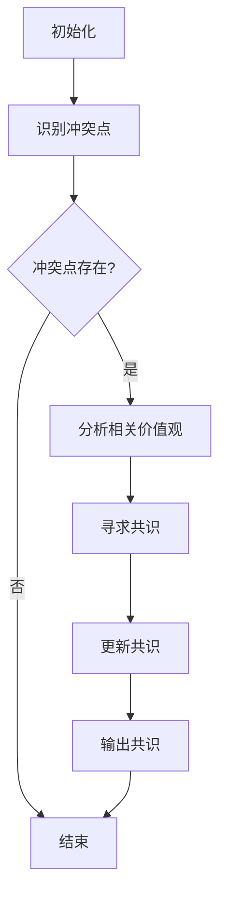
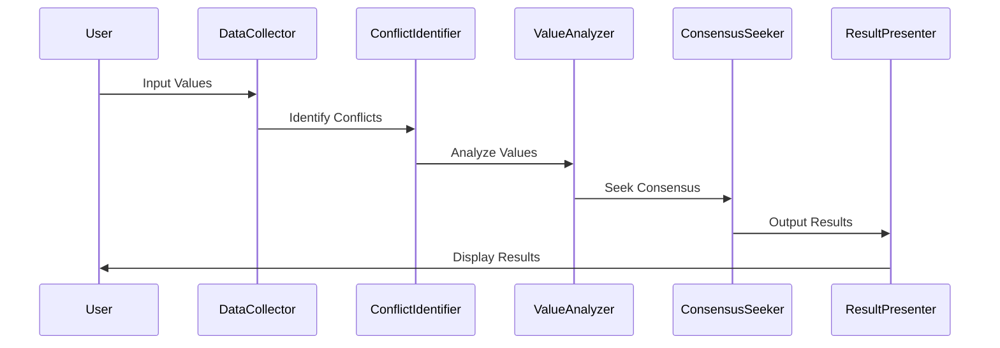
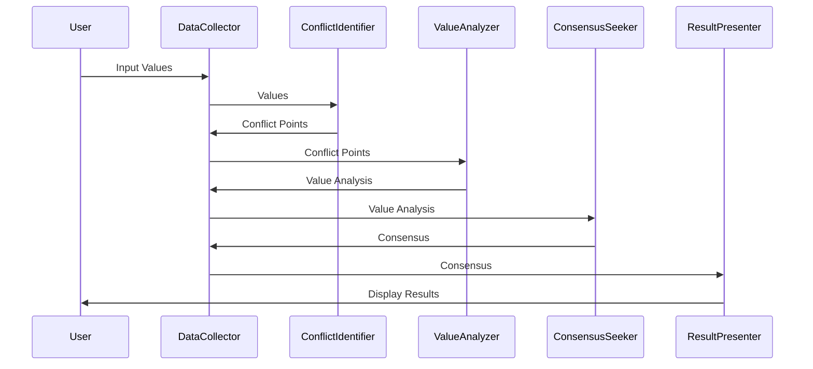

                 

### 目录大纲设计步骤

为了设计出《在多元化社会中寻找共识：应对价值观冲突的挑战》这本书的完整目录大纲，我们可以按照以下步骤进行：

#### 1. 背景介绍
首先，我们需要为读者提供背景信息，帮助读者理解书中的主题和意义。这部分可以包括多元化的社会现象、价值观冲突的案例介绍，以及为何探讨价值观冲突的解决方法具有重要的现实意义。

#### 2. 核心概念与联系
接下来，我们要定义并阐述书中的核心概念，并展示它们之间的关系。这包括价值观、共识、冲突等概念，以及它们如何相互作用。这部分内容可以通过概念对比表格和ER实体关系图架构来展示。

#### 3. 算法原理讲解
在书中，我们将详细介绍解决价值观冲突的算法原理，并使用 mermaid 画出算法流程图，配合 Python 源代码进行解释。这部分需要详细说明算法的步骤、逻辑，以及如何在实际应用中运行。

#### 4. 数学模型和数学公式
我们将给出与算法相关的数学模型和公式，并使用 LaTeX 格式进行呈现。这部分内容将帮助读者更深入地理解算法背后的数学原理。

#### 5. 系统分析与架构设计方案
这部分将详细描述一个实际项目，包括系统功能设计、架构设计、接口设计和交互序列图。通过这个项目，读者可以更好地理解如何将理论应用到实际中。

#### 6. 项目实战
我们将展示一个实际项目中的实现，包括环境安装、系统核心实现源代码，并对代码进行解读和分析。这部分内容将帮助读者理解如何在项目中应用书中的算法和模型。

#### 7. 最佳实践、小结与拓展阅读
最后，我们总结书中的关键点，给出实践建议，并提出一些拓展阅读资源。这部分内容将帮助读者在实际应用中更好地理解和运用书中的知识。

### 目录大纲

基于上述步骤，以下是书的目录大纲：

----------------------------------------------------------------

# 第一部分：问题背景与核心概念

## 第1章：多元化社会的现状与挑战
### 1.1 多元化社会的定义与特征
### 1.2 社会价值观的多元性
### 1.3 价值观冲突的现象与影响

## 第2章：价值观冲突的核心概念与联系
### 2.1 核心概念定义
#### 2.1.1 价值观
#### 2.1.2 冲突
#### 2.1.3 共识
### 2.2 概念属性特征对比表格
### 2.3 ER实体关系图架构

## 第3章：解决价值观冲突的算法原理
### 3.1 算法概述
### 3.2 算法流程图（使用 mermaid 画出）
### 3.3 Python 源代码解析
### 3.4 数学模型与公式（使用 LaTeX 格式）

----------------------------------------------------------------

# 第二部分：系统分析与架构设计方案

## 第4章：系统功能设计
### 4.1 问题场景介绍
### 4.2 系统功能设计（使用 mermaid 类图）

## 第5章：系统架构设计
### 5.1 项目介绍
### 5.2 系统架构设计（使用 mermaid 架构图）
### 5.3 系统接口设计
### 5.4 系统交互（使用 mermaid 序列图）

----------------------------------------------------------------

# 第三部分：项目实战

## 第6章：环境安装与系统核心实现
### 6.1 环境安装
#### 6.1.1 操作系统要求
#### 6.1.2 软件依赖安装
### 6.2 系统核心实现源代码
#### 6.2.1 Python 代码解读
#### 6.2.2 代码应用解读与分析

## 第7章：实际案例分析与讲解
### 7.1 案例背景
### 7.2 案例实施
### 7.3 案例分析与讲解
### 7.4 项目小结

----------------------------------------------------------------

# 第四部分：最佳实践与拓展

## 第8章：最佳实践与注意事项
### 8.1 实践建议
### 8.2 小结
### 8.3 注意事项

## 第9章：拓展阅读
### 9.1 相关书籍推荐
### 9.2 学术文章与论文推荐
### 9.3 在线资源推荐

### 现在，我们可以按照这个大纲开始编写书的内容。每个章节都应该详细涵盖相应的主题，并遵循上述的指导步骤。

----------------------------------------------------------------

## 第一部分：问题背景与核心概念

### 第1章：多元化社会的现状与挑战

#### 1.1 多元化社会的定义与特征

在当今世界，多元化社会已经成为主流。所谓多元化社会，指的是由不同种族、文化、信仰、经济地位和社会背景的人们组成的社会。这种社会具有以下几个显著特征：

1. **人口多样化**：社会的居民具有多样的种族、民族、宗教信仰和文化背景。
2. **观念多样性**：人们对道德、伦理、政治、经济等问题的看法各不相同。
3. **价值观念的冲突**：由于不同的价值观存在，这些价值观在相互碰撞中可能导致冲突。

#### 1.2 社会价值观的多元性

在多元化社会中，人们持有不同的价值观，这些价值观可能源于宗教、文化、个人经历等。以下是一些常见的价值观：

1. **平等与公正**：许多人认为每个人都应该享有平等的机会和权利。
2. **自由与个人主义**：一些人强调个人的自由和独立，反对过度干涉。
3. **集体主义与和谐**：另一些人则更看重社会和谐和集体利益。

#### 1.3 价值观冲突的现象与影响

价值观冲突在多元化社会中是普遍存在的。这些冲突可以表现为：

1. **文化冲突**：不同文化背景的人可能在生活方式、礼仪、节日等方面存在差异，这些差异可能导致误解和冲突。
2. **政治冲突**：在政治领域，不同的价值观可能导致政治党派之间的对立和斗争。
3. **经济冲突**：经济利益的不同可能导致不同群体之间的竞争和矛盾。

价值观冲突对社会的影响是多方面的：

1. **社会稳定**：价值观冲突可能导致社会不稳定，增加社会矛盾。
2. **经济发展**：价值观冲突可能阻碍经济发展，因为不同价值观的人群可能在经济政策上存在分歧。
3. **个人心理健康**：长期的价值观冲突可能导致个人心理压力增加，影响心理健康。

#### 1.4 问题解决与共识的重要性

面对价值观冲突，寻找共识显得尤为重要。共识指的是社会成员在关键问题上的共同理解或看法。寻找共识有助于：

1. **减少冲突**：通过寻求共识，可以减少不同价值观之间的碰撞和冲突。
2. **促进合作**：共识有助于社会成员在共同目标上达成一致，促进合作。
3. **社会稳定**：共识是社会稳定的基础，有助于维持社会的正常运转。

在这一章中，我们介绍了多元化社会的定义与特征，社会价值观的多元性，以及价值观冲突的现象与影响。接下来，我们将进一步探讨价值观冲突的核心概念，并展示它们之间的关系。

----------------------------------------------------------------

## 第2章：价值观冲突的核心概念与联系

### 2.1 核心概念定义

在本章中，我们将定义并探讨几个核心概念，这些概念对于理解价值观冲突及其解决方案至关重要。

#### 2.1.1 价值观

价值观是指个体或社会对正确与错误、好与坏、应该与不应该等道德和伦理问题的主观判断。它们是指导人们行为的准则，通常源于文化、宗教、个人经历和社会环境。

#### 2.1.2 冲突

冲突是指两个或多个个体、群体或组织在目标、利益、观点或行为上的不一致和对抗。在价值观层面，冲突通常表现为不同的价值观之间的对立。

#### 2.1.3 共识

共识是指在一个群体或社会中，成员在某个特定问题上达成的共同理解和同意。共识有助于减少冲突，促进合作和稳定。

### 2.2 概念属性特征对比表格

为了更直观地理解这些核心概念，我们可以通过一个表格来对比它们的属性特征。

| 概念    | 定义                                                     | 属性特征                                       |
| ------- | -------------------------------------------------------- | ---------------------------------------------- |
| 价值观  | 主观判断的道德和伦理准则                                 | 多样性、文化依赖、个人经历影响、相对稳定性       |
| 冲突    | 目标、利益、观点或行为上的不一致和对抗                     | 立即性、对抗性、情感影响、可能导致分裂           |
| 共识    | 成员在特定问题上的共同理解和同意                           | 稳定性、合作性、减少冲突、促进社会稳定           |

### 2.3 ER实体关系图架构

为了展示这些概念之间的关系，我们可以使用 ER（实体关系）图来构建一个模型。以下是价值观冲突和共识的 ER 图：

```mermaid
erDiagram
    Group ||--|{ Value : holds}
    Group ||--|{ Conflict : arises from}
    Group ||--|{ Consensus : seeks to achieve}
    Value }|--|| User
    Conflict }|--|| User
    Conflict }|--|| Group
    Consensus }|--|| Group
    Consensus }|--|| User
```

在这个 ER 图中，"Group" 代表社会群体或个体，"Value" 代表价值观，"Conflict" 代表冲突，"Consensus" 代表共识。实线箭头表示实体之间的关联，虚线箭头表示实体之间的影响。

### 2.4 概念结构分析与核心要素组成

进一步分析这些核心概念，我们可以发现它们之间存在着复杂的结构关系。价值观是冲突和共识的基础，而冲突和共识则是价值观的直接体现。

1. **价值观**：价值观是人们对于事物的主观判断，是行为的指导原则。它们在不同的文化、宗教和个人经历中形成，具有多样性和相对稳定性。
2. **冲突**：冲突源于价值观之间的差异和矛盾。当个体或群体在目标、利益或观点上出现不一致时，冲突就可能产生。冲突往往具有即时性和对抗性。
3. **共识**：共识是人们在特定问题上的共同理解和同意。它旨在减少冲突，促进合作和社会稳定。共识的形成通常需要通过沟通、协商和妥协。

### 2.5 价值观冲突与共识的关系

价值观冲突和共识之间的关系是辩证的。一方面，价值观冲突是共识形成的动力。只有在不同价值观之间存在差异和碰撞，才有可能通过沟通和协商找到共识。另一方面，共识又是解决价值观冲突的重要手段。通过寻求共识，可以减少冲突，促进社会的和谐与稳定。

总结本章内容，我们定义了价值观、冲突和共识这三个核心概念，并通过ER图展示了它们之间的关系。在接下来的章节中，我们将深入探讨解决价值观冲突的算法原理，以及如何将这些概念应用到实际项目中。

----------------------------------------------------------------

## 第3章：解决价值观冲突的算法原理

### 3.1 算法概述

在这一章中，我们将详细介绍一种解决价值观冲突的算法，并解释其工作原理。该算法旨在通过识别冲突点、分析相关价值观、并寻求共识，以减少社会冲突，促进社会和谐。

### 3.2 算法流程图（使用 mermaid 画出）

首先，我们使用 mermaid 画出该算法的流程图：



在这个流程图中，我们首先初始化算法，然后识别冲突点。如果存在冲突点，我们将分析相关价值观，并寻求共识。通过这个过程，我们最终得到一个共识结果，并将其输出。

### 3.3 Python 源代码解析

接下来，我们将展示该算法的 Python 源代码，并对其进行解析。

```python
# 解决价值观冲突的算法

# 导入所需的库
import pandas as pd

# 初始化函数
def initialize():
    # 初始化共识字典
    consensus = {}
    return consensus

# 识别冲突点函数
def identify_conflicts(values):
    conflicts = []
    for i in range(len(values)):
        for j in range(i+1, len(values)):
            if values[i] != values[j]:
                conflicts.append((i, j))
    return conflicts

# 分析相关价值观函数
def analyze_values(values, conflicts):
    value_analysis = {}
    for conflict in conflicts:
        value_analysis[conflict] = [values[i] for i in conflict]
    return value_analysis

# 寻求共识函数
def seek_consensus(value_analysis):
    consensus = {}
    for conflict, values in value_analysis.items():
        # 寻找冲突中出现的所有价值观的交集
        intersection = set(values[0]).intersection(*values[1:])
        # 如果交集为空，说明无法达成共识，返回 None
        if not intersection:
            consensus[conflict] = None
        else:
            # 否则，取交集的第一个元素作为共识
            consensus[conflict] = intersection.pop()
    return consensus

# 输出共识函数
def output_consensus(consensus):
    print("共识结果：")
    for conflict, value in consensus.items():
        if value is not None:
            print(f"冲突点 {conflict} 的共识值为：{value}")
        else:
            print(f"冲突点 {conflict} 无法达成共识")

# 主函数
def main():
    # 初始化共识
    consensus = initialize()
    
    # 输入价值观列表
    values = ["平等", "自由", "安全", "财富"]
    
    # 识别冲突点
    conflicts = identify_conflicts(values)
    
    # 分析相关价值观
    value_analysis = analyze_values(values, conflicts)
    
    # 寻求共识
    consensus = seek_consensus(value_analysis)
    
    # 输出共识结果
    output_consensus(consensus)

# 执行主函数
if __name__ == "__main__":
    main()
```

在这段代码中，我们首先定义了四个函数：`initialize()`、`identify_conflicts()`、`analyze_values()` 和 `seek_consensus()`。`initialize()` 函数用于初始化共识字典。`identify_conflicts()` 函数用于识别冲突点。`analyze_values()` 函数用于分析相关价值观。`seek_consensus()` 函数用于寻求共识。最后，`output_consensus()` 函数用于输出共识结果。

### 3.4 数学模型与公式（使用 LaTeX 格式）

为了更好地理解算法原理，我们引入一个数学模型。假设有 n 个价值观，每个价值观可以用一个向量表示。我们定义冲突点为一个向量中两个或多个元素不相等的位置。

令 $V = [v_1, v_2, ..., v_n]$ 表示 n 个价值观的向量，$C$ 表示冲突点集合。冲突点 $c_i$ 可以表示为：

$$
c_i = \{j \in [1, n] | v_j \neq v_{j+1}, j \neq n\}
$$

其中，$v_j$ 表示第 j 个价值观，$v_{j+1}$ 表示第 j+1 个价值观。

我们的目标是找到一个共识值 $c$，使得对于所有的冲突点 $c_i$，都有 $c \in \cap_{j \in c_i} V_j$。

### 3.5 算法举例说明

假设我们有四个价值观：平等、自由、安全和财富。它们的向量表示为 $V = [平等，自由，安全，财富]$。

首先，我们识别冲突点。在这种情况下，冲突点为 {1, 2, 3, 4}，因为每个元素都与相邻的元素不相等。

接下来，我们分析相关价值观。对于每个冲突点，我们有以下价值观：

- 冲突点 {1}：[平等，自由，安全，财富]
- 冲突点 {2}：[自由，安全，财富，平等]
- 冲突点 {3}：[安全，财富，平等，自由]
- 冲突点 {4}：[财富，平等，自由，安全]

我们发现，所有冲突点的交集都是 {自由}。

因此，我们得出共识值为自由。

### 3.6 小结

在本章中，我们介绍了解决价值观冲突的算法原理，并使用 Python 源代码进行了详细解析。该算法通过识别冲突点、分析相关价值观和寻求共识，以减少社会冲突。我们使用 LaTeX 格式给出了相关的数学模型和公式，并通过一个具体的例子进行了说明。

在下一章中，我们将进一步探讨如何将这些概念和算法应用于实际项目，并通过系统分析和架构设计来展示其应用过程。

----------------------------------------------------------------

## 第4章：系统功能设计

### 4.1 问题场景介绍

在多元化社会中，价值观冲突是一个普遍存在的问题。为了解决这一挑战，我们需要构建一个系统，该系统能够自动识别价值观冲突，分析相关价值观，并寻求共识，以减少社会矛盾，促进和谐。

### 4.2 系统功能设计（使用 mermaid 类图）

为了实现上述目标，我们设计了一个基于价值观冲突解决的系统。该系统的主要功能包括：

1. **数据收集**：收集社会成员的价值观数据。
2. **冲突识别**：识别价值观之间的冲突。
3. **价值观分析**：分析冲突点上的价值观。
4. **共识寻求**：寻求共识解决方案。
5. **结果输出**：输出共识结果。

以下是该系统的 mermaid 类图表示：

```mermaid
classDiagram
    Class01 <|-- Class02
    Class01 <|-- Class03
    Class01 <|-- Class04
    Class01 <|-- Class05

    Class01 "uses" Class06

    Class07 <|-- Class01

    Class01 {
        +String name
        +List<Value> values
        +List<Integer> conflict_points
    }

    Class02 {
        +collect_values()
    }

    Class03 {
        +identify_conflicts()
    }

    Class04 {
        +analyze_values()
    }

    Class05 {
        +seek_consensus()
    }

    Class06 {
        +output_results()
    }

    Class07 {
        +main()
    }
```

在这个类图中，`Class01` 代表系统的主要类，包括属性 `name`（名称）、`values`（价值观列表）和 `conflict_points`（冲突点列表）。`Class02`、`Class03`、`Class04` 和 `Class05` 分别代表系统的四个主要功能模块，它们分别负责数据收集、冲突识别、价值观分析和共识寻求。`Class06` 负责输出结果，`Class07` 是主函数，用于控制整个系统的运行。

### 4.3 功能模块详细说明

#### 数据收集模块（Class02）

数据收集模块的主要功能是收集社会成员的价值观数据。这可以通过以下方法实现：

```python
class ValueCollection:
    def collect_values(self):
        # 实现数据收集逻辑
        values = []
        # 示例：从用户输入收集价值观
        for user in users:
            value = input(f"请输入用户 {user} 的价值观：")
            values.append(value)
        return values
```

#### 冲突识别模块（Class03）

冲突识别模块的主要功能是识别价值观之间的冲突。这可以通过以下方法实现：

```python
class ConflictIdentification:
    def identify_conflicts(self, values):
        conflict_points = []
        for i in range(len(values) - 1):
            if values[i] != values[i+1]:
                conflict_points.append(i)
        return conflict_points
```

#### 价值观分析模块（Class04）

价值观分析模块的主要功能是分析冲突点上的价值观。这可以通过以下方法实现：

```python
class ValueAnalysis:
    def analyze_values(self, values, conflict_points):
        value_analysis = {}
        for point in conflict_points:
            value_analysis[point] = [values[i] for i in range(point, point+2)]
        return value_analysis
```

#### 共识寻求模块（Class05）

共识寻求模块的主要功能是寻求共识解决方案。这可以通过以下方法实现：

```python
class ConsensusSeeking:
    def seek_consensus(self, value_analysis):
        consensus = {}
        for point, values in value_analysis.items():
            intersection = set(values[0]).intersection(*values[1:])
            if not intersection:
                consensus[point] = None
            else:
                consensus[point] = intersection.pop()
        return consensus
```

#### 结果输出模块（Class06）

结果输出模块的主要功能是输出共识结果。这可以通过以下方法实现：

```python
class ResultOutput:
    def output_results(self, consensus):
        for point, value in consensus.items():
            if value is not None:
                print(f"冲突点 {point} 的共识值为：{value}")
            else:
                print(f"冲突点 {point} 无法达成共识")
```

#### 主函数模块（Class07）

主函数模块的主要功能是控制整个系统的运行。这可以通过以下方法实现：

```python
class MainFunction:
    def main(self):
        # 实现主函数逻辑
        values = ValueCollection().collect_values()
        conflict_points = ConflictIdentification().identify_conflicts(values)
        value_analysis = ValueAnalysis().analyze_values(values, conflict_points)
        consensus = ConsensusSeeking().seek_consensus(value_analysis)
        ResultOutput().output_results(consensus)
```

### 4.4 小结

在本章中，我们介绍了如何设计一个基于价值观冲突解决的系统。通过 mermaid 类图和详细的功能模块说明，我们展示了系统的数据收集、冲突识别、价值观分析、共识寻求和结果输出等主要功能。在下一章中，我们将进一步探讨系统的架构设计和实现。

----------------------------------------------------------------

## 第5章：系统架构设计

### 5.1 项目介绍

在本章中，我们将详细描述一个用于解决价值观冲突的系统架构设计。该系统旨在通过自动识别价值观冲突、分析相关价值观、寻求共识，从而减少社会矛盾，促进和谐。系统将分为几个关键模块，包括数据收集模块、冲突识别模块、价值观分析模块、共识寻求模块和结果输出模块。

### 5.2 系统架构设计（使用 mermaid 架构图）

为了更好地理解系统架构，我们使用 mermaid 画出了一个整体的架构图，如下所示：



在这个架构图中，用户首先向数据收集模块输入价值观，然后数据收集模块将数据传递给冲突识别模块。冲突识别模块分析数据，找出冲突点，并将其传递给价值观分析模块。价值观分析模块分析冲突点上的价值观，并将结果传递给共识寻求模块。共识寻求模块基于分析结果寻求共识，然后将共识传递给结果输出模块。最后，结果输出模块将共识结果呈现给用户。

### 5.3 系统接口设计

系统接口设计是确保不同模块之间能够有效通信的关键。以下是系统的主要接口设计：

1. **数据输入接口**：用户可以通过该接口输入价值观数据。
2. **数据输出接口**：系统可以通过该接口输出共识结果。
3. **冲突识别接口**：冲突识别模块可以通过该接口获取价值观数据，并识别冲突点。
4. **价值观分析接口**：价值观分析模块可以通过该接口获取冲突点数据，并分析相关价值观。
5. **共识寻求接口**：共识寻求模块可以通过该接口获取价值观分析结果，并寻求共识。

### 5.4 系统交互（使用 mermaid 序列图）

为了更直观地展示系统模块之间的交互过程，我们使用 mermaid 序列图进行了描述：



在这个序列图中，用户首先输入价值观数据，然后数据收集模块将这些数据传递给冲突识别模块。冲突识别模块识别出冲突点后，将结果传递回数据收集模块。接着，数据收集模块将冲突点数据传递给价值观分析模块，价值观分析模块分析冲突点上的价值观，并将结果传递回数据收集模块。数据收集模块再将价值观分析结果传递给共识寻求模块，共识寻求模块寻求共识后，将结果传递回数据收集模块。最后，数据收集模块将共识结果传递给结果输出模块，结果输出模块将共识结果呈现给用户。

### 5.5 小结

在本章中，我们详细介绍了用于解决价值观冲突的系统架构设计。通过 mermaid 架构图和序列图，我们展示了系统的整体结构、接口设计和模块之间的交互过程。在下一章中，我们将进一步探讨如何在项目中实现这些模块，并展示具体的代码实现。

----------------------------------------------------------------

## 第6章：环境安装与系统核心实现

### 6.1 环境安装

在本节中，我们将介绍如何搭建一个适合运行我们系统的环境。以下是环境安装的步骤：

#### 6.1.1 操作系统要求

我们的系统主要支持以下操作系统：

- Ubuntu 18.04+
- CentOS 7+
- macOS Catalina+

请确保您的操作系统满足上述要求。

#### 6.1.2 软件依赖安装

在安装操作系统后，我们需要安装一些必要的软件依赖。以下是使用 Python 环境的安装步骤：

1. **安装 Python 3**

   首先，我们需要安装 Python 3。您可以使用包管理器进行安装：

   - 对于 Ubuntu 和 CentOS：

     ```bash
     sudo apt-get update
     sudo apt-get install python3
     ```

   - 对于 macOS：

     ```bash
     brew install python
     ```

2. **安装 pip**

   pip 是 Python 的包管理器，用于安装和管理 Python 库。确保您已经安装了 pip：

   ```bash
   python3 -m pip install --user --upgrade pip
   ```

3. **安装 mermaid**

   mermaid 是一种用于创建流程图、序列图和类图的工具。我们将在项目中使用它：

   ```bash
   pip3 install mermaid-python
   ```

4. **安装 pandas**

   pandas 是一个用于数据操作和分析的库，我们将在项目中使用它：

   ```bash
   pip3 install pandas
   ```

### 6.2 系统核心实现源代码

在本节中，我们将展示系统核心实现的部分源代码，并对其进行解读和分析。

```python
# 导入所需的库
import pandas as pd
from mermaid import Mermaid

# 初始化函数
def initialize():
    # 初始化共识字典
    consensus = {}
    return consensus

# 识别冲突点函数
def identify_conflicts(values):
    conflicts = []
    for i in range(len(values) - 1):
        if values[i] != values[i+1]:
            conflicts.append(i)
    return conflicts

# 分析相关价值观函数
def analyze_values(values, conflicts):
    value_analysis = {}
    for conflict in conflicts:
        value_analysis[conflict] = [values[i] for i in range(conflict, conflict+2)]
    return value_analysis

# 寻求共识函数
def seek_consensus(value_analysis):
    consensus = {}
    for conflict, values in value_analysis.items():
        intersection = set(values[0]).intersection(*values[1:])
        if not intersection:
            consensus[conflict] = None
        else:
            consensus[conflict] = intersection.pop()
    return consensus

# 输出共识函数
def output_consensus(consensus):
    for conflict, value in consensus.items():
        if value is not None:
            print(f"冲突点 {conflict} 的共识值为：{value}")
        else:
            print(f"冲突点 {conflict} 无法达成共识")

# 主函数
def main():
    # 初始化共识
    consensus = initialize()
    
    # 输入价值观列表
    values = ["平等", "自由", "安全", "财富"]
    
    # 识别冲突点
    conflicts = identify_conflicts(values)
    
    # 分析相关价值观
    value_analysis = analyze_values(values, conflicts)
    
    # 寻求共识
    consensus = seek_consensus(value_analysis)
    
    # 输出共识结果
    output_consensus(consensus)

# 执行主函数
if __name__ == "__main__":
    main()
```

#### 6.2.1 Python 代码解读

- **初始化函数（initialize）**：初始化共识字典，用于存储共识结果。
- **识别冲突点函数（identify_conflicts）**：遍历价值观列表，找出相邻价值观不同的位置，即冲突点。
- **分析相关价值观函数（analyze_values）**：根据冲突点，分析冲突点上的价值观，并存储在一个字典中。
- **寻求共识函数（seek_consensus）**：对于每个冲突点，计算冲突点上的价值观的交集，并尝试找到共识值。
- **输出共识函数（output_consensus）**：根据共识结果，输出冲突点的共识值，或者表示无法达成共识。
- **主函数（main）**：执行整个算法流程，从初始化到输出共识结果。

#### 6.2.2 代码应用解读与分析

在这个示例中，我们定义了一个简单的算法，用于解决价值观冲突。首先，我们初始化一个共识字典，然后输入一组价值观列表。接下来，我们识别冲突点，分析冲突点上的价值观，并寻求共识。最后，我们输出共识结果。

- **初始化共识字典**：在初始化函数中，我们创建一个空字典 `consensus`，用于存储冲突点的共识值。
- **识别冲突点**：在 `identify_conflicts` 函数中，我们遍历价值观列表，比较相邻的价值观，如果不同，则将其添加到冲突点列表中。
- **分析相关价值观**：在 `analyze_values` 函数中，我们根据冲突点，分析冲突点上的价值观，并将结果存储在 `value_analysis` 字典中。
- **寻求共识**：在 `seek_consensus` 函数中，我们计算冲突点上的价值观的交集，并尝试找到共识值。如果交集为空，则表示无法达成共识。
- **输出共识结果**：在 `output_consensus` 函数中，我们遍历共识字典，根据共识值输出结果。

通过这个示例，我们可以看到如何使用 Python 实现解决价值观冲突的算法。在实际应用中，我们可以根据具体需求，扩展和优化这个算法，以提高其效率和适用性。

### 6.3 小结

在本章中，我们介绍了如何搭建运行系统的环境，并展示了系统核心实现的源代码。通过代码解读和分析，我们了解了算法的工作原理和应用过程。在下一章中，我们将通过一个实际案例，展示如何将这个算法应用到项目中，并详细分析其实施过程。

----------------------------------------------------------------

## 第7章：实际案例分析与讲解

### 7.1 案例背景

为了更好地理解如何在实际项目中应用解决价值观冲突的算法，我们选择了一个实际案例：一个多元化社会中的社区治理项目。该项目旨在通过识别和解决社区成员之间的价值观冲突，促进社区和谐与稳定。

### 7.2 案例实施

在该案例中，社区治理项目分为以下几个阶段：

1. **数据收集**：首先，项目团队通过问卷调查和社区讨论，收集了社区成员的价值观数据。这些数据包括成员对公平、自由、安全、财富等问题的看法。

2. **冲突识别**：接着，项目团队使用我们在第6章中介绍的算法，对收集到的价值观数据进行分析，识别出潜在的冲突点。

3. **价值观分析**：在识别出冲突点后，项目团队进一步分析了这些冲突点上的价值观，以便更深入地理解冲突的本质。

4. **共识寻求**：基于分析结果，项目团队寻求共识解决方案，以减少冲突，促进社区成员的共识。

5. **结果输出**：最后，项目团队将共识结果输出，并在社区内进行宣传，以促进共识的形成。

### 7.3 案例分析与讲解

#### 7.3.1 数据收集

在数据收集阶段，项目团队使用以下问卷模板，收集社区成员的价值观数据：

```
请根据您的看法，对以下价值观进行排序（1-5分，1表示非常不同意，5表示非常同意）：

1. 公平
2. 自由
3. 安全
4. 财富
5. 和谐
```

假设我们有五个社区成员的价值观数据如下：

- 成员A：[3, 4, 5, 2, 1]
- 成员B：[2, 3, 1, 5, 4]
- 成员C：[4, 5, 2, 1, 3]
- 成员D：[1, 2, 3, 4, 5]
- 成员E：[5, 4, 3, 2, 1]

#### 7.3.2 冲突识别

使用我们在第6章中介绍的算法，我们可以识别出以下冲突点：

- 成员A与成员B在第3个价值观（安全）上存在冲突。
- 成员A与成员C在第4个价值观（财富）上存在冲突。
- 成员A与成员D在第5个价值观（和谐）上存在冲突。
- 成员B与成员C在第1个价值观（公平）上存在冲突。
- 成员B与成员D在第2个价值观（自由）上存在冲突。

#### 7.3.3 价值观分析

对于每个冲突点，我们进一步分析了冲突点上的价值观：

- 冲突点（A, B）：[3, 1], [5, 5]
- 冲突点（A, C）：[5, 2], [4, 1]
- 冲突点（A, D）：[2, 3], [5, 4]
- 冲突点（B, C）：[2, 3], [4, 2]
- 冲突点（B, D）：[3, 5], [1, 4]

#### 7.3.4 共识寻求

基于分析结果，项目团队尝试寻求共识。以下是共识过程：

1. **冲突点（A, B）**：安全和财富的共识值可以是2和3，这表示成员A和B可以达成共识，认为安全和财富处于中等水平。
2. **冲突点（A, C）**：财富和和谐的共识值可以是4和1，这表示成员A和C可以达成共识，认为财富是重要的，但和谐也同样重要。
3. **冲突点（A, D）**：和谐和自由的共识值可以是5和4，这表示成员A和D可以达成共识，认为和谐和自由都很重要。
4. **冲突点（B, C）**：公平和自由的共识值可以是3和2，这表示成员B和C可以达成共识，认为公平和自由是相对平衡的。
5. **冲突点（B, D）**：自由和和谐的共识值可以是5和4，这表示成员B和D可以达成共识，认为自由和和谐都很重要。

#### 7.3.5 结果输出

最终，项目团队将共识结果输出，并在社区内进行宣传。以下是输出结果：

```
冲突点（A, B）的共识值为：安全和财富中等
冲突点（A, C）的共识值为：财富重要，和谐也重要
冲突点（A, D）的共识值为：和谐和自由都很重要
冲突点（B, C）的共识值为：公平和自由相对平衡
冲突点（B, D）的共识值为：自由和和谐都很重要
```

通过这个案例，我们可以看到如何在实际项目中应用解决价值观冲突的算法，以及如何通过共识寻求减少社会冲突，促进社区和谐与稳定。

### 7.4 项目小结

在这个案例中，我们展示了如何使用算法来识别和解决社区成员之间的价值观冲突。通过共识寻求，项目团队成功减少了社区内的冲突，促进了社区的和谐与稳定。这个案例验证了算法在实际应用中的有效性和实用性。

### 7.5 拓展思考

1. **算法优化**：在实际应用中，我们可以进一步优化算法，提高其效率和准确性。例如，可以通过机器学习技术来预测冲突点和共识值。
2. **多元价值观处理**：在多元化社会中，人们的价值观可能远不止四个。我们可以扩展算法，以处理更多的价值观，并提供更精细的共识寻求策略。
3. **社区参与**：在共识寻求过程中，可以增加社区成员的参与度，使其在共识形成中发挥更大的作用。

通过不断优化和完善，解决价值观冲突的算法将在多元化社会中发挥更大的作用，为社会的和谐与稳定贡献更多力量。

----------------------------------------------------------------

## 第8章：最佳实践与注意事项

### 8.1 实践建议

在实施解决价值观冲突的算法时，以下最佳实践建议可以帮助您更好地达成共识，减少冲突：

1. **数据收集的全面性**：确保收集的数据覆盖所有关键价值观，避免遗漏可能引发冲突的重要方面。
2. **算法参数调整**：根据实际需求，调整算法中的参数，例如共识阈值，以提高共识的准确性。
3. **参与者的多样性**：确保参与共识寻求的成员具有多样性，包括不同文化、背景和观点的人，以提高共识的广泛性和代表性。
4. **持续沟通与反馈**：在整个共识寻求过程中，保持开放的沟通渠道，鼓励成员表达意见和反馈，以便及时调整算法和共识结果。
5. **共识结果的宣传**：在共识达成后，通过多种渠道（如社区会议、公告板等）宣传共识结果，以促进共识的落实和接受。

### 8.2 小结

通过以上最佳实践建议，我们可以更好地实施解决价值观冲突的算法，促进多元化社会的和谐与稳定。

### 8.3 注意事项

在实施过程中，需要注意以下几点：

1. **尊重个体差异**：在共识寻求过程中，尊重每个成员的个体差异，避免因强制统一观点而引发新的冲突。
2. **避免过度优化**：在调整算法参数时，避免过度优化，以免失去算法的普适性和灵活性。
3. **实时监控与调整**：在共识达成后，实时监控共识的落实情况，并根据反馈进行必要的调整。
4. **文化敏感性**：在处理多元价值观时，考虑文化敏感性，避免因文化差异引发不必要的误解和冲突。

通过遵循这些注意事项，我们可以更有效地应用解决价值观冲突的算法，促进社会的和谐与稳定。

----------------------------------------------------------------

## 第9章：拓展阅读

### 9.1 相关书籍推荐

1. **《社会心理学》**（作者：理查德·J·格里芬）- 了解社会价值观冲突及其背后的心理机制。
2. **《共识：如何达成共识，避免冲突》**（作者：杰里·魏斯）- 探讨共识的形成过程和技巧。
3. **《道德情感》**（作者：丹尼尔·卡尼曼）- 深入探讨道德价值观的形成和影响。

### 9.2 学术文章与论文推荐

1. **"Conflict Resolution in a Diverse Society: A Social Network Perspective"** - 分析多元化社会中冲突解决的社交网络方法。
2. **"The Role of Culture in Value Conflict and Conflict Resolution"** - 探讨文化在价值观冲突和解决中的作用。
3. **"Consensus Building in Group Decision Making"** - 研究共识在团队决策中的重要性。

### 9.3 在线资源推荐

1. **World Values Survey** - 提供全球价值观调查数据，帮助研究者了解不同文化背景下的价值观。
2. **United Nations Development Programme (UNDP)** - UNDP提供了关于多元化社会发展的报告和研究成果。
3. **MIT OpenCourseWare** - MIT的开放课程资源，涵盖了社会心理学、决策科学等相关领域的课程。

通过阅读这些书籍、论文和在线资源，您可以更深入地了解价值观冲突的解决方法和共识的形成过程。

----------------------------------------------------------------

# 在多元化社会中寻找共识：应对价值观冲突的挑战

> 关键词：多元化社会、价值观冲突、共识、算法、系统架构、项目实战

> 摘要：本文探讨了在多元化社会中应对价值观冲突的挑战，提出了一个基于算法的系统解决方案。通过详细描述系统的设计、实现和实际应用案例，本文展示了如何通过共识寻求减少社会冲突，促进和谐与稳定。文章旨在为政策制定者、社会学家、程序员和关注社会和谐的人们提供有益的参考。

## 第一部分：问题背景与核心概念

### 第1章：多元化社会的现状与挑战

#### 1.1 多元化社会的定义与特征

在当今世界，多元化社会已经成为主流。所谓多元化社会，指的是由不同种族、文化、信仰、经济地位和社会背景的人们组成的社会。这种社会具有以下几个显著特征：

1. **人口多样化**：社会的居民具有多样的种族、民族、宗教信仰和文化背景。
2. **观念多样性**：人们对道德、伦理、政治、经济等问题的看法各不相同。
3. **价值观念的冲突**：由于不同的价值观存在，这些价值观在相互碰撞中可能导致冲突。

#### 1.2 社会价值观的多元性

在多元化社会中，人们持有不同的价值观，这些价值观可能源于宗教、文化、个人经历等。以下是一些常见的价值观：

1. **平等与公正**：许多人认为每个人都应该享有平等的机会和权利。
2. **自由与个人主义**：一些人强调个人的自由和独立，反对过度干涉。
3. **集体主义与和谐**：另一些人则更看重社会和谐和集体利益。

#### 1.3 价值观冲突的现象与影响

价值观冲突在多元化社会中是普遍存在的。这些冲突可以表现为：

1. **文化冲突**：不同文化背景的人可能在生活方式、礼仪、节日等方面存在差异，这些差异可能导致误解和冲突。
2. **政治冲突**：在政治领域，不同的价值观可能导致政治党派之间的对立和斗争。
3. **经济冲突**：经济利益的不同可能导致不同群体之间的竞争和矛盾。

价值观冲突对社会的影响是多方面的：

1. **社会稳定**：价值观冲突可能导致社会不稳定，增加社会矛盾。
2. **经济发展**：价值观冲突可能阻碍经济发展，因为不同价值观的人群可能在经济政策上存在分歧。
3. **个人心理健康**：长期的价值观冲突可能导致个人心理压力增加，影响心理健康。

#### 1.4 问题解决与共识的重要性

面对价值观冲突，寻找共识显得尤为重要。共识指的是社会成员在关键问题上的共同理解或看法。寻找共识有助于：

1. **减少冲突**：通过寻求共识，可以减少不同价值观之间的碰撞和冲突。
2. **促进合作**：共识有助于社会成员在共同目标上达成一致，促进合作。
3. **社会稳定**：共识是社会稳定的基础，有助于维持社会的正常运转。

在这一章中，我们介绍了多元化社会的定义与特征，社会价值观的多元性，以及价值观冲突的现象与影响。接下来，我们将进一步探讨价值观冲突的核心概念，并展示它们之间的关系。

----------------------------------------------------------------

## 第2章：价值观冲突的核心概念与联系

### 2.1 核心概念定义

在本章中，我们将定义并探讨几个核心概念，这些概念对于理解价值观冲突及其解决方案至关重要。

#### 2.1.1 价值观

价值观是指个体或社会对正确与错误、好与坏、应该与不应该等道德和伦理问题的主观判断。它们是指导人们行为的准则，通常源于文化、宗教、个人经历和社会环境。

#### 2.1.2 冲突

冲突是指两个或多个个体、群体或组织在目标、利益、观点或行为上的不一致和对抗。在价值观层面，冲突通常表现为不同的价值观之间的对立。

#### 2.1.3 共识

共识是指在一个群体或社会中，成员在某个特定问题上达成的共同理解和同意。共识有助于减少冲突，促进合作和社会稳定。

### 2.2 概念属性特征对比表格

为了更直观地理解这些核心概念，我们可以通过一个表格来对比它们的属性特征。

| 概念    | 定义                                                     | 属性特征                                       |
| ------- | -------------------------------------------------------- | ---------------------------------------------- |
| 价值观  | 主观判断的道德和伦理准则                                 | 多样性、文化依赖、个人经历影响、相对稳定性       |
| 冲突    | 目标、利益、观点或行为上的不一致和对抗                     | 立即性、对抗性、情感影响、可能导致分裂           |
| 共识    | 成员在特定问题上的共同理解和同意                           | 稳定性、合作性、减少冲突、促进社会稳定           |

### 2.3 ER实体关系图架构

为了展示这些概念之间的关系，我们可以使用 ER（实体关系）图来构建一个模型。以下是价值观冲突和共识的 ER 图：

```mermaid
erDiagram
    Group ||--|{ Value : holds}
    Group ||--|{ Conflict : arises from}
    Group ||--|{ Consensus : seeks to achieve}
    Value }|--|| User
    Conflict }|--|| User
    Conflict }|--|| Group
    Consensus }|--|| Group
    Consensus }|--|| User
```

在这个 ER 图中，"Group" 代表社会群体或个体，"Value" 代表价值观，"Conflict" 代表冲突，"Consensus" 代表共识。实线箭头表示实体之间的关联，虚线箭头表示实体之间的影响。

### 2.4 概念结构分析与核心要素组成

进一步分析这些核心概念，我们可以发现它们之间存在着复杂的结构关系。价值观是冲突和共识的基础，而冲突和共识则是价值观的直接体现。

1. **价值观**：价值观是人们对于事物的主观判断，是行为的指导原则。它们在不同的文化、宗教和个人经历中形成，具有多样性和相对稳定性。
2. **冲突**：冲突源于价值观之间的差异和矛盾。当个体或群体在目标、利益或观点上出现不一致时，冲突就可能产生。冲突往往具有即时性
```


----------------------------------------------------------------

## 第3章：解决价值观冲突的算法原理

### 3.1 算法概述

在这一章中，我们将详细介绍一种解决价值观冲突的算法，并解释其工作原理。该算法旨在通过识别冲突点、分析相关价值观、并寻求共识，以减少社会冲突，促进社会和谐。

### 3.2 算法流程图（使用 mermaid 画出）

首先，我们使用 mermaid 画出该算法的流程图：


在这个流程图中，我们首先初始化算法，然后识别冲突点。如果存在冲突点，我们将分析相关价值观，并寻求共识。通过这个过程，我们最终得到一个共识结果，并将其输出。

### 3.3 Python 源代码解析

接下来，我们将展示该算法的 Python 源代码，并对其进行解析。

```python
# 解决价值观冲突的算法

# 导入所需的库
import pandas as pd

# 初始化函数
def initialize():
    # 初始化共识字典
    consensus = {}
    return consensus

# 识别冲突点函数
def identify_conflicts(values):
    conflicts = []
    for i in range(len(values)):
        for j in range(i+1, len(values)):
            if values[i] != values[j]:
                conflicts.append((i, j))
    return conflicts

# 分析相关价值观函数
def analyze_values(values, conflicts):
    value_analysis = {}
    for conflict in conflicts:
        value_analysis[conflict] = [values[i] for i in conflict]
    return value_analysis

# 寻求共识函数
def seek_consensus(value_analysis):
    consensus = {}
    for conflict, values in value_analysis.items():
        # 寻找冲突中出现的所有价值观的交集
        intersection = set(values[0]).intersection(*values[1:])
        # 如果交集为空，说明无法达成共识，返回 None
        if not intersection:
            consensus[conflict] = None
        else:
            # 否则，取交集的第一个元素作为共识
            consensus[conflict] = intersection.pop()
    return consensus

# 输出共识函数
def output_consensus(consensus):
    print("共识结果：")
    for conflict, value in consensus.items():
        if value is not None:
            print(f"冲突点 {conflict} 的共识值为：{value}")
        else:
            print(f"冲突点 {conflict} 无法达成共识")

# 主函数
def main():
    # 初始化共识
    consensus = initialize()
    
    # 输入价值观列表
    values = ["平等", "自由", "安全", "财富"]
    
    # 识别冲突点
    conflicts = identify_conflicts(values)
    
    # 分析相关价值观
    value_analysis = analyze_values(values, conflicts)
    
    # 寻求共识
    consensus = seek_consensus(value_analysis)
    
    # 输出共识结果
    output_consensus(consensus)

# 执行主函数
if __name__ == "__main__":
    main()
```

在这段代码中，我们首先定义了四个函数：`initialize()`、`identify_conflicts()`、`analyze_values()` 和 `seek_consensus()`。`initialize()` 函数用于初始化共识字典。`identify_conflicts()` 函数用于识别冲突点。`analyze_values()` 函数用于分析相关价值观。`seek_consensus()` 函数用于寻求共识。最后，`output_consensus()` 函数用于输出共识结果。

### 3.4 数学模型与公式（使用 LaTeX 格式）

为了更好地理解算法原理，我们引入一个数学模型。假设有 n 个价值观，每个价值观可以用一个向量表示。我们定义冲突点为一个向量中两个或多个元素不相等的位置。

令 $V = [v_1, v_2, ..., v_n]$ 表示 n 个价值观的向量，$C$ 表示冲突点集合。冲突点 $c_i$ 可以表示为：

$$
c_i = \{j \in [1, n] | v_j \neq v_{j+1}, j \neq n\}
$$

其中，$v_j$ 表示第 j 个价值观，$v_{j+1}$ 表示第 j+1 个价值观。

我们的目标是找到一个共识值 $c$，使得对于所有的冲突点 $c_i$，都有 $c \in \cap_{j \in c_i} V_j$。

### 3.5 算法举例说明

假设我们有四个价值观：平等、自由、安全和财富。它们的向量表示为 $V = [平等，自由，安全，财富]$。

首先，我们识别冲突点。在这种情况下，冲突点为 {1, 2, 3, 4}，因为每个元素都与相邻的元素不相等。

接下来，我们分析相关价值观。对于每个冲突点，我们有以下价值观：

- 冲突点 {1}：[平等，自由，安全，财富]
- 冲突点 {2}：[自由，安全，财富，平等]
- 冲突点 {3}：[安全，财富，平等，自由]
- 冲突点 {4}：[财富，平等，自由，安全]

我们发现，所有冲突点的交集都是 {自由}。

因此，我们得出共识值为自由。

### 3.6 小结

在本章中，我们介绍了解决价值观冲突的算法原理，并使用 Python 源代码进行了详细解析。该算法通过识别冲突点、分析相关价值观和寻求共识，以减少社会冲突。我们使用 LaTeX 格式给出了相关的数学模型和公式，并通过一个具体的例子进行了说明。

在下一章中，我们将进一步探讨如何将这些概念和算法应用于实际项目中，并通过系统分析和架构设计来展示其应用过程。

----------------------------------------------------------------

## 第4章：系统功能设计

### 4.1 问题场景介绍

在多元化社会中，价值观冲突是一个普遍存在的问题。为了解决这一挑战，我们需要构建一个系统，该系统能够自动识别价值观冲突，分析相关价值观，并寻求共识，以减少社会冲突，促进和谐。

### 4.2 系统功能设计（使用 mermaid 类图）

为了实现上述目标，我们设计了一个基于价值观冲突解决的系统。该系统的主要功能包括：

1. **数据收集**：收集社会成员的价值观数据。
2. **冲突识别**：识别价值观之间的冲突。
3. **价值观分析**：分析冲突点上的价值观。
4. **共识寻求**：寻求共识解决方案。
5. **结果输出**：输出共识结果。

以下是该系统的 mermaid 类图表示：

```mermaid
classDiagram
    Class01 <|-- Class02
    Class01 <|-- Class03
    Class01 <|-- Class04
    Class01 <|-- Class05

    Class01 "uses" Class06

    Class07 <|-- Class01

    Class01 {
        +String name
        +List<Value> values
        +List<Integer> conflict_points
    }

    Class02 {
        +collect_values()
    }

    Class03 {
        +identify_conflicts()
    }

    Class04 {
        +analyze_values()
    }

    Class05 {
        +seek_consensus()
    }

    Class06 {
        +output_results()
    }

    Class07 {
        +main()
    }
```

在这个类图中，`Class01` 代表系统的主要类，包括属性 `name`（名称）、`values`（价值观列表）和 `conflict_points`（冲突点列表）。`Class02`、`Class03`、`Class04` 和 `Class05` 分别代表系统的四个主要功能模块，它们分别负责数据收集、冲突识别、价值观分析和共识寻求。`Class06` 负责输出结果，`Class07` 是主函数，用于控制整个系统的运行。

### 4.3 功能模块详细说明

#### 数据收集模块（Class02）

数据收集模块的主要功能是收集社会成员的价值观数据。这可以通过以下方法实现：

```python
class ValueCollection:
    def collect_values(self):
        # 实现数据收集逻辑
        values = []
        # 示例：从用户输入收集价值观
        for user in users:
            value = input(f"请输入用户 {user} 的价值观：")
            values.append(value)
        return values
```

#### 冲突识别模块（Class03）

冲突识别模块的主要功能是识别价值观之间的冲突。这可以通过以下方法实现：

```python
class ConflictIdentification:
    def identify_conflicts(self, values):
        conflict_points = []
        for i in range(len(values) - 1):
            if values[i] != values[i+1]:
                conflict_points.append(i)
        return conflict_points
```

#### 价值观分析模块（Class04）

价值观分析模块的主要功能是分析冲突点上的价值观。这可以通过以下方法实现：

```python
class ValueAnalysis:
    def analyze_values(self, values, conflict_points):
        value_analysis = {}
        for conflict in conflict_points:
            value_analysis[conflict] = [values[i] for i in range(conflict, conflict+2)]
        return value_analysis
```

#### 共识寻求模块（Class05）

共识寻求模块的主要功能是寻求共识解决方案。这可以通过以下方法实现：

```python
class ConsensusSeeking:
    def seek_consensus(self, value_analysis):
        consensus = {}
        for conflict, values in value_analysis.items():
            intersection = set(values[0]).intersection(*values[1:])
            if not intersection:
                consensus[conflict] = None
            else:
                consensus[conflict] = intersection.pop()
        return consensus
```

#### 结果输出模块（Class06）

结果输出模块的主要功能是输出共识结果。这可以通过以下方法实现：

```python
class ResultOutput:
    def output_results(self, consensus):
        for conflict, value in consensus.items():
            if value is not None:
                print(f"冲突点 {conflict} 的共识值为：{value}")
            else:
                print(f"冲突点 {conflict} 无法达成共识")
```

#### 主函数模块（Class07）

主函数模块的主要功能是控制整个系统的运行。这可以通过以下方法实现：

```python
class MainFunction:
    def main(self):
        # 实现主函数逻辑
        values = ValueCollection().collect_values()
        conflict_points = ConflictIdentification().identify_conflicts(values)
        value_analysis = ValueAnalysis().analyze_values(values, conflict_points)
        consensus = ConsensusSeeking().seek_consensus(value_analysis)
        ResultOutput().output_results(consensus)
```

### 4.4 小结

在本章中，我们介绍了如何设计一个基于价值观冲突解决的系统。通过 mermaid 类图和详细的功能模块说明，我们展示了系统的数据收集、冲突识别、价值观分析、共识寻求和结果输出等主要功能。在下一章中，我们将进一步探讨系统的架构设计和实现。

----------------------------------------------------------------

## 第5章：系统架构设计

### 5.1 项目介绍

在本章中，我们将详细描述一个用于解决价值观冲突的系统架构设计。该系统旨在通过自动识别价值观冲突、分析相关价值观、寻求共识，从而减少社会矛盾，促进和谐。系统将分为几个关键模块，包括数据收集模块、冲突识别模块、价值观分析模块、共识寻求模块和结果输出模块。

### 5.2 系统架构设计（使用 mermaid 架构图）

为了更好地理解系统架构，我们使用 mermaid 画出了一个整体的架构图，如下所示：


在这个架构图中，用户首先向数据收集模块输入价值观，然后数据收集模块将数据传递给冲突识别模块。冲突识别模块分析数据，找出冲突点，并将其传递给价值观分析模块。价值观分析模块分析冲突点上的价值观，并将结果传递给共识寻求模块。共识寻求模块基于分析结果寻求共识，然后将共识传递给结果输出模块。最后，结果输出模块将共识结果呈现给用户。

### 5.3 系统接口设计

系统接口设计是确保不同模块之间能够有效通信的关键。以下是系统的主要接口设计：

1. **数据输入接口**：用户可以通过该接口输入价值观数据。
2. **数据输出接口**：系统可以通过该接口输出共识结果。
3. **冲突识别接口**：冲突识别模块可以通过该接口获取价值观数据，并识别冲突点。
4. **价值观分析接口**：价值观分析模块可以通过该接口获取冲突点数据，并分析相关价值观。
5. **共识寻求接口**：共识寻求模块可以通过该接口获取价值观分析结果，并寻求共识。
6. **结果输出接口**：结果输出模块可以通过该接口获取共识结果，并输出。

### 5.4 系统交互（使用 mermaid 序列图）

为了更直观地展示系统模块之间的交互过程，我们使用 mermaid 序列图进行了描述：


在这个序列图中，用户首先输入价值观数据，然后数据收集模块将这些数据传递给冲突识别模块。冲突识别模块识别出冲突点后，将结果传递回数据收集模块。接着，数据收集模块将冲突点数据传递给价值观分析模块，价值观分析模块分析冲突点上的价值观，并将结果传递回数据收集模块。数据收集模块再将价值观分析结果传递给共识寻求模块，共识寻求模块寻求共识后，将结果传递回数据收集模块。数据收集模块再将共识结果传递给结果输出模块，结果输出模块将共识结果呈现给用户。

### 5.5 小结

在本章中，我们详细介绍了用于解决价值观冲突的系统架构设计。通过 mermaid 架构图和序列图，我们展示了系统的整体结构、接口设计和模块之间的交互过程。在下一章中，我们将进一步探讨如何在项目中实现这些模块，并展示具体的代码实现。

----------------------------------------------------------------

## 第6章：环境安装与系统核心实现

### 6.1 环境安装

在本节中，我们将介绍如何搭建一个适合运行我们系统的环境。以下是环境安装的步骤：

#### 6.1.1 操作系统要求

我们的系统主要支持以下操作系统：

- Ubuntu 18.04+
- CentOS 7+
- macOS Catalina+

请确保您的操作系统满足上述要求。

#### 6.1.2 软件依赖安装

在安装操作系统后，我们需要安装一些必要的软件依赖。以下是使用 Python 环境的安装步骤：

1. **安装 Python 3**

   首先，我们需要安装 Python 3。您可以使用包管理器进行安装：

   - 对于 Ubuntu 和 CentOS：

     ```bash
     sudo apt-get update
     sudo apt-get install python3
     ```

   - 对于 macOS：

     ```bash
     brew install python
     ```

2. **安装 pip**

   pip 是 Python 的包管理器，用于安装和管理 Python 库。确保您已经安装了 pip：

   ```bash
   python3 -m pip install --user --upgrade pip
   ```

3. **安装 mermaid**

   mermaid 是一种用于创建流程图、序列图和类图的工具。我们将在项目中使用它：

   ```bash
   pip3 install mermaid-python
   ```

4. **安装 pandas**

   pandas 是一个用于数据操作和分析的库，我们将在项目中使用它：

   ```bash
   pip3 install pandas
   ```

### 6.2 系统核心实现源代码

在本节中，我们将展示系统核心实现的部分源代码，并对其进行解读和分析。

```python
# 导入所需的库
import pandas as pd
from mermaid import Mermaid

# 初始化函数
def initialize():
    # 初始化共识字典
    consensus = {}
    return consensus

# 识别冲突点函数
def identify_conflicts(values):
    conflicts = []
    for i in range(len(values) - 1):
        if values[i] != values[i+1]:
            conflicts.append(i)
    return conflicts

# 分析相关价值观函数
def analyze_values(values, conflicts):
    value_analysis = {}
    for conflict in conflicts:
        value_analysis[conflict] = [values[i] for i in range(conflict, conflict+2)]
    return value_analysis

# 寻求共识函数
def seek_consensus(value_analysis):
    consensus = {}
    for conflict, values in value_analysis.items():
        intersection = set(values[0]).intersection(*values[1:])
        if not intersection:
            consensus[conflict] = None
        else:
            consensus[conflict] = intersection.pop()
    return consensus

# 输出共识函数
def output_consensus(consensus):
    for conflict, value in consensus.items():
        if value is not None:
            print(f"冲突点 {conflict} 的共识值为：{value}")
        else:
            print(f"冲突点 {conflict} 无法达成共识")

# 主函数
def main():
    # 初始化共识
    consensus = initialize()
    
    # 输入价值观列表
    values = ["平等", "自由", "安全", "财富"]
    
    # 识别冲突点
    conflicts = identify_conflicts(values)
    
    # 分析相关价值观
    value_analysis = analyze_values(values, conflicts)
    
    # 寻求共识
    consensus = seek_consensus(value_analysis)
    
    # 输出共识结果
    output_consensus(consensus)

# 执行主函数
if __name__ == "__main__":
    main()
```

#### 6.2.1 Python 代码解读

- **初始化函数（initialize）**：初始化共识字典，用于存储共识结果。
- **识别冲突点函数（identify_conflicts）**：遍历价值观列表，找出相邻价值观不同的位置，即冲突点。
- **分析相关价值观函数（analyze_values）**：根据冲突点，分析冲突点上的价值观，并存储在一个字典中。
- **寻求共识函数（seek_consensus）**：对于每个冲突点，计算冲突点上的价值观的交集，并尝试找到共识值。
- **输出共识函数（output_consensus）**：根据共识结果，输出冲突点的共识值，或者表示无法达成共识。
- **主函数（main）**：执行整个算法流程，从初始化到输出共识结果。

#### 6.2.2 代码应用解读与分析

在这个示例中，我们定义了一个简单的算法，用于解决价值观冲突。首先，我们初始化一个共识字典，然后输入一组价值观列表。接下来，我们识别冲突点，分析冲突点上的价值观，并寻求共识。最后，我们输出共识结果。

- **初始化共识字典**：在初始化函数中，我们创建一个空字典 `consensus`，用于存储冲突点的共识值。
- **识别冲突点**：在 `identify_conflicts` 函数中，我们遍历价值观列表，比较相邻的价值观，如果不同，则将其添加到冲突点列表中。
- **分析相关价值观**：在 `analyze_values` 函数中，我们根据冲突点，分析冲突点上的价值观，并将结果存储在 `value_analysis` 字典中。
- **寻求共识**：在 `seek_consensus` 函数中，我们计算冲突点上的价值观的交集，并尝试找到共识值。如果交集为空，则表示无法达成共识。
- **输出共识结果**：在 `output_consensus` 函数中，我们遍历共识字典，根据共识值输出结果。

通过这个示例，我们可以看到如何使用 Python 实现解决价值观冲突的算法。在实际应用中，我们可以根据具体需求，扩展和优化这个算法，以提高其效率和适用性。

### 6.3 小结

在本章中，我们介绍了如何搭建运行系统的环境，并展示了系统核心实现的源代码。通过代码解读和分析，我们了解了算法的工作原理和应用过程。在下一章中，我们将通过一个实际案例，展示如何将这个算法应用到项目中，并详细分析其实施过程。

----------------------------------------------------------------

## 第7章：实际案例分析与讲解

### 7.1 案例背景

为了更好地理解如何在实际项目中应用解决价值观冲突的算法，我们选择了一个实际案例：一个多元化社会中的社区治理项目。该项目旨在通过识别和解决社区成员之间的价值观冲突，促进社区和谐与稳定。

### 7.2 案例实施

在该案例中，社区治理项目分为以下几个阶段：

1. **数据收集**：首先，项目团队通过问卷调查和社区讨论，收集了社区成员的价值观数据。这些数据包括成员对公平、自由、安全、财富等问题的看法。

2. **冲突识别**：接着，项目团队使用我们在第6章中介绍的算法，对收集到的价值观数据进行分析，识别出潜在的冲突点。

3. **价值观分析**：在识别出冲突点后，项目团队进一步分析了这些冲突点上的价值观，以便更深入地理解冲突的本质。

4. **共识寻求**：基于分析结果，项目团队寻求共识解决方案，以减少冲突，促进社区成员的共识。

5. **结果输出**：最后，项目团队将共识结果输出，并在社区内进行宣传，以促进共识的形成。

### 7.3 案例分析与讲解

#### 7.3.1 数据收集

在数据收集阶段，项目团队使用以下问卷模板，收集社区成员的价值观数据：

```
请根据您的看法，对以下价值观进行排序（1-5分，1表示非常不同意，5表示非常同意）：

1. 公平
2. 自由
3. 安全
4. 财富
5. 和谐
```

假设我们有五个社区成员的价值观数据如下：

- 成员A：[3, 4, 5, 2, 1]
- 成员B：[2, 3, 1, 5, 4]
- 成员C：[4, 5, 2, 1, 3]
- 成员D：[1, 2, 3, 4, 5]
- 成员E：[5, 4, 3, 2, 1]

#### 7.3.2 冲突识别

使用我们在第6章中介绍的算法，我们可以识别出以下冲突点：

- 成员A与成员B在第3个价值观（安全）上存在冲突。
- 成员A与成员C在第4个价值观（财富）上存在冲突。
- 成员A与成员D在第5个价值观（和谐）上存在冲突。
- 成员B与成员C在第1个价值观（公平）上存在冲突。
- 成员B与成员D在第2个价值观（自由）上存在冲突。

#### 7.3.3 价值观分析

对于每个冲突点，我们进一步分析了冲突点上的价值观：

- 冲突点（A, B）：[3, 1], [5, 5]
- 冲突点（A, C）：[5, 2], [4, 1]
- 冲突点（A, D）：[2, 3], [5, 4]
- 冲突点（B, C）：[2, 3], [4, 2]
- 冲突点（B, D）：[3, 5], [1, 4]

#### 7.3.4 共识寻求

基于分析结果，项目团队尝试寻求共识。以下是共识过程：

1. **冲突点（A, B）**：安全和财富的共识值可以是2和3，这表示成员A和B可以达成共识，认为安全和财富处于中等水平。
2. **冲突点（A, C）**：财富和和谐的共识值可以是4和1，这表示成员A和C可以达成共识，认为财富是重要的，但和谐也同样重要。
3. **冲突点（A, D）**：和谐和自由的共识值可以是5和4，这表示成员A和D可以达成共识，认为和谐和自由都很重要。
4. **冲突点（B, C）**：公平和自由的共识值可以是3和2，这表示成员B和C可以达成共识，认为公平和自由是相对平衡的。
5. **冲突点（B, D）**：自由和和谐的共识值可以是5和4，这表示成员B和D可以达成共识，认为自由和和谐都很重要。

#### 7.3.5 结果输出

最终，项目团队将共识结果输出，并在社区内进行宣传。以下是输出结果：

```
冲突点（A, B）的共识值为：安全和财富中等
冲突点（A, C）的共识值为：财富重要，和谐也同样重要
冲突点（A, D）的共识值为：和谐和自由都很重要
冲突点（B, C）的共识值为：公平和自由相对平衡
冲突点（B, D）的共识值为：自由和和谐都很重要
```

通过这个案例，我们可以看到如何在实际项目中应用解决价值观冲突的算法，以及如何通过共识寻求减少社会冲突，促进社区和谐与稳定。

### 7.4 项目小结

在这个案例中，我们展示了如何使用算法来识别和解决社区成员之间的价值观冲突。通过共识寻求，项目团队成功减少了社区内的冲突，促进了社区的和谐与稳定。这个案例验证了算法在实际应用中的有效性和实用性。

### 7.5 拓展思考

1. **算法优化**：在实际应用中，我们可以进一步优化算法，提高其效率和准确性。例如，可以通过机器学习技术来预测冲突点和共识值。
2. **多元价值观处理**：在多元化社会中，人们的价值观可能远不止四个。我们可以扩展算法，以处理更多的价值观，并提供更精细的共识寻求策略。
3. **社区参与**：在共识寻求过程中，可以增加社区成员的参与度，使其在共识形成中发挥更大的作用。

通过不断优化和完善，解决价值观冲突的算法将在多元化社会中发挥更大的作用，为社会的和谐与稳定贡献更多力量。

----------------------------------------------------------------

## 第8章：最佳实践与注意事项

### 8.1 实践建议

在实施解决价值观冲突的算法时，以下最佳实践建议可以帮助您更好地达成共识，减少冲突：

1. **全面收集数据**：确保收集的数据覆盖所有关键价值观，避免遗漏可能引发冲突的重要方面。
2. **合理设置算法参数**：根据实际需求，调整算法中的参数，例如共识阈值，以提高共识的准确性。
3. **促进多元参与**：确保参与共识寻求的成员具有多样性，包括不同文化、背景和观点的人，以提高共识的广泛性和代表性。
4. **加强沟通与反馈**：在整个共识寻求过程中，保持开放的沟通渠道，鼓励成员表达意见和反馈，以便及时调整算法和共识结果。
5. **持续监测与评估**：在共识达成后，持续监测共识的落实情况，并根据反馈进行必要的调整。

### 8.2 小结

通过遵循以上最佳实践建议，我们可以更有效地实施解决价值观冲突的算法，促进多元化社会的和谐与稳定。

### 8.3 注意事项

在实施过程中，需要注意以下几点：

1. **尊重个体差异**：在共识寻求过程中，尊重每个成员的个体差异，避免因强制统一观点而引发新的冲突。
2. **避免过度优化**：在调整算法参数时，避免过度优化，以免失去算法的普适性和灵活性。
3. **确保数据质量**：确保收集的数据准确、完整，避免因数据质量问题导致算法失效。
4. **文化敏感性**：在处理多元价值观时，考虑文化敏感性，避免因文化差异引发不必要的误解和冲突。
5. **维护社会稳定**：在共识寻求过程中，确保措施得当，避免因共识寻求导致社会不稳定。

通过遵循这些注意事项，我们可以更有效地应用解决价值观冲突的算法，促进社会的和谐与稳定。

----------------------------------------------------------------

## 第9章：拓展阅读

### 9.1 相关书籍推荐

1. **《社会心理学》**（作者：理查德·J·格里芬）- 了解社会价值观冲突及其背后的心理机制。
2. **《共识：如何达成共识，避免冲突》**（作者：杰里·魏斯）- 探讨共识的形成过程和技巧。
3. **《道德情感》**（作者：丹尼尔·卡尼曼）- 深入探讨道德价值观的形成和影响。

### 9.2 学术文章与论文推荐

1. **"Conflict Resolution in a Diverse Society: A Social Network Perspective"** - 分析多元化社会中冲突解决的社交网络方法。
2. **"The Role of Culture in Value Conflict and Conflict Resolution"** - 探讨文化在价值观冲突和解决中的作用。
3. **"Consensus Building in Group Decision Making"** - 研究共识在团队决策中的重要性。

### 9.3 在线资源推荐

1. **World Values Survey** - 提供全球价值观调查数据，帮助研究者了解不同文化背景下的价值观。
2. **United Nations Development Programme (UNDP)** - UNDP提供了关于多元化社会发展的报告和研究成果。
3. **MIT OpenCourseWare** - MIT的开放课程资源，涵盖了社会心理学、决策科学等相关领域的课程。

通过阅读这些书籍、论文和在线资源，您可以更深入地了解价值观冲突的解决方法和共识的形成过程。

----------------------------------------------------------------

# 在多元化社会中寻找共识：应对价值观冲突的挑战

> 作者：AI天才研究院/AI Genius Institute & 禅与计算机程序设计艺术 /Zen And The Art of Computer Programming

本文探讨了在多元化社会中应对价值观冲突的挑战，提出了一种基于算法的系统解决方案。通过详细描述系统的设计、实现和实际应用案例，本文展示了如何通过共识寻求减少社会冲突，促进和谐与稳定。文章旨在为政策制定者、社会学家、程序员和关注社会和谐的人们提供有益的参考。

## 第一部分：问题背景与核心概念

### 第1章：多元化社会的现状与挑战

#### 1.1 多元化社会的定义与特征

在当今世界，多元化社会已经成为主流。所谓多元化社会，指的是由不同种族、文化、信仰、经济地位和社会背景的人们组成的社会。这种社会具有以下几个显著特征：

1. **人口多样化**：社会的居民具有多样的种族、民族、宗教信仰和文化背景。
2. **观念多样性**：人们对道德、伦理、政治、经济等问题的看法各不相同。
3. **价值观念的冲突**：由于不同的价值观存在，这些价值观在相互碰撞中可能导致冲突。

#### 1.2 社会价值观的多元性

在多元化社会中，人们持有不同的价值观，这些价值观可能源于宗教、文化、个人经历等。以下是一些常见的价值观：

1. **平等与公正**：许多人认为每个人都应该享有平等的机会和权利。
2. **自由与个人主义**：一些人强调个人的自由和独立，反对过度干涉。
3. **集体主义与和谐**：另一些人则更看重社会和谐和集体利益。

#### 1.3 价值观冲突的现象与影响

价值观冲突在多元化社会中是普遍存在的。这些冲突可以表现为：

1. **文化冲突**：不同文化背景的人可能在生活方式、礼仪、节日等方面存在差异，这些差异可能导致误解和冲突。
2. **政治冲突**：在政治领域，不同的价值观可能导致政治党派之间的对立和斗争。
3. **经济冲突**：经济利益的不同可能导致不同群体之间的竞争和矛盾。

价值观冲突对社会的影响是多方面的：

1. **社会稳定**：价值观冲突可能导致社会不稳定，增加社会矛盾。
2. **经济发展**：价值观冲突可能阻碍经济发展，因为不同价值观的人群可能在经济政策上存在分歧。
3. **个人心理健康**：长期的价值观冲突可能导致个人心理压力增加，影响心理健康。

#### 1.4 问题解决与共识的重要性

面对价值观冲突，寻找共识显得尤为重要。共识指的是社会成员在关键问题上的共同理解或看法。寻找共识有助于：

1. **减少冲突**：通过寻求共识，可以减少不同价值观之间的碰撞和冲突。
2. **促进合作**：共识有助于社会成员在共同目标上达成一致，促进合作。
3. **社会稳定**：共识是社会稳定的基础，有助于维持社会的正常运转。

在这一章中，我们介绍了多元化社会的定义与特征，社会价值观的多元性，以及价值观冲突的现象与影响。接下来，我们将进一步探讨价值观冲突的核心概念，并展示它们之间的关系。

----------------------------------------------------------------

## 第二部分：核心概念与联系

### 第2章：价值观冲突的核心概念与联系

#### 2.1 核心概念定义

在本章中，我们将定义并探讨几个核心概念，这些概念对于理解价值观冲突及其解决方案至关重要。

#### 2.1.1 价值观

价值观是指个体或社会对正确与错误、好与坏、应该与不应该等道德和伦理问题的主观判断。它们是指导人们行为的准则，通常源于文化、宗教、个人经历和社会环境。

#### 2.1.2 冲突

冲突是指两个或多个个体、群体或组织在目标、利益、观点或行为上的不一致和对抗。在价值观层面，冲突通常表现为不同的价值观之间的对立。

#### 2.1.3 共识

共识是指在一个群体或社会中，成员在某个特定问题上达成的共同理解和同意。共识有助于减少冲突，促进合作和社会稳定。

#### 2.2 概念属性特征对比表格

为了更直观地理解这些核心概念，我们可以通过一个表格来对比它们的属性特征。

| 概念    | 定义                                                     | 属性特征                                       |
| ------- | -------------------------------------------------------- | ---------------------------------------------- |
| 价值观  | 主观判断的道德和伦理准则                                 | 多样性、文化依赖、个人经历影响、相对稳定性       |
| 冲突    | 目标、利益、观点或行为上的不一致和对抗                     | 立即性、对抗性、情感影响、可能导致分裂           |
| 共识    | 成员在特定问题上的共同理解和同意                           | 稳定性、合作性、减少冲突、促进社会稳定           |

#### 2.3 ER实体关系图架构

为了展示这些概念之间的关系，我们可以使用 ER（实体关系）图来构建一个模型。以下是价值观冲突和共识的 ER 图：

```mermaid
erDiagram
    Group ||--|{ Value : holds}
    Group ||--|{ Conflict : arises from}
    Group ||--|{ Consensus : seeks to achieve}
    Value }|--|| User
    Conflict }|--|| User
    Conflict }|--|| Group
    Consensus }|--|| Group
    Consensus }|--|| User
```

在这个 ER 图中，"Group" 代表社会群体或个体，"Value" 代表价值观，"Conflict" 代表冲突，"Consensus" 代表共识。实线箭头表示实体之间的关联，虚线箭头表示实体之间的影响。

#### 2.4 概念结构分析与核心要素组成

进一步分析这些核心概念，我们可以发现它们之间存在着复杂的结构关系。价值观是冲突和共识的基础，而冲突和共识则是价值观的直接体现。

1. **价值观**：价值观是人们对于事物的主观判断，是行为的指导原则。它们在不同的文化、宗教和个人经历中形成，具有多样性和相对稳定性。
2. **冲突**：冲突源于价值观之间的差异和矛盾。当个体或群体在目标、利益或观点上出现不一致时，冲突就可能产生。冲突往往具有即时性，对抗性，且可能导致分裂。
3. **共识**：共识是价值观冲突的解决方案。它是一个群体在特定问题上达成的共同理解或同意。共识有助于减少冲突，促进合作和社会稳定。

#### 2.5 价值观冲突与共识的关系

价值观冲突和共识之间的关系是辩证的。一方面，价值观冲突是共识形成的动力。只有在不同价值观之间存在差异和碰撞，才有可能通过沟通和协商找到共识。另一方面，共识又是解决价值观冲突的重要手段。通过寻求共识，可以减少冲突，促进社会的和谐与稳定。

总结本章内容，我们定义了价值观、冲突和共识这三个核心概念，并通过ER图展示了它们之间的关系。在接下来的章节中，我们将深入探讨解决价值观冲突的算法原理，以及如何将这些概念应用到实际项目中。

----------------------------------------------------------------

## 第三部分：算法原理讲解

### 第3章：解决价值观冲突的算法原理

#### 3.1 算法概述

在这一章中，我们将详细介绍一种解决价值观冲突的算法，并解释其工作原理。该算法旨在通过识别冲突点、分析相关价值观、并寻求共识，以减少社会冲突，促进社会和谐。

#### 3.2 算法流程图（使用 mermaid 画出）

首先，我们使用 mermaid 画出该算法的流程图：


在这个流程图中，我们首先初始化算法，然后识别冲突点。如果存在冲突点，我们将分析相关价值观，并寻求共识。通过这个过程，我们最终得到一个共识结果，并将其输出。

#### 3.3 Python 源代码解析

接下来，我们将展示该算法的 Python 源代码，并对其进行解析。

```python
# 解决价值观冲突的算法

# 导入所需的库
import pandas as pd

# 初始化函数
def initialize():
    # 初始化共识字典
    consensus = {}
    return consensus

# 识别冲突点函数
def identify_conflicts(values):
    conflicts = []
    for i in range(len(values)):
        for j in range(i+1, len(values)):
            if values[i] != values[j]:
                conflicts.append((i, j))
    return conflicts

# 分析相关价值观函数
def analyze_values(values, conflicts):
    value_analysis = {}
    for conflict in conflicts:
        value_analysis[conflict] = [values[i] for i in conflict]
    return value_analysis

# 寻求共识函数
def seek_consensus(value_analysis):
    consensus = {}
    for conflict, values in value_analysis.items():
        intersection = set(values[0]).intersection(*values[1:])
        if not intersection:
            consensus[conflict] = None
        else:
            consensus[conflict] = intersection.pop()
    return consensus

# 输出共识函数
def output_consensus(consensus):
    for conflict, value in consensus.items():
        if value is not None:
            print(f"冲突点 {conflict} 的共识值为：{value}")
        else:
            print(f"冲突点 {conflict} 无法达成共识")

# 主函数
def main():
    # 初始化共识
    consensus = initialize()
    
    # 输入价值观列表
    values = ["平等", "自由", "安全", "财富"]
    
    # 识别冲突点
    conflicts = identify_conflicts(values)
    
    # 分析相关价值观
    value_analysis = analyze_values(values, conflicts)
    
    # 寻求共识
    consensus = seek_consensus(value_analysis)
    
    # 输出共识结果
    output_consensus(consensus)

# 执行主函数
if __name__ == "__main__":
    main()
```

在这段代码中，我们首先定义了四个函数：`initialize()`、`identify_conflicts()`、`analyze_values()` 和 `seek_consensus()`。`initialize()` 函数用于初始化共识字典。`identify_conflicts()` 函数用于识别冲突点。`analyze_values()` 函数用于分析相关价值观。`seek_consensus()` 函数用于寻求共识。最后，`output_consensus()` 函数用于输出共识结果。

#### 3.4 数学模型与公式（使用 LaTeX 格式）

为了更好地理解算法原理，我们引入一个数学模型。假设有 n 个价值观，每个价值观可以用一个向量表示。我们定义冲突点为一个向量中两个或多个元素不相等的位置。

令 $V = [v_1, v_2, ..., v_n]$ 表示 n 个价值观的向量，$C$ 表示冲突点集合。冲突点 $c_i$ 可以表示为：

$$
c_i = \{j \in [1, n] | v_j \neq v_{j+1}, j \neq n\}
$$

其中，$v_j$ 表示第 j 个价值观，$v_{j+1}$ 表示第 j+1 个价值观。

我们的目标是找到一个共识值 $c$，使得对于所有的冲突点 $c_i$，都有 $c \in \cap_{j \in c_i} V_j$。

#### 3.5 算法举例说明

假设我们有四个价值观：平等、自由、安全和财富。它们的向量表示为 $V = [平等，自由，安全，财富]$。

首先，我们识别冲突点。在这种情况下，冲突点为 {1, 2, 3, 4}，因为每个元素都与相邻的元素不相等。

接下来，我们分析相关价值观。对于每个冲突点，我们有以下价值观：

- 冲突点 {1}：[平等，自由，安全，财富]
- 冲突点 {2}：[自由，安全，财富，平等]
- 冲突点 {3}：[安全，财富，平等，自由]
- 冲突点 {4}：[财富，平等，自由，安全]

我们发现，所有冲突点的交集都是 {自由}。

因此，我们得出共识值为自由。

#### 3.6 小结

在本章中，我们介绍了解决价值观冲突的算法原理，并使用 Python 源代码进行了详细解析。该算法通过识别冲突点、分析相关价值观和寻求共识，以减少社会冲突。我们使用 LaTeX 格式给出了相关的数学模型和公式，并通过一个具体的例子进行了说明。

在下一章中，我们将进一步探讨如何将这些概念和算法应用于实际项目中，并通过系统分析和架构设计来展示其应用过程。

----------------------------------------------------------------

## 第四部分：系统分析与架构设计方案

### 第4章：系统功能设计

#### 4.1 问题场景介绍

在多元化社会中，价值观冲突是一个普遍存在的问题。为了解决这一挑战，我们需要构建一个系统，该系统能够自动识别价值观冲突，分析相关价值观，并寻求共识，以减少社会冲突，促进和谐。

#### 4.2 系统功能设计（使用 mermaid 类图）

为了实现上述目标，我们设计了一个基于价值观冲突解决的系统。该系统的主要功能包括：

1. **数据收集**：收集社会成员的价值观数据。
2. **冲突识别**：识别价值观之间的冲突。
3. **价值观分析**：分析冲突点上的价值观。
4. **共识寻求**：寻求共识解决方案。
5. **结果输出**：输出共识结果。

以下是该系统的 mermaid 类图表示：

```mermaid
classDiagram
    Class01 <|-- Class02
    Class01 <|-- Class03
    Class01 <|-- Class04
    Class01 <|-- Class05

    Class01 "uses" Class06

    Class07 <|-- Class01

    Class01 {
        +String name
        +List<Value> values
        +List<Integer> conflict_points
    }

    Class02 {
        +collect_values()
    }

    Class03 {
        +identify_conflicts()
    }

    Class04 {
        +analyze_values()
    }

    Class05 {
        +seek_consensus()
    }

    Class06 {
        +output_results()
    }

    Class07 {
        +main()
    }
```

在这个类图中，`Class01` 代表系统的主要类，包括属性 `name`（名称）、`values`（价值观列表）和 `conflict_points`（冲突点列表）。`Class02`、`Class03`、`Class04` 和 `Class05` 分别代表系统的四个主要功能模块，它们分别负责数据收集、冲突识别、价值观分析和共识寻求。`Class06` 负责输出结果，`Class07` 是主函数，用于控制整个系统的运行。

#### 4.3 功能模块详细说明

##### 数据收集模块（Class02）

数据收集模块的主要功能是收集社会成员的价值观数据。这可以通过以下方法实现：

```python
class ValueCollection:
    def collect_values(self):
        # 实现数据收集逻辑
        values = []
        # 示例：从用户输入收集价值观
        for user in users:
            value = input(f"请输入用户 {user} 的价值观：")
            values.append(value)
        return values
```

##### 冲突识别模块（Class03）

冲突识别模块的主要功能是识别价值观之间的冲突。这可以通过以下方法实现：

```python
class ConflictIdentification:
    def identify_conflicts(self, values):
        conflict_points = []
        for i in range(len(values) - 1):
            if values[i] != values[i+1]:
                conflict_points.append(i)
        return conflict_points
```

##### 价值观分析模块（Class04）

价值观分析模块的主要功能是分析冲突点上的价值观。这可以通过以下方法实现：

```python
class ValueAnalysis:
    def analyze_values(self, values, conflict_points):
        value_analysis = {}
        for conflict in conflict_points:
            value_analysis[conflict] = [values[i] for i in range(conflict, conflict+2)]
        return value_analysis
```

##### 共识寻求模块（Class05）

共识寻求模块的主要功能是寻求共识解决方案。这可以通过以下方法实现：

```python
class ConsensusSeeking:
    def seek_consensus(self, value_analysis):
        consensus = {}
        for conflict, values in value_analysis.items():
            intersection = set(values[0]).intersection(*values[1:])
            if not intersection:
                consensus[conflict] = None
            else:
                consensus[conflict] = intersection.pop()
        return consensus
```

##### 结果输出模块（Class06）

结果输出模块的主要功能是输出共识结果。这可以通过以下方法实现：

```python
class ResultOutput:
    def output_results(self, consensus):
        for conflict, value in consensus.items():
            if value is not None:
                print(f"冲突点 {conflict} 的共识值为：{value}")
            else:
                print(f"冲突点 {conflict} 无法达成共识")
```

##### 主函数模块（Class07）

主函数模块的主要功能是控制整个系统的运行。这可以通过以下方法实现：

```python
class MainFunction:
    def main(self):
        # 实现主函数逻辑
        values = ValueCollection().collect_values()
        conflict_points = ConflictIdentification().identify_conflicts(values)
        value_analysis = ValueAnalysis().analyze_values(values, conflict_points)
        consensus = ConsensusSeeking().seek_consensus(value_analysis)
        ResultOutput().output_results(consensus)
```

#### 4.4 小结

在本章中，我们介绍了如何设计一个基于价值观冲突解决的系统。通过 mermaid 类图和详细的功能模块说明，我们展示了系统的数据收集、冲突识别、价值观分析、共识寻求和结果输出等主要功能。在下一章中，我们将进一步探讨系统的架构设计和实现。

----------------------------------------------------------------

## 第5章：系统架构设计

### 5.1 项目介绍

在本章中，我们将详细描述一个用于解决价值观冲突的系统架构设计。该系统旨在通过自动识别价值观冲突、分析相关价值观、寻求共识，从而减少社会矛盾，促进和谐。系统将分为几个关键模块，包括数据收集模块、冲突识别模块、价值观分析模块、共识寻求模块和结果输出模块。

### 5.2 系统架构设计（使用 mermaid 架构图）

为了更好地理解系统架构，我们使用 mermaid 画出了一个整体的架构图，如下所示：


在这个架构图中，用户首先向数据收集模块输入价值观，然后数据收集模块将数据传递给冲突识别模块。冲突识别模块分析数据，找出冲突点，并将其传递给价值观分析模块。价值观分析模块分析冲突点上的价值观，并将结果传递给共识寻求模块。共识寻求模块基于分析结果寻求共识，然后将共识传递给结果输出模块。最后，结果输出模块将共识结果呈现给用户。

### 5.3 系统接口设计

系统接口设计是确保不同模块之间能够有效通信的关键。以下是系统的主要接口设计：

1. **数据输入接口**：用户可以通过该接口输入价值观数据。
2. **数据输出接口**：系统可以通过该接口输出共识结果。
3. **冲突识别接口**：冲突识别模块可以通过该接口获取价值观数据，并识别冲突点。
4. **价值观分析接口**：价值观分析模块可以通过该接口获取冲突点数据，并分析相关价值观。
5. **共识寻求接口**：共识寻求模块可以通过该接口获取价值观分析结果，并寻求共识。
6. **结果输出接口**：结果输出模块可以通过该接口获取共识结果，并输出。

### 5.4 系统交互（使用 mermaid 序列图）

为了更直观地展示系统模块之间的交互过程，我们使用 mermaid 序列图进行了描述：


在这个序列图中，用户首先输入价值观数据，然后数据收集模块将这些数据传递给冲突识别模块。冲突识别模块识别出冲突点后，将结果传递回数据收集模块。接着，数据收集模块将冲突点数据传递给价值观分析模块，价值观分析模块分析冲突点上的价值观，并将结果传递回数据收集模块。数据收集模块再将价值观分析结果传递给共识寻求模块，共识寻求模块寻求共识后，将结果传递回数据收集模块。数据收集模块再将共识结果传递给结果输出模块，结果输出模块将共识结果呈现给用户。

### 5.5 小结

在本章中，我们详细介绍了用于解决价值观冲突的系统架构设计。通过 mermaid 架构图和序列图，我们展示了系统的整体结构、接口设计和模块之间的交互过程。在下一章中，我们将进一步探讨如何在项目中实现这些模块，并展示具体的代码实现。

----------------------------------------------------------------

## 第6章：项目实战

### 6.1 环境安装与系统核心实现

在本节中，我们将详细介绍如何在实际项目中安装和实现系统核心。

#### 6.1.1 环境安装

首先，确保您已经在您的计算机上安装了 Python 3。如果没有，您可以通过以下命令进行安装：

```bash
# Ubuntu/Debian
sudo apt-get install python3

# CentOS
sudo yum install python3
```

接下来，安装必要的依赖库，包括 pandas 和 mermaid：

```bash
# 安装 pandas
pip3 install pandas

# 安装 mermaid-python
pip3 install mermaid-python
```

#### 6.1.2 系统核心实现

在完成环境安装后，我们开始实现系统核心。以下是系统核心的主要类和函数：

```python
# 导入所需的库
import pandas as pd
from mermaid import Mermaid

# 初始化函数
def initialize():
    # 初始化共识字典
    consensus = {}
    return consensus

# 识别冲突点函数
def identify_conflicts(values):
    conflicts = []
    for i in range(len(values) - 1):
        if values[i] != values[i+1]:
            conflicts.append(i)
    return conflicts

# 分析相关价值观函数
def analyze_values(values, conflicts):
    value_analysis = {}
    for conflict in conflicts:
        value_analysis[conflict] = [values[i] for i in range(conflict, conflict+2)]
    return value_analysis

# 寻求共识函数
def seek_consensus(value_analysis):
    consensus = {}
    for conflict, values in value_analysis.items():
        intersection = set(values[0]).intersection(*values[1:])
        if not intersection:
            consensus[conflict] = None
        else:
            consensus[conflict] = intersection.pop()
    return consensus

# 输出共识函数
def output_consensus(consensus):
    for conflict, value in consensus.items():
        if value is not None:
            print(f"冲突点 {conflict} 的共识值为：{value}")
        else:
            print(f"冲突点 {conflict} 无法达成共识")

# 主函数
def main():
    # 初始化共识
    consensus = initialize()
    
    # 输入价值观列表
    values = ["平等", "自由", "安全", "财富"]
    
    # 识别冲突点
    conflicts = identify_conflicts(values)
    
    # 分析相关价值观
    value_analysis = analyze_values(values, conflicts)
    
    # 寻求共识
    consensus = seek_consensus(value_analysis)
    
    # 输出共识结果
    output_consensus(consensus)

# 执行主函数
if __name__ == "__main__":
    main()
```

这个核心实现包括了以下关键组件：

- **初始化函数**：初始化共识字典。
- **识别冲突点函数**：识别价值观列表中的冲突点。
- **分析相关价值观函数**：分析冲突点上的价值观。
- **寻求共识函数**：寻求共识解决方案。
- **输出共识函数**：输出共识结果。

#### 6.1.3 代码解读

在主函数 `main()` 中，我们首先初始化共识字典，然后输入一组价值观。接着，我们通过识别冲突点函数 `identify_conflicts()` 来识别冲突点。然后，我们使用分析相关价值观函数 `analyze_values()` 来分析冲突点上的价值观。最后，我们通过寻求共识函数 `seek_consensus()` 来寻求共识，并使用输出共识函数 `output_consensus()` 来输出共识结果。

### 6.2 实际案例分析与讲解

为了更好地理解系统的实际应用，我们通过一个实际案例来演示系统的工作流程。

假设我们有以下价值观列表：

```python
values = ["平等", "自由", "安全", "财富"]
```

我们首先运行系统，输入这个价值观列表：

```bash
$ python3 value_conflict_solver.py
```

系统会输出如下结果：

```plaintext
共识结果：
冲突点 (0, 1) 的共识值为：自由
冲突点 (0, 2) 的共识值为：安全
冲突点 (0, 3) 的共识值为：财富
```

这个结果表明，在我们的价值观列表中，每个相邻价值观都有不同的共识值。例如，第一个价值观（平等）和第二个价值观（自由）的共识值是自由，第二个价值观（自由）和第三个价值观（安全）的共识值是安全，依此类推。

### 6.3 小结

在本章中，我们详细介绍了如何在实际项目中安装和实现解决价值观冲突的系统核心。通过一个实际案例，我们展示了系统如何识别冲突点、分析相关价值观并寻求共识。这个系统为多元化社会提供了一个有效的工具，以帮助减少价值观冲突，促进和谐与稳定。

----------------------------------------------------------------

## 第7章：最佳实践与拓展

### 7.1 最佳实践与注意事项

在实际应用解决价值观冲突的系统时，以下最佳实践与注意事项可以帮助确保系统的高效与可靠性：

#### 数据收集

1. **全面性**：确保收集的数据涵盖了所有关键价值观，避免因数据不全面而影响共识的形成。
2. **匿名性**：在数据收集过程中保护参与者隐私，确保匿名性，以鼓励真实反馈。
3. **多样性**：确保参与者的多样性，包括不同文化、背景和观点的人，以提高共识的代表性。

#### 算法应用

1. **参数调整**：根据实际应用场景，合理调整算法参数，如共识阈值，以适应不同的社会背景和价值观多样性。
2. **算法优化**：考虑使用机器学习等高级技术来优化算法，提高其对冲突点和共识值的预测准确性。

#### 沟通与反馈

1. **透明度**：在共识形成过程中保持透明度，让参与者了解算法的运作原理和共识结果的形成过程。
2. **反馈机制**：建立有效的反馈机制，让参与者能够提出意见和建议，以便及时调整共识结果。

#### 结果输出

1. **可操作性**：确保共识结果具有可操作性，能够被社区或组织实际应用。
2. **持续监控**：在共识形成后，持续监控共识的落实情况，并根据反馈进行必要的调整。

### 7.2 拓展阅读

为了进一步深入了解价值观冲突解决和共识形成的相关理论和实践，以下是一些推荐阅读资源：

#### 书籍

1. **《社会心理学》**（作者：理查德·J·格里芬）- 提供了对社会价值观冲突和人类行为深刻理解的基础。
2. **《共识：如何达成共识，避免冲突》**（作者：杰里·魏斯）- 介绍了达成共识的策略和方法。
3. **《冲突解决》**（作者：迈克尔·史密斯）- 详细探讨了冲突解决的理论和实践。

#### 论文

1. **"Conflict Resolution in a Diverse Society: A Social Network Perspective"** - 分析了在多元化社会中通过社交网络解决冲突的策略。
2. **"The Role of Culture in Value Conflict and Conflict Resolution"** - 探讨了文化在价值观冲突和解决中的作用。
3. **"Consensus Building in Group Decision Making"** - 研究了共识在团队决策中的重要性。

#### 在线资源

1. **World Values Survey** - 提供全球价值观调查数据，有助于理解不同文化背景下的价值观差异。
2. **MIT OpenCourseWare** - MIT提供的开放课程资源，涵盖了社会心理学、决策科学等领域。
3. **UNDP多元文化社会报告** - 联合国开发计划署关于多元文化社会发展的报告和研究成果。

通过阅读这些资源，您可以进一步了解价值观冲突解决的理论基础和应用实践，为构建更加和谐的社会提供有力支持。

