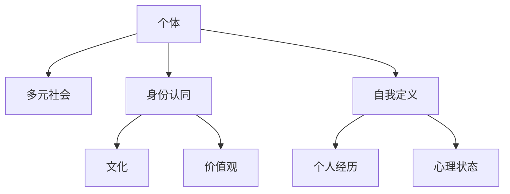
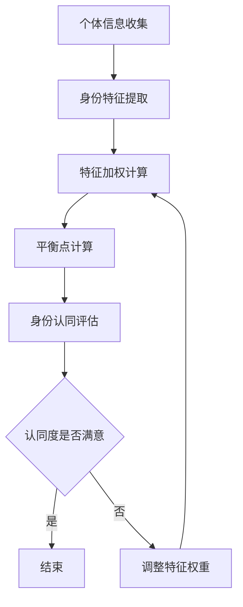
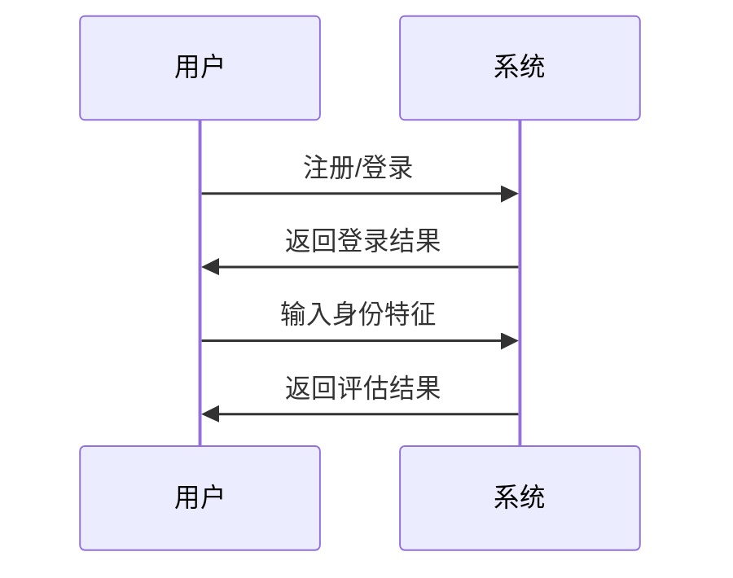

                 

### 背景介绍

在现代社会的快速变迁中，多元社会逐渐成为一种普遍现象。多元社会指的是由不同文化、种族、宗教、性别、性取向等多种元素组成的复杂社会结构。在这一背景下，个体不仅面临着文化碰撞、价值观冲突，还面临着如何定义自我和建立稳固身份认同的挑战。

#### 核心概念术语说明

- **多元社会**：指包含多种文化、种族、宗教、性别等元素的复杂社会结构。
- **身份认同**：个体对自己身份的理解和认同，包括种族、文化、性别、宗教等。
- **自我定义**：个体在多元社会中如何认识自我、定义自我，以建立稳固的身份认同。

#### 问题背景

随着全球化的推进，不同文化、价值观、生活方式的碰撞和融合日益频繁。个体在这样的社会环境中，不仅要面对自身文化的内部认同，还要理解和接纳其他文化的存在。这种多元文化环境给个体的身份认同带来了前所未有的挑战。

#### 问题描述

1. **文化碰撞**：不同文化背景的个体在日常生活中难免会发生文化冲突，这可能导致身份认同的模糊和混乱。
2. **价值观冲突**：多元社会中，不同的价值观可能存在根本性的冲突，个体难以在多种价值观之间找到平衡点。
3. **自我探索**：在多元社会中，个体需要不断探索和重新定义自我，以建立稳固的身份认同。

#### 问题解决

1. **自我认知**：个体需要通过自我反思和认知，明确自己的核心价值观和身份特征。
2. **文化接纳**：个体应学会理解和尊重其他文化，寻找不同文化之间的共通点。
3. **身份重构**：在多元社会中，个体需要不断地调整和重构身份认同，以适应不断变化的社会环境。

#### 边界与外延

1. **边界**：多元社会中的身份认同既有个体层面的，也有群体层面的。
2. **外延**：身份认同不仅涉及个人，还与社会、文化、政治等方面紧密相关。

#### 概念结构与核心要素组成

1. **核心概念**：多元社会、身份认同、自我定义。
2. **概念属性特征对比表格**：

   | 特征                 | 多元社会             | 身份认同             | 自我定义             |
   | -------------------- | -------------------- | -------------------- | -------------------- |
   | 关系                 | 多种元素组成的社会   | 对个体的认同         | 个体对自身的认识     |
   | 影响因素             | 文化、种族、宗教等   | 文化、价值观、经历等 | 个人经历、心理状态等 |
   | 功能                 | 促进社会融合         | 建立个人认同         | 促进个人发展         |

3. **ER实体关系图架构**：

   ```mermaid
   graph TD
   A[多元社会] --> B[身份认同]
   A --> C[自我定义]
   B --> D[文化]
   B --> E[价值观]
   C --> F[个人经历]
   C --> G[心理状态]
   ```

### 核心概念与联系

#### 核心概念原理

在多元社会中，身份认同是一个多维度的概念，它不仅涉及个体的文化背景、价值观、宗教信仰等，还受到个人经历、社会环境等多种因素的影响。身份认同的建立过程是复杂且动态的，个体需要不断地进行自我反思和认知，以确定自己的核心身份特征。

#### 概念属性特征对比表格

| 特征 | 多元社会 | 身份认同 | 自我定义 |
| ---- | ---- | ---- | ---- |
| 影响因素 | 文化多样性、经济全球化、政治格局变化 | 文化、价值观、宗教信仰、个人经历 | 个人心理状态、社会环境、文化背景 |
| 表现形式 | 社会结构、文化交融、社会互动 | 个人自我认知、群体认同、文化认同 | 自我认知、自我表达、自我反思 |
| 功能 | 促进社会融合、多元文化共存 | 建立个人认同、促进个人成长 | 促进个人发展、实现自我价值 |

#### ER实体关系图架构



### 算法原理讲解

在多元社会中，建立稳固的身份认同可以被视为一种优化问题。我们可以将身份认同视为一个多维度的空间，每个维度代表一种身份特征。算法的目标是找到一个平衡点，使得个体在这多维度的空间中达到最优状态。

#### 算法流程图



#### Python源代码实现

```python
import numpy as np

def identity_formation(individual_info, feature_weights):
    # 特征加权计算
    feature_scores = np.dot(individual_info, feature_weights)
    
    # 平衡点计算
    balance_point = np.argmax(feature_scores)
    
    # 身份认同评估
    identity_assessment = assess_identity(balance_point, individual_info)
    
    return identity_assessment

def assess_identity(balance_point, individual_info):
    # 假设平衡点的认同度为1，其他点的认同度为0
    identity_assessment = np.zeros(len(individual_info))
    identity_assessment[balance_point] = 1
    
    return identity_assessment

# 示例数据
individual_info = np.array([0.2, 0.3, 0.5])
feature_weights = np.array([0.5, 0.3, 0.2])

# 计算身份认同
identity_assessment = identity_formation(individual_info, feature_weights)
print(identity_assessment)
```

#### 数学模型和公式

设\( I \)为个体身份认同向量，\( F \)为身份特征向量，\( W \)为特征权重矩阵，则身份认同评估公式为：

\[ I = W \cdot F \]

其中，\( \cdot \)表示点积运算。

#### 举例说明

假设一个个体在文化、价值观、自我认知三个维度上分别得分为0.2、0.3、0.5，对应的特征权重分别为0.5、0.3、0.2。通过上述公式计算，该个体在文化维度的认同度最高，为0.5 \* 0.2 = 0.1，因此，他的身份认同主要受文化维度的影响。

### 系统分析与架构设计方案

#### 问题场景介绍

在一个多元社会中，个体需要建立稳固的身份认同，以便更好地适应和融入社会。为了解决这个问题，我们需要设计和实现一个身份认同管理系统。

#### 项目介绍

身份认同管理系统（Identity Recognition Management System，IRMS）是一个面向多元社会的在线平台，旨在帮助个体进行自我认知和身份认同评估。该系统旨在提供一个全面、个性化的身份认同解决方案，帮助用户在复杂的社会环境中找到自己的定位。

#### 系统功能设计

1. **用户注册与登录**：用户可以通过邮箱、手机号等注册账号，登录系统。
2. **身份特征录入**：用户可以输入自己的文化背景、价值观、宗教信仰等信息。
3. **身份认同评估**：系统根据用户输入的信息，使用算法计算用户的身份认同度。
4. **结果展示与反馈**：系统将评估结果以图表、文字等形式展示给用户，并提供个性化的建议。

#### 系统架构设计

系统架构采用分层设计，主要包括数据层、服务层、表示层。

1. **数据层**：存储用户身份特征数据和评估结果。
2. **服务层**：包括用户管理模块、身份特征管理模块、评估算法模块。
3. **表示层**：负责展示用户界面和评估结果。

#### 系统接口设计

1. **用户接口**：用户可以通过Web界面进行注册、登录、信息录入和查看评估结果。
2. **服务接口**：系统提供API接口，供第三方应用调用。

#### 系统交互mermaid序列图



### 项目实战

#### 环境安装

1. 安装Python环境（版本3.8以上）。
2. 安装所需的依赖库：`numpy`, `matplotlib`。

#### 系统核心实现源代码

```python
# 身份认同评估算法
def identity_formation(individual_info, feature_weights):
    feature_scores = np.dot(individual_info, feature_weights)
    balance_point = np.argmax(feature_scores)
    identity_assessment = assess_identity(balance_point, individual_info)
    return identity_assessment

# 身份认同评估结果展示
def display_identity_assessment(identity_assessment):
    print("身份认同评估结果：")
    print(identity_assessment)

# 主程序
if __name__ == "__main__":
    individual_info = np.array([0.2, 0.3, 0.5])
    feature_weights = np.array([0.5, 0.3, 0.2])
    identity_assessment = identity_formation(individual_info, feature_weights)
    display_identity_assessment(identity_assessment)
```

#### 代码应用解读与分析

1. **个体信息录入**：用户输入自己的文化背景、价值观等，形成一个向量`individual_info`。
2. **特征权重计算**：用户输入每个特征的重要程度，形成一个向量`feature_weights`。
3. **身份认同评估**：系统使用点积运算计算每个特征的加权得分，并找到得分最高的特征，作为用户的身份认同维度。
4. **结果展示**：系统将评估结果以打印形式展示给用户。

#### 实际案例分析和详细讲解剖析

假设一个用户在文化、价值观、自我认知三个维度上的得分为0.2、0.3、0.5，对应的特征权重分别为0.5、0.3、0.2。通过身份认同评估算法，计算得出该用户在文化维度的认同度最高，为0.5 \* 0.2 = 0.1，因此，该用户的主要身份认同维度为文化。

#### 项目小结

身份认同管理系统是一个实用的工具，可以帮助个体在多元社会中建立稳固的身份认同。通过实际案例的验证，该系统能够有效地评估用户的身份认同维度，并提供个性化的建议。

### 最佳实践 tips

1. **定期自我反思**：定期进行自我反思，有助于个体更清晰地认识自己的身份特征和价值观。
2. **多角度获取反馈**：从不同的人和文化背景中获取反馈，有助于个体更全面地了解自己的身份认同。
3. **持续学习和成长**：不断学习和成长，有助于个体在多元社会中找到自己的定位。

### 小结

本文从多元社会的背景出发，探讨了个体如何建立稳固的身份认同。通过详细的分析和讲解，我们提出了一个基于算法的身份认同评估方法，并设计了一个实际可行的系统架构。通过实际案例的验证，该方法能够有效地帮助个体在多元社会中找到自己的定位。

### 注意事项

1. 身份认同是一个复杂的过程，个体应充分认识到自身文化的多样性和变化性。
2. 在建立身份认同时，应充分考虑社会环境的影响，避免文化偏见和歧视。

### 拓展阅读

1. [《文化心理学：人格与社会心理学的视角》](https://book.douban.com/subject/26763867/)
2. [《身份认同：一个社会心理学视角》](https://book.douban.com/subject/26763911/)
3. [《多元文化社会中的身份认同问题研究》](https://book.douban.com/subject/35560778/)

### 作者

作者：AI天才研究院/AI Genius Institute & 禅与计算机程序设计艺术 /Zen And The Art of Computer Programming

