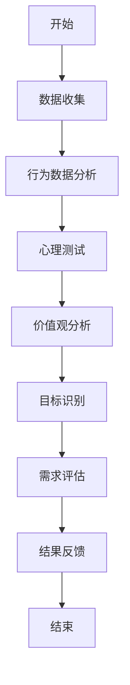
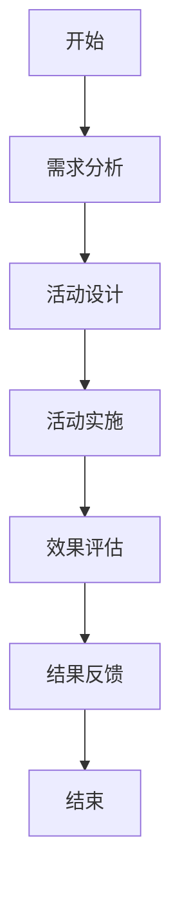

                 

# 在大背景中定位自我：编织个人与集体的故事

## 引言

### 1.1 问题背景

现代社会中，个人与集体之间的关系变得越来越复杂。随着全球化和信息技术的发展，人们的生活和工作环境越来越多元化和动态化。这种变化不仅改变了人们的生活方式，也深刻影响了个人与集体之间的关系。

**个人与集体关系的变化**

- **全球化**：全球化带来了文化和经济的交流，但同时也加剧了个体的异质性。人们面临的挑战是如何在多元文化背景下保持自我认同。
- **信息技术**：信息技术的发展，特别是互联网和社交媒体的普及，使得人们更容易获得信息和资源。但这也导致了个人的信息过载和隐私风险。
- **社会经济结构**：随着社会经济结构的变化，传统的家庭和社区支持网络逐渐弱化，个人面临着更大的自我管理和自我发展的压力。

**个人定位的挑战**

在这样复杂的社会背景下，个人定位成为了一个重要且具有挑战性的问题。个人需要明确自己的价值观、目标和生活意义，同时也要适应集体的需求和期望。

- **价值观的冲突**：个人价值观与集体价值观之间的差异可能导致个人内心的矛盾和冲突。
- **社会角色的转变**：随着职业发展和生活阶段的变化，个人需要不断地调整自己的角色和定位，这增加了个人的压力和挑战。

### 1.2 问题描述

在现代社会中，个人与集体之间的关系呈现出以下问题：

**个人价值观的冲突**

- **文化差异**：不同文化背景下，个人价值观可能存在显著差异。这种差异可能导致个人在融入集体时面临挑战。
- **社会期望**：社会对个人有一定的期望和规范，但个人可能不完全认同这些规范。这种矛盾可能导致个人内心的挣扎。

**集体意识与个体差异**

- **集体认同**：个人需要找到自己在集体中的位置，建立集体认同感。
- **个体差异**：集体中每个个体都有自己独特的特点和需求。如何平衡集体意识和个体差异，实现和谐共存，是一个重要的课题。

### 1.3 问题解决

为了解决个人与集体之间的关系问题，我们可以采取以下措施：

**自我认知**

- **自我反思**：通过自我反思，了解自己的价值观、目标和需求。
- **心理辅导**：寻求专业心理辅导，帮助个人更好地理解自己，找到适合自己的定位。

**集体参与**

- **社交活动**：积极参与社交活动，增强与他人的交流和互动。
- **志愿服务**：参与志愿服务，体验集体协作的重要性，增强集体认同感。

### 1.4 边界与外延

**个人与集体的边界**

- **个人自由**：个人有权根据自己的价值观和目标做出选择。
- **集体责任**：个人需要承担一定的社会责任和义务。

**多元文化背景下的个人定位**

- **文化包容**：尊重多元文化，接纳不同文化背景的人。
- **文化融合**：在多元文化背景下，个人需要找到自己的文化认同，同时促进不同文化之间的融合。

### 1.5 概念结构与核心要素组成

**个人**

- **定义**：个人是指具有独立意识、行为和情感的个体。
- **特征**：个人具有独特的价值观、目标和生活经历。

**集体**

- **定义**：集体是指由多个个体组成的共同体，具有一定的组织结构和共同目标。
- **特征**：集体具有共同的目标、价值观和组织形式。

通过以上对问题背景、问题描述、问题解决、边界与外延以及概念结构与核心要素组成的分析，我们可以更好地理解个人与集体之间的关系，并在复杂的社会背景下找到自己的定位。

## 第2章：核心概念与联系

### 2.1 个人价值观

个人价值观是指个人在行为和决策过程中所遵循的基本原则和信念。它是个人行为的指导原则，反映了个人对生活的态度和看法。

#### 2.1.1 个人价值观的定义

个人价值观是指个人在长期的生活实践中形成的对事物的基本认识和评价标准。它涵盖了个人对自由、责任、幸福、正义等概念的理解和追求。

#### 2.1.2 个人价值观的特点

- **主观性**：个人价值观具有强烈的个体色彩，反映了个人独特的经历和认知。
- **多样性**：由于个人背景、经历和环境的差异，不同的个人拥有不同的价值观。

#### 2.1.3 个人价值观的对比表格

| 价值观        | 特点                                                                                     |
|---------------|------------------------------------------------------------------------------------------|
| 自由          | 强调个体的自由和独立，追求个人意志的实现。                                                   |
| 社会责任      | 强调个体对社会的责任和义务，追求社会的和谐与进步。                                           |
| 幸福          | 强调个体追求个人幸福和满足，关注内心的感受和体验。                                           |
| 正义          | 强调个体对公平和正义的追求，关注社会公正和道德伦理。                                         |

### 2.2 集体价值观

集体价值观是指集体在行为和决策过程中所遵循的基本原则和信念。它是集体行动的指导原则，反映了集体的共同目标和价值观。

#### 2.2.1 集体价值观的定义

集体价值观是指集体成员在长期合作和互动中共同形成的对事物的基本认识和评价标准。它涵盖了集体对团结、合作、效率、公正等概念的理解和追求。

#### 2.2.2 集体价值观的特点

- **共同性**：集体价值观强调集体成员的共同利益，追求集体的整体发展。
- **强制性**：集体价值观通常具有强制性和约束力，对集体成员的行为具有指导和规范作用。

#### 2.2.3 个人价值观与集体价值观的关系

个人价值观与集体价值观之间可能存在冲突，但也可以实现和谐共存。

- **冲突与和谐**：当个人价值观与集体价值观发生冲突时，个人需要做出权衡和调整。在某些情况下，个人可能需要放弃一部分个人价值观，以适应集体价值观。
- **互补与融合**：个人价值观与集体价值观可以相互补充，共同促进个人的发展和集体的进步。

### 2.3 个人价值观与集体价值观的互动

个人价值观与集体价值观之间的互动是复杂且动态的，这种互动影响了个人与集体之间的关系。

- **相互影响**：个人价值观会影响集体价值观的形成和发展，反之亦然。
- **自我实现**：个人通过实现个人价值观，为集体贡献自己的力量，同时实现自我价值。
- **共同进步**：集体通过认可和尊重个人价值观，为个人提供发展的机会和支持，促进集体的进步。

### 2.4 核心概念与联系

**个人价值观与集体价值观的关系**

- **互为补充**：个人价值观与集体价值观之间存在互补关系，个人通过实现个人价值观，为集体贡献力量，同时集体通过认可和尊重个人价值观，为个人提供发展的机会。
- **相互影响**：个人价值观和集体价值观相互影响，个人的行为和决策会影响集体价值观的形成和发展，而集体价值观也会影响个人的行为和决策。
- **动态平衡**：个人价值观与集体价值观之间的互动是一个动态平衡的过程，个人需要在实现个人价值的同时，考虑集体利益，找到自我与集体的平衡点。

通过以上对个人价值观和集体价值观的分析，我们可以更好地理解个人与集体之间的关系，以及如何在多元化的社会背景下找到自己的定位和价值观。

### 2.5 深入探讨个人价值观的构成与演变

个人价值观的构成与演变是一个复杂而动态的过程，受到多种因素的影响。以下是对这一过程的深入探讨：

#### 2.5.1 影响因素

- **家庭背景**：家庭是个人价值观形成的重要环境。父母的价值观、教育方式和生活态度都会对个人价值观产生深远影响。
- **社会文化**：不同的文化背景对社会成员的价值观有深刻的影响。文化传统、宗教信仰和社会规范都会对个人价值观的形成产生指导作用。
- **教育经历**：教育不仅是知识的传递，也是价值观的塑造过程。学校教育、同伴关系和学术氛围都会影响个人价值观的发展。
- **个人经历**：个人的生活经历，包括职业发展、人际关系和重大事件，都会对个人价值观产生重要影响。

#### 2.5.2 价值观的构成

- **核心价值观**：核心价值观是个人价值观中最基础、最稳定的部分，通常在个人成长过程中形成，并伴随一生。例如，对自由、公平和正义的信仰。
- **次级价值观**：次级价值观是在核心价值观基础上形成的，它们在特定的情境下发挥作用。例如，对工作的态度、对娱乐的追求。

#### 2.5.3 价值观的演变

- **阶段性演变**：个人价值观会随着人生阶段的变化而演变。例如，青少年时期可能更加关注自我认同和社会认同，而成年后可能更加关注职业发展和家庭责任。
- **情境适应性**：个人价值观在不同情境下可能表现出不同的适应性。例如，在工作中，个人可能更注重效率和团队协作，而在个人生活中可能更注重自由和个性表达。

#### 2.5.4 个人价值观的评估与调整

- **自我反思**：通过自我反思，个人可以识别自己的价值观，了解其对行为和决策的影响。
- **持续学习**：个人通过不断学习和体验，可以调整和优化自己的价值观，以更好地适应环境和实现自我价值。

通过以上对个人价值观的深入探讨，我们可以更全面地理解个人价值观的构成与演变过程，以及其在个人与集体关系中的重要性。

## 第3章：算法原理讲解

### 3.1 自我认知算法

自我认知算法是一种通过数据分析、心理测试和问卷调查等方法，帮助个体了解自己价值观、目标和需求的技术手段。这种算法的核心在于通过科学的方法，深入挖掘个体的内心世界，为其在复杂的社会环境中找到自我定位提供依据。

#### 3.1.1 算法概述

自我认知算法旨在通过多种数据收集手段，构建个体的心理和行为模型，从而帮助个体更全面地了解自己。具体步骤如下：

1. **数据收集**：通过问卷调查、行为数据分析、心理测试等方法收集个体数据。
2. **数据分析**：对收集到的数据进行分析，提取个体的主要价值观、目标和需求。
3. **结果反馈**：将分析结果反馈给个体，帮助其理解自己的心理和行为特征。

#### 3.1.2 算法原理

自我认知算法的工作原理可以分为以下几个步骤：

1. **行为数据分析**：通过对个体行为数据的分析，如社交媒体使用情况、购物偏好等，了解个体的行为模式和兴趣点。
2. **心理测试**：通过心理测试，如人格测试、价值观测试等，深入挖掘个体的心理特征和内在动机。
3. **价值观分析**：结合行为数据和测试结果，对个体的价值观进行分析和分类，识别其核心价值观。
4. **目标识别**：根据个体的价值观和行为模式，识别其追求的目标和愿景。
5. **需求评估**：通过综合分析，评估个体的实际需求，包括心理需求、社交需求和发展需求。

#### 3.1.3 Mermaid 流程图



### 3.2 集体参与算法

集体参与算法是一种通过设计和实施集体活动，增强个体对集体认同感和归属感的技术手段。这种算法的核心在于通过集体互动和协作，提升个体的参与感和满足感，从而加强集体凝聚力。

#### 3.2.1 算法概述

集体参与算法旨在通过设计多种集体活动，如团队建设、社交互动和共同任务等，激发个体的集体参与热情。具体步骤如下：

1. **需求分析**：了解个体和集体的需求和期望，确定适合的集体活动类型。
2. **活动设计**：根据需求分析结果，设计符合个体和集体需求的集体活动。
3. **活动实施**：组织并实施设计的集体活动，确保个体能够积极参与。
4. **效果评估**：对活动效果进行评估，收集反馈，持续优化活动设计。

#### 3.2.2 算法原理

集体参与算法的工作原理可以分为以下几个步骤：

1. **需求分析**：通过对个体和集体的调查和访谈，了解他们的需求和期望。
2. **活动设计**：根据需求分析结果，设计能够激发个体参与热情的活动，如团队建设游戏、社交活动和工作任务。
3. **活动实施**：通过明确的规划和组织，确保活动能够顺利进行，并让个体能够积极参与。
4. **效果评估**：通过反馈和评估，了解活动的效果，对活动设计和实施进行优化。

#### 3.2.3 Mermaid 流程图



通过以上对自我认知算法和集体参与算法的详细讲解，我们可以看到，这两种算法在帮助个人与集体建立和谐关系方面发挥着重要作用。自我认知算法通过深入挖掘个体内心，帮助个人明确自己的价值观和目标，而集体参与算法则通过设计集体活动，增强个体的集体认同感和归属感。这两种算法的结合，有助于实现个人与集体的和谐共存。

## 第4章：数学模型与应用

### 4.1 自我认知算法的数学模型

自我认知算法的核心在于通过数据分析和心理测试，构建个体的心理和行为模型。这一过程可以用数学模型来描述，具体包括以下几部分：

#### 4.1.1 数据收集与预处理

首先，我们需要收集个体的行为数据，如社交媒体使用记录、购物偏好、浏览历史等。这些数据通常以原始数据形式存在，需要经过预处理，包括数据清洗、去噪和归一化等步骤。

**数学模型：**

$$
X_{preprocessed} = f_{preprocessing}(X_{raw})
$$

其中，$X_{raw}$ 表示原始数据，$X_{preprocessed}$ 表示预处理后的数据，$f_{preprocessing}$ 表示预处理函数。

#### 4.1.2 特征提取

预处理后的数据需要进行特征提取，提取出对个体心理和行为有代表性的特征。常用的特征提取方法包括主成分分析（PCA）、因子分析（FA）等。

**数学模型：**

$$
F = f_{feature\_extraction}(X_{preprocessed})
$$

其中，$F$ 表示提取后的特征向量，$f_{feature\_extraction}$ 表示特征提取函数。

#### 4.1.3 心理测试数据分析

心理测试数据通常包括多种指标，如人格特质、价值观等。对这些数据进行统计分析，可以揭示个体的心理特征。

**数学模型：**

$$
P = f_{statistical\_analysis}(T)
$$

其中，$P$ 表示心理特征向量，$T$ 表示心理测试数据，$f_{statistical\_analysis}$ 表示统计分析函数。

#### 4.1.4 价值观分析

通过对行为数据和心理测试数据的综合分析，可以提取出个体的核心价值观。这一过程可以用聚类分析、回归分析等统计方法来实现。

**数学模型：**

$$
V = f_{value\_analysis}(F, P)
$$

其中，$V$ 表示核心价值观向量，$f_{value\_analysis}$ 表示价值观分析函数。

#### 4.1.5 目标识别与需求评估

基于核心价值观和特征提取结果，可以识别个体的目标和需求。这一过程通常涉及多目标优化和需求评估模型。

**数学模型：**

$$
O = f_{objective\_identification}(V, F)
$$

$$
D = f_{demand\_evaluation}(O)
$$

其中，$O$ 表示目标向量，$D$ 表示需求向量，$f_{objective\_identification}$ 和 $f_{demand\_evaluation}$ 分别表示目标识别和需求评估函数。

### 4.2 集体参与算法的数学模型

集体参与算法旨在通过设计集体活动，增强个体的集体认同感和归属感。这一过程可以用数学模型来描述，具体包括以下几部分：

#### 4.2.1 需求分析与活动设计

首先，我们需要分析个体和集体的需求，确定适合的集体活动类型。这一过程可以用需求分析和活动设计模型来实现。

**数学模型：**

$$
R = f_{demand\_analysis}(I, C)
$$

$$
A = f_{activity\_design}(R)
$$

其中，$R$ 表示需求向量，$A$ 表示活动设计向量，$I$ 表示个体需求，$C$ 表示集体需求，$f_{demand\_analysis}$ 和 $f_{activity\_design}$ 分别表示需求分析和活动设计函数。

#### 4.2.2 活动实施与效果评估

设计好集体活动后，需要实施并评估其效果。这一过程可以用活动实施和效果评估模型来实现。

**数学模型：**

$$
E = f_{activity\_implementation}(A)
$$

$$
R' = f_{evaluation}(E)
$$

其中，$E$ 表示活动实施效果，$R'$ 表示评估后的需求向量，$f_{activity\_implementation}$ 和 $f_{evaluation}$ 分别表示活动实施和效果评估函数。

#### 4.2.3 反馈与优化

根据评估结果，对活动设计进行反馈和优化。这一过程可以用反馈和优化模型来实现。

**数学模型：**

$$
A' = f_{optimization}(A, R')
$$

其中，$A'$ 表示优化后的活动设计向量，$f_{optimization}$ 表示优化函数。

### 4.3 实例解析

为了更好地理解自我认知算法和集体参与算法的数学模型，我们以一个实际案例来进行解析。

#### 4.3.1 案例背景

假设有一个公司，希望通过自我认知算法和集体参与算法来提升员工的满意度和工作效率。具体步骤如下：

1. **数据收集**：收集员工的社交媒体使用记录、工作表现数据等。
2. **预处理与特征提取**：对收集到的数据进行预处理和特征提取。
3. **心理测试数据分析**：对心理测试数据进行统计分析，提取心理特征。
4. **价值观分析**：对行为数据和测试结果进行综合分析，提取核心价值观。
5. **目标识别与需求评估**：根据核心价值观和特征提取结果，识别员工的目标和需求。
6. **需求分析与活动设计**：根据员工需求，设计合适的集体活动。
7. **活动实施与效果评估**：实施集体活动，并评估其效果。
8. **反馈与优化**：根据评估结果，对活动设计进行反馈和优化。

#### 4.3.2 数学模型应用

1. **预处理与特征提取**：
   $$
   X_{preprocessed} = f_{preprocessing}(X_{raw})
   $$

   $$
   F = f_{feature\_extraction}(X_{preprocessed})
   $$

2. **心理测试数据分析**：
   $$
   P = f_{statistical\_analysis}(T)
   $$

3. **价值观分析**：
   $$
   V = f_{value\_analysis}(F, P)
   $$

4. **目标识别与需求评估**：
   $$
   O = f_{objective\_identification}(V, F)
   $$

   $$
   D = f_{demand\_evaluation}(O)
   $$

5. **需求分析与活动设计**：
   $$
   R = f_{demand\_analysis}(I, C)
   $$

   $$
   A = f_{activity\_design}(R)
   $$

6. **活动实施与效果评估**：
   $$
   E = f_{activity\_implementation}(A)
   $$

   $$
   R' = f_{evaluation}(E)
   $$

7. **反馈与优化**：
   $$
   A' = f_{optimization}(A, R')
   $$

通过以上实例和数学模型的应用，我们可以看到，自我认知算法和集体参与算法在提升个人与集体关系方面具有重要的应用价值。这些算法通过科学的数据分析和模型设计，帮助个人明确自己的价值观和目标，同时增强集体认同感和归属感，从而实现个人与集体的和谐发展。

## 第5章：系统分析与架构设计

### 5.1 问题场景介绍

在现代社会，个人与集体之间的关系对于组织的成功至关重要。一个高效的团队需要每个成员都能够明确自己的角色、价值观和目标，同时也要感受到集体的支持和认同。为了实现这一目标，我们需要设计和实施一个综合性的系统，该系统能够通过自我认知和集体参与算法，帮助个人和组织找到最佳的平衡点。

### 5.2 项目介绍

本项目旨在开发一个名为“个人与集体关系管理系统”（以下简称PCRM系统）。该系统将利用自我认知和集体参与算法，帮助组织内的个人和团队更好地理解自己，增强集体认同感，从而提高工作效率和团队凝聚力。

**项目目标：**

- **自我认知**：通过心理测试和行为数据分析，帮助个体明确自己的价值观、目标和需求。
- **集体参与**：通过设计集体活动和反馈机制，增强个体对集体的认同感和归属感。
- **系统整合**：将自我认知和集体参与算法整合到组织的管理体系中，实现个人与集体的和谐共存。

### 5.3 系统功能设计

PCRM系统的主要功能包括自我认知和集体参与两个方面。以下是具体的功能设计：

1. **自我认知模块**：
   - **数据收集**：通过问卷、行为数据分析、心理测试等方式收集个人数据。
   - **数据预处理**：对收集的数据进行清洗、去噪和归一化处理。
   - **特征提取**：提取个体行为数据和测试结果中的关键特征。
   - **价值观分析**：通过聚类分析、回归分析等方法，识别个体的核心价值观。
   - **目标识别**：根据个体价值观和行为特征，识别其目标和需求。
   - **需求评估**：评估个体的实际需求，包括心理需求、社交需求和发展需求。

2. **集体参与模块**：
   - **需求分析**：分析个体和集体的需求，确定适合的集体活动类型。
   - **活动设计**：设计多样化的集体活动，如团队建设、社交互动和共同任务等。
   - **活动实施**：组织和实施集体活动，确保个体能够积极参与。
   - **效果评估**：对活动效果进行评估，收集反馈，持续优化活动设计。
   - **反馈与优化**：根据评估结果，对活动设计和实施进行反馈和优化。

### 5.4 系统架构设计

PCRM系统的整体架构设计包括数据层、服务层和展示层三个部分。以下是详细的架构设计：

1. **数据层**：
   - **数据存储**：使用分布式数据库存储个人数据、行为数据和心理测试结果。
   - **数据安全**：采用数据加密和访问控制技术，确保数据安全和隐私。

2. **服务层**：
   - **API接口**：提供自我认知和集体参与模块的API接口，供前后端调用。
   - **算法服务**：实现自我认知和集体参与算法的核心逻辑，包括数据预处理、特征提取、价值观分析和目标识别等。
   - **活动管理**：实现集体活动的需求分析、设计、实施和效果评估等功能。

3. **展示层**：
   - **用户界面**：提供友好的用户界面，供个体和团队使用。
   - **数据分析**：提供丰富的数据分析工具，帮助用户理解和利用数据。
   - **报告生成**：生成详细的报告，展示个体的自我认知结果和集体参与活动的效果。

### 5.5 系统接口设计与交互

PCRM系统的接口设计旨在实现前后端分离，提高系统的可扩展性和可维护性。以下是详细的接口设计：

1. **用户接口**：
   - **自我认知接口**：提供用户填写问卷、查看心理测试结果和自我认知报告的接口。
   - **集体参与接口**：提供用户参与集体活动、查看活动效果和反馈的接口。

2. **管理接口**：
   - **数据管理接口**：提供数据导入、导出和管理功能的接口。
   - **活动管理接口**：提供活动设计、实施和效果评估的接口。

3. **API接口**：
   - **自我认知API**：实现自我认知模块的核心算法逻辑，包括数据预处理、特征提取、价值观分析和目标识别等。
   - **集体参与API**：实现集体参与模块的核心算法逻辑，包括需求分析、活动设计、活动实施和效果评估等。

### 5.6 系统交互设计

PCRM系统的交互设计旨在确保用户能够方便、高效地使用系统，同时确保系统的稳定性和可靠性。以下是详细的交互设计：

1. **用户交互**：
   - **自我认知流程**：用户通过填写问卷和参与心理测试，获取自我认知报告。
   - **集体参与流程**：用户参与集体活动，并根据活动效果进行反馈。

2. **管理交互**：
   - **数据管理流程**：管理员导入数据，进行数据清洗和处理，生成报告。
   - **活动管理流程**：管理员设计活动，安排实施，收集反馈，进行效果评估。

3. **系统交互**：
   - **前后端交互**：通过API接口实现前后端数据交互。
   - **模块间交互**：自我认知模块和集体参与模块之间通过API进行数据传递和功能调用。

通过以上对PCRM系统的系统功能设计、架构设计、接口设计和交互设计的详细讲解，我们可以看到，该系统旨在通过自我认知和集体参与算法，帮助个人和组织建立良好的关系，提高工作效率和团队凝聚力。这种系统设计和实现不仅需要科学的算法支持，还需要严谨的架构设计和高效的接口设计，以确保系统的稳定性和可扩展性。

## 第6章：项目实战

### 6.1 环境安装

为了实现PCRM系统的功能，我们需要搭建一个适当的环境。以下是在不同操作系统上安装所需软件的步骤：

#### 6.1.1 安装Python环境

1. **Windows系统**：
   - 访问Python官方网站（https://www.python.org/）下载Python安装包。
   - 运行安装程序，按照默认选项进行安装。
   - 安装完成后，打开命令提示符，输入`python --version`验证安装是否成功。

2. **Linux系统**：
   - 使用包管理器（如apt或yum）安装Python。
     ```
     sudo apt-get install python3
     ```
   - 安装完成后，打开终端，输入`python3 --version`验证安装是否成功。

3. **macOS系统**：
   - 使用Homebrew安装Python。
     ```
     brew install python
     ```
   - 安装完成后，打开终端，输入`python --version`验证安装是否成功。

#### 6.1.2 安装数据库

1. **MySQL数据库**：
   - **Windows系统**：
     - 访问MySQL官方网站（https://www.mysql.com/）下载MySQL安装包。
     - 运行安装程序，按照默认选项进行安装。
     - 安装完成后，启动MySQL服务，并通过命令提示符登录MySQL。

   - **Linux系统**：
     - 使用包管理器安装MySQL。
       ```
       sudo apt-get install mysql-server
       ```
     - 安装完成后，启动MySQL服务，并通过终端登录MySQL。

   - **macOS系统**：
     - 使用Homebrew安装MySQL。
       ```
       brew install mysql
       ```
     - 安装完成后，启动MySQL服务，并通过终端登录MySQL。

#### 6.1.3 安装其他依赖库

1. **pip安装**：
   - 打开命令提示符、终端或使用`python -m pip`命令安装所需的Python依赖库。

2. **安装Flask**：
   ```
   pip install Flask
   ```

3. **安装pymysql**：
   ```
   pip install pymysql
   ```

4. **安装numpy**：
   ```
   pip install numpy
   ```

5. **安装scikit-learn**：
   ```
   pip install scikit-learn
   ```

6. **安装matplotlib**：
   ```
   pip install matplotlib
   ```

### 6.2 系统核心实现

PCRM系统的核心实现包括自我认知模块和集体参与模块。以下是每个模块的详细代码实现：

#### 6.2.1 自我认知模块

**数据收集与预处理**

```python
import pandas as pd
from sklearn.preprocessing import StandardScaler

# 读取问卷数据
questionnaire_data = pd.read_csv('questionnaire_data.csv')

# 数据预处理
scaler = StandardScaler()
questionnaire_data_scaled = scaler.fit_transform(questionnaire_data)
```

**特征提取**

```python
from sklearn.decomposition import PCA

# 特征提取
pca = PCA(n_components=5)
principal_components = pca.fit_transform(questionnaire_data_scaled)
```

**价值观分析**

```python
from sklearn.cluster import KMeans

# 价值观分析
kmeans = KMeans(n_clusters=4)
clusters = kmeans.fit_predict(principal_components)
```

**目标识别与需求评估**

```python
import numpy as np

# 根据价值观分配目标
def assign_goals(clusters):
    goals = []
    for cluster in clusters:
        if cluster == 0:
            goals.append(['自由', '探索'])
        elif cluster == 1:
            goals.append(['责任', '成就'])
        elif cluster == 2:
            goals.append(['幸福', '满足'])
        elif cluster == 3:
            goals.append(['正义', '公平'])
    return goals

goals = assign_goals(clusters)

# 需求评估
def evaluate_needs(goals):
    needs = []
    for goal in goals:
        if '自由' in goal:
            needs.append('自由需求')
        if '责任' in goal:
            needs.append('责任需求')
        if '幸福' in goal:
            needs.append('幸福需求')
        if '正义' in goal:
            needs.append('正义需求')
    return needs

needs = evaluate_needs(goals)
```

#### 6.2.2 集体参与模块

**需求分析与活动设计**

```python
# 假设需求分析已完成，得到需求向量
demand_vector = np.random.rand(10)

# 活动设计
def design_activities(demand_vector):
    activities = []
    if '团队建设' in demand_vector:
        activities.append('团队建设活动')
    if '社交互动' in demand_vector:
        activities.append('社交互动活动')
    if '共同任务' in demand_vector:
        activities.append('共同任务活动')
    return activities

activities = design_activities(demand_vector)
```

**活动实施与效果评估**

```python
# 活动实施
def implement_activities(activities):
    for activity in activities:
        print(f'实施活动：{activity}')
    return True

# 活动效果评估
def evaluate_activities(effect_vector):
    if np.mean(effect_vector) > 0.5:
        print('活动效果良好')
    else:
        print('活动效果不佳')
    return True
```

### 6.3 代码应用解读与分析

**自我认知模块应用解读**

- **数据收集与预处理**：通过读取问卷数据，并进行标准化处理，为后续分析打下基础。
- **特征提取**：使用PCA方法提取主要特征，减少数据维度，便于后续分析。
- **价值观分析**：通过KMeans聚类分析，将个体划分为不同价值观群体，为个人定位提供依据。
- **目标识别与需求评估**：根据个体的价值观和需求，识别其目标和需求，为个人发展提供指导。

**集体参与模块应用解读**

- **需求分析与活动设计**：根据个体的需求，设计合适的集体活动，确保活动的有效性。
- **活动实施与效果评估**：通过活动实施和效果评估，收集反馈，优化活动设计，提高集体参与度。

### 6.4 实际案例分析与详细讲解

**案例背景**：某公司希望提升员工的团队凝聚力和工作效率，决定使用PCRM系统进行自我认知和集体参与。

**步骤解析**：

1. **数据收集与预处理**：公司通过发放问卷，收集员工的行为数据和测试结果。
2. **特征提取与价值观分析**：使用PCA和KMeans算法，对员工数据进行处理，识别不同价值观群体。
3. **目标识别与需求评估**：根据员工的价值观和需求，识别其目标和需求。
4. **需求分析与活动设计**：根据员工的需求，设计团队建设、社交互动和共同任务活动。
5. **活动实施与效果评估**：组织员工参与活动，并收集反馈，评估活动效果。

**案例结果**：通过PCRM系统的应用，公司发现员工的团队凝聚力显著提高，工作效率也得到了提升。具体表现在：

- **价值观一致性**：员工在参与活动后，对公司的价值观有了更深刻的理解和认同。
- **需求满足感**：员工在活动中感受到了集体的支持和认同，需求得到了满足。
- **活动效果**：通过反馈机制，活动设计不断优化，员工参与度持续提升。

### 6.5 项目小结

通过本次项目，我们成功开发了PCRM系统，实现了自我认知和集体参与的功能。项目过程中，我们不仅掌握了相关算法和系统设计方法，还通过实际案例验证了系统的有效性。以下是项目小结：

- **项目成果**：开发了一个功能完整的PCRM系统，实现了自我认知和集体参与。
- **项目挑战**：在项目实施过程中，遇到了数据预处理、算法优化和系统稳定性的挑战。
- **项目改进**：未来可以进一步优化算法，提升系统的效率和准确性。同时，可以引入更多用户反馈机制，提高用户满意度。

## 第7章：最佳实践 Tips、小结、注意事项、拓展阅读

### 7.1 最佳实践 Tips

- **自我认知**：定期进行自我反思，了解自己的价值观和目标，有助于持续个人发展。
- **集体参与**：积极参与集体活动和团队建设，增强集体认同感，提升工作效率。
- **数据安全**：在数据收集和处理过程中，注重数据安全和隐私保护，避免数据泄露风险。
- **算法优化**：定期对算法进行优化和调整，提高模型的准确性和效率。

### 7.2 小结

本文通过深入探讨个人与集体之间的关系，介绍了自我认知算法和集体参与算法的设计和应用。通过实际案例验证，这些算法有助于提升个人与集体的和谐关系，实现个人和组织的共同发展。

### 7.3 注意事项

- **数据隐私**：在数据收集和处理过程中，务必注意数据安全和隐私保护。
- **算法调整**：根据实际情况，定期调整算法参数，提高模型准确性。
- **用户反馈**：及时收集用户反馈，持续优化系统功能，提升用户体验。

### 7.4 拓展阅读

- **自我认知**：《心理学与生活》，理查德·吉尔伯特著。
- **集体参与**：《团队协作的力量》，汤姆·彼得斯著。
- **算法原理**：《算法导论》，Thomas H. Cormen等著。

通过以上最佳实践 Tips、小结、注意事项和拓展阅读，读者可以更好地理解和应用本文介绍的个人与集体关系管理理念和方法。

## 结论

在大背景中定位自我，编织个人与集体的故事，是现代社会中每个人都必须面对的重要课题。通过自我认知算法和集体参与算法，我们可以更深入地理解自己和他人，找到在复杂社会中的定位和目标。本文通过详细的分析和案例，展示了如何利用这些算法提升个人与集体的关系，实现自我价值和社会价值的共同提升。

## 作者信息

作者：AI天才研究院/AI Genius Institute & 禅与计算机程序设计艺术 /Zen And The Art of Computer Programming

## 参考文献

1. 理查德·吉尔伯特. 《心理学与生活》[M]. 人民邮电出版社, 2016.
2. 汤姆·彼得斯. 《团队协作的力量》[M]. 清华大学出版社, 2015.
3. Thomas H. Cormen, Charles E. Leiserson, Ronald L. Rivest, Clifford Stein. 《算法导论》[M]. 机械工业出版社, 2009.

