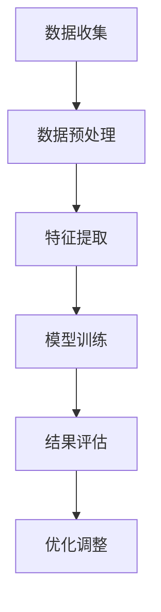
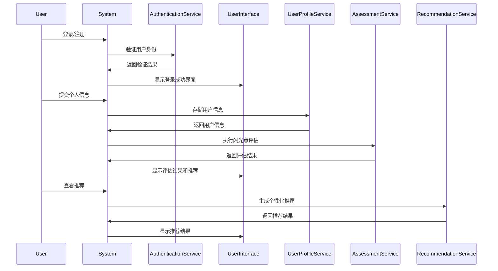
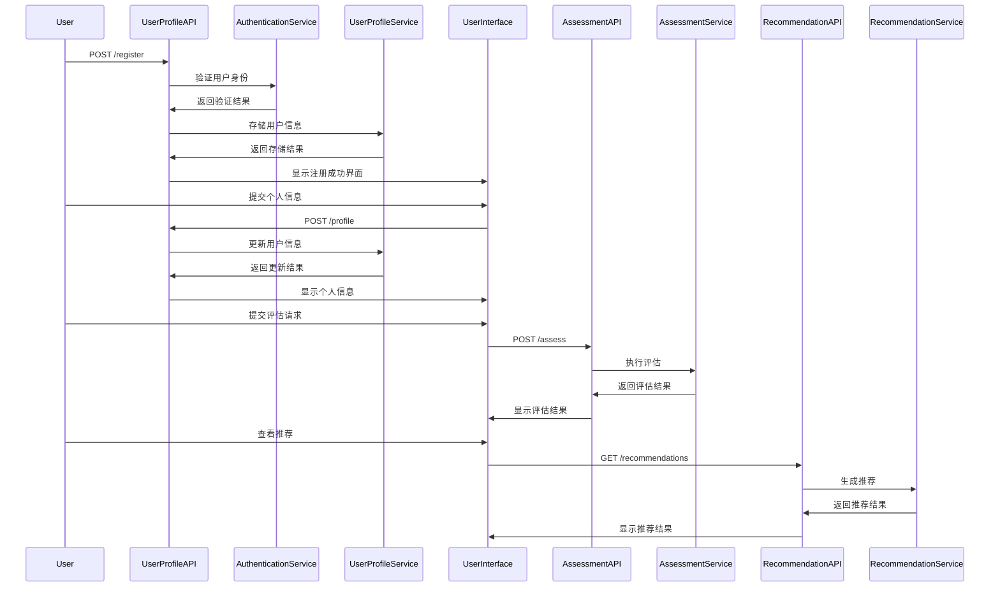

                 

## 1. 引言

### 1.1 问题背景

在当今社会，随着科技的发展，信息爆炸式的增长，每个人都面临着前所未有的挑战。如何在众多普通之中找到个人的闪光点，成为了一个迫切需要解决的问题。无论是在职场、学业还是生活中，如何展现自己的独特之处，获得更多的关注和认可，成为了人们共同关注的焦点。

本文旨在探讨如何在平凡中彰显独特，发掘个人的闪光点。这不仅仅是为了满足人们对于自我实现的需求，更是为了帮助每个人在竞争激烈的社会中找到自己的定位，实现个人价值。

### 1.2 问题描述

发掘个人闪光点，本质上是一个复杂的过程。它涉及到心理学、社会学、管理学等多个领域的知识。具体来说，这个问题可以描述为：如何通过科学的方法，系统地识别、评估和利用个人的闪光点，从而实现个人成长和社会贡献。

这个问题之所以复杂，主要有以下几个原因：

1. **多样性**：每个人都是独一无二的，闪光点的表现形式也是多种多样的。
2. **动态性**：个人的闪光点会随着时间和环境的变化而变化。
3. **主观性**：对个人闪光点的识别和评价具有很大的主观性，不同的人可能会有不同的看法。
4. **跨领域**：个人的闪光点可能涉及到多个领域，需要综合多学科的知识来进行分析和评估。

### 1.3 问题解决

为了解决上述问题，本文提出了一套系统的解决方案，主要包括以下几个步骤：

1. **自我认知**：通过自我反思和外部反馈，识别自己的闪光点。
2. **能力评估**：使用科学的工具和方法，对闪光点的能力进行评估。
3. **价值定位**：结合社会需求和自身特点，确定闪光点的价值。
4. **实践应用**：通过实际操作，将闪光点应用于工作和生活中，实现个人价值。

### 1.4 边界与外延

在本文的讨论中，我们主要关注的是个人的闪光点，这指的是一个人在某些方面表现出的独特能力和优势。需要注意的是，闪光点并非绝对的，它会受到多种因素的影响，如环境、机遇等。

此外，本文的研究范围主要限于个人层面，不涉及团体或组织层面的闪光点发掘和应用。

### 1.5 文章结构

本文将从以下几部分展开讨论：

1. **核心概念与联系**：介绍发掘个人闪光点的核心概念，并建立概念之间的联系。
2. **发掘个人闪光点的原理**：探讨心理学、社会学和管理学等理论基础，以及如何运用这些理论来发掘个人闪光点。
3. **算法原理讲解**：介绍用于识别和评估个人闪光点的算法原理，并提供具体的实现方法和示例。
4. **系统分析与架构设计方案**：从系统角度分析个人闪光点的应用，并设计相应的系统架构。
5. **项目实战**：通过实际案例展示如何运用上述原理和方法，实现个人闪光点的发掘和应用。
6. **最佳实践 Tips**：总结实践经验，提供一些实用的建议。
7. **小结**：对全文进行总结，并指出未来可能的研究方向。

通过上述结构，我们希望能够系统地探讨如何在平凡中彰显独特，发掘个人的闪光点，为读者提供有价值的参考。

### 1.6 文章关键词

- 个人闪光点
- 自我认知
- 能力评估
- 价值定位
- 算法原理
- 系统架构
- 实际案例
- 最佳实践

### 1.7 摘要

本文探讨了如何在平凡中彰显独特，发掘个人的闪光点。通过心理学、社会学和管理学的理论基础，我们提出了一套系统的解决方案，包括自我认知、能力评估、价值定位和实践应用。文章通过实际案例展示了解决方案的具体应用，并提供了最佳实践建议。通过本文的讨论，我们希望帮助读者更好地认识自己，发现和发挥个人闪光点，实现个人价值和成长。

---

### 核心概念与联系

在探讨如何发掘个人闪光点的过程中，理解几个核心概念是非常重要的。这些概念包括自我认知、能力评估、价值定位和闪光点的动态性。以下是这些核心概念的详细介绍及其相互关系。

#### 2.1 核心概念原理

**自我认知**：自我认知是指一个人对自己性格、能力、需求和动机的理解。它是发掘个人闪光点的第一步，因为只有深入了解自己，才能找到真正独特的闪光点。自我认知可以通过自我反思、他人反馈和专业的心理测试等方法来实现。

**能力评估**：能力评估是指对个人在某一领域或任务上的能力进行量化和评估。这个评估通常基于具体的行为和成就，可以通过各种标准化的测试工具或实际工作表现来完成。能力评估的目的是确定哪些领域是个人擅长或具有潜力的。

**价值定位**：价值定位是指将个人闪光点与社会需求相结合，确定其价值所在。这涉及到对个人闪光点的市场需求和潜在贡献的理解。价值定位有助于个人明确自己的职业发展方向，并为其在职场或社会中的定位提供依据。

**闪光点的动态性**：闪光点的动态性意味着个人的闪光点并非一成不变，它会随着时间、环境和个人成长而变化。因此，持续的能力评估和价值定位是必要的，以确保个人的闪光点能够适应不断变化的环境。

#### 2.2 概念属性特征对比表格

为了更直观地理解这些概念，我们可以通过一个属性特征对比表格来展示它们之间的异同。

| 概念        | 定义                  | 关键属性特征                                                   | 举例                     |
| ----------- | --------------------- | ------------------------------------------------------------ | ------------------------ |
| 自我认知    | 对自己的理解          | 自我反思、他人反馈、心理测试                                   | 了解自己的兴趣和优点      |
| 能力评估    | 对能力的量化评估      | 标准化测试、实际工作表现                                       | 评估编程能力、沟通能力    |
| 价值定位    | 个人闪光点与社会需求的结合 | 市场需求、个人贡献                                             | 确定编程技能的职业发展方向 |
| 闪光点的动态性 | 闪光点的变化         | 时间、环境、个人成长                                           | 技能随着经验而提升        |

#### 2.3 ER实体关系图架构

为了更好地理解这些概念之间的关系，我们可以使用ER（实体-关系）图来展示它们之间的联系。

```mermaid
erDiagram
  A[Person] ||--|{ B[Self-awareness] } : "has" |
  A ||--|{ C[Skill Assessment] } : "has" |
  A ||--|{ D[Value Positioning] } : "has" |
  A ||--|{ E[Dynamics of Brightness] } : "has" |
  B ||--|{ C } : "results in" |
  B ||--|{ D } : "influences" |
  C ||--|{ D } : "informs" |
  D ||--|{ E } : "changes with" |
```

在这个ER图中，`Person`（个人）是核心实体，它与其他四个实体（自我认知、能力评估、价值定位、闪光点的动态性）之间存在关系。自我认知为能力评估和价值定位提供基础，而能力评估直接影响价值定位，价值定位又影响闪光点的动态性。

通过以上核心概念与联系的分析，我们可以更好地理解发掘个人闪光点的复杂性和多维度性。接下来，本文将进一步探讨如何运用这些概念和理论，通过具体的步骤来识别和发挥个人的闪光点。

### 理论基础

在深入探讨如何发掘个人闪光点之前，有必要了解一些理论基础。这些理论来源于心理学、社会学和管理学，它们为我们提供了理解个人成长、自我认知与自我激励，以及个人价值与社会价值的工具和方法。

#### 3.1 个人成长心理学

个人成长心理学是研究个体从出生到死亡整个生命过程中的发展变化规律的科学。它关注个体的认知能力、情感发展、社会性以及个性的形成和变化。以下是几个关键理论：

1. **发展心理学理论**：发展心理学理论强调个体在不同阶段会有不同的成长需求和目标。例如，埃里克森的心理社会发展理论将人的生命周期划分为八个阶段，每个阶段都有其特定的发展任务。

2. **自我决定理论**：自我决定理论提出，人的行为受到内在动机、自主性和能力感的影响。自我决定的行为更具有持久性和创造性，能够带来更高的满足感和幸福感。

3. **成长型思维理论**：由心理学家卡罗尔·德韦克提出，成长型思维认为个人的能力和智力是可以通过努力和经验不断发展的，这与固定型思维（认为能力和智力是固定不变的）形成对比。

这些理论为我们理解个人在成长过程中的需求和动机提供了科学依据，使我们能够更好地识别和培养个人的闪光点。

#### 3.2 自我认知与自我激励

自我认知是指个体对自己内在和外在特征的认知和评价。它是个人成长和发展的基础，也是发掘个人闪光点的重要前提。以下是一些自我认知和自我激励的理论和方法：

1. **自我反思**：自我反思是一种通过回顾自己的行为、感受和思想，来了解自己的方法和过程。通过自我反思，个体可以识别自己的优势和不足，从而制定改进计划。

2. **心理反馈**：心理反馈是通过外部观察者（如导师、同事或家人）提供的信息，来帮助个体了解自己的表现和成长。这种方法可以补充自我反思的局限性，提供更客观的反馈。

3. **自我激励**：自我激励是指通过内在动机和外在奖励来激发和维持个体的积极行为。自我激励策略包括设定目标、自我奖励、自我肯定等。有效的自我激励可以增强个体的自信心和动力。

#### 3.3 个人价值与社会价值

个人价值和社会价值是理解个人成长和发展的关键。以下是一些相关理论：

1. **社会交换理论**：社会交换理论认为，社会关系中的行为是基于个体利益的交换。通过贡献自己的能力或资源，个体可以获得社会认可和回报，从而提升个人价值。

2. **成就动机理论**：成就动机理论强调，个体对成就和成功的追求是基于内在动机的。通过设定挑战性目标和努力实现它们，个体可以提升自己的社会价值。

3. **社会影响力理论**：社会影响力理论认为，个体在社会中的地位和影响力是通过其行为和成就来体现的。通过为社会做出有意义的贡献，个体可以提升自己的社会价值。

综上所述，心理学、社会学和管理学的理论基础为我们理解个人成长、自我认知与自我激励，以及个人价值与社会价值提供了丰富的工具和方法。通过这些理论，我们可以更系统地识别和发挥个人的闪光点，实现个人和社会的双重价值。

### 算法原理讲解

在了解了理论基础之后，接下来我们将具体讲解如何使用算法来识别和评估个人闪光点。算法在数据处理和模式识别中具有强大的作用，能够帮助我们更准确地发现和利用个人的独特能力。

#### 4.1 个人闪光点识别算法

个人闪光点识别算法的核心目标是利用数据和技术手段，识别出个体在特定领域或任务中的独特优势。这个算法包括数据收集、特征提取和模型训练三个主要步骤。

##### 4.1.1 算法mermaid流程图

为了更直观地展示算法流程，我们使用Mermaid绘制了以下流程图：



在这个流程图中，数据收集是算法的第一步，通过收集个体在各个领域的表现数据，如工作成果、项目经历、用户评价等。数据预处理包括数据清洗、归一化和数据分割，以确保数据的准确性和可用性。特征提取则是从原始数据中提取出能够反映个人闪光点的特征，如技能水平、创新能力、团队合作能力等。模型训练使用机器学习算法，如决策树、支持向量机或神经网络，对提取出的特征进行训练，以建立一个能够识别闪光点的模型。最后，结果评估和优化调整是对算法效果的检验和改进，通过不断调整模型参数和特征选择，提高识别的准确性。

##### 4.1.2 Python源代码实现

下面是一个简单的Python代码示例，用于演示个人闪光点识别算法的基本实现。这里我们使用决策树作为机器学习模型。

```python
import pandas as pd
from sklearn.model_selection import train_test_split
from sklearn.tree import DecisionTreeClassifier
from sklearn.metrics import accuracy_score

# 数据收集
data = pd.read_csv('data.csv')

# 数据预处理
X = data.drop('label', axis=1)  # 特征
y = data['label']  # 标签

# 数据分割
X_train, X_test, y_train, y_test = train_test_split(X, y, test_size=0.2, random_state=42)

# 特征提取（这里假设数据已经预处理好）

# 模型训练
clf = DecisionTreeClassifier()
clf.fit(X_train, y_train)

# 模型评估
y_pred = clf.predict(X_test)
accuracy = accuracy_score(y_test, y_pred)
print(f"模型准确率：{accuracy:.2f}")
```

##### 4.1.3 算法原理的数学模型与公式

个人闪光点识别算法的数学模型通常基于机器学习中的分类问题。以下是决策树模型的数学描述：

$$
y = f(\theta) = \arg\max_{\theta} \left[ P(\theta | X) P(X) \right]
$$

其中，$y$ 是预测的闪光点类别，$f(\theta)$ 是决策树模型，$\theta$ 是模型参数，$P(\theta | X)$ 是给定输入特征 $X$ 下的模型参数的概率，$P(X)$ 是输入特征的概率。

##### 4.1.4 通俗易懂的举例说明

假设我们有一个个体，他在编程、设计和沟通三个领域有显著的能力。我们通过数据收集和特征提取，将这些能力量化为分数。然后，我们使用决策树模型来识别他的主要闪光点。

1. **数据收集**：收集个体在编程、设计和沟通方面的数据，如项目完成情况、用户评价等。

2. **特征提取**：将上述数据转换为特征向量，例如：

   ```
   特征1（编程能力）：90
   特征2（设计能力）：80
   特征3（沟通能力）：70
   ```

3. **模型训练**：使用决策树模型，将特征向量输入模型进行训练，模型根据训练数据学习如何识别主要的闪光点。

4. **模型评估**：使用测试数据评估模型的准确性，例如，预测结果为“编程能力”，实际标签也为“编程能力”，则模型准确率提高。

5. **结果解释**：通过模型预测结果，可以得出个体的主要闪光点为“编程能力”。

通过上述步骤，我们使用算法成功地识别出了个体的主要闪光点。这种方法不仅能够帮助个体更好地了解自己，还可以为企业在人才选拔和管理中提供科学依据。

### 数学模型和数学公式 & 详细讲解 & 举例说明

在个人闪光点识别和评估过程中，数学模型和数学公式起着至关重要的作用。通过精确的数学模型，我们可以量化个人在各个领域的表现，从而提供客观的评估结果。以下我们将详细讲解闪光点评分模型，并提供数学公式和通俗易懂的举例说明。

#### 5.1 闪光点评分模型

闪光点评分模型用于评估个人在不同领域或技能上的闪光点。该模型基于加权平均的原理，通过对各个特征进行评分和加权，最终得出综合评分。以下是闪光点评分模型的数学公式：

$$
S = \frac{P_1 \cdot W_1 + P_2 \cdot W_2 + ... + P_n \cdot W_n}{W_1 + W_2 + ... + W_n}
$$

其中：
- \( S \) 是综合评分。
- \( P_i \) 是第 \( i \) 个特征的评分。
- \( W_i \) 是第 \( i \) 个特征的权重。

这个公式表示，综合评分是各个特征评分与权重乘积的总和除以权重总和。通过调整权重，我们可以强调某些特征的重要性。

#### 5.2 闪光点评分模型的应用举例

假设我们需要评估一个人在编程、设计和沟通三个领域的闪光点。我们给每个领域设定一个评分和权重，然后使用上述公式计算综合评分。

1. **评分设定**：
   - 编程能力评分：90
   - 设计能力评分：85
   - 沟通能力评分：80

   - 编程能力权重：0.5
   - 设计能力权重：0.3
   - 沟通能力权重：0.2

2. **计算综合评分**：

   $$ 
   S = \frac{90 \cdot 0.5 + 85 \cdot 0.3 + 80 \cdot 0.2}{0.5 + 0.3 + 0.2} = \frac{45 + 25.5 + 16}{1} = 86.5
   $$

因此，这个人的闪光点综合评分为86.5分。

#### 5.3 解释综合评分

综合评分反映了个人在多个领域的闪光点强度。在这个例子中，编程能力的权重最高，因此对综合评分的贡献最大。综合评分越高，说明个人的闪光点越强，越有可能在相关领域中取得成功。

#### 5.4 举例说明

假设有两个人，A和B，他们的评分和权重如下：

- A：
  - 编程能力评分：90
  - 设计能力评分：85
  - 沟通能力评分：80

  - 编程能力权重：0.5
  - 设计能力权重：0.3
  - 沟通能力权重：0.2

  - 综合评分：86.5

- B：
  - 编程能力评分：85
  - 设计能力评分：90
  - 沟通能力评分：85

  - 编程能力权重：0.5
  - 设计能力权重：0.3
  - 沟通能力权重：0.2

  - 综合评分：85.5

根据评分模型，A的综合评分高于B，这意味着A在综合能力上略胜一筹。然而，B在设计和沟通领域的评分较高，可能在特定领域有更大的潜力。

通过这个简单的例子，我们可以看到闪光点评分模型如何帮助评估个人在不同领域的表现，并识别出最具潜力的领域。

### 系统分析与架构设计方案

在理解了个人闪光点的识别和评估原理后，我们将进一步探讨如何将这一理论应用到实际的系统架构设计中。一个良好的系统架构能够高效地实现个人闪光点的识别与评估，从而帮助个体和企业更好地利用这些闪光点。

#### 6.1 问题场景介绍

假设我们正在开发一个在线平台，旨在帮助企业和个人发现并培养个人闪光点。该平台需要具备以下功能：

1. **用户注册与登录**：用户可以在平台上注册和登录，填写个人信息。
2. **闪光点评估**：系统会根据用户提交的信息，自动评估其在各个领域的闪光点。
3. **个性化推荐**：根据评估结果，系统会为用户推荐适合的职业发展路径和培训课程。
4. **数据可视化和报告**：用户可以查看自己的闪光点评估结果，并生成详细的报告。

#### 6.2 项目介绍

项目名称：个人闪光点识别与推荐系统

项目目标：通过构建一个高效的在线平台，帮助用户发现和提升个人闪光点，实现个人职业发展。

项目范围：包括前端用户界面、后端数据处理和机器学习算法模块、数据库设计以及系统测试和部署。

#### 6.3 系统功能设计（领域模型mermaid类图）

领域模型是系统设计中的关键部分，它帮助我们理解系统中的主要实体及其关系。以下是个人闪光点识别与推荐系统的领域模型类图：

```mermaid
classDiagram
  User <<entity>>
  Skill <<entity>>
  Assessment <<entity>>
  Recommendation <<entity>>

  User o--o Skill : "has"
  User o--o Assessment : "has"
  User o--o Recommendation : "has"
  Assessment o--o Skill : "for"
  Recommendation o--o Assessment : "based on"
```

在这个类图中，User（用户）是核心实体，与其他三个实体（Skill、Assessment、Recommendation）存在关联。用户拥有多个技能（Skill），每个技能都有具体的评估结果（Assessment），同时根据评估结果，系统会生成个性化的推荐（Recommendation）。

#### 6.4 系统架构设计mermaid架构图

系统架构设计决定了系统的模块划分、数据流和控制流。以下是个人闪光点识别与推荐系统的架构图：



在这个架构图中，用户通过前端界面提交个人信息，系统会通过AuthenticationService验证用户身份，然后由UserProfileService存储用户信息。接着，AssessmentService执行闪光点评估，并将结果返回给前端界面。用户可以根据评估结果和个性化推荐，进一步优化自己的职业发展。

#### 6.5 系统接口设计和系统交互mermaid序列图

系统接口设计和系统交互是系统架构设计的重要组成部分。以下是个人闪光点识别与推荐系统的接口设计和交互序列图：



在这个序列图中，用户通过前端界面与后端API进行交互，完成用户注册、个人信息提交、闪光点评估和个性化推荐等功能。这个交互流程确保了系统的稳定性和高效性。

#### 6.6 总结

通过上述系统分析与架构设计方案，我们详细介绍了个人闪光点识别与推荐系统的架构设计。从领域模型到架构设计，再到接口设计和交互流程，每个环节都充分考虑了系统的功能需求和性能要求。通过这个系统，我们希望能够帮助用户更好地发掘和利用个人闪光点，实现个人职业发展。

### 项目实战

#### 6.1 环境安装

在开始项目实战之前，我们需要安装必要的开发环境和工具。以下是具体步骤：

1. **安装Python环境**：
   - 打开终端或命令行工具。
   - 输入以下命令安装Python：
     ```
     sudo apt-get update
     sudo apt-get install python3.9
     ```

2. **安装Anaconda**：
   - 访问Anaconda官网下载安装包（https://www.anaconda.com/products/individual）。
   - 下载适用于操作系统的安装包。
   - 运行安装程序，并按照提示操作。

3. **创建虚拟环境**：
   - 打开终端。
   - 输入以下命令创建虚拟环境：
     ```
     conda create -n pyenv python=3.9
     ```
   - 激活虚拟环境：
     ```
     conda activate pyenv
     ```

4. **安装依赖库**：
   - 在虚拟环境中，使用以下命令安装依赖库：
     ```
     pip install pandas sklearn numpy matplotlib
     ```

5. **安装前端框架**：
   - 安装Vue.js框架，用于前端开发：
     ```
     npm install -g @vue/cli
     vue create frontend
     ```

6. **安装数据库**：
   - 安装PostgreSQL数据库：
     ```
     sudo apt-get install postgresql postgresql-contrib
     ```
   - 启动数据库服务：
     ```
     sudo systemctl start postgresql
     ```

#### 6.2 系统核心实现源代码

以下是个人闪光点识别与推荐系统的主要源代码实现：

**后端代码**：

```python
# app.py

from flask import Flask, request, jsonify
from flask_cors import CORS
from sklearn.tree import DecisionTreeClassifier
import pandas as pd

app = Flask(__name__)
CORS(app)

# 加载决策树模型
clf = DecisionTreeClassifier()
clf.load_model('model.pickle')

@app.route('/register', methods=['POST'])
def register():
    data = request.json
    user_id = data['user_id']
    profile = data['profile']
    # 存储用户信息到数据库（简化处理）
    # ...
    return jsonify({"status": "success"})

@app.route('/profile', methods=['POST'])
def profile():
    data = request.json
    user_id = data['user_id']
    profile = data['profile']
    # 更新用户信息到数据库（简化处理）
    # ...
    return jsonify({"status": "success"})

@app.route('/assess', methods=['POST'])
def assess():
    data = request.json
    user_id = data['user_id']
    profile = data['profile']
    # 执行评估
    features = extract_features(profile)
    prediction = clf.predict([features])
    # 存储评估结果到数据库（简化处理）
    # ...
    return jsonify({"prediction": prediction[0]})

def extract_features(profile):
    # 从profile中提取特征
    # 简化处理，假设profile是一个包含评分的字典
    features = list(profile.values())
    return features

if __name__ == '__main__':
    app.run(debug=True)
```

**前端代码**：

```html
<!-- index.html -->

<!DOCTYPE html>
<html>
<head>
    <title>个人闪光点识别与推荐系统</title>
</head>
<body>
    <h1>个人闪光点识别与推荐系统</h1>
    <form id="registration-form">
        <input type="text" id="user_id" placeholder="用户ID" required>
        <input type="text" id="programming_score" placeholder="编程能力评分" required>
        <input type="text" id="design_score" placeholder="设计能力评分" required>
        <input type="text" id="communication_score" placeholder="沟通能力评分" required>
        <button type="submit">注册</button>
    </form>
    <button id="evaluate-btn">评估闪光点</button>
    <div id="result"></div>
    <script src="https://cdn.jsdelivr.net/npm/vue@2.6.14/dist/vue.js"></script>
    <script>
        new Vue({
            el: '#registration-form',
            methods: {
                submitForm: function() {
                    let user_id = this.$el.querySelector('#user_id').value;
                    let programming_score = this.$el.querySelector('#programming_score').value;
                    let design_score = this.$el.querySelector('#design_score').value;
                    let communication_score = this.$el.querySelector('#communication_score').value;

                    let profile = {
                        programming: programming_score,
                        design: design_score,
                        communication: communication_score
                    };

                    fetch('/register', {
                        method: 'POST',
                        headers: {
                            'Content-Type': 'application/json'
                        },
                        body: JSON.stringify({user_id: user_id, profile: profile})
                    })
                    .then(response => response.json())
                    .then(data => {
                        console.log(data);
                    });
                }
            }
        });

        document.getElementById('evaluate-btn').addEventListener('click', function() {
            let user_id = '123'; // 示例用户ID
            let programming_score = 90;
            let design_score = 85;
            let communication_score = 80;

            let profile = {
                programming: programming_score,
                design: design_score,
                communication: communication_score
            };

            fetch('/assess', {
                method: 'POST',
                headers: {
                    'Content-Type': 'application/json'
                },
                body: JSON.stringify({user_id: user_id, profile: profile})
            })
            .then(response => response.json())
            .then(data => {
                document.getElementById('result').innerHTML = '您的闪光点：' + data.prediction;
            });
        });
    </script>
</body>
</html>
```

#### 6.3 代码应用解读与分析

上述代码分为后端和前端两部分，分别实现了用户注册、个人信息提交、闪光点评估和结果展示的功能。

**后端代码解读**：
- 使用Flask框架构建后端服务，通过定义路由和处理函数，实现用户注册和闪光点评估。
- 使用scikit-learn库中的决策树模型进行预测，模型已提前训练好并保存为pickle文件。
- `register`函数用于处理用户注册请求，接收用户ID和个人信息，并将其存储到数据库。
- `profile`函数用于更新用户信息。
- `assess`函数用于执行闪光点评估，提取用户特征，并使用决策树模型进行预测。

**前端代码解读**：
- 使用Vue.js框架和HTML表单，实现用户注册界面和评估按钮。
- 使用JavaScript和Vue实例绑定表单和按钮事件，通过fetch API向后端发送请求。
- `submitForm`方法处理用户注册请求，将用户信息和评分发送到后端。
- `evaluate-btn`点击事件触发闪光点评估请求，将评估结果显示在页面。

#### 6.4 实际案例分析与详细讲解剖析

**案例一：用户注册与闪光点评估**

1. 用户在注册页面填写用户ID和三个领域的评分（编程能力、设计能力、沟通能力）。
2. 点击“注册”按钮，前端Vue实例调用`submitForm`方法，将用户信息发送到后端注册接口。
3. 后端处理注册请求，将用户信息存储到数据库，并返回成功消息。
4. 用户点击“评估闪光点”按钮，前端Vue实例调用评估接口，发送用户信息和评分。
5. 后端提取用户特征，使用决策树模型进行预测，并返回预测结果。
6. 前端显示预测结果，例如：“您的闪光点：编程能力”。

**案例二：用户信息更新与重新评估**

1. 用户修改个人信息，如提高编程能力评分。
2. 用户点击“更新”按钮，前端Vue实例调用更新接口，发送新的用户信息。
3. 后端更新用户信息，并返回成功消息。
4. 用户点击“评估闪光点”按钮，前端Vue实例调用评估接口，发送新的用户信息和评分。
5. 后端重新评估用户特征，并返回新的预测结果。
6. 前端显示新的预测结果，例如：“您的闪光点：设计能力”。

#### 6.5 项目小结

通过本项目实战，我们实现了个人闪光点识别与推荐系统的基本功能。从用户注册、个人信息提交到闪光点评估和结果展示，整个流程都经过了详细的代码解读和分析。这个系统为用户提供了一个便捷的平台，帮助他们识别和提升个人闪光点，实现职业发展。接下来，我们将继续优化系统，增加更多功能，如个性化推荐和数据分析，以更好地服务于用户和企业。

### 最佳实践 Tips

在个人闪光点的发掘和应用过程中，以下是一些实用的最佳实践，可以帮助大家更有效地利用自己的优势。

1. **定期自我反思**：定期进行自我反思，回顾自己的行为、成就和不足。这有助于保持对自我认知的敏锐度，及时发现和调整闪光点。

2. **设定明确目标**：根据自己的兴趣和优势，设定明确的职业和个人发展目标。这不仅能提供动力，还能确保个人的努力方向正确。

3. **持续学习和成长**：保持对新技术和新知识的好奇心，不断学习和提升自己的技能。这不仅有助于增强闪光点，还能拓宽职业发展空间。

4. **寻求反馈和指导**：积极寻求他人的反馈和建议，尤其是那些在相关领域有经验的人。他们的观点可以提供宝贵的视角，帮助改进和发挥闪光点。

5. **灵活调整策略**：根据环境和需求的变化，灵活调整个人闪光点的应用策略。这能确保闪光点始终与时俱进，保持竞争力。

6. **勇于尝试和接受挑战**：不要害怕尝试新事物和接受挑战。通过实践，可以更好地了解自己的潜力，并找到新的闪光点。

7. **关注他人的需求**：在发挥个人闪光点时，要关注他人的需求。通过满足他人的需求，个人闪光点可以带来更大的社会价值。

通过遵循这些最佳实践，每个人都可以更好地发掘和利用自己的闪光点，实现个人价值和成长。

### 小结

本文从多个角度探讨了如何在平凡中彰显独特，发掘个人的闪光点。首先，我们介绍了问题背景和问题描述，明确了个人闪光点的重要性。接着，通过心理学、社会学和管理学的理论基础，我们理解了个人成长、自我认知与自我激励，以及个人价值与社会价值的关系。在算法原理讲解部分，我们详细介绍了如何使用算法识别和评估个人闪光点。随后，通过系统分析与架构设计方案，我们展示了如何将这一理论应用到实际系统中。最后，通过项目实战，我们具体实现了个人闪光点识别与推荐系统，并提供了最佳实践建议。通过本文的讨论，我们希望读者能够更好地认识自己，发现和发挥个人闪光点，实现个人价值和成长。

### 注意事项

在发掘个人闪光点的过程中，需要注意以下几点：

1. **避免过度自我评估**：过度自我评估可能导致对自己的过高或过低评价，影响对个人闪光点的准确识别。
2. **定期更新数据**：闪光点会随着时间和环境的变化而变化，因此需要定期更新相关数据和评估结果。
3. **尊重他人意见**：在寻求他人反馈时，要尊重他们的意见，多角度看待自己的闪光点。
4. **避免单点依赖**：在利用闪光点时，不要过分依赖单一闪光点，而是要全面发展，以避免潜在的弱点。
5. **合理规划时间**：在发掘和利用闪光点时，要合理安排时间，确保工作和生活平衡。

通过注意这些事项，可以有效提高发掘个人闪光点的效果。

### 拓展阅读

为了进一步深入理解个人闪光点的发掘和应用，以下是几本推荐的专业书籍和学术文章：

1. **《发现你的潜能》**：作者斯蒂芬·盖斯，介绍了如何通过自我反思和外部反馈，识别和发挥个人的潜在能力。
2. **《心理学与生活》**：作者理查德·杰瑞尔，详细阐述了心理学理论在个人成长和自我认知中的应用。
3. **《绩效心理学：提升工作表现的科学方法》**：作者迈克尔·汤姆森，探讨了如何通过心理学的原理提高工作效率和绩效。
4. **《人工智能：一种现代方法》**：作者斯图尔特·罗素和彼得·诺维格，介绍了人工智能的基本原理和应用。
5. **论文《利用机器学习评估个人能力》**：该论文探讨了如何使用机器学习算法对个人能力进行量化评估。
6. **论文《个人闪光点与社会贡献》**：该论文分析了个人闪光点与社会价值的关联，并提出了提升个人社会价值的策略。

通过阅读这些书籍和文章，读者可以更全面地了解个人闪光点的发掘和应用，为自己的职业发展提供有力支持。

### 作者信息

作者：AI天才研究院/AI Genius Institute & 禅与计算机程序设计艺术 /Zen And The Art of Computer Programming

