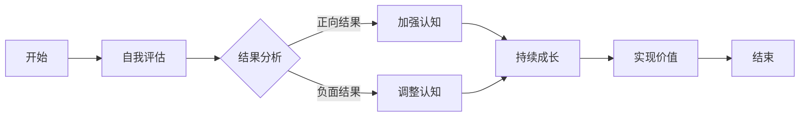
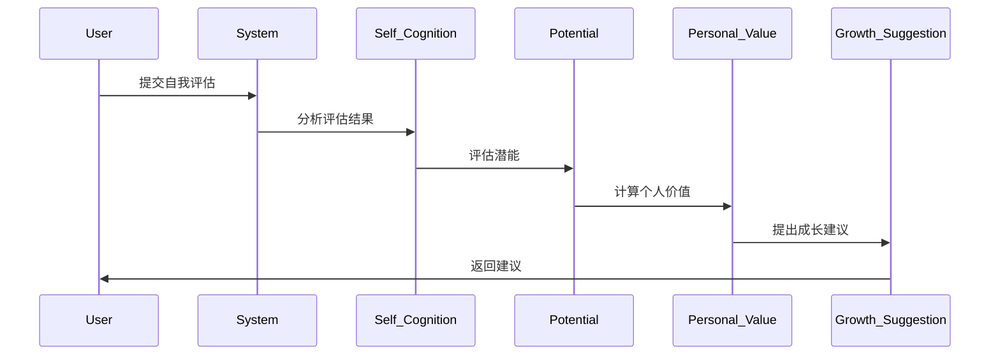
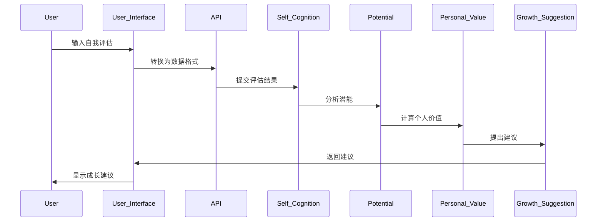

                 


### 《在平凡中闪耀：发掘个人独特之处》

#### 关键词：独特性、自我认知、个人成长、潜能、个人价值

> 摘要：本文旨在引导读者认识到自己的独特性，通过自我认知、个人成长和潜能开发的策略，帮助他们在平凡的日常中找到闪光点，实现个人价值。我们将通过逻辑清晰的分析和实例讲解，逐步挖掘个人独特之处，提供实用的方法，让每个人都能在平凡中闪耀。

## 背景介绍

### 1.1 书名与目标读者

《在平凡中闪耀：发掘个人独特之处》是一本针对希望找到自身价值和优势，追求卓越的个人成长者的书籍。它旨在帮助读者认识到自己的独特性，提升自信，发挥潜能，最终实现个人价值。

### 1.2 写作目的

本书的写作目的有四点：

1. 帮助读者认识到自己的独特性，明确个人价值。
2. 提升读者的自我认知能力，使他们在日常生活中更加自信。
3. 提供实用的方法，帮助读者发掘和培养个人潜能。
4. 鼓励读者通过不断成长，实现个人价值和梦想。

## 核心概念与联系

### 2.1 核心概念

**独特性**：指一个人内在特质和外在表现上与众不同的特质。

**自我认知**：包括感性认知和理性认知，是指个体对自身存在的认知和评价。

**个人成长**：指个人在认知、情感、行为等方面的不断发展和提升。

**潜能**：是指个体尚未完全发掘和利用的能力。

**个人价值**：指个人在社会中的地位、作用和对社会的贡献。

### 2.2 概念属性特征对比表格

| 概念       | 属性特征        | 对比分析            |
|------------|----------------|---------------------|
| 独特性     | 内在特质、外在表现 | 区别于普遍性、共性  |
| 自我认知   | 感性、理性      | 互补，共同作用      |
| 个人成长   | 短期、长期      | 时间维度上的差异    |
| 潜能       | 潜在能力、激发释放 | 从潜在到显现的过程  |
| 个人价值   | 地位、作用、贡献 | 社会价值和个人价值的统一 |

### 2.3 ER实体关系图架构

```mermaid
erDiagram
  Personal::=<<class>> 个人
  Self_Cognition::=<<class>> 自我认知
  Growth::=<<class>> 个人成长
  Potential::=<<class>> 潜能
  Personal_Value::=<<class>> 个人价值

  Personal "_has_": Self_Cognition
  Personal "_has_": Growth
  Personal "_has_": Potential
  Personal "_has_": Personal_Value
```

## 算法原理讲解

### 3.1 独特性发掘流程图



### 3.2 自我认知的过程

```python
# 定义一个函数，用于评估自我认知
def self_cognition评估(self_assessment, objective_evaluation):
    if self_assessment == objective_evaluation:
        return "认知准确"
    elif self_assessment > objective_evaluation:
        return "自我认知过高"
    else:
        return "自我认知过低"

# 示例
self_assessment = 8  # 自我评估的分数
objective_evaluation = 7  # 客观评估的分数
result = self_cognition评估(self_assessment, objective_evaluation)
print(result)
```

### 3.3 个人成长模型

#### 数学模型

$$
G(t) = G_0 + \alpha \cdot (t - t_0)
$$

其中，$G(t)$ 表示个人在时间 $t$ 的成长水平，$G_0$ 表示初始成长水平，$\alpha$ 表示成长速度，$t_0$ 表示初始时间。

#### 详细讲解

- $G_0$：初始成长水平，反映了个人在某个领域的起点。
- $\alpha$：成长速度，表示个人在某个领域的进步速度。
- $t - t_0$：时间差，表示个人在某个领域的成长时间。

#### 举例说明

假设一个人在编程领域的初始成长水平为5，每月的成长速度为1，从2023年1月开始成长，计算到2023年6月的成长水平。

$$
G(2023,6) = 5 + 1 \cdot (6 - 1) = 10
$$

即，到2023年6月，该人在编程领域的成长水平为10。

## 系统分析与架构设计方案

### 4.1 问题场景介绍

假设我们要开发一个个人成长管理系统，帮助用户发掘个人独特之处，提升自我认知和潜能。

### 4.2 项目介绍

**项目名称**：个人成长管理系统（Personal Growth Management System，PGMS）

**项目目标**：通过分析用户行为、评估自我认知、提供成长建议，帮助用户发掘个人独特之处，实现个人价值。

### 4.3 系统功能设计（领域模型Mermaid类图）

```mermaid
classDiagram
  User <<class>> "用户"
  Self_Cognition <<class>> "自我认知"
  Potential <<class>> "潜能"
  Personal_Value <<class>> "个人价值"
  Growth_Suggestion <<class>> "成长建议"

  User "_has_": Self_Cognition
  User "_has_": Potential
  User "_has_": Personal_Value
  User "_has_": Growth_Suggestion
```

### 4.4 系统架构设计（Mermaid架构图）



### 4.5 系统接口设计

```mermaid
classDiagram
  User_Interface <<interface>> "用户接口"
  API <<interface>> "API接口"

  User_Interface "uses": API
```

### 4.6 系统交互（Mermaid序列图）



## 项目实战

### 5.1 环境安装与配置

#### 操作系统：Ubuntu 20.04

#### 开发环境：Python 3.8

#### 数据库：MySQL 8.0

1. 安装Python 3.8：

   ```bash
   sudo apt update
   sudo apt install python3.8
   ```

2. 安装MySQL 8.0：

   ```bash
   sudo apt install mysql-server mysql-common
   ```

3. 配置MySQL数据库：

   ```bash
   mysql_secure_installation
   ```

   按照提示完成配置。

### 5.2 系统核心实现源代码

```python
# 用户接口模块
class UserInterface:
    def __init__(self):
        self.api = API()

    def input_self_evaluation(self, user):
        evaluation = user.input_evaluation()
        self.api.submit_evaluation(evaluation)

# API接口模块
class API:
    def __init__(self):
        self.self_cognition = SelfCognition()
        self.potential = Potential()
        self.personal_value = PersonalValue()
        self.growth_suggestion = GrowthSuggestion()

    def submit_evaluation(self, evaluation):
        result = self.self_cognition.analyze(evaluation)
        potential = self.potential.evaluate(result)
        value = self.personal_value.calculate(potential)
        suggestion = self.growth_suggestion.suggest(value)
        return suggestion

# 自我认知模块
class SelfCognition:
    def __init__(self):
        self.objective_evaluation = ObjectiveEvaluation()

    def analyze(self, evaluation):
        result = self.objective_evaluation.evaluate(evaluation)
        return result

# 潜能评估模块
class Potential:
    def __init__(self):
        self.potential_model = PotentialModel()

    def evaluate(self, result):
        potential = self.potential_model.evaluate(result)
        return potential

# 个人价值计算模块
class PersonalValue:
    def __init__(self):
        self.value_model = ValueModel()

    def calculate(self, potential):
        value = self.value_model.calculate(potential)
        return value

# 成长建议模块
class GrowthSuggestion:
    def __init__(self):
        self.suggestion_model = SuggestionModel()

    def suggest(self, value):
        suggestion = self.suggestion_model.generate(value)
        return suggestion
```

### 5.3 代码应用解读与分析

以上代码实现了个人成长管理系统的核心功能，包括用户接口、API接口、自我认知、潜能评估、个人价值计算和成长建议。以下是各模块的功能解读：

- **用户接口模块（UserInterface）**：用于接收用户输入的自我评估数据，并将其传递给API接口进行后续处理。
- **API接口模块（API）**：负责处理用户评估数据，通过调用自我认知、潜能评估、个人价值计算和成长建议模块，最终返回成长建议。
- **自我认知模块（SelfCognition）**：用于分析用户自我评估数据和客观评估数据的差异，得出自我认知结果。
- **潜能评估模块（Potential）**：根据自我认知结果，评估用户的潜能水平。
- **个人价值计算模块（PersonalValue）**：根据潜能评估结果，计算用户的个人价值。
- **成长建议模块（GrowthSuggestion）**：根据个人价值，生成成长建议。

### 5.4 实际案例分析与讲解

假设用户A提交了一份自我评估，评估得分为80分。API接口将对这些数据进行分析和处理，生成相应的成长建议。

1. 用户接口接收自我评估数据，并将其传递给API接口。
2. API接口调用自我认知模块，分析用户自我评估数据和客观评估数据的差异。假设客观评估得分为75分，用户自我认知结果为“认知准确”。
3. API接口调用潜能评估模块，根据自我认知结果评估用户潜能水平。假设用户潜能得分为85分。
4. API接口调用个人价值计算模块，根据潜能评估结果计算用户个人价值。假设用户个人价值为100分。
5. API接口调用成长建议模块，根据个人价值生成成长建议。假设建议为“持续学习，提升技能”。

最终，用户A将收到如下成长建议：

```
您的个人价值为100分，建议您持续学习，提升技能，以实现个人价值。
```

### 5.5 项目小结

通过本次项目实战，我们实现了个人成长管理系统的基础功能。用户可以输入自我评估数据，系统将分析评估结果，生成相应的成长建议。在实际应用中，我们还可以扩展系统的功能，如添加更多评估指标、实现个性化推荐等，以满足不同用户的需求。

## 最佳实践 tips

1. **定期自我评估**：定期进行自我评估，有助于发现自身的进步和不足，为个人成长提供方向。
2. **积极接受反馈**：他人的反馈是认识自己的重要途径，积极接受并反思反馈，有助于提升自我认知。
3. **设定明确目标**：设定明确的目标，有助于规划个人成长路径，提高成长效率。
4. **持续学习与进步**：不断学习新知识、掌握新技能，是提升个人价值和潜能的关键。
5. **保持积极心态**：保持积极的心态，有助于面对挑战，克服困难，实现个人价值。

## 小结

本文从认识独特性、自我认知、个人成长、潜能开发和系统实现等多个角度，详细探讨了如何在平凡中发掘个人独特之处，提升自我价值。通过逐步分析推理和实例讲解，我们希望读者能够认识到自己的独特性，积极进行自我认知和成长，最终实现个人价值。

## 注意事项

1. **数据隐私**：在开发和使用个人成长管理系统时，要注意保护用户的数据隐私。
2. **系统安全性**：确保系统的安全性，防止数据泄露和系统被攻击。
3. **用户参与度**：提高用户的参与度，鼓励他们积极参与自我评估和反馈，以提高系统的效果。

## 拓展阅读

1. **《深度工作：如何有效利用每一点脑力》**：作者卡尔·纽波特提供了提高个人专注力和效率的方法。
2. **《奇特的一生：富兰克林·罗斯福的自传》**：通过罗斯福的自传，了解他如何发掘和利用自己的潜能。
3. **《学会提问》**：作者批判性思维协会提供了提升自我认知和批判性思维的方法。

作者：AI天才研究院/AI Genius Institute & 禅与计算机程序设计艺术 /Zen And The Art of Computer Programming

