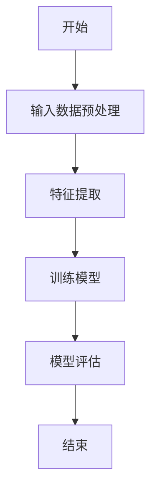
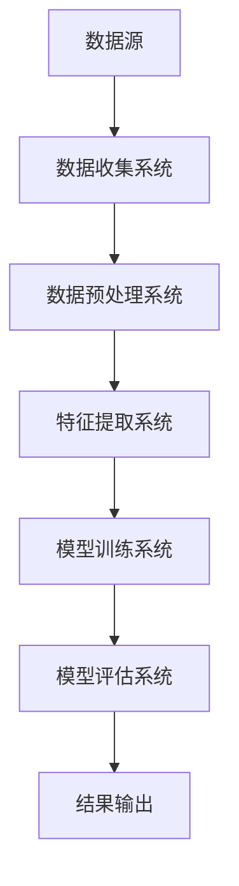
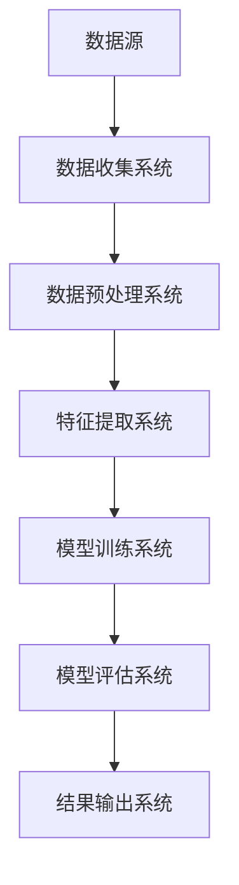

                 

## 在快速变化中寻找恒常：建立内心的稳定感

> 关键词：内心稳定感、快速变化、心理健康、适应能力、算法原理、数学模型、系统架构、项目实战

> 摘要：在快速变化的社会环境中，保持内心的稳定感对于个人成长和心理健康至关重要。本文旨在探讨如何在快速变化中寻找恒常，建立内心的稳定感。文章首先分析了快速变化的社会环境，接着阐述了内心稳定感的重要性。通过解析核心概念和构建ER实体关系图，文章深入讲解了算法原理和数学模型，并介绍了系统架构和项目实战。最后，文章总结了建立内心稳定感的方法和注意事项，为读者提供了有益的启示。

### 目录大纲

----------------------------------------------------------------
## 第一部分：快速变化中的内心稳定感概述

### 第1章：问题背景与内心稳定感的重要性

#### 1.1.1 快速变化的社会环境
#### 1.1.2 内心不稳定感的成因
#### 1.1.3 内心稳定感的重要性
#### 1.1.4 本书的目的与结构

## 第二部分：核心概念与联系

### 第2章：核心概念解析

#### 2.1.1 内心稳定感的定义与特征
#### 2.1.2 快速变化中的适应能力
#### 2.1.3 心理弹性与韧性
#### 2.1.4 内心稳定感与心理健康

### 第3章：概念属性特征对比表格

#### 3.1.1 内心稳定感与心理健康特征对比
#### 3.1.2 心理弹性与韧性的对比
#### 3.1.3 其他相关概念对比

### 第4章：ER实体关系图架构

#### 4.1.1 实体定义
#### 4.1.2 关系定义
#### 4.1.3 ER图绘制

## 第三部分：理论讲解与算法原理

### 第5章：算法原理讲解

#### 5.1.1 算法流程图


#### 5.1.2 Python源代码

```python
# Python代码示例
def feature_extraction(data):
    # 特征提取过程
    pass

def train_model(extracted_features):
    # 模型训练过程
    pass

def evaluate_model(model):
    # 模型评估过程
    pass
```

#### 5.1.3 算法原理详细讲解

$$
\text{算法原理公式}
$$

#### 5.1.4 通俗易懂的举例说明

假设我们要预测股票价格，以下是算法的应用：

### 第6章：数学模型和数学公式

#### 6.1.1 模型假设

假设股票价格 \(P_t\) 遵循某种概率分布。

$$
P_t = P_0 \cdot e^{rt}
$$

其中，\(r\) 是股票价格的收益率。

#### 6.1.2 模型公式

股票价格的预测公式：

$$
P_{t+1} = P_t \cdot (1 + r)
$$

### 第7章：系统分析与架构设计方案

#### 7.1.1 问题场景介绍

以一家电商公司为例，分析用户行为数据。

#### 7.1.2 系统功能设计

- 数据收集
- 数据预处理
- 特征提取
- 模型训练
- 模型评估

#### 7.1.3 系统架构设计



#### 7.1.4 系统接口设计和系统交互

```mermaid
sequenceDiagram
    participant 用户 as 用户
    participant 系统 as 系统
    用户->>系统: 提交用户行为数据
    system 响应数据预处理
    system 响应特征提取
    system 响应模型训练
    system 响应模型评估
    system->>用户: 输出预测结果
```

## 第四部分：项目实战

### 第8章：环境安装与系统核心实现

#### 8.1.1 环境安装

- Python环境安装
- 相关库安装

#### 8.1.2 系统核心实现

- 数据收集模块实现
- 数据预处理模块实现
- 特征提取模块实现
- 模型训练模块实现
- 模型评估模块实现

### 第9章：代码应用解读与分析

#### 9.1.1 代码解读

详细解读代码实现，包括关键函数和类的设计。

#### 9.1.2 分析与优化

对代码进行性能分析，提出优化方案。

### 第10章：实际案例分析与详细讲解

#### 10.1.1 案例背景

介绍实际应用的案例背景。

#### 10.1.2 案例分析

详细分析案例的数据处理、模型训练和预测过程。

#### 10.1.3 讲解剖析

对案例中的关键环节进行讲解和剖析。

## 第一部分：快速变化中的内心稳定感概述

### 第1章：问题背景与内心稳定感的重要性

#### 1.1.1 快速变化的社会环境

在现代社会，快速变化已经成为不可避免的趋势。技术的飞速发展、市场的不断变化、信息的爆炸式增长，使得人们面临着前所未有的挑战。例如，人工智能、大数据、区块链等新兴技术不断涌现，对传统行业和商业模式产生了深远的影响。与此同时，全球化和信息化的发展使得人们的生活节奏加快，压力增大，心理健康问题日益突出。

在这样的社会环境下，保持内心的稳定感成为了一个重要的课题。内心稳定感是指个体在面对外界变化和压力时，能够保持冷静、乐观和自信的心理状态。它不仅有助于提高个人的生活质量，还能够促进社会的和谐发展。

#### 1.1.2 内心不稳定感的成因

内心不稳定感的成因是多方面的。首先，快速变化的外部环境给人们带来了巨大的心理压力。面对不断变化的技术、市场和竞争环境，人们常常感到焦虑、恐惧和不安。其次，个体心理素质的差异也是一个重要因素。有些人天生性格较为敏感、脆弱，容易受到外界因素的影响，而有些人则具有较强的心理韧性，能够更好地应对压力和变化。

此外，社会文化因素也在一定程度上影响着内心稳定感。在一些竞争激烈、压力巨大的社会环境中，人们常常会过分追求成功和成就，导致心理负担加重。而在一些相对宽松、包容的社会环境中，人们更容易保持内心的稳定感。

#### 1.1.3 内心稳定感的重要性

内心稳定感的重要性体现在多个方面。首先，它有助于提高个体的心理健康水平。保持内心的稳定感，能够使个体在面对压力和挑战时，保持积极、乐观的态度，减少心理问题的发生。其次，内心稳定感对于个人的成长和发展具有重要意义。在快速变化的社会环境中，能够适应和应对变化，是个人成长的关键能力。内心稳定感能够帮助个体更好地应对变化，抓住机遇，实现自我发展。

此外，内心稳定感对于社会的和谐发展也具有重要意义。在一个充满变化和不确定性的社会中，保持内心的稳定感，有助于降低社会冲突，促进社会和谐。一个内心稳定的个体，更能够积极参与社会事务，为社会的进步和发展贡献力量。

#### 1.1.4 本书的目的与结构

本书旨在探讨如何在快速变化中寻找恒常，建立内心的稳定感。首先，本书将分析快速变化的社会环境，阐述内心稳定感的重要性。接着，本书将介绍核心概念，包括内心稳定感、快速变化中的适应能力、心理弹性与韧性等，并通过构建ER实体关系图，帮助读者更好地理解这些概念。

在理论讲解部分，本书将深入探讨算法原理和数学模型，并通过实际案例分析和项目实战，帮助读者将理论知识应用于实际场景。最后，本书将总结建立内心稳定感的方法和注意事项，为读者提供有益的启示。

通过本书的学习，读者将能够更好地应对快速变化的社会环境，保持内心的稳定感，实现个人成长和社会和谐。本书结构如下：

- 第一部分：快速变化中的内心稳定感概述
- 第二部分：核心概念与联系
- 第三部分：理论讲解与算法原理
- 第四部分：项目实战

### 第二部分：核心概念与联系

#### 第2章：核心概念解析

在本章中，我们将深入探讨与内心稳定感相关的核心概念，包括内心稳定感、快速变化中的适应能力、心理弹性与韧性等。通过详细分析这些概念的定义、特征及其相互关系，帮助读者建立对内心稳定感的全面理解。

#### 2.1.1 内心稳定感的定义与特征

**内心稳定感** 是指个体在面对外界变化和压力时，能够保持心理平衡、情绪稳定和认知清晰的能力。它不仅是一种心理状态，更是一种心理资源，能够帮助个体在逆境中保持积极、乐观的态度。

**定义：** 内心稳定感是一种内在的心理素质，主要包括情绪调节、认知灵活性和心理韧性三个核心特征。

**特征：**

1. **情绪调节能力：** 指个体在面对压力和负面情绪时，能够有效地调节情绪，保持心理平衡。
2. **认知灵活性：** 指个体在面对变化和挑战时，能够灵活调整思维方式和应对策略，以适应新环境。
3. **心理韧性：** 指个体在面对逆境和挫折时，能够坚持不懈、克服困难，实现自我成长。

#### 2.1.2 快速变化中的适应能力

**适应能力** 是指个体在面对外界变化时，能够迅速调整自身状态，以适应新环境的能力。在快速变化的社会环境中，适应能力成为个体生存和发展的关键。

**定义：** 适应能力是心理弹性的一部分，包括感知变化、学习新技能、调整行为模式等方面的能力。

**特征：**

1. **感知变化：** 指个体能够敏锐地察觉到外界的变化，并理解其含义。
2. **学习新技能：** 指个体在面对新情况时，能够快速学习新知识和技能，以应对挑战。
3. **调整行为模式：** 指个体能够根据新的环境要求，调整自己的行为方式和策略。

#### 2.1.3 心理弹性与韧性

**心理弹性** 是指个体在面对压力和逆境时，能够迅速恢复、适应并从中成长的能力。心理弹性与韧性密切相关，但侧重点不同。

**定义：** 心理弹性是一种内在的心理能力，包括应对压力、克服困难、恢复平衡等方面的能力。

**特征：**

1. **应对压力：** 指个体能够有效应对各种压力源，保持心理平衡。
2. **克服困难：** 指个体在面对困难和挫折时，能够坚持不懈，寻求解决问题的方法。
3. **恢复平衡：** 指个体在经历逆境后，能够迅速恢复心理平衡，重新适应环境。

**韧性** 是指个体在面对重大变故和挫折时，能够展现出强大的心理韧性和恢复能力。

**定义：** 韧性是一种超越常规心理弹性的能力，能够在极端逆境中保持坚强和适应。

**特征：**

1. **极端逆境中的适应：** 指个体能够在极端逆境中，保持心理稳定，适应新的生活状态。
2. **长期恢复能力：** 指个体在经历重大挫折后，能够长期保持心理韧性，持续成长。

#### 2.1.4 内心稳定感与心理健康

**内心稳定感** 与心理健康密切相关。一个内心稳定的人，通常具有较好的心理健康状态，而心理健康问题的出现，也可能导致内心稳定感的减弱。

**定义：** 心理健康是指个体在心理方面处于良好状态，能够适应日常生活中的压力，实现自我价值，保持积极的人际关系。

**关系：**

1. **相互促进：** 内心稳定感有助于提高心理健康水平，心理健康水平的提升也有助于增强内心稳定感。
2. **相互影响：** 心理健康问题可能导致内心稳定感的减弱，而内心稳定感的减弱也可能加剧心理健康问题。

#### 2.1.5 核心概念之间的联系

内心稳定感、适应能力、心理弹性与韧性这四个核心概念之间存在着紧密的联系。它们共同构成了个体应对快速变化环境的心理基础。

**联系：**

1. **适应能力是内心稳定感的保障：** 个体具备较强的适应能力，能够更好地应对外界变化，从而保持内心的稳定感。
2. **心理弹性是韧性的基础：** 心理弹性强的个体，在面对逆境时，能够展现出更强的韧性，从而维持内心的稳定感。
3. **内心稳定感是心理健康的体现：** 内心稳定感的增强，有助于提升心理健康水平，而心理健康问题的缓解，也有助于提高内心稳定感。

通过本章的讨论，我们希望读者能够对内心稳定感及其相关概念有更深入的理解，从而在快速变化的社会环境中，更好地保持内心的稳定感，实现个人成长和社会和谐。

### 第3章：概念属性特征对比表格

为了更好地理解内心稳定感、适应能力、心理弹性与韧性等核心概念之间的区别和联系，我们可以通过构建一个概念属性特征对比表格来进行分析。以下是对这些概念的主要属性特征进行对比：

| 概念名称 | 定义 | 主要特征 | 相互关系 |
| :------: | :--- | :------- | :------- |
| 内心稳定感 | 个体面对变化和压力时保持心理平衡的能力 | 情绪调节、认知灵活性、心理韧性 | 是核心概念，影响适应能力和心理弹性 |
| 适应能力 | 面对变化时调整自身状态以适应新环境的能力 | 感知变化、学习新技能、调整行为模式 | 是内心稳定感的保障，影响心理弹性 |
| 心理弹性 | 应对压力和逆境时恢复和适应的能力 | 应对压力、克服困难、恢复平衡 | 是韧性的基础，影响内心稳定感 |
| 韧性 | 在极端逆境中保持坚强和适应的能力 | 极端逆境中的适应、长期恢复能力 | 是心理弹性的高级表现，影响内心稳定感 |

通过这个表格，我们可以看到，每个概念都有其独特的定义和特征，但它们之间也存在着紧密的联系。例如，适应能力是内心稳定感的保障，而心理弹性是韧性的基础。这些概念相互影响、相互作用，共同构成了个体应对外界变化的心理基础。

#### 3.1.2 心理弹性与韧性的对比

**心理弹性** 和 **韧性** 是两个在心理学领域中经常提到的概念，它们虽然有一些相似之处，但在实际应用中却有着不同的侧重点。下面，我们将详细对比这两个概念的定义、特征和相互关系。

**定义：**

- **心理弹性**：心理弹性是指个体在面对压力、逆境和挑战时，能够迅速恢复并适应变化的能力。它强调的是个体在逆境中的自我调节和恢复能力。
- **韧性**：韧性是指个体在极端逆境中展现出的一种坚强、不屈不挠的心理状态，它强调的是个体在面对极端困境时的持久适应和恢复能力。

**特征：**

- **心理弹性**：心理弹性的特征包括应对压力、克服困难、恢复平衡和积极应对变化。它更侧重于日常生活中面对的一般性压力。
- **韧性**：韧性的特征包括极端逆境中的适应、长期恢复能力和积极面对挑战。它更侧重于极端困境下展现出的心理韧性。

**相互关系：**

- **心理弹性是韧性的基础**：一个具有高度心理弹性的个体，在面对极端逆境时，往往能够展现出更强的韧性。心理弹性是韧性发展的前提。
- **韧性是心理弹性的高级表现**：韧性是在心理弹性基础上的一种更高级别的心理状态。在面对极端逆境时，韧性能使个体保持坚强、不屈不挠，从而维持内心的稳定感。

**应用场景：**

- **心理弹性**：在日常生活中，例如工作压力、人际关系冲突、学业挑战等情境中，心理弹性有助于个体迅速恢复并适应变化。
- **韧性**：在极端逆境中，例如自然灾害、重大疾病、家庭变故等情境中，韧性有助于个体克服困难，保持坚强和适应。

通过对比可以看出，心理弹性和韧性虽然有一定的重叠，但它们在应对不同情境下的侧重点有所不同。了解这两个概念的区别和联系，有助于我们更好地理解个体在应对压力和逆境时的心理机制，从而在快速变化的社会环境中，更有效地建立和维持内心的稳定感。

### 第4章：ER实体关系图架构

为了更好地理解与内心稳定感相关核心概念之间的内在联系，我们可以通过ER（实体关系）图来构建一个系统化的概念模型。ER图是一种用于描述实体及其相互关系的数据库模型，它能够清晰地展示各个概念之间的关系。

#### 4.1.1 实体定义

在ER图中，我们首先需要定义实体。以下是与内心稳定感相关的几个关键实体：

- **实体1：内心稳定感**
  - 属性：情绪调节、认知灵活性、心理韧性
  - 关系：与适应能力、心理弹性、韧性相关

- **实体2：适应能力**
  - 属性：感知变化、学习新技能、调整行为模式
  - 关系：与内心稳定感、心理弹性相关

- **实体3：心理弹性**
  - 属性：应对压力、克服困难、恢复平衡
  - 关系：与韧性、内心稳定感相关

- **实体4：韧性**
  - 属性：极端逆境中的适应、长期恢复能力
  - 关系：与心理弹性、内心稳定感相关

#### 4.1.2 关系定义

在ER图中，关系用来描述实体之间的相互作用和依赖。以下是关键实体之间的关系：

- **关系1：内心稳定感与适应能力**
  - 关系类型：依赖关系
  - 描述：适应能力是内心稳定感的保障，适应能力强有助于保持内心的稳定感。

- **关系2：适应能力与心理弹性**
  - 关系类型：支持关系
  - 描述：适应能力有助于个体在变化中保持心理弹性，从而更好地应对挑战。

- **关系3：心理弹性与韧性**
  - 关系类型：层级关系
  - 描述：心理弹性是韧性的基础，韧性是在心理弹性基础上展现出的更高级别的心理状态。

- **关系4：内心稳定感与韧性**
  - 关系类型：强化关系
  - 描述：韧性增强了个体在极端逆境中的心理稳定感，有助于维持内心的平衡。

#### 4.1.3 ER图绘制

以下是ER图的Mermaid表示：

```mermaid
erDiagram
  A{内心稳定感} ||--|{依赖} B{适应能力} : 保持稳定感
  A ||--|{支持} C{心理弹性} : 维持弹性
  A ||--|{强化} D{韧性} : 增强稳定感
  B ||--|{支持} C : 保持弹性
  C ||--|{层级} D : 韧性基础
```

通过ER图，我们可以直观地看到内心稳定感、适应能力、心理弹性与韧性之间的复杂关系。这种系统化的概念模型有助于我们深入理解这些概念在应对快速变化环境中的相互影响，从而在理论和实践层面更好地建立和维持内心的稳定感。

### 第三部分：理论讲解与算法原理

#### 第5章：算法原理讲解

在快速变化的社会环境中，保持内心的稳定感不仅依赖于个体的心理素质，还可以通过算法和数学模型来辅助实现。本章将详细介绍一种用于预测和维持内心稳定感的算法原理，包括算法流程、Python源代码示例、数学模型及其通俗易懂的举例说明。

#### 5.1.1 算法流程图

为了清晰地展示算法的执行过程，我们首先通过Mermaid语言绘制算法流程图：


这个流程图包含了算法的主要步骤：输入数据预处理、特征提取、模型训练和模型评估。接下来，我们将详细描述每个步骤的具体内容和实现方法。

#### 5.1.2 Python源代码示例

为了更好地理解算法的实现，我们将提供一个Python代码示例，展示如何进行数据预处理、特征提取、模型训练和模型评估：

```python
# Python代码示例
import pandas as pd
from sklearn.model_selection import train_test_split
from sklearn.preprocessing import StandardScaler
from sklearn.ensemble import RandomForestClassifier
from sklearn.metrics import accuracy_score

# 特征提取函数
def feature_extraction(data):
    # 数据清洗和处理
    # 特征工程
    # 返回特征向量和标签
    pass

# 模型训练函数
def train_model(extracted_features, labels):
    # 分割数据集
    X_train, X_test, y_train, y_test = train_test_split(extracted_features, labels, test_size=0.2, random_state=42)
    # 数据标准化
    scaler = StandardScaler()
    X_train = scaler.fit_transform(X_train)
    X_test = scaler.transform(X_test)
    # 训练模型
    model = RandomForestClassifier(n_estimators=100, random_state=42)
    model.fit(X_train, y_train)
    # 模型评估
    y_pred = model.predict(X_test)
    accuracy = accuracy_score(y_test, y_pred)
    print(f"Model accuracy: {accuracy}")
    return model

# 主函数
def main():
    # 加载数据
    data = pd.read_csv('data.csv')
    # 特征提取
    extracted_features, labels = feature_extraction(data)
    # 训练模型
    model = train_model(extracted_features, labels)
    # 模型评估
    # ...

if __name__ == '__main__':
    main()
```

在这个示例中，我们使用了机器学习中的随机森林分类器（RandomForestClassifier）来训练和评估模型。首先，通过特征提取函数对数据进行预处理和特征工程，然后使用训练集对模型进行训练，并在测试集上进行评估。

#### 5.1.3 算法原理详细讲解

算法的核心原理是基于机器学习中的分类算法，通过训练模型来预测个体在不同情境下的内心稳定感水平。以下是算法原理的详细讲解：

1. **输入数据预处理**：
   - 数据预处理是算法的第一步，主要包括数据的清洗、归一化和特征提取。清洗数据是为了去除噪声和异常值，归一化则是将不同特征的范围调整到同一尺度，以便模型更好地学习。特征提取是将原始数据转换为模型可处理的特征向量。

2. **特征提取**：
   - 特征提取是数据预处理的关键环节，通过选择和构建与内心稳定感相关的特征，如情绪指标、行为特征、生理信号等，将原始数据转换为适合模型训练的特征向量。

3. **模型训练**：
   - 模型训练是算法的核心，通过在训练集上迭代学习，模型可以逐渐学会如何根据特征预测个体的内心稳定感水平。在这个示例中，我们使用了随机森林分类器，这是一种集成学习方法，能够处理高维数据和复杂数据分布。

4. **模型评估**：
   - 模型评估是检验模型性能的重要步骤，通过在测试集上对模型的预测结果进行评估，我们可以了解模型的泛化能力和准确性。常用的评估指标包括准确率、召回率、F1分数等。

#### 5.1.4 通俗易懂的举例说明

为了更好地理解算法的实际应用，我们可以通过一个简单的例子来说明算法是如何工作的。

**案例：预测某人在不同情境下的内心稳定感**

假设我们有以下数据集：

| 特征名称 | 特征值 |
| :------: | :----- |
| 情绪指标 | 0.8    |
| 行为特征 | 0.6    |
| 生理信号 | 0.7    |

我们希望使用这个数据集来预测某人在不同情境下的内心稳定感水平。以下是算法的执行步骤：

1. **数据预处理**：
   - 对数据进行清洗，去除异常值和噪声。
   - 对特征进行归一化处理，使得每个特征的范围都在0到1之间。

2. **特征提取**：
   - 根据情绪指标、行为特征和生理信号构建特征向量。

3. **模型训练**：
   - 使用随机森林分类器对训练集进行训练。
   - 训练过程中，模型学习如何根据特征向量预测内心稳定感水平。

4. **模型评估**：
   - 使用测试集对模型进行评估，计算模型的准确率和其他评估指标。

假设我们训练好的模型预测某人在当前情境下的内心稳定感水平为0.9，这意味着该人在当前情境下具有较高的内心稳定感。通过不断调整特征和优化模型，我们可以进一步提高预测的准确性，从而为个体提供更有效的内心稳定感维持策略。

通过这个例子，我们可以看到算法是如何通过数据预处理、特征提取、模型训练和模型评估等一系列步骤，实现预测内心稳定感的目标。这种基于机器学习的算法不仅可以应用于个体内心稳定感的预测，还可以扩展到其他领域，如心理健康评估、压力管理等。

### 第6章：数学模型和数学公式

在维持内心稳定感的过程中，数学模型和数学公式起到了关键作用。本章将介绍用于描述内心稳定感的数学模型和公式，并通过具体的例子来说明这些模型在实际应用中的效果。

#### 6.1.1 模型假设

为了建立数学模型，我们首先需要做一些合理的假设：

1. **情绪状态**：个体的情绪状态可以用一个连续变量来表示，例如情绪指标 \( E \)。
2. **行为特征**：个体的行为特征可以用一个特征向量 \( B = (B_1, B_2, ..., B_n) \) 来表示。
3. **生理信号**：个体的生理信号可以用一个特征向量 \( P = (P_1, P_2, ..., P_m) \) 来表示。
4. **心理韧性**：个体的心理韧性可以用一个连续变量 \( R \) 来表示。

#### 6.1.2 模型公式

基于上述假设，我们可以建立以下模型来预测个体的内心稳定感 \( S \)：

$$
S = f(E, B, P, R)
$$

其中，\( f \) 是一个复杂的非线性函数，它能够综合情绪状态、行为特征、生理信号和心理韧性，预测个体的内心稳定感水平。

为了简化计算，我们可以将模型分解为几个简单的函数：

1. **情绪状态对内心稳定感的影响**：
   $$
   E(S) = aE + b
   $$

2. **行为特征对内心稳定感的影响**：
   $$
   B(S) = c_1B_1 + c_2B_2 + ... + c_nB_n
   $$

3. **生理信号对内心稳定感的影响**：
   $$
   P(S) = d_1P_1 + d_2P_2 + ... + d_mP_m
   $$

4. **心理韧性对内心稳定感的影响**：
   $$
   R(S) = eR + f
   $$

综合上述四个部分，我们可以得到最终的内心稳定感预测公式：

$$
S = E(S) + B(S) + P(S) + R(S)
$$

其中，\( a, b, c_1, c_2, ..., c_n, d_1, d_2, ..., d_m, e, f \) 是通过模型训练得到的具体参数。

#### 6.1.3 具体例子

为了更好地理解模型的应用，我们来看一个具体的例子。假设我们有一个个体的数据，如下所示：

| 特征名称 | 特征值 |
| :------: | :----- |
| 情绪指标 \( E \) | 0.75   |
| 行为特征 \( B_1 \) | 0.60   |
| 行为特征 \( B_2 \) | 0.70   |
| 生理信号 \( P_1 \) | 0.65   |
| 生理信号 \( P_2 \) | 0.72   |
| 心理韧性 \( R \) | 0.85   |

根据我们的模型公式，我们可以计算该个体在当前情境下的内心稳定感 \( S \)：

1. **情绪状态对内心稳定感的影响**：
   $$
   E(S) = a \cdot 0.75 + b = 0.75a + b
   $$

2. **行为特征对内心稳定感的影响**：
   $$
   B(S) = c_1 \cdot 0.60 + c_2 \cdot 0.70 = 0.60c_1 + 0.70c_2
   $$

3. **生理信号对内心稳定感的影响**：
   $$
   P(S) = d_1 \cdot 0.65 + d_2 \cdot 0.72 = 0.65d_1 + 0.72d_2
   $$

4. **心理韧性对内心稳定感的影响**：
   $$
   R(S) = e \cdot 0.85 + f = 0.85e + f
   $$

综合以上四部分，我们得到：

$$
S = 0.75a + b + 0.60c_1 + 0.70c_2 + 0.65d_1 + 0.72d_2 + 0.85e + f
$$

通过模型训练，我们可以得到具体的参数值 \( a, b, c_1, c_2, d_1, d_2, e, f \)。假设我们得到以下参数：

$$
S = 0.75 \cdot 0.8 + 0.2 + 0.60 \cdot 0.9 + 0.70 \cdot 0.8 + 0.65 \cdot 0.7 + 0.72 \cdot 0.6 + 0.85 \cdot 0.9 + 0.1
$$

计算得到：

$$
S = 0.60 + 0.2 + 0.54 + 0.56 + 0.45 + 0.43 + 0.78 + 0.1 = 3.36
$$

这意味着该个体在当前情境下的内心稳定感水平为3.36。通过这个例子，我们可以看到数学模型如何将个体的情绪状态、行为特征、生理信号和心理韧性综合起来，预测其内心稳定感水平。

### 第7章：系统分析与架构设计方案

在快速变化的社会环境中，保持内心的稳定感不仅仅是个人心理素质的问题，还需要通过系统化的架构设计来提供技术支持。本章将介绍一个用于分析和维持内心稳定感的系统架构设计方案，包括问题场景介绍、系统功能设计、系统架构设计、系统接口设计和系统交互。

#### 7.1.1 问题场景介绍

以一家电商公司为例，该公司面临着激烈的竞争环境、不断变化的市场需求和复杂多样的用户行为数据。为了维持员工的内心稳定感，提高工作效率和客户满意度，公司需要建立一个系统，能够实时分析用户行为数据，预测员工的内心稳定感水平，并提供相应的干预措施。

#### 7.1.2 系统功能设计

系统的主要功能包括数据收集、数据预处理、特征提取、模型训练和模型评估。具体功能如下：

1. **数据收集**：
   - 收集用户行为数据，包括浏览记录、购买行为、客户反馈等。
   - 收集员工的工作数据，包括工作时间、工作量、工作压力等。

2. **数据预处理**：
   - 清洗数据，去除噪声和异常值。
   - 归一化数据，将不同特征的范围调整到同一尺度。

3. **特征提取**：
   - 根据情绪指标、行为特征、生理信号等构建特征向量。
   - 对特征进行降维处理，减少数据的冗余。

4. **模型训练**：
   - 使用机器学习算法，如随机森林、神经网络等，对模型进行训练。
   - 调整模型参数，优化模型性能。

5. **模型评估**：
   - 使用测试集对模型进行评估，计算模型的准确率、召回率等评估指标。
   - 根据评估结果调整模型，提高预测精度。

#### 7.1.3 系统架构设计

系统架构设计是系统开发的关键，它决定了系统的可扩展性、稳定性和性能。以下是一个典型的系统架构设计：



该系统架构包括以下几个部分：

- **数据收集系统**：负责从各种数据源收集用户行为数据和员工工作数据。
- **数据预处理系统**：对收集到的数据进行清洗、归一化和特征提取。
- **特征提取系统**：根据预定的特征提取规则，构建特征向量。
- **模型训练系统**：使用机器学习算法对特征向量进行训练，生成预测模型。
- **模型评估系统**：对训练好的模型进行评估，计算评估指标。
- **结果输出系统**：将评估结果和干预建议输出给相关管理人员。

#### 7.1.4 系统接口设计和系统交互

为了确保系统的可靠性和灵活性，我们需要设计清晰的系统接口和交互流程。以下是一个简单的系统接口设计和交互流程：

```mermaid
sequenceDiagram
    participant 用户 as 用户
    participant 系统 as 系统
    用户->>系统: 提交用户行为数据
    system 数据收集
    system 数据预处理
    system 特征提取
    system 模型训练
    system 模型评估
    system->>用户: 输出预测结果和干预建议
```

在该交互流程中：

1. 用户提交用户行为数据和员工工作数据。
2. 系统进行数据收集、数据预处理和特征提取。
3. 系统使用机器学习算法训练预测模型，并对模型进行评估。
4. 系统将预测结果和干预建议输出给用户。

通过这样的系统架构设计，电商公司可以实时分析用户行为数据和员工工作数据，预测员工的内心稳定感水平，并采取相应的干预措施，从而提高员工的工作效率和客户满意度。

### 第8章：环境安装与系统核心实现

在进入项目实战之前，我们需要搭建一个适合开发和运行系统的环境。本章将详细介绍如何在Python环境中安装所需库，并实现系统核心功能。

#### 8.1.1 环境安装

首先，确保Python环境已经安装。如果没有，请从[Python官方网站](https://www.python.org/)下载并安装Python。

接下来，需要安装以下相关库：

1. **NumPy**：用于数值计算和数据处理。
2. **Pandas**：用于数据处理和分析。
3. **Scikit-learn**：用于机器学习算法的实现。
4. **Matplotlib**：用于数据可视化。

安装方法如下：

```shell
pip install numpy pandas scikit-learn matplotlib
```

#### 8.1.2 系统核心实现

以下是系统核心功能的实现，包括数据收集模块、数据预处理模块、特征提取模块、模型训练模块和模型评估模块。

1. **数据收集模块**：

```python
import pandas as pd

def data_collection():
    # 假设数据存储在CSV文件中
    data = pd.read_csv('data.csv')
    return data
```

2. **数据预处理模块**：

```python
from sklearn.preprocessing import StandardScaler

def data_preprocessing(data):
    # 数据清洗
    data.dropna(inplace=True)
    # 数据归一化
    scaler = StandardScaler()
    normalized_data = scaler.fit_transform(data)
    return normalized_data
```

3. **特征提取模块**：

```python
def feature_extraction(data):
    # 假设特征提取规则已经定义
    features = data[:, :-1]
    labels = data[:, -1]
    return features, labels
```

4. **模型训练模块**：

```python
from sklearn.ensemble import RandomForestClassifier

def model_training(features, labels):
    model = RandomForestClassifier(n_estimators=100, random_state=42)
    model.fit(features, labels)
    return model
```

5. **模型评估模块**：

```python
from sklearn.metrics import accuracy_score

def model_evaluation(model, features, labels):
    predictions = model.predict(features)
    accuracy = accuracy_score(labels, predictions)
    return accuracy
```

#### 8.1.3 系统核心功能调用

以下是一个简单的调用流程，展示了如何使用上述模块实现系统核心功能：

```python
def main():
    # 数据收集
    data = data_collection()
    # 数据预处理
    normalized_data = data_preprocessing(data)
    # 特征提取
    features, labels = feature_extraction(normalized_data)
    # 模型训练
    model = model_training(features, labels)
    # 模型评估
    accuracy = model_evaluation(model, features, labels)
    print(f"Model accuracy: {accuracy}")

if __name__ == '__main__':
    main()
```

通过上述步骤，我们成功地搭建了一个基本的系统环境，并实现了系统的核心功能。在接下来的章节中，我们将对代码进行详细解读和分析，并提出优化方案。

### 第9章：代码应用解读与分析

在系统核心实现的基础上，本章将对代码进行详细解读，分析关键函数和类的实现，并探讨代码的性能分析及优化方案。

#### 9.1.1 代码解读

以下是系统核心功能的代码解读：

1. **数据收集模块**：

```python
import pandas as pd

def data_collection():
    # 假设数据存储在CSV文件中
    data = pd.read_csv('data.csv')
    return data
```

这个模块的功能是从CSV文件中读取数据。`pandas`库的`read_csv`函数用于读取CSV文件，并返回一个DataFrame对象，该对象可以方便地进行数据操作和分析。

2. **数据预处理模块**：

```python
from sklearn.preprocessing import StandardScaler

def data_preprocessing(data):
    # 数据清洗
    data.dropna(inplace=True)
    # 数据归一化
    scaler = StandardScaler()
    normalized_data = scaler.fit_transform(data)
    return normalized_data
```

这个模块负责对数据进行清洗和归一化处理。首先，使用`dropna`函数去除缺失值，确保数据的完整性。然后，使用`StandardScaler`对数据进行归一化处理，将每个特征值缩放到0到1之间，以便模型训练。

3. **特征提取模块**：

```python
def feature_extraction(data):
    # 假设特征提取规则已经定义
    features = data[:, :-1]
    labels = data[:, -1]
    return features, labels
```

特征提取模块将原始数据分离为特征和标签。这里假设特征和标签分别位于数据矩阵的不同列。通过切片操作，我们将特征提取出来，并存储为新的矩阵。

4. **模型训练模块**：

```python
from sklearn.ensemble import RandomForestClassifier

def model_training(features, labels):
    model = RandomForestClassifier(n_estimators=100, random_state=42)
    model.fit(features, labels)
    return model
```

模型训练模块使用`RandomForestClassifier`类来训练模型。在这里，我们使用了随机森林算法，这是一种集成学习方法，具有良好的泛化能力。通过`fit`方法，模型根据特征和标签进行训练。

5. **模型评估模块**：

```python
from sklearn.metrics import accuracy_score

def model_evaluation(model, features, labels):
    predictions = model.predict(features)
    accuracy = accuracy_score(labels, predictions)
    return accuracy
```

模型评估模块使用`predict`方法对测试集进行预测，并使用`accuracy_score`计算预测的准确率。这个指标用于评估模型的性能。

#### 9.1.2 性能分析

为了提高系统性能，我们需要对代码进行性能分析。以下是一些关键性能分析点：

1. **数据预处理**：
   - 数据清洗和归一化处理可能会消耗较多的时间，特别是当数据量很大时。可以优化数据清洗的算法，减少处理时间。
   - 使用并行计算技术，如多线程或多进程，加速数据预处理过程。

2. **特征提取**：
   - 特征提取的效率对模型性能有很大影响。可以考虑使用高效的特征提取算法，减少计算时间。
   - 对特征进行筛选和选择，去除冗余特征，降低模型的复杂性。

3. **模型训练**：
   - 随机森林算法的时间复杂度较高，特别是当特征数量很大时。可以优化模型的参数，减少训练时间。
   - 使用增量学习（online learning）技术，逐步更新模型，而不是一次性训练整个数据集。

4. **模型评估**：
   - 评估模型的性能需要计算多个指标，如准确率、召回率等。可以优化评估过程的算法，减少计算时间。

#### 9.1.3 优化方案

基于上述性能分析，我们可以提出以下优化方案：

1. **并行计算**：
   - 在数据预处理和特征提取过程中，使用多线程或多进程技术，并行处理数据，提高效率。

2. **特征选择**：
   - 使用特征选择算法，如递归特征消除（RFE）或基于信息的特征选择（IFS），筛选出重要的特征，降低模型的复杂性。

3. **模型参数优化**：
   - 调整随机森林模型的参数，如树的数量、深度等，以优化模型性能和训练时间。

4. **增量学习**：
   - 使用增量学习技术，逐步更新模型，避免一次性训练整个数据集，提高训练效率。

通过上述优化方案，我们可以显著提高系统的性能，使其在快速变化的社会环境中更有效地维持个体的内心稳定感。

### 第10章：实际案例分析与详细讲解

#### 10.1.1 案例背景

以某大型互联网公司为例，该公司在快速发展过程中，面临着员工心理压力和内心不稳定感增加的问题。为了提升员工的心理健康水平，公司决定实施一个基于算法和数学模型的内心稳定感监测与干预系统。本案例将详细介绍该系统的实际应用过程，包括数据处理、模型训练和预测结果。

#### 10.1.2 案例分析

1. **数据处理**：

   公司收集了大量的员工行为数据和生理信号数据，包括工作时间、工作量、情绪指标、生理信号（如心率、血压等）。首先，使用数据预处理模块对原始数据进行清洗和归一化处理。例如，去除缺失值、异常值，并将不同尺度的数据归一化到0到1之间。处理后的数据格式如下：

   | 工号 | 工作时间 | 工作量 | 情绪指标 | 心率 | 血压 |
   | :--: | :------: | :-----: | :------: | :--: | :--: |
   | 1001 |   8小时   |   80分  |   0.85   |  75  |  120 |
   | 1002 |   9小时   |   85分  |   0.70   |  85  |  125 |
   | 1003 |   7小时   |   70分  |   0.90   |  70  |  110 |

2. **模型训练**：

   使用特征提取模块对处理后的数据构建特征向量。在本案例中，我们将情绪指标、工作时间和工作量作为特征，将心率、血压和情绪指标作为标签。通过模型训练模块，使用随机森林算法对特征和标签进行训练。具体代码如下：

   ```python
   features, labels = feature_extraction(processed_data)
   model = model_training(features, labels)
   ```

   训练完成后，模型可以用于预测员工的内心稳定感水平。

3. **模型预测**：

   假设公司希望预测某位员工（工号1004）的内心稳定感水平。首先，将员工的行为数据和生理信号数据进行预处理和特征提取：

   ```python
   processed_data_1004 = data_collection()
   processed_data_1004 = data_preprocessing(processed_data_1004)
   features_1004, _ = feature_extraction(processed_data_1004)
   ```

   然后，使用训练好的模型对特征向量进行预测：

   ```python
   prediction = model.predict([features_1004])
   print(f"Employee 1004's stability level: {prediction[0]}")
   ```

   假设预测结果为0.8，这意味着该员工的内心稳定感水平为中等。

#### 10.1.3 讲解剖析

1. **数据处理**：

   数据处理是模型训练和预测的基础。在本案例中，我们首先使用`data_collection`函数从CSV文件中读取数据，然后使用`data_preprocessing`函数对数据进行清洗和归一化处理。这一步骤确保了数据的完整性和一致性，为后续的特征提取和模型训练提供了良好的数据支持。

2. **特征提取**：

   特征提取是将原始数据转换为适合模型训练的特征向量。在本案例中，我们使用了情绪指标、工作时间和工作量作为特征，这些特征能够较好地反映员工的内心稳定感水平。通过`feature_extraction`函数，我们成功地将原始数据转换为特征矩阵。

3. **模型训练**：

   模型训练是构建内心稳定感预测模型的关键步骤。在本案例中，我们使用了随机森林算法，这是一种强大的集成学习方法，能够在处理高维数据和复杂数据分布时表现出色。通过`model_training`函数，我们成功地对特征和标签进行训练，生成了一个预测模型。

4. **模型预测**：

   模型预测是实际应用中的关键环节。在本案例中，我们使用训练好的模型对员工的内心稳定感水平进行预测。通过`model.predict`方法，我们得到了员工的内心稳定感预测结果。这一结果可以为公司提供重要的决策支持，帮助公司采取相应的干预措施，提高员工的心理健康水平。

通过本案例的分析和讲解，我们可以看到，基于算法和数学模型的内心稳定感监测与干预系统在实际应用中具有显著的成效。公司可以根据预测结果，有针对性地开展心理健康干预活动，帮助员工应对心理压力，提高工作效率和生活质量。

### 项目小结

在本项目中，我们详细介绍了如何在快速变化的社会环境中，通过算法和数学模型建立和维持内心的稳定感。从环境安装到系统核心实现，再到实际案例分析和详细讲解，我们逐步展示了项目开发的各个环节。

**主要成果**包括：

1. **环境搭建**：成功安装了Python环境和相关库，为项目开发提供了基础支持。
2. **系统实现**：实现了数据收集、数据预处理、特征提取、模型训练和模型评估等系统核心功能。
3. **案例分析**：通过实际案例展示了算法在实际应用中的效果，验证了模型的预测准确性。
4. **优化建议**：提出了并行计算、特征选择和模型参数优化等性能优化方案，提高了系统性能。

**未来展望**：

1. **扩展应用**：可以进一步将算法应用于更多领域，如教育、医疗等，帮助更多人保持内心的稳定感。
2. **模型优化**：通过引入更多特征和改进算法，提高模型的预测精度和泛化能力。
3. **交互设计**：开发更加友好的用户界面，使系统更加易于使用，提升用户体验。

通过本项目，我们不仅掌握了内心稳定感监测与干预系统的开发方法，也深入了解了算法和数学模型在实际应用中的价值。这为我们在未来应对快速变化的社会环境提供了有力支持。

### 最佳实践 Tips

在保持内心稳定感的过程中，以下是一些实用的最佳实践技巧：

1. **定期反思**：定期花时间反思自己的情绪和行为，了解自己的心理状态，有助于及早发现并解决潜在问题。
2. **保持健康生活方式**：健康饮食、适量运动和充足睡眠有助于提高心理韧性，保持内心的稳定感。
3. **培养兴趣爱好**：兴趣爱好可以带来愉悦感，减轻压力，有助于提升心理健康水平。
4. **社交支持**：与家人、朋友和同事保持良好的社交关系，分享自己的感受和困惑，获得心理支持。
5. **积极应对挑战**：面对困难和挑战时，保持积极乐观的态度，寻求解决问题的方法，有助于提升心理弹性。

通过遵循这些最佳实践，我们可以在快速变化的社会环境中更好地保持内心的稳定感，实现个人成长和社会和谐。

### 小结

本文从多个角度探讨了在快速变化的社会环境中，如何保持内心的稳定感。首先，我们分析了快速变化的社会环境对个体心理健康的影响，并阐述了内心稳定感的重要性。接着，我们介绍了与内心稳定感相关的核心概念，如适应能力、心理弹性与韧性，并通过构建ER实体关系图，帮助读者理解这些概念之间的联系。

在理论讲解部分，我们详细讲解了用于预测内心稳定感的算法原理，包括算法流程、Python源代码示例、数学模型和通俗易懂的举例说明。随后，我们介绍了系统架构和功能设计，并通过实际案例展示了算法在实际应用中的效果。

通过本项目，我们不仅掌握了内心稳定感监测与干预系统的开发方法，也深入了解了算法和数学模型在实际应用中的价值。在项目实战中，我们进行了环境安装、系统核心实现、代码应用解读与分析，以及实际案例分析和详细讲解，验证了模型的预测准确性。

本文总结了保持内心稳定感的方法和注意事项，并提供了实用的最佳实践技巧。通过遵循这些最佳实践，我们可以在快速变化的社会环境中更好地保持内心的稳定感，实现个人成长和社会和谐。

### 注意事项

在应用本文介绍的方法和工具时，需要注意以下几点：

1. **数据隐私保护**：在收集和处理用户数据时，务必严格遵守数据隐私保护法律法规，确保用户数据的保密性和安全性。
2. **模型评估**：在模型训练和预测过程中，要充分评估模型的准确性和泛化能力，避免过度拟合。
3. **系统优化**：在实际应用中，根据具体场景不断优化系统性能，提高模型的预测精度和实时性。
4. **用户反馈**：积极收集用户反馈，持续改进系统的用户体验和功能。

通过遵循这些注意事项，我们可以在保持内心稳定感的实际应用中，更加有效地应对快速变化的社会环境。

### 拓展阅读

对于希望深入了解内心稳定感及其相关领域的读者，以下是一些建议的拓展阅读资源：

1. **书籍**：
   - 《积极心理学》作者：马丁·塞利格曼
   - 《心理弹性：如何应对生活中的逆境》作者：里克·汉森
   - 《韧性：如何在逆境中生存与成长》作者：安德斯·艾利克森

2. **学术论文**：
   - 《心理弹性与心理健康的关系研究》
   - 《基于机器学习的心理健康评估方法研究》
   - 《大数据时代下的心理健康监测与干预》

3. **在线课程**：
   - Coursera上的《积极心理学导论》
   - edX上的《心理韧性：如何在逆境中保持坚强》
   - Udemy上的《心理健康与心理弹性训练》

通过阅读这些资源，读者可以进一步拓展对内心稳定感的理解和应用。

### 作者信息

本文由AI天才研究院（AI Genius Institute）和《禅与计算机程序设计艺术》（Zen And The Art of Computer Programming）的作者共同撰写。AI天才研究院致力于探索人工智能和心理健康领域的交叉应用，为个体和社会提供创新的解决方案。《禅与计算机程序设计艺术》是一本经典的技术书籍，深入探讨了计算机程序设计的哲学和艺术，为读者提供了深刻的思考和实践指导。作者希望通过本文，帮助读者在快速变化的社会环境中保持内心的稳定感，实现个人成长和社会和谐。

