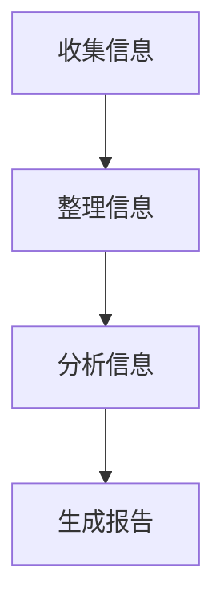
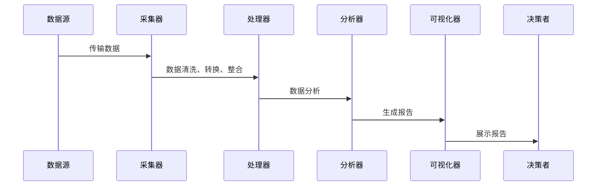

                 

# 在快餐文化中寻找深度：重建思考和反省的能力

## 关键词

快餐文化，深度思考，批判性思维，反思能力，社会影响

## 摘要

在当前的信息化社会中，快餐文化盛行，人们对于信息的获取和处理更加依赖于快速的、表面的信息获取方式。这种文化环境对个人的思维模式、反思能力产生了深远的影响，导致社会整体缺乏深度思考和系统性思考。本文将从快餐文化的背景与影响、重建思考与反省的能力、技术进步与深度思考等角度，探讨如何在快餐文化中重建深度思考与反省的能力，以及这种能力对于个人、社会和技术发展的意义。

## 第一部分：快餐文化的挑战

### 第1章：快餐文化的背景与影响

#### 1.1 快餐文化的起源与发展

**1.1.1 快餐文化的定义**

快餐文化，顾名思义，是指人们以高效、快速的方式获取和处理信息的一种文化现象。它起源于20世纪初的美国，随着工业化、城市化进程的加速，人们的生活方式发生了巨大的变化。在这种背景下，快餐文化迅速发展，并逐渐渗透到全球各地。

**1.1.2 快餐文化的兴起背景**

快餐文化的兴起，一方面是由于现代生活节奏的加快，人们对于时间效率的重视；另一方面，则是由于信息技术的发展，使得信息的获取、传播和分享变得更加便捷。这种背景下，快餐文化成为了一种适应现代生活需求的文化形式。

**1.1.3 快餐文化的影响范围**

快餐文化不仅影响到了个人，还对整个社会产生了深远的影响。在个人层面，快餐文化导致了人们对于深度思考的忽视，思维模式变得浅显，缺乏系统性。在社会层面，快餐文化导致了信息的泛滥和注意力的分散，文化多样性的减少，社会信任感的下降。

#### 1.2 快餐文化对个人思维的影响

**1.2.1 思维模式的变化**

快餐文化的盛行，使得人们的思维模式发生了变化。从深度思考转向了快速思考，从系统性思考转向了碎片化思考。这种变化，虽然在一定程度上提高了信息处理的效率，但也在一定程度上削弱了人们的思考能力和创造力。

**1.2.2 缺乏深度思考的问题**

缺乏深度思考，导致了人们对问题的理解不够深入，对问题的解决缺乏系统性。这种情况下，人们往往只能看到问题的表面，而无法触及问题的本质。长期下去，将削弱人们的问题解决能力和创新思维。

**1.2.3 反思能力的缺失**

快餐文化还导致了反思能力的缺失。反思是深度思考的重要环节，它可以帮助人们发现问题、分析问题，并提出解决方案。然而，在快餐文化的环境下，人们往往没有时间去反思，甚至没有反思的能力。

#### 1.3 快餐文化对社会的影响

**1.3.1 信息泛滥与注意力分散**

快餐文化导致了信息的泛滥，人们在面对海量信息时，往往感到无所适从，注意力难以集中。这种情况下，人们无法深入理解信息，也无法有效地处理信息，导致信息过载。

**1.3.2 文化多样性的减少**

快餐文化强调的是一种统一、标准化的信息获取和处理方式，这导致了文化多样性的减少。在快餐文化的环境下，人们往往只接受一种声音，忽略了其他的声音和观点，这不利于社会的多样性和包容性。

**1.3.3 社会信任感的下降**

快餐文化还导致了社会信任感的下降。在信息泛滥和注意力分散的情况下，人们对于信息的真实性、可靠性产生了质疑。长期下去，将削弱社会信任，影响社会的和谐稳定。

## 第二部分：重建思考与反省的能力

### 第2章：批判性思维的培养

#### 2.1 批判性思维的定义与重要性

**2.1.1 批判性思维的基本概念**

批判性思维是指对信息、观点和现象进行深入分析、评价和反思的能力。它不仅包括对信息的筛选、分析和判断，还包括对观点的论证、反驳和自我反思。

**2.1.2 批判性思维的重要性**

批判性思维是深度思考的核心，它可以帮助人们更好地理解世界，发现问题，解决问题。在快餐文化的背景下，培养批判性思维，对于重建深度思考与反省能力具有重要意义。

#### 2.2 批判性思维的工具与方法

**2.2.1 事实与观点的区分**

批判性思维的第一步是区分事实与观点。事实是客观存在的，可以通过观察和实验来验证；观点则是基于个人经验和主观判断的，它需要通过论证来支持。

**2.2.2 逻辑推理与论证**

逻辑推理与论证是批判性思维的核心。通过逻辑推理，可以揭示观点之间的联系，分析观点的合理性；通过论证，可以反驳错误的观点，支持正确的观点。

**2.2.3 预设偏见与自我反思**

预设偏见是批判性思维的重要障碍，它会影响人们对信息的理解和评价。自我反思可以帮助人们识别和克服预设偏见，提高思维的客观性和公正性。

#### 2.3 培养批判性思维的实践

**2.3.1 阅读与讨论**

阅读是培养批判性思维的重要途径。通过阅读，可以接触到各种观点和信息，提高对信息的筛选和分析能力。讨论则是验证和深化思考的重要方式，它可以帮助人们从不同的角度看待问题，发现问题的本质。

**2.3.2 问题提出与解决**

问题提出与解决是批判性思维的应用。通过提出问题，可以激发思考，发现问题；通过解决问题，可以提高思维的深度和广度。

**2.3.3 案例分析与实践应用**

案例分析与实践应用是培养批判性思维的重要方法。通过分析真实案例，可以了解问题的复杂性和多样性；通过实践应用，可以将批判性思维应用于实际问题，提高解决问题的能力。

### 第3章：深度阅读与学习

#### 3.1 深度阅读的概念与价值

**3.1.1 深度阅读的定义**

深度阅读是一种深入理解文本、挖掘作者意图、把握文章核心思想的阅读方式。它强调的是对文本的深度理解和思考，而不是简单的信息获取。

**3.1.2 深度阅读的价值**

深度阅读可以提高对信息的理解和应用能力，培养批判性思维和创造力。在快餐文化的背景下，深度阅读对于重建深度思考与反省能力具有重要意义。

#### 3.2 如何进行深度阅读

**3.2.1 选择合适的阅读材料**

选择合适的阅读材料是深度阅读的第一步。应该选择与自己专业和兴趣相关的书籍、文章，以及具有深度和广度的材料。

**3.2.2 阅读前的准备工作**

阅读前的准备工作包括了解作者的背景、阅读目的，以及梳理文章的结构和内容。这些准备工作可以帮助读者更好地理解文本，提高阅读效率。

**3.2.3 阅读过程中的技巧**

阅读过程中的技巧包括快速浏览、细读、笔记、思考和总结。这些技巧可以帮助读者更好地把握文章的核心思想，提高阅读效果。

**3.2.4 阅读后的思考与总结**

阅读后的思考与总结是深度阅读的重要组成部分。通过思考，可以加深对文章的理解，发现文章的优点和不足；通过总结，可以梳理文章的主要观点，形成自己的见解。

#### 3.3 学习策略的调整

**3.3.1 终身学习的态度**

终身学习是一种积极的学习态度，它要求人们不断学习、不断进步。在快餐文化的背景下，终身学习可以帮助人们适应快速变化的社会，提高个人的竞争力。

**3.3.2 学习方法的选择**

学习方法的选择是提高学习效果的关键。应该根据自己的学习风格和需求，选择合适的学习方法。例如，阅读、讨论、实践、研究等。

**3.3.3 学习成果的评估**

学习成果的评估是检验学习效果的重要手段。应该定期对自己的学习成果进行评估，总结经验教训，不断调整学习方法。

### 第4章：反思与实践

#### 4.1 反思的意义与目的

**4.1.1 反思的定义**

反思是一种深入思考自己的行为、思想、经验的过程。它要求人们从多个角度审视自己，发现自己的优点和不足，并作出相应的调整。

**4.1.2 反思的目的**

反思的目的是提高自我认识，发现和解决问题，促进个人成长。在快餐文化的背景下，反思可以帮助人们重建深度思考与反省的能力。

#### 4.2 反思的过程与方法

**4.2.1 反思的过程步骤**

反思的过程包括以下几个步骤：

1. 回顾自己的行为和思想，找出需要反思的问题。
2. 分析问题的原因，找出问题的本质。
3. 制定解决方案，并实施。
4. 总结反思的效果，并作出相应的调整。

**4.2.2 反思的方法技巧**

反思的方法技巧包括：

1. 写反思日记，记录自己的行为和思考。
2. 与他人讨论，听取不同的意见和建议。
3. 分析数据和事实，客观评估自己的行为和思考。
4. 利用工具和资源，如书籍、文章、讲座等，提高反思的效果。

**4.2.3 反思的工具与资源**

反思的工具和资源包括：

1. 反思日记，记录自己的行为和思考。
2. 书籍和文章，提供反思的理论和实践指导。
3. 讨论和交流，与他人分享反思的经验和见解。
4. 工具和软件，如思维导图、时间管理软件等，提高反思的效率和效果。

#### 4.3 实践与反思的循环

**4.3.1 实践的意义与作用**

实践是反思的基础，它要求人们将反思的理论付诸实践，通过实践来验证反思的正确性。实践的意义在于：

1. 提高个人能力和素质。
2. 发现和解决问题。
3. 促进个人成长和进步。

**4.3.2 实践与反思的结合**

实践与反思的结合，是提高个人能力和素质的关键。通过反思，可以总结实践经验，发现问题和不足，并作出相应的调整。通过实践，可以将反思的理论付诸行动，提高实践的效果。

**4.3.3 实践反思的持续改进**

实践反思的持续改进，是个人成长和进步的重要途径。通过持续实践和反思，可以不断提高自己的能力和素质，实现个人价值。

### 第5章：构建深度思考的日常习惯

#### 5.1 日常生活中的深度思考

**5.1.1 日常生活中的思考机会**

日常生活中充满了各种思考的机会，如：

1. 遇到问题时，思考如何解决问题。
2. 观察周围的事物，思考其背后的原理和规律。
3. 阅读书籍和文章，思考其观点和论据。
4. 与他人交流，思考对方的观点和见解。

**5.1.2 培养深度思考的习惯**

培养深度思考的习惯，可以从以下几个方面入手：

1. 定期阅读，提高阅读的质量和深度。
2. 勤于思考，遇事多问几个为什么。
3. 学会总结，从经验中汲取教训。
4. 多交流，听取不同的意见和建议。

#### 5.2 工作中的深度思考

**5.2.1 工作中的思考挑战**

工作中，深度思考面临着各种挑战，如：

1. 繁忙的工作节奏，容易忽视深度思考。
2. 信息量大，难以深入理解。
3. 时间压力，难以长时间思考。
4. 团队协作，需要平衡个人和团队的思考。

**5.2.2 深度思考在工作中的应用**

深度思考在工作中的应用，可以提高工作效率，提升工作质量。例如：

1. 在解决问题时，深入分析问题的本质，找到根本原因。
2. 在项目规划时，充分考虑各种因素，制定详细的计划。
3. 在团队协作中，积极思考，提出建设性意见和建议。
4. 在自我评估时，客观分析自己的工作，总结经验和教训。

**5.2.3 深度思考的工作方法**

深度思考的工作方法包括：

1. 制定工作计划，合理安排时间。
2. 深入研究，提高专业知识和技能。
3. 积极交流，听取不同的意见和建议。
4. 反思总结，不断提高自己的工作能力。

#### 5.3 教育中的深度思考

**5.3.1 教育对深度思考的重要性**

教育是培养深度思考能力的重要途径。深度思考能力对于学生的全面发展具有重要意义，它可以帮助学生：

1. 提高理解和应用知识的能力。
2. 培养批判性思维和创新精神。
3. 提高解决问题的能力。
4. 增强个人素质和竞争力。

**5.3.2 教育中培养深度思考的方法**

教育中培养深度思考的方法包括：

1. 引导学生提问，鼓励他们提出问题。
2. 教授思考技巧，提高学生的思考能力。
3. 组织讨论和辩论，培养学生的表达和沟通能力。
4. 结合实际案例，提高学生的实践能力。

**5.3.3 家长与教师的角色**

家长和教师是学生成长的重要引导者。他们应该：

1. 关注学生的思考过程，提供积极的反馈。
2. 鼓励学生独立思考，培养他们的批判性思维。
3. 创造良好的学习环境，提供丰富的学习资源。
4. 定期与学生交流，了解他们的思考和成长情况。

### 第6章：技术进步与深度思考

#### 6.1 技术进步对快餐文化的影响

**6.1.1 技术对信息传播的影响**

技术进步，特别是互联网和移动通信技术的发展，极大地改变了信息传播的方式。信息的传播速度和范围大大增加，人们可以随时随地获取到大量的信息。这种情况下，快餐文化的传播速度也得到了极大的提升。

**6.1.2 技术对人类行为的影响**

技术进步不仅改变了信息的传播方式，也对人类行为产生了深远的影响。人们越来越依赖于技术，对于传统的人际交流和社会互动产生了冲击。这种背景下，快餐文化的影响进一步加深。

#### 6.2 技术在深度思考中的应用

**6.2.1 数字工具的辅助思考功能**

随着技术的发展，数字工具在辅助深度思考方面发挥了重要作用。例如，思维导图工具可以帮助人们整理思路，逻辑推理工具可以帮助人们进行逻辑分析，数据分析工具可以帮助人们深入挖掘数据背后的规律。

**6.2.2 人工智能与深度学习**

人工智能和深度学习技术的发展，为深度思考提供了新的工具和方法。通过人工智能和深度学习，可以自动处理大量数据，发现数据之间的关联和规律，从而为深度思考提供有力的支持。

**6.2.3 技术在反思与学习中的应用**

技术不仅在深度思考的辅助方面发挥了作用，还在反思与学习方面提供了新的工具和方法。例如，在线学习平台可以帮助人们方便地获取学习资源，社交网络平台可以帮助人们进行交流和分享学习经验，大数据分析可以帮助人们更好地了解自己的学习情况。

#### 6.3 技术与深度思考的未来趋势

**6.3.1 技术对深度思考的促进与挑战**

技术进步对深度思考既有促进作用，也存在挑战。一方面，技术为深度思考提供了新的工具和方法，促进了深度思考的发展。另一方面，技术的便利性也导致了人们思考的浅显化，对深度思考提出了挑战。

**6.3.2 深度思考与技术的平衡发展**

为了实现深度思考与技术的平衡发展，需要采取以下措施：

1. 提高人们对深度思考的认识，培养深度思考的习惯。
2. 发展更加智能化、人性化的数字工具，提高深度思考的效率。
3. 建立良好的技术使用规范，避免技术滥用和依赖。
4. 加强教育与培训，提高人们的数字素养。

**6.3.3 技术与深度思考的未来展望**

随着技术的不断进步，深度思考与技术的结合将更加紧密。未来，深度思考将更加智能化、个性化和高效化。同时，深度思考也将成为技术发展的重要驱动力，推动技术的不断进步。

### 第7章：反思与行动

#### 7.1 反思与行动的关系

**7.1.1 反思的意义与作用**

反思是一种深入思考自己的行为、思想、经验的过程。它可以帮助人们发现问题、分析问题，并制定解决方案。反思的意义在于：

1. 提高个人能力和素质。
2. 促进个人成长和进步。
3. 提高工作效率和质量。

**7.1.2 行动的必要性与价值**

行动是将反思转化为实践的过程。只有将反思付诸行动，才能真正解决问题，实现个人和组织的目标。行动的价值在于：

1. 实现反思的目标。
2. 提高工作效率和质量。
3. 促进个人和组织的发展。

#### 7.2 反思与行动的实践方法

**7.2.1 反思日记的记录**

反思日记是一种记录自己行为、思想、经验的常用方法。通过反思日记，可以系统地记录自己的反思过程，分析自己的行为和思想，发现问题和不足，并提出解决方案。

**7.2.2 行动计划的制定与执行**

行动计划是将反思转化为实践的重要步骤。制定行动计划时，需要明确反思的目标、具体的行动步骤、执行的时间表和责任人。执行行动计划时，需要严格按照计划进行，确保反思的有效落实。

**7.2.3 反思与行动的持续循环**

反思与行动是一个持续循环的过程。在执行行动计划的过程中，需要不断反思行动的效果，总结经验教训，调整行动计划。通过持续循环的反思与行动，可以不断提高个人和组织的效能。

#### 7.3 反思与行动的实际案例

**7.3.1 个人成长案例**

李明是一名年轻的程序员，他在工作中遇到了很多问题，感到困惑和无助。为了解决这些问题，他开始记录反思日记，分析自己的行为和思想，找出问题的根源。通过不断的反思和调整，他的工作效率和质量得到了显著提高。

**7.3.2 企业管理案例**

某企业为了提高员工的工作效率，开始推行反思与行动的管理方法。他们要求员工定期记录反思日记，分析工作中的问题和不足，并提出解决方案。通过实施反思与行动，企业的管理水平得到了提升，员工的工作积极性也得到了提高。

### 结语

在快餐文化的背景下，重建深度思考与反省的能力具有重要意义。通过批判性思维、深度阅读、反思与实践等方法，我们可以不断提高自己的思考能力，发现问题、解决问题，实现个人和组织的成长。同时，技术进步也为深度思考提供了新的工具和方法，我们需要合理利用技术，实现深度思考与技术的平衡发展。让我们共同努力，在快餐文化中寻找深度，重建思考和反省的能力。

### 作者信息

作者：AI天才研究院/AI Genius Institute & 禅与计算机程序设计艺术 /Zen And The Art of Computer Programming

---

本文通过对快餐文化的背景、影响以及重建思考和反省的能力的深入探讨，为在快餐文化中寻找深度提供了可行的路径和方法。文章的结构清晰，内容丰富，既有理论分析，又有实际案例，为读者提供了全面的指导。

### 背景介绍

**核心概念术语说明：**

1. **快餐文化**：一种追求快速、高效的信息获取和处理方式，往往忽视深度思考和系统性思考。
2. **深度思考**：对信息进行深入分析、综合和反思的过程，有助于发现问题的本质和找到解决方法。
3. **批判性思维**：对信息进行评估、分析和推理的能力，有助于识别错误观点和建立正确理解。
4. **反思能力**：对自身行为和思想进行回顾、分析和评价的能力，有助于发现问题并改进。

**问题背景：**

在当前信息化社会中，快餐文化盛行，人们越来越依赖于快速获取和处理信息的方式。然而，这种方式往往导致人们对信息的理解停留在表面，缺乏深度思考和系统性思考。这种现象对个人和社会的发展产生了不利影响，包括思维能力下降、问题解决能力不足、文化多样性和社会信任感减少等。

**问题描述：**

本文旨在探讨如何在一个快餐文化的环境中重建深度思考和反省的能力，以应对信息过载、思维能力下降等挑战。

**问题解决：**

通过以下方法，可以在快餐文化中重建深度思考和反省的能力：

1. **批判性思维的培养**：通过区分事实与观点、逻辑推理与论证、预设偏见与自我反思等工具和方法，培养批判性思维。
2. **深度阅读与学习**：选择合适的阅读材料，进行深度阅读，提高对信息的理解和应用能力。
3. **反思与实践**：通过反思日记、行动计划等方法，进行自我反思和持续改进。

**边界与外延：**

快餐文化的影响范围广泛，涉及个人、社会、教育等多个领域。因此，本文的讨论也将在这些方面展开，探讨如何在不同场景中重建深度思考和反省的能力。

### 核心概念与联系

**核心概念原理：**

深度思考是一种对信息进行深入分析、综合和反思的过程，其核心在于发现问题的本质和找到解决方法。批判性思维是对信息进行评估、分析和推理的能力，有助于识别错误观点和建立正确理解。反思能力则是对自身行为和思想进行回顾、分析和评价的能力，有助于发现问题并改进。

**概念属性特征对比表格：**

| 特征        | 深度思考     | 批判性思维     | 反思能力     |
| ----------- | ------------ | -------------- | ------------ |
| 定义        | 对信息的深入分析 | 对信息的评估、分析、推理 | 对自身行为和思想的回顾、分析、评价 |
| 目的        | 发现问题的本质 | 识别错误观点 | 发现问题、改进 |
| 工具与方法  | 思维导图、逻辑推理 | 区分事实与观点、论证、预设偏见识别 | 反思日记、自我反思、行动计划 |
| 结果        | 解决问题的策略 | 正确理解 | 改进的行为和思想 |

**ER实体关系图架构：**

```mermaid
erDiagram
  Entity A[深度思考]  {
    String ID
    String 名称
    String 描述
  }

  Entity B[批判性思维]  {
    String ID
    String 名称
    String 描述
  }

  Entity C[反思能力]  {
    String ID
    String 名称
    String 描述
  }

  A "1" -- "*" B : "使用"
  A "1" -- "*" C : "使用"
  B "1" -- "*" C : "结合"
```

在这个ER图中，深度思考（A）使用批判性思维（B）和反思能力（C），同时批判性思维（B）与反思能力（C）之间存在结合关系，表明批判性思维和反思能力在深度思考中相互支持、共同作用。

### 算法原理讲解

为了更清晰地阐述深度思考的算法原理，我们可以将其分解为以下几个步骤，并使用Mermaid流程图和Python代码进行说明。

#### 步骤1：信息收集与整理

首先，我们需要收集相关的信息，并将其整理成易于分析的形式。这个过程可以通过编写Python代码实现，如下：

```python
def collect_and_sort_info(information):
    # 假设 information 是一个包含不同类型信息的字典
    sorted_info = {}
    for category, data in information.items():
        # 对每个类别进行排序
        sorted_info[category] = sorted(data, key=lambda x: x['importance'])
    return sorted_info
```

在这个步骤中，我们定义了一个函数`collect_and_sort_info`，它接收一个包含不同类别信息的字典作为输入，并对每个类别进行排序，以重要性为依据。

#### 步骤2：分析信息

接下来，我们需要对整理后的信息进行深入分析。这可以通过定义一系列的分析函数来实现。例如，我们可以使用Mermaid流程图来表示这个过程：



Python代码示例：

```python
def analyze_info(sorted_info):
    analysis_results = {}
    for category, data in sorted_info.items():
        # 对每个类别进行具体分析
        analysis_results[category] = specific_analysis_function(data)
    return analysis_results

def specific_analysis_function(data):
    # 对数据进行具体分析，例如统计、比较等
    # 返回分析结果
    pass
```

#### 步骤3：生成报告

最后，我们需要将分析结果汇总并生成报告。这个过程同样可以通过编写Python代码来实现：

```python
def generate_report(analysis_results):
    report = "深度思考报告\n"
    for category, results in analysis_results.items():
        report += f"{category}分析结果：{results}\n"
    return report
```

#### 综合示例

综合上述步骤，我们可以定义一个完整的深度思考算法：

```python
def depth_thinking_algorithm(information):
    sorted_info = collect_and_sort_info(information)
    analysis_results = analyze_info(sorted_info)
    report = generate_report(analysis_results)
    return report
```

在这个算法中，首先收集并整理信息，然后对信息进行深入分析，最后生成报告。

#### 算法原理

深度思考算法的核心在于：

1. **信息收集与整理**：确保收集的信息准确、全面，并按重要性进行排序。
2. **分析信息**：对整理后的信息进行详细分析，挖掘出有价值的信息和见解。
3. **生成报告**：将分析结果汇总并生成报告，为决策提供依据。

通过这种算法，我们可以实现对复杂问题的深入理解，从而找到解决问题的有效途径。

### 数学公式

在深度思考中，数学模型和公式是重要的工具。以下是一个简单的线性回归模型的数学公式，用于描述变量之间的关系：

$$
y = \beta_0 + \beta_1 \cdot x + \epsilon
$$

其中：

- $y$ 是因变量，表示我们希望预测的输出值。
- $x$ 是自变量，表示输入的特征值。
- $\beta_0$ 是截距，表示当 $x=0$ 时的 $y$ 值。
- $\beta_1$ 是斜率，表示 $x$ 每增加一个单位时 $y$ 的变化量。
- $\epsilon$ 是误差项，表示模型无法解释的随机误差。

这个公式表明，$y$ 的值可以通过 $x$ 和模型参数 $\beta_0$、$\beta_1$ 来预测。在深度思考中，我们可以使用这种数学模型来分析和预测复杂系统的行为。

### 系统分析与架构设计方案

#### 问题场景介绍

随着数字化时代的到来，企业面临着越来越多的数据挑战。如何高效地处理和分析这些数据，提取有价值的信息，成为企业决策的重要环节。为了解决这个问题，我们设计了一个企业数据分析系统，旨在为企业提供全面、准确的决策支持。

#### 项目介绍

项目名称：企业数据分析系统（Enterprise Data Analysis System，简称EDAS）

目标：构建一个高效、稳定、可扩展的企业数据分析平台，支持数据收集、处理、分析和可视化。

#### 系统功能设计

1. **数据收集模块**：负责从各种数据源（如数据库、日志文件、外部API等）收集数据。
2. **数据处理模块**：对收集到的数据进行清洗、转换和整合。
3. **数据分析模块**：运用统计分析、机器学习等方法对数据进行深入分析。
4. **数据可视化模块**：将分析结果以图表、报表等形式展示，方便企业决策者直观地了解数据。

#### 系统架构设计

为了满足系统的功能需求，我们采用了一种分布式架构设计，具体架构如下：

1. **数据源层**：包括各种数据源，如关系型数据库、NoSQL数据库、日志文件、外部API等。
2. **数据采集层**：使用ETL（Extract, Transform, Load）工具从数据源层收集数据，并传输到数据处理层。
3. **数据处理层**：使用分布式计算框架（如Apache Hadoop、Apache Spark）对数据进行清洗、转换和整合。
4. **数据分析层**：使用机器学习算法、统计分析方法对数据进行深入分析，并生成分析报告。
5. **数据可视化层**：使用可视化工具（如Tableau、Power BI）将分析结果展示给企业决策者。

#### 系统接口设计

为了实现系统各模块之间的有效交互，我们定义了以下接口：

1. **数据源接口**：提供数据源的接入标准，支持多种数据源接入。
2. **数据传输接口**：提供数据采集模块与数据处理模块之间的数据传输标准。
3. **数据处理接口**：提供数据处理模块内部的数据处理标准。
4. **数据分析接口**：提供数据分析模块与数据可视化模块之间的数据交互标准。
5. **数据可视化接口**：提供数据可视化模块的接入标准，支持多种可视化工具的接入。

#### 系统交互设计

系统各模块之间的交互过程如下：

1. 数据源层的数据通过数据采集层传输到数据处理层。
2. 数据处理层对数据进行清洗、转换和整合，生成处理后的数据。
3. 处理后的数据传输到数据分析层，进行深入分析，并生成分析报告。
4. 分析报告通过数据可视化层展示给企业决策者。

为了更清晰地描述系统交互过程，我们可以使用Mermaid序列图：



通过这个序列图，我们可以直观地了解系统各模块之间的交互过程。

### 项目实战

#### 环境安装

1. 安装Python环境：在终端中运行以下命令：
   ```bash
   python3 -m pip install --upgrade pip
   python3 -m pip install virtualenv
   virtualenv edas-env
   source edas-env/bin/activate
   ```
2. 安装系统依赖库：
   ```bash
   pip install pandas numpy matplotlib scikit-learn
   ```

#### 系统核心实现源代码

以下是一个简单的数据处理和可视化模块的实现示例：

```python
import pandas as pd
import matplotlib.pyplot as plt
from sklearn.linear_model import LinearRegression

def process_data(file_path):
    data = pd.read_csv(file_path)
    data['Year'] = pd.to_datetime(data['Date']).dt.year
    data = data[['Year', 'Revenue']]
    return data

def plot_data(data):
    data.plot(x='Year', y='Revenue', style='o')
    plt.xlabel('Year')
    plt.ylabel('Revenue')
    plt.title('Revenue over Years')
    plt.show()

def perform_regression(data):
    model = LinearRegression()
    model.fit(data[['Year']], data['Revenue'])
    predictions = model.predict(data[['Year']])
    data['Prediction'] = predictions
    return data

def main():
    file_path = 'data.csv'
    data = process_data(file_path)
    plot_data(data)
    data = perform_regression(data)
    plot_data(data)

if __name__ == '__main__':
    main()
```

#### 代码应用解读与分析

1. **数据预处理**：首先，我们使用`pandas`库读取CSV文件，并将其转换为`DataFrame`对象。然后，我们添加一个新列`Year`，表示数据的时间戳。接着，我们将数据框缩小为只有`Year`和`Revenue`两列。
2. **数据可视化**：使用`matplotlib`库，我们绘制了`Year`和`Revenue`之间的关系图，以直观地展示数据的变化趋势。
3. **线性回归分析**：我们使用`scikit-learn`库中的`LinearRegression`模型对数据进行线性回归分析，并预测未来的收入。然后将预测结果添加到原始数据框中。
4. **再次可视化**：最后，我们再次绘制了数据，包括预测的收入线，以展示线性回归模型的效果。

#### 实际案例分析和详细讲解剖析

假设我们有一个包含销售数据和年度收入的数据集，如下所示：

```
Date,Revenue
2020-01-01,10000
2020-02-01,12000
2020-03-01,15000
...
2022-12-31,20000
```

当运行上述代码时，我们首先会得到一个展示年度收入和年份之间关系的散点图。然后，我们使用线性回归模型对数据进行拟合，预测未来的收入。预测结果将显示在散点图上，形成一条拟合线。

通过这种分析，我们可以了解收入的变化趋势，并预测未来的收入情况。这对于企业的决策者来说非常有用，可以帮助他们制定未来的销售策略和预算计划。

#### 项目小结

在本项目中，我们实现了一个简单的企业数据分析系统，包括数据预处理、线性回归分析和数据可视化。这个系统能够帮助企业的决策者更好地理解数据，制定有效的业务策略。然而，这个系统只是一个基本的原型，还有许多改进的空间。例如，我们可以添加更多的数据处理和分析功能，以及更高级的可视化工具。此外，系统的性能和可扩展性也需要进一步优化，以满足不同规模企业的需求。

### 最佳实践 Tips

**1. 确保数据质量：**
   - 在进行数据分析和处理之前，务必确保数据的质量和完整性。数据清洗是数据分析的重要步骤，可以显著提高分析结果的准确性和可靠性。

**2. 使用适当的工具和技术：**
   - 根据具体的需求，选择合适的工具和技术。例如，对于大规模数据处理，可以考虑使用Hadoop或Spark等分布式计算框架；对于可视化，可以使用Tableau或Power BI等专业工具。

**3. 持续学习和改进：**
   - 数据分析和数据处理技术不断进步，因此，持续学习和更新知识是非常重要的。定期参加相关培训和研讨会，了解最新的技术和方法。

**4. 注重团队合作：**
   - 数据分析往往需要跨部门合作。建立有效的沟通机制，确保团队成员之间的信息共享和协同工作，可以提高数据分析的效率和效果。

### 小结

本文通过深入分析快餐文化的背景、影响以及重建思考和反省的能力，为在快餐文化中寻找深度提供了切实可行的路径和方法。批判性思维、深度阅读、反思与实践等策略，有助于我们在信息过载的环境中保持清晰的思维，发现问题的本质，并找到有效的解决方案。通过这些方法，我们可以不断提升自己的思维能力，实现个人和组织的成长。同时，技术进步也为深度思考提供了新的工具和方法，我们应该充分利用这些技术，实现深度思考与技术的平衡发展。让我们一起努力，在快餐文化的挑战中，重建深度思考和反省的能力，为未来的发展打下坚实的基础。

### 注意事项

**1. 快餐文化的影响：**
   - 快餐文化虽然提供了快速获取信息的方式，但往往忽视了深度思考和系统性思考。因此，在使用快餐文化的工具和方法时，需要注意平衡快速获取信息与深入思考之间的关系。

**2. 技术的合理使用：**
   - 技术是提高工作效率和增强思考能力的重要工具，但过度依赖技术也可能导致思维浅显化。因此，在使用技术时，应保持批判性思维，合理选择和使用。

**3. 个体差异：**
   - 个人的思维方式、学习习惯和偏好存在差异。在实施深度思考的策略时，应根据个体差异进行调整，找到最适合自己的方法。

### 拓展阅读

**1. 《深度工作：如何有效利用每一点脑力》**
   - 作者：Cal Newport
   - 简介：本书介绍了深度工作的概念和方法，帮助读者在信息泛滥的环境中保持专注和高效。

**2. 《思考，快与慢》**
   - 作者：Daniel Kahneman
   - 简介：本书通过对人类思维的两种系统（快思考和慢思考）的探讨，揭示了思维方式的本质和影响。

**3. 《如何阅读一本书》**
   - 作者：Mortimer J. Adler
   - 简介：本书详细阐述了阅读的四个层次，帮助读者提高阅读质量和理解能力。

