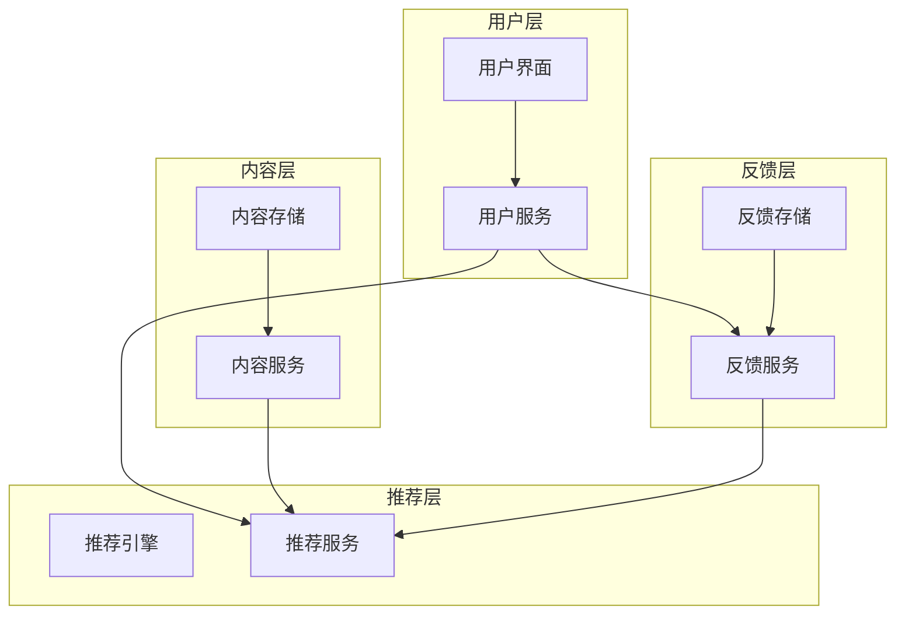
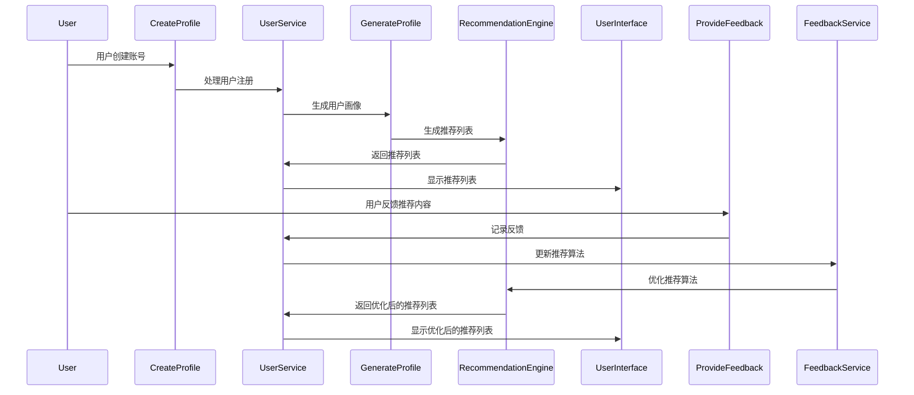

                 

# 在快餐文化中寻找深度：重建思考和反省能力

## 关键词：
快餐文化、深度思考、反省能力、信息筛选、阅读习惯、算法原理、系统架构设计、项目实战

## 摘要：
本文旨在探讨在快餐文化盛行的时代，如何重建思考和反省能力。通过分析快餐文化的背景、核心概念及其影响，本文提出了一系列具体的方法和实践，包括培养良好的阅读习惯、提高信息筛选能力、学会深度思考和反省能力的培养。文章将通过实际案例和项目实战，详细阐述如何将这些方法应用于IT领域，帮助读者在快餐文化中寻找深度，提升个人素养。

## 第1章：问题背景

### 1.1 问题背景

在当今这个信息爆炸的时代，人们的生活节奏越来越快，大量的信息源源不断地涌入。与此同时，快餐文化的盛行使得人们倾向于快速消费信息，追求短平快的阅读体验。然而，这种快餐式的信息消费方式导致了许多问题的产生，其中一个显著的问题就是深度思考和反省能力的缺失。

快餐文化的特点在于其快速、高效、浅显易懂，但往往缺乏深度和思考价值。在快节奏的生活中，人们更容易受到信息过载的困扰，难以沉下心来深入思考问题。这种现象不仅影响了个人生活质量，也对社会发展产生了负面影响。因此，如何在快餐文化中寻找深度，重建思考和反省能力，成为了一个亟待解决的问题。

### 1.2 问题描述

快餐文化的传播速度快，信息量大，但往往缺乏深度和思考价值。人们在快速消费信息的过程中，容易产生阅读障碍和思考能力下降的问题。具体表现为：

1. **阅读障碍**：在快餐文化的影响下，人们倾向于阅读浅显易懂、简洁明了的内容，对复杂、深奥的知识望而却步。这导致阅读能力下降，难以理解深层次的问题。

2. **思考能力下降**：快餐文化的消费方式使得人们容易陷入浅层次的思维模式，缺乏对问题的深入分析和思考。这种思考能力的下降不仅影响了个人的学习、工作和生活，也限制了创新和进步的可能性。

3. **信息过载**：随着互联网和移动设备的普及，人们每天接触到海量的信息。如何筛选和处理这些信息，成为一个严峻的挑战。快餐文化的快速传播使得人们更容易受到信息过载的影响，难以有效利用信息资源。

### 1.3 问题解决

为了解决快餐文化带来的问题，我们需要采取一系列措施来重建思考和反省能力。具体方法如下：

1. **培养良好的阅读习惯**：通过制定阅读计划、选择适合的阅读材料、创造良好的阅读环境等方式，培养良好的阅读习惯。这有助于提高阅读能力，促进深度思考。

2. **提高信息筛选能力**：学会识别信息真伪、评估信息价值、避免信息过载等方法，提高信息筛选能力。这有助于减少信息干扰，专注于有价值的信息。

3. **学会深度思考**：通过问题分解、逻辑推理、批判性思维等方法，培养深度思考的能力。这有助于深入分析问题，发现问题的本质。

4. **反省能力的培养**：通过自我反思、同伴反馈、情境模拟等方式，培养反省能力。这有助于个人成长，提高自我认识。

### 1.4 边界与外延

快餐文化的影响不仅仅局限于阅读领域，还涉及到网络信息、媒体传播等多个方面。因此，本文的研究范围包括但不限于阅读、网络、媒体等领域。同时，本文也将探讨如何将这些方法应用于IT领域，帮助读者在快餐文化中寻找深度，提升个人素养。

### 1.5 概念结构与核心要素组成

在本文中，我们将对以下几个核心概念进行深入探讨：

1. **快餐文化**：介绍快餐文化的定义、特点及其影响。
2. **深度思考**：探讨深度思考的概念、特点及方法。
3. **反省能力**：分析反省能力的概念、特点及培养方法。
4. **信息筛选能力**：介绍信息筛选的重要性及筛选方法。

这些概念是重建思考和反省能力的基础，也是本文的核心内容。

## 第2章：核心概念与联系

### 2.1 快餐文化的概念与特点

快餐文化是一种以快速、高效、浅显易懂为特点的文化现象。它起源于20世纪中后期的美国，随后在全球范围内迅速传播。快餐文化的特点如下：

1. **快速传播**：快餐文化通过互联网、社交媒体等渠道迅速传播，使得人们可以随时随地获取信息。
2. **浅显易懂**：快餐文化的内容通常简洁明了，易于理解，但往往缺乏深度和思考价值。
3. **高效消费**：快餐文化强调信息的快速消费，人们倾向于在短时间内获取大量信息，而不是深入思考。

快餐文化的出现是现代社会发展的一种必然趋势，它满足了人们对于信息快速获取的需求，但也带来了许多负面影响，如阅读障碍、思考能力下降等。

### 2.2 深度思考的概念与特点

深度思考是一种深入、全面、系统的思考方式。它与快餐文化相反，强调对问题的深入分析和思考，具有以下几个特点：

1. **深入分析**：深度思考不仅仅是表面的了解，而是对问题的本质、内在联系进行深入分析。
2. **逻辑清晰**：深度思考要求逻辑思维清晰，能够有条理地分析问题。
3. **创新意识**：深度思考鼓励创新思维，通过不同的角度和思路来解决问题。

深度思考是解决问题的关键，它能够帮助人们发现问题的本质，提出创新的解决方案，从而推动个人和团队的发展。

### 2.3 反省能力的概念与特点

反省能力是指个体对自身行为、思想、价值观进行反思、总结和改进的能力。它具有以下几个特点：

1. **自我反思**：反省能力要求个体能够对自己的行为、思想和价值观进行反思，认识到自己的不足。
2. **持续改进**：通过反省，个体能够总结经验教训，持续改进自己的行为和思想。
3. **自我认识**：反省能力有助于个体提高自我认识，了解自己的优点和不足，从而实现自我提升。

反省能力对于个人成长和社会发展具有重要意义。它不仅有助于个体提高自身素质，也能够促进团队和社会的进步。

### 2.4 三者之间的联系与区别

快餐文化、深度思考和反省能力三者之间存在紧密的联系。快餐文化的传播使得人们容易陷入浅层次的思维模式，缺乏深度思考和反省能力。而深度思考和反省能力则是重建思考和反省能力的基础，它们能够帮助人们摆脱快餐文化的束缚，提升个人素养。

同时，三者之间也存在明显的区别：

1. **快餐文化**：强调快速、高效、浅显易懂，但缺乏深度和思考价值。
2. **深度思考**：强调深入、全面、系统，通过逻辑推理和深入分析来解决问题。
3. **反省能力**：强调自我反思、总结和改进，通过自我认识和持续改进来实现个人成长。

通过理解这三者之间的联系和区别，我们可以更好地在快餐文化中寻找深度，重建思考和反省能力。

## 第3章：重建思考和反省能力的方法与实践

### 3.1 培养良好的阅读习惯

良好的阅读习惯是提高深度思考和反省能力的基础。以下是一些培养良好阅读习惯的方法：

1. **制定阅读计划**：根据自己的时间安排，制定合理的阅读计划。每天或每周安排固定的阅读时间，确保阅读的持续性和规律性。

2. **选择适合的阅读材料**：选择适合自己的阅读材料，如经典著作、专业书籍、学术论文等。避免阅读过于浅显易懂、缺乏思考价值的书籍。

3. **创造良好的阅读环境**：在安静、舒适的环境中阅读，减少干扰和噪音。可以选择图书馆、咖啡厅等地方，以创造一个专注的阅读氛围。

4. **做笔记和总结**：在阅读过程中，做笔记和总结有助于加深理解和记忆。可以将重要的观点、论据和结论记录下来，方便后续回顾和思考。

5. **定期回顾和反思**：定期回顾阅读的内容，思考所学的知识和经验，并将其应用到实际生活和工作中。通过反思，不断优化阅读习惯和方法。

### 3.2 提高信息筛选能力

在信息爆炸的时代，提高信息筛选能力变得尤为重要。以下是一些提高信息筛选能力的方法：

1. **识别信息真伪**：在获取信息时，要学会辨别信息的真伪。可以通过查找来源、验证事实、参考权威资料等方式来识别信息的真实性。

2. **评估信息价值**：在筛选信息时，要学会评估信息的价值。可以关注信息的准确性、可靠性、相关性等方面，筛选出对自己有帮助的信息。

3. **避免信息过载**：合理规划时间，避免过度关注和获取信息。可以设置信息过滤机制，如关注关键信息、订阅高质量的内容来源等，减少无效信息的干扰。

4. **学会分类和信息管理**：将获取的信息进行分类和管理，建立自己的信息库。可以通过文件夹、标签、数据库等方式，将信息进行整理和归档，方便后续查找和利用。

5. **培养信息敏感性**：培养对信息的敏感性和洞察力，能够快速捕捉到有价值的信息。可以通过广泛阅读、参加行业研讨会、关注行业动态等方式，提升信息筛选能力。

### 3.3 学会深度思考

深度思考是提高个人素养和解决问题能力的关键。以下是一些学会深度思考的方法：

1. **问题分解**：在面对复杂问题时，要学会将其分解为若干个子问题，逐一分析和解决。通过分解问题，可以更好地理解问题的本质，找到解决方案。

2. **逻辑推理**：运用逻辑推理的方法，通过因果关系、归纳推理、演绎推理等手段，对问题进行深入分析。逻辑推理可以帮助我们建立清晰的思维框架，提高思考的准确性。

3. **批判性思维**：培养批判性思维，对信息、观点和解决方案进行客观分析和评估。通过质疑和反思，可以发现问题的不足之处，提出更有针对性的解决方案。

4. **跨学科学习**：跨学科学习可以帮助我们从不同角度思考问题，获取多元化的视角。通过学习不同领域的知识，可以拓宽思路，提高深度思考的能力。

5. **实践和反思**：将深度思考应用到实际生活和工作中，通过实践和反思，不断总结经验教训，提高思考能力。通过实践，可以将理论转化为行动，实现真正的思考和成长。

### 3.4 反省能力的培养

反省能力是个人成长和发展的重要能力。以下是一些培养反省能力的方法：

1. **自我反思**：定期对自己的行为、思想和价值观进行反思，认识到自己的优点和不足。可以通过写反思日记、与朋友交流等方式，进行自我反思。

2. **同伴反馈**：与他人交流，获取他人的意见和建议，了解自己的盲点和不足。可以通过团队讨论、同事反馈等方式，获得同伴反馈。

3. **情境模拟**：通过情境模拟，提前预演可能发生的问题和挑战，思考应对策略。通过模拟不同的情境，可以提高应对问题的能力和自信心。

4. **记录和总结**：将反思和总结的过程记录下来，形成书面材料。通过记录和总结，可以加深对问题的理解和认识，为后续的改进提供依据。

5. **持续学习和改进**：通过持续学习和实践，不断提高自己的知识和能力。通过不断反思和总结，持续改进自己的行为和思想，实现个人成长和发展。

### 3.5 综合应用

在快餐文化中重建思考和反省能力，需要将以上方法综合应用。以下是一个综合应用案例：

假设你是一名软件开发工程师，面对一个复杂的软件开发项目。以下是如何在快餐文化中重建思考和反省能力的过程：

1. **培养阅读习惯**：每天安排一定的时间阅读相关领域的书籍和文章，了解最新的技术趋势和最佳实践。

2. **提高信息筛选能力**：在获取信息时，学会识别真伪和评估价值，选择有价值的信息进行深入学习和研究。

3. **学会深度思考**：在项目开发过程中，运用问题分解和逻辑推理的方法，将复杂的问题分解为若干个子问题，逐一解决。

4. **反省能力的培养**：定期对自己的工作过程和结果进行反思，识别自己的优点和不足，寻找改进的机会。

5. **综合应用**：将阅读、信息筛选、深度思考和反省能力综合应用到项目中，不断提升自己的技术水平和工作效率。

通过以上方法，你可以在快餐文化中重建思考和反省能力，提高个人素养，为项目的成功贡献力量。

## 第4章：实际案例与项目实战

### 4.1 项目背景

为了更好地理解如何在快餐文化中重建思考和反省能力，我们选择了一个实际的项目案例——一款基于人工智能的智能推荐系统。该系统旨在为用户提供个性化的内容推荐，提高用户满意度。

### 4.2 项目介绍

该智能推荐系统包括以下几个主要功能模块：

1. **用户画像生成**：通过分析用户的历史行为和兴趣偏好，生成用户画像，为推荐提供基础数据。
2. **内容分类和标签**：对推荐的内容进行分类和标签化处理，便于后续的推荐算法和应用。
3. **推荐算法**：采用基于协同过滤、内容匹配等算法，为用户生成个性化的推荐列表。
4. **用户反馈和优化**：收集用户对推荐内容的反馈，不断优化推荐算法，提高推荐质量。

### 4.3 系统功能设计

在系统功能设计中，我们采用了领域模型方法，通过mermaid类图来描述系统的功能模块及其关系。以下是一个简化的mermaid类图示例：

```mermaid
classDiagram
  User <<class>> User
  Content <<class>> Content
  Recommendation <<class>> Recommendation
  Feedback <<class>> Feedback
  User -> Recommendation : 生成
  Content -> Recommendation : 推荐
  Feedback -> Recommendation : 优化
```

通过这个类图，我们可以清晰地看到用户、内容、推荐和反馈四个核心模块及其相互关系。

### 4.4 系统架构设计

在系统架构设计中，我们采用了分层架构，通过mermaid架构图来描述系统的整体架构。以下是一个简化的mermaid架构图示例：



通过这个架构图，我们可以清晰地看到系统各层的职责和交互关系。

### 4.5 系统接口设计和系统交互

在系统接口设计和系统交互方面，我们采用了mermaid序列图来描述系统的主要接口和交互流程。以下是一个简化的mermaid序列图示例：



通过这个序列图，我们可以清晰地看到系统的用户接口和交互流程。

### 4.6 实际案例分析和详细讲解剖析

以下是一个具体的实际案例分析和详细讲解剖析：

**案例**：一名用户在智能推荐系统中注册账号后，开始浏览和互动。

**分析**：

1. **用户注册**：用户通过用户界面创建账号，用户服务处理用户注册流程，生成用户画像。
2. **推荐列表生成**：用户画像生成后，推荐引擎根据用户画像和内容标签，生成个性化的推荐列表。
3. **推荐列表展示**：用户服务将推荐列表返回给用户界面，展示给用户。
4. **用户互动**：用户浏览推荐列表，点击感兴趣的内容，提供反馈。
5. **反馈记录和优化**：用户反馈记录在反馈服务中，反馈服务更新推荐算法，优化推荐列表。

**详细讲解**：

1. **用户注册**：用户通过用户界面提交注册信息，用户服务接收到注册请求后，进行用户身份验证和数据存储。在这个过程中，用户服务会调用用户画像生成模块，根据用户注册信息生成用户画像。

2. **推荐列表生成**：用户画像生成后，推荐引擎接收到用户画像，结合内容标签和协同过滤算法，生成个性化的推荐列表。推荐引擎会分析用户的历史行为和兴趣偏好，为用户推荐相关的内容。

3. **推荐列表展示**：用户服务将生成的推荐列表返回给用户界面，通过网页或移动应用展示给用户。用户界面会以卡片、列表等形式，将推荐内容展示给用户。

4. **用户互动**：用户浏览推荐列表，根据个人的兴趣和需求，点击感兴趣的内容。用户的行为数据会被记录下来，作为后续推荐算法优化的依据。

5. **反馈记录和优化**：用户反馈记录在反馈服务中，反馈服务会分析用户的反馈数据，更新推荐算法的参数。根据用户的反馈，推荐引擎会调整推荐策略，优化推荐列表，提高推荐质量。

通过这个实际案例，我们可以看到在智能推荐系统中，如何通过深度思考和反省能力，实现个性化推荐的目标。通过分析用户行为和反馈，不断优化推荐算法，提高推荐质量，从而提升用户满意度。

### 4.7 项目小结

通过这个实际案例，我们可以看到在快餐文化中，如何通过重建思考和反省能力，实现项目的成功。以下是一些小结：

1. **深度思考和反省能力的重要性**：在项目开发过程中，深度思考和反省能力是不可或缺的。通过深入分析用户需求和行为，反思项目过程中的问题和不足，不断优化和改进，实现项目的成功。

2. **培养良好的阅读习惯**：通过阅读相关的技术文献和案例，了解最新的技术趋势和最佳实践，为项目的开发提供理论支持和实践经验。

3. **提高信息筛选能力**：在项目开发过程中，需要学会筛选和识别有价值的信息，避免被无效信息干扰。通过提高信息筛选能力，可以更专注于项目的关键问题和核心功能。

4. **实践和反思**：将深度思考和反省能力应用到实际项目中，通过实践和反思，不断总结经验教训，提高项目开发的能力和效率。

5. **持续学习和改进**：在快餐文化中，持续学习和改进是必不可少的。通过不断学习最新的技术和方法，持续优化项目，提高项目质量和用户体验。

## 第5章：最佳实践与注意事项

### 5.1 最佳实践

在快餐文化中重建思考和反省能力，以下是一些最佳实践：

1. **设定阅读目标**：为自己设定明确的阅读目标，如每周阅读一定数量的书籍或文章。这有助于提高阅读效率和成果。

2. **制定学习计划**：根据自己的时间安排，制定详细的学习计划，包括学习的内容、时间、频率等。这有助于保持学习的持续性和规律性。

3. **实践与反思**：将所学的知识和方法应用到实际工作和生活中，通过实践和反思，不断总结经验教训，提高思考和反省能力。

4. **交流与分享**：与他人交流学习心得和经验，分享知识和见解。通过交流，可以拓宽视野，提高学习效果。

5. **建立学习社区**：加入学习社区，与志同道合的人一起学习和讨论。这有助于提高学习动力，促进个人成长。

### 5.2 小结

在快餐文化中重建思考和反省能力是一个长期且持续的过程。通过培养良好的阅读习惯、提高信息筛选能力、学会深度思考和反省能力，我们可以提高个人素养，提升工作效率和生活质量。以下是一些注意事项：

1. **避免盲目跟风**：在信息爆炸的时代，避免盲目跟风和追求短期利益。要学会独立思考和判断，选择真正有价值的信息和知识。

2. **保持专注**：在阅读和学习过程中，保持专注和耐心。避免受到外界干扰和诱惑，确保学习效果。

3. **定期反思**：定期对自己的学习和工作过程进行反思，识别优点和不足，找出改进的方向。

4. **持续学习**：在快餐文化中，持续学习是必不可少的。要时刻保持对知识和技能的渴望，不断更新自己的知识和能力。

5. **培养兴趣**：培养对阅读和学习的兴趣，将其视为一种乐趣和享受。通过培养兴趣，可以提高学习动力和效果。

通过以上最佳实践和注意事项，我们可以在快餐文化中重建思考和反省能力，实现个人成长和进步。

## 第6章：拓展阅读

为了进一步深入探讨快餐文化、深度思考和反省能力，以下推荐一些拓展阅读的书籍和文章：

1. **书籍**：
   - 《深度工作：如何有效利用每一点脑力》（Deep Work: Rules for Focused Success in a Distracted World）——作者：卡尔·纽波特（Cal Newport）
   - 《思考，快与慢》（Thinking, Fast and Slow）——作者：丹尼尔·卡尼曼（Daniel Kahneman）
   - 《刻意练习：如何从新手到大师》（Peak: Secrets from the New Science of Expertise）——作者：安德斯·艾利克森（Anders Ericsson）

2. **文章**：
   - 《如何在信息爆炸的时代保持思考深度》（How to Keep Thinking Deeply in a World of Shallow Information）
   - 《反思的力量：如何通过反思实现个人成长》（The Power of Reflection: How to Achieve Personal Growth Through Reflection）
   - 《为什么深度思考如此重要》（Why Deep Thinking Matters）

这些书籍和文章提供了更多关于快餐文化、深度思考和反省能力的深入见解和实践方法，有助于读者进一步拓展知识和提升思考能力。

### 结论

在快餐文化盛行的时代，重建思考和反省能力显得尤为重要。通过培养良好的阅读习惯、提高信息筛选能力、学会深度思考和反省能力的培养，我们可以摆脱快餐文化的束缚，提升个人素养，实现个人成长和社会进步。让我们在快餐文化的浪潮中，寻找深度，不断思考和反省，成为更好的自己。

### 作者信息

作者：AI天才研究院/AI Genius Institute & 禅与计算机程序设计艺术 /Zen And The Art of Computer Programming

AI天才研究院致力于推动人工智能技术的发展和应用，助力人类社会进步。同时，作者也希望通过本文，引导读者在快餐文化中寻找深度，提升个人素养，为构建更加美好的世界贡献力量。禅与计算机程序设计艺术则是作者对计算机编程和人工智能领域的深入思考和总结，希望读者能够从中获得启示和灵感。

