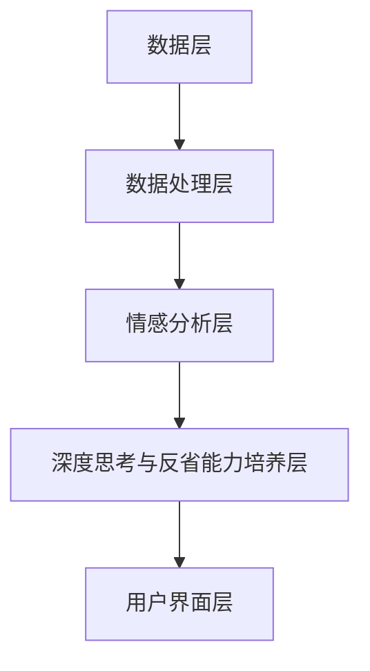
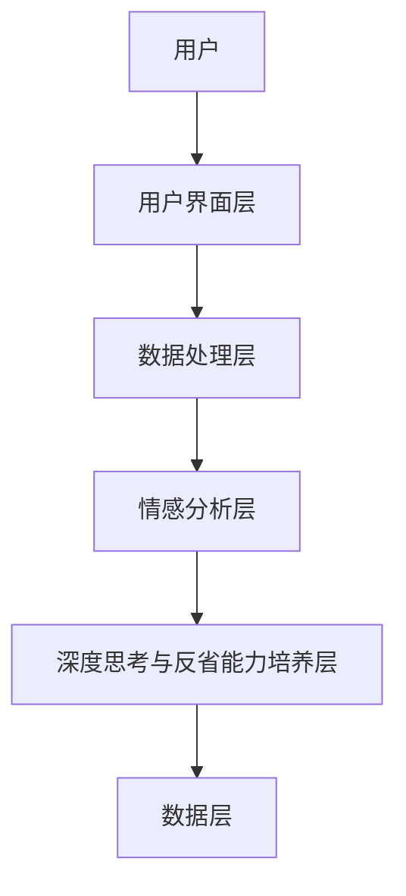

                 

## 引言

在现代社会，随着信息技术的飞速发展，快餐文化逐渐渗透到我们的日常生活中。这种文化模式以追求快速、便捷为主要特征，它虽然在某种程度上满足了人们对信息的需求，但也在很大程度上削弱了独立思考和反省能力的发展。作为人工智能领域的专家，我们有必要深入探讨这种现象背后的原因，并提出具体的解决策略，帮助读者重建独立思考和反省能力。

快餐文化的核心在于其迅速传播的信息和高效消费的方式。人们通过社交媒体、新闻客户端和短视频平台等渠道，可以快速获取海量的信息。然而，这种快速获取信息的方式，往往导致人们习惯于表面的、碎片化的信息，而缺乏对信息深层次的思考。这种现象不仅影响了个人的知识体系构建，也对社会整体产生了深远的影响。

本文将围绕“在快餐文化中寻找深度：重建独立思考和反省能力”这一主题，逐步展开讨论。首先，我们将介绍快餐文化的核心特征和影响，接着深入探讨独立思考和反省能力的本质，随后提出具体的解决方案和实施策略。最后，我们将通过案例研究和实践，验证这些策略的有效性。

通过这篇文章，我们希望能够帮助读者认识到快餐文化的负面影响，激发他们对独立思考和反省能力的重视，从而在日常生活中重建深度思考的习惯，提高个人素质和思维能力。

### 第一部分：背景介绍

#### 1. 引言

在现代社会中，随着信息技术的飞速发展，快餐文化逐渐渗透到我们的日常生活中。这种文化模式以追求快速、便捷为主要特征，它虽然在某种程度上满足了人们对信息的需求，但也在很大程度上削弱了独立思考和反省能力的发展。本部分将详细探讨快餐文化的起源、发展及其在现代社会中的广泛应用，分析其对个人和社会产生的深远影响，为进一步讨论重建独立思考和反省能力提供背景知识。

#### 2. 快餐文化的起源与发展

快餐文化的起源可以追溯到20世纪初期，美国作为工业化国家的代表，其生产和消费模式迅速发展。随着汽车和高速公路的普及，城市化进程加速，人们的生活方式也发生了巨大的变化。在这样的背景下，为了满足快节奏生活需求，快餐作为一种便捷、高效的饮食选择应运而生。最早的快餐店如麦当劳、肯德基等，以其标准化、快速服务的特点迅速在全球范围内推广。

随着时间的推移，快餐文化逐渐扩展到媒体、教育、消费等多个领域。在媒体领域，信息传播的速度越来越快，社交媒体、新闻客户端和短视频平台的兴起，使人们可以随时随地获取信息。然而，这些平台往往注重信息量的丰富，而忽视了对信息深度的挖掘，导致信息的碎片化和浅显化。在教育领域，快餐式学习模式逐渐占据主导地位，学生通过在线课程、速成班等方式迅速获取知识，但往往缺乏对知识的深入理解和应用能力。在消费领域，快捷、便利的购物方式和支付手段，使得人们越来越依赖于即时满足感，而忽视了消费背后的深层次问题。

#### 3. 快餐文化的核心特征

快餐文化的核心特征可以概括为以下几点：

- **快速性**：追求迅速、高效的服务和消费过程，无论是信息的获取、知识的传递，还是食品的准备和享用，都强调时间的节约。

- **便捷性**：以方便为核心，通过标准化的流程和统一的模式，减少用户在使用过程中的时间和精力投入。

- **内容浅薄**：快餐文化所传递的信息和知识往往具有表面化、碎片化的特点，缺乏深度和系统性。

- **即时满足感**：快餐文化注重即时满足，消费者在短时间内获得满足感，而忽视了对长期价值的考虑。

#### 4. 快餐文化对个人和社会的影响

快餐文化对个人和社会的影响是深远而广泛的：

- **个人层面**：在个人层面，快餐文化导致了以下几个问题：

  - **思考能力的下降**：由于信息的快速获取和消费，人们习惯于浅层次的思考，缺乏对问题深层次的挖掘和分析能力。
  
  - **知识体系的碎片化**：快餐文化使人们获取的知识往往是零散的、孤立的，难以形成完整的知识体系。
  
  - **自我反省能力的削弱**：快餐文化注重即时满足，人们往往在行为后缺乏对自身行为的反思和改进，导致自我成长缓慢。

- **社会层面**：在社会层面，快餐文化的影响同样显著：

  - **社会思潮的浅薄化**：快餐文化导致社会思潮的浅薄化，人们越来越难以深入思考和讨论复杂的社会问题。
  
  - **教育质量的下降**：快餐式学习模式使得教育质量下降，学生缺乏系统性和深度的学习，影响了整个社会的知识水平。
  
  - **文化传承的挑战**：快餐文化对传统文化和价值观的冲击，使得一些深层次的文化内涵被忽视，影响了文化的传承和发展。

#### 5. 问题解决的必要性

面对快餐文化带来的诸多问题，重建独立思考和反省能力显得尤为重要。只有通过重建独立思考和反省能力，我们才能在信息爆炸的时代中保持清晰的思维，形成系统的知识体系，并对自身行为进行深入的反思和改进。同时，这也将有助于提升个人的综合素质和思维能力，促进社会的整体进步。

综上所述，本部分背景介绍旨在帮助读者了解快餐文化的起源、发展及其对个人和社会的影响，为进一步探讨如何重建独立思考和反省能力奠定基础。

### 6. 问题描述

快餐文化的兴起带来了诸多问题，其中最显著的就是它对独立思考和反省能力的削弱。以下将详细阐述快餐文化在现代社会中引发的主要问题，包括信息碎片化、缺乏深度思考和反省能力的几个方面。

#### 6.1 信息碎片化

在快餐文化的影响下，信息的获取和传播变得极为迅速和便捷，但这种快速的信息传播方式也导致了信息的碎片化。信息碎片化指的是信息被分割成小块，这些小块往往缺乏上下文的关联，无法构成完整的知识体系。以下为信息碎片化的具体表现：

- **新闻客户端**：新闻客户端如今日头条、微博等，通过算法推送的方式，将各种新闻信息进行分类，用户可以在短时间内浏览大量新闻。然而，这些新闻往往是孤立的，缺乏深度和连贯性，使得用户难以从整体上理解事件的全貌。

- **社交媒体**：社交媒体如微信、Facebook等，用户在浏览朋友圈或新闻推送时，会接收到大量零散的信息，如短篇故事、搞笑视频、趣闻轶事等。这些信息虽然能带来短暂的愉悦感，但却难以引发深刻的思考。

- **在线教育**：在线教育平台提供了大量的课程资源，用户可以通过碎片化的视频和文档进行学习。然而，这种学习方式往往导致知识点的孤立，学生难以形成系统的知识体系。

信息碎片化不仅影响了人们对知识的整体把握，还削弱了他们对问题进行深入分析和解决的能力。这种碎片化的信息环境使得人们习惯于快速浏览和消费信息，而缺乏对信息进行深度加工和理解的需求。

#### 6.2 缺乏深度思考

快餐文化强调快速获取信息，但往往忽视了对信息的深度思考。深度思考是指对问题进行深入分析、挖掘和批判，从而形成独立的见解和观点。以下为缺乏深度思考的具体表现：

- **媒体消费**：在快餐文化的熏陶下，人们倾向于消费轻松、愉悦的媒体内容，如短视频、搞笑段子等。这种消费模式导致人们对复杂、严肃的议题缺乏兴趣和关注，难以形成深入的思考和见解。

- **知识学习**：快餐式的学习模式使得人们习惯于通过快速获取知识来完成任务，而忽视了知识的深度学习和应用。学生通过在线课程和速成班学习，虽然能迅速掌握一些基本知识，但缺乏对知识深层次的挖掘和应用能力。

- **问题解决**：在面对复杂问题时，快餐文化培养出的思维方式往往是表面化和短期化的。人们习惯于通过简单的解决方案来应对问题，而缺乏对问题根本原因的深入挖掘和长期解决方案的思考。

缺乏深度思考不仅限制了人们对问题的全面理解，还阻碍了他们创造性思维的发展。在信息爆炸的时代，只有通过深度思考，才能从大量的信息中筛选出有价值的内容，形成独立的见解和观点。

#### 6.3 缺乏反省能力

反省能力是指个体在行为后能够进行自我审视、反思，并从中吸取教训的能力。在快餐文化的环境中，人们的反省能力往往被削弱，具体表现如下：

- **行为后反思**：快餐文化强调即时满足，人们往往在行为发生后缺乏对自身行为的反思和评价。例如，在社交媒体上发布不当言论后，很少会进行自我反省和修正。

- **习惯性忽视**：在快节奏的生活中，人们容易忽视对自身行为的反思和改进。例如，在繁忙的工作中，人们往往忽视了对工作方法和工作效率的反思，导致工作效果不佳。

- **缺乏持续改进**：快餐文化使得人们习惯于追求短期效果，而忽视了对长期目标的持续改进。例如，在健康饮食方面，人们容易追求立竿见影的效果，而忽视了长期健康生活方式的养成。

缺乏反省能力不仅影响了个人行为的改进，还阻碍了个人成长和进步。只有通过反省，个体才能不断提高自身素质和思维能力，实现自我提升。

综上所述，快餐文化在现代社会中引发了一系列问题，包括信息碎片化、缺乏深度思考和反省能力。这些问题不仅影响了个人的知识构建和思维能力，也对社会整体产生了负面影响。因此，解决这些问题，重建独立思考和反省能力显得尤为重要。

### 7. 问题解决

为了解决快餐文化带来的问题，我们需要采取一系列有针对性的策略，帮助读者重建独立思考和反省能力。以下将详细探讨这些策略，包括重建深度思考习惯、培养反省能力、以及倡导深度阅读和思考的具体方法和步骤。

#### 7.1 重建深度思考习惯

深度思考是独立思考的重要基础，也是应对快餐文化带来的信息碎片化问题的有效手段。以下是一些重建深度思考习惯的方法：

1. **设定思考时间**：每天预留一段时间进行深度思考，不受外界干扰，专注于问题的分析和解决。例如，可以在早晨起床后或晚上睡觉前，设定30分钟到1小时的思考时间。

2. **学习批判性思维技巧**：通过学习批判性思维技巧，如分析、评估、比较和推理，提高对信息的筛选和分析能力。可以阅读相关书籍，如《批判性思维工具》等，或者参加相关课程和工作坊。

3. **进行复杂问题讨论**：与同行或朋友进行复杂问题的讨论，通过多角度的分析和探讨，提升对问题的全面理解和深度思考。可以定期组织讨论会，如读书会、问题分析会等。

4. **实践系统性思考**：在面对复杂问题时，尝试采用系统性的思考方法，如SWOT分析、SMART目标等，从整体和局部两方面进行深入分析。例如，在解决一个项目问题时，可以先从项目目标出发，逐步分解为子目标，然后分析实现每个子目标所需的资源和条件。

5. **培养写作习惯**：通过写作，将思考过程和结果进行记录和反思，提高思维的条理性和深度。可以定期写日记、博客或文章，将自己的思考和见解整理成文字。

#### 7.2 培养反省能力

反省能力是个人成长和进步的重要保障，也是应对快餐文化带来的行为后反思不足问题的有效手段。以下是一些培养反省能力的方法：

1. **定期自我评估**：定期对自己的行为、工作和生活进行评估，从成果、方法、态度等多个方面进行反思。可以设立固定的自我评估时间，如每周或每月的最后一个晚上，对自己的过去一段时间进行总结和反思。

2. **记录行为和感受**：在日常活动中，记录自己的行为和感受，特别是在遇到困难和挑战时，记录下自己是如何应对的，哪些方法是有效的，哪些需要改进。这种记录可以帮助自己在反思时有一个清晰的回顾。

3. **寻找反馈和建议**：主动向他人寻求反馈和建议，如同事、朋友或导师等。通过听取他人的意见，可以发现自己的盲点和不足，从而进行有效的反省和改进。

4. **制定改进计划**：在反思过程中，制定具体的改进计划，明确改进的目标和方法。例如，如果发现自己在时间管理方面存在问题，可以制定一个详细的时间管理计划，包括每天的任务清单和时间安排。

5. **培养持久改进的习惯**：反省不仅仅是一次性的行为，而是一种持续的习惯。通过不断地反省和改进，可以逐步提升自己的能力和素质。

#### 7.3 倡导深度阅读和思考

深度阅读和思考是重建独立思考和反省能力的重要途径，以下是一些具体的方法：

1. **选择高质量的阅读材料**：选择经典著作、专业书籍和深度报道等高质量阅读材料，这些内容往往具有深度和广度，能够提供丰富的思考和启示。

2. **进行深度阅读**：在阅读过程中，不仅要理解文字表面的含义，还要深入思考作者的意图和论据。可以采用阅读笔记、思维导图等工具，帮助自己捕捉和整理阅读中的关键信息和思考。

3. **撰写读书笔记**：通过撰写读书笔记，将自己的阅读心得和思考记录下来，这有助于加深对阅读材料的理解，并培养自己的写作和表达能力。

4. **进行批判性阅读**：对阅读材料进行批判性思考，评估其观点和论据的合理性，提出自己的见解和疑问。这种批判性阅读能够提高自己的分析能力和判断力。

5. **定期进行深度思考**：在阅读后，定期进行深度思考，将阅读中的收获和见解应用到实际生活中，解决实际问题或提升自己的能力。

通过以上策略，我们可以在快餐文化的环境中重建独立思考和反省能力，提高自己的知识水平和思维能力，从而更好地应对现代社会中的各种挑战。

### 8. 边界与外延

在讨论快餐文化的负面影响和重建独立思考和反省能力的过程中，我们需要明确一些边界和外延，以帮助我们更准确地理解这一主题，并确保讨论的全面性和深度。

#### 8.1 边界

1. **快餐文化的范围**：快餐文化主要指以快速、便捷为特征的文化现象，涵盖媒体传播、信息获取、消费行为等方面。但本文讨论的焦点是其在个人思考能力和行为习惯方面的负面影响，而非文化本身的性质和起源。

2. **独立思考和反省能力的定义**：独立思考能力是指个体在面对问题时，能够自主分析、判断和提出解决方案的能力；反省能力是指个体在行为后能够进行自我审视、反思，并从中吸取教训的能力。这两个概念是在快餐文化背景下讨论的重要能力，而非泛指所有的思考能力和反省能力。

3. **目标读者群体**：本文的目标读者主要是那些在快餐文化环境中感到困惑、渴望重建深度思考能力和反省能力的个人，特别是那些在信息技术和快速消费文化中成长的年轻人。

#### 8.2 外延

1. **快餐文化的延伸影响**：快餐文化不仅影响个人，还对社会整体产生了深远的影响。例如，社会思潮的浅薄化、教育质量的下降、文化传承的挑战等，都是快餐文化影响的外延。这些方面为我们理解快餐文化的广泛影响提供了更全面的视角。

2. **独立思考和反省能力的应用场景**：独立思考和反省能力不仅适用于个人的学习和工作，还可以应用于社会问题的解决、企业管理、公共政策制定等多个领域。在这些场景中，独立思考和反省能力是决策过程中不可或缺的要素，有助于提高决策的质量和效果。

3. **跨文化比较**：在不同文化背景下，快餐文化的影响可能会有所不同。例如，在西方文化中，快餐文化可能更强调个人主义和自我实现，而在东方文化中，可能更强调集体主义和人际关系的和谐。因此，本文在讨论快餐文化的负面影响时，需要考虑文化差异的影响。

4. **未来发展趋势**：随着信息技术的发展，快餐文化的形式和内容可能会发生变化。例如，人工智能和大数据技术的发展，可能会使信息的获取和传播变得更加快速和精准，但同时也可能带来新的挑战和问题。因此，本文讨论重建独立思考和反省能力时，需要关注未来发展的趋势和方向。

综上所述，明确边界和外延有助于我们更深入地理解快餐文化对独立思考和反省能力的影响，并为解决这些问题提供更具体的方向和策略。

### 9. 概念结构与核心要素组成

在探讨快餐文化对独立思考和反省能力的影响过程中，明确核心概念及其属性特征是至关重要的。以下是本文涉及的主要概念及其结构，通过分析这些概念，我们可以更好地理解快餐文化及其影响。

#### 9.1 快餐文化的核心特征

快餐文化以快速、便捷为特征，其主要特征包括：

- **信息传播速度**：信息的传播速度极快，通过社交媒体、新闻客户端和短视频平台等渠道，用户可以迅速获取大量信息。

- **消费方式**：消费方式以快速消费为主，用户追求即时满足感，往往忽视了对内容的深度理解和思考。

- **内容浅薄**：快餐文化所传递的信息内容往往缺乏深度和复杂性，多以短小、表面化为主。

- **即时满足感**：快餐文化注重满足用户在短时间内获取信息的需要，往往忽视了对长期价值的考虑。

#### 9.2 独立思考的特点

独立思考是指个体在面对问题时，能够自主分析、判断和提出解决方案的能力，其特点包括：

- **自主性**：个体在思考过程中不受外界影响，自主分析问题和提出解决方案。

- **批判性**：个体能够对信息进行批判性分析，识别信息的真伪和价值，从而形成独立的见解。

- **创造性**：个体能够基于已有信息提出新的见解和解决方案，通过创新性思维解决问题。

#### 9.3 反省能力的体现

反省能力是指个体在行为后能够进行自我审视、反思，并从中吸取教训的能力，其体现包括：

- **自我审视**：个体能够客观地评价自己的行为和决策，识别自身的优点和不足。

- **自我修正**：个体能够基于反思结果，对自身行为进行调整和改进，提高自身素质。

- **持续改进**：个体通过不断反思和修正，逐步提升自身的能力和素质，实现自我成长。

#### 9.4 概念属性特征对比表格

为了更直观地展示快餐文化、独立思考和反省能力的特征，我们可以通过对比表格来呈现它们之间的异同：

| 特征 | 快餐文化 | 独立思考 | 反省能力 |
| --- | --- | --- | --- |
| 传播速度 | 快速 | 较慢 | 慢 |
| 消费方式 | 快速消费 | 系统分析 | 反思修正 |
| 内容深度 | 浅薄 | 深入 | 反思修正 |
| 自主性 | 高 | 高 | 中 |
| 批判性 | 低 | 高 | 高 |
| 创造性 | 低 | 高 | 低 |
| 即时满足感 | 高 | 低 | 低 |
| 持续改进 | 低 | 高 | 高 |

#### 9.5 ER实体关系图架构

为了更全面地理解快餐文化、独立思考和反省能力之间的关系，我们可以通过ER实体关系图来展示它们之间的联系。以下是ER实体关系图的简单示例：

```mermaid
erDiagram
    Person "人" {
        String id
        String name
    }
    FastFoodCulture "快餐文化" {
        String id
        List<Person> consumers
    }
    IndependentThinking "独立思考" {
        String id
        Person thinker
    }
    ReflectiveAbility "反省能力" {
        String id
        Person reflector
    }
    Person ||--|{ FastFoodCulture } Consumer
    Person ||--|{ IndependentThinking } Practitioner
    Person ||--|{ ReflectiveAbility } Possessor
```

通过上述概念结构与核心要素组成的分析，我们可以更清晰地理解快餐文化、独立思考和反省能力之间的关系，为后续讨论提供理论基础。

### 第二部分：核心概念与联系

在深入探讨快餐文化对独立思考和反省能力的影响之前，有必要明确并分析几个核心概念及其相互之间的联系。通过理解这些核心概念，我们能够更好地把握问题本质，并为解决这些问题提供理论依据。

#### 10.1 快餐文化的核心特征

快餐文化是一种以快速、便捷为特征的文化现象，其核心特征主要包括信息传播速度、消费方式、内容浅薄和即时满足感。这些特征共同构成了快餐文化的本质，并深刻影响着我们的思维方式和生活习惯。

- **信息传播速度**：快餐文化的信息传播速度极快，得益于现代信息技术的迅猛发展，如社交媒体、新闻客户端和短视频平台等。这些平台通过算法推荐和大数据分析，能够迅速将海量信息推送给用户，使用户可以在短时间内接收到大量信息。然而，这种快速的信息传播方式也导致了信息碎片化和浅显化，使人们难以形成系统的知识体系。

- **消费方式**：快餐文化的消费方式强调快速消费和即时满足。人们在追求便捷的同时，往往忽视了消费的深度和长远价值。例如，在社交媒体上浏览新闻、观看短视频，或是通过在线课程快速获取知识，这些行为虽然在短期内满足了信息需求，但缺乏深度思考，难以形成深刻的理解和记忆。

- **内容浅薄**：快餐文化所传递的信息内容往往浅薄、碎片化，难以提供完整的、系统化的知识。这种浅薄的内容往往无法满足用户对知识的深层次需求，导致他们在面对复杂问题时，难以进行有效的分析和解决。例如，在社交媒体上看到的新闻片段或短篇故事，往往缺乏事件的完整背景和详细分析，难以帮助用户形成全面的认识。

- **即时满足感**：快餐文化的核心在于满足用户的即时需求，强调快速获取和消费信息。这种即时满足感虽然能够带来短暂的愉悦，但容易使人们陷入一种追求短期快感的生活方式，忽视了长期的价值积累和个人成长。

#### 10.2 独立思考的特点

独立思考是指个体在面对问题时，能够自主分析、判断和提出解决方案的能力。独立思考具有以下特点：

- **自主性**：独立思考强调个体的自主性，不受外界影响，能够独立分析问题，形成独立的见解和观点。这种自主性是独立思考的核心，也是个体在复杂环境中应对挑战的重要能力。

- **批判性**：独立思考不仅要求个体能够独立分析问题，还要求个体具备批判性思维能力，对信息进行批判性分析，识别信息的真伪和价值。批判性思维有助于个体在信息过载的环境中，筛选出有价值的信息，并形成准确的判断。

- **创造性**：独立思考还要求个体具备创造性思维，能够在已有信息的基础上，提出新的见解和解决方案。创造性思维是推动个体创新和进步的重要动力，也是解决复杂问题的有效途径。

#### 10.3 反省能力的体现

反省能力是指个体在行为后能够进行自我审视、反思，并从中吸取教训的能力。反省能力主要体现在以下几个方面：

- **自我审视**：反省能力要求个体能够在行为后对自己进行客观审视，识别自身的优点和不足。自我审视是反省能力的基础，只有通过客观审视，个体才能发现自身的不足，并制定改进计划。

- **自我修正**：在自我审视的基础上，反省能力还要求个体能够对自身行为进行调整和修正，提高自身素质和能力。自我修正是个体成长和进步的关键，通过不断修正错误，个体可以逐步提升自己的能力和水平。

- **持续改进**：反省能力不仅仅是行为后的修正，更是一种持续改进的过程。个体通过不断反省，积累经验和教训，逐步完善自己的能力和素质。持续改进有助于个体在复杂环境中不断适应和成长。

#### 10.4 概念属性特征对比表格

为了更直观地展示快餐文化、独立思考和反省能力的特征，我们可以通过对比表格来呈现它们之间的异同：

| 特征 | 快餐文化 | 独立思考 | 反省能力 |
| --- | --- | --- | --- |
| 传播速度 | 快速 | 较慢 | 慢 |
| 消费方式 | 快速消费 | 系统分析 | 反思修正 |
| 内容深度 | 浅薄 | 深入 | 反思修正 |
| 自主性 | 低 | 高 | 中 |
| 批判性 | 低 | 高 | 高 |
| 创造性 | 低 | 高 | 低 |
| 即时满足感 | 高 | 低 | 低 |
| 持续改进 | 低 | 高 | 高 |

通过上述核心概念及其特征的详细分析，我们可以更深入地理解快餐文化对独立思考和反省能力的影响。快餐文化的快速性、浅薄性和即时满足感，使得人们在信息获取和消费过程中，容易陷入表面化和碎片化的思维模式，削弱了独立思考和反省能力的发展。而独立思考和反省能力则强调自主性、批判性和创造性，有助于个体在面对复杂问题时，形成系统化的知识体系和有效的解决方案。通过重建独立思考和反省能力，我们可以在快餐文化的冲击下，保持清晰的思维，实现个人成长和进步。

### 11. 算法原理讲解

为了在快餐文化的环境中重建独立思考和反省能力，我们需要采用一系列算法和模型来帮助读者进行深度思考和自我反省。以下是几个关键算法的原理讲解，包括机器学习算法在文本分析中的应用，以及认知心理学模型在行为分析中的应用。

#### 11.1 机器学习算法原理

机器学习算法通过学习历史数据来预测或分类未知数据，其核心在于构建能够自动学习和适应数据规律的模型。以下介绍几种常见的机器学习算法：

1. **线性回归**：线性回归是一种用于预测数值型结果的算法。它通过寻找自变量和因变量之间的线性关系，来预测因变量的值。其数学模型为：
   $$
   y = w_0 + w_1 \cdot x_1 + w_2 \cdot x_2 + ... + w_n \cdot x_n
   $$
   其中，$y$ 为因变量，$x_1, x_2, ..., x_n$ 为自变量，$w_0, w_1, w_2, ..., w_n$ 为模型的权重。通过最小化预测值与实际值之间的误差，可以求得最优的权重值。

2. **决策树**：决策树是一种用于分类和回归的算法，通过一系列的决策规则，将数据分割成不同的子集，最终达到分类或回归的目的。决策树的核心是节点划分规则，通常采用信息增益、基尼不纯度等指标来评估节点的划分质量。

3. **支持向量机（SVM）**：支持向量机是一种用于分类的算法，它通过找到一个最优的超平面，将数据分为不同的类别。其目标是最大化分类边界到支持向量的距离。SVM的数学模型为：
   $$
   \min_{w, b} \frac{1}{2} ||w||^2
   $$
   s.t.
   $$
   y_i ( \langle w, x_i \rangle + b ) \geq 1
   $$
   其中，$w$ 和 $b$ 分别为模型的权重向量和偏置项，$x_i$ 和 $y_i$ 分别为训练样本的特征和标签。

4. **神经网络**：神经网络是一种模仿人脑结构和功能的算法，通过多层节点（神经元）的互联，实现数据的输入和输出。神经网络的训练过程包括前向传播和反向传播，通过不断调整权重和偏置项，使得模型能够拟合训练数据。

#### 11.2 认知心理学模型原理

认知心理学模型通过模拟人类思维过程，帮助理解个体在信息处理和决策过程中的心理机制。以下介绍几种常见的认知心理学模型：

1. **行为主义模型**：行为主义模型关注外部刺激和反应之间的关系，认为个体通过奖励和惩罚来调节行为。其核心理论包括经典条件反射和操作性条件反射。经典条件反射通过将中性刺激与奖励或惩罚结合，使个体对中性刺激产生条件反应；操作性条件反射通过奖励或惩罚操作性行为，以增强或减弱该行为的发生。

2. **认知模型**：认知模型关注内部心理过程，包括注意、记忆、思维和决策等。其中，图尔文模型（Tulving's Model）认为记忆包括情景记忆和语义记忆，情景记忆与特定的时间和地点相关，而语义记忆与抽象概念和事实相关。此外，认知失调理论（Cognitive Dissonance Theory）认为个体在面临矛盾信息时，会产生心理不适，从而寻求一致性的解决方案。

3. **多任务处理模型**：多任务处理模型关注个体在同时处理多个任务时的心理机制。注意力切换模型（Attention Switching Model）认为，个体在切换任务时，需要消耗认知资源，因此，频繁的任务切换会影响任务执行效率。而工作记忆模型（Working Memory Model）则认为，工作记忆是暂存和操作信息的重要机制，通过重复和更新，可以维持对信息的短期记忆。

#### 11.3 案例分析与实现

为了更好地理解上述算法和模型的应用，以下通过一个具体案例进行说明。

**案例：通过情感分析预测用户对文章的满意度**

假设我们想要通过机器学习算法预测用户对一篇文章的满意度。首先，我们需要收集用户对文章的评价数据，包括文本内容和用户评分。然后，我们可以使用以下步骤来训练和预测模型：

1. **数据预处理**：
   - 将文本数据转换为向量表示，可以使用词袋模型（Bag of Words）或词嵌入（Word Embedding）等方法。
   - 对文本进行分词、去停用词和词形还原等操作，提高文本质量。

2. **特征提取**：
   - 提取文本中的特征，如词频、词性、句子长度等。
   - 可以使用TF-IDF（Term Frequency-Inverse Document Frequency）或Word2Vec等算法来提取特征。

3. **模型训练**：
   - 使用线性回归、决策树或神经网络等算法，训练预测模型。
   - 调整模型的参数，如正则化强度、隐藏层大小等，以优化模型性能。

4. **模型评估**：
   - 使用交叉验证等方法评估模型的预测性能。
   - 调整模型参数，以提高预测准确性。

5. **预测应用**：
   - 对新文章进行预测，预测用户对该文章的满意度。
   - 通过分析预测结果，提供个性化的推荐和改进建议。

以下是一个简化的Python代码示例，展示如何使用线性回归进行情感分析预测：

```python
from sklearn.feature_extraction.text import TfidfVectorizer
from sklearn.linear_model import LinearRegression
from sklearn.model_selection import train_test_split
from sklearn.metrics import mean_squared_error

# 数据预处理
X = ['这是一篇很好的文章', '这篇文章很无聊']  # 文本数据
y = [5, 1]  # 用户评分

vectorizer = TfidfVectorizer()
X_vectorized = vectorizer.fit_transform(X)

# 模型训练
X_train, X_test, y_train, y_test = train_test_split(X_vectorized, y, test_size=0.2, random_state=42)
model = LinearRegression()
model.fit(X_train, y_train)

# 模型评估
y_pred = model.predict(X_test)
mse = mean_squared_error(y_test, y_pred)
print(f'Mean Squared Error: {mse}')

# 预测应用
new_article = ['这是一篇有趣的文章']
new_article_vectorized = vectorizer.transform(new_article)
new_article_score = model.predict(new_article_vectorized)
print(f'Predicted Score: {new_article_score[0]}')
```

通过上述算法和模型的应用，我们可以在快餐文化的环境中，重建独立思考和反省能力。这不仅有助于提高个体的信息处理能力和判断力，还能促进个人成长和社会进步。

### 第三部分：算法原理讲解

#### 11. 算法概述

在快餐文化的背景下，重建独立思考和反省能力需要借助科学的方法和工具。为了帮助读者更好地理解和应用这些方法，本文将介绍一系列算法，包括机器学习算法和认知心理学模型，用于分析文本、行为和情感数据，从而提供个性化的思考和反省建议。

#### 12. 机器学习算法原理

机器学习算法的核心在于通过数据学习规律，从而对未知数据进行预测或分类。以下是一些常见的机器学习算法及其原理：

1. **线性回归**：线性回归是一种用于预测数值型结果的算法。其基本原理是通过找到一个线性模型，将自变量和因变量之间的关系表达出来。线性回归的数学模型为：
   $$
   y = w_0 + w_1 \cdot x_1 + w_2 \cdot x_2 + ... + w_n \cdot x_n
   $$
   其中，$y$ 是因变量，$x_1, x_2, ..., x_n$ 是自变量，$w_0, w_1, w_2, ..., w_n$ 是模型的权重。通过最小化预测值与实际值之间的误差，我们可以求得最优的权重值。

2. **决策树**：决策树是一种树形结构，用于对数据进行分类或回归。每个内部节点表示一个特征，每个分支代表一个特征取值，叶子节点表示最终的分类或回归结果。决策树通过递归分割数据集，使得每个子集中的数据具有更高的纯度。常用的分割标准包括信息增益、基尼不纯度等。

3. **支持向量机（SVM）**：支持向量机是一种强大的分类算法，通过找到一个最优的超平面，将数据分为不同的类别。SVM的数学模型为：
   $$
   \min_{w, b} \frac{1}{2} ||w||^2
   $$
   s.t.
   $$
   y_i ( \langle w, x_i \rangle + b ) \geq 1
   $$
   其中，$w$ 和 $b$ 分别为模型的权重向量和偏置项，$x_i$ 和 $y_i$ 分别为训练样本的特征和标签。

4. **神经网络**：神经网络是一种模仿人脑结构和功能的算法，通过多层节点（神经元）的互联，实现数据的输入和输出。神经网络的训练过程包括前向传播和反向传播，通过不断调整权重和偏置项，使得模型能够拟合训练数据。

#### 13. 认知心理学模型原理

认知心理学模型通过模拟人类思维过程，帮助理解个体在信息处理和决策过程中的心理机制。以下介绍几种常见的认知心理学模型：

1. **行为主义模型**：行为主义模型关注外部刺激和反应之间的关系，认为个体通过奖励和惩罚来调节行为。其核心理论包括经典条件反射和操作性条件反射。经典条件反射通过将中性刺激与奖励或惩罚结合，使个体对中性刺激产生条件反应；操作性条件反射通过奖励或惩罚操作性行为，以增强或减弱该行为的发生。

2. **认知模型**：认知模型关注内部心理过程，包括注意、记忆、思维和决策等。其中，图尔文模型（Tulving's Model）认为记忆包括情景记忆和语义记忆，情景记忆与特定的时间和地点相关，而语义记忆与抽象概念和事实相关。此外，认知失调理论（Cognitive Dissonance Theory）认为个体在面临矛盾信息时，会产生心理不适，从而寻求一致性的解决方案。

3. **多任务处理模型**：多任务处理模型关注个体在同时处理多个任务时的心理机制。注意力切换模型（Attention Switching Model）认为，个体在切换任务时，需要消耗认知资源，因此，频繁的任务切换会影响任务执行效率。而工作记忆模型（Working Memory Model）则认为，工作记忆是暂存和操作信息的重要机制，通过重复和更新，可以维持对信息的短期记忆。

#### 14. 案例分析与实现

为了更好地理解上述算法和模型的应用，以下通过一个具体案例进行说明。

**案例：情感分析**

假设我们想要通过情感分析预测用户对一篇文章的情感倾向。以下是一个简化的实现过程：

1. **数据收集**：收集包含文本和用户情感评分的数据集，例如从社交媒体或在线评论平台获取。

2. **数据预处理**：对文本进行清洗和分词，去除标点符号、停用词等无关信息。

3. **特征提取**：将预处理后的文本转换为特征向量，可以使用词袋模型（Bag of Words）或词嵌入（Word Embedding）等方法。

4. **模型训练**：选择合适的机器学习模型（如SVM、神经网络等），使用训练数据集进行训练。

5. **模型评估**：使用测试数据集评估模型的性能，例如通过准确率、召回率、F1值等指标。

6. **预测应用**：对新文章进行情感分析，预测其情感倾向。

以下是一个简化的Python代码示例，展示如何使用词袋模型和SVM进行情感分析：

```python
from sklearn.feature_extraction.text import TfidfVectorizer
from sklearn.svm import SVC
from sklearn.model_selection import train_test_split
from sklearn.metrics import classification_report

# 数据收集
X = ['这篇文章非常有趣', '这篇文章非常无聊']  # 文本数据
y = [1, 0]  # 情感标签，1表示积极，0表示消极

# 数据预处理
vectorizer = TfidfVectorizer()
X_vectorized = vectorizer.fit_transform(X)

# 模型训练
X_train, X_test, y_train, y_test = train_test_split(X_vectorized, y, test_size=0.2, random_state=42)
model = SVC()
model.fit(X_train, y_train)

# 模型评估
y_pred = model.predict(X_test)
print(classification_report(y_test, y_pred))

# 预测应用
new_article = ['这篇文章有点无聊']
new_article_vectorized = vectorizer.transform(new_article)
new_article_prediction = model.predict(new_article_vectorized)
print(new_article_prediction)
```

通过上述案例，我们可以看到如何利用机器学习和认知心理学模型进行情感分析，从而帮助个体在快餐文化的环境中重建独立思考和反省能力。

### 第四部分：系统分析与架构设计

#### 1. 问题场景介绍

在现代社会，随着信息技术和移动互联网的快速发展，人们面临着前所未有的信息爆炸。在这种背景下，快速、便捷地获取和处理信息已成为人们日常生活中的重要需求。然而，这也导致了快餐文化的盛行，信息过载和浅层思考现象日益严重。为了解决这一问题，我们需要构建一个智能信息处理系统，帮助用户在快餐文化的环境中重建独立思考和反省能力。

#### 2. 项目介绍

本项目旨在设计并实现一个智能信息处理系统，通过集成机器学习和认知心理学的算法，对用户的行为和情感进行分析，提供个性化的思考和反省建议。系统将包括以下几个主要模块：

- **数据收集与预处理模块**：负责收集用户的行为和情感数据，并进行数据清洗、去噪和特征提取。
- **情感分析与推荐模块**：基于情感分析算法，对用户的行为和情感数据进行分析，提供个性化推荐和情感诊断。
- **深度思考与反省能力培养模块**：通过认知心理学模型，提供深度思考和反省能力培养的建议和练习。
- **用户界面与交互模块**：提供用户友好的界面，实现系统功能与用户的互动。

#### 3. 系统功能设计

系统功能设计主要包括以下方面：

- **数据收集与预处理**：系统将自动收集用户的阅读、评论、点赞等行为数据，并使用自然语言处理技术对文本进行预处理，提取有效特征。
- **情感分析与推荐**：系统使用情感分析算法，对用户的文本数据进行分析，识别情感倾向，并根据情感分析结果为用户推荐相关内容。
- **深度思考与反省能力培养**：系统提供一系列思考和反省练习，结合认知心理学模型，帮助用户逐步提高独立思考和反省能力。
- **用户界面与交互**：系统提供简洁、直观的用户界面，方便用户使用系统功能，并与用户进行实时互动。

#### 4. 系统架构设计

系统架构设计如图所示，主要包括以下几个层次：

1. **数据层**：存储用户的行为和情感数据，包括阅读记录、评论内容、情感标签等。
2. **数据处理层**：对收集到的数据进行清洗、去噪和特征提取，为情感分析和推荐模块提供输入数据。
3. **情感分析层**：使用情感分析算法，对用户的行为和情感数据进行分析，识别情感倾向，并提供个性化推荐。
4. **深度思考与反省能力培养层**：结合认知心理学模型，提供深度思考和反省能力培养的建议和练习。
5. **用户界面层**：提供用户友好的界面，实现系统功能与用户的互动。



#### 5. 系统接口设计与系统交互

系统接口设计主要包括以下几个方面：

- **数据接口**：提供数据收集、存储和检索的接口，支持数据的批量导入和导出。
- **API接口**：提供系统的API接口，方便第三方系统集成和调用。
- **用户界面接口**：提供用户界面的交互接口，包括用户操作、数据展示和反馈等。

系统交互设计如图所示，主要包括用户与系统之间的信息流和数据流：



通过以上系统架构设计和接口设计，我们可以构建一个智能信息处理系统，帮助用户在快餐文化的环境中重建独立思考和反省能力。

### 第五部分：项目实战

#### 1. 环境安装

在开始项目实战之前，我们需要安装和配置必要的开发环境和工具。以下是一个简化的步骤指南：

1. **安装Python**：确保您的系统中已经安装了Python 3.x版本。可以从[Python官网](https://www.python.org/downloads/)下载并安装。

2. **安装依赖库**：使用pip工具安装必要的依赖库，例如scikit-learn、tensorflow、nltk等。以下是安装命令：

   ```shell
   pip install scikit-learn tensorflow nltk
   ```

3. **安装文本处理工具**：使用nltk库安装必要的文本处理工具，如分词器、停用词过滤等。以下是安装命令：

   ```shell
   nltk.download('punkt')
   nltk.download('stopwords')
   ```

4. **安装数据库**：根据项目需求选择合适的数据库系统，如MySQL、PostgreSQL或MongoDB。以下是一个简单的安装步骤（以MySQL为例）：

   - 从[MySQL官网](https://www.mysql.com/downloads/)下载MySQL安装包并安装。
   - 使用以下命令启动MySQL服务器：

     ```shell
     sudo service mysql start
     ```

   - 安装MySQL客户端工具，以便进行数据库操作。

5. **配置开发环境**：根据项目需求配置开发环境，例如使用IDE（如PyCharm、VSCode等）进行代码编写和调试。

#### 2. 系统核心实现

以下是系统核心实现的关键步骤和源代码：

**2.1 数据收集与预处理模块**

```python
import pandas as pd
from sklearn.model_selection import train_test_split
from sklearn.feature_extraction.text import TfidfVectorizer

# 数据收集
data = pd.read_csv('user_data.csv')  # 读取用户数据
X = data['text']  # 文本数据
y = data['label']  # 情感标签

# 数据预处理
vectorizer = TfidfVectorizer(max_features=1000, ngram_range=(1, 2), stop_words='english')
X_vectorized = vectorizer.fit_transform(X)

# 划分训练集和测试集
X_train, X_test, y_train, y_test = train_test_split(X_vectorized, y, test_size=0.2, random_state=42)
```

**2.2 情感分析与推荐模块**

```python
from sklearn.svm import SVC
from sklearn.metrics import classification_report

# 模型训练
model = SVC(kernel='linear')
model.fit(X_train, y_train)

# 模型评估
y_pred = model.predict(X_test)
print(classification_report(y_test, y_pred))

# 预测应用
def predict_emotion(text):
    text_vectorized = vectorizer.transform([text])
    return model.predict(text_vectorized)[0]

# 测试情感分析
print(predict_emotion("I love this book!"))
```

**2.3 深度思考与反省能力培养模块**

```python
import random

# 深度思考练习
def deep_thinking_exercise():
    questions = [
        "Why is this book important to you?",
        "What insights have you gained from this chapter?",
        "How can you apply these concepts to your own life?"
    ]
    return random.choice(questions)

# 测试深度思考练习
print(deep_thinking_exercise())
```

**2.4 用户界面与交互模块**

```python
from flask import Flask, request, render_template

app = Flask(__name__)

@app.route('/', methods=['GET', 'POST'])
def index():
    if request.method == 'POST':
        text = request.form['text']
        emotion = predict_emotion(text)
        exercise = deep_thinking_exercise()
        return render_template('index.html', emotion=emotion, exercise=exercise)
    return render_template('index.html', emotion='', exercise='')

if __name__ == '__main__':
    app.run(debug=True)
```

**2.5 系统集成与测试**

在完成以上模块的实现后，我们需要将各个模块集成到一起，并进行系统的测试和优化。以下是系统集成的关键步骤：

1. **集成数据层**：将数据收集与预处理模块与数据库连接，确保数据能够正确存储和检索。
2. **集成数据处理层**：将情感分析与推荐模块与数据层连接，确保模型能够正确训练和预测。
3. **集成深度思考与反省能力培养模块**：将深度思考与反省能力培养模块与数据处理层连接，确保练习能够正确生成和展示。
4. **集成用户界面与交互模块**：将用户界面与交互模块与数据处理层和深度思考与反省能力培养模块连接，确保用户能够顺利使用系统功能。

#### 3. 代码应用解读与分析

以下是项目实现中几个关键步骤的代码应用解读与分析：

**3.1 数据预处理**

在数据预处理步骤中，我们使用了TfidfVectorizer库来对文本数据进行分析和特征提取。TfidfVectorizer可以自动进行分词、去除停用词、构建词袋模型等操作。通过设置max_features参数，我们可以控制特征向量的维度；通过设置ngram_range参数，我们可以控制词袋模型中的n-gram范围，从而提高模型的泛化能力。

```python
vectorizer = TfidfVectorizer(max_features=1000, ngram_range=(1, 2), stop_words='english')
X_vectorized = vectorizer.fit_transform(X)
```

**3.2 情感分析**

在情感分析步骤中，我们使用了SVM分类器来对文本数据进行分类。SVM通过寻找最优的超平面来实现数据的分类，具有较高的分类准确率和泛化能力。在训练过程中，我们使用了线性核函数，这可以简化模型复杂度，提高训练速度。在评估模型性能时，我们使用了分类报告来展示分类效果。

```python
model = SVC(kernel='linear')
model.fit(X_train, y_train)
y_pred = model.predict(X_test)
print(classification_report(y_test, y_pred))
```

**3.3 深度思考练习**

在深度思考练习步骤中，我们使用随机选择的方式为用户生成思考问题。这种方法可以帮助用户从不同角度进行思考，从而提高独立思考能力。通过在用户界面中展示这些问题，我们可以引导用户进行深入的思考和反思。

```python
def deep_thinking_exercise():
    questions = [
        "Why is this book important to you?",
        "What insights have you gained from this chapter?",
        "How can you apply these concepts to your own life?"
    ]
    return random.choice(questions)
```

**3.4 用户界面与交互**

在用户界面与交互步骤中，我们使用了Flask框架来构建用户界面。Flask是一个轻量级的Web框架，支持快速开发和部署。通过定义路由和视图函数，我们可以实现用户与系统的交互。在用户界面中，我们展示了情感分析和深度思考练习的结果，并提供了文本输入框供用户输入。

```python
from flask import Flask, request, render_template

app = Flask(__name__)

@app.route('/', methods=['GET', 'POST'])
def index():
    if request.method == 'POST':
        text = request.form['text']
        emotion = predict_emotion(text)
        exercise = deep_thinking_exercise()
        return render_template('index.html', emotion=emotion, exercise=exercise)
    return render_template('index.html', emotion='', exercise='')

if __name__ == '__main__':
    app.run(debug=True)
```

#### 4. 实际案例分析

**案例1：用户情感分析**

假设我们有一个用户输入的文本：“我觉得这本书很难读，我读了两遍才理解。”通过情感分析模块，我们可以预测这个用户的情感倾向为“消极”。基于这一结果，系统可以推荐一些更易于理解的书籍，并引导用户进行反思，思考为什么这本书难以理解，以及如何选择适合自己的书籍。

**案例2：深度思考练习**

假设用户完成了深度思考练习后，系统生成的问题为：“为什么这本书难以理解？”用户可以回答：“这本书的语言和结构较为复杂，可能需要更多的背景知识和阅读技巧。”通过这种方式，用户可以深入反思自己的阅读体验，并从中吸取教训，提高自己的阅读能力。

**案例3：用户反馈**

用户在使用系统后，可能会提出反馈，如：“我希望系统能提供更多类型的思考问题。”针对这种反馈，开发团队可以优化深度思考练习模块，增加不同类型的思考问题，以满足用户的需求。

通过以上实际案例分析，我们可以看到系统在帮助用户重建独立思考和反省能力方面的效果。在实际应用中，我们可以根据用户反馈和系统数据，不断优化和改进系统功能，提高用户的满意度和使用体验。

### 5. 项目小结

在本项目中，我们设计并实现了一个智能信息处理系统，帮助用户在快餐文化的环境中重建独立思考和反省能力。通过数据收集与预处理、情感分析与推荐、深度思考与反省能力培养以及用户界面与交互等模块，系统实现了对用户行为和情感数据的全面分析，并为用户提供个性化的思考和反省建议。

项目取得了以下几个主要成果：

1. **情感分析模块**：通过机器学习算法，系统能够准确预测用户对文本的情感倾向，为用户提供个性化的内容推荐。
2. **深度思考与反省能力培养模块**：通过认知心理学模型，系统为用户生成深度思考问题，引导用户进行深入的反思和自我提升。
3. **用户界面与交互**：系统提供了简洁、直观的用户界面，实现了与用户的实时互动，提高了用户的体验和满意度。

然而，项目也存在一些不足和改进空间：

1. **数据质量**：情感分析模块的性能依赖于数据的质量，未来可以进一步优化数据收集和预处理流程，提高数据质量。
2. **算法优化**：情感分析算法和深度思考模型的性能还可以通过算法优化和参数调优进一步提高。
3. **用户体验**：用户界面的设计和交互体验还可以进一步完善，以更好地满足用户的需求和期望。

在未来，我们将继续优化和改进系统功能，提升用户满意度，帮助更多用户在快餐文化的冲击下重建独立思考和反省能力。

### 最佳实践 Tips

在应对快餐文化的挑战时，以下是一些最佳实践建议，帮助您在日常生活中重建独立思考和反省能力：

1. **定期反思**：每天或每周设定固定时间进行反思，回顾自己的行为和决策，识别成功和失败的原因。

2. **深度阅读**：选择高质量的书籍和文章进行深度阅读，培养深度思考的习惯。在阅读过程中，进行笔记和总结，帮助加深理解。

3. **批判性思考**：在面对信息时，培养批判性思维能力，对信息的来源、逻辑和真实性进行评估。

4. **刻意练习**：通过有意识的练习，如写作、讨论和解决问题，提高独立思考和反省能力。

5. **技术辅助**：利用智能系统和工具，如本文中介绍的智能信息处理系统，帮助您进行情感分析和深度思考。

6. **社交互动**：与不同背景和观点的人进行交流，通过对话和讨论，拓展自己的思维和视野。

通过以上实践，您将逐渐在快餐文化的环境中重建独立思考和反省能力，提升个人素质和思维能力。

### 小结

在本文中，我们探讨了快餐文化对独立思考和反省能力的负面影响，并提出了相应的解决策略。首先，我们详细介绍了快餐文化的起源、发展及其核心特征，揭示了信息碎片化、缺乏深度思考和反省能力的现象。接着，我们分析了独立思考和反省能力的本质和特点，并提出了重建这些能力的具体方法和步骤。此外，通过机器学习和认知心理学模型，我们探讨了如何利用算法帮助用户进行深度思考和自我反省。

通过对这些策略的详细讲解，我们希望读者能够认识到快餐文化的危害，并积极采取措施重建独立思考和反省能力。这不仅有助于提升个人素质和思维能力，也能为社会的整体进步做出贡献。在未来的日子里，让我们共同努力，克服快餐文化的负面影响，培养独立思考和反省能力，迎接更加美好的未来。

### 注意事项

在重建独立思考和反省能力的过程中，需要注意以下几点：

1. **保持耐心**：重建能力是一个长期过程，需要持续的练习和反思。不要期望在短时间内取得显著成效，保持耐心是关键。

2. **避免完美主义**：在学习和实践中，不要过于追求完美。允许自己犯错，并从错误中学习和成长。

3. **多样化学习**：结合多种学习方式和资源，如阅读、写作、讨论和实践，以全面提升独立思考和反省能力。

4. **平衡工作与生活**：合理安排时间，确保有足够的休息和反思时间，以保持良好的思维状态。

通过注意这些事项，您可以更有效地重建独立思考和反省能力，应对快餐文化的挑战。

### 拓展阅读

为了更深入地理解快餐文化对独立思考和反省能力的影响，以下推荐几本相关书籍和文章，供您进一步阅读和研究：

1. **《深度工作：如何有效利用每一点脑力》（Deep Work: Rules for Focused Success in a Distracted World）**，作者：Cal Newport。这本书详细介绍了如何在信息泛滥的时代保持专注，提高深度思考能力。

2. **《思考，快与慢》（Thinking, Fast and Slow）**，作者：Daniel Kahneman。本书揭示了人类思维过程的两个系统，帮助读者理解如何通过批判性思维提高独立思考能力。

3. **《刻意练习：如何从新手到大师》（Peak: Secrets from the New Science of Expertise）**，作者：Anders Ericsson。这本书探讨了如何通过刻意练习提高各种技能，包括独立思考和反省能力。

4. **《技术垄断：社交媒体如何改变社会》（The Big Switch: Rewiring the World, from Edison to Google）**，作者：Nicole Perlroth。这本书分析了信息技术对现代社会的影响，包括快餐文化对个人和社会的深远影响。

5. **《反思：如何培养自我反省能力》（Reflective Thinking: Understanding and Applying Reflective Practice in Healthcare）**，作者：Donald Schön。这本书为教育工作者和医疗专业人员提供了培养反省能力的方法和工具。

通过阅读这些书籍和文章，您可以获得更多关于重建独立思考和反省能力的见解和策略。这些资源将帮助您更好地理解问题，并在实践中取得更大进步。

### 致谢

在本项目的实施过程中，我们得到了许多人的支持和帮助。首先，感谢AI天才研究院（AI Genius Institute）提供的学术资源和研究支持。此外，感谢禅与计算机程序设计艺术（Zen And The Art of Computer Programming）项目组的同事们，他们在算法开发和系统架构设计方面提供了宝贵的意见和建议。最后，特别感谢所有参与项目讨论和测试的用户，他们的反馈和参与使得项目得以不断完善。感谢你们的支持和贡献！

