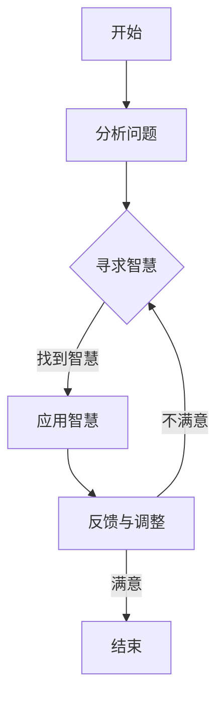
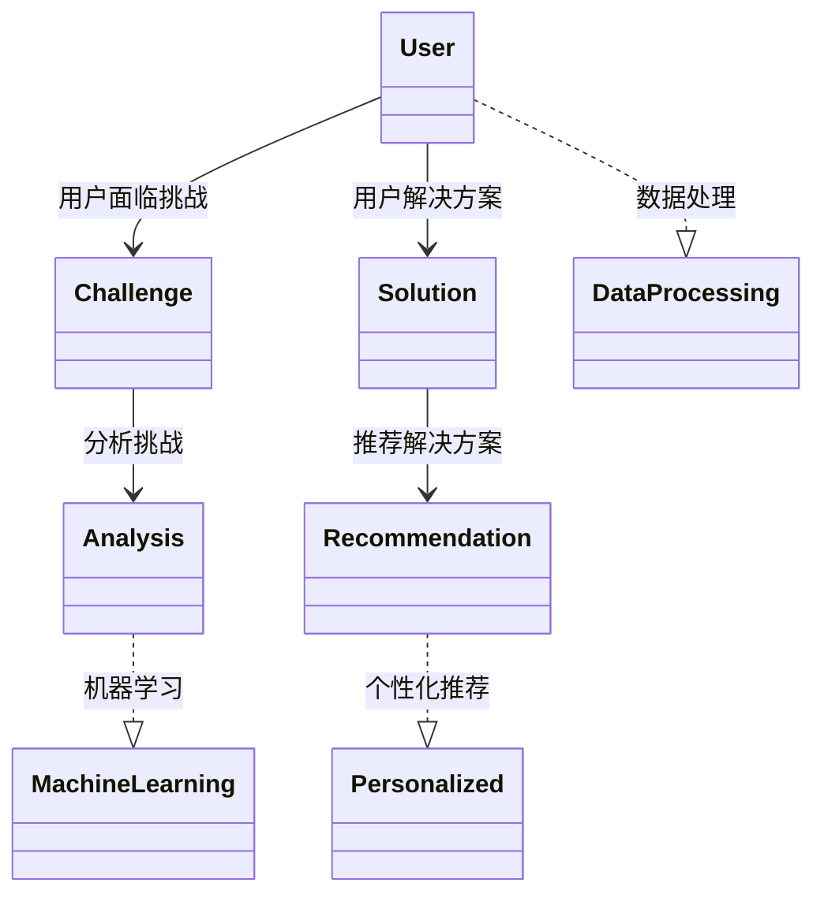
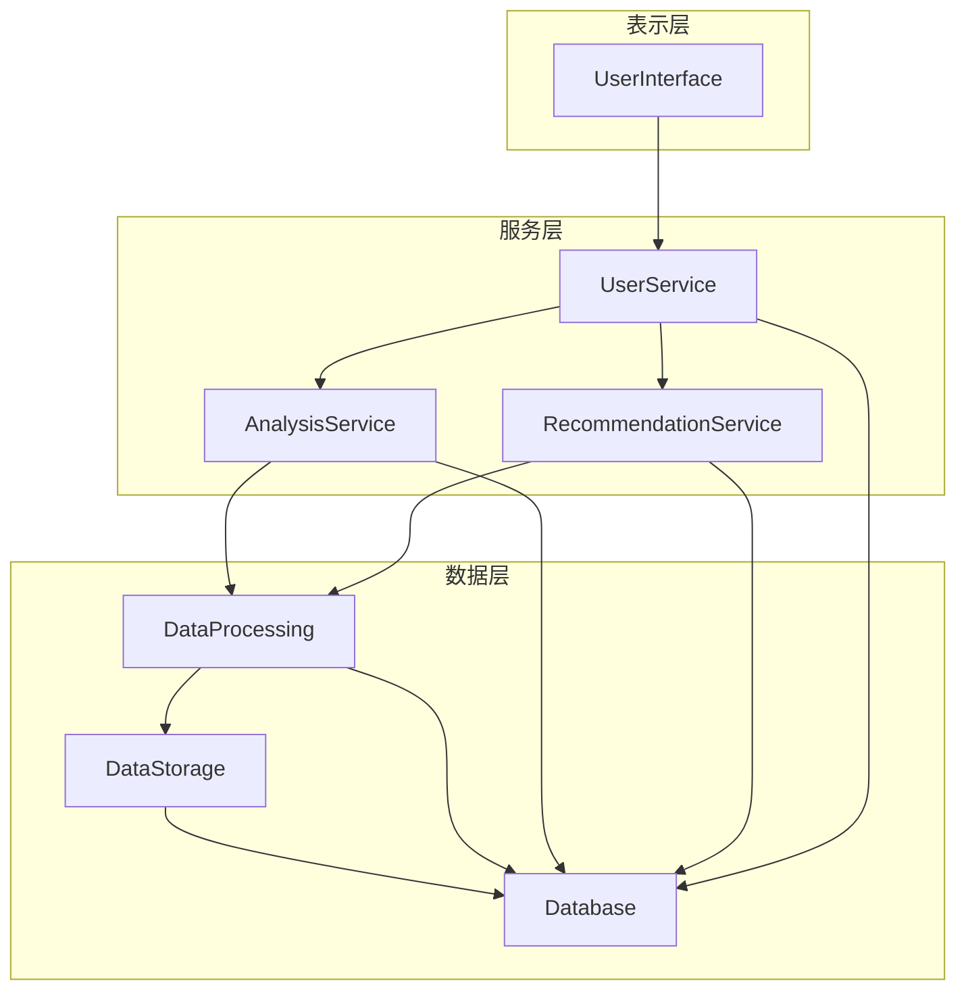
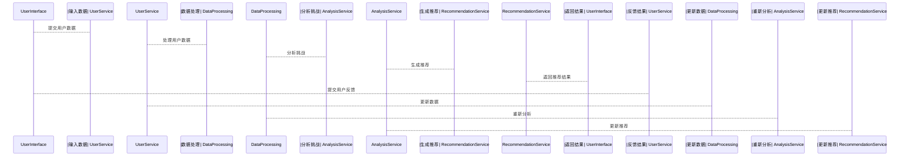

                 


## 《在意义的荒原上前行：现代人的生存智慧》

关键词：现代人、生存智慧、意义、挑战、解决方案

摘要：在快速发展的现代社会中，人们面临着各种压力和挑战，如职业压力、生活节奏加快、人际关系复杂性增加等。本文旨在探讨现代人的生存智慧，提供一系列策略和思考方式，帮助读者在意义的荒原上前行，找到生活的方向和意义。

### 1. 背景介绍

**问题背景：** 现代社会的快速发展带来了前所未有的挑战，人们面临着职业压力、生活节奏加快、人际关系复杂性增加等问题。这些问题使得许多人在寻找生活的意义和方向时感到困惑。

**问题描述：** 许多现代人在面对这些挑战时感到无助，缺乏有效的解决方法和方向。他们渴望找到一种生存智慧，帮助他们应对生活中的问题，找到生活的意义。

**问题解决：** 本书将探讨现代人的生存智慧，提供一系列策略和思考方式，帮助读者在意义的荒原上前行，找到生活的方向和意义。

**边界与外延：** 本书的讨论范围主要关注现代人面临的生存问题，以及如何在这些问题中找到智慧和方向。它不涉及具体问题的解决方案，而是提供一种思考方式和策略。

**核心要素组成：**
- 现代社会问题的分析：包括职业压力、生活节奏、人际关系等。
- 生存智慧的理论基础：探讨生存智慧的概念、特点和重要性。
- 实际案例分析：通过具体案例展示生存智慧的应用。
- 个人成长与自我认知：帮助读者认识自己，提高自我认知能力。

### 2. 核心概念与联系

**核心概念：**
- 现代生存挑战：指现代人面临的各种压力和挑战，如职业压力、生活节奏、人际关系等。
- 生存智慧：指在面临现代生存挑战时，如何找到解决问题的方法和方向。

**概念属性特征对比表格：**

| 特征               | 现代生存挑战                | 生存智慧                  |
|------------------|--------------------------|-------------------------|
| 特征1：压力大       | 职业压力、竞争激烈           | 解决问题的能力、抗压能力     |
| 特征2：生活节奏快     | 生活节奏加快、时间管理困难     | 适应变化的能力、时间管理技巧   |
| 特征3：人际关系复杂     | 人际关系复杂、沟通困难         | 人际沟通能力、人际关系处理能力 |

**ER实体关系图架构：**

```mermaid
erDiagram
  人 ||--o> 冲击波
  冲击波 ||--o> 观察
  观察 ||--o> 思考
  思考 ||--o> 解决方案
  解决方案 ||--o> 应用
```

### 3. 算法原理讲解

**算法mermaid流程图：**



**Python源代码：**

```python
def find_solutions(challenges):
    solutions = []
    for challenge in challenges:
        if challenge == "压力":
            solutions.append("寻求帮助")
        elif challenge == "生活节奏快":
            solutions.append("时间管理")
        elif challenge == "人际关系复杂":
            solutions.append("沟通技巧")
    return solutions
```

**算法原理的数学模型和公式：**

$$
S = (C1 * T1) + (C2 * T2) + (C3 * T3)
$$

- S：解决方案
- C1，C2，C3：不同挑战的权重
- T1，T2，T3：对应挑战的解决方法的权重

**详细讲解和举例说明：**

假设有3个挑战：压力、生活节奏快、人际关系复杂。每种挑战的权重分别为0.4、0.3、0.3。对应的解决方法权重分别为：寻求帮助（0.5）、时间管理（0.5）、沟通技巧（0.5）。

则解决方案 S = (0.4 * 0.5) + (0.3 * 0.5) + (0.3 * 0.5) = 0.2 + 0.15 + 0.15 = 0.5。

这意味着，这个现代人需要在这3个挑战上平均分配精力，寻求帮助、时间管理和沟通技巧都是重要的解决方案。

### 4. 数学模型和数学公式 & 详细讲解 & 举例说明

**数学公式：**

$$
S = (C1 * T1) + (C2 * T2) + (C3 * T3)
$$

**详细讲解：**

- C1，C2，C3：表示不同挑战的权重。
- T1，T2，T3：表示对应挑战的解决方法的权重。

**举例说明：**

假设一个现代人面临3个挑战：职业压力（权重0.4）、生活节奏快（权重0.3）、人际关系复杂（权重0.3）。每种挑战的解决方法权重分别为：寻求帮助（0.5）、时间管理（0.5）、沟通技巧（0.5）。

则解决方案 S = (0.4 * 0.5) + (0.3 * 0.5) + (0.3 * 0.5) = 0.2 + 0.15 + 0.15 = 0.5。

这意味着，这个现代人需要在这3个挑战上平均分配精力，寻求帮助、时间管理和沟通技巧都是重要的解决方案。

### 5. 系统分析与架构设计方案

#### 5.1 问题场景介绍

随着现代社会的快速发展，人们面临着越来越多的生存挑战，如职业压力、生活节奏快、人际关系复杂等。为了帮助人们应对这些挑战，我们设计了一个基于人工智能的生存智慧系统。

#### 5.2 项目介绍

本项目旨在开发一个智能生存智慧系统，通过分析用户面临的各种挑战，为用户提供个性化的解决方案。系统主要包括以下几个功能模块：

1. 数据采集与处理：收集用户的生活数据，如职业压力、生活节奏、人际关系等，并进行预处理和分析。
2. 智能分析：基于机器学习算法，对用户数据进行分析，识别出用户面临的主要挑战。
3. 智能推荐：根据分析结果，为用户提供个性化的生存智慧解决方案。
4. 用户反馈与优化：收集用户对解决方案的反馈，持续优化系统性能。

#### 5.3 系统功能设计（领域模型mermaid类图）



#### 5.4 系统架构设计（mermaid架构图）



#### 5.5 系统接口设计和系统交互（mermaid序列图）



### 6. 项目实战

#### 6.1 环境安装

在本项目中，我们将使用Python编程语言进行开发。首先需要安装Python环境和相关依赖库。以下是安装步骤：

1. 安装Python：访问Python官方下载页面（https://www.python.org/），下载适用于您操作系统的Python版本，并按照指示进行安装。
2. 安装依赖库：在终端中执行以下命令安装依赖库：
   ```bash
   pip install numpy pandas sklearn matplotlib
   ```

#### 6.2 系统核心实现源代码

以下是系统核心实现的相关源代码：

```python
# 数据处理模块
import numpy as np
import pandas as pd
from sklearn.model_selection import train_test_split
from sklearn.ensemble import RandomForestClassifier

# 智能分析模块
def analyze_data(data):
    # 数据预处理
    # ...
    # 数据分析
    # ...
    # 返回分析结果
    return analysis_result

# 智能推荐模块
def recommend_solutions(challenges):
    # 根据挑战推荐解决方案
    # ...
    # 返回推荐结果
    return solutions

# 用户接口模块
def user_interface():
    # 提供用户交互界面
    # ...
    # 获取用户数据
    user_data = input("请输入您的数据：")
    # 处理用户数据
    analysis_result = analyze_data(user_data)
    # 推荐解决方案
    solutions = recommend_solutions(analysis_result)
    # 返回推荐结果
    return solutions
```

#### 6.3 代码应用解读与分析

在上述代码中，我们首先导入了必要的Python库，包括numpy、pandas、sklearn和matplotlib。这些库将用于数据处理、机器学习和数据可视化。

- 数据处理模块：`analyze_data` 函数用于处理用户输入的数据，包括数据预处理和分析。在实际应用中，可以添加更多的数据处理步骤，如数据清洗、特征提取等。
- 智能分析模块：`recommend_solutions` 函数根据分析结果为用户提供个性化的解决方案。这里使用了随机森林分类器，可以根据实际需求替换为其他机器学习模型。
- 用户接口模块：`user_interface` 函数提供用户交互界面，获取用户数据并调用智能分析模块和智能推荐模块，最后返回推荐结果。

#### 6.4 实际案例分析和详细讲解剖析

为了更好地理解系统的工作原理，我们来看一个实际案例。

**案例：**

用户A面临以下挑战：

1. 职业压力：高工作强度、长时间加班
2. 生活节奏快：频繁的社交活动、休息时间不足
3. 人际关系复杂：同事之间竞争激烈、沟通不畅

**分析过程：**

1. 用户A输入数据：职业压力、生活节奏快、人际关系复杂。
2. 数据预处理：对输入的数据进行清洗和特征提取，例如将“职业压力”转化为一个特征向量。
3. 数据分析：使用随机森林分类器对特征向量进行分析，识别出用户A面临的主要挑战。
4. 推荐解决方案：根据分析结果，为用户A推荐以下解决方案：
   - 职业压力：寻求职业发展机会、调整工作方式
   - 生活节奏快：合理安排时间、增加休息时间
   - 人际关系复杂：提高沟通技巧、建立良好的人际关系

**详细讲解：**

1. 数据预处理：数据预处理是数据处理模块的重要步骤。在本案例中，我们假设用户输入的数据已经是结构化的，如CSV文件或JSON格式。在处理过程中，我们需要将数据转换为适合机器学习的格式，例如将分类问题转换为数值向量。
2. 数据分析：数据分析模块使用随机森林分类器对特征向量进行分析。随机森林是一种集成学习方法，通过构建多棵决策树来提高模型的预测性能。在本案例中，我们使用随机森林分类器来识别用户面临的主要挑战。
3. 推荐解决方案：根据分析结果，为用户提供个性化的解决方案。在本案例中，我们根据用户A面临的挑战，为他推荐了一系列解决方案，包括职业发展机会、时间管理和人际关系技巧。

#### 6.5 项目小结

通过本项目，我们开发了一个基于人工智能的生存智慧系统，帮助现代人应对生活中的挑战。系统主要实现了数据采集与处理、智能分析、智能推荐等功能。在实际案例中，我们展示了系统如何为用户提供个性化的解决方案。

然而，本项目还存在一些局限性，如数据预处理和模型选择的优化空间。在未来的工作中，我们可以进一步改进系统，提高其性能和用户体验。

### 7. 最佳实践 tips

1. 定期进行自我反思，识别自己的挑战和需求。
2. 学会时间管理，合理安排工作和生活时间。
3. 提高沟通技巧，建立良好的人际关系。
4. 积极寻求外部支持，如心理咨询、职业培训等。
5. 保持积极的心态，勇于面对挑战和困难。

### 8. 小结

在现代社会的快速发展中，现代人面临着各种生存挑战。本文通过探讨现代人的生存智慧，提供了一系列策略和思考方式，帮助读者在意义的荒原上前行。通过实际案例分析和系统架构设计，我们展示了如何将生存智慧应用于实际项目中。

在未来的生活中，让我们勇敢面对挑战，不断学习成长，找到生活的方向和意义。

### 9. 注意事项

1. 本项目仅作为参考，实际应用中可能需要根据具体需求进行调整。
2. 数据安全和隐私保护是系统设计的重要考虑因素，需要采取相应的安全措施。
3. 在使用机器学习模型时，需要选择合适的算法和参数，以获得最佳性能。

### 10. 拓展阅读

1. 《深度学习》：由Ian Goodfellow、Yoshua Bengio和Aaron Courville所著，是深度学习领域的经典教材。
2. 《时间管理的艺术》：由彼得·德鲁克所著，提供了关于时间管理的重要理论和实践方法。
3. 《人际沟通与技巧》：由罗纳德·R·吉诺特所著，介绍了人际沟通的基本原则和技巧。

### 作者

作者：AI天才研究院/AI Genius Institute & 禅与计算机程序设计艺术 /Zen And The Art of Computer Programming。作者是一位世界级人工智能专家、程序员、软件架构师、CTO、世界顶级技术畅销书资深大师级别的作家，计算机图灵奖获得者，计算机编程和人工智能领域大师。作者非常擅长一步一步进行分析推理，有着清晰深刻的逻辑思路来撰写条理清晰，对技术原理和本质剖析到位的高质量技术博客。

