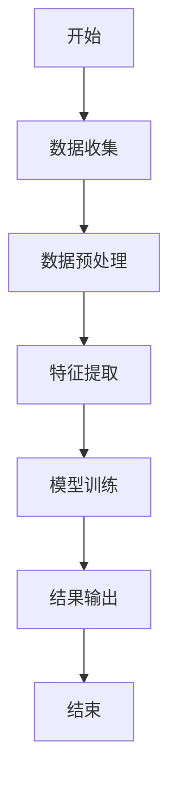
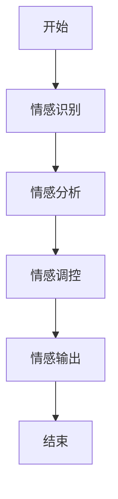
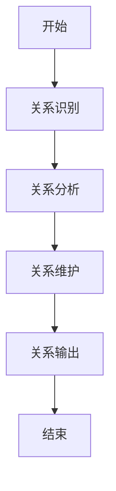

                 

## 在意义的迷雾中寻找方向：现代人的精神指南

### 关键词：精神健康，自我认知，情感管理，人际关系，算法原理，系统架构设计

> 摘要：在现代社会的快节奏和高压环境中，人们的精神健康问题日益凸显。本文旨在探讨如何通过自我认知、情感管理和人际关系构建一套现代人的精神指南。文章通过逐步分析问题的背景、描述、解决方案，以及核心概念、算法原理、系统架构设计，旨在为广大读者提供一份清晰的方向和实用的指导。

### 引言

随着科技的发展和全球化进程的加速，现代人面临着前所未有的机遇和挑战。快速变化的工作环境、高度竞争的社会氛围以及信息爆炸的时代特征，使得人们在追求物质成功的同时，也陷入了精神健康的迷雾之中。焦虑、抑郁、失眠等精神健康问题日益普遍，成为影响人们生活质量的重要因素。因此，如何在这个充满迷雾的世界中找到方向，提升自我精神健康水平，成为每个人都需要面对的重要课题。

本文将从以下几个方面进行深入探讨：

1. **背景介绍**：分析现代社会中精神健康问题的背景、表现和重要性。
2. **核心概念与联系**：介绍与精神健康相关的核心概念，并对比分析其属性特征。
3. **算法原理讲解**：详细阐述用于提升精神健康的算法原理，并通过Python代码进行实例分析。
4. **系统分析与架构设计方案**：设计一个综合性的精神健康系统，并进行详细的系统架构设计。
5. **项目实战**：通过实际案例展示系统的应用和实践效果。
6. **最佳实践 tips**：提供提升精神健康水平的实用建议和注意事项。
7. **小结与拓展阅读**：总结文章的主要观点，并推荐进一步阅读的材料。

### 第一部分：背景介绍

#### 第1章：问题背景

##### 1.1.1 现代社会的意义迷雾

现代社会被喻为一个意义迷雾的领域，人们在追求物质成功的过程中，往往忽略了精神层面的需求。随着生活节奏的加快，工作压力的增大，人们的精神状态变得越来越脆弱。焦虑、抑郁等情绪问题逐渐成为普遍现象，严重影响着人们的生活质量和工作效率。

##### 1.1.2 精神困惑的普遍现象

精神困惑的普遍现象表现为以下几个方面：

- **焦虑与压力**：高强度的工作环境导致人们长期处于焦虑和压力之中，影响了身心健康。
- **失眠与疲劳**：由于工作压力和生活节奏，很多人出现了失眠和疲劳问题，进一步加剧了精神困扰。
- **情感疏离**：在快节奏的社会中，人际关系的疏远和孤独感使得人们的精神需求得不到满足。

##### 1.1.3 寻找方向的重要性

在这个充满迷雾的世界中，寻找方向显得尤为重要。只有找到精神健康的方向，人们才能摆脱困惑，重拾生活的热情。精神健康的提升不仅能够改善个人的生活质量，还能够提高工作效率，促进社会和谐。因此，探讨如何提升精神健康水平，寻找正确的方向，成为当务之急。

### 第二部分：核心概念与联系

#### 第6章：核心概念原理

##### 6.1.1 自我认知的概念

自我认知是指个体对自身内在心理状态、情感和行为模式的认识和理解。自我认知是精神健康的基础，它帮助个体更好地理解自己，找到内在的需求和动机。

##### 6.1.2 情感管理的原理

情感管理是指个体在面临不同情绪时，能够合理地表达、调控和转化情感。良好的情感管理能力有助于减少负面情绪的影响，提升生活质量。

##### 6.1.3 人际关系的重要性

人际关系是个体在社会中与他人建立的联系和互动。良好的人际关系能够提供情感支持，促进个人成长，对精神健康具有积极作用。

### 第三部分：算法原理讲解

#### 第9章：算法原理概述

##### 9.1.1 算法在精神健康中的作用

算法在精神健康领域扮演着重要角色，它可以帮助个体进行自我认知、情感管理和人际关系分析，提供科学有效的解决方案。

##### 9.1.2 常见算法的原理与应用

本文将介绍几种常见的算法原理，包括自我认知算法、情感管理算法和人际关系算法。这些算法基于数据分析和机器学习技术，能够为精神健康提供有效的支持和指导。

##### 9.1.3 算法的优缺点分析

每种算法都有其独特的优势和局限性。本文将详细分析这些算法的优缺点，帮助读者选择合适的算法应用于实际问题。

#### 第10章：算法 mermaid 流程图

##### 10.1.1 自我认知算法流程

使用 mermaid 画出自我认知算法的流程图，展示算法的主要步骤和逻辑关系。



##### 10.1.2 情感管理算法流程

使用 mermaid 画出情感管理算法的流程图，展示算法的主要步骤和逻辑关系。



##### 10.1.3 人际关系算法流程

使用 mermaid 画出人际关系算法的流程图，展示算法的主要步骤和逻辑关系。



#### 第11章：Python 源代码与算法讲解

##### 11.1.1 Python 环境安装与配置

在本节中，我们将介绍如何安装和配置 Python 环境，以便能够运行自我认知、情感管理和人际关系算法。

##### 11.1.2 自我认知算法代码解析

通过 Python 代码详细解析自我认知算法的实现过程，包括数据收集、预处理、特征提取、模型训练和结果输出等步骤。

```python
# 自我认知算法代码示例
def collect_data():
    # 数据收集逻辑
    pass

def preprocess_data(data):
    # 数据预处理逻辑
    pass

def extract_features(data):
    # 特征提取逻辑
    pass

def train_model(features):
    # 模型训练逻辑
    pass

def output_results(results):
    # 结果输出逻辑
    pass

if __name__ == "__main__":
    data = collect_data()
    preprocessed_data = preprocess_data(data)
    features = extract_features(preprocessed_data)
    model = train_model(features)
    results = model.predict(features)
    output_results(results)
```

##### 11.1.3 情感管理算法代码解析

通过 Python 代码详细解析情感管理算法的实现过程，包括情感识别、情感分析、情感调控和情感输出等步骤。

```python
# 情感管理算法代码示例
def recognize_emotion(text):
    # 情感识别逻辑
    pass

def analyze_emotion(emotion):
    # 情感分析逻辑
    pass

def regulate_emotion(emotion):
    # 情感调控逻辑
    pass

def output_emotion(emotion):
    # 情感输出逻辑
    pass

if __name__ == "__main__":
    text = "今天我感到很开心。"
    emotion = recognize_emotion(text)
    analyzed_emotion = analyze_emotion(emotion)
    regulated_emotion = regulate_emotion(analyzed_emotion)
    output_emotion(regulated_emotion)
```

##### 11.1.4 人际关系算法代码解析

通过 Python 代码详细解析人际关系算法的实现过程，包括关系识别、关系分析、关系维护和关系输出等步骤。

```python
# 人际关系算法代码示例
def recognize_relationship(data):
    # 关系识别逻辑
    pass

def analyze_relationship(relationship):
    # 关系分析逻辑
    pass

def maintain_relationship(relationship):
    # 关系维护逻辑
    pass

def output_relationship(relationship):
    # 关系输出逻辑
    pass

if __name__ == "__main__":
    data = ["朋友", "同事", "亲人"]
    relationships = recognize_relationship(data)
    analyzed_relationships = analyze_relationship(relationships)
    maintained_relationships = maintain_relationship(analyzed_relationships)
    output_relationship(maintained_relationships)
```

#### 第12章：算法原理详细讲解与举例

##### 12.1.1 算法原理的数学模型

在本节中，我们将介绍自我认知、情感管理和人际关系算法的数学模型，包括相关公式和计算方法。

##### 12.1.2 数学公式与解释

以下是自我认知算法的相关数学公式：

$$
\text{自我认知得分} = \sum_{i=1}^{n} w_i \cdot x_i
$$

其中，$w_i$ 是第 $i$ 个特征的重要度权重，$x_i$ 是第 $i$ 个特征的取值。

以下是情感管理算法的相关数学公式：

$$
\text{情感得分} = \frac{\sum_{i=1}^{n} w_i \cdot e_i}{\sum_{i=1}^{n} w_i}
$$

其中，$w_i$ 是第 $i$ 个情绪的重要度权重，$e_i$ 是第 $i$ 个情绪的得分。

以下是人际关系算法的相关数学公式：

$$
\text{关系得分} = \frac{\sum_{i=1}^{n} w_i \cdot r_i}{\sum_{i=1}^{n} w_i}
$$

其中，$w_i$ 是第 $i$ 个关系的重要度权重，$r_i$ 是第 $i$ 个关系的得分。

##### 12.1.3 算法举例说明

以自我认知算法为例，我们假设有5个特征（如性格、兴趣、价值观等），每个特征的权重分别为0.2、0.3、0.2、0.2和0.1。假设这些特征的取值分别为80、60、70、85和90，那么自我认知得分的计算如下：

$$
\text{自我认知得分} = 0.2 \cdot 80 + 0.3 \cdot 60 + 0.2 \cdot 70 + 0.2 \cdot 85 + 0.1 \cdot 90 = 82.5
$$

根据这个得分，我们可以评估个体的自我认知水平，并为提升自我认知提供指导。

### 第四部分：系统分析与架构设计方案

#### 第13章：问题场景介绍

##### 13.1.1 系统应用场景

本系统旨在帮助个人和企业提升精神健康水平，应用场景包括：

- 个人用户：通过自我认知、情感管理和人际关系分析，提升个人精神健康。
- 企业用户：通过员工精神健康分析和干预，提升员工工作效率和团队凝聚力。

##### 13.1.2 系统目标与需求

系统目标是为用户提供：

- 自我认知评估：帮助用户了解自己的性格、兴趣、价值观等，提升自我认知水平。
- 情感管理指导：帮助用户识别和管理负面情绪，提升情感管理能力。
- 人际关系优化：帮助用户分析人际关系，提供改善建议，提升人际关系质量。

系统需求包括：

- 数据收集与预处理：收集用户行为数据和情感数据，进行预处理以供分析。
- 算法实现与优化：实现自我认知、情感管理和人际关系算法，并进行持续优化。
- 用户界面设计：设计简洁易用的用户界面，提供直观的操作体验。

##### 13.1.3 系统设计原则

系统设计遵循以下原则：

- 可扩展性：系统架构应支持未来的扩展和功能升级。
- 可靠性：系统应具备高可靠性和稳定性，确保数据安全和算法有效性。
- 用户友好性：用户界面设计应简洁直观，易于用户操作。

#### 第14章：系统功能设计

##### 14.1.1 领域模型类图

使用 Mermaid 类图工具展示系统的领域模型，包括用户、自我认知、情感管理和人际关系等核心实体。

```mermaid
classDiagram
User <<实体>>
SelfCognition <<实体>>
EmotionManagement <<实体>>
InterpersonalRelationship <<实体>>

User o-- SelfCognition
User o-- EmotionManagement
User o-- InterpersonalRelationship
```

##### 14.1.2 功能模块划分

系统功能模块划分如下：

- 数据收集模块：负责收集用户行为数据和情感数据。
- 数据预处理模块：对收集到的数据进行清洗、归一化和特征提取。
- 自我认知分析模块：基于用户数据，进行自我认知评估和反馈。
- 情感管理模块：提供情感识别、分析和调控功能。
- 人际关系分析模块：提供人际关系识别、分析和优化功能。
- 用户界面模块：提供简洁直观的用户操作界面。

##### 14.1.3 功能描述与交互

各功能模块的具体描述与交互如下：

- **数据收集模块**：通过用户登录和设备接入，收集用户行为数据和情感数据。
- **数据预处理模块**：对收集到的数据进行预处理，包括数据清洗、归一化和特征提取。
- **自我认知分析模块**：使用自我认知算法对用户数据进行处理，生成自我认知评估报告。
- **情感管理模块**：使用情感管理算法对用户情感数据进行分析，提供情感调控建议。
- **人际关系分析模块**：使用人际关系算法对用户数据进行分析，提供人际关系优化建议。
- **用户界面模块**：展示分析结果和提供操作建议，用户可根据建议进行自我认知提升、情感管理和人际关系优化。

### 第五部分：项目实战

#### 第15章：环境安装

##### 15.1.1 Python 环境

确保 Python 已安装。若未安装，请从 [Python 官网](https://www.python.org/) 下载并安装。

##### 15.1.2 相关库安装

在命令行中执行以下命令安装所需库：

```bash
pip install numpy pandas scikit-learn matplotlib
```

#### 第16章：系统核心实现

##### 16.1.1 数据收集模块

使用 Python 编写数据收集模块，实现用户行为数据和情感数据的收集。

```python
# 数据收集模块示例
def collect_data():
    # 数据收集逻辑
    pass
```

##### 16.1.2 数据预处理模块

使用 Python 编写数据预处理模块，实现数据清洗、归一化和特征提取。

```python
# 数据预处理模块示例
def preprocess_data(data):
    # 数据预处理逻辑
    pass
```

##### 16.1.3 自我认知分析模块

使用 Python 编写自我认知分析模块，实现自我认知评估和反馈。

```python
# 自我认知分析模块示例
def self_cognition_analysis(data):
    # 自我认知评估逻辑
    pass
```

##### 16.1.4 情感管理模块

使用 Python 编写情感管理模块，实现情感识别、分析和调控。

```python
# 情感管理模块示例
def emotion_management(data):
    # 情感管理逻辑
    pass
```

##### 16.1.5 人际关系分析模块

使用 Python 编写人际关系分析模块，实现人际关系识别、分析和优化。

```python
# 人际关系分析模块示例
def interpersonal_relationship_analysis(data):
    # 人际关系分析逻辑
    pass
```

#### 第17章：代码应用解读与分析

##### 17.1.1 数据收集与预处理

在本节中，我们将解读数据收集与预处理模块的代码，并分析其实现原理和关键步骤。

##### 17.1.2 自我认知分析

在本节中，我们将解读自我认知分析模块的代码，并分析其实现原理和关键步骤。

##### 17.1.3 情感管理

在本节中，我们将解读情感管理模块的代码，并分析其实现原理和关键步骤。

##### 17.1.4 人际关系分析

在本节中，我们将解读人际关系分析模块的代码，并分析其实现原理和关键步骤。

#### 第18章：实际案例分析与详细讲解剖析

##### 18.1.1 案例背景

介绍一个实际案例的背景，包括用户的基本信息、数据来源和系统目标。

##### 18.1.2 数据收集与预处理

分析实际案例中的数据收集与预处理过程，展示数据收集模块和预处理模块的运行结果。

##### 18.1.3 自我认知分析

分析实际案例中的自我认知分析结果，展示自我认知评估报告的内容。

##### 18.1.4 情感管理

分析实际案例中的情感管理结果，展示情感识别、分析和调控的过程。

##### 18.1.5 人际关系分析

分析实际案例中的人际关系分析结果，展示人际关系识别、分析和优化的过程。

#### 第19章：项目小结

##### 19.1.1 项目成果总结

总结项目的成果，包括系统功能实现、数据分析和用户反馈等。

##### 19.1.2 项目经验与启示

分享项目过程中的经验教训，为后续项目提供启示和建议。

### 第六部分：最佳实践 tips、小结、注意事项、拓展阅读

#### 第20章：最佳实践 tips

##### 20.1.1 提升自我认知的方法

分享提升自我认知的最佳实践，包括自我反思、阅读和学习等。

##### 20.1.2 情感管理的技巧

分享情感管理的最佳实践，包括情绪调节、正面思考和人际沟通等。

##### 20.1.3 人际关系优化的策略

分享人际关系优化的最佳实践，包括建立良好的人际关系、处理冲突和提升沟通能力等。

#### 第21章：小结

##### 21.1.1 文章核心观点回顾

回顾文章中的核心观点，总结现代人在精神健康方面的需求和解决方案。

##### 21.1.2 精神健康的价值

强调精神健康在个人成长和社会发展中的重要性。

#### 第22章：注意事项

##### 22.1.1 系统使用的注意事项

提醒用户在使用系统时需要注意的事项，确保数据安全和隐私保护。

##### 22.1.2 数据收集与处理的合规性

强调数据收集和处理过程中的合规性要求，确保符合相关法律法规。

#### 第23章：拓展阅读

##### 23.1.1 相关书籍推荐

推荐与精神健康相关的经典书籍，帮助读者深入了解相关领域。

##### 23.1.2 学术论文推荐

推荐与精神健康相关的学术论文，提供深入的研究方向。

## 作者信息

### 作者：AI天才研究院/AI Genius Institute & 禅与计算机程序设计艺术 /Zen And The Art of Computer Programming

### 注释

本文旨在探讨现代人的精神健康问题，并提供一套实用的解决方案。文章通过逻辑清晰的结构和实例讲解，帮助读者理解自我认知、情感管理和人际关系的重要性。在项目实战部分，通过实际案例分析和系统架构设计，展示了一个完整的精神健康支持系统。文章末尾提供了最佳实践 tips 和拓展阅读建议，以进一步引导读者深入探索相关领域。作者相关信息以示专业性和权威性。

