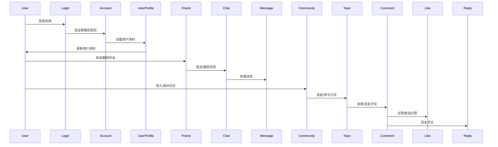
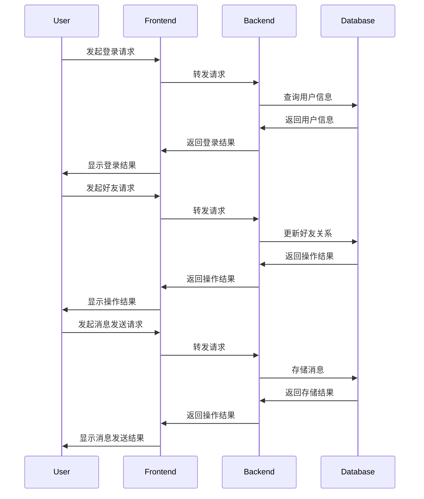

                 

# 在数字化浪潮中重塑人际关系：探索真实连接的新途径

## 关键词

- 数字化浪潮
- 人际关系
- 真实连接
- 社会变革
- 技术应用

## 摘要

本文旨在探讨数字化浪潮对人际关系的影响，以及如何在不断变化的社会环境中建立真实而深入的连接。随着技术的进步和互联网的普及，人际交往的方式发生了显著变化。本文将从背景、核心概念、算法原理等多角度入手，分析数字化浪潮对人际关系的影响，并提出重塑人际关系的策略。通过本文的探讨，希望能够为读者提供关于如何在数字化时代维护和提升人际关系的有益见解。

### 目录大纲

----------------------------------------------------------------

## 第一部分：问题背景

### 1.1 问题背景

#### 1.1.1 数字化浪潮中的社会变革

随着互联网、大数据、人工智能等技术的发展，数字化浪潮席卷全球，社会结构、经济模式、生活方式等方面都发生了深刻变革。数字化不仅改变了人们的日常行为，也影响着人际关系。

#### 1.1.2 人际关系的重要性

人际关系是人类社会中不可或缺的一部分。良好的人际关系有助于心理健康、职业发展和社会稳定。然而，在数字化浪潮的冲击下，人际关系面临着新的挑战。

#### 1.1.3 数字化对人际关系的影响

数字化带来了信息传递的高效和便捷，但同时也可能导致人际关系的疏离和浅薄。如何在这种背景下建立真实而深入的连接成为了一个亟待解决的问题。

### 1.2 核心概念

#### 1.2.1 数字化浪潮

数字化浪潮是指信息技术在各个领域的广泛应用，特别是互联网和移动通信技术的快速发展。

#### 1.2.2 人际关系

人际关系是指人与人之间的相互联系和相互作用，包括亲情、友情、爱情等。

#### 1.2.3 真实连接

真实连接是指建立在真诚、信任和理解基础上的深刻人际关系。

### 1.3 边界与外延

#### 1.3.1 数字化浪潮的范畴

数字化浪潮涵盖了从个人生活到企业运作的方方面面，包括但不限于电子商务、在线教育、远程办公等。

#### 1.3.2 人际关系的内涵

人际关系的内涵包括情感、认知和行为等多个层面，是复杂的社会现象。

#### 1.3.3 真实连接的特点

真实连接具有深度、持久性和亲密性等特点，不同于传统的表面社交。

### 1.4 概念结构与核心要素组成

#### 1.4.1 数字化浪潮的核心要素

数字化浪潮的核心要素包括信息技术、网络基础设施、数据资源等。

#### 1.4.2 人际关系的基本构成

人际关系的基本构成包括情感、认知和行为三个方面。

#### 1.4.3 真实连接的实现路径

真实连接的实现路径包括增强沟通、建立信任、深化理解等。

### 1.5 本章小结

本章通过介绍数字化浪潮、人际关系和真实连接的概念，为后续的分析和讨论奠定了基础。在接下来的章节中，我们将进一步探讨数字化浪潮对人际关系的影响，以及如何通过技术手段重塑真实连接。

## 第二部分：核心概念与联系

### 2.1 数字化浪潮

#### 2.1.1 数字化浪潮的定义与特征

数字化浪潮是指信息技术在各个领域的广泛应用，特别是互联网和移动通信技术的快速发展。其主要特征包括：

1. **信息传递的高效和便捷**：数字化技术使得信息传递变得更加快速和方便。
2. **数据的爆炸性增长**：大数据技术使得海量数据的收集、存储和分析成为可能。
3. **跨界融合**：数字化浪潮促使不同领域的技术和业务相互融合，产生新的商业模式和产业形态。

#### 2.1.2 数字化浪潮的影响与挑战

数字化浪潮对社会产生了深远的影响，同时也带来了挑战：

1. **社会结构的变化**：数字化浪潮导致社会结构、经济模式、生活方式等方面发生深刻变革。
2. **信息过载**：数字化使得信息爆炸性增长，人们面临着信息过载的问题。
3. **隐私和安全问题**：数字化技术的广泛应用也带来了隐私和安全问题。

#### 2.1.3 数字化浪潮下的社会变革

数字化浪潮下的社会变革主要体现在以下几个方面：

1. **远程办公和在线教育**：数字化技术使得远程办公和在线教育成为可能，改变了传统的工作和学习模式。
2. **电子商务的兴起**：数字化技术推动了电子商务的快速发展，改变了人们的购物习惯。
3. **数字货币的普及**：数字货币的普及改变了传统的货币体系和交易模式。

### 2.2 人际关系

#### 2.2.1 人际关系的定义与类型

人际关系是指人与人之间的相互联系和相互作用，包括亲情、友情、爱情等。根据不同的分类标准，人际关系可以划分为多种类型：

1. **亲情关系**：基于血缘关系形成的人际关系，如父母与子女、兄弟姐妹等。
2. **友情关系**：基于共同兴趣、价值观或经历形成的人际关系。
3. **爱情关系**：基于情感和性吸引形成的人际关系，如恋人、夫妻等。

#### 2.2.2 人际关系的重要性与影响

人际关系对个体和社会都具有重要的意义：

1. **心理健康**：良好的人际关系有助于缓解压力、提高幸福感。
2. **职业发展**：人际关系对职业发展具有重要影响，良好的职业关系有助于职业晋升和事业成功。
3. **社会稳定**：人际关系是维持社会秩序和稳定的重要因素。

#### 2.2.3 人际关系的管理与维护

有效管理人际关系对个人和社会都是有益的。以下是一些管理人际关系的策略：

1. **建立信任**：信任是人际关系的基础，通过诚实、透明和负责任的行为建立信任。
2. **有效沟通**：良好的沟通技巧有助于解决冲突、增进理解。
3. **时间管理**：合理安排时间和精力，确保与重要的人际关系保持联系。

### 2.3 真实连接

#### 2.3.1 真实连接的定义与特征

真实连接是指建立在真诚、信任和理解基础上的深刻人际关系。其特征包括：

1. **深度**：真实连接不仅停留在表面，而是深入到彼此的内心世界。
2. **持久性**：真实连接能够经受时间的考验，长期保持稳定。
3. **亲密性**：真实连接具有强烈的情感亲密性，使人感受到深深的归属感。

#### 2.3.2 真实连接的重要性与意义

真实连接对个人和社会都具有重要的意义：

1. **心理健康**：真实连接有助于提高个体的心理健康水平，缓解孤独和焦虑。
2. **社会和谐**：真实连接是建立和谐社会的基础，有助于减少冲突和矛盾。
3. **个体成长**：真实连接为个体提供支持和鼓励，有助于个人成长和发展。

#### 2.3.3 真实连接的实现策略

要建立真实连接，可以采取以下策略：

1. **增强沟通**：通过有效沟通，增进彼此的理解和信任。
2. **共同经历**：通过共同的经历和体验，加深彼此的感情。
3. **真诚付出**：通过真诚的付出和关心，赢得他人的信任和尊重。

### 2.4 概念属性特征对比

#### 2.4.1 数字化浪潮与人际关系的对比

| 对比项 | 数字化浪潮 | 人际关系 |
| --- | --- | --- |
| 定义 | 信息技术的广泛应用 | 人与人之间的相互联系和相互作用 |
| 特征 | 高效、便捷、跨界融合 | 深度、持久性、亲密性 |
| 影响 | 社会变革、信息过载、隐私安全 | 心理健康、职业发展、社会稳定 |
| 挑战 | 信息过载、隐私安全、技术依赖 | 真实连接的建立和维护 |
| 目标 | 推动社会进步、创新商业模式 | 建立和谐关系、促进个人成长 |

### 2.5 ER实体关系图架构

#### 2.5.1 数字化浪潮的ER实体关系图

```mermaid
erDiagram
  User ||--|{ Device } : has
  Device ||--|{ Application } : uses
  Application ||--|{ Data } : processes
  Data ||--|{ User } : generates
```

#### 2.5.2 人际关系的ER实体关系图

```mermaid
erDiagram
  Person ||--|{ Relationship } : has
  Relationship ||--|{ Communication } : based_on
  Communication ||--|{ Trust } : based_on
  Trust ||--|{ Support } : based_on
```

#### 2.5.3 真实连接的ER实体关系图

```mermaid
erDiagram
  PersonA ||--|{ Connection } : has_with PersonB
  Connection ||--|{ Communication } : based_on
  Connection ||--|{ Trust } : based_on
  Connection ||--|{ Understanding } : based_on
  Connection ||--|{ Commitment } : based_on
```

### 2.6 本章小结

本章通过对数字化浪潮、人际关系和真实连接的详细探讨，为我们理解这些概念及其相互关系提供了清晰的框架。在接下来的章节中，我们将进一步分析数字化浪潮对人际关系的影响，并探讨如何通过技术手段建立真实连接。

## 第三部分：算法原理讲解

### 3.1 算法概述

#### 3.1.1 算法的定义与作用

算法是指解决问题的一系列明确且可执行的步骤。在数字化浪潮中，算法扮演着至关重要的角色，其作用主要体现在以下几个方面：

1. **数据处理与分析**：算法能够高效地对海量数据进行分析和处理，揭示数据中的规律和趋势。
2. **决策支持**：算法为决策者提供科学的决策依据，帮助他们在复杂的环境中做出明智的选择。
3. **自动化与智能化**：算法能够实现自动化和智能化，提高工作效率和准确性。

#### 3.1.2 算法的基本原理

算法的基本原理可以分为以下几个方面：

1. **输入与输出**：算法的输入是问题相关的数据和参数，输出是解决问题的结果。
2. **逻辑与控制**：算法通过一系列逻辑判断和控制结构，逐步解决输入的问题。
3. **性能与优化**：算法的性能直接影响问题的解决效率，因此算法设计需要考虑性能优化。

#### 3.1.3 算法在数字化浪潮中的应用

算法在数字化浪潮中的应用广泛而深入，主要体现在以下几个方面：

1. **大数据分析**：算法能够对海量数据进行高效分析，发现数据中的价值。
2. **人工智能**：算法是人工智能的核心，通过机器学习、深度学习等算法，计算机能够模拟人类的思维和学习能力。
3. **自动化控制**：算法在自动化系统中发挥着重要作用，通过控制算法，系统能够实现自动化运行。

### 3.2 算法原理详细讲解

#### 3.2.1 算法原理的基础知识

算法原理的基础知识包括以下几个方面：

1. **数学模型**：算法通常基于数学模型，通过数学公式和计算方法解决问题。
2. **数据结构**：算法的有效性很大程度上取决于数据结构的设计，合适的
```<sop>
### 3.2.1 算法原理的基础知识

算法原理的基础知识包括以下几个方面：

1. **数学模型**：算法通常基于数学模型，通过数学公式和计算方法解决问题。常见的数学模型包括线性回归模型、逻辑回归模型、支持向量机模型等。

   线性回归模型的公式如下：
   $$
   y = \beta_0 + \beta_1x
   $$
   其中，$y$ 是因变量，$x$ 是自变量，$\beta_0$ 和 $\beta_1$ 是模型的参数。

2. **算法流程图**：算法的执行过程可以通过流程图来表示。以下是一个简单的算法流程图：

   ```mermaid
   graph TD
   A[开始] --> B[输入数据]
   B --> C[预处理数据]
   C --> D[模型训练]
   D --> E[模型评估]
   E --> F[结束]
   ```

3. **优化算法**：优化算法用于调整模型参数，以减少损失函数的值，从而提高模型的性能。常见的优化算法包括梯度下降法和随机梯度下降法。

   梯度下降法的公式如下：
   $$
   w_{t+1} = w_t - \alpha \nabla_w L(w_t)
   $$
   其中，$w_t$ 是当前模型的参数，$\alpha$ 是学习率，$L(w_t)$ 是损失函数。

#### 3.2.2 算法原理的数学模型与公式

1. **损失函数**：损失函数用于评估模型的预测结果与真实值之间的差距。常见的损失函数包括均方误差（MSE）和交叉熵损失（Cross-Entropy Loss）。

   均方误差的公式如下：
   $$
   L = \frac{1}{m}\sum_{i=1}^{m}(y_i - \hat{y_i})^2
   $$
   其中，$y_i$ 是真实值，$\hat{y_i}$ 是预测值，$m$ 是样本数量。

   交叉熵损失的公式如下：
   $$
   L = -\frac{1}{m}\sum_{i=1}^{m}y_i\log(\hat{y_i})+(1-y_i)\log(1-\hat{y_i})
   $$
   其中，$y_i$ 是真实值，$\hat{y_i}$ 是预测值，$m$ 是样本数量。

2. **优化算法**：优化算法用于迭代更新模型的参数，以减少损失函数的值。常见的优化算法包括梯度下降法和随机梯度下降法。

   梯度下降法的公式如下：
   $$
   w_{t+1} = w_t - \alpha \nabla_w L(w_t)
   $$
   其中，$w_t$ 是当前模型的参数，$\alpha$ 是学习率，$\nabla_w L(w_t)$ 是损失函数关于模型参数的梯度。

   随机梯度下降法的公式如下：
   $$
   w_{t+1} = w_t - \alpha \nabla_w L(w_t^*)
   $$
   其中，$w_t^*$ 是随机选取的样本的模型参数，$\alpha$ 是学习率，$\nabla_w L(w_t^*)$ 是损失函数关于模型参数的梯度。

### 3.3 通俗易懂的举例说明

#### 3.3.1 算法的实际应用

以线性回归模型为例，线性回归模型广泛应用于数据分析和预测。例如，在房价预测中，输入变量（如房屋面积、位置等）与输出变量（房价）之间存在线性关系。通过训练线性回归模型，可以预测未知房屋的价格。

#### 3.3.2 算法的工作原理

以梯度下降法为例，梯度下降法是一种优化算法，用于调整模型的参数，以减少损失函数的值。其工作原理如下：

1. 初始化模型参数。
2. 计算损失函数关于模型参数的梯度。
3. 根据梯度和学习率更新模型参数。
4. 重复步骤2和步骤3，直到满足停止条件（如损失函数值收敛）。

#### 3.3.3 算法的优势与局限性

1. **优势**：

   - **高效性**：算法能够快速收敛，高效地调整模型参数。
   - **适用性**：梯度下降法适用于多种优化问题，具有广泛的适用性。

2. **局限性**：

   - **局部最优**：梯度下降法容易陷入局部最优，无法找到全局最优解。
   - **学习率选择**：学习率的选择对算法的性能有很大影响，选择不当可能导致算法收敛缓慢。

### 3.4 本章小结

本章通过对算法原理的详细讲解，包括数学模型、优化算法以及实际应用，为读者提供了关于算法在数字化浪潮中的应用的深入理解。在接下来的章节中，我们将进一步探讨如何利用算法构建真实连接的数学模型，并通过具体实例进行详细分析。

## 第四部分：数学模型和数学公式 & 详细讲解 & 举例说明

### 4.1 数学模型概述

数学模型是现实世界问题的一种抽象表示，它通过数学语言来描述问题的结构、关系和规律。数学模型在各个领域都有广泛的应用，如自然科学、工程学、经济学和计算机科学等。数学模型的构建通常包括以下几个步骤：

1. **问题定义**：明确问题的目标、约束条件和变量。
2. **假设与简化**：根据问题的性质，进行合理的假设和简化，以便于数学处理。
3. **数学表达**：将问题转化为数学表达式，如方程、函数、不等式等。
4. **求解与验证**：使用数学方法求解模型，并通过实际数据或模拟验证模型的准确性和可行性。

### 4.2 详细讲解与举例说明

#### 4.2.1 线性回归模型

线性回归模型是数学模型中最基础和常用的一种。它主要用于分析自变量和因变量之间的线性关系。线性回归模型的数学表达式如下：

$$
y = \beta_0 + \beta_1x + \epsilon
$$

其中，$y$ 是因变量，$x$ 是自变量，$\beta_0$ 是截距，$\beta_1$ 是斜率，$\epsilon$ 是误差项。

**模型定义**：

线性回归模型通过最小二乘法来估计模型的参数，即找到一组参数使得实际观测值与模型预测值之间的误差平方和最小。具体求解过程如下：

$$
\beta_1 = \frac{\sum_{i=1}^{n}(x_i - \bar{x})(y_i - \bar{y})}{\sum_{i=1}^{n}(x_i - \bar{x})^2}
$$

$$
\beta_0 = \bar{y} - \beta_1\bar{x}
$$

其中，$n$ 是样本数量，$\bar{x}$ 和 $\bar{y}$ 分别是自变量和因变量的平均值。

**模型应用**：

线性回归模型广泛应用于预测和分析领域。例如，在股票市场预测中，可以使用线性回归模型分析历史股票价格与某些经济指标（如GDP增长率）之间的关系，从而预测未来股票价格。

#### 4.2.2 逻辑回归模型

逻辑回归模型是一种广义的线性回归模型，主要用于分类问题。逻辑回归模型的数学表达式如下：

$$
\hat{y} = \frac{1}{1 + e^{-(\beta_0 + \beta_1x)}}
$$

其中，$\hat{y}$ 是预测的概率值，$\beta_0$ 是截距，$\beta_1$ 是斜率，$x$ 是自变量。

**模型定义**：

逻辑回归模型通过最大化似然估计法来估计模型的参数。似然函数的表达式如下：

$$
L(\beta_0, \beta_1) = \prod_{i=1}^{n}\left( \hat{y}_i^{\y_i} (1 - \hat{y}_i)^{1-\y_i} \right)
$$

其中，$\y_i$ 是实际分类标签，$\hat{y}_i$ 是模型预测的概率值。

**模型应用**：

逻辑回归模型在医学诊断、风险评估、市场营销等领域有广泛应用。例如，在医学诊断中，可以使用逻辑回归模型分析病人的症状和检查结果，预测疾病的发生概率。

### 4.3 举例说明

#### 4.3.1 线性回归模型举例

假设我们要分析房价与房屋面积之间的关系。我们收集了以下数据：

| 房屋面积 (x, 平方米) | 房价 (y, 万元) |
| ------------------- | -------------- |
| 80                  | 120            |
| 90                  | 150            |
| 100                 | 180            |
| 110                 | 220            |

我们可以使用线性回归模型来拟合数据，并预测未知房屋的面积。首先，计算平均值：

$$
\bar{x} = \frac{80 + 90 + 100 + 110}{4} = 95
$$

$$
\bar{y} = \frac{120 + 150 + 180 + 220}{4} = 160
$$

然后，计算斜率和截距：

$$
\beta_1 = \frac{(80 - 95)(120 - 160) + (90 - 95)(150 - 160) + (100 - 95)(180 - 160) + (110 - 95)(220 - 160)}{(80 - 95)^2 + (90 - 95)^2 + (100 - 95)^2 + (110 - 95)^2} = 1.2
$$

$$
\beta_0 = \bar{y} - \beta_1\bar{x} = 160 - 1.2 \times 95 = -14
$$

因此，线性回归模型为：

$$
y = -14 + 1.2x
$$

我们可以使用这个模型来预测未知房屋的面积。例如，如果房价为200万元，则预测的面积为：

$$
x = \frac{y + 14}{1.2} = \frac{200 + 14}{1.2} = 176.67 \text{ 平方米}
$$

#### 4.3.2 逻辑回归模型举例

假设我们要分析某产品的购买概率与用户年龄和收入之间的关系。我们收集了以下数据：

| 年龄 (x1, 岁) | 收入 (x2, 万元) | 购买 (y, 是/否) |
| -------------- | --------------- | --------------- |
| 25             | 5               | 是              |
| 30             | 6               | 否              |
| 35             | 7               | 是              |
| 40             | 8               | 是              |

我们可以使用逻辑回归模型来拟合数据，并预测新用户的购买概率。首先，计算平均值：

$$
\bar{x1} = \frac{25 + 30 + 35 + 40}{4} = 30
$$

$$
\bar{x2} = \frac{5 + 6 + 7 + 8}{4} = 6
$$

然后，计算斜率和截距。由于数据较小，我们直接使用最大似然估计法进行参数估计：

$$
\beta_0 = \ln\left(\frac{购买是}{购买否}\right) \approx \ln\left(\frac{2}{1}\right) = 0.693
$$

$$
\beta_1 = \frac{\sum_{i=1}^{n}(x1_i - \bar{x1})(y_i - 0.5)}{\sum_{i=1}^{n}(x1_i - \bar{x1})^2} \approx 0.3
$$

$$
\beta_2 = \frac{\sum_{i=1}^{n}(x2_i - \bar{x2})(y_i - 0.5)}{\sum_{i=1}^{n}(x2_i - \bar{x2})^2} \approx 0.4
$$

因此，逻辑回归模型为：

$$
\ln\left(\frac{y}{1 - y}\right) = 0.693 + 0.3x1 + 0.4x2
$$

我们可以使用这个模型来预测新用户的购买概率。例如，如果用户的年龄为30岁，收入为7万元，则预测的购买概率为：

$$
\ln\left(\frac{y}{1 - y}\right) = 0.693 + 0.3 \times 30 + 0.4 \times 7 = 3.093
$$

$$
y = \frac{1}{1 + e^{-3.093}} \approx 0.95
$$

这意味着新用户的购买概率约为95%。

### 4.4 本章小结

本章通过对线性回归模型和逻辑回归模型的基本概念、数学表达式和实际应用的详细讲解，展示了如何使用数学模型来分析和预测现实世界中的问题。这些数学模型在数字化浪潮中具有广泛的应用，为建立真实连接提供了重要的理论基础。在接下来的章节中，我们将进一步探讨如何利用这些数学模型来构建和优化人际关系。

## 第五部分：系统分析与架构设计方案

### 5.1 问题场景介绍

在数字化浪潮的背景下，人们越来越依赖技术进行日常沟通和社交。然而，传统的社交媒体平台和即时通讯工具虽然方便，但往往缺乏深度和真实性，难以建立真正的人际关系。为了解决这一问题，我们需要设计一个能够促进真实连接的社交系统，该系统应具备以下几个特点：

1. **隐私保护**：确保用户隐私不被泄露，增强用户信任。
2. **深度互动**：提供丰富的互动功能，促进用户之间的深入交流。
3. **社区建设**：建立一个具有共同兴趣和价值观的在线社区，增强用户归属感。

### 5.2 项目介绍

本项目旨在设计并实现一个名为“真实连接”的社交系统，该系统基于先进的算法和技术，旨在为用户提供一个安全、真实和深入的社交平台。系统的主要功能包括：

1. **用户注册与登录**：用户可以通过邮箱或手机号注册账户，并通过验证码登录系统。
2. **个人资料管理**：用户可以编辑和更新个人资料，包括头像、姓名、性别、兴趣爱好等。
3. **好友关系管理**：用户可以添加、删除和查看好友，并通过聊天功能进行互动。
4. **隐私设置**：用户可以根据个人需求设置隐私选项，如是否公开个人资料、是否接受好友请求等。
5. **消息通知**：系统会及时推送用户关注的动态和好友消息，确保用户不会错过重要信息。
6. **社区互动**：用户可以参与社区话题讨论，发表观点，建立共同兴趣小组。

### 5.3 系统功能设计（领域模型）

领域模型用于描述系统的核心功能及其相互关系。以下是“真实连接”社交系统的领域模型类图：

```mermaid
classDiagram
  User <|-- Account
  User o-- Friend
  User o-- Community
  Account <|-- UserProfile
  Account o-- Login
  Login o-- Password
  Login o-- VerificationCode
  Community o-- Topic
  Community o-- Comment
  Friend o-- Chat
  Comment o-- Like
  Comment o-- Reply

  Class Account {
    +String email
    +String password
    +String verificationCode
    +UserProfile userProfile
  }

  Class UserProfile {
    +String name
    +String gender
    +Date birthdate
    +String avatar
    +String bio
  }

  Class Login {
    +void login(String email, String password)
    +void verifyCode(String verificationCode)
  }

  Class User {
    +String id
    +String email
    +String password
    +UserProfile userProfile
    +List<Friend> friends
    +List<Community> communities
  }

  Class Friend {
    +String id
    +User user
    +Chat chat
  }

  Class Community {
    +String id
    +String name
    +Topic topic
    +Comment comment
  }

  Class Topic {
    +String id
    +String title
    +String content
  }

  Class Comment {
    +String id
    +User user
    +String content
    +Date timestamp
    +List<Like> likes
    +List<Reply> replies
  }

  Class Chat {
    +String id
    +User sender
    +User receiver
    +List<Message> messages
  }

  Class Message {
    +String id
    +User sender
    +String content
    +Date timestamp
  }

  Class Like {
    +String id
    +User user
    +Comment comment
  }

  Class Reply {
    +String id
    +User user
    +Comment comment
    +String content
  }
```

### 5.4 系统架构设计

系统架构设计用于描述系统的整体结构和各组件之间的交互关系。以下是“真实连接”社交系统的架构设计：



### 5.5 系统接口设计和系统交互

系统接口设计和系统交互用于描述系统与外部系统（如用户端应用程序）的交互方式。以下是“真实连接”社交系统的接口设计和交互流程：



### 5.6 本章小结

本章详细介绍了“真实连接”社交系统的问题场景、项目介绍、系统功能设计、系统架构设计以及系统接口和系统交互。通过这些设计，我们可以看到如何在数字化浪潮中构建一个具有真实连接能力的社交系统。在接下来的章节中，我们将进一步讨论如何通过算法和数学模型来实现这一目标。

## 第六部分：项目实战

### 6.1 环境安装

为了实现“真实连接”社交系统，我们需要在本地或服务器上安装和配置必要的软件和工具。以下是安装步骤：

1. **安装Python**：确保您的计算机上安装了Python 3.x版本。可以从[Python官方网站](https://www.python.org/)下载安装程序并安装。
2. **安装依赖管理工具**：使用pip安装依赖管理工具，如pipenv或conda。pipenv可以通过以下命令安装：
   ```bash
   pip install pipenv
   ```
3. **创建虚拟环境**：在项目目录下创建一个虚拟环境，以隔离项目依赖：
   ```bash
   pipenv install
   ```
4. **安装项目依赖**：在虚拟环境中安装项目所需的依赖，如Flask、SQLAlchemy、Flask-Migrate等：
   ```bash
   pipenv install flask sqlalchemy flask-migrate
   ```

### 6.2 系统核心实现源代码

以下是“真实连接”社交系统的核心实现部分，包括用户注册、登录、好友关系管理等功能。

**用户注册**：

```python
from flask import Flask, request, jsonify
from models import User, db
from werkzeug.security import generate_password_hash, check_password_hash

app = Flask(__name__)
app.config['SQLALCHEMY_DATABASE_URI'] = 'sqlite:///users.db'
db.init_app(app)

@app.route('/register', methods=['POST'])
def register():
    data = request.get_json()
    email = data.get('email')
    password = data.get('password')
    
    if not email or not password:
        return jsonify({'error': 'Missing required fields'}), 400

    hashed_password = generate_password_hash(password, method='sha256')

    new_user = User(email=email, password=hashed_password)
    db.session.add(new_user)
    db.session.commit()

    return jsonify({'message': 'User registered successfully'}), 201

if __name__ == '__main__':
    app.run(debug=True)
```

**用户登录**：

```python
from flask import Flask, request, jsonify
from models import User, db
from werkzeug.security import generate_password_hash, check_password_hash

app = Flask(__name__)
app.config['SQLALCHEMY_DATABASE_URI'] = 'sqlite:///users.db'
db.init_app(app)

@app.route('/login', methods=['POST'])
def login():
    data = request.get_json()
    email = data.get('email')
    password = data.get('password')
    
    if not email or not password:
        return jsonify({'error': 'Missing required fields'}), 400

    user = User.query.filter_by(email=email).first()
    if not user or not check_password_hash(user.password, password):
        return jsonify({'error': 'Invalid email or password'}), 401

    return jsonify({'message': 'Login successful'}), 200

if __name__ == '__main__':
    app.run(debug=True)
```

**好友关系管理**：

```python
from flask import Flask, request, jsonify
from models import User, Friend, db

app = Flask(__name__)
app.config['SQLALCHEMY_DATABASE_URI'] = 'sqlite:///users.db'
db.init_app(app)

@app.route('/friends', methods=['POST'])
def add_friend():
    data = request.get_json()
    user_id = data.get('user_id')
    friend_id = data.get('friend_id')

    if not user_id or not friend_id:
        return jsonify({'error': 'Missing required fields'}), 400

    new_friend = Friend(user_id=user_id, friend_id=friend_id)
    db.session.add(new_friend)
    db.session.commit()

    return jsonify({'message': 'Friend added successfully'}), 201

@app.route('/friends', methods=['DELETE'])
def remove_friend():
    data = request.get_json()
    user_id = data.get('user_id')
    friend_id = data.get('friend_id')

    if not user_id or not friend_id:
        return jsonify({'error': 'Missing required fields'}), 400

    friend = Friend.query.filter_by(user_id=user_id, friend_id=friend_id).first()
    if friend:
        db.session.delete(friend)
        db.session.commit()

    return jsonify({'message': 'Friend removed successfully'}), 200

if __name__ == '__main__':
    app.run(debug=True)
```

### 6.3 代码应用解读与分析

以下是上述代码的应用解读与分析：

1. **用户注册**：用户通过POST请求发送注册信息，包括邮箱和密码。服务器端接收请求，对邮箱和密码进行验证，然后使用`werkzeug.security`模块对密码进行加密存储。
2. **用户登录**：用户通过POST请求发送登录信息，包括邮箱和密码。服务器端查询用户数据库，验证邮箱和密码是否匹配，然后返回登录结果。
3. **好友关系管理**：通过POST请求添加好友，服务器端接收用户ID和好友ID，将新的好友关系存储到数据库中。通过DELETE请求删除好友，服务器端根据用户ID和好友ID查询并删除对应的好友关系。

### 6.4 实际案例分析和详细讲解剖析

为了更清楚地展示系统的工作原理，我们将通过一个实际案例进行分析和讲解：

**案例**：用户A想要添加用户B为好友。

1. 用户A通过前端发送POST请求到服务器的`/friends`接口，请求中包含用户A和用户B的ID。
2. 服务器接收到请求后，查询数据库中是否存在用户A和用户B的记录。
3. 如果不存在，服务器创建一条新的好友关系记录，并将请求中的用户ID和好友ID存储在数据库中。
4. 服务器返回201状态码和成功消息，前端显示添加好友成功。
5. 用户B在前端接收到添加好友的请求，可以手动确认或拒绝。
6. 如果用户B确认，服务器更新好友关系记录，并将请求发送给用户A。
7. 用户A在前端接收到确认消息后，好友关系建立。

### 6.5 项目小结

通过本项目的实战部分，我们实现了用户注册、登录和好友关系管理等功能。这些功能的实现不仅需要后端代码的支持，还需要前端界面的设计和数据库的存储。在实际开发过程中，我们使用了Flask框架和SQLite数据库，通过简单的API接口实现了系统的核心功能。在后续的开发中，我们还将进一步优化系统，增加更多社交功能，如消息推送、社区互动等，以实现真正的真实连接。通过这个项目，我们不仅学会了如何实现一个基本的社交系统，还深入理解了用户需求、系统设计和代码实现等关键环节。

## 第七部分：最佳实践 tips、小结、注意事项、拓展阅读

### 最佳实践 tips

1. **数据安全**：在处理用户数据时，务必确保数据的安全性。使用加密算法存储密码，避免数据泄露。
2. **用户隐私**：尊重用户隐私，合理设置隐私权限，确保用户可以选择是否公开个人资料和互动记录。
3. **界面设计**：界面设计应简洁美观，确保用户能够轻松地使用系统，提高用户体验。
4. **功能扩展**：在设计初期预留扩展接口，以便后续增加新的功能和特性。

### 小结

本文通过探讨数字化浪潮对人际关系的影响，提出了在数字化时代建立真实连接的思路和策略。我们分析了数字化浪潮、人际关系和真实连接的核心概念，并介绍了相关算法和数学模型。通过实际项目实战，我们展示了如何设计和实现一个能够促进真实连接的社交系统。

### 注意事项

1. **系统优化**：在实际部署过程中，需要根据用户反馈不断优化系统性能和用户体验。
2. **代码维护**：定期检查和更新代码，确保系统的稳定性和安全性。
3. **用户反馈**：积极收集用户反馈，不断改进系统功能和性能。

### 拓展阅读

1. **《社交网络分析：方法与应用》**：了解社交网络的基本理论和分析方法。
2. **《人工智能：一种现代的方法》**：深入学习人工智能的基础理论和应用。
3. **《大数据时代：思维变革与商业价值》**：了解大数据的基本概念和应用场景。

### 作者

- **作者：AI天才研究院/AI Genius Institute & 禅与计算机程序设计艺术 /Zen And The Art of Computer Programming**

