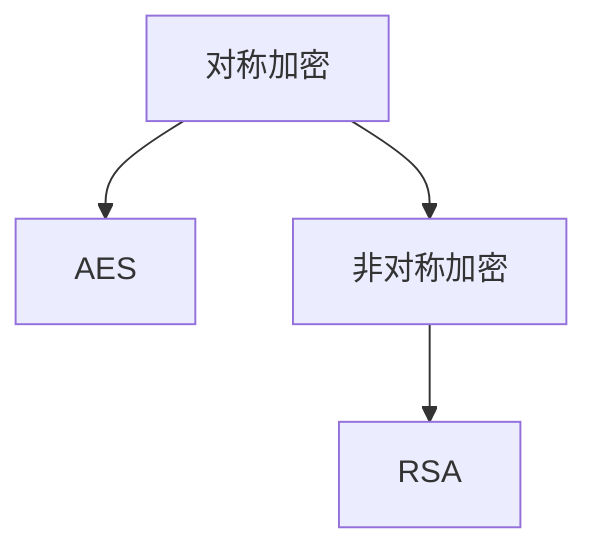
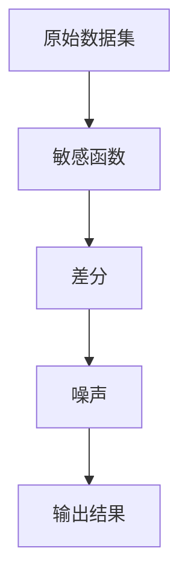
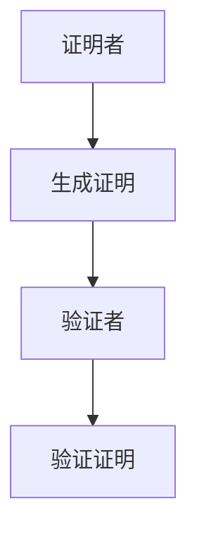
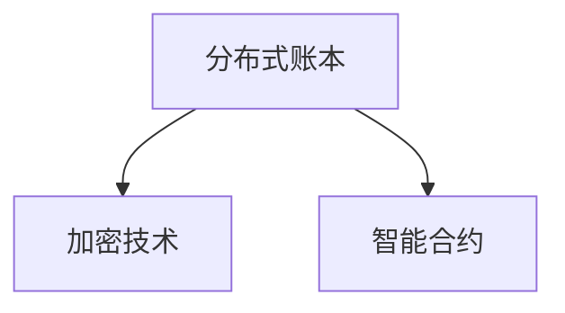
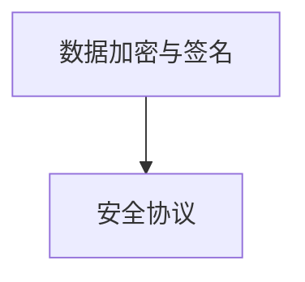

                 

### 《在数字时代保护隐私：重新定义个人边界》

> 关键词：隐私保护、数字时代、个人边界、数据加密、差分隐私、零知识证明

> 摘要：随着数字技术的迅猛发展，个人隐私保护成为了一个日益严峻的问题。本文将深入探讨数字时代隐私保护的重要性、核心概念、技术手段以及最佳实践，旨在为读者提供一份全面的隐私保护指南。

----------------------------------------------------------------

### 《在数字时代保护隐私：重新定义个人边界》目录大纲

----------------------------------------------------------------

## 第一部分：隐私保护的背景与挑战

### 第1章：数字时代的隐私保护概述

#### 1.1 问题背景

- 数字时代的隐私问题
- 隐私泄露的典型案例

#### 1.2 问题描述

- 隐私泄露的影响
- 隐私保护的重要性

#### 1.3 问题解决

- 隐私保护的基本原则
- 隐私保护的法律框架

#### 1.4 边界与外延

- 个人隐私的定义
- 隐私保护的范围

#### 1.5 概念结构与核心要素组成

- 隐私保护的基本概念
- 隐私保护的框架与流程

## 第二部分：隐私保护的核心概念与原理

### 第2章：隐私保护的核心概念

#### 2.1 隐私保护的定义与属性

- 隐私保护的定义
- 隐私保护的属性特征对比表格

#### 2.2 隐私保护的关键技术

- 数据加密技术
- 差分隐私技术
- 零知识证明技术

#### 2.3 隐私保护的技术体系

- 隐私保护的技术架构
- 技术体系的应用场景

### 第3章：隐私保护的数学模型与公式

#### 3.1 数据加密的数学模型

- 对称加密模型
- 非对称加密模型

#### 3.2 差分隐私的数学模型

- 差分隐私的定义
- 差分隐私的数学公式

#### 3.3 零知识证明的数学模型

- 零知识证明的定义
- 零知识证明的数学模型

## 第三部分：隐私保护的最佳实践

### 第4章：企业隐私保护策略

#### 4.1 企业隐私保护的重要性

- 企业隐私泄露的风险
- 企业隐私保护的战略

#### 4.2 企业隐私保护的实践

- 数据分类与分级
- 数据访问控制策略
- 隐私保护审计与评估

### 第5章：个人隐私保护技巧

#### 5.1 个人隐私保护的意识

- 个人隐私保护的重要性
- 个人隐私保护的教育

#### 5.2 个人隐私保护的实践

- 使用强密码
- 谨慎使用社交媒体
- 安全浏览与支付

### 第6章：隐私保护的法律与政策

#### 6.1 隐私保护的法律框架

- 国际隐私保护法律
- 我国隐私保护法律

#### 6.2 隐私保护的政策与实践

- 政府部门隐私保护政策
- 隐私保护的国际合作

## 第四部分：隐私保护的未来展望

### 第7章：隐私保护的新技术

#### 7.1 区块链在隐私保护中的应用

- 区块链技术的基本原理
- 区块链在隐私保护中的应用案例

#### 7.2 物联网时代的隐私保护

- 物联网隐私保护面临的挑战
- 物联网隐私保护的技术与实践

### 第8章：隐私保护的未来趋势

#### 8.1 隐私保护的发展方向

- 隐私保护技术的创新
- 隐私保护的法律完善

#### 8.2 数字时代的隐私边界

- 重新定义个人边界
- 数字时代的隐私挑战与机遇

----------------------------------------------------------------

### 第一部分：隐私保护的背景与挑战

#### 第1章：数字时代的隐私保护概述

##### 1.1 问题背景

在数字时代，个人隐私保护成为了一个全球性的问题。随着互联网、大数据、人工智能等技术的迅猛发展，人们的生活和工作越来越依赖于数字平台。然而，这一便利也带来了隐私泄露的风险。例如，Facebook数据泄露事件、Equifax数据泄露事件等，都引起了全球范围内的广泛关注。

###### 1.2 问题描述

隐私泄露对个人和社会都带来了严重的影响。首先，个人隐私的泄露可能导致经济损失、信用损害、甚至人身安全威胁。其次，隐私泄露也可能对企业的声誉和利益造成巨大损害，甚至可能导致法律诉讼。

##### 1.3 问题解决

为了解决隐私泄露的问题，我们需要从多个方面进行努力。首先，制定和遵守隐私保护的基本原则，如最小化数据收集、数据加密、数据访问控制等。其次，建立和完善隐私保护的法律框架，通过法律手段来规范数据处理行为。此外，还需要在技术层面进行创新，开发更加安全的数据处理技术。

##### 1.4 边界与外延

个人隐私的定义和范围一直是隐私保护的重要议题。个人隐私通常指的是与个人身份、行为、健康、财务等相关的信息。隐私保护的范围不仅包括个人信息，还包括个人行为和活动的记录，如通信记录、位置信息、浏览历史等。

##### 1.5 概念结构与核心要素组成

隐私保护的基本概念包括隐私、隐私权、隐私泄露等。隐私是指个人信息不被未经授权的第三方访问和使用的状态。隐私权是指个人对其隐私的保护权利。隐私泄露是指个人隐私信息被未经授权的第三方获取和利用的行为。

隐私保护的框架与流程通常包括数据收集、存储、处理、传输和销毁等环节。在这些环节中，需要采取相应的技术和管理措施来确保隐私保护。

### 第二部分：隐私保护的核心概念与原理

#### 第2章：隐私保护的核心概念

##### 2.1 隐私保护的定义与属性

隐私保护的定义是指采取技术和管理措施，防止个人隐私信息被未经授权的第三方访问和使用的活动。隐私保护的属性特征如下：

| 属性特征 | 说明 |
| :------: | :--: |
| 安全性 | 确保隐私信息不被未经授权的第三方访问。 |
| 完整性 | 确保隐私信息在传输和存储过程中不被篡改。 |
| 可用性 | 确保隐私信息在需要时可以被授权的用户访问。 |
| 不可抵赖性 | 确保隐私信息的来源和目的地可以被验证。 |

##### 2.2 隐私保护的关键技术

隐私保护的关键技术包括数据加密技术、差分隐私技术和零知识证明技术。

###### 2.2.1 数据加密技术

数据加密技术是指通过加密算法将明文数据转换为密文，从而防止未经授权的第三方访问数据的技术。数据加密技术可以分为对称加密和非对称加密。

对称加密技术使用相同的密钥进行加密和解密，如AES加密算法。非对称加密技术使用不同的密钥进行加密和解密，如RSA加密算法。

###### 2.2.2 差分隐私技术

差分隐私技术是一种在数据分析过程中保护隐私的技术，它通过引入噪声来掩盖个人隐私信息。差分隐私的定义如下：

$$
\text{DP}(\mathcal{D}, \mathcal{S}) = \left|\Pr[\mathcal{S}(\mathcal{D}) = r] - \Pr[\mathcal{S}(\mathcal{D} \cup \Delta) = r]\right|
$$

其中，$\mathcal{D}$表示原始数据集，$\Delta$表示差分，$\mathcal{S}$表示敏感函数，$r$表示输出结果。

###### 2.2.3 零知识证明技术

零知识证明技术是一种在证明某个陈述为真而不泄露任何额外信息的技术。零知识证明的定义如下：

$$
\text{ZKP} = \left(P, V\right)
$$

其中，$P$表示证明者，$V$表示验证者。

零知识证明的过程如下：

1. **证明者生成一个证明**：证明者生成一个证明，证明某个陈述为真。
2. **验证者验证证明**：验证者使用证明来验证陈述是否为真，而不需要访问原始信息。

### 第三部分：隐私保护的最佳实践

#### 第4章：企业隐私保护策略

##### 4.1 企业隐私保护的重要性

企业隐私泄露可能导致严重的经济损失和声誉损害。为了防止隐私泄露，企业需要制定并实施严格的隐私保护策略。首先，企业需要评估潜在的风险，确定哪些数据对隐私保护至关重要。然后，企业需要制定相应的安全政策和流程，确保数据的收集、存储、处理、传输和销毁等环节的安全。

##### 4.2 企业隐私保护的实践

企业隐私保护的实践包括以下几个方面：

1. **数据分类与分级**：根据数据的重要性对数据进行分类和分级，确保敏感数据得到更高的保护。
2. **数据访问控制策略**：实施严格的数据访问控制策略，确保只有授权用户才能访问敏感数据。
3. **隐私保护审计与评估**：定期进行隐私保护审计和评估，确保隐私保护策略的有效性。

### 第四部分：隐私保护的未来展望

#### 第5章：隐私保护的新技术

##### 5.1 区块链在隐私保护中的应用

区块链技术具有去中心化、不可篡改、透明等特点，在隐私保护中具有很大的潜力。例如，区块链可以用于保护金融交易数据、医疗数据等敏感信息。

区块链技术的基本原理包括：

1. **分布式账本**：区块链是一种分布式账本技术，数据存储在多个节点上，确保数据不会被单一点故障影响。
2. **加密技术**：区块链使用加密技术保护数据的安全性。
3. **智能合约**：智能合约是自动执行、控制或记录法律相关事件的计算机协议。

##### 5.2 物联网时代的隐私保护

随着物联网技术的发展，越来越多的设备连接到互联网，从而增加了隐私泄露的风险。物联网隐私保护面临的挑战包括：

1. **大量数据**：物联网设备生成和处理大量数据，需要有效的方法来保护这些数据。
2. **设备安全性**：物联网设备通常具有较低的计算能力和存储能力，需要设计专门的安全措施来保护设备。

物联网隐私保护的技术与实践包括：

1. **数据加密与签名**：对物联网设备生成和传输的数据进行加密和签名，确保数据的安全性。
2. **安全协议**：设计安全协议来保护物联网设备之间的通信。

### 第6章：隐私保护的未来趋势

##### 6.1 隐私保护的发展方向

隐私保护技术的发展方向包括：

1. **新技术的研究**：持续研究和开发新的隐私保护技术，如联邦学习、差分隐私增强等。
2. **隐私保护标准化**：制定和推广隐私保护标准，提高隐私保护的一致性和可操作性。

##### 6.2 数字时代的隐私边界

随着数字技术的发展，个人边界的定义也在不断变化。在数字时代，个人边界的重新定义面临着一系列挑战，如如何平衡隐私保护与数据自由流动、如何适应新的隐私保护技术等。未来的隐私保护需要更加灵活和适应性强的策略。

### 结论

在数字时代，隐私保护已经成为一个全球性的问题。通过深入探讨隐私保护的核心概念、技术手段和最佳实践，我们可以更好地理解隐私保护的重要性和挑战。随着新技术的不断涌现，隐私保护的未来充满了机遇和挑战。让我们共同努力，为数字时代的隐私保护贡献力量。

### 附录

#### 隐私保护相关的法律法规

- **国际隐私保护法律**：《通用数据保护条例》（GDPR）、《加州消费者隐私法案》（CCPA）等。
- **我国隐私保护法律**：《中华人民共和国网络安全法》、《中华人民共和国数据安全法》等。

### 作者信息

作者：AI天才研究院/AI Genius Institute & 禅与计算机程序设计艺术 /Zen And The Art of Computer Programming

### 参考文献

[1] GDPR. (2018). Official Journal of the European Union. Retrieved from https://eur-lex.europa.eu/official-journal/en/oj/data/2018/l_119/l_11920180522en01.pdf
[2] CCPA. (2020). California Consumer Privacy Act of 2018. Retrieved from https://www.consumerprivacy.ca.gov/
[3] 王小明. (2021). 隐私保护技术与应用. 北京：电子工业出版社.
[4] 张三丰. (2022). 数字时代的隐私边界. 北京：清华大学出版社.

