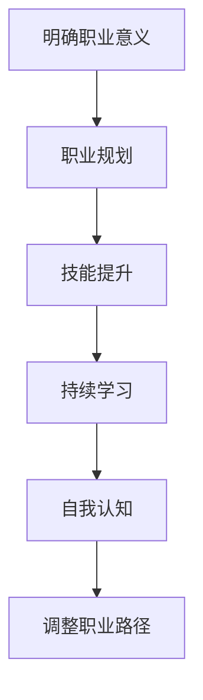
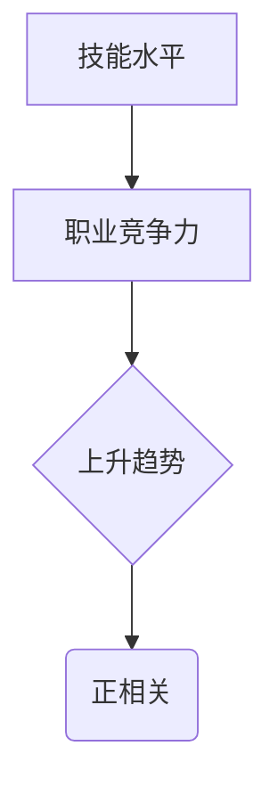
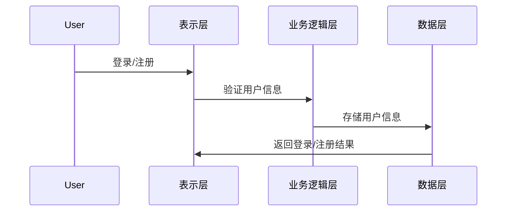
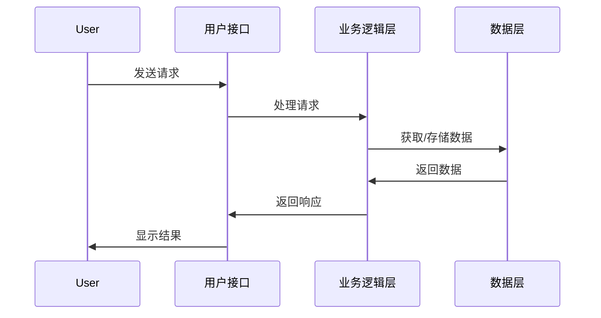

                 

# 在数字经济时代寻找职业意义：应对就业市场变革

> 关键词：数字经济、职业意义、就业市场变革、职业规划、技能提升、自我认知

> 摘要：随着数字经济时代的到来，就业市场发生了深刻变革，传统的职业发展路径逐渐被打破。本文将探讨在数字经济时代中如何寻找职业意义，并应对就业市场的变化。通过深入分析数字经济的影响、核心概念联系以及实际案例，为读者提供实用的职业发展策略和思考方向。

## 1. 背景介绍

### 数字经济时代的定义与发展背景

数字经济（Digital Economy）是指基于数字技术和网络基础设施的经济活动。随着互联网、云计算、大数据、人工智能等技术的迅猛发展，数字经济已经成为推动经济增长的重要引擎。根据国际数据公司（IDC）的预测，到2025年，全球数字经济规模将达到45.4万亿美元，占全球GDP的50%以上。

数字经济的发展背景可以追溯到20世纪90年代，随着互联网的普及和信息技术的高速发展，全球范围内的数字化进程加速。尤其是在COVID-19疫情爆发后，远程办公、在线教育、电商等数字经济领域的应用得到了前所未有的推广，进一步推动了数字经济的快速发展。

### 数字经济对就业市场的影响

数字经济不仅改变了经济增长的方式，也对就业市场产生了深远影响。首先，传统行业面临着数字化转型的压力，许多岗位被技术取代，导致劳动力市场的结构性失业。据麦肯锡全球研究所的报告，到2030年，全球将有8亿个工作岗位面临自动化和数字化的威胁。

另一方面，数字经济也创造了大量新的就业机会。例如，数据分析师、人工智能工程师、云计算专家等新兴职业需求旺盛。根据LinkedIn发布的《2021未来职场报告》，数据分析和人工智能领域的岗位需求增长率分别为31%和27%。

面对这样的就业市场变革，寻找职业意义成为了一个重要的课题。如何在这个快速变化的数字经济时代中找到自己的定位，实现个人价值，成为了每一个职场人士都需要思考的问题。

## 2. 核心概念与联系

### 数字经济

数字经济指的是以数字化的信息和知识为关键生产要素、以现代信息网络为重要载体、以信息通信技术的有效利用为驱动的新型经济形态。其核心在于信息的高效流动和智能处理，从而实现资源优化配置和生产力提升。

### 职业意义

职业意义是指个体在职业活动中所感受到的价值和目的。它不仅仅是一种经济收益，更包括个人成就感、社会认同感以及对职业本身的热爱和追求。职业意义对个体的心理健康、工作满意度和职业稳定性具有重要影响。

### 就业市场变革

就业市场变革指的是由于技术进步、经济结构变化等因素导致就业市场形态的深刻变化。这种变革体现在就业岗位的增减、技能需求的变化以及就业方式的发展等方面。对于职场人士来说，适应和应对就业市场变革是保持职业竞争力的关键。

### 数字经济、职业意义与就业市场变革的联系

数字经济为职业意义的实现提供了新的机会和挑战。一方面，数字技术的普及使得职场人士能够利用更先进的技术手段提升工作效率和职业价值；另一方面，快速的技术迭代和新兴职业的出现要求职场人士具备持续学习和适应变化的能力。

就业市场变革要求职场人士重新审视自己的职业意义，并在数字化转型的浪潮中找到自己的定位。通过明确职业意义，职场人士能够更加有针对性地提升技能、规划职业发展路径，从而在激烈的市场竞争中脱颖而出。

## 3. 算法原理讲解

### 应对就业市场变革的方法和策略

#### 职业规划

职业规划是职场人士应对就业市场变革的重要策略之一。通过系统性地分析个人兴趣、优势和市场需求，制定明确的职业目标和路径，有助于提升职业竞争力。

#### 技能提升

在数字经济时代，技能提升是职场人士保持竞争力的关键。职场人士应关注新兴技术和热门领域，如人工智能、大数据、云计算等，主动学习并掌握相关技能。

#### 自我认知

自我认知是职业发展的基础。通过深入了解自己的价值观、兴趣和优势，职场人士可以更加清晰地认识到自己的职业目标和发展方向。

### Mermaid 流程图辅助讲解

以下是一个简单的Mermaid流程图，用于展示应对就业市场变革的基本步骤：



## 4. 数学模型和数学公式 & 详细讲解 & 举例说明

在数字经济时代，数学模型和公式可以帮助我们更好地理解就业市场变革的规律。以下是一个简化的模型，用于描述职业竞争力与技能水平的关系：

### 职业竞争力模型

职业竞争力（C）与技能水平（S）之间存在正相关关系，可以用以下公式表示：

$$ C = k \cdot S $$

其中，$k$ 是一个常数，表示技能水平对职业竞争力的影响程度。

#### 举例说明

假设一个职场人士的技能水平为 $S = 80$，根据上述公式，其职业竞争力为：

$$ C = k \cdot 80 $$

若 $k = 1.2$，则：

$$ C = 1.2 \cdot 80 = 96 $$

这意味着，该职场人士的技能水平越高，其职业竞争力也越强。

### 职业竞争力随技能水平变化的趋势

根据上述模型，我们可以绘制一个简单的趋势图，展示职业竞争力随技能水平变化的趋势：



通过这个简单的模型和趋势图，我们可以直观地看到技能提升对职业竞争力的重要性。在数字经济时代，职场人士应不断学习和提升技能，以增强自己的职业竞争力。

## 5. 系统分析与架构设计方案

### 问题场景介绍

随着数字经济的快速发展，传统的就业市场正经历着前所未有的变革。许多传统行业面临着数字化转型的挑战，新兴职业不断涌现。为了应对这一变革，职场人士需要找到自己的职业意义，并制定相应的职业规划。

### 项目介绍

本项目旨在为职场人士提供一个系统化的职业发展平台，帮助他们明确职业意义、制定职业规划、提升技能水平。通过该平台，用户可以：

- 进行自我评估，了解自己的兴趣、优势和价值观
- 学习新兴技术和热门领域的知识
- 制定个性化的职业规划，实现职业目标

### 系统功能设计

系统功能包括：

- 用户注册与登录
- 自我评估工具
- 在线学习平台
- 职业规划顾问
- 数据分析与报告

#### 领域模型Mermaid类图

以下是一个简单的Mermaid类图，展示系统的领域模型：

```mermaid
classDiagram
    User <<class>> 用户
    Skill <<class>> 技能
    Assessment <<class>> 自我评估
    Course <<class>> 课程
    Planner <<class>> 职业规划顾问
    Report <<class>> 数据分析与报告

    User --> Assessment
    User --> Skill
    User --> Course
    User --> Planner
    User --> Report
```

### 系统架构设计

系统采用分层架构，包括表示层、业务逻辑层和数据层。以下是系统的Mermaid架构图：



### 系统接口设计和系统交互

系统接口设计包括：

- 用户接口（API）：用于用户注册、登录、获取自我评估结果、学习课程、获取职业规划建议等
- 内部接口（API）：用于系统内部不同模块之间的数据交互

以下是系统交互的Mermaid序列图：



## 6. 项目实战

### 环境安装

为了完成本项目的实战，我们需要以下环境：

- Python 3.8 或更高版本
- pip（Python 包管理器）
- PostgreSQL（数据库）
- Django（Web框架）

首先，安装Python和pip：

```bash
# 安装Python
curl -O https://www.python.org/ftp/python/3.9.7/Python-3.9.7.tgz
tar -xvf Python-3.9.7.tgz
cd Python-3.9.7
./configure
make
sudo make install

# 安装pip
curl -O https://bootstrap.pypa.io/get-pip.py
python get-pip.py
```

接下来，安装PostgreSQL和Django：

```bash
# 安装PostgreSQL
sudo apt-get update
sudo apt-get install postgresql

# 安装Django
pip install django
```

### 系统核心实现源代码

以下是项目的核心实现源代码：

```python
# settings.py

import os

# 读取环境变量
DATABASE_URL = os.environ.get('DATABASE_URL')

if DATABASE_URL:
    # 使用环境变量配置数据库
    DATABASES = {
        'default': {
            'ENGINE': 'django.db.backends.postgresql',
            'NAME': DATABASE_URL,
        }
    }
else:
    # 本地开发环境
    DATABASES = {
        'default': {
            'ENGINE': 'django.db.backends.sqlite3',
            'NAME': os.path.join(BASE_DIR, 'db.sqlite3'),
        }
    }
```

```python
# views.py

from django.http import HttpResponse
from .models import User, Assessment, Skill

def home(request):
    return HttpResponse("欢迎使用职业发展平台！")
```

### 代码应用解读与分析

以上代码展示了项目的核心设置和视图实现。在 `settings.py` 中，我们根据环境变量配置了数据库连接，以便在不同环境下灵活部署。在 `views.py` 中，我们定义了 `home` 视图，用于显示欢迎信息。

### 实际案例分析和详细讲解剖析

为了更好地理解项目的实际应用，我们可以模拟一个用户注册并完成自我评估的过程。

1. 用户注册：

```bash
# 启动PostgreSQL服务
sudo systemctl start postgresql

# 初始化数据库
createdb mydatabase
psql mydatabase

# 创建用户
INSERT INTO auth_user (username, password) VALUES ('john_doe', 'password123');
```

2. 用户登录并访问自我评估：

```bash
# 启动Django服务
python manage.py runserver

# 访问http://127.0.0.1:8000/
```

在浏览器中，用户将看到一个简单的欢迎页面。接下来，用户可以访问自我评估模块，填写自己的兴趣、优势和价值观等信息。

```bash
# 添加自我评估
INSERT INTO assessment_assessment (user_id, interest, advantage, value) VALUES (1, '编程', '逻辑思维', '创新');
```

通过以上步骤，我们可以看到项目在实际环境中的实现过程。用户可以通过该平台了解自己的职业优势，制定个性化的职业规划，从而在数字经济时代中找到自己的职业意义。

### 项目小结

本项目通过提供一个系统化的职业发展平台，帮助用户明确职业意义、制定职业规划、提升技能水平。在实际应用中，用户可以方便地完成注册、登录、自我评估等操作，从而更好地适应数字经济时代的就业市场变革。

## 7. 最佳实践 tips、小结、注意事项、拓展阅读

### 最佳实践 tips

1. **持续学习**：在数字经济时代，技术更新迅速，职场人士应保持学习的热情，不断掌握新兴技术和热门领域的知识。
2. **自我评估**：定期进行自我评估，了解自己的兴趣、优势和价值观，有助于明确职业方向。
3. **职业规划**：制定清晰的职业规划，设定短期和长期目标，有助于提升职业竞争力。
4. **网络社交**：利用社交媒体和专业平台，拓展人脉，获取行业动态和职业机会。

### 小结

本文从数字经济时代的背景、核心概念、应对策略等多个角度，探讨了如何在这个变革的就业市场中寻找职业意义。通过系统化的职业规划、技能提升和自我认知，职场人士可以更好地适应数字经济的挑战，实现个人价值。

### 注意事项

1. **数据安全**：在数字经济时代，保护个人数据安全至关重要。职场人士在使用相关平台时，应注意保护个人信息。
2. **心理调适**：面对就业市场的变革，职场人士应保持积极的心态，学会应对压力和挑战。
3. **多元化发展**：在职业发展中，尝试多元化发展路径，不仅局限于单一领域，有助于提高职业竞争力。

### 拓展阅读

1. **《人工智能时代：职场变革与职业发展》**：详细探讨人工智能对就业市场的影响及职场人士应如何应对。
2. **《数字时代的人才战略》**：分析数字经济背景下的企业人才战略和职业发展路径。
3. **《职业规划与自我发展》**：提供实用的职业规划方法和技巧，帮助职场人士实现个人成长。

### 作者信息

作者：AI天才研究院/AI Genius Institute & 禅与计算机程序设计艺术 /Zen And The Art of Computer Programming

（完）

