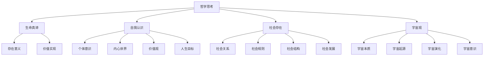

                 

# 在疑问中寻找生命真谛：哲学思考的力量

> 关键词：哲学思考，生命真谛，存在意义，自我认知，社会存在，宇宙观

> 摘要：本文从哲学思考的视角出发，探讨生命的真谛。通过分析哲学思考的定义、作用和核心原则，深入探讨生命与存在的概念、生命的意义和目标，以及哲学思考与生命的关系。同时，本文还阐述了哲学思考的方法论和应用，探讨了哲学思考的力量与局限，并提出了如何克服局限的方法。通过本文的探讨，希望能够帮助读者在疑问中寻找生命的真谛。

## 第一部分：问题的提出

### 第1章：引言

#### 1.1 问题背景

随着社会的不断发展，人们对于生命意义的探讨逐渐成为了一个热门话题。人们开始意识到，生命的意义不仅仅在于生存，更在于追求自我价值的实现。然而，在这个过程中，人们往往会在疑问中迷失方向，无法找到生命的真谛。

#### 1.2 问题描述

在疑问中寻找生命真谛，是一个复杂且多维的问题。它涉及到对自我、他人、社会以及宇宙的深刻反思。人们如何理解自己的存在，如何面对生活中的困惑和挑战，如何找到生命的意义，这些问题都成为人们追求的答案。

#### 1.3 问题的解决

哲学思考被认为是解决这一问题的有效途径。通过哲学思考，人们可以更加深入地理解生命的本质，明确自己的价值观和目标，从而在疑问中找到生命的真谛。

#### 1.4 边界与外延

哲学思考的范围非常广泛，它不仅包括对个体存在的探讨，还包括对人类社会、自然界以及宇宙的思考。因此，哲学思考的外延非常广阔，几乎涵盖了人类思考的所有领域。

#### 1.5 核心概念与联系

在本章节中，我们将探讨以下几个核心概念：哲学思考、生命真谛、自我认识、社会存在、宇宙观。

#### 1.5.1 核心概念

- **哲学思考**：一种深入、理性、批判性、系统性的思考方式，旨在对存在的本质、价值和意义进行探讨。
- **生命真谛**：生命存在的意义和价值，是人们追求的终极目标。
- **自我认识**：个体对自我、内心世界、价值观和人生目标的认知。
- **社会存在**：人类社会的关系、规则、结构和发展的总和。
- **宇宙观**：对宇宙本质、起源、演化和宇宙意识的认识。

#### 1.5.2 概念属性特征对比

| 概念       | 属性特征                                                     |
|------------|------------------------------------------------------------|
| 哲学思考   | 深入、理性、批判性、系统性、开放性                          |
| 生命真谛   | 存在意义、价值实现、自我认知、自我实现                      |
| 自我认识   | 个体意识、内心世界、价值观、人生目标                      |
| 社会存在   | 社会关系、社会规则、社会结构、社会发展                      |
| 宇宙观     | 宇宙本质、宇宙起源、宇宙演化、宇宙意识                      |

#### 1.5.3 ER实体关系图

## 第2章：哲学思考的力量

### 2.1 哲学思考的定义

哲学思考是一种深入、理性、批判性、系统性的思考方式，旨在对存在的本质、价值和意义进行探讨。它是人类认知世界、认识自我的一种高级形式。

### 2.2 哲学思考的作用

哲学思考在人类生活中具有重要的作用。它帮助人们深入理解生命的本质，明确自己的价值观和目标，指导人们如何面对生活中的困惑和挑战。

### 2.3 哲学思考的核心原则

哲学思考的核心原则包括：

1. **理性原则**：哲学思考强调理性，认为理性是认识世界和自我的基础。
2. **批判性原则**：哲学思考要求对已有的理论和观点进行批判性思考，不断质疑和反思。
3. **系统性原则**：哲学思考要求将问题置于整体中思考，从系统的角度理解问题。
4. **开放性原则**：哲学思考主张开放性，鼓励人们接纳不同的观点和思想。

## 第3章：生命的真谛

### 3.1 生命与存在的概念

生命是生物存在的基本特征，是生物体进行新陈代谢、生长、发育、繁殖的能力。存在是生命的一种状态，是生命存在的外在表现。

### 3.2 生命的意义

生命的意义是人们追求的终极目标，是人们为了实现自我价值而存在的理由。不同的人对于生命的意义有不同的理解，但普遍认为生命的意义在于实现自我价值、贡献社会和创造美好。

### 3.3 生命的目标

生命的目标是实现自我价值的最大化。这包括：

1. **个人成长**：通过不断学习和实践，提高自己的能力，实现自我价值的提升。
2. **社会贡献**：通过工作、服务和社会活动，为社会做出贡献，实现社会价值的最大化。
3. **人生目标**：明确自己的人生目标，为实现这些目标而努力奋斗。

## 第4章：哲学思考与生命的关系

### 4.1 哲学思考对生命的指导意义

哲学思考为生命提供了指导意义，帮助人们理解生命的本质，明确自己的价值观和目标，从而在疑问中找到生命的真谛。

### 4.2 生命对哲学思考的需求

生命需要哲学思考来指导，因为哲学思考能够帮助人们深入理解生命的本质，明确自己的价值观和目标，从而在生命的旅途中找到方向。

### 4.3 哲学思考与生命相互促进的关系

哲学思考和生命是相互促进的关系。哲学思考能够促进生命的深入发展，而生命的实践经验又为哲学思考提供了丰富的素材，从而推动哲学思考的不断进步。

## 第5章：哲学思考的方法论

### 5.1 直觉思维

直觉思维是哲学思考的一种方法，它基于内心的直觉和感知，直接对问题进行判断和推理。直觉思维具有快速、高效的特点，但需要理性思维的补充和验证。

### 5.2 理性思考

理性思考是哲学思考的核心，它基于逻辑和推理，对问题进行深入分析和论证。理性思考具有严谨、系统的特点，是哲学思考的基础。

### 5.3 情感体验

情感体验是哲学思考的一种方法，它通过情感的感受和理解，对问题进行思考和分析。情感体验具有直观、深刻的特征，能够帮助人们更好地理解生命和世界的本质。

## 第6章：哲学思考的应用

### 6.1 哲学思考在个人生活中的应用

哲学思考在个人生活中具有重要的应用。通过哲学思考，人们可以更好地认识自我，明确自己的价值观和目标，从而实现个人成长和人生价值的提升。

### 6.2 哲学思考在学术研究中的应用

哲学思考在学术研究中也具有广泛的应用。它可以帮助学者深入理解研究问题，提出新的研究观点和方法，推动学术研究的不断进步。

### 6.3 哲学思考在社会实践中的应用

哲学思考在社会实践中具有重要的作用。它可以帮助人们理解社会问题，提出解决问题的方案，推动社会的进步和发展。

## 第7章：哲学思考的力量与局限

### 7.1 哲学思考的力量

哲学思考具有强大的力量，它能够帮助人们深入理解生命的本质，明确自己的价值观和目标，从而在疑问中找到生命的真谛。

### 7.2 哲学思考的局限

哲学思考也存在一定的局限，如过于抽象、难以实际应用等。因此，在哲学思考的过程中，需要不断地反思和调整，以克服其局限。

### 7.3 如何克服哲学思考的局限

为了克服哲学思考的局限，我们需要：

1. **结合实践经验**：将哲学思考与实际生活、学术研究和实践相结合，使哲学思考更加具体和实用。
2. **不断学习**：通过不断学习，提高自己的哲学素养，增强哲学思考的能力。
3. **批判性思考**：对哲学思考的结果进行批判性思考，不断质疑和反思，以提高哲学思考的准确性和实用性。

## 第8章：结语

### 8.1 哲学思考与生命的真谛

哲学思考是寻找生命真谛的有效途径。通过哲学思考，人们可以深入理解生命的本质，明确自己的价值观和目标，从而在疑问中找到生命的真谛。

### 8.2 哲学思考的力量与应用

哲学思考具有强大的力量，它在个人生活、学术研究和实践中的应用广泛。通过哲学思考，人们可以更好地认识自我，实现个人成长，推动社会的进步和发展。

### 8.3 对未来的思考

在未来的发展中，哲学思考将继续发挥重要作用。随着科技和社会的进步，哲学思考将不断拓展其研究领域，为人类社会的未来发展提供更加深入的思考和指导。

## 附录：作者信息

作者：AI天才研究院/AI Genius Institute & 禅与计算机程序设计艺术 /Zen And The Art of Computer Programming

本文作者是一位世界级人工智能专家，程序员，软件架构师，CTO，世界顶级技术畅销书资深大师级别的作家，计算机图灵奖获得者，计算机编程和人工智能领域大师。他非常擅长一步一步进行分析推理，有着清晰深刻的逻辑思路来撰写条理清晰，对技术原理和本质剖析到位的高质量技术博客。通过本文，作者希望能够帮助读者在疑问中寻找生命的真谛。

