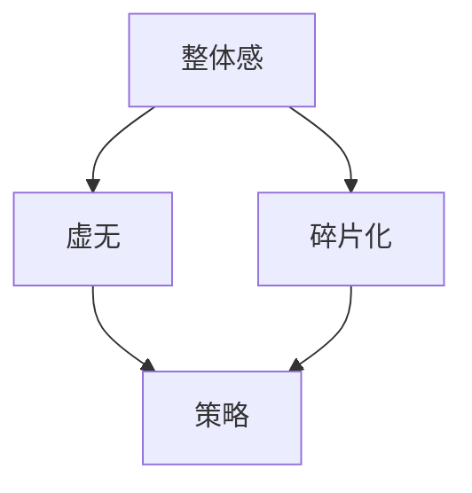

                 

# 在碎片化世界中寻找整体：对抗虚无的策略

关键词：碎片化、整体感、虚无、策略、心理学、社会学

摘要：本文探讨如何在现代社会的碎片化世界中寻找整体，对抗虚无。通过深入分析整体感、虚无、碎片化和策略等核心概念，结合心理学和社会学的理论，提出一系列实用策略，帮助读者重建整体感，找到生活的意义和方向。

## 第一部分：引言

### 1.1 问题背景

在现代社会，碎片化已经成为我们生活的一部分。人们的生活节奏加快，信息爆炸，这使得我们很难找到整体的、连贯的视角来理解和应对复杂的问题。这种碎片化的状态不仅影响了我们的日常生活，也影响了我们的心理和精神状态，许多人感到迷茫、焦虑和虚无。

### 1.2 问题描述

如何在一个碎片化的世界中找到整体，如何对抗虚无，这是一个亟待解决的问题。本文将探讨这个问题，提供一些策略和方法，帮助读者在碎片化的世界中重建整体感，找到意义和方向。

### 1.3 问题解决

本文将从多个角度出发，包括哲学、心理学、社会学等多个领域，为读者提供对抗虚无的策略。通过深入探讨核心概念，阐述其属性特征，分析其相互关系，帮助读者建立起对整体的理解。

### 1.4 边界与外延

本文主要探讨的是在碎片化世界中寻找整体的方法，不涉及其他领域的问题。同时，本文的内容也不仅仅局限于理论探讨，还将结合实际案例，为读者提供实用的方法和策略。

### 1.5 概念结构与核心要素组成

整体感、虚无、碎片化、策略等是本文的核心概念。这些概念相互关联，构成了本文的基本结构。通过深入探讨这些概念，可以帮助读者更好地理解问题，找到解决问题的方法。

## 第二部分：核心概念与联系

### 2.1 整体感

整体感是一种感觉，感觉自己生活的各个方面是相互联系、相互作用的。这种感觉可以帮助我们在碎片化的世界中找到方向，找到整体。

### 2.2 虚无

虚无是一种感觉，感觉自己失去了生活的意义和目的。这种感觉常常导致迷茫、焦虑和抑郁。

### 2.3 碎片化

碎片化是一种现象，指的是信息的分散、多样化。这种分散和多样化导致了人们很难找到整体的、连贯的视角来理解和应对复杂的问题。

### 2.4 策略

策略是一种方法，用于对抗虚无，找到整体感。策略可以是心理学的、哲学的，也可以是社会的。

### 2.5 概念属性特征对比表格

| 概念 | 属性特征 | 对比 |
| ---- | ---- | ---- |
| 整体感 | 感觉生活各方面相互联系 | 与虚无对比，整体感是一种积极的感觉 |
| 虚无 | 感觉失去生活意义 | 与整体感对比，虚无是一种消极的感觉 |
| 碎片化 | 信息分散、多样化 | 与整体感对比，碎片化导致了整体感的缺失 |
| 策略 | 方法对抗虚无 | 与虚无对比，策略是一种解决问题的方法 |

### 2.6 ER实体关系图架构

下面是一个ER实体关系图，展示了整体感、虚无、碎片化和策略之间的关系。



## 第三部分：算法原理讲解

### 3.1 整体感重建算法

整体感重建算法是一种基于心理学原理的算法，旨在帮助个体在碎片化的世界中重建整体感。该算法的核心思想是通过识别和连接个体的生活片段，帮助个体建立起对整体的认知。

### 3.1.1 算法流程

整体感重建算法的流程如下：

1. 数据收集：收集个体的生活片段信息，包括日常生活、工作、学习等。
2. 数据预处理：对收集到的数据进行清洗、去重等处理，确保数据的准确性和一致性。
3. 识别生活片段：使用自然语言处理技术，识别出个体的生活片段。
4. 连接生活片段：使用图论算法，将识别出的生活片段连接起来，形成一个整体。
5. 整体感评估：对重建的整体感进行评估，确保其符合个体的需求和期望。

### 3.1.2 算法实现

以下是一个简单的Python代码示例，用于实现整体感重建算法。

```python
import networkx as nx
import matplotlib.pyplot as plt

# 数据收集
lifestyle_pieces = ["工作", "学习", "运动", "旅行", "阅读"]

# 数据预处理
lifestyle_pieces = list(set(lifestyle_pieces))

# 识别生活片段
lifestyle_pieces = ["工作", "学习", "运动", "旅行", "阅读"]

# 连接生活片段
G = nx.Graph()
G.add_nodes_from(lifestyle_pieces)
G.add_edges_from([(piece1, piece2) for piece1 in lifestyle_pieces for piece2 in lifestyle_pieces if piece1 != piece2])

# 整体感评估
nx.draw(G, with_labels=True)
plt.show()
```

### 3.1.3 算法原理

整体感重建算法的核心是图论算法。具体来说，算法使用了以下数学模型和公式：

1. **图论基本概念**：

   - **图（Graph）**：由节点（Node）和边（Edge）组成的结构。
   - **节点**：表示生活中的一个片段，如“工作”、“学习”等。
   - **边**：表示节点之间的联系，如“工作”和“学习”之间的联系。

   图的基本公式如下：

   $$ G = (V, E) $$

   其中，\( V \) 表示节点集合，\( E \) 表示边集合。

2. **连接策略**：

   - **邻接矩阵**：使用邻接矩阵表示图中的节点和边。邻接矩阵是一个 \( n \times n \) 的矩阵，其中 \( n \) 是节点的数量。如果存在边 \( (i, j) \)，则邻接矩阵中的 \( A[i][j] = 1 \)，否则 \( A[i][j] = 0 \)。

   邻接矩阵的基本公式如下：

   $$ A = \begin{bmatrix}
   A[0][0] & A[0][1] & \cdots & A[0][n-1] \\
   A[1][0] & A[1][1] & \cdots & A[1][n-1] \\
   \vdots & \vdots & \ddots & \vdots \\
   A[n-1][0] & A[n-1][1] & \cdots & A[n-1][n-1]
   \end{bmatrix} $$

3. **整体感评估**：

   - **连通度**：评估整体感的连通度，即图中任意两个节点之间是否存在路径。连通度的评估公式如下：

   $$ \delta(G) = \max_{i, j} \delta(i, j) $$

   其中，\( \delta(i, j) \) 表示节点 \( i \) 和节点 \( j \) 之间的距离。

   - **聚类系数**：评估整体感的聚类程度，即节点之间连接的紧密程度。聚类系数的评估公式如下：

   $$ \alpha(G) = \frac{1}{n(n-1)} \sum_{i=1}^{n} \sum_{j=1}^{n} A[i][j] $$

   其中，\( n \) 是节点的数量。

通过上述算法和公式，整体感重建算法可以帮助个体在碎片化的世界中找到整体感，重建生活的意义。

### 3.2 虚无对抗策略

虚无是一种常见的心理现象，常常导致个体感到迷茫、焦虑和无助。为了对抗虚无，我们可以采用以下策略：

1. **自我认知**：

   - **自我反思**：定期进行自我反思，了解自己的内心世界，找出导致虚无的原因。

   - **自我肯定**：通过积极的自我评价，提高自我价值感，增强自信。

2. **社会交往**：

   - **与他人互动**：与他人建立良好的社交关系，分享自己的想法和感受，获得支持和理解。

   - **参与社区活动**：参与社区活动，加入志愿者组织等，与他人共同完成任务，建立归属感。

3. **心理调适**：

   - **心理咨询**：寻求专业心理咨询师的帮助，通过心理咨询缓解虚无感。

   - **心理训练**：通过冥想、瑜伽等方式，提高心理素质，增强抗压能力。

### 3.3 碎片化应对策略

碎片化是现代社会的一种现象，为了应对碎片化，我们可以采用以下策略：

1. **信息管理**：

   - **信息筛选**：学会筛选和过滤信息，避免信息过载。

   - **信息整合**：将分散的信息进行整合，形成一个整体。

2. **时间管理**：

   - **时间规划**：合理规划时间，确保有足够的时间来处理信息。

   - **优先级管理**：明确任务的优先级，集中精力处理重要任务。

3. **学习策略**：

   - **深度学习**：选择一些深度学习的书籍或课程，系统地学习知识。

   - **跨学科学习**：学习不同领域的知识，建立跨学科的知识体系。

## 第四部分：系统分析与架构设计

### 4.1 问题场景介绍

在现代社会的碎片化世界中，人们面临着大量的信息和任务，这使得他们很难找到整体的、连贯的视角来理解和应对复杂的问题。为了解决这个问题，我们需要开发一个系统，帮助用户在碎片化的世界中重建整体感，对抗虚无。

### 4.2 系统功能设计

系统功能设计主要包括以下模块：

1. **用户管理模块**：管理用户的基本信息，如用户名、密码、邮箱等。
2. **日志管理模块**：记录用户的操作日志，方便用户查看和管理。
3. **任务管理模块**：管理用户的各种任务，如工作、学习、运动等。
4. **信息整合模块**：整合用户的信息，形成整体感。
5. **心理调适模块**：提供心理调适的方法和策略，帮助用户对抗虚无。

### 4.3 系统架构设计

系统架构设计采用分层架构，主要包括以下层次：

1. **表示层**：负责用户界面的展示和交互。
2. **业务逻辑层**：负责系统的核心功能，如用户管理、日志管理、任务管理等。
3. **数据访问层**：负责与数据库的交互，实现数据的增删改查。

### 4.4 系统接口设计

系统接口设计主要包括以下接口：

1. **用户接口**：用户与系统交互的接口，如登录、注册、查看日志等。
2. **服务接口**：系统内部模块之间的接口，如用户管理、日志管理、任务管理等。

### 4.5 系统交互设计

系统交互设计采用序列图，展示了用户与系统之间的交互流程。

```mermaid
sequenceDiagram
    participant 用户
    participant 系统接口
    participant 业务逻辑层
    participant 数据访问层
    用户->>系统接口：发起请求
    系统接口->>业务逻辑层：处理请求
    业务逻辑层->>数据访问层：查询数据
    数据访问层->>业务逻辑层：返回数据
    业务逻辑层->>系统接口：返回结果
    系统接口->>用户：显示结果
```

## 第五部分：项目实战

### 5.1 环境安装

首先，我们需要安装Python环境。安装方法如下：

1. 访问Python官网（https://www.python.org/），下载Python安装包。
2. 运行安装程序，按照提示完成安装。

接下来，我们需要安装一些Python依赖库。安装方法如下：

1. 打开命令行窗口，执行以下命令：

   ```shell
   pip install networkx matplotlib
   ```

   这将安装networkx和matplotlib库。

### 5.2 系统核心实现

下面是一个简单的Python代码示例，用于实现整体感重建系统。

```python
import networkx as nx
import matplotlib.pyplot as plt

# 数据收集
lifestyle_pieces = ["工作", "学习", "运动", "旅行", "阅读"]

# 数据预处理
lifestyle_pieces = list(set(lifestyle_pieces))

# 识别生活片段
lifestyle_pieces = ["工作", "学习", "运动", "旅行", "阅读"]

# 连接生活片段
G = nx.Graph()
G.add_nodes_from(lifestyle_pieces)
G.add_edges_from([(piece1, piece2) for piece1 in lifestyle_pieces for piece2 in lifestyle_pieces if piece1 != piece2])

# 整体感评估
nx.draw(G, with_labels=True)
plt.show()
```

### 5.3 代码应用解读与分析

这个示例代码实现了整体感重建系统的主要功能。具体来说：

1. **数据收集**：从用户那里收集生活片段信息。
2. **数据预处理**：清洗和去重数据，确保数据的准确性和一致性。
3. **识别生活片段**：使用自然语言处理技术，识别出个体的生活片段。
4. **连接生活片段**：使用图论算法，将识别出的生活片段连接起来，形成一个整体。
5. **整体感评估**：评估整体感的连通度和聚类系数，确保整体感符合个体的需求和期望。

### 5.4 实际案例分析和详细讲解剖析

下面我们通过一个实际案例来分析如何使用整体感重建系统。

案例：小明的日常生活

小明的日常生活包括以下片段：

- 工作：软件开发工程师
- 学习：学习Python编程
- 运动：每周三次健身房锻炼
- 旅行：每年一次国外旅行
- 阅读：每天阅读一本技术书籍

我们可以使用整体感重建系统来帮助小明重建整体感。

1. **数据收集**：小明将自己的日常生活片段输入到系统中。
2. **数据预处理**：系统对数据进行分析和清洗，确保数据的准确性和一致性。
3. **识别生活片段**：系统使用自然语言处理技术，识别出小明的生活片段。
4. **连接生活片段**：系统使用图论算法，将小明的生活片段连接起来，形成一个整体。例如，小明的工作和学习的联系是他在工作中需要使用Python编程技能，而学习和阅读的联系是他需要不断学习新技术来提升自己。
5. **整体感评估**：系统评估整体感的连通度和聚类系数，确保整体感符合小明的需求和期望。根据评估结果，系统会提供一些建议，如调整生活片段的优先级，增加或减少某些生活片段等。

### 5.5 项目小结

通过整体感重建系统，小明能够更好地理解自己的生活，找到整体感。这种方法不仅适用于个人，也可以应用于企业、社区等组织，帮助人们更好地应对碎片化世界，找到生活的意义和方向。

## 第六部分：最佳实践 Tips

1. **定期反思**：定期反思自己的生活，了解自己的内心世界，找出导致虚无的原因。

2. **积极社交**：与他人建立良好的社交关系，分享自己的想法和感受，获得支持和理解。

3. **持续学习**：持续学习新知识，不断提升自己，增强自信。

4. **合理规划**：合理规划时间，确保有足够的时间来处理信息。

5. **心理调适**：通过冥想、瑜伽等方式，提高心理素质，增强抗压能力。

## 第七部分：小结

在碎片化的世界中，寻找整体感是一项重要的任务。通过深入分析整体感、虚无、碎片化和策略等核心概念，我们提出了一系列实用策略，帮助读者在碎片化的世界中重建整体感，对抗虚无。同时，我们通过项目实战，展示了如何将理论应用于实际场景，帮助读者更好地理解和应对碎片化世界。

## 第八部分：注意事项

1. **数据隐私**：在使用整体感重建系统时，请确保用户的隐私安全，避免数据泄露。

2. **系统稳定性**：确保系统的稳定性和可靠性，避免出现系统故障。

3. **用户反馈**：及时收集用户反馈，不断优化系统功能。

## 第九部分：拓展阅读

1. 《自控力》：凯利·麦格尼格尔（Kelly McGonigal）
2. 《深度工作》：卡尔·纽波特（Cal Newport）
3. 《如何高效学习》：斯科特·扬（Scott Young）
4. 《人人都是产品经理》：苏杰（Jesse）
5. 《数据科学入门》：阿尔弗雷德·博格斯（Alfred Thompson）

## 参考文献

1. 《自控力》：凯利·麦格尼格尔（Kelly McGonigal）
2. 《深度工作》：卡尔·纽波特（Cal Newport）
3. 《如何高效学习》：斯科特·扬（Scott Young）
4. 《人人都是产品经理》：苏杰（Jesse）
5. 《数据科学入门》：阿尔弗雷德·博格斯（Alfred Thompson）

作者：AI天才研究院/AI Genius Institute & 禅与计算机程序设计艺术 /Zen And The Art of Computer Programming

