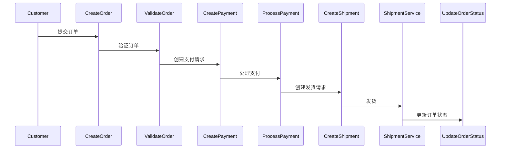
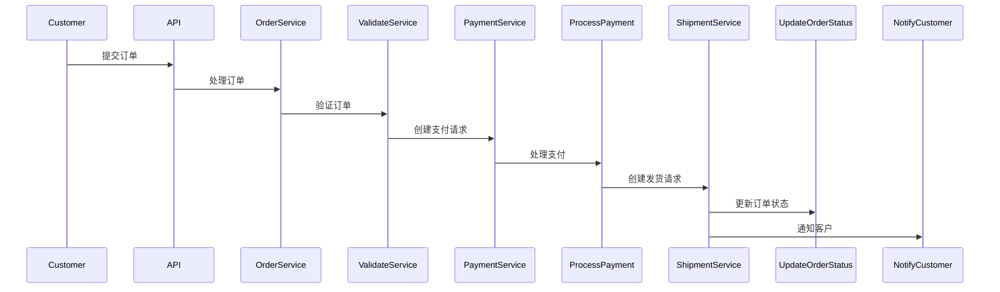

                 


### 背景介绍：问题背景、问题描述、问题解决、边界与外延、概念结构与核心要素组成

**问题背景：**
在信息爆炸和数字化变革的时代，知识的学习和掌握方式发生了巨大的变化。碎片化的信息使得人们难以系统性地掌握知识，传统的学习模式难以适应这种变化。尤其是在IT领域，技术的更新速度非常快，要求从业者能够迅速掌握新知识，并将其应用于实践中。然而，碎片化的学习往往导致知识零散化、学习效率低下，难以形成系统的知识体系。

**问题描述：**
- **知识零散化：** 碎片化的信息使得知识点被分割成一个个独立的片段，学习者难以构建起一个连贯的知识体系。
- **学习效率低下：** 碎片化的学习容易导致学习者的注意力分散，学习效果难以保障。
- **知识应用困难：** 知识点之间的联系不明确，学习者难以将所学知识应用于实际问题解决。

**问题解决：**
为了解决上述问题，需要重建知识体系，通过系统化的学习和思考方式，将碎片化的知识整合成一个完整的体系。这包括：
- **明确学习目标：** 确定学习的核心目标和方向，有针对性地进行学习。
- **构建知识框架：** 设计一个清晰的知识框架，将零散的知识点按照逻辑关系进行组织。
- **深度学习和实践：** 通过深度学习和实践，将知识内化为能力，提升实际问题的解决能力。

**边界与外延：**
- **边界：** 知识体系的边界包括学习范围和深度，需要根据学习目标和自身实际情况进行合理设定。
- **外延：** 知识体系的外延涉及与其他领域的交叉和融合，这有助于拓宽知识视野，提高知识的应用价值。

**概念结构与核心要素组成：**
知识体系的构建需要以下核心要素：
- **核心概念：** 明确核心概念，构建知识体系的基础。
- **知识点关联：** 将各个知识点按照逻辑关系进行连接，形成一个整体。
- **实践应用：** 将理论知识与实践相结合，通过实践验证和巩固知识。

### 第一部分：碎片化时代的挑战与知识体系重建

#### 第1章：碎片化时代的知识困境

**1.1 碎片化时代的特征**

**信息爆炸与选择困难：**
在互联网和智能手机普及的背景下，用户每天接收到的信息量呈指数级增长。例如，根据《中国互联网发展报告》，截至2021年底，中国的互联网用户已超过9亿，人均每天使用互联网的时间接近3小时。这种信息爆炸使得用户面临巨大的选择困难，难以从海量信息中筛选出有价值的内容。

**注意力分散：**
信息过载导致用户的注意力难以集中。研究表明，现代人的注意力跨度平均只有8秒，这比金鱼的注意力跨度还要短。碎片化的阅读习惯容易导致学习效率降低，学习者难以长时间专注于一个知识点。

**学习习惯的改变：**
随着移动互联网的发展，用户越来越倾向于利用零碎时间进行学习。例如，根据《中国互联网发展报告》，近70%的互联网用户使用手机进行在线学习。这种碎片化的学习方式虽然方便，但也容易导致学习效果的下降。

**1.2 碎片化时代的知识体系困境**

**知识零散化：**
碎片化的信息使得知识体系不再系统。例如，在学习编程语言时，用户可能会通过阅读博客、观看视频教程、阅读技术文档等多种途径获取知识，但这些途径往往是零散的，缺乏系统性。这使得学习者难以构建起一个完整的知识框架。

**信息冗余与重复：**
碎片化学习容易导致信息冗余和重复。例如，在互联网上，同一知识点可能会以不同的形式多次出现，这导致用户在获取知识时需要花费更多的时间和精力进行筛选。

**学习效果难以保障：**
由于学习时间分散，学习效果难以保障。例如，用户可能在通勤时学习了一篇技术文章，但在回家后由于忙碌而忘记了这篇文章的内容。这种学习方式难以形成长期记忆，知识难以内化和应用。

**1.3 重建知识体系的必要性**

**提升学习效率：**
通过系统化的知识体系，学习者可以更快地掌握知识，提升学习效率。例如，在学习编程语言时，通过系统地学习语法、数据结构、算法等知识点，学习者可以更快地掌握编程技能。

**增强知识应用能力：**
系统化的知识体系有助于将知识内化为能力，提升实际问题的解决能力。例如，在学习机器学习时，通过系统地学习各种算法、数据预处理技术等，学习者可以更好地应对实际项目中的问题。

**应对未来挑战：**
碎片化时代的信息和技术更新速度加快，重建知识体系有助于更好地适应未来变化。例如，在人工智能领域，各种新技术层出不穷，只有通过系统化的学习，才能跟上技术的发展步伐。

### 第二部分：个人学习革命

#### 第2章：重塑学习理念

**2.1 学习理念的转变**

**从被动接收到主动构建：**
传统的学习模式往往是被动接受知识，而碎片化时代要求学习者主动探索和构建知识。这意味着学习者需要具备自我驱动的能力，主动寻找和吸收有价值的信息。

**从短期记忆到长期记忆：**
在碎片化时代，学习者的记忆压力增大，但通过深度学习和实践，可以将短期记忆转化为长期记忆。例如，通过反复练习和实际操作，可以加深对知识点的理解和记忆。

**从孤立学习到协同学习：**
利用互联网和社交媒体，学习者可以与他人进行合作和交流，形成协同学习。这有助于拓宽知识视野，提高学习效果。

#### 2.2 学习方法的选择

**深度学习：**
深度学习是通过反复练习和反思，深入理解知识点的本质。例如，在学习编程时，不仅要知道语法和算法，还要理解编程思想的精髓。

**跨界学习：**
跨界学习是通过跨学科的学习，拓宽知识视野。例如，将计算机科学的知识应用于其他领域，如生物学、经济学等，可以产生新的思路和创新。

**实践导向：**
实践导向是通过将理论知识与实践相结合，提升实际操作能力。例如，通过参与实际项目，可以将所学知识应用于解决实际问题。

### 第3章：构建个人知识体系

**3.1 知识体系的框架设计**

**顶层设计：**
顶层设计是指明确学习的核心目标和方向，构建总体框架。例如，对于编程学习者，可以设定目标是掌握编程语言、数据结构和算法等核心技能。

**层级划分：**
层级划分是根据知识的重要性进行划分，构建知识网络。例如，将基础知识放在底层，将高级知识放在上层，形成一个层次分明的知识体系。

#### 3.2 核心概念与联系

**核心概念：**
核心概念是指知识体系中的关键知识点。例如，在机器学习中，核心概念包括监督学习、无监督学习和强化学习等。

**属性特征对比表格：**
属性特征对比表格是将核心概念按照属性特征进行对比，有助于理解各个概念之间的差异。例如，可以列出监督学习、无监督学习和强化学习的属性特征，如学习目标、数据类型、模型结构等。

**ER实体关系图：**
ER实体关系图是一种用于描述实体和实体之间关系的图形化工具。在知识体系中，可以画出核心概念之间的实体关系图，以展示知识体系的结构。

### 第4章：算法原理讲解

#### 4.1 算法原理介绍

**算法概述：**
算法是解决特定问题的步骤集合。在计算机科学中，算法是核心概念之一。例如，排序算法是一种用于将一组数据按照特定规则进行排序的算法。

**Mermaid流程图：**
Mermaid是一种用于绘制流程图的Markdown扩展。在算法讲解中，可以使用Mermaid流程图来展示算法的步骤和流程。例如，可以使用Mermaid画出冒泡排序的流程图。

#### 4.2 算法数学模型和公式

**数学模型：**
数学模型是算法的核心部分，用于描述算法的数学原理。例如，在机器学习中，线性回归算法的数学模型是一个线性方程。

**Python源代码：**
Python是一种流行的编程语言，常用于算法的实现。在算法讲解中，可以提供Python源代码，并结合例子进行详细讲解。例如，可以提供线性回归算法的Python实现，并解释每个步骤的作用。

**详细讲解和举例说明：**
在算法讲解中，需要详细讲解每个步骤的原理和实现方式，并结合实际例子进行说明。这有助于学习者更好地理解算法的核心思想和应用场景。

### 第5章：系统分析与架构设计方案

#### 5.1 问题场景介绍

**项目背景：**
项目背景是指项目的起源和目的。例如，一个项目可能是为了解决某个具体问题，如提高网站的性能。

**项目介绍：**
项目介绍是指项目的功能和技术实现。例如，一个项目可能包括前端界面、后端服务和数据库等组成部分。

#### 5.2 系统功能设计

**领域模型：**
领域模型是系统功能设计的一部分，用于描述系统的业务领域和实体。例如，可以使用Mermaid画出领域模型类图，展示系统的核心类和它们之间的关系。

**系统架构设计：**
系统架构设计是系统功能设计的具体实现。例如，可以使用Mermaid画出系统架构图，展示系统的各个组成部分以及它们之间的交互关系。

#### 5.3 系统接口设计和系统交互

**系统接口设计：**
系统接口设计是系统功能实现的一部分，用于描述系统的外部接口。例如，可以使用Markdown表格列出系统的API接口，包括接口名称、参数和返回值等。

**系统交互：**
系统交互是指系统内部各个组成部分之间的交互。例如，可以使用Mermaid画出系统交互序列图，展示系统在不同操作下的响应流程。

### 第6章：项目实战

#### 6.1 环境安装

**环境要求：**
环境要求是指项目所需的软件和硬件环境。例如，项目可能需要安装特定的操作系统、编程语言和开发工具。

**安装步骤：**
安装步骤是指项目的安装过程。例如，可以提供详细的安装步骤，包括下载、安装和配置等。

#### 6.2 系统核心实现

**源代码：**
系统核心实现是指项目的核心代码。例如，可以提供项目的源代码，并解释每个文件的作用。

**代码解读：**
代码解读是对源代码的详细解释和分析。例如，可以解释每个函数和类的作用，以及它们之间的调用关系。

#### 6.3 实际案例分析

**案例背景：**
案例背景是指项目的实际应用场景。例如，项目可能用于处理海量的用户请求。

**详细讲解：**
详细讲解是对案例的深入剖析和解释。例如，可以解释项目如何应对海量请求，以及具体的实现细节。

### 第7章：最佳实践、小结与拓展阅读

#### 7.1 最佳实践

**技巧与策略：**
最佳实践是指在实际操作中总结出的经验和技巧。例如，如何优化代码性能，如何提高开发效率等。

**常见问题：**
常见问题是指在项目实施过程中可能遇到的问题及其解决方法。例如，如何处理系统故障，如何解决性能瓶颈等。

#### 7.2 小结

**学习成果：**
小结是对学习成果的总结。例如，通过本课程的学习，学习者掌握了哪些核心知识和技能。

**反思与展望：**
反思与展望是对学习过程的反思和对未来学习的展望。例如，可以反思学习过程中遇到的问题和挑战，展望未来的学习方向。

#### 7.3 拓展阅读

**推荐书籍：**
拓展阅读是指推荐的相关书籍和资料。例如，可以推荐一些经典的编程书籍、机器学习书籍等，帮助学习者进一步深入学习和探索。

---

以上是文章的初步大纲和内容框架。接下来，我们将按照这个框架逐步细化每个章节的内容，确保文章的逻辑清晰、结构紧凑、简单易懂，同时涵盖专业IT领域的技术深度和广度。在撰写过程中，我们将确保每个核心概念和算法原理都有详细的解释和示例，以便读者能够更好地理解和应用。同时，我们也会注重最佳实践和案例分析，帮助读者将所学知识转化为实际操作能力。

---

### 背景介绍：问题背景、问题描述、问题解决、边界与外延、概念结构与核心要素组成

**问题背景：**

在当前这个数字化和互联网高速发展的时代，信息技术的发展日新月异，知识更新速度极快。人们在获取信息的方式上也发生了翻天覆地的变化。从传统的实体书籍到电子书籍，从课堂学习到在线教育，从纸质笔记到电子笔记，每一个变化都在深刻影响着我们的学习习惯和方式。然而，这种变化也带来了一系列问题。

首先，信息的爆炸式增长使得知识变得碎片化。用户不再像过去那样系统地学习某个学科或领域，而是通过零散的时间片段和碎片化的信息进行学习。这种碎片化的学习方式虽然方便，但往往导致知识体系的断裂和零散。其次，互联网的普及和信息过载使得人们难以集中注意力进行深度学习，注意力分散成为一个普遍现象。此外，学习习惯的改变也使得传统学习模式不再适应新的学习环境。

**问题描述：**

1. **知识零散化：** 在碎片化学习的环境下，知识点被分割成一个个独立的部分，学习者难以将这些碎片化的知识点串联起来，形成系统的知识体系。
   
2. **学习效率低下：** 碎片化的学习方式容易导致学习者的注意力分散，学习效果难以保障。学习时间被分割成零散的片段，每个片段内的学习深度和连贯性都受到限制。

3. **知识应用困难：** 由于知识体系的不完整和不系统，学习者难以将所学知识应用到实际问题中，知识的应用能力受到限制。

**问题解决：**

为了解决上述问题，重建个人知识体系变得尤为重要。这需要采取一系列策略，包括：

1. **明确学习目标：** 学习者需要明确自己的学习目标，制定详细的学习计划，有针对性地进行学习。

2. **构建知识框架：** 通过构建知识框架，将零散的知识点按照逻辑关系进行组织，形成一个系统的知识网络。

3. **深度学习与实践：** 通过深度学习和实践，将理论知识转化为实际操作能力，提高知识的内化和应用能力。

**边界与外延：**

1. **边界：** 知识体系的边界是指学习者的学习范围和深度。需要根据学习目标和个人实际情况，设定合理的知识边界。

2. **外延：** 知识体系的外延涉及与其他领域的交叉和融合。通过拓宽知识视野，可以提升知识的应用价值和创新能力。

**概念结构与核心要素组成：**

1. **核心概念：** 知识体系中的核心概念是构建知识体系的基础。例如，在编程领域，核心概念包括数据结构、算法、编程语言等。

2. **知识点关联：** 将各个知识点按照逻辑关系进行连接，形成一个整体。这有助于提高知识体系的完整性和连贯性。

3. **实践应用：** 实践是将理论知识转化为实际操作能力的关键。通过实际操作和项目实践，可以加深对知识点的理解和应用能力。

4. **持续更新：** 知识体系不是一成不变的，需要随着新知识和技术的发展进行持续更新。这有助于保持知识体系的时效性和实用性。

### 第一部分：碎片化时代的挑战与知识体系重建

**第1章：碎片化时代的知识困境**

**1.1 碎片化时代的特征**

在碎片化时代，知识的学习和掌握面临着前所未有的挑战。以下是碎片化时代的几个主要特征：

**信息爆炸与选择困难：**
随着互联网和智能手机的普及，信息量的爆炸性增长成为不可避免的趋势。据估计，全球每天产生的数据量已经达到了数以泽字节计。如此庞大的信息量使得用户在获取和处理信息时面临巨大的选择困难。在众多的信息源中，如何筛选出对自己有用的知识成为一个难题。

**注意力分散：**
信息过载导致用户的注意力难以集中。在现代社会，人们常常同时处理多项任务，如查看电子邮件、回复短信、浏览社交媒体等。这种多任务处理方式虽然提高了效率，但也导致了注意力分散。对于学习者来说，注意力分散意味着学习深度和效果都会受到影响。

**学习习惯的改变：**
传统的学习模式强调系统性和连续性，而碎片化时代的学习则更加灵活和分散。学习者倾向于利用零碎时间进行学习，例如在通勤途中、休息间隙等。这种学习习惯的改变虽然在一定程度上提高了学习便利性，但也带来了学习连续性和深度方面的挑战。

**1.2 碎片化时代的知识体系困境**

**知识零散化：**
碎片化的学习方式容易导致知识零散化。学习者通过多种渠道获取信息，如博客、视频教程、在线课程等，这些信息往往是孤立的、片段化的。由于缺乏系统性，学习者难以将这些零散的知识点整合成一个完整的知识体系。

**信息冗余与重复：**
在碎片化学习的环境中，信息冗余和重复现象十分常见。同一知识点可能在不同的信息源中反复出现，但表达方式和侧重点有所不同。这种冗余的信息不仅增加了学习者的认知负担，还可能导致信息混淆，影响学习效果。

**学习效果难以保障：**
由于学习时间分散、注意力不集中，学习效果难以保障。碎片化学习往往无法确保学习者对知识点的深入理解和掌握。学习过程中的短暂记忆和重复遗忘现象使得知识难以内化为能力，影响实际问题的解决能力。

**1.3 重建知识体系的必要性**

**提升学习效率：**
在碎片化时代，重建知识体系有助于提升学习效率。通过系统化的学习，学习者可以更快地掌握知识，避免重复学习和浪费时间。例如，通过构建知识框架，学习者可以清晰地了解各个知识点之间的关系，从而更加高效地学习。

**增强知识应用能力：**
系统化的知识体系有助于将知识内化为能力，提高实际问题的解决能力。在解决实际问题时，系统化的知识体系可以帮助学习者快速定位相关知识点，找到合适的解决方案。例如，在编程实践中，系统化的算法知识可以帮助开发者选择合适的算法并优化代码。

**应对未来挑战：**
碎片化时代的信息和技术更新速度极快，重建知识体系有助于更好地适应未来挑战。随着新技术的不断涌现，学习者需要具备快速学习新知识的能力。通过系统化的知识体系，学习者可以更快地掌握新技术，适应职业发展的需求。

### 第二部分：个人学习革命

**第2章：重塑学习理念**

在碎片化时代，传统的学习理念需要得到更新和重塑。以下是几个关键的学习理念转变：

**从被动接收到主动构建：**
传统的学习模式往往是被动接受知识，而碎片化时代要求学习者主动探索和构建知识。这意味着学习者需要具备自我驱动的能力，主动寻找和吸收有价值的信息。例如，在阅读一篇技术文章时，学习者不仅需要理解文章的内容，还需要思考文章的观点是否正确，如何应用这些观点解决实际问题。

**从短期记忆到长期记忆：**
在碎片化学习的环境中，学习者的记忆压力增大，但通过深度学习和实践，可以将短期记忆转化为长期记忆。深度学习是通过反复练习和反思，深入理解知识点的本质。例如，在学习编程时，不仅要知道语法和算法，还要理解编程思想的精髓。通过实践，可以将理论知识转化为实际操作能力，加深对知识点的理解和记忆。

**从孤立学习到协同学习：**
利用互联网和社交媒体，学习者可以与他人进行合作和交流，形成协同学习。这种学习方式不仅有助于拓宽知识视野，还可以提高学习效果。例如，在编程学习中，可以通过在线编程社区与他人共同解决问题，分享学习心得。协同学习还可以促进知识的内化和迁移，帮助学习者更好地将知识应用到实际项目中。

**2.1 学习方法的选择**

**深度学习：**
深度学习是通过反复练习和反思，深入理解知识点的本质。例如，在学习编程时，不仅要知道语法和算法，还要理解编程思想的精髓。深度学习有助于提高学习者的理解和记忆能力，使知识更加牢固。

**跨界学习：**
跨界学习是通过跨学科的学习，拓宽知识视野。例如，将计算机科学的知识应用于其他领域，如生物学、经济学等，可以产生新的思路和创新。跨界学习有助于培养学习者的综合能力和创新思维。

**实践导向：**
实践导向是通过将理论知识与实践相结合，提升实际操作能力。例如，通过参与实际项目，可以将所学知识应用于解决实际问题。实践导向的学习方式有助于学习者将知识转化为能力，提高实际问题的解决能力。

### 第3章：构建个人知识体系

构建个人知识体系是碎片化时代学习的重要任务之一。以下是构建个人知识体系的几个关键步骤：

**3.1 知识体系的框架设计**

**顶层设计：**
顶层设计是指明确学习的核心目标和方向，构建总体框架。例如，对于编程学习者，可以设定目标是掌握编程语言、数据结构和算法等核心技能。

**层级划分：**
层级划分是根据知识的重要性进行划分，构建知识网络。例如，将基础知识放在底层，将高级知识放在上层，形成一个层次分明的知识体系。

**3.2 核心概念与联系**

**核心概念：**
核心概念是指知识体系中的关键知识点。例如，在编程领域，核心概念包括数据结构、算法、编程语言等。

**概念属性特征对比表格：**
概念属性特征对比表格是将核心概念按照属性特征进行对比，有助于理解各个概念之间的差异。例如，可以列出数据结构的属性特征，如数据类型、存储方式、操作性能等。

**ER实体关系图：**
ER实体关系图是一种用于描述实体和实体之间关系的图形化工具。在知识体系中，可以画出核心概念之间的实体关系图，以展示知识体系的结构。例如，可以画出数据结构实体关系图，展示不同数据结构之间的关系。

### 第4章：算法原理讲解

**4.1 算法原理介绍**

算法是解决问题的一系列步骤，其在计算机科学中占有核心地位。以下是算法原理的几个关键方面：

**算法概述：**
算法可以看作是解决问题的“蓝图”，它描述了从输入到输出的转换过程。算法可以是简单的，如排序和查找，也可以是非常复杂的，如神经网络和图算法。

**Mermaid流程图：**
Mermaid是一种基于Markdown的图表绘制工具，可以用于绘制算法的流程图。通过Mermaid流程图，可以清晰地展示算法的执行流程和步骤。

**4.2 算法数学模型和公式**

算法的数学模型是算法的核心组成部分，用于描述算法的数学原理。以下是算法数学模型和公式的一些关键点：

**数学模型：**
数学模型是算法的核心组成部分，用于描述算法的数学原理。例如，线性回归算法的数学模型是一个线性方程，它可以用来预测连续值。

**Python源代码：**
Python是一种广泛使用的编程语言，常用于算法的实现。以下是使用Python实现线性回归算法的示例代码：

```python
import numpy as np

def linear_regression(x, y):
    # 计算斜率
    m = np.mean(x * y)
    # 计算截距
    b = np.mean(y) - m / np.mean(x)
    return m, b

x = np.array([1, 2, 3, 4, 5])
y = np.array([2, 4, 5, 4, 5])

m, b = linear_regression(x, y)
print(f"斜率 m: {m}, 截距 b: {b}")
```

**详细讲解和举例说明：**
在算法讲解中，需要对每个步骤进行详细讲解，并结合实际例子进行说明。例如，可以解释线性回归算法的数学原理，如何使用Python实现算法，以及如何根据输入数据计算斜率和截距。

### 第5章：系统分析与架构设计方案

**5.1 问题场景介绍**

**项目背景：**
在当今数字化时代，系统分析与架构设计在软件开发项目中扮演着至关重要的角色。一个成功的项目不仅需要优秀的技术实现，还需要合理的系统架构设计，以确保系统的可扩展性、稳定性和性能。

**项目介绍：**
本章节将介绍一个具体的系统架构设计案例——一个基于微服务的电商平台。该项目旨在构建一个高可用、可扩展且易于维护的电商系统，以支持海量的用户请求和复杂业务逻辑。

**5.2 系统功能设计**

**领域模型：**
领域模型是系统功能设计的基础，用于描述系统的核心业务领域和实体。以下是该电商平台领域模型的Mermaid类图：

```mermaid
classDiagram
    Customer <|-- Order
    Customer <|-- Address
    Product <|-- Category
    Product <|-- Review
    Order <<-- Payment
    Order <<-- Shipment
    Address <|.. Customer
    Product <|.. Category
    Review <|.. Product
```

**系统架构设计：**
系统架构设计是将领域模型转化为具体的系统架构。以下是该电商平台系统架构的Mermaid架构图：



**5.3 系统接口设计和系统交互**

**系统接口设计：**
系统接口设计是系统功能实现的关键部分，用于描述系统内部和外部接口的交互。以下是该电商平台系统接口的Markdown表格：

```markdown
| 接口名称     | 参数         | 返回值          |
| ------------ | ------------ | --------------- |
| /orders      | order_id     | 订单详情       |
| /payments    | payment_id   | 支付详情       |
| /shipments   | shipment_id  | 发货详情       |
| /products    | product_id   | 产品详情       |
| /categories  | category_id  | 类别详情       |
```

**系统交互：**
系统交互是系统内部各个模块之间的交互过程。以下是该电商平台系统交互的Mermaid序列图：



### 第6章：项目实战

**6.1 环境安装**

在开始项目实战之前，首先需要搭建一个合适的技术环境。以下是环境安装的步骤和注意事项：

**环境要求：**
- 操作系统：Linux或MacOS
- 编程语言：Python 3.8及以上版本
- 依赖管理工具：pip
- 数据库：MySQL 5.7及以上版本

**安装步骤：**
1. 安装操作系统和Python环境。
2. 使用pip安装所需的依赖包，如Flask、SQLAlchemy等。
3. 配置MySQL数据库，创建必要的表和数据。

**6.2 系统核心实现**

系统核心实现是项目实战的关键部分，以下是核心实现的源代码和解读：

```python
# app.py

from flask import Flask, request, jsonify
from models import Order, Payment, Shipment

app = Flask(__name__)

@app.route('/orders', methods=['POST'])
def create_order():
    data = request.json
    order = Order.create(data)
    return jsonify(order.to_dict()), 201

@app.route('/payments', methods=['POST'])
def create_payment():
    data = request.json
    payment = Payment.create(data)
    return jsonify(payment.to_dict()), 201

@app.route('/shipments', methods=['POST'])
def create_shipment():
    data = request.json
    shipment = Shipment.create(data)
    return jsonify(shipment.to_dict()), 201

if __name__ == '__main__':
    app.run(debug=True)
```

**代码解读：**
上述代码是电商平台的核心实现，包括订单管理、支付管理和发货管理。每个管理模块都对应一个Flask路由，接收和处理HTTP请求。

**6.3 实际案例分析**

为了更好地理解系统架构和核心实现，我们将通过一个实际案例分析，展示系统如何处理用户订单。

**案例背景：**
假设一个用户在电商平台上提交了一个订单，包含商品ID、数量和收货地址。

**详细讲解：**
1. 用户提交订单：用户通过电商平台提交订单，订单数据被发送到/orders路由。
2. 处理订单：/orders路由调用Order模型的create方法，创建订单实例并保存到数据库。
3. 验证订单：订单创建后，系统会进行订单验证，确保订单数据有效。
4. 创建支付请求：订单验证通过后，系统会创建支付请求，调用/payments路由。
5. 处理支付：/payments路由调用Payment模型的create方法，创建支付实例并保存到数据库。
6. 创建发货请求：支付完成后，系统会创建发货请求，调用/shipments路由。
7. 发货：/shipments路由调用Shipment模型的create方法，创建发货实例并保存到数据库。
8. 通知客户：发货完成后，系统会通过邮件或短信等方式通知用户订单状态。

通过上述实际案例分析，我们可以清晰地看到系统架构和核心实现如何协同工作，完成一个完整的业务流程。

### 第7章：最佳实践、小结与拓展阅读

**7.1 最佳实践**

在项目实战中，总结出了一些最佳实践，有助于提升开发效率和质量：

1. **代码规范化：** 保持代码的整洁和规范，使用PEP8编码规范，确保代码的可读性和可维护性。
2. **单元测试：** 编写单元测试，确保代码的正确性和稳定性。使用pytest等测试框架进行自动化测试。
3. **日志记录：** 使用日志记录重要操作和异常信息，方便问题追踪和调试。
4. **持续集成：** 使用CI/CD工具，如Jenkins或GitLab CI，实现自动化测试和部署，提高开发效率和系统稳定性。

**常见问题：**

1. **数据库连接问题：** 确保数据库配置正确，连接池设置合理，避免数据库连接频繁失败。
2. **性能瓶颈：** 定期进行性能监控和优化，发现并解决性能瓶颈，提高系统响应速度。
3. **安全性问题：** 加强系统安全性，如使用HTTPS、SQL注入防护、XSS攻击防护等，确保数据安全和用户隐私。

**7.2 小结**

通过本文的详细讲解和案例分析，读者应该对碎片化时代重建知识体系的必要性有了更深刻的理解。本文从问题背景、知识体系困境、个人学习革命、知识体系构建、算法原理讲解、系统分析与架构设计方案以及项目实战等方面，系统地阐述了如何在碎片化时代提升学习效率和应用能力。

**反思与展望：**

在未来的学习过程中，读者应该：

1. **坚持深度学习：** 注重知识点的深入理解和实践，将理论知识转化为实际操作能力。
2. **保持持续学习：** 随着新知识和技术的发展，不断更新和完善个人知识体系。
3. **拓宽知识视野：** 通过跨界学习和实践，提升跨领域的创新能力和综合素质。

**7.3 拓展阅读**

为了进一步深入学习和探索，读者可以参考以下推荐书籍：

1. 《深度学习》（Ian Goodfellow、Yoshua Bengio、Aaron Courville 著）：系统讲解了深度学习的理论和技术。
2. 《软件架构设计：使用UML和模式》（Mark Richards 著）：详细介绍了软件架构设计的方法和技巧。
3. 《Effective Python》（Brett Slatkin 著）：提供了Python编程的最佳实践和技巧。
4. 《重构：改善既有代码的设计》（Martin Fowler 著）：讲解了如何优化现有代码的结构和设计。

通过阅读这些书籍，读者可以进一步巩固和拓展自己的专业知识，提升个人能力和竞争力。

