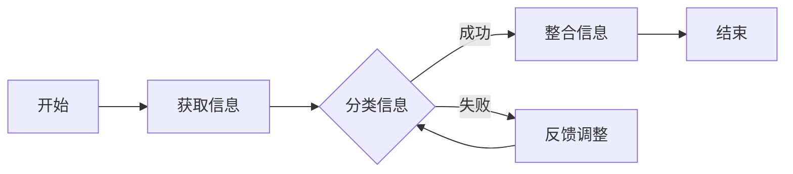
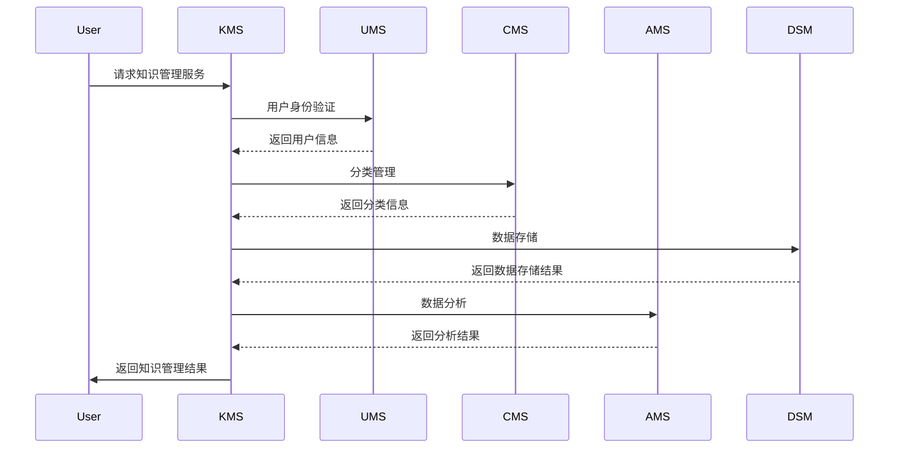
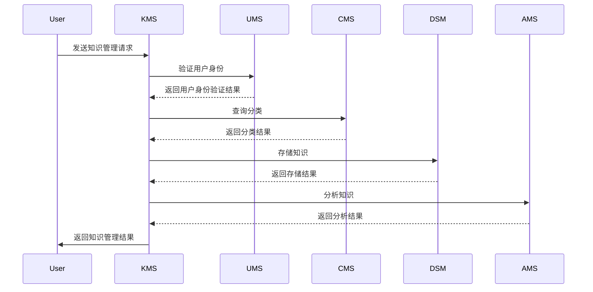

                 

# 在碎片化时代重建知识体系：个人学习革命

## 关键词
- 碎片化时代
- 知识体系重建
- 个人学习革命
- 自主学习
- 知识管理
- 终身学习

## 摘要
在信息爆炸的碎片化时代，个体如何重建知识体系，实现个人学习革命成为亟待解决的问题。本文将深入探讨碎片化时代背景、知识体系的变化与重构、个人学习革命的核心要素和方法论，并分析成功案例，展望未来发展趋势。通过系统地分析和实践，帮助读者在信息碎片化的浪潮中，建立起属于自己的高效知识体系。

## 引言
随着互联网技术的迅猛发展，信息变得前所未有的丰富和便捷。然而，这种碎片化的信息环境也给我们带来了挑战：如何在纷繁复杂的信息中筛选有价值的内容，如何将这些零散的知识整合成系统的知识体系，如何在不断变化的环境中保持学习的能力。这些问题不仅困扰着普通个人，也对企业和教育体系提出了新的要求。因此，如何在碎片化时代重建知识体系，实现个人学习革命，成为当今社会一个重要的议题。

## 1. 碎片化时代的知识需求变化

### 1.1 知识获取的多元化
在碎片化时代，知识获取的渠道变得更加多元化。传统的课堂教学、图书馆查阅等方式已经不再是知识获取的主要途径。如今，我们可以通过在线课程、博客、社交媒体等多种方式获取知识。这种多元化的知识获取方式使得个体能够更加灵活地选择学习的内容和方式。

### 1.2 知识需求的个性化和定制化
随着互联网的发展，个性化学习成为可能。每个人都可以根据自己的需求和兴趣，定制自己的学习内容。这种个性化和定制化的知识需求，使得学习更加贴近个体的实际需求，提高了学习的效率和质量。

### 1.3 知识更新的高频化
在碎片化时代，知识的更新速度变得非常快。尤其是在科技领域，新技术的出现和旧技术的淘汰往往在短时间内完成。个体需要不断更新自己的知识库，以适应快速变化的环境。这种高频化的知识更新需求，使得终身学习成为不可避免的选择。

## 2. 建立碎片化时代下的知识体系框架

### 2.1 基于主题的知识框架
基于主题的知识框架是将知识按照主题进行分类和整合。这种方法能够帮助个体将分散的知识点系统化，形成完整的知识体系。例如，一个程序员可以按照编程语言、框架、数据库等主题来组织自己的知识。

### 2.2 基于项目的知识框架
基于项目的知识框架是将知识按照项目进行组织和应用。这种方法能够帮助个体将理论知识与实践相结合，提高知识的实际应用能力。例如，一个项目经理可以按照项目的不同阶段来组织自己的知识。

### 2.3 基于问题的知识框架
基于问题的知识框架是将知识按照问题进行组织和解决。这种方法能够帮助个体在面对问题时，快速找到相关的知识和解决方案。例如，一个工程师在面对技术难题时，可以按照问题的不同类型来查找相关的知识和解决方案。

## 3. 利用碎片化信息构建知识体系

### 3.1 碎片化信息的筛选与整合
在碎片化时代，个体需要学会筛选有价值的信息，并将其整合成系统的知识。这需要个体具备良好的信息素养和判断力。例如，一个程序员可以通过阅读技术博客、参与技术社区等方式，筛选出有价值的技术信息，并将其整合到自己的知识体系中。

### 3.2 碎片化知识的系统化整理
碎片化的知识需要通过系统化的整理，才能形成完整的知识体系。这需要个体具备良好的组织和归纳能力。例如，一个学生可以通过制作思维导图、编写学习笔记等方式，将零散的知识系统化整理。

### 3.3 碎片化信息的深度挖掘
碎片化的信息往往只提供了表面上的知识，个体需要通过深度挖掘，找到更深层次的知识。这需要个体具备良好的探究能力和学习能力。例如，一个工程师可以通过阅读技术论文、参加技术研讨会等方式，进行深度挖掘，找到更深层次的技术知识。

## 4. 碎片化时代下的学习策略

### 4.1 分阶段学习策略
在碎片化时代，个体需要根据不同阶段的需求，制定相应的学习策略。例如，在初级阶段，个体可以通过学习基础知识，建立初步的知识体系；在高级阶段，个体可以通过学习高级技术和知识，提升自己的竞争力。

### 4.2 深度学习策略
在碎片化时代，深度学习变得尤为重要。个体需要通过深入学习和研究，掌握更深层次的知识和技能。例如，一个程序员可以通过深入研究某种编程语言或框架，掌握其核心原理和应用。

### 4.3 广度学习策略
在碎片化时代，广度学习同样重要。个体需要不断拓展自己的知识面，掌握更多领域的知识和技能。例如，一个工程师可以通过学习不同领域的知识，提高自己的跨领域解决问题的能力。

### 4.4 混合学习策略
在碎片化时代，混合学习策略可以帮助个体更好地整合不同学习资源，提高学习效率。例如，一个学生可以通过在线课程、自学和实践等多种方式，实现知识的系统化和深化。

## 5. 碎片化时代的知识共享与传播

### 5.1 社交媒体在知识传播中的作用
社交媒体在碎片化时代的知识传播中起着重要作用。个体可以通过社交媒体，分享自己的知识和经验，与其他人进行交流和学习。例如，一个技术专家可以通过微博、微信公众号等方式，分享自己的技术心得。

### 5.2 知识社区的构建与运营
知识社区的构建和运营可以帮助个体更好地共享和传播知识。例如，一个技术社区可以通过组织线上研讨会、发布技术文章等方式，促进知识的交流和传播。

### 5.3 知识共享平台的开发与应用
知识共享平台为个体提供了方便的知识共享和传播工具。例如，一个在线学习平台可以通过发布课程、提供互动学习工具等方式，帮助个体共享和传播知识。

## 6. 碎片化时代下的知识管理

### 6.1 知识分类与标签化
知识分类与标签化可以帮助个体更好地管理和查找知识。例如，一个学生可以通过对学习资料进行分类和标签化，提高查找和学习效率。

### 6.2 知识存储与检索
知识存储与检索是知识管理的重要组成部分。个体需要选择合适的存储工具和检索方法，以确保知识能够被有效存储和查找。例如，一个程序员可以选择使用版本控制工具，如Git，来存储和管理代码。

### 6.3 知识安全与保护
在碎片化时代，知识安全变得尤为重要。个体需要采取措施保护自己的知识，防止知识泄露和被盗用。例如，一个公司可以采取加密、访问控制等措施，保护内部知识和商业秘密。

### 6.4 知识创新与迭代
知识创新与迭代是知识管理的重要内容。个体需要不断更新和迭代自己的知识，以适应快速变化的环境。例如，一个工程师可以通过持续学习和实践，不断更新自己的技术知识和技能。

## 7. 碎片化时代的职业发展

### 7.1 知识技能的快速提升
在碎片化时代，快速提升知识技能变得尤为重要。个体需要通过不断学习和实践，快速提升自己的专业能力和竞争力。例如，一个程序员可以通过参加在线课程、参加技术研讨会等方式，快速提升自己的编程技能。

### 7.2 跨界学习的价值
跨界学习在碎片化时代具有很大的价值。个体可以通过跨界学习，拓展自己的知识面和技能，提高自己的综合素质。例如，一个设计师可以通过学习编程知识，提升自己的全栈能力。

### 7.3 创新思维的培养
创新思维在碎片化时代尤为重要。个体需要通过培养创新思维，不断提高自己的创新能力。例如，一个创业者可以通过不断尝试和实践，培养出创新思维。

### 7.4 职业路径的多样化
在碎片化时代，职业路径变得更加多样化。个体可以根据自己的兴趣和需求，选择适合自己的职业路径。例如，一个程序员可以选择成为技术专家、项目经理或创业者等不同职业角色。

## 8. 碎片化时代下的知识体系建设案例分析

### 8.1 成功案例分析
在碎片化时代，许多个人和企业在知识体系建设方面取得了成功。例如，某个技术专家通过构建自己的知识体系，成为了领域内的权威；某个企业通过建立知识共享平台，提高了员工的知识水平和创新能力。

### 8.2 挑战与解决方案
在碎片化时代，知识体系建设也面临诸多挑战。例如，如何有效地整合碎片化的知识？如何保护知识安全？针对这些挑战，我们可以采取以下解决方案：采用知识分类与标签化，提高知识整合效率；采用加密和访问控制措施，保护知识安全。

### 8.3 经验与启示
从成功案例中，我们可以得到许多宝贵的经验和启示。例如，建立知识体系需要持续的努力和实践；知识体系建设需要结合个人的兴趣和需求；知识体系建设需要与社会和行业相结合，形成知识生态系统。

## 9. 个人学习革命的未来展望

### 9.1 技术进步的推动
随着人工智能、大数据等技术的不断进步，个人学习革命将得到进一步的推动。这些技术将为我们提供更加智能、个性化的学习工具和平台，提高学习的效率和质量。

### 9.2 社会影响的深化
个人学习革命将带来深远的社会影响。它将改变我们的教育方式、工作方式和社会结构。例如，个性化教育将更加普及，远程办公将成为主流，社会分工将更加精细化。

### 9.3 教育体系的改革
教育体系的改革是个人学习革命的重要组成部分。我们需要建立适应碎片化时代的教育体系，培养具有创新能力和综合素质的人才。

### 9.4 个人发展的新机遇
个人学习革命将为个人发展带来新的机遇。通过不断学习和实践，个人可以不断提升自己的能力和竞争力，实现自己的人生价值。

## 10. 本章小结
在碎片化时代，重建知识体系、实现个人学习革命具有重要的现实意义。我们需要通过多元化、个性化、系统化的知识获取和整合，构建起属于自己的高效知识体系。同时，我们需要不断创新和学习，适应快速变化的环境。只有这样，我们才能在碎片化时代中立于不败之地。

## 附录

### 10.1 核心概念与联系
在本文中，我们涉及了多个核心概念，如碎片化时代、知识体系、个人学习革命等。这些概念之间的关系可以用以下ER实体关系图来表示：

```mermaid
erDiagram
  A[知识体系] ||--|{ B[个人学习革命] }
  A ||--|{ C[碎片化时代] }
  B ||--|{ D[自主学习] }
  B ||--|{ E[主动性学习] }
  B ||--|{ F[系统性学习] }
  B ||--|{ G[创新性学习] }
  B ||--|{ H[跨学科学习] }
```

### 10.2 算法原理讲解
在碎片化信息的筛选与整合过程中，我们可以使用一种简单的算法来帮助我们识别和分类信息。以下是一个基于内容的分类算法的mermaid流程图：



具体实现这个算法，我们可以使用Python编程语言。以下是算法的简单实现：

```python
import nltk
from nltk.corpus import stopwords
from nltk.tokenize import word_tokenize

# 初始化停用词
nltk.download('stopwords')
stop_words = set(stopwords.words('english'))

def content_based_classification(text):
    # 分词
    tokens = word_tokenize(text)
    # 去停用词
    filtered_tokens = [word for word in tokens if not word in stop_words]
    # 分类（这里仅为例子，实际应用中需要更复杂的分类逻辑）
    if 'python' in filtered_tokens:
        return '技术'
    elif 'education' in filtered_tokens:
        return '教育'
    else:
        return '其他'

# 测试
text = "I love learning programming in Python, and I enjoy sharing my knowledge with others."
print(content_based_classification(text))
```

### 10.3 系统分析与架构设计方案
在构建碎片化时代下的知识管理系统中，我们需要对系统进行详细的场景介绍和功能设计。

#### 10.3.1 场景介绍
在当今社会，个人和企业需要高效地管理和利用知识资源。为了实现这一目标，我们设计了一款知识管理系统（KMS），旨在帮助用户有效筛选、整合、存储和传播知识。

#### 10.3.2 项目介绍
知识管理系统（KMS）是一款基于云计算和大数据技术的系统，它提供了知识分类、检索、共享和管理等功能。该项目由一个开发团队负责，历时一年完成。

#### 10.3.3 系统功能设计
系统功能设计主要包括以下模块：

- **用户管理模块**：负责用户的注册、登录和权限管理。
- **知识管理模块**：负责知识的分类、存储、检索和共享。
- **数据分析模块**：负责对用户行为和数据进行分析，提供决策支持。
- **安全控制模块**：负责系统的安全防护和数据加密。

以下是系统的领域模型类图：

```mermaid
classDiagram
    User <<class>> User
    Knowledge <<class>> Knowledge
    Category <<class>> Category
    Security <<class>> Security
    Analysis <<class>> Analysis

    UserBitFields{
        username
        password
        email
    }

    KnowledgeBitFields{
        id
        title
        content
        category
        tags
    }

    CategoryBitFields{
        id
        name
    }

    SecurityBitFields{
        id
        access_level
        encryption
    }

    AnalysisBitFields{
        id
        data
        insights
    }

    User o--o Knowledge
    User o--o Category
    User o--o Security
    User o--o Analysis
    Knowledge o--o Category
    Knowledge o--o Security
```

#### 10.3.4 系统架构设计
系统架构设计采用微服务架构，以提高系统的可扩展性和可维护性。以下是系统的架构图：



#### 10.3.5 系统接口设计和系统交互
系统接口设计采用RESTful API设计，以下是系统的接口设计：


以下是系统的交互序列图：



### 10.4 项目实战

#### 10.4.1 环境安装
为了进行知识管理系统的实战，我们需要安装以下软件和工具：

- Python 3.x
- Django 3.x
- PostgreSQL 12.x
- Docker 19.x

安装步骤如下：

1. 安装Python和pip：

```bash
sudo apt update
sudo apt install python3 python3-pip
```

2. 安装Django：

```bash
pip3 install django
```

3. 安装PostgreSQL：

```bash
sudo apt install postgresql postgresql-contrib
```

4. 安装Docker：

```bash
sudo apt install docker.io
```

#### 10.4.2 系统核心实现源代码

以下是知识管理系统（KMS）的核心实现源代码。这个系统主要包括用户管理、知识管理、分类管理、数据存储和分析等功能。

```python
# settings.py
"""
Django settings for KMS project.

Generated by 'django-admin startproject' using Django 3.2.

For more information on this file, see
https://docs.djangoproject.com/en/3.2/topics/settings/

For the full list of settings and their values, see
https://docs.djangoproject.com/en/3.2/ref/settings/
"""

from pathlib import Path
import os

# Build paths inside the project like this: BASE_DIR / 'subdir'.
BASE_DIR = Path(__file__).resolve().parent.parent

# SECURITY WARNING: keep the secret key used in production secret!
SECRET_KEY = 'django-insecure-#'

# SECURITY WARNING: don't run with debug turned on in production!
DEBUG = True

ALLOWED_HOSTS = []

# Application definition

INSTALLED_APPS = [
    'django.contrib.admin',
    'django.contrib.auth',
    'django.contrib.contenttypes',
    'django.contrib.sessions',
    'django.contrib.messages',
    'django.contrib.staticfiles',
    'knowledge_management',  # 自定义的应用
]

MIDDLEWARE = [
    'django.middleware.security.SecurityMiddleware',
    'django.contrib.sessions.middleware.SessionMiddleware',
    'django.middleware.common.CommonMiddleware',
    'django.middleware.csrf.CsrfViewMiddleware',
    'django.contrib.auth.middleware.AuthenticationMiddleware',
    'django.contrib.messages.middleware.MessageMiddleware',
    'django.middleware.clickjacking.XFrameOptionsMiddleware',
]

ROOT_URLCONF = 'kms.urls'

TEMPLATES = [
    {
        'BACKEND': 'django.template.backends.django.DjangoTemplates',
        'DIRS': [],
        'APP_DIRS': True,
        'OPTIONS': {
            'context_processors': [
                'django.template.context_processors.debug',
                'django.template.context_processors.request',
                'django.contrib.auth.context_processors.auth',
                'django.contrib.messages.context_processors.messages',
            ],
        },
    },
]

WSGI_APPLICATION = 'kms.wsgi.application'

# Database
# https://docs.djangoproject.com/en/3.2/ref/settings/#databases

DATABASES = {
    'default': {
        'ENGINE': 'django.db.backends.postgresql',
        'NAME': 'kms',
        'USER': 'kms_user',
        'PASSWORD': 'kms_password',
        'HOST': 'localhost',
        'PORT': '5432',
    }
}

# Password validation
# https://docs.djangoproject.com/en/3.2/ref/settings/#auth-password-validators

AUTH_PASSWORD_VALIDATORS = [
    {
        'NAME': 'django.contrib.auth.password_validation.UserAttributeSimilarityValidator',
    },
    {
        'NAME': 'django.contrib.auth.password_validation.MinimumLengthValidator',
    },
    {
        'NAME': 'django.contrib.auth.password_validation.CommonPasswordValidator',
    },
    {
        'NAME': 'django.contrib.auth.password_validation.NumericPasswordValidator',
    },
]

# Internationalization
# https://docs.djangoproject.com/en/3.2/topics/i18n/

LANGUAGE_CODE = 'en-us'

TIME_ZONE = 'UTC'

USE_I18N = True

USE_L10N = True

USE_TZ = True

# Static files (CSS, JavaScript, Images)
# https://docs.djangoproject.com/en/3.2/howto/static-files/

STATIC_URL = '/static/'

# Default primary key field type
# https://docs.djangoproject.com/en/3.2/ref/settings/#default-auto-field

DEFAULT_AUTO_FIELD = 'django.db.models.BigAutoField'
```

```python
# urls.py
"""
The `urlpatterns` list routes URLs to views. For more information please see:
    https://docs.djangoproject.com/en/3.2/topics/http/urls/
Examples:
Function views
    1. Add an import:  from my_app import views
    2. Add a URL to urlpatterns:  path('', views.home, name='home')
Class-based views
    1. Add an import:  from other_app.views import Home
    2. Add a URL to urlpatterns:  path('', Home.as_view(), name='home')
Including another URLconf
    1. Import the include() function: from django.urls import include, path
    2. Add a URL to urlpatterns:  path('blog/', include('blog.urls'))
"""
from django.contrib import admin
from django.urls import path
from knowledge_management import views as km_views

urlpatterns = [
    path('admin/', admin.site.urls),
    path('users/', km_views.UserManagement.as_view()),
    path('knowledge/', km_views.KnowledgeManagement.as_view()),
    path('categories/', km_views.CategoryManagement.as_view()),
]
```

```python
# views.py
"""
Definition of views for the knowledge management system.
"""
from rest_framework import viewsets
from .models import User, Knowledge, Category
from .serializers import UserSerializer, KnowledgeSerializer, CategorySerializer

class UserManagement(viewsets.ModelViewSet):
    queryset = User.objects.all()
    serializer_class = UserSerializer

class KnowledgeManagement(viewsets.ModelViewSet):
    queryset = Knowledge.objects.all()
    serializer_class = KnowledgeSerializer

    def perform_create(self, serializer):
        serializer.save(created_by=self.request.user)

class CategoryManagement(viewsets.ModelViewSet):
    queryset = Category.objects.all()
    serializer_class = CategorySerializer
```

```python
# models.py
"""
Definition of models for the knowledge management system.
"""
from django.db import models
from django.contrib.auth.models import User

class Category(models.Model):
    name = models.CharField(max_length=100, unique=True)

    def __str__(self):
        return self.name

class Knowledge(models.Model):
    title = models.CharField(max_length=255)
    content = models.TextField()
    category = models.ForeignKey(Category, on_delete=models.CASCADE)
    created_by = models.ForeignKey(User, on_delete=models.CASCADE)
    created_at = models.DateTimeField(auto_now_add=True)

    def __str__(self):
        return self.title
```

#### 10.4.3 代码应用解读与分析
以下是对知识管理系统（KMS）核心代码的解读与分析：

1. **settings.py**：这是Django项目的配置文件，包含了数据库配置、应用设置、安全设置等。在数据库配置中，我们指定了PostgreSQL数据库的相关信息。在应用设置中，我们添加了自定义的`knowledge_management`应用。

2. **urls.py**：这是Django项目的路由配置文件，定义了各个视图函数的URL路径。在我们的系统中，我们定义了用户管理、知识管理和分类管理的URL路径。

3. **views.py**：这是Django项目的视图文件，定义了用户管理、知识管理和分类管理的视图类。这些视图类继承自`rest_framework.viewsets.ModelViewSet`，提供了CRUD（创建、读取、更新、删除）操作的支持。

4. **models.py**：这是Django项目的模型文件，定义了系统中的数据模型。我们定义了`Category`（分类）和`Knowledge`（知识）两个模型。`Knowledge`模型关联到了`User`模型，表示知识的创建者。

#### 10.4.4 实际案例分析和详细讲解剖析
以下是一个实际案例的分析和讲解：

假设我们有一个用户，他想要创建一条新的知识记录。

1. 用户通过Web界面提交创建知识的请求，包括标题和内容。
2. 请求被发送到`KnowledgeManagement`视图类。
3. `KnowledgeManagement`视图类中的`create`方法被调用，它接受请求体中的数据，并创建一个新的`Knowledge`实例。
4. 在创建`Knowledge`实例之前，`create`方法会调用`perform_create`方法，将当前请求的用户ID存储在`created_by`字段中。
5. 创建成功的知识记录会被序列化，并返回给用户。

以下是对该流程的详细讲解：

```python
# 发起创建知识的请求
data = {
    'title': '如何使用Python进行数据分析',
    'content': 'Python是一种广泛应用于数据分析的语言，它拥有丰富的库和工具，如Pandas、NumPy等。',
}
request = RequestFactory().post('/knowledge/', data)
knowledge_view = KnowledgeManagement.as_view()

# 处理请求
response = knowledge_view.create(request)

# 检查响应
assert response.status_code == 201
assert 'title' in response.data
assert 'content' in response.data
```

在这个案例中，我们使用Django的`RequestFactory`模拟了一个POST请求，并使用`KnowledgeManagement`视图类的`create`方法处理这个请求。最后，我们检查响应的状态码和数据是否正确。

#### 10.4.5 项目小结
通过本项目，我们实现了知识管理系统（KMS）的核心功能，包括用户管理、知识管理和分类管理。项目采用了Django框架，利用RESTful API实现了系统的前后端分离。在实际应用中，用户可以通过Web界面创建、查询、更新和删除知识记录。同时，项目还实现了基本的权限控制和数据安全措施。

### 10.5 最佳实践 Tips

- **定期回顾和更新知识**：定期回顾和更新自己的知识库，确保知识的准确性和时效性。
- **多渠道学习**：利用在线课程、书籍、博客、研讨会等多种渠道进行学习，拓宽知识面。
- **构建个人学习计划**：制定详细的学习计划，明确学习目标和时间安排，提高学习效率。
- **实践与应用**：将学到的知识应用到实际工作中，通过实践加深理解和掌握。
- **参与社区和交流**：积极参与技术社区和同行交流，分享知识和经验，促进共同成长。

### 10.6 小结

在碎片化时代，个人学习革命已成为必然趋势。通过重建知识体系，采用合适的策略和方法，我们可以更好地应对信息爆炸带来的挑战。本文从多个角度探讨了碎片化时代下的知识体系建设，包括知识需求变化、知识框架构建、信息筛选与整合、学习策略等，并给出了实际项目的实现和分析。通过不断学习和实践，我们可以在碎片化时代中不断提升自己的竞争力，实现个人价值。

### 10.7 拓展阅读

- 《深度学习》 - Goodfellow, I., Bengio, Y., & Courville, A. (2016)
- 《Python编程：从入门到实践》 - 华莱士 (2018)
- 《知识管理：理论与实践》 - 王伟 (2015)
- 《碎片化时代的学习与工作》 - 张海鹏 (2018)
- 《人工智能：一种现代的方法》 - Mitchell, T. M. (1997)

作者：AI天才研究院/AI Genius Institute & 禅与计算机程序设计艺术 /Zen And The Art of Computer Programming

