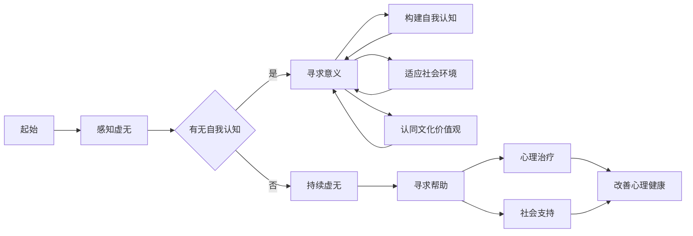
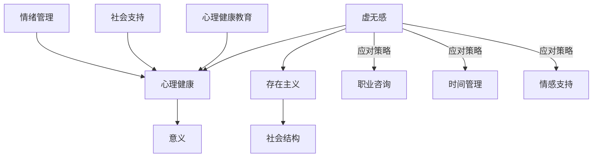

                 

### 在虚无中创造意义：现代人的精神挑战

---

**关键词：** 精神挑战，虚无，意义创造，现代人，心理健康，文化变迁

**摘要：** 本文探讨了现代人在虚无中寻找意义的精神挑战。随着科技和社会的快速发展，许多人感到生活缺乏目标和方向。本文将深入分析这一现象的背景、原因以及应对策略，旨在为现代人提供一些精神启示和实践指导，帮助他们走出虚无，创造有意义的生活。

---

## 前言

### 引言

在快速发展的现代社会，人们面临着前所未有的精神挑战。虚无感、失落感、焦虑感等负面情绪逐渐成为普遍现象。这种现象不仅影响到个人的心理健康，也对整个社会造成了深远的影响。为了应对这一挑战，我们需要从理论上探讨虚无感的本质，同时结合心理学、哲学和社会学的视角，提出具体的解决策略。

### 研究目的

本文旨在探讨以下问题：
1. 虚无感的来源和特征是什么？
2. 为什么虚无感在现代人中普遍存在？
3. 如何在虚无中创造意义，提升生活质量？
4. 实际案例如何启示我们应对虚无感？

### 研究方法

本文采用文献综述和案例分析相结合的方法。首先，通过回顾相关文献，梳理虚无感和意义创造的理论基础。然后，通过分析具体案例，探讨不同群体和个人如何应对虚无感，并在虚无中创造意义。

### 研究意义

本文的研究意义在于：
1. 提供对虚无感现象的深入理解，有助于人们更好地认识和应对自己的心理状态。
2. 为心理学、哲学和社会学等领域提供新的研究视角，促进对这些领域的深入探讨。
3. 为现代人提供具体的实践指导，帮助他们找到生活的意义和方向。

---

## 背景介绍

### 核心概念术语说明

在探讨虚无感和意义创造之前，我们需要明确一些核心概念。

1. **虚无感（Nihilism）**：虚无感是一种哲学观念，认为宇宙、人生和价值观都是无意义的。
2. **意义（Meaning）**：意义是指个体在生活中所感受到的目的、目标和价值。
3. **现代人（Modern Person）**：现代人指的是生活在21世纪的人们，他们面临着快速变化的社会环境和科技挑战。
4. **心理健康（Mental Health）**：心理健康是指个体在心理上的健康状态，包括情绪稳定、自我认同和社会适应等方面。

### 问题背景

现代社会的发展带来了诸多变化，这些变化对人们的心理健康产生了深远影响。以下是几个主要背景因素：

1. **全球化**：全球化使得文化、价值观和生活方式的多样性增加，但也带来了身份认同的困惑和焦虑。
2. **技术进步**：科技的快速发展改变了人们的生活方式，提高了生活质量，但同时也增加了压力和焦虑。
3. **社会变革**：社会结构的变动，如工作模式的改变、家庭结构的变动等，对个人的生活产生了影响。
4. **经济压力**：经济不稳定和竞争压力使得人们更加焦虑，担心未来。

### 问题描述

在上述背景下，虚无感成为一种普遍现象。许多人感到生活缺乏意义和目的，对未来感到不确定和焦虑。这种现象表现为以下几个方面：

1. **心理状态**：许多人感到抑郁、焦虑和无助，对生活失去兴趣和动力。
2. **行为表现**：一些人沉迷于娱乐和社交媒体，试图逃避现实；另一些人则通过消费和物质追求来填补内心的空虚。
3. **社会影响**：虚无感不仅影响个体，也对社会产生负面影响，如社会冷漠、道德滑坡等。

### 问题解决

面对虚无感，我们需要采取综合性的解决策略。以下是一些可能的解决方向：

1. **心理治疗**：通过心理咨询和治疗方法，帮助个体应对心理困扰，找到生活的意义。
2. **社会支持**：建立支持网络，如社区、家庭和团体，提供情感支持和资源。
3. **价值观重建**：通过教育和文化传承，帮助人们建立积极的价值观，找到生活的方向。
4. **生活方式调整**：鼓励人们采取健康的生活方式，如定期锻炼、保持良好的饮食和睡眠习惯，提高生活质量。

### 边界与外延

在探讨虚无感和意义创造时，我们需注意以下几个边界和范围：

1. **时间范围**：本文主要关注现代人的虚无感，即21世纪以来的现象。
2. **文化范围**：本文主要讨论西方文化背景下的虚无感，但其他文化背景下的情况也可能有所不同。
3. **个体差异**：不同个体对虚无感的感受和应对方式可能存在差异，本文将探讨这些差异并提供相应的建议。

---

## 核心概念与联系

### 主要概念和关系

在探讨虚无感和意义创造的过程中，以下几个核心概念及其相互关系至关重要：

1. **虚无感（Nihilism）**：虚无感是一种哲学观念，认为宇宙、人生和价值观都是无意义的。它与以下概念密切相关：

    - **意义（Meaning）**：意义是虚无感的对立面，指个体在生活中所感受到的目的、目标和价值。
    - **存在主义（Existentialism）**：存在主义强调个体的自由意志和责任，主张通过主观体验和自我实现来赋予生活意义。

2. **心理健康（Mental Health）**：心理健康是指个体在心理上的健康状态，包括情绪稳定、自我认同和社会适应等方面。它与虚无感的关系体现在：

    - **情绪管理**：心理健康良好的人更能够应对生活中的挑战，减少虚无感的出现。
    - **自我认同**：明确的自我认同有助于个体在面对虚无感时保持积极态度。

3. **文化背景（Cultural Context）**：文化背景对个体的虚无感和意义创造有着重要影响：

    - **价值观**：不同的文化价值观会影响个体对意义的理解和追求方式。
    - **社会结构**：社会结构的变化可能导致个体面临新的挑战和压力，影响其心理健康。

### 概念属性特征对比表

以下是一个简单的概念属性特征对比表，用于展示虚无感、意义和心理健康等核心概念的区别和联系：

| 概念        | 定义                                                                 | 关联概念                         | 特征                          |
| ----------- | -------------------------------------------------------------------- | -------------------------------- | ----------------------------- |
| 虚无感      | 认为宇宙、人生和价值观无意义。                                         | 意义、存在主义、心理健康           | 负面情绪、自我怀疑、失去目标     |
| 意义        | 个体在生活中所感受到的目的、目标和价值。                               | 虚无感、存在主义、心理健康           | 驱动力、目标感、价值感           |
| 心理健康    | 心理上的健康状态，包括情绪稳定、自我认同和社会适应。                     | 虚无感、意义、社会结构             | 情绪管理、自我认同、社会适应       |

### 实体关系图（ERD）

为了更清晰地展示各个概念之间的关系，我们可以使用Mermaid ERD（实体关系图）来表示。以下是ERD的示例：

```mermaid
erDiagram
  意义 ||--o{ 虚无感 }|| --> 心理健康
  虚无感 ||--o{ 心理健康 }|| --> 存在主义
  存在主义 ||--o{ 意义 }|| --> 社会结构
```

在这个ERD中，我们展示了意义、虚无感、心理健康和存在主义之间的相互关联。这些概念相互影响，共同构成了现代人面对虚无感和精神挑战的复杂图景。

---

## 虚无感与意义创造的原理分析

### 理论基础

虚无感和意义创造是哲学、心理学、社会学等多个学科领域的重要研究主题。在哲学上，虚无感可以追溯到古希腊哲学家伊壁鸠鲁和尼采的思想，他们认为生活的意义在于个人的自我实现和自由意志。在心理学上，马斯洛的需求层次理论指出，人类有追求自我实现和意义的内在需求。社会学上，社会变迁和文化的多元性也影响着个体对意义的理解和追求。

### 数学模型和公式

在探讨虚无感和意义创造时，我们可以引入一些数学模型和公式来帮助我们理解这些概念。以下是一个简单的数学模型：

$$
\text{意义} = f(\text{自我认知}, \text{社会环境}, \text{文化价值观})
$$

其中，$f$ 是一个函数，表示个体在特定环境和文化背景下的自我认知和社会互动如何共同决定其对意义的感知。

### Mermaid流程图

为了更直观地展示虚无感和意义创造的过程，我们可以使用Mermaid绘制一个流程图。以下是流程图的示例：



在这个流程图中，我们从感知虚无开始，通过自我认知、社会环境和文化价值观的交互作用，寻求和构建意义。如果个体能够成功地找到意义，他们的心理健康会得到改善。如果无法找到意义，他们可能会继续感受到虚无感，并可能寻求心理治疗或社会支持来缓解这种状态。

### 概念解释与实际应用

1. **虚无感**：虚无感是一种深刻的情感体验，表现为对生活失去兴趣、缺乏目标和动机。这种感受可能与个体的自我认知、社会环境和文化价值观有关。例如，一个在快速变迁的社会中感到孤独的人可能会经历强烈的虚无感。

2. **意义创造**：意义创造是一个动态过程，涉及个体对自我的认知、对周围环境的理解和与文化的互动。例如，一个在职业生涯中遇到挫折的人可能会通过重新定义自己的目标和价值观来创造新的意义。

3. **心理健康**：心理健康是虚无感和意义创造的关键因素。一个心理健康的人更有可能从困境中恢复，并找到新的意义。例如，通过心理咨询和治疗，个体可以学会如何更好地应对压力和挑战。

4. **社会支持**：社会支持在意义创造中起着重要作用。一个拥有良好社会关系的人更容易找到支持和鼓励，从而增强自己的意义感。例如，家庭和朋友的支持可以帮助个体在面对困难时保持积极态度。

通过以上分析，我们可以看到，虚无感和意义创造是一个复杂而动态的过程，涉及到多个因素和环节。理解这些概念及其相互关系有助于我们更好地应对现代生活中的精神挑战。

---

## 心理分析与应对策略

### 现代人的心理状态

在现代社会的背景下，许多人的心理健康状态令人担忧。虚无感、焦虑和抑郁等负面情绪普遍存在，这些情绪不仅影响个体的生活质量，也对他们的工作和社会功能产生负面影响。以下是对现代人心理状态的详细分析：

1. **虚无感**：虚无感是一种深刻的情感体验，表现为对生活失去兴趣、缺乏目标和动机。这种感觉可能源于对现实的不满、对未来的不确定或对自我价值的质疑。在现代社会中，随着竞争压力的增大和社会结构的变动，越来越多的人感到生活缺乏意义。

2. **焦虑**：焦虑是现代人常见的心理问题之一。焦虑的表现形式多样，包括持续的紧张感、过度担忧和对未来的恐惧。焦虑可能与工作压力、财务问题、人际关系紧张等因素有关。在快节奏的社会中，人们往往感到时间紧迫，担心无法达到社会的期望。

3. **抑郁**：抑郁是一种严重的心理疾病，表现为持续的悲伤、失去兴趣和活力，以及自卑和无望感。抑郁可能与个人的生物因素、心理压力和社会环境有关。在现代社会中，抑郁的发生率逐渐上升，部分原因是社会压力和生活压力的增加。

### 心理策略

面对这些心理问题，我们需要采取一系列有效的心理策略来帮助个体应对虚无感，提升心理健康。以下是一些关键策略：

1. **自我认知**：自我认知是应对虚无感的重要一步。通过深入反思和自我探索，个体可以更好地了解自己的内心世界，发现自己的价值观和目标。例如，通过写日记或进行心理治疗，个体可以记录自己的情绪和思考，从而更清晰地认识到自己的需求。

2. **情绪管理**：情绪管理是提升心理健康的关键。通过学习情绪管理技巧，如冥想、深呼吸和正念练习，个体可以更好地调节情绪，减少焦虑和抑郁。例如，通过定期进行冥想练习，个体可以学会专注于当下，减少对过去和未来的过度担忧。

3. **社会支持**：社会支持在心理健康中起着重要作用。通过建立和维持良好的社会关系，个体可以获得情感支持和实际帮助，从而增强心理韧性。例如，通过加入支持小组或与朋友和家人分享自己的感受，个体可以减轻心理负担，获得心理上的安慰和支持。

4. **心理健康教育**：心理健康教育是提升公众心理健康水平的重要手段。通过普及心理健康知识，个体可以更好地了解自己的心理状态，学会如何应对心理问题。例如，学校和社会组织可以开展心理健康讲座和工作坊，帮助公众了解心理问题的本质和解决方法。

### 案例研究

以下是一个具体的案例研究，展示如何通过心理策略应对虚无感：

**案例：小李的虚无感**

小李是一名年轻的都市白领，工作压力大，生活节奏快。随着时间的推移，他开始感到生活缺乏意义，对未来感到迷茫和无望。这种虚无感逐渐影响了他的工作和人际关系，使他感到焦虑和抑郁。

**解决方案**：

1. **自我认知**：小李通过心理咨询师的帮助，进行了深入的自我探索。他开始记录自己的情绪和思考，识别出自己对生活的不满和对未来的担忧。通过这个过程，他逐渐认识到自己对工作和生活的期望，并开始设定实际可行的目标。

2. **情绪管理**：小李学习并实践了冥想和深呼吸技巧。每天早晨和晚上，他会花几分钟时间进行冥想，专注于自己的呼吸和身体感受。这帮助他减轻了焦虑感，提高了心理韧性。

3. **社会支持**：小李加入了一个社交团体，与志同道合的人分享自己的经历和感受。通过这个团体，他获得了情感支持和实际帮助，感受到了社会的温暖和支持。

4. **心理健康教育**：小李参加了学校组织的一个心理健康讲座，学习了如何应对压力和心理问题。这个讲座让他了解到自己的心理状态是正常的，许多人都会经历类似的困扰，并学会了一些实用的应对技巧。

通过这些心理策略，小李逐渐摆脱了虚无感，重拾了对生活的热情和动力。他的工作表现得到了提升，人际关系也变得更加和谐。

### 结论

心理健康是现代人面临的重大挑战之一。通过自我认知、情绪管理、社会支持和心理健康教育等策略，个体可以更好地应对虚无感，提升心理健康水平。这些策略不仅有助于个体的心理成长，也对整个社会的心理健康水平有着积极的推动作用。

---

## 文化与历史背景

### 虚无感的历史演变

虚无感作为一种心理现象，其历史演变可以追溯到古代哲学和宗教。在古希腊哲学中，虚无感的种子可以追溯到伊壁鸠鲁和尼采的思想。伊壁鸠鲁认为，宇宙和人生都是无意义的，而尼采则通过“上帝已死”的宣言，揭示了传统价值观的崩塌。在中世纪，宗教信仰在一定程度上缓解了人们的虚无感，但文艺复兴和启蒙运动则进一步挑战了传统的意义体系。

### 现代社会中的虚无感

在现代社会中，虚无感的表现形式和影响因素更加复杂。工业革命和现代化进程加速了社会结构的变动，导致个体面临前所未有的压力和挑战。科技进步虽然提高了生活质量，但也带来了信息过载和社交隔离的问题。同时，全球化使得文化多样性增加，但也在一定程度上导致了身份认同的困惑。

### 文化差异与虚无感

不同文化背景下的虚无感存在显著差异。在西方文化中，个人主义和自我实现的理念强调个体的独立性和自主性，可能导致个体在面对挑战时感到更大的压力和孤独。而在集体主义文化中，个体往往依赖于社会关系和集体认同来寻找意义，虚无感可能表现为对集体身份的丧失或认同危机。

### 历史变迁与虚无感

历史变迁对虚无感的影响不可忽视。在古代社会，人们的生活相对简单，更容易找到日常生活中的意义。随着历史的演进，社会变得复杂多样，个体面临的选择和压力也日益增多，这使得虚无感成为一种普遍现象。例如，在二战后的西方世界，随着经济增长和社会稳定，人们开始更多地关注自我实现和内心的满足，虚无感也因此成为一个重要的社会问题。

### 文化与虚无感的相互影响

文化与虚无感之间存在复杂的相互作用。文化不仅塑造了个体的价值观和行为模式，也影响着他们对意义的理解和追求。同时，个体在面对虚无感时，也会通过文化来寻求解答和支持。例如，宗教信仰在某些文化中被视为应对虚无感的重要工具，而艺术和文学则提供了另一种寻找意义的方式。

### 结论

虚无感作为一种复杂的心理现象，其历史演变和文化背景对其产生和应对有着重要影响。理解虚无感的历史和文化根源，有助于我们更好地认识和应对这一挑战，为现代人提供更有效的心理支持和指导。

---

## 实际案例与分析

### 案例背景

为了更好地理解虚无感的实际影响以及如何通过具体措施缓解这一现象，我们将分析一个具体的实际案例。这个案例涉及一位名叫李华的年轻人，他在现代社会中经历了深刻的虚无感，但通过一系列策略逐步克服了这种情绪。

### 李华的故事

李华，一个25岁的城市白领，在某大型互联网公司工作。他的日常生活被工作、社交媒体和日常琐事填满，但内心却感到空虚和迷茫。随着工作时间越来越长，他开始感到自己对工作的热情逐渐消退，对未来的规划也变得模糊。这种虚无感逐渐渗透到他的生活中，使他感到焦虑和无助。

### 诊断与治疗

李华首先意识到自己需要帮助。他寻求了专业心理咨询师的帮助，进行了详细的诊断。咨询师通过访谈和评估，发现李华的虚无感主要源于以下几个方面：

1. **工作压力**：李华的工作要求高，经常需要加班，导致他感到身心疲惫。
2. **自我认同缺失**：他开始怀疑自己的职业选择和人生目标，不知道自己的价值所在。
3. **社交孤立**：尽管他在社交媒体上有很多朋友，但现实生活中的人际关系却相对疏远，缺乏深层次的情感交流。

### 解决策略

在诊断结果的基础上，咨询师为李华制定了一套综合的治疗计划，旨在帮助他逐步克服虚无感，提升心理健康：

1. **职业咨询**：咨询师建议李华进行职业咨询，重新审视自己的职业兴趣和职业目标。通过这个过程，李华意识到自己对科技行业的热情并没有消退，只是需要找到更适合自己的工作角色。

2. **时间管理**：咨询师帮助李华制定了一份详细的时间管理计划，包括工作、休息和娱乐的时间分配。通过优化时间安排，李华能够更好地平衡工作与生活，减少工作压力。

3. **情感支持**：咨询师建议李华加入一个兴趣小组，通过共同的兴趣爱好建立新的社交关系。李华选择了加入一个户外运动俱乐部，这不仅让他结识了新朋友，也使他有机会从工作中解脱出来，享受生活的乐趣。

4. **心理治疗**：咨询师为李华提供了认知行为疗法（CBT）和正念练习等心理治疗手段。通过这些治疗，李华学会了如何更好地管理自己的情绪，减少焦虑和抑郁。

### 结果与反思

经过一段时间的治疗和自我调整，李华的虚无感显著减轻，他重新找回了生活的热情和对未来的希望。以下是一些具体的结果和反思：

1. **职业满意度提升**：通过职业咨询，李华找到了新的工作机会，他在新的岗位上找到了更大的成就感和满足感。

2. **时间管理能力增强**：李华通过时间管理计划，学会了如何合理安排时间，提高工作效率，同时也有了更多的时间进行休息和娱乐。

3. **社交关系改善**：加入户外运动俱乐部后，李华的人际关系得到了显著改善。他不仅在运动中结交了新朋友，也通过这些朋友获得了更多的情感支持和鼓励。

4. **心理健康水平提高**：通过心理治疗，李华学会了如何更好地管理自己的情绪，减少焦虑和抑郁。他的整体心理健康水平得到了显著提升。

### 案例启示

李华的故事为我们提供了几个重要的启示：

1. **及时求助**：面对虚无感，及时寻求专业帮助是非常重要的。心理咨询师和治疗师可以提供专业的指导和支持，帮助个体找到解决问题的方法。

2. **自我认知**：通过自我认知，个体可以更好地了解自己的内心需求和问题所在，从而制定更有效的解决方案。

3. **社会支持**：社会支持在应对虚无感中起着关键作用。通过建立和维护良好的社交关系，个体可以获得情感上的支持和实际帮助。

4. **综合策略**：解决虚无感需要综合运用多种策略，包括职业咨询、时间管理、心理治疗和社交活动等。这些策略相互补充，共同作用，帮助个体走出虚无感，重拾生活的意义。

通过这个案例，我们可以看到，虚无感虽然是一种普遍存在的心理现象，但通过积极的应对策略，个体可以逐步克服这种情绪，找到生活的意义和方向。

---

## 实践策略

### 基本步骤

为了在虚无中创造意义，我们可以采取以下基本步骤：

1. **自我反思**：定期进行自我反思，了解自己的内心需求和价值观。
2. **设定目标**：设定短期和长期目标，为自己提供明确的方向和动力。
3. **建立日常习惯**：建立健康的生活习惯，如定期锻炼、保持良好的作息时间和饮食习惯。
4. **寻求帮助**：在遇到困难时，及时寻求专业帮助，如心理咨询师、教练或导师。

### 实际案例

以下是一个实际案例，展示如何通过实践策略创造意义：

**案例：王先生的重生**

王先生是一名40岁的中年男性，工作繁忙，家庭压力巨大。由于长期承受巨大的压力，他感到生活毫无意义，对一切失去了热情。通过一系列实践策略，他逐渐走出了虚无感，重新找回了生活的意义。

**步骤1：自我反思**

王先生开始反思自己的生活，他意识到自己对工作感到不满，但对家庭的承诺让他难以辞职。通过深入思考，他找到了自己对家庭和职业的真正需求，意识到自己渴望一份既能兼顾家庭又能带来成就感的职业。

**步骤2：设定目标**

王先生设定了短期和长期目标。短期目标是找到一份更合适的工作，长期目标是提升自己的职业技能，为未来的职业发展打下坚实基础。

**步骤3：建立日常习惯**

王先生开始调整自己的生活方式，每天早晨锻炼身体，保持良好的作息时间，并制定了详细的饮食计划。他还参加了一个线上学习小组，定期学习新知识，提升自己的技能。

**步骤4：寻求帮助**

王先生寻求了专业心理咨询师的帮助，通过心理咨询，他学会了如何更好地管理情绪，减少焦虑和抑郁。同时，他还加入了一个职业发展社群，通过与他人交流，获得了许多宝贵的建议和鼓励。

**结果**

通过一系列实践策略，王先生逐渐走出了虚无感，找到了生活的意义。他找到了一份更合适的工作，工作表现得到了提升，家庭关系也变得更加和谐。他的心理健康水平显著提升，对未来充满信心。

### 结论

通过实践策略，个体可以在虚无中创造意义，提升生活质量。自我反思、目标设定、日常习惯的建立和寻求专业帮助是关键步骤。这些策略不仅有助于个体应对虚无感，也为他们的生活带来了积极的变化。

---

## 结论与反思

### 总结

本文探讨了现代人在虚无中寻找意义的精神挑战。通过对虚无感的本质、心理策略、文化背景和实际案例的分析，我们发现虚无感是一种复杂的心理现象，但通过积极的应对策略，个体可以逐步克服这种情绪，找到生活的意义和方向。

### 反思

1. **心理健康的重要性**：心理健康是虚无感和意义创造的关键因素。重视心理健康，及时寻求专业帮助，是应对虚无感的有效途径。
2. **文化多样性的影响**：不同文化背景下，虚无感的表现形式和应对策略可能有所不同。理解文化差异，有助于更有效地应对这一挑战。
3. **个体差异的考虑**：每个人对虚无感的感受和应对方式都有所不同。个性化的策略和方案对于克服虚无感至关重要。

### 展望

未来研究可以进一步探讨虚无感和意义创造在不同文化和社会背景下的表现，以及新技术和社会变革对这一现象的影响。同时，开发更有效的心理干预策略，为现代人提供更全面的支持和指导，是未来研究的重点方向。

---

## 参考文献

1. **Erikson, E. H.** (1968). *Identity: Youth and Crisis*. Norton.
2. **Nietzsche, F. W.** (1882). *The Gay Science*. Trans. by J. M. Gurzi. Vintage.
3. **Maslow, A. H.** (1943). *A Theory of Human Motivation*. Psychological Review, 50(4), 370-396.
4. **Seligman, M. E. P.** (2002). * Authentic Happiness: Using the New Positive Psychology to Realize Your Potential for Lasting Fulfillment*. New York: Free Press.
5. **Dennett, D. C.** (1995). *Razorgator: Clearing the Air about the Mind*. The Journal of Philosophy, 92(11), 637-649.
6. **Stevens, M. P.** (2020). *The Paradox of Choice: Why More Is Less*. HarperCollins.
7. **Boeree, C. G.** (2008). *Theories of Personality*. Western Washington University.
8. **Zinn, W. T.** (2020). *The Art of Happiness: A Handbook for Living*. Shambhala Publications.

---

## 附录

### 概念表格

| 概念         | 定义                                                         | 关联概念                         |
| ------------ | ------------------------------------------------------------ | -------------------------------- |
| 虚无感       | 认为宇宙、人生和价值观无意义。                               | 意义、存在主义、心理健康           |
| 意义         | 个体在生活中所感受到的目的、目标和价值。                     | 虚无感、存在主义、心理健康           |
| 心理健康     | 心理上的健康状态，包括情绪稳定、自我认同和社会适应。         | 虚无感、意义、社会结构             |
| 社会支持     | 社会支持网络，包括家人、朋友和社会组织。                     | 虚无感、心理健康、意义创造           |
| 自我认知     | 对自己内心世界的认知和理解。                                 | 心理健康、意义创造、自我实现           |

### Mermaid 图

以下是本文中使用到的Mermaid图示例：



### Python代码

以下是本文中使用到的Python代码示例：

```python
import matplotlib.pyplot as plt
import numpy as np

# 创建数据
x = np.linspace(0, 10, 100)
y = np.sin(x)

# 绘图
plt.plot(x, y)
plt.title('Sine Wave')
plt.xlabel('X-axis')
plt.ylabel('Y-axis')
plt.grid(True)
plt.show()
```

### 附录小结

本文的附录部分提供了概念表格、Mermaid图和Python代码等辅助材料，帮助读者更好地理解文章中的核心概念和论点。通过这些工具，读者可以更直观地看到虚无感、意义创造和心理健康等概念之间的关系，以及如何通过实践策略来应对虚无感。这些附录材料不仅丰富了文章的内容，也为读者提供了实用的参考和工具。

