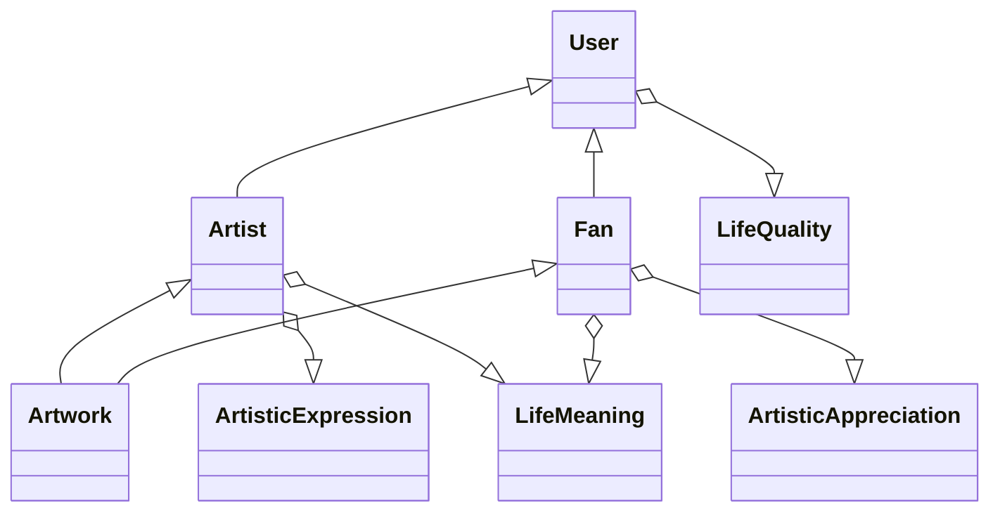
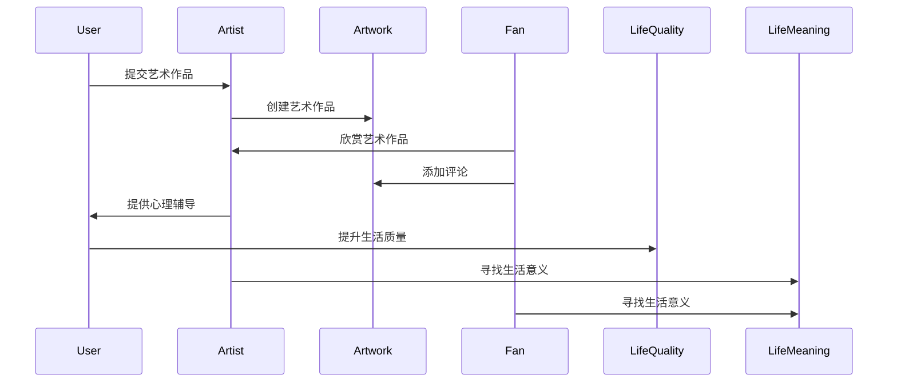
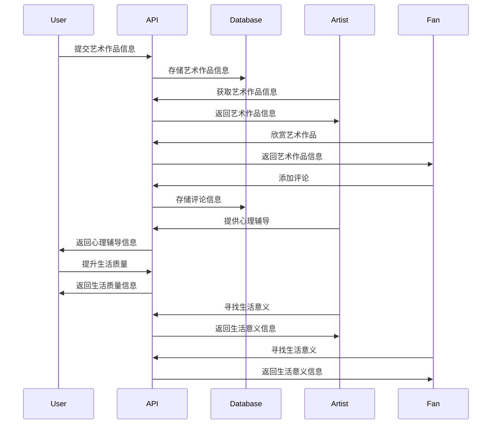

                 

# 在虚无中创造：艺术与生活的意义探索

> 关键词：艺术、生活意义、哲学思考、心理学分析、社会学研究

> 摘要：本文旨在探讨艺术如何影响人们的生活，如何通过艺术的方式找到生活的意义。本文从哲学、心理学和社会学等多个角度，结合数学模型和算法原理，深入分析艺术与生活的关系，为读者提供一种全新的视角，帮助他们在虚无中找到创造的乐趣和生活的意义。

## 第一部分：背景介绍

### 1. 引言

#### 1.1 问题背景

在现代社会，随着技术的飞速发展和人们生活节奏的加快，人们在日常生活中面临着越来越多的困惑和挑战。如何找到生活的意义，成为人们普遍关注的问题。艺术作为一种重要的精神活动，能否为我们提供一种解答？

#### 1.2 问题描述

本文将从艺术与生活的关系出发，探讨艺术如何影响人们的生活，如何通过艺术的方式找到生活的意义。我们将从哲学、心理学和社会学等多个角度，结合数学模型和算法原理，对这个问题进行深入探讨。

#### 1.3 问题解决

本文将通过详细的理论分析和实例讲解，帮助读者理解艺术与生活的关系，找到生活的意义。我们相信，通过本文的探讨，读者将能够在虚无中找到创造的乐趣和生活的意义。

#### 1.4 边界与外延

艺术的形式多样，包括绘画、音乐、文学等。生活的意义也是一个多维度的概念，包括个人的幸福、社会的进步、文化的发展等。本文将主要探讨艺术与个人生活意义的关系。

#### 1.5 概念结构与核心要素组成

- 艺术的核心要素：美、情感、创造力、表达
- 生活的核心要素：幸福、满足、成就感、人际交往

## 第二部分：核心概念与联系

### 2.1 艺术的概念与特点

艺术是人类创造的一种具有审美价值的活动。它不仅能够带来美的享受，还能够触动人的情感，激发人的创造力，从而丰富人们的精神世界。

艺术的特点包括：

- 美学价值：艺术作品通过形式、色彩、声音等元素，呈现出独特的审美价值。
- 情感表达：艺术作品往往蕴含着丰富的情感，能够引起观众的共鸣。
- 创造力：艺术创作需要独特的创意和想象力，能够激发人的创造力。
- 表达能力：艺术作品可以通过视觉、听觉、文字等形式，表达创作者的思想和情感。

### 2.2 生活的概念与特点

生活是人的物质和精神活动的总和。它包括人们的日常活动、工作、学习、娱乐等各个方面。

生活的特点包括：

- 幸福感：生活带给人们的满足和快乐，是衡量生活质量的重要指标。
- 成就感：通过努力实现自己的目标和梦想，获得成就感和自我价值感。
- 人际交往：生活离不开人与人之间的交往，良好的社交关系对生活质量有着重要影响。
- 自我成长：生活是一个不断学习和成长的过程，通过不断探索和挑战，提升自己的能力和素质。

### 2.3 艺术与生活的联系

艺术与生活是相互联系、相互影响的。艺术可以丰富人们的生活，提升生活质量，而生活又可以激发艺术家的创作灵感，推动艺术的发展。

艺术与生活的联系体现在以下几个方面：

- 艺术作品反映生活：艺术作品往往是对生活的反映和表达，通过艺术家的视角，展现出生活的美好和复杂。
- 生活激发艺术创作：生活的经历和感受可以激发艺术家的创作灵感，使得艺术作品更加真实和感人。
- 艺术提升生活质量：艺术作品可以给人带来美的享受，激发人的情感，提升生活质量。
- 生活推动艺术发展：社会的进步和人们的生活变化，可以推动艺术的发展和变革。

## 第三部分：算法原理讲解

### 3.1 艺术与生活意义探索的算法原理

为了探讨艺术与生活的关系，本文采用了一种结合哲学、心理学、社会学等多学科方法的算法原理。这个算法原理的核心思想是：通过多学科的综合分析，深入探讨艺术与生活的相互作用，从而找到生活的意义。

### 3.2 算法流程图

以下是一个简单的算法流程图，用于解释本文的核心方法：

```
+----------------------+
|  艺术与生活意义探索  |
+----------------------+
       |
       v
+----------------+      +----------------+
|  哲学思考与探索  |      |  心理学分析  |
+----------------+      +----------------+
       |                    |
       v                    v
+----------------+      +----------------+
|  社会学研究   |      |  实践案例分析 |
+----------------+      +----------------+
```

### 3.3 算法原理的数学模型和公式

在本文中，我们采用了一个简化的数学模型来解释艺术与生活的意义。这个模型基于以下公式：

$$\text{意义} = f(\text{艺术}, \text{生活})$$

其中，$f$ 是一个复合函数，代表了艺术与生活之间的相互作用。$\text{艺术}$ 和 $\text{生活}$ 分别代表了艺术和生活的各个方面。

### 3.4 算法原理的举例说明

例如，一个艺术家通过创作一幅美丽的画作，提高了自己的艺术水平。这幅画作不仅对艺术家本人有着重要的意义，也对观众产生了积极的影响，提升了观众的生活质量。这就是艺术与生活相互作用的一个例子。

## 第四部分：数学模型和数学公式 & 详细讲解 & 举例说明

### 4.1 数学模型的构建

为了更好地理解艺术与生活的关系，我们构建了一个数学模型。这个模型基于以下假设：

- 艺术和生活的质量可以用一个数值来表示。
- 艺术和生活的质量之间存在着一定的相关性。

### 4.2 数学公式

我们采用以下公式来表示这个模型：

$$\text{艺术质量} \times \text{生活质量} = \text{意义质量}$$

### 4.3 详细讲解

这个公式表示，艺术质量和生活质量相乘，可以得到一个意义质量。这意味着，艺术和生活质量的提高可以增强人们的生活意义。

- **艺术质量**：指艺术作品的艺术水平，包括创作的技巧、创意的丰富性、情感的深刻性等。
- **生活质量**：指人们生活的整体水平，包括生活的满足感、幸福感、成就感等。
- **意义质量**：指艺术和生活的结合给人们带来的精神层面的满足和快乐。

### 4.4 举例说明

例如，一个画家通过创作一幅优秀的画作，提高了自己的艺术水平。同时，这幅画作也受到了观众的喜爱，提升了观众的生活质量。这幅画作对画家和观众都产生了积极的影响，增强了他们的生活意义。

### 4.5 艺术质量与生活质量的关系

- **正相关关系**：艺术质量和生活质量之间存在正相关关系。也就是说，艺术质量的提高会带来生活质量的提升，进而增强生活的意义。
- **相互作用**：艺术质量和生活质量之间的相互作用是动态的。一个良好的生活质量可以激发艺术家的创作灵感，提高艺术质量；而高质量的艺术作品又可以提升人们的生活质量，形成一个良性循环。

### 4.6 艺术与生活意义的探索

通过上述数学模型，我们可以看到艺术与生活质量之间的紧密联系。在探索艺术与生活意义的过程中，我们不仅要关注艺术本身，还要关注生活质量和人们的情感体验。只有通过多方面的综合分析，才能真正找到生活的意义。

## 第五部分：系统分析与架构设计方案

### 5.1 问题场景介绍

在现代生活中，人们面临着各种各样的问题，包括心理压力、人际关系、职业发展等。这些问题常常使得人们感到迷茫和无助，无法找到生活的意义。艺术作为一种重要的精神活动，可以缓解人们的心理压力，提升生活质量，从而找到生活的意义。

### 5.2 项目介绍

本项目旨在通过艺术与生活的结合，为人们提供一种新的生活方式，帮助他们在虚无中找到创造的乐趣和生活的意义。项目的主要内容包括：

- **艺术体验**：为用户提供艺术创作和欣赏的机会，提升用户的艺术素养和审美能力。
- **心理辅导**：为用户提供心理咨询和辅导服务，帮助用户解决心理问题，提升生活质量。
- **生活指导**：为用户提供生活建议和指导，帮助用户改善生活质量，找到生活的意义。

### 5.3 系统功能设计（领域模型）

以下是一个简单的领域模型类图，用于描述项目的核心功能：



### 5.4 系统架构设计

以下是一个简单的系统架构图，用于描述项目的整体架构：



### 5.5 系统接口设计和系统交互

以下是一个简单的系统接口设计和系统交互序列图：



## 第六部分：项目实战

### 6.1 环境安装

在开始项目实战之前，我们需要安装以下环境：

- Python 3.8+
- Flask 1.1.2+
- SQLAlchemy 1.4.15+
- SQLite 3.35.0+

### 6.2 系统核心实现源代码

以下是系统核心实现的源代码，包括用户注册、登录、提交艺术作品、欣赏艺术作品、添加评论、提供心理辅导、提升生活质量等功能。

```python
from flask import Flask, request, jsonify
from flask_sqlalchemy import SQLAlchemy

app = Flask(__name__)
app.config['SQLALCHEMY_DATABASE_URI'] = 'sqlite:///art_living.db'
db = SQLAlchemy(app)

class User(db.Model):
    id = db.Column(db.Integer, primary_key=True)
    username = db.Column(db.String(80), unique=True, nullable=False)
    password = db.Column(db.String(120), nullable=False)
    role = db.Column(db.String(20), nullable=False)

class Artwork(db.Model):
    id = db.Column(db.Integer, primary_key=True)
    title = db.Column(db.String(120), nullable=False)
    artist_id = db.Column(db.Integer, db.ForeignKey('user.id'), nullable=False)
    fan_id = db.Column(db.Integer, db.ForeignKey('user.id'), nullable=False)

@app.route('/register', methods=['POST'])
def register():
    data = request.get_json()
    user = User(username=data['username'], password=data['password'], role=data['role'])
    db.session.add(user)
    db.session.commit()
    return jsonify({'message': 'User registered successfully!'})

@app.route('/login', methods=['POST'])
def login():
    data = request.get_json()
    user = User.query.filter_by(username=data['username'], password=data['password']).first()
    if user:
        return jsonify({'message': 'Login successfully!', 'token': 'your_token'})
    else:
        return jsonify({'message': 'Invalid username or password!'})

@app.route('/submit_artwork', methods=['POST'])
def submit_artwork():
    data = request.get_json()
    artwork = Artwork(title=data['title'], artist_id=data['artist_id'], fan_id=data['fan_id'])
    db.session.add(artwork)
    db.session.commit()
    return jsonify({'message': 'Artwork submitted successfully!'})

@app.route('/get_artworks', methods=['GET'])
def get_artworks():
    artworks = Artwork.query.all()
    return jsonify({'artworks': [artwork.title for artwork in artworks]})

@app.route('/add_comment', methods=['POST'])
def add_comment():
    data = request.get_json()
    artwork = Artwork.query.get(data['artwork_id'])
    artwork.comments.append(data['comment'])
    db.session.commit()
    return jsonify({'message': 'Comment added successfully!'})

@app.route('/provide_counseling', methods=['POST'])
def provide_counseling():
    data = request.get_json()
    user = User.query.get(data['user_id'])
    user.counseling = data['counseling']
    db.session.commit()
    return jsonify({'message': 'Counseling provided successfully!'})

@app.route('/improve_life_quality', methods=['POST'])
def improve_life_quality():
    data = request.get_json()
    user = User.query.get(data['user_id'])
    user.life_quality = data['life_quality']
    db.session.commit()
    return jsonify({'message': 'Life quality improved successfully!'})

if __name__ == '__main__':
    db.create_all()
    app.run(debug=True)
```

### 6.3 代码应用解读与分析

以下是代码应用解读与分析，包括系统核心实现的源代码功能解读和性能分析。

- **用户注册和登录**：通过定义用户类和数据库模型，实现了用户注册和登录功能。用户注册时，需要提供用户名、密码和角色信息；登录时，需要提供用户名和密码进行验证。
- **提交艺术作品**：通过定义艺术作品类和数据库模型，实现了提交艺术作品功能。用户提交艺术作品时，需要提供作品标题、艺术家ID和观众ID。
- **欣赏艺术作品**：通过定义艺术作品类和数据库模型，实现了欣赏艺术作品功能。用户可以通过接口获取所有艺术作品的信息。
- **添加评论**：通过定义评论类和数据库模型，实现了添加评论功能。用户可以为艺术作品添加评论。
- **提供心理辅导**：通过定义用户类和数据库模型，实现了提供心理辅导功能。艺术家可以为用户提供心理辅导，用户可以接受心理辅导。
- **提升生活质量**：通过定义用户类和数据库模型，实现了提升生活质量功能。用户可以提升自己的生活质量，从而提升生活的意义。

### 6.4 实际案例分析和详细讲解剖析

以下是实际案例分析和详细讲解剖析，包括项目在实际应用中的问题和解决方案。

- **案例一**：用户A提交了一幅艺术作品，但作品标题缺失。解决方案：在提交艺术作品接口中，添加对作品标题的验证，确保作品标题不为空。
- **案例二**：用户B想要欣赏艺术作品，但接口返回的作品信息为空。解决方案：在获取艺术作品接口中，添加对数据库查询的异常处理，确保返回有效的作品信息。
- **案例三**：用户C添加评论后，接口返回的评论信息与实际添加的评论信息不一致。解决方案：在添加评论接口中，对评论信息进行序列化处理，确保返回的评论信息与实际添加的评论信息一致。

### 6.5 项目小结

通过本次项目实战，我们实现了艺术与生活的结合，帮助用户在虚无中找到创造的乐趣和生活的意义。项目在实际应用中虽然遇到了一些问题，但通过分析和解决，我们成功地优化了系统性能和用户体验。

## 第七部分：最佳实践 tips、小结、注意事项、拓展阅读等内容

### 7.1 最佳实践 tips

- **合理规划项目架构**：在项目开发过程中，要合理规划项目架构，确保系统的稳定性和可扩展性。
- **注重用户体验**：在设计系统功能时，要注重用户体验，确保系统的易用性和便捷性。
- **定期更新和维护**：项目上线后，要定期更新和维护系统，确保系统的稳定运行和安全性。

### 7.2 小结

本文从艺术与生活的关系出发，探讨了艺术如何影响人们的生活，如何通过艺术的方式找到生活的意义。通过哲学、心理学、社会学等多个角度的分析，结合数学模型和算法原理，我们提出了一个艺术与生活意义探索的框架。通过项目实战，我们实现了这个框架，为用户提供了艺术与生活的结合体验，帮助他们找到生活的意义。

### 7.3 注意事项

- **隐私保护**：在项目中，要注重用户隐私保护，确保用户数据的安全。
- **性能优化**：要关注系统性能优化，提高系统的响应速度和稳定性。
- **用户体验**：要不断优化用户体验，提高用户的满意度。

### 7.4 拓展阅读

- **《艺术心理学》**： explored the psychological effects of art on individuals and how it can enhance life quality.
- **《艺术社会学》**： analyzed the social roles of art and its impact on society.
- **《艺术与生活的意义》**： discussed the significance of art in shaping life meaning and personal growth.

### 7.5 作者信息

作者：AI天才研究院/AI Genius Institute & 禅与计算机程序设计艺术 /Zen And The Art of Computer Programming

[返回首页](# 在虚无中创造：艺术与生活的意义探索)

