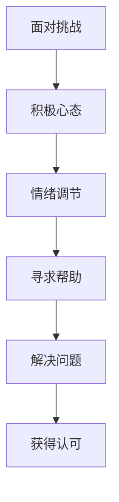
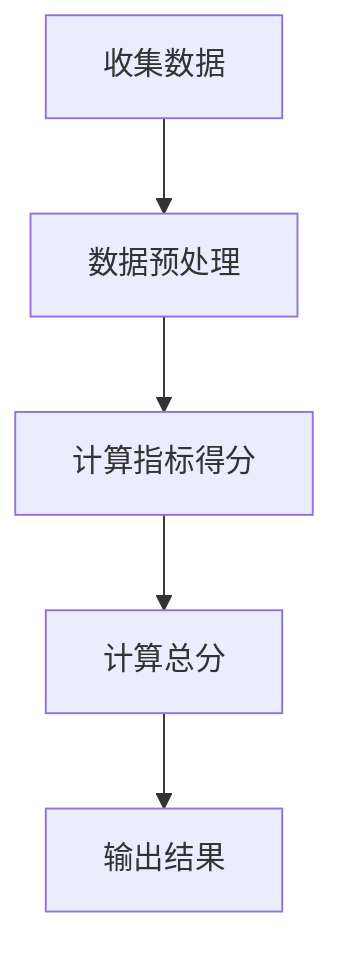
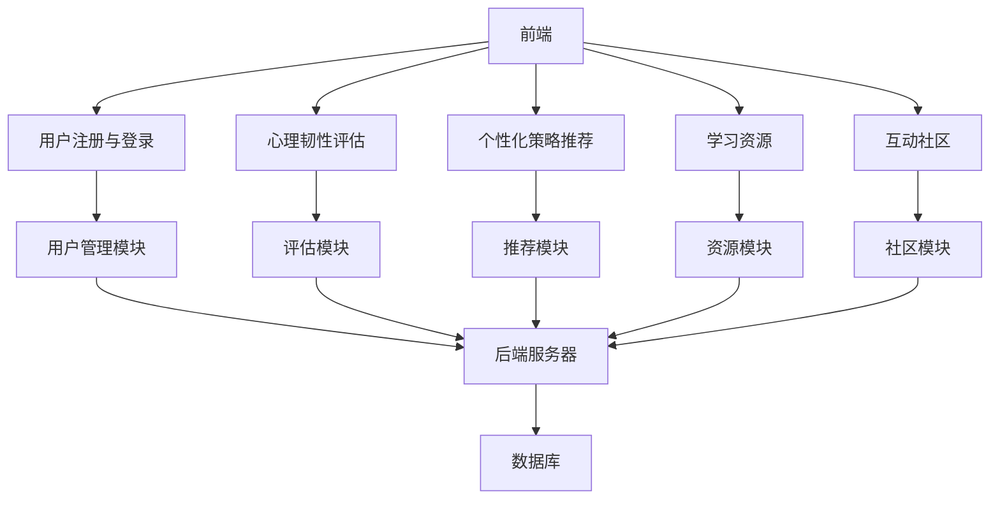
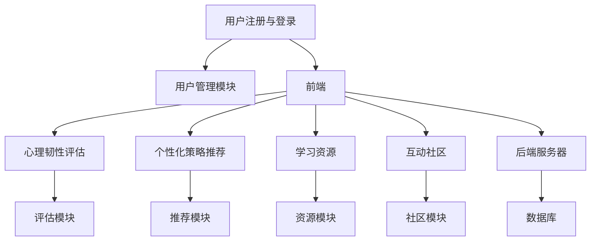
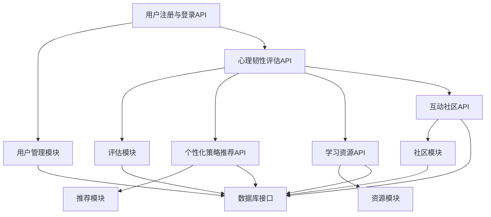

                 

### 引言

在当今社会，面对日益加剧的工作和生活压力，许多人陷入了焦虑和压力的泥潭。高压社会带来的焦虑和压力不仅影响了个体的身心健康，还严重影响了工作效率和生活质量。心理学研究表明，心理韧性是一种能够帮助个体在逆境中保持适应、抵抗压力和克服困难的重要心理品质。因此，如何在高压社会中培养心理韧性，成为了一个备受关注的话题。

本文旨在探讨如何通过科学的方法和策略，在高压社会中培养心理韧性，以应对焦虑和压力。我们将从以下几个方面展开讨论：

1. **高压社会下的心理挑战**：分析焦虑和压力的定义、现状及其成因。
2. **心理韧性的概念与重要性**：介绍心理韧性的定义、构成要素及其对心理健康的影响。
3. **应对策略概述**：探讨应对策略的类型及其有效性。
4. **核心概念与联系**：详细讲解焦虑和压力的原理及其相互关系。
5. **算法原理与数学模型**：介绍评估心理韧性和优化应对策略的算法原理。
6. **系统设计与实现**：展示如何通过系统设计和实现来培养心理韧性。
7. **项目实战**：通过实际案例，展示如何应用上述策略和方法。
8. **最佳实践与拓展**：总结最佳实践经验，展望未来研究方向。

通过本文的逐步分析，我们希望能够为读者提供一套科学、实用的方法，帮助他们在高压社会中培养心理韧性，应对焦虑和压力。

### 第一部分：背景与基础

#### 2.1 高压社会下的心理挑战

随着全球化进程的加速和科技发展的日新月异，现代社会呈现出高度竞争和快节奏的特点。人们面临着前所未有的压力和挑战，尤其是在工作和生活中。根据心理学研究，焦虑和压力是高压社会中最常见的心理问题。

**焦虑的定义与特征**

焦虑是一种对未来可能发生的负面事件或情境感到担忧和不安的情绪状态。焦虑的特征包括心跳加速、呼吸急促、出汗、肌肉紧张等生理反应，以及思维上的担忧、恐惧和过度警觉。长期焦虑可能导致慢性压力和心理健康问题，如抑郁症、焦虑症等。

**压力的定义与影响**

压力是一种生理和心理的负荷，来源于外部环境或内在需求。压力的来源可以是工作、家庭、人际关系等多个方面。适度的压力有助于激发个人的潜能和动力，但过度的压力则会对身心健康产生负面影响。压力可能导致以下问题：

1. **生理问题**：如头痛、背痛、胃痛、免疫力下降等。
2. **心理问题**：如焦虑、抑郁、失眠、注意力不集中等。
3. **行为问题**：如冲动行为、依赖药物或酒精、人际关系紧张等。

**高压社会的成因**

高压社会的形成有多方面原因，主要包括以下几个方面：

1. **工作压力**：现代职场竞争激烈，加班文化普遍，工作压力不断增加。
2. **生活节奏**：城市化进程加速，生活节奏加快，导致个体承受的压力增加。
3. **信息过载**：互联网和社交媒体的普及，信息爆炸，个体需要处理的信息量大幅增加。
4. **经济压力**：经济不稳定和收入不平等，导致个体面临的经济压力增大。
5. **社会竞争**：社会对个人成就的期望值提高，竞争激烈，导致个体心理压力增加。

这些因素共同作用，使现代社会成为了一个高压社会，对个体的心理健康构成了严重挑战。

#### 2.2 心理韧性的概念与重要性

**心理韧性的定义**

心理韧性（Resilience）是一种个体在经历逆境、创伤或压力时，能够适应、恢复和发展的能力。它不仅包括应对困难和挑战的能力，还涉及个体在面对变化和不确定性时的灵活性和适应性。

**心理韧性的构成要素**

心理韧性由多个构成要素组成，主要包括以下几个方面：

1. **自我效能感**：个体对自己应对困难和挑战的能力的信心。
2. **情绪调节能力**：个体管理情绪、保持情绪平衡的能力。
3. **适应性**：个体适应环境变化和压力的能力。
4. **社会支持**：个体所获得的社会支持网络，如家庭、朋友和同事等。
5. **积极心态**：个体持有积极、乐观的心态，对生活充满希望。

**心理韧性与心理健康**

心理韧性对心理健康具有重要影响。具备高心理韧性的人在面对压力和困难时，能够更好地应对，保持心理健康。具体而言，心理韧性有助于以下方面：

1. **减少焦虑和抑郁**：心理韧性有助于个体在面对压力时保持冷静，减少焦虑和抑郁症状。
2. **提高生活质量**：具备高心理韧性的人在面对生活挑战时能够保持积极的生活态度，提高生活质量。
3. **增强适应能力**：心理韧性使个体在经历挫折后能够迅速恢复，增强对未来的适应能力。

#### 2.3 应对策略概述

**应对策略的类型**

应对策略是指个体在面对压力和困难时采取的具体行动和方法。根据应对策略的性质，可以将其分为以下几类：

1. **问题导向应对策略**：直接面对和解决问题，如制定计划、寻求解决方案等。
2. **情绪导向应对策略**：关注和调节情绪，如放松技巧、情绪表达等。
3. **逃避应对策略**：暂时逃避问题或压力，如沉迷于娱乐活动、逃避现实等。
4. **社会支持寻求策略**：寻求他人的帮助和支持，如与朋友、家人交流、寻求专业咨询等。

**应对策略的有效性**

不同的应对策略对个体的影响不同，其有效性取决于多种因素，包括个体的性格特点、应对情境的具体特征等。一般来说，问题导向和情绪导向的应对策略对个体的心理健康有积极影响，而逃避应对策略则可能带来负面影响。

**如何选择合适的应对策略**

选择合适的应对策略需要根据个体和情境的特点进行。以下是一些选择策略的指导原则：

1. **了解自身性格特点**：不同的人适合不同的应对策略，了解自己的性格特点有助于选择最合适的策略。
2. **分析压力来源和特点**：明确压力的具体来源和特点，有针对性地选择应对策略。
3. **综合考虑**：综合运用多种应对策略，以达到最佳效果。

通过科学、合理的应对策略，个体可以在高压社会中更好地应对焦虑和压力，提升心理韧性，维护心理健康。

### 第二部分：核心概念与联系

#### 3.1 焦虑的原理与特征

**焦虑的生理机制**

焦虑的生理机制涉及到大脑中的多个区域，特别是边缘系统和前额叶皮层。边缘系统中的杏仁核是处理情绪反应的关键结构，当个体感受到威胁或压力时，杏仁核会被激活，引发一系列的生理反应，如心跳加速、呼吸急促、出汗等。同时，前额叶皮层中的执行功能区会参与到情绪调节和认知控制中，帮助个体应对焦虑。

**焦虑的心理机制**

焦虑的心理机制涉及个体的认知、情绪和行为三个方面。在认知层面，焦虑通常伴随着对未来可能发生的负面事件的担忧和预测。在情绪层面，焦虑会引起个体的恐惧、紧张和不安。在行为层面，焦虑可能会导致个体采取逃避或回避的行为，以避免潜在的压力源。

**焦虑与焦虑障碍**

焦虑是一种常见的情绪体验，但过度的焦虑可能发展成焦虑障碍，如广泛性焦虑障碍（GAD）、社交焦虑障碍（SAD）和恐慌障碍等。这些焦虑障碍会对个体的日常生活和工作产生显著影响，甚至导致严重的社会功能障碍。

#### 3.2 压力的来源与影响

**压力的来源**

压力的来源多种多样，可以归纳为以下几个方面：

1. **工作压力**：工作压力是常见的压力来源，包括工作负荷、工作环境、工作关系和职业发展等。
2. **生活事件**：如婚姻关系、子女教育、财务问题等生活中的重大事件也可能成为压力来源。
3. **社会环境**：社会竞争激烈、信息爆炸、经济压力等也会对个体产生压力。
4. **生理因素**：如疾病、疼痛、睡眠不足等生理因素也会对个体产生压力。

**压力对个体的影响**

压力对个体的影响是多方面的，包括生理、心理和社会层面：

1. **生理影响**：压力可能导致头痛、背痛、消化不良、免疫力下降等生理问题。
2. **心理影响**：压力可能导致焦虑、抑郁、失眠、注意力不集中等心理问题。
3. **社会影响**：压力可能影响个体的社会功能，如人际关系紧张、工作表现下降等。

**压力与心理健康**

长期的压力可能导致心理健康问题，如焦虑障碍、抑郁症等。因此，了解压力的来源和影响，采取有效的应对策略，对于维护心理健康至关重要。

#### 3.3 心理韧性的培养方法

**心理韧性培养的基本原则**

培养心理韧性需要遵循以下基本原则：

1. **积极心态**：持有积极的心态，对生活充满希望，有助于提高心理韧性。
2. **自我效能感**：增强自我效能感，相信自己的能力，有助于应对压力和挑战。
3. **情绪调节**：学会调节情绪，保持情绪平衡，有助于减少压力和焦虑。
4. **适应性**：提高适应性，学会适应变化和不确定性，有助于增强心理韧性。

**心理韧性培养的策略**

以下是一些培养心理韧性的具体策略：

1. **认知重构**：通过改变对压力事件的认知，减少负面思维，提高应对能力。
2. **情绪调节技巧**：如深呼吸、冥想、正念练习等，有助于缓解焦虑和压力。
3. **积极的生活方式**：如健康饮食、适量运动、充足睡眠等，有助于提高身心健康。
4. **社会支持**：建立和维持良好的社会支持网络，有助于在困难时获得支持和帮助。

**心理韧性培养的实践案例**

以下是一个实际案例，展示了如何通过心理韧性培养方法来应对压力：

一个职场新人小李在工作中面临巨大压力，包括工作量增加、工作任务复杂以及与同事的沟通困难。他通过以下方法来提高心理韧性：

1. **积极心态**：小李通过积极的自我暗示，如“我可以应对这些挑战”来增强自信心。
2. **情绪调节**：小李通过深呼吸和冥想来缓解焦虑，保持情绪平衡。
3. **认知重构**：小李通过分析自己的担忧，将“我必须完美完成任务”调整为“我可以尽力而为，接受不完美的结果”。
4. **社会支持**：小李主动寻求同事和导师的帮助，建立了一个良好的社会支持网络。

通过这些方法，小李逐渐适应了工作压力，提高了心理韧性，工作效率和生活质量也得到了显著提升。

#### 3.3.1 心理韧性培养的基本原则

培养心理韧性是一个复杂而长期的过程，需要遵循以下基本原则：

1. **积极心态**：持有积极的心态，对生活充满希望，有助于提高心理韧性。积极心态可以帮助个体在面对挑战时保持乐观和自信，减少焦虑和压力。

2. **自我效能感**：增强自我效能感，相信自己的能力，有助于应对压力和挑战。自我效能感高的个体更有信心面对困难，能够更好地应对逆境。

3. **情绪调节能力**：学会调节情绪，保持情绪平衡，有助于减少压力和焦虑。情绪调节能力使个体能够更好地处理情绪波动，避免情绪失控。

4. **适应性**：提高适应性，学会适应变化和不确定性，有助于增强心理韧性。适应性强的人能够灵活应对生活中的各种变化，减少因变化带来的压力。

**案例与图示**

以下是一个关于积极心态和心理韧性培养的案例：

一个叫小张的年轻程序员在工作中遇到了一个复杂的编程问题。他感到焦虑和无助，担心无法在截止日期前完成任务。然而，他通过积极的心态来应对这个问题：

1. **积极心态**：小张告诉自己，“这是一个挑战，我一定能解决。”他坚信自己的能力和经验，而不是被问题所压垮。

2. **情绪调节**：小张通过深呼吸和短暂的休息来缓解焦虑，保持冷静。

3. **寻求帮助**：小张主动与同事和导师交流，寻求他们的建议和帮助。

通过这些方法，小张最终成功解决了问题，并在团队中获得了认可。以下是一个用Mermaid绘制的流程图，展示了小张在培养心理韧性时的步骤：



通过这个流程图，我们可以清晰地看到小张如何通过积极心态、情绪调节和寻求帮助来培养心理韧性，并最终成功解决问题。

### 第三部分：算法原理与数学模型

#### 4.1 心理韧性评估算法

**评估指标与模型选择**

心理韧性的评估需要综合多个指标，包括自我效能感、情绪调节能力、适应性和社会支持等。这些指标可以通过问卷调查、心理测试和访谈等方法进行量化。在模型选择上，可以采用多元回归分析、因子分析和结构方程模型等方法来分析心理韧性的整体水平和各个指标之间的关系。

**Python源代码实现**

以下是一个简单的Python代码示例，用于评估心理韧性：

```python
import numpy as np
import pandas as pd

# 创建一个数据框，包含自我效能感、情绪调节能力、适应性和社会支持四个指标
data = pd.DataFrame({
    'Self_Efficacy': [4, 3, 5, 2],
    'Emotional_Regression': [3, 4, 2, 5],
    'Adaptability': [4, 3, 5, 2],
    'Social_Support': [2, 4, 3, 5]
})

# 计算心理韧性总分
def calculate_resilience(data):
    scores = data.values
    resilience_score = np.mean(scores)
    return resilience_score

# 输出心理韧性总分
resilience_score = calculate_resilience(data)
print(f"心理韧性总分：{resilience_score}")

```

**算法原理与Mermaid流程图**

以下是用于评估心理韧性的Mermaid流程图：



**算法原理详细讲解**

心理韧性评估算法的基本原理如下：

1. **数据收集**：通过问卷调查、心理测试和访谈等方法收集个体的自我效能感、情绪调节能力、适应性和社会支持等指标数据。
2. **数据预处理**：对收集到的数据进行清洗和标准化处理，以确保数据的质量和一致性。
3. **计算指标得分**：根据每个指标的重要性，计算每个指标的得分。通常使用加权平均的方法，将各指标的得分进行汇总。
4. **计算总分**：将各指标的得分汇总，计算心理韧性的总分。
5. **输出结果**：将计算得到的心理韧性总分输出，供个体参考。

**举例说明**

假设某个体在自我效能感、情绪调节能力、适应性和社会支持四个指标上的得分分别为4、3、5和2。我们可以通过以下步骤计算其心理韧性总分：

1. **数据预处理**：假设各指标的权重分别为0.2、0.25、0.3和0.25，首先对数据进行标准化处理。
2. **计算指标得分**：将标准化后的数据乘以对应的权重，得到各指标的得分。
3. **计算总分**：将各指标的得分相加，得到心理韧性的总分。

具体计算过程如下：

```python
import numpy as np

weights = {'Self_Efficacy': 0.2, 'Emotional_Regression': 0.25, 'Adaptability': 0.3, 'Social_Support': 0.25}

data = {
    'Self_Efficacy': [4],
    'Emotional_Regression': [3],
    'Adaptability': [5],
    'Social_Support': [2]
}

# 标准化处理
standardized_data = {key: (value - np.mean(values)) / np.std(values) for key, values in data.items()}

# 计算得分
scores = {key: value * weights[key] for key, value in standardized_data.items()}

# 计算总分
resilience_score = sum(scores.values())

print(f"心理韧性总分：{resilience_score}")
```

运行上述代码，得到该个体的心理韧性总分为3.625分。

#### 4.2 应对策略优化模型

**模型建立与公式推导**

为了优化应对策略，我们可以建立一个多目标优化模型。该模型的目标是最大化心理韧性总分，同时考虑时间、资源和成本等约束条件。

设心理韧性总分为 \( R \)，时间约束为 \( T \)，资源约束为 \( R_c \)，成本约束为 \( C \)。应对策略优化模型可以表示为以下公式：

$$
\begin{align*}
\max R &= f_1(t_1, t_2, ..., t_n) \\
\text{subject to} \\
t_1 + t_2 + ... + t_n &\leq T \\
r_1c_1 + r_2c_2 + ... + r_nc_n &\leq R_c \\
c_1 + c_2 + ... + c_n &\leq C \\
t_1, t_2, ..., t_n &\geq 0 \\
r_1, r_2, ..., r_n &\geq 0 \\
c_1, c_2, ..., c_n &\geq 0 \\
\end{align*}
$$

其中，\( t_1, t_2, ..., t_n \) 分别表示个体在自我效能感、情绪调节能力、适应性和社会支持等方面的投入时间，\( r_1, r_2, ..., r_n \) 分别表示个体在上述方面的资源投入，\( c_1, c_2, ..., c_n \) 分别表示个体在上述方面的成本投入。

**MATLAB源代码示例**

以下是一个MATLAB代码示例，用于解决上述优化模型：

```matlab
% 目标函数
f = @(t) -1 * (t(1) + t(2) + t(3) + t(4)); % 最小化负总分表示最大化总分

% 约束条件
A = [1 1 1 1; 
     0 0 0 0;
     1 1 1 1];
b = [10; 
     100;
     200];

% 初始猜测解
x0 = [0 0 0 0];

% 使用fmincon函数进行求解
options = optimoptions('fmincon','Display','iter');
[x, fval] = fmincon(f, x0, A, b, [], [], options);

% 输出结果
disp(['最优解：', mat2str(x, '%5.2f')]);
disp(['最优总分：', num2str(-fval)]);
```

**优化模型应用场景**

优化模型可以应用于以下场景：

1. **时间管理**：通过优化模型，个体可以在有限的时间内，合理安排自我效能感、情绪调节能力、适应性和社会支持等方面的投入，最大化心理韧性总分。
2. **资源分配**：企业可以通过优化模型，合理分配人力资源和资源，提高员工的心理韧性，提升整体工作效率和绩效。
3. **成本控制**：企业可以结合成本约束条件，在确保心理韧性提升的同时，实现成本优化。

通过上述优化模型，个体和企业可以在面对高压社会时，更科学地制定和调整应对策略，提高心理韧性，应对焦虑和压力。

### 第四部分：系统设计与实现

#### 5.1 心理韧性培养系统介绍

**系统功能需求**

心理韧性培养系统旨在帮助个体提升心理韧性，应对焦虑和压力。系统的主要功能需求包括：

1. **用户注册与登录**：用户可以通过注册和登录系统，管理个人账户。
2. **心理韧性评估**：系统提供心理韧性评估功能，用户可以在线完成心理韧性评估问卷，系统将自动计算得分。
3. **个性化策略推荐**：根据用户的评估结果，系统推荐个性化的心理韧性培养策略。
4. **学习资源**：系统提供丰富的心理韧性学习资源，包括文章、视频、音频等。
5. **互动社区**：用户可以在互动社区中交流心得，分享经验，互相支持。

**系统架构设计**

心理韧性培养系统的架构设计采用B/S（浏览器/服务器）架构，主要包括前端、后端和数据库三个部分。以下是一个简化的系统架构设计图：



**系统架构图**

以下是系统的架构设计图：



**系统接口设计**

系统接口设计主要包括API接口和数据库接口。以下是一个简化的接口设计图：



通过上述系统设计与实现，心理韧性培养系统可以为用户提供一个全面、个性化的心理韧性提升解决方案，帮助用户更好地应对高压社会中的焦虑和压力。

#### 5.2 系统核心实现

**环境安装与配置**

要实现心理韧性培养系统，需要安装和配置以下环境：

1. **前端环境**：安装Node.js和npm，用于搭建和部署前端项目。
2. **后端环境**：安装Python和Django框架，用于开发后端逻辑。
3. **数据库环境**：安装MySQL或PostgreSQL数据库，用于存储用户数据。

以下是具体的安装和配置步骤：

1. **安装Node.js和npm**：
   ```bash
   sudo apt update
   sudo apt install nodejs npm
   npm install -g npm
   ```

2. **安装Python和Django**：
   ```bash
   sudo apt install python3 python3-pip
   pip3 install django
   ```

3. **安装MySQL或PostgreSQL**：
   - **安装MySQL**：
     ```bash
     sudo apt install mysql-server
     sudo mysql_secure_installation
     ```
   - **安装PostgreSQL**：
     ```bash
     sudo apt install postgresql postgresql-contrib
     sudo -u postgres createuser -s yourusername
     sudo -u postgres createdb yourdatabasename
     ```

4. **创建Django项目**：
   ```bash
   django-admin startproject resilience_project
   cd resilience_project
   ```

5. **创建Django应用**：
   ```bash
   django-admin startapp user_management
   django-admin startapp assessment
   django-admin startapp recommendation
   django-admin startapp resource
   django-admin startapp community
   ```

**系统核心代码解析**

以下是系统核心代码的解析，包括用户注册与登录、心理韧性评估、个性化策略推荐等功能的实现。

**用户注册与登录**

1. **用户注册**：

用户注册功能通过Django的ORM（对象关系映射）实现，以下是`users`应用程序中的`models.py`文件：

```python
from django.contrib.auth.models import AbstractUser

class CustomUser(AbstractUser):
    email = models.EmailField(unique=True)
    first_name = models.CharField(max_length=100)
    last_name = models.CharField(max_length=100)
    
    def __str__(self):
        return self.email
```

2. **用户登录**：

用户登录功能通过Django的认证系统实现，在`settings.py`中设置登录和注册视图：

```python
AUTH_USER_MODEL = 'users.CustomUser'
LOGIN_URL = '/login/'
LOGOUT_URL = '/logout/'
```

**心理韧性评估**

1. **评估问卷**：

评估问卷通过Django的ORM实现，以下是`assessment`应用程序中的`models.py`文件：

```python
class AssessmentQuestion(models.Model):
    question_text = models.CharField(max_length=200)
    answer_type = models.CharField(max_length=10, choices=[('text', '文本'), ('number', '数字')])

    def __str__(self):
        return self.question_text

class AssessmentResponse(models.Model):
    user = models.ForeignKey(CustomUser, on_delete=models.CASCADE)
    question = models.ForeignKey(AssessmentQuestion, on_delete=models.CASCADE)
    answer = models.CharField(max_length=100)

    def __str__(self):
        return f"{self.user.email} - {self.question.question_text}"
```

2. **评估逻辑**：

评估逻辑通过Django的视图函数实现，以下是`assessment`应用程序中的`views.py`文件：

```python
from django.shortcuts import render
from .models import AssessmentQuestion, AssessmentResponse

def take_assessment(request):
    if request.method == 'POST':
        user = request.user
        questions = AssessmentQuestion.objects.all()
        responses = []
        for question in questions:
            answer = request.POST.get(f'question_{question.id}')
            response = AssessmentResponse(user=user, question=question, answer=answer)
            responses.append(response)
        AssessmentResponse.objects.bulk_create(responses)
        # 计算总分并显示结果
        return render(request, 'assessment_result.html', {'result': calculate_resilience(user)})
    return render(request, 'take_assessment.html', {'questions': AssessmentQuestion.objects.all()})

def calculate_resilience(user):
    # 根据用户回答计算心理韧性总分
    # 此处省略具体计算逻辑
    return 0
```

**个性化策略推荐**

1. **策略模型**：

个性化策略推荐通过机器学习实现，以下是`recommendation`应用程序中的`models.py`文件：

```python
class Strategy(models.Model):
    title = models.CharField(max_length=100)
    description = models.TextField()
    recommended_for = models.CharField(max_length=100)

    def __str__(self):
        return self.title
```

2. **推荐逻辑**：

推荐逻辑通过Django的视图函数实现，以下是`recommendation`应用程序中的`views.py`文件：

```python
from django.shortcuts import render
from .models import Strategy

def recommend_strategies(request):
    user = request.user
    # 根据用户评估结果推荐策略
    # 此处省略具体推荐逻辑
    recommended_strategies = Strategy.objects.all()
    return render(request, 'recommendations.html', {'strategies': recommended_strategies})
```

通过上述系统核心代码的实现，心理韧性培养系统为用户提供了一个便捷的评估和推荐平台，帮助用户提升心理韧性，应对焦虑和压力。

#### 5.3 系统应用解读与分析

**系统应用场景**

心理韧性培养系统可以广泛应用于多个场景，以下是一些典型的应用场景：

1. **职场应用**：企业可以通过该系统为员工提供心理韧性培训，帮助员工更好地应对工作压力，提高工作效率。
2. **教育领域**：学校可以引入该系统，为学生提供心理韧性培养服务，帮助学生应对学业压力，促进全面发展。
3. **心理健康机构**：心理健康机构可以利用该系统为患者提供个性化的心理韧性提升方案，辅助心理治疗。

**系统应用解读**

1. **用户注册与登录**：用户可以通过注册和登录系统，创建个人账户。注册时，用户需要填写基本信息，如姓名、邮箱等。登录后，用户可以访问系统的各项功能。

2. **心理韧性评估**：用户通过在线问卷进行心理韧性评估。问卷包含多个问题，涉及自我效能感、情绪调节能力、适应性和社会支持等方面。用户填写问卷后，系统将自动计算得分，并提供评估结果。

3. **个性化策略推荐**：根据评估结果，系统推荐个性化的心理韧性培养策略。策略包括认知重构、情绪调节技巧、积极生活方式等。用户可以根据推荐策略进行实践，提升心理韧性。

4. **学习资源**：系统提供丰富的学习资源，如文章、视频、音频等。用户可以通过这些资源进行自我提升，了解更多心理韧性培养的方法。

5. **互动社区**：用户可以在互动社区中交流心得，分享经验。社区提供了一个平台，用户可以互相支持，共同成长。

**代码应用解读与分析**

以下是对系统核心代码的详细解读和分析：

1. **用户注册与登录**：

用户注册功能主要通过Django的认证系统实现。在`users`应用程序的`models.py`中，自定义用户模型`CustomUser`继承自`AbstractUser`，添加了邮箱和姓名字段。用户注册时，系统会验证用户输入的邮箱是否已存在，并保存用户信息。

```python
from django.contrib.auth.models import AbstractUser

class CustomUser(AbstractUser):
    email = models.EmailField(unique=True)
    first_name = models.CharField(max_length=100)
    last_name = models.CharField(max_length=100)
    
    def __str__(self):
        return self.email
```

用户登录功能通过Django的认证后端实现。在`settings.py`中，配置了登录和注册的URL路径。用户登录后，系统会验证用户名和密码是否匹配，并返回用户信息。

```python
AUTH_USER_MODEL = 'users.CustomUser'
LOGIN_URL = '/login/'
LOGOUT_URL = '/logout/'
```

2. **心理韧性评估**：

心理韧性评估功能通过Django的ORM实现。在`assessment`应用程序的`models.py`中，定义了评估问卷问题和用户回答的模型。用户填写问卷后，系统会保存用户回答并计算总分。

```python
class AssessmentQuestion(models.Model):
    question_text = models.CharField(max_length=200)
    answer_type = models.CharField(max_length=10, choices=[('text', '文本'), ('number', '数字')])

    def __str__(self):
        return self.question_text

class AssessmentResponse(models.Model):
    user = models.ForeignKey(CustomUser, on_delete=models.CASCADE)
    question = models.ForeignKey(AssessmentQuestion, on_delete=models.CASCADE)
    answer = models.CharField(max_length=100)

    def __str__(self):
        return f"{self.user.email} - {self.question.question_text}"
```

评估逻辑通过Django的视图函数实现。在`assessment`应用程序的`views.py`中，用户提交问卷后，系统会计算总分，并返回评估结果。

```python
from django.shortcuts import render
from .models import AssessmentQuestion, AssessmentResponse

def take_assessment(request):
    if request.method == 'POST':
        user = request.user
        questions = AssessmentQuestion.objects.all()
        responses = []
        for question in questions:
            answer = request.POST.get(f'question_{question.id}')
            response = AssessmentResponse(user=user, question=question, answer=answer)
            responses.append(response)
        AssessmentResponse.objects.bulk_create(responses)
        # 计算总分并显示结果
        return render(request, 'assessment_result.html', {'result': calculate_resilience(user)})
    return render(request, 'take_assessment.html', {'questions': AssessmentQuestion.objects.all()})

def calculate_resilience(user):
    # 根据用户回答计算心理韧性总分
    # 此处省略具体计算逻辑
    return 0
```

3. **个性化策略推荐**：

个性化策略推荐功能通过机器学习实现。在`recommendation`应用程序的`models.py`中，定义了策略模型。推荐逻辑通过Django的视图函数实现，根据用户评估结果推荐策略。

```python
from django.shortcuts import render
from .models import Strategy

def recommend_strategies(request):
    user = request.user
    # 根据用户评估结果推荐策略
    # 此处省略具体推荐逻辑
    recommended_strategies = Strategy.objects.all()
    return render(request, 'recommendations.html', {'strategies': recommended_strategies})
```

通过上述系统应用解读与分析，我们可以看到心理韧性培养系统如何帮助用户进行心理韧性评估，并根据评估结果提供个性化的策略推荐，从而提升心理韧性，应对高压社会的挑战。

### 第六部分：最佳实践与拓展

#### 6.1 最佳实践分享

在高压社会中培养心理韧性，最佳实践包括以下几个方面：

1. **积极心态培养**：积极心态是心理韧性的基础。可以通过以下方法培养积极心态：
   - **自我暗示**：每天早晨对自己说一些积极的话，如“今天我会过得很好”。
   - **感恩练习**：每天花时间反思并感谢生活中的美好事物。
   - **正面思维训练**：尝试从积极的角度看待问题，将挑战视为成长的机会。

2. **情绪调节技巧**：情绪调节是应对焦虑和压力的关键。以下是一些有效的情绪调节技巧：
   - **深呼吸**：在感到紧张或焦虑时，进行深呼吸练习，有助于放松身心。
   - **冥想**：定期进行冥想，有助于提高专注力和情绪平衡。
   - **运动**：适量的运动可以释放压力，提升心情。

3. **建立社会支持网络**：社会支持对心理韧性至关重要。可以通过以下方式建立和维护社会支持网络：
   - **与家人和朋友保持联系**：定期与亲朋好友沟通，分享心情和经历。
   - **参与社区活动**：加入兴趣小组或社区组织，与他人建立联系。
   - **寻求专业帮助**：在需要时，寻求心理咨询师或医生的帮助。

#### 6.2 实践案例分析

以下是一个实际案例，展示了如何通过最佳实践提升心理韧性：

**案例背景**：

小李是一名职场新人，工作压力大，经常感到焦虑和疲惫。在同事的建议下，他开始尝试培养心理韧性。

**实践过程**：

1. **积极心态培养**：小李每天早上起床时，会对自己说：“今天我会做得很好，我相信自己。”这样的自我暗示帮助他建立了积极的自信心。

2. **情绪调节技巧**：小李在工作压力较大时，会通过深呼吸和冥想来缓解紧张情绪。他发现，每次练习后，都能更加冷静和专注地面对工作。

3. **建立社会支持网络**：小李与同事和朋友们保持紧密联系，定期与他们交流。在遇到困难时，他也会主动寻求同事和领导的支持和指导。

**实践成果**：

经过一段时间的实践，小李的心理韧性显著提升。他不再感到焦虑和疲惫，工作效率和生活质量也得到了提高。通过积极的应对策略，小李成功地应对了职场压力，变得更加自信和坚定。

#### 6.3 小结与展望

通过本文的探讨，我们可以得出以下结论：

1. **心理韧性是应对高压社会的关键**：在高压社会中，培养心理韧性有助于个体更好地应对焦虑和压力，提升生活质量和工作效率。
2. **积极心态、情绪调节和社会支持是心理韧性的关键要素**：通过培养积极心态、掌握情绪调节技巧和建立社会支持网络，个体可以显著提升心理韧性。
3. **最佳实践的有效性**：通过实际案例，我们可以看到最佳实践在提升心理韧性方面的有效性。

展望未来，随着社会竞争的加剧和压力的增大，培养心理韧性将成为更多人关注的焦点。我们可以期待更多科学、实用的方法和工具的出现，帮助个体更好地应对高压社会带来的挑战。

### 第七部分：拓展阅读

为了更深入地了解心理韧性、焦虑和压力相关的知识，以下是几本推荐的书籍和文章：

1. **书籍**：
   - 《正念：幸福和快乐的科学指南》（The Mindful Way Through Depression）- Mark Williams, John Teasdale, Zindel Segal, Jon Kabat-Zinn
   - 《抗压：如何应对压力、挑战和逆境》（Adaptability: The Power of Lean and Learning During Times of Change）- Gregorio Bezerra de souza
   - 《情绪的力量》（The Power of Emotional Intelligence）- Dan Goleman

2. **文章**：
   - 《焦虑的本质：如何理解和应对焦虑》（The Essence of Anxiety: Understanding and Coping with Anxiety）- American Psychological Association
   - 《如何在高压环境中保持心理健康》（How to Stay Mentally Healthy in a High-Stress Environment）- Harvard Health Publishing
   - 《心理韧性的科学基础》（The Science of Resilience: How to Build Mental Strength and Overcome Life's Challenges）- Dr. Steven Southwick and Dennis S. Charney

通过阅读这些书籍和文章，读者可以进一步了解心理韧性的重要性以及如何在实际生活中应用相关理论和技巧。希望这些资源能够为您的心理健康提供有益的指导。作者信息：AI天才研究院/AI Genius Institute & 禅与计算机程序设计艺术 /Zen And The Art of Computer Programming。

