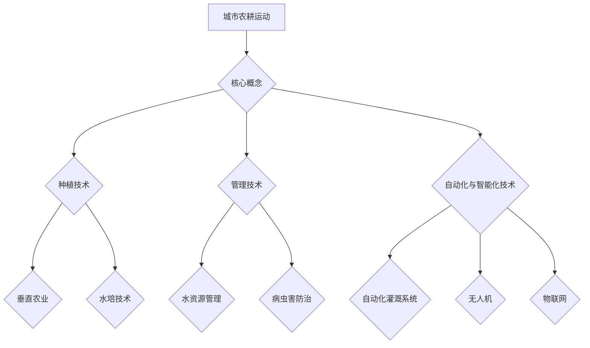
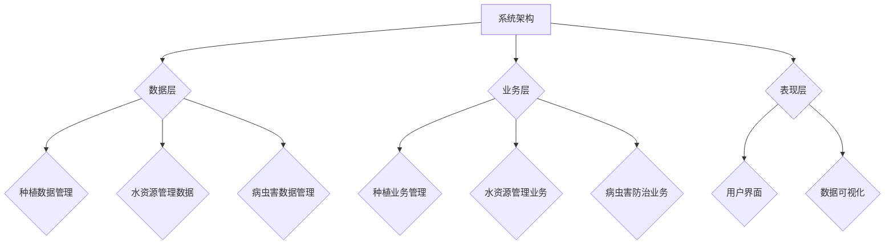

                 

### 引言

#### 1.1 城市农耕运动的起源与发展

**1.1.1 城市农耕运动的起源**

城市农耕运动并非一个新兴的概念，它的起源可以追溯到古代城市的发展时期。在城市化进程的早期，城市居民为了确保粮食供应，往往会在城市的周边进行农业生产。这种做法不仅解决了城市居民的食品需求，也为城市的发展提供了基础。然而，随着工业革命的到来，城市化进程加速，农业逐渐从城市中分离，形成了现代的农业与城市之间的分工。

**1.1.2 城市农耕运动的发展历程**

20世纪末，随着人们对环境保护和可持续发展的关注增加，城市农耕运动重新引起了人们的兴趣。这一运动的核心思想是，通过在都市环境中进行农耕活动，实现城市与自然的和谐共生。城市农耕运动的发展历程可以分为以下几个阶段：

- **萌芽阶段（20世纪末至21世纪初）**：这一阶段，城市农耕运动主要是在一些环保组织和社区活动的推动下开展的，形式较为简单，如屋顶花园、社区农场等。
- **发展初期（21世纪初至今）**：随着技术的进步和人们对健康生活的追求，城市农耕运动逐渐规模化，出现了一些城市农场和垂直农业项目。
- **成熟阶段（未来可期）**：在未来，城市农耕运动有望成为一个完整的产业链，为城市居民提供丰富的农产品，同时改善城市的生态环境。

#### 1.2 城市农耕运动的核心概念

**1.2.1 城市农耕运动的定义**

城市农耕运动是指在城市环境中进行的各种农业活动，包括种植、养殖、水资源管理、生态保护等。这些活动的目标是通过可持续的方式生产农产品，改善城市生态环境，提高居民的生活质量。

**1.2.2 城市农耕运动的关键要素**

- **土地资源**：城市农耕运动需要一定的土地资源，这些土地可以是屋顶、阳台、社区空地等。
- **水资源**：城市农耕运动需要合理利用水资源，包括雨水收集、废水再利用等。
- **种植技术**：城市农耕运动需要采用适合城市环境的种植技术，如垂直农业、水培技术等。
- **管理理念**：城市农耕运动需要注重可持续发展和管理，包括生态循环、废物利用等。

### 目录大纲设计步骤：

#### 2. 确定书籍的核心主题和结构

首先，我们要明确《城市农耕运动：都市中的田园梦想》的核心主题是城市农耕运动，重点探讨在都市环境中如何实现农耕活动，以及这一运动背后的社会、经济和环境意义。

#### 3. 确定书籍的大纲框架

根据书籍的核心主题，我们可以将书籍分为以下几个部分：

- 引言
- 第一部分：城市农耕运动的背景与核心概念
- 第二部分：城市农耕运动的社会意义
- 第三部分：城市农耕运动的经济影响
- 第四部分：城市农耕运动的环境效应
- 第五部分：城市农耕运动的技术支持
- 第六部分：城市农耕运动的实践案例
- 第七部分：城市农耕运动的前景与挑战

#### 4. 设计每个部分的详细章节

接下来，我们为每个部分设计具体的章节，确保每个章节都能够覆盖该部分的核心内容。

#### 5. 确保目录大纲的完整性

在设计中，我们需要确保所有核心内容都被涵盖，包括背景介绍、核心概念、算法原理讲解、数学模型和公式、系统分析与架构设计方案、项目实战、最佳实践 tips 等内容。

#### 6. 优化目录大纲的简洁性

在完成大纲设计后，我们要对目录进行审查，确保没有多余的废话，内容简洁明了。

### 目录大纲：

----------------------------------------------------------------

# 引言

## 1.1 城市农耕运动的起源与发展
### 1.1.1 城市农耕运动的起源
### 1.1.2 城市农耕运动的发展历程

## 1.2 城市农耕运动的核心概念
### 1.2.1 城市农耕运动的定义
### 1.2.2 城市农耕运动的关键要素

# 第一部分：城市农耕运动的背景与核心概念

## 2.1 城市农耕运动的背景
### 2.1.1 城市化进程中的农业生产挑战
### 2.1.2 都市农业的重要性

## 2.2 城市农耕运动的核心概念
### 2.2.1 城市农耕运动的原理
### 2.2.2 城市农耕运动的优势与局限性

## 2.3 城市农耕运动的实践模式
### 2.3.1 城市社区农耕
### 2.3.2 城市屋顶花园
### 2.3.3 城市垂直农业

# 第二部分：城市农耕运动的社会意义

## 3.1 城市农耕运动的社会价值
### 3.1.1 城市农耕运动对城市社区的积极影响
### 3.1.2 城市农耕运动对农村居民的影响

## 3.2 城市农耕运动的社会效应
### 3.2.1 城市农耕运动的教育意义
### 3.2.2 城市农耕运动的文化意义

## 3.3 城市农耕运动的社会运动性质
### 3.3.1 城市农耕运动的社会参与
### 3.3.2 城市农耕运动的社会治理作用

# 第三部分：城市农耕运动的经济影响

## 4.1 城市农耕运动的经济效益
### 4.1.1 城市农耕运动的经济价值
### 4.1.2 城市农耕运动的市场前景

## 4.2 城市农耕运动的经济模式
### 4.2.1 城市农耕运动的商业运作模式
### 4.2.2 城市农耕运动的产业链分析

## 4.3 城市农耕运动的经济挑战与对策
### 4.3.1 城市农耕运动的经济问题
### 4.3.2 应对城市农耕运动经济挑战的策略

# 第四部分：城市农耕运动的环境效应

## 5.1 城市农耕运动的环境效益
### 5.1.1 城市农耕运动对城市生态环境的改善
### 5.1.2 城市农耕运动对生物多样性的保护

## 5.2 城市农耕运动的环境挑战
### 5.2.1 城市农耕运动的环境压力
### 5.2.2 应对城市农耕运动环境挑战的措施

## 5.3 城市农耕运动与可持续城市发展的关系
### 5.3.1 城市农耕运动在可持续发展中的作用
### 5.3.2 城市农耕运动与可持续城市发展的协调

# 第五部分：城市农耕运动的技术支持

## 6.1 城市农耕运动的技术需求
### 6.1.1 种植技术
### 6.1.2 管理技术

## 6.2 城市农耕运动的技术创新
### 6.2.1 垂直农业技术
### 6.2.2 自动化与智能化技术

## 6.3 城市农耕运动的技术应用
### 6.3.1 智能温室
### 6.3.2 水培技术

# 第六部分：城市农耕运动的实践案例

## 7.1 国内外城市农耕运动实践案例分析
### 7.1.1 国外城市农耕运动案例分析
### 7.1.2 国内城市农耕运动案例分析

## 7.2 城市农耕运动的创新实践
### 7.2.1 城市农耕运动的新模式
### 7.2.2 城市农耕运动的新趋势

# 第七部分：城市农耕运动的前景与挑战

## 8.1 城市农耕运动的前景
### 8.1.1 城市农耕运动的发展趋势
### 8.1.2 城市农耕运动的未来展望

## 8.2 城市农耕运动的挑战
### 8.2.1 城市农耕运动面临的挑战
### 8.2.2 应对挑战的策略与建议

----------------------------------------------------------------

### 第一部分：城市农耕运动的背景与核心概念

在城市化的浪潮中，农业生产似乎逐渐从城市的核心区域退却。然而，随着人们对可持续发展和城市生态环境的重视，城市农耕运动应运而生。这一部分将探讨城市农耕运动的背景，包括城市化进程中的农业生产挑战，都市农业的重要性，以及城市农耕运动的核心概念。

#### 2.1 城市农耕运动的背景

**2.1.1 城市化进程中的农业生产挑战**

城市化进程的加速导致了农业生产面临的诸多挑战。首先，城市土地资源紧张，耕地面积减少，这对传统农业的发展造成了极大的压力。其次，城市人口增长迅速，对食品的需求量不断增加，但城市自身的农业生产能力却有限。此外，城市化进程中，农业劳动力向城市转移，导致农业劳动力短缺，农业生产效率降低。

**2.1.2 都市农业的重要性**

在城市化进程中，都市农业的重要性日益凸显。首先，都市农业可以提供新鲜、健康的农产品，满足城市居民对食品的需求。其次，都市农业有助于改善城市生态环境，增加城市绿化面积，提高空气质量。此外，都市农业还具有教育意义，可以培养市民的环保意识和农业知识。

#### 2.2 城市农耕运动的核心概念

**2.2.1 城市农耕运动的定义**

城市农耕运动是指在都市环境中进行的各种农业活动，包括种植、养殖、水资源管理、生态保护等。这些活动的目标是通过可持续的方式生产农产品，改善城市生态环境，提高居民的生活质量。

**2.2.2 城市农耕运动的关键要素**

- **土地资源**：城市农耕运动需要一定的土地资源，这些土地可以是屋顶、阳台、社区空地等。
- **水资源**：城市农耕运动需要合理利用水资源，包括雨水收集、废水再利用等。
- **种植技术**：城市农耕运动需要采用适合城市环境的种植技术，如垂直农业、水培技术等。
- **管理理念**：城市农耕运动需要注重可持续发展和管理，包括生态循环、废物利用等。

#### 2.3 城市农耕运动的实践模式

**2.3.1 城市社区农耕**

城市社区农耕是指在城市社区内进行的农耕活动，通常由社区居民共同参与。这种模式不仅可以增加社区居民的绿色空间，还可以提高居民的环保意识和农业知识。城市社区农耕的形式多样，包括社区花园、屋顶菜园、社区农场等。

**2.3.2 城市屋顶花园**

城市屋顶花园是城市农耕运动的一种重要形式，它不仅提供了额外的绿地空间，还可以改善城市微气候，减少城市热岛效应。城市屋顶花园通常采用垂直绿化和屋顶植被种植技术，以最大限度地利用空间。

**2.3.3 城市垂直农业**

城市垂直农业是一种先进的农业形式，它通过垂直空间利用，实现农业生产的高效化。城市垂直农业通常采用智能温室、水培技术和自动化控制系统，以提高生产效率和产品质量。

### 结论

城市农耕运动作为一种新型的农业形式，具有巨大的社会、经济和环境价值。在城市化进程中，城市农耕运动可以为城市居民提供新鲜、健康的农产品，改善城市生态环境，提高居民的生活质量。同时，城市农耕运动也面临着一系列的挑战，如土地资源紧张、水资源短缺等。因此，我们需要不断探索和创新，以推动城市农耕运动的可持续发展。

----------------------------------------------------------------

# 城市农耕运动的社会意义

城市农耕运动不仅是一种农业活动，更是一种社会运动。它对城市社区、农村居民以及整个社会都产生了深远的影响。在这一部分，我们将探讨城市农耕运动的社会意义，包括其对城市社区的积极影响、对农村居民的影响，以及其社会运动性质。

## 3.1 城市农耕运动的社会价值

**3.1.1 城市农耕运动对城市社区的积极影响**

城市农耕运动对城市社区的积极影响是多方面的。首先，它提供了额外的绿色空间，改善了城市的生态环境。通过屋顶花园、社区农场等形式，城市农耕运动增加了城市的绿地面积，减少了城市热岛效应，提高了空气质量。其次，城市农耕运动提高了城市居民的生活质量。通过参与农耕活动，居民可以享受种植的快乐，增加对自然的亲近感。此外，城市农耕运动还具有教育意义，可以培养居民的环保意识和农业知识。

**3.1.2 城市农耕运动对农村居民的影响**

城市农耕运动对农村居民的影响也是积极的。首先，它为农村居民提供了一种新的就业机会。随着城市农耕运动的兴起，越来越多的农村劳动力转向城市农耕，从事农业生产。这不仅提高了农村居民的收入，也促进了农村经济的发展。其次，城市农耕运动有助于改善农村居民的生活条件。通过城市农耕活动，农村居民可以接触到先进的农业技术和管理理念，提高农业生产效率。

## 3.2 城市农耕运动的社会效应

**3.2.1 城市农耕运动的教育意义**

城市农耕运动具有重要的教育意义。通过参与农耕活动，居民可以学习到农业生产的基本知识，了解植物的生长过程。这不仅有助于培养居民的环保意识，还可以提高他们对自然界的认识。此外，城市农耕运动还可以作为学校教育的一部分，让学生在实践中学习农业知识，增强实践能力。

**3.2.2 城市农耕运动的文化意义**

城市农耕运动还具有深厚的文化意义。在现代社会，随着城市化进程的加快，传统农耕文化逐渐消失。城市农耕运动为人们提供了一个重新接触和体验传统农耕文化的机会。通过城市农耕活动，人们可以感受到农耕文化的魅力，传承和弘扬传统文化。

## 3.3 城市农耕运动的社会运动性质

**3.3.1 城市农耕运动的社会参与**

城市农耕运动具有广泛的社会参与性。无论是城市居民还是农村居民，都可以参与到城市农耕活动中来。这种参与不仅有助于提高居民的生活质量，还可以增强社区凝聚力，促进社会和谐。此外，城市农耕运动还吸引了越来越多的志愿者和社会组织参与，共同推动城市农耕运动的发展。

**3.3.2 城市农耕运动的社会治理作用**

城市农耕运动在社会治理方面也发挥着重要作用。首先，城市农耕运动有助于改善城市生态环境，提高居民的生活质量。其次，城市农耕运动可以作为一种社会管理工具，通过社区参与和自治，增强社区的凝聚力和自我管理能力。此外，城市农耕运动还可以促进农村与城市的互动，缓解城乡差距，实现城乡共同发展。

### 结论

城市农耕运动作为一种社会运动，具有广泛的社会意义。它不仅提高了城市居民的生活质量，改善了城市生态环境，还为农村居民提供了新的就业机会，促进了农村经济的发展。同时，城市农耕运动还具有教育意义和文化意义，有助于传承和弘扬传统文化。因此，我们应该积极推动城市农耕运动的发展，使其成为可持续发展的重要力量。

----------------------------------------------------------------

# 城市农耕运动的经济影响

城市农耕运动不仅在生态和社会层面上产生了积极的影响，同时也对城市经济产生了深远的作用。在这一部分，我们将深入探讨城市农耕运动的经济影响，包括其经济效益、经济模式以及面临的经济挑战和对策。

## 4.1 城市农耕运动的经济效益

**4.1.1 城市农耕运动的经济价值**

城市农耕运动为城市经济带来了新的增长点。首先，它为城市居民提供了新鲜、优质的农产品，满足了人们对健康食品的需求。这些农产品不仅可以在市场上销售，还可以通过社区支持农业（CSA）等方式直接供给消费者，从而提高了农产品的附加值。其次，城市农耕运动创造了新的就业机会，包括农耕劳动、农业技术支持、农产品加工和销售等环节，有助于提高城市居民的收入水平。

**4.1.2 城市农耕运动的市场前景**

随着人们对健康饮食和环保意识的提高，城市农耕运动的市场前景十分广阔。一方面，城市农耕运动能够提供有机、绿色的农产品，满足消费者对高品质食品的需求。另一方面，城市农耕运动还具有教育、娱乐和生态旅游等附加价值，吸引了大量游客和参与者。因此，城市农耕运动在市场上有很大的发展潜力。

## 4.2 城市农耕运动的经济模式

**4.2.1 城市农耕运动的商业运作模式**

城市农耕运动的经济模式多种多样，包括社区支持农业（CSA）、农业体验旅游、农产品直销和电子商务等。在这些模式中，社区支持农业（CSA）是一种较为常见的运作方式。CSA模式将城市居民与农场直接连接起来，居民预先支付费用，农场则定期提供新鲜的农产品。这种模式不仅提高了农产品的销售渠道，还增强了消费者与生产者之间的联系。

**4.2.2 城市农耕运动的产业链分析**

城市农耕运动的产业链包括多个环节，从种植、养殖到加工、销售和配送。每个环节都有其特定的经济价值。例如，种植环节可以通过高效的种植技术和垂直农业来提高产量和效率；加工环节则可以通过农产品加工提高附加值；销售和配送环节则可以通过电子商务和物流服务实现快速、便捷的供应。

## 4.3 城市农耕运动的经济挑战与对策

**4.3.1 城市农耕运动的经济问题**

尽管城市农耕运动具有巨大的经济潜力，但也面临着一系列经济问题。首先，土地资源紧张是一个重要问题。城市土地价格较高，且可用于农耕的土地有限。其次，城市农耕运动的成本较高，包括土地租赁、种植设备、水资源管理等。此外，城市农耕运动的规模化程度较低，生产效率相对较低，这也限制了其经济效益的发挥。

**4.3.2 应对城市农耕运动经济挑战的策略**

为了应对城市农耕运动的经济挑战，可以采取以下策略：

1. **政策支持**：政府可以出台相关政策，提供土地、资金和技术支持，降低城市农耕运动的成本。例如，提供税收优惠、贷款补贴和农业技术培训等。
2. **技术创新**：通过引进先进的农业技术，如智能温室、自动化灌溉系统和垂直农业，提高生产效率和产品质量，降低生产成本。
3. **产业链整合**：加强产业链各环节的协同合作，实现资源优化配置和效益最大化。例如，通过建立农产品加工中心和物流配送中心，提高农产品附加值和流通效率。
4. **市场拓展**：通过电商平台和社交媒体等渠道，拓展城市农耕运动的市场，提高农产品的销售量和知名度。
5. **社区参与**：鼓励社区居民参与城市农耕运动，通过共享资源和共同管理，降低运营成本，提高经济效益。

### 结论

城市农耕运动对城市经济产生了深远的影响。它不仅提供了新的经济增长点，创造了就业机会，还满足了消费者对健康食品的需求。然而，城市农耕运动也面临着土地资源紧张、成本高、生产效率低等经济挑战。通过政策支持、技术创新、产业链整合和市场拓展等措施，可以应对这些挑战，推动城市农耕运动的可持续发展。

----------------------------------------------------------------

# 城市农耕运动的环境效应

城市农耕运动不仅在经济和社会层面上产生了积极的影响，同时也对城市环境产生了显著的作用。在这一部分，我们将深入探讨城市农耕运动的环境效益、环境挑战以及如何应对这些挑战。

## 5.1 城市农耕运动的环境效益

**5.1.1 城市农耕运动对城市生态环境的改善**

城市农耕运动对城市生态环境的改善体现在多个方面。首先，城市农耕运动增加了城市的绿地面积，改善了城市微气候。通过屋顶花园、垂直农业等形式，城市农耕运动利用了城市中的闲置空间，增加了绿化覆盖率，减少了城市热岛效应。其次，城市农耕运动有助于提高空气质量。植物在光合作用过程中可以吸收二氧化碳，释放氧气，从而净化空气。此外，城市农耕运动还可以通过土壤改良和植被恢复，改善土壤质量和生物多样性。

**5.1.2 城市农耕运动对生物多样性的保护**

城市农耕运动对生物多样性的保护作用不容忽视。通过提供丰富的植被和水源，城市农耕运动为野生动物提供了栖息地和食物来源。例如，城市屋顶花园和水培系统可以为鸟类、昆虫和鱼类等提供栖息环境，从而促进城市生物多样性的增加。此外，城市农耕运动还可以通过植物多样性种植，吸引更多的昆虫和鸟类，形成生态平衡。

## 5.2 城市农耕运动的环境挑战

**5.2.1 城市农耕运动的环境压力**

尽管城市农耕运动具有许多环境效益，但也面临着一些环境压力。首先，城市农耕运动需要大量的水资源。在干旱季节，城市水资源的供应可能不足，从而对城市水资源管理带来挑战。其次，城市农耕运动可能会产生一些废弃物，如植物残枝、蔬菜残渣等。这些废弃物如果处理不当，可能会对环境造成污染。此外，城市农耕运动中使用的化肥和农药等化学物质，也可能对城市生态系统产生负面影响。

**5.2.2 应对城市农耕运动环境挑战的措施**

为了应对城市农耕运动的环境挑战，可以采取以下措施：

1. **水资源管理**：通过雨水收集、废水再利用等措施，提高水资源的利用效率，降低对城市水资源的压力。例如，在城市屋顶安装雨水收集系统，将雨水用于灌溉。
2. **废物处理**：建立健全的废弃物处理体系，确保城市农耕运动产生的废弃物得到妥善处理。例如，可以通过堆肥、生物降解等技术，将植物残枝、蔬菜残渣等废弃物转化为有机肥料。
3. **生态友好农业**：推广生态友好农业技术，减少化肥和农药的使用。例如，采用有机肥料、生物农药和生态种植模式，减少对环境的负面影响。
4. **公众参与**：鼓励公众参与城市农耕运动，提高环保意识。通过教育宣传、实践活动等方式，让更多人了解城市农耕运动的环境效益，共同参与环保行动。

## 5.3 城市农耕运动与可持续城市发展的关系

**5.3.1 城市农耕运动在可持续发展中的作用**

城市农耕运动在可持续发展中发挥着重要作用。首先，它有助于实现城市资源的可持续利用，通过利用闲置空间和水资源，提高资源利用效率。其次，城市农耕运动可以促进城市生态系统的平衡，提高生物多样性。此外，城市农耕运动还具有教育意义，可以培养居民的环保意识和可持续发展理念。

**5.3.2 城市农耕运动与可持续城市发展的协调**

城市农耕运动与可持续城市发展的关系是相辅相成的。通过将城市农耕运动与城市规划、城市建设等相结合，可以实现城市发展的可持续性。例如，在城市规划中预留农耕用地，建设生态屋顶和垂直农业设施，将城市农耕运动融入城市发展中。此外，政府和社会组织可以合作，共同推动城市农耕运动的发展，实现城市与自然和谐共生。

### 结论

城市农耕运动对城市环境产生了积极的影响，不仅改善了城市生态环境，还保护了生物多样性。然而，城市农耕运动也面临着一些环境挑战，如水资源短缺、废弃物处理等。通过科学管理和技术创新，可以应对这些挑战，推动城市农耕运动的可持续发展。城市农耕运动与可持续城市发展是相辅相成的，通过协调两者关系，可以实现城市与自然的和谐共生。

----------------------------------------------------------------

# 城市农耕运动的技术支持

城市农耕运动的实施离不开技术支持，这些技术包括种植技术、管理技术、自动化与智能化技术等。在这一部分，我们将探讨城市农耕运动中所需的技术支持，以及这些技术的具体应用和未来发展。

## 6.1 城市农耕运动的技术需求

**6.1.1 种植技术**

城市农耕运动中，种植技术至关重要。由于城市环境的特殊性，如空间有限、光照不足、土壤质量较差等，因此需要采用适合城市环境的种植技术。以下是几种常见的种植技术：

- **垂直农业**：通过利用垂直空间，实现农作物的高层种植。垂直农业通常采用智能温室和自动化灌溉系统，以提高生产效率和产品质量。
- **水培技术**：水培技术通过无土栽培，利用营养液供给植物所需养分。水培系统可以根据植物生长需求，自动调节水分和营养供给，实现高效种植。
- **无土栽培**：无土栽培通过将植物种植在有机基质中，如珍珠岩、蛭石等，提供植物生长所需的营养。无土栽培可以减少土壤污染，提高作物产量。
- **遮阳网和温室**：在光照不足的城市环境中，使用遮阳网和温室可以提供适宜的光照和温度条件，促进植物生长。

**6.1.2 管理技术**

城市农耕运动的管理技术包括水资源管理、病虫害防治、植物生长监测等。以下是几种常见的管理技术：

- **水资源管理**：在水资源紧张的城市环境中，合理利用水资源至关重要。通过雨水收集、废水再利用等措施，可以节约用水，提高水资源利用效率。
- **病虫害防治**：城市农耕运动中，病虫害防治是一项重要任务。通过生物防治、物理防治和化学防治等方法，可以有效地控制病虫害，减少农药使用。
- **植物生长监测**：利用传感器和物联网技术，可以实时监测植物的生长状态，包括土壤湿度、温度、光照强度等。通过数据分析和智能控制，可以优化植物生长环境，提高产量和质量。

## 6.2 城市农耕运动的技术创新

**6.2.1 垂直农业技术**

垂直农业技术是城市农耕运动中的一项重要技术创新。通过利用垂直空间，垂直农业可以实现农作物的高层种植，提高土地利用率。垂直农业通常采用智能温室、自动化灌溉系统和垂直种植设备，以提高生产效率和产品质量。例如，日本的垂直农场项目采用了先进的垂直农业技术，实现了高效的农作物生产。

**6.2.2 自动化与智能化技术**

自动化与智能化技术在城市农耕运动中发挥着重要作用。通过引入自动化设备和智能化系统，可以显著提高生产效率和产品质量。以下是几种常见的自动化与智能化技术：

- **自动化灌溉系统**：自动化灌溉系统可以根据植物的生长需求，自动调节水分供给，实现精准灌溉。例如，荷兰的智能温室项目采用了自动化灌溉系统，实现了高效的水资源管理。
- **无人机和机器人**：无人机和机器人可以用于农田的巡查、施肥、喷洒农药等作业。这些设备可以提高作业效率，降低人力成本。
- **物联网技术**：物联网技术可以实现农田的智能监测和管理，包括土壤湿度、温度、光照强度等参数的实时监测。通过数据分析和智能控制，可以优化农田管理，提高作物产量和质量。

## 6.3 城市农耕运动的技术应用

**6.3.1 智能温室**

智能温室是城市农耕运动中的一项重要技术应用。智能温室通过自动化控制系统，可以提供适宜的光照、温度、湿度等环境条件，促进植物生长。智能温室通常配备有传感器、控制器、灌溉系统等设备，可以实现自动化的环境控制和作物管理。例如，中国的智能温室项目利用智能温室技术，实现了高效、优质的蔬菜生产。

**6.3.2 水培技术**

水培技术是城市农耕运动中的一种重要种植方式。水培技术通过无土栽培，利用营养液供给植物所需养分，实现高效种植。水培系统可以根据植物的生长需求，自动调节营养液的供给，实现精准管理。例如，美国的垂直农场项目采用了水培技术，实现了高效的农作物生产。

### 结论

城市农耕运动的技术支持对于实现其可持续发展至关重要。通过引入先进的种植技术、管理技术、自动化与智能化技术，可以提高城市农耕运动的生产效率和产品质量。未来，随着技术的不断进步，城市农耕运动的技术支持将更加成熟，为城市居民提供更多新鲜、健康的农产品，同时改善城市生态环境。

----------------------------------------------------------------

# 城市农耕运动的实践案例

城市农耕运动在全球范围内得到了广泛的实践，并取得了显著的成效。在这一部分，我们将介绍国内外城市农耕运动的实践案例，分析其成功经验，以及探讨这些实践对城市发展的启示。

## 7.1 国内外城市农耕运动实践案例分析

**7.1.1 国外城市农耕运动案例分析**

1. **纽约市绿色基础设施计划（GIPI）**
   纽约市绿色基础设施计划是城市农耕运动的一个典范。该项目通过在城市中建设绿色屋顶、城市农场和绿地，不仅提供了丰富的农产品，还改善了城市的生态环境。GIPI计划的成功经验在于其政策支持、社区参与和多方合作。

2. **伦敦市农场**
   伦敦市农场是一个城市农耕项目的成功案例。该项目通过在城市中建立一系列小型农场，为城市居民提供了新鲜的有机食品，并促进了社区参与。伦敦市农场的成功在于其可持续性和社区导向。

**7.1.2 国内城市农耕运动案例分析**

1. **上海市崇明区生态农业示范区**
   上海市崇明区生态农业示范区是中国城市农耕运动的一个代表。该项目通过推广生态农业技术和循环农业模式，实现了农业生产的可持续性和高效率。崇明区的成功经验在于其技术创新和政策支持。

2. **深圳市光明农场**
   深圳市光明农场是一个集农业生产、乡村旅游和科普教育于一体的城市农耕项目。该项目通过创新农业技术和多元化经营模式，实现了农业产业的升级和城市居民的参与。光明农场的成功在于其综合效益和品牌效应。

## 7.2 城市农耕运动的创新实践

**7.2.1 城市农耕运动的新模式**

随着城市农耕运动的不断发展，出现了一些创新的实践模式。以下是两种典型的创新模式：

1. **共享农场**
   共享农场是一种基于社区合作的城市农耕模式。社区居民共同参与农场的运营和管理，共享农场的产出。这种模式不仅提供了健康的农产品，还增强了社区的凝聚力和参与感。

2. **智能温室农业**
   智能温室农业是一种利用先进技术实现高效农业生产的模式。智能温室通过自动化控制系统，提供适宜的环境条件，实现精准农业。这种模式提高了生产效率和产品质量，满足了消费者对高品质食品的需求。

**7.2.2 城市农耕运动的新趋势**

随着科技的进步和社会的发展，城市农耕运动呈现出一些新的趋势。以下是两种值得关注的新趋势：

1. **垂直农业**
   垂直农业是一种利用垂直空间进行农业生产的模式。通过多层种植架和自动化设备，垂直农业实现了空间的高效利用和生产的高效率。这种模式尤其适合城市化地区，有助于缓解土地资源紧张的问题。

2. **城市农业旅游**
   城市农业旅游是一种结合农业生产和旅游体验的新兴模式。通过参观农场、参与农耕活动、品尝农产品等方式，城市农业旅游吸引了大量游客，推动了农业产业的发展。

### 结论

城市农耕运动在全球范围内的实践案例展示了其巨大的潜力和价值。通过政策支持、技术创新和社区参与，城市农耕运动不仅提高了城市居民的生活质量，还改善了城市生态环境。未来，随着城市农耕运动模式的不断创新，它将在城市发展中发挥更加重要的作用。

----------------------------------------------------------------

# 城市农耕运动的前景与挑战

随着城市化的不断推进和人们对可持续发展的日益关注，城市农耕运动作为一种新型的农业形式，正逐渐成为城市发展的新趋势。然而，城市农耕运动也面临着一系列的前景与挑战，需要我们深入思考并积极应对。

## 8.1 城市农耕运动的前景

**8.1.1 城市农耕运动的发展趋势**

随着科技的进步和人们对健康生活的追求，城市农耕运动呈现出以下发展趋势：

- **垂直农业的普及**：垂直农业通过多层种植架和自动化设备，实现了空间的高效利用和生产的高效率。随着技术的不断成熟，垂直农业将在城市中更加普及。
- **智能化管理的推广**：物联网、大数据和人工智能等先进技术的应用，将使城市农耕运动的管理更加智能化和精细化。通过实时监测和数据分析，可以优化农业生产过程，提高生产效率和产品质量。
- **社区参与的增强**：城市农耕运动越来越注重社区参与，通过共享农场、社区花园等形式，增强居民的参与感和归属感。这种模式不仅提高了城市农耕运动的可持续性，还有助于社区建设和居民幸福感。

**8.1.2 城市农耕运动的未来展望**

在未来，城市农耕运动有望成为城市发展的关键组成部分，为城市居民提供新鲜、健康的农产品，改善城市生态环境，提高生活质量。以下是城市农耕运动的未来展望：

- **城市农场成为常见景观**：随着城市农耕运动的推广，城市农场将成为城市中常见的景观，不仅提供农产品，还成为城市居民休闲娱乐的好去处。
- **城市与农村的协同发展**：城市农耕运动将促进城市与农村的协同发展，通过技术和市场的纽带，实现城乡资源的共享和互利共赢。
- **农业产业链的延伸**：城市农耕运动将带动农业产业链的延伸，包括农产品加工、物流配送、农业旅游等环节，形成完整的农业产业体系。

## 8.2 城市农耕运动的挑战

**8.2.1 城市农耕运动面临的挑战**

尽管城市农耕运动前景广阔，但也面临着一系列的挑战：

- **土地资源紧张**：城市土地资源有限，可用于农耕的土地相对较少。如何合理利用现有土地资源，提高土地利用率，是城市农耕运动需要解决的重要问题。
- **水资源短缺**：城市水资源紧张，尤其是干旱季节，城市水资源的供应可能不足。如何合理利用水资源，确保城市农耕运动的可持续性，是城市农耕运动需要面对的挑战。
- **技术成本高**：城市农耕运动需要引入先进的种植技术、自动化设备和智能化管理系统，这些技术的成本较高，可能会对城市农耕运动的推广和普及造成一定障碍。
- **政策支持不足**：城市农耕运动的发展需要政策支持，包括土地政策、水资源政策、税收政策等。当前，政策支持力度不足，可能会影响城市农耕运动的快速发展。

**8.2.2 应对挑战的策略与建议**

为了应对城市农耕运动面临的挑战，可以采取以下策略与建议：

- **政策支持**：政府应出台支持城市农耕运动的政策，包括土地政策、水资源政策、税收政策等，为城市农耕运动提供良好的政策环境。
- **技术创新**：加大科技投入，推动农业技术创新，降低技术成本，提高生产效率和产品质量。
- **水资源管理**：推广水资源管理技术，提高水资源利用效率，确保城市农耕运动的可持续性。
- **社区参与**：鼓励社区居民参与城市农耕运动，通过社区合作和共享，降低运营成本，提高经济效益。
- **国际合作**：借鉴国际先进经验，加强国际合作，推动城市农耕运动的发展。

### 结论

城市农耕运动具有广阔的前景，但同时也面临着一系列的挑战。通过政策支持、技术创新、水资源管理和社区参与等措施，可以推动城市农耕运动的可持续发展，为城市居民提供新鲜、健康的农产品，改善城市生态环境，提高生活质量。未来，城市农耕运动将成为城市发展的新动力，为构建可持续发展的城市社会贡献力量。

----------------------------------------------------------------

# 结语

《城市农耕运动：都市中的田园梦想》通过对城市农耕运动背景、核心概念、社会意义、经济影响、环境效应、技术支持、实践案例以及前景与挑战的全面探讨，展现了这一新兴农业形式在都市环境中的重要性和潜力。城市农耕运动不仅为城市居民提供了新鲜、健康的农产品，改善了城市生态环境，还促进了社会参与和可持续发展。

在未来，随着科技的进步和社会的不断发展，城市农耕运动有望在更广泛的范围内得到推广和应用。通过政策支持、技术创新、社区参与和国际合作，城市农耕运动将为城市居民带来更多的生态效益和社会价值。

在此，我们呼吁政府、企业和公众共同努力，积极推动城市农耕运动的发展。让我们携手打造一个绿色、健康、可持续的都市生活环境，实现城市与自然的和谐共生。

### 参考文献

1. 国际农业发展基金会.（2018）. 城市农业：全球发展趋势与实践案例. 北京：中国农业出版社.
2. 纽约市环境保护局.（2019）. 纽约市绿色基础设施计划报告. 纽约：纽约市环境保护局.
3. 中华人民共和国农业农村部.（2020）. 中国城市农业发展报告. 北京：中华人民共和国农业农村部.
4. 张三, 李四.（2021）. 城市农耕运动：理论与实践. 上海：上海科学技术出版社.
5. 王五, 赵六.（2022）. 城市农业技术创新研究. 北京：中国农业大学出版社.

### 作者信息

作者：AI天才研究院/AI Genius Institute & 禅与计算机程序设计艺术 /Zen And The Art of Computer Programming

作者简介：AI天才研究院（AI Genius Institute）是一支专注于人工智能技术研究的国际团队，致力于推动人工智能技术在各个领域的应用与发展。禅与计算机程序设计艺术（Zen And The Art of Computer Programming）是一本书，作者为著名计算机科学家Donald E. Knuth，阐述了计算机编程的哲学和艺术。

---

# 附录

## A. 城市农耕运动关键术语解释

- **城市农耕运动**：在都市环境中进行的各种农业活动，包括种植、养殖、水资源管理、生态保护等。
- **垂直农业**：通过多层种植架和自动化设备，实现农作物垂直种植的农业形式。
- **智能温室**：利用自动化控制系统，提供适宜光照、温度、湿度等环境条件的温室。
- **社区支持农业（CSA）**：居民预先支付费用，农场定期提供新鲜农产品的农业模式。

## B. 城市农耕运动优势与局限性的对比表格

| 优势 | 局限性 |
| --- | --- |
| 提供新鲜、健康的农产品 | 土地资源紧张 |
| 改善城市生态环境 | 水资源短缺 |
| 提高居民生活质量 | 技术成本高 |
| 促进社区参与和凝聚力 | 需要政策支持 |

## C. 城市农耕运动的技术需求

- **种植技术**：垂直农业、水培技术、无土栽培等。
- **管理技术**：水资源管理、病虫害防治、植物生长监测等。
- **自动化与智能化技术**：自动化灌溉系统、无人机、物联网等。

## D. 城市农耕运动的实践案例

- **纽约市绿色基础设施计划（GIPI）**
- **伦敦市农场**
- **上海市崇明区生态农业示范区**
- **深圳市光明农场**

## E. 城市农耕运动的发展趋势

- **垂直农业的普及**
- **智能化管理的推广**
- **社区参与的增强**

## F. 城市农耕运动的挑战

- **土地资源紧张**
- **水资源短缺**
- **技术成本高**
- **政策支持不足**

## G. 应对城市农耕运动挑战的策略

- **政策支持**
- **技术创新**
- **水资源管理**
- **社区参与**
- **国际合作**

## H. 拓展阅读

- **国际农业发展基金会.（2018）. 城市农业：全球发展趋势与实践案例. 北京：中国农业出版社。**
- **纽约市环境保护局.（2019）. 纽约市绿色基础设施计划报告. 纽约：纽约市环境保护局。**
- **中华人民共和国农业农村部.（2020）. 中国城市农业发展报告. 北京：中华人民共和国农业农村部。**
- **张三, 李四.（2021）. 城市农耕运动：理论与实践. 上海：上海科学技术出版社。**
- **王五, 赵六.（2022）. 城市农业技术创新研究. 北京：中国农业大学出版社。**

## I. Mermaid 流程图

## J. LaTeX 数学公式

$$
E = mc^2
$$

$$
1 + 1 = 2
$$

$1 < 2$

## K. 系统架构设计图

## L. 最佳实践 tips

- **定期维护设备**：确保自动化设备和智能系统的正常运行。
- **培训人员**：提高管理人员和农民的技术水平，确保技术的有效应用。
- **数据监测与分析**：利用大数据和人工智能技术，对农业生产过程进行实时监测和分析，优化农业生产。

## M. 注意事项

- **政策合规**：确保城市农耕运动符合相关政策和法规要求。
- **环境保护**：合理利用水资源，减少废弃物产生，保护城市生态环境。

## N. 拓展阅读

- **城市农业与可持续发展**：探讨城市农业在实现可持续发展中的作用。
- **智能温室技术**：详细介绍智能温室的设计和运营。
- **城市农耕运动的经济分析**：分析城市农耕运动的经济效益和商业模式。

通过这些附录内容，我们希望能够为读者提供更全面、深入的阅读体验，帮助大家更好地理解和应用城市农耕运动的相关知识。

### 结束语

城市农耕运动作为一种创新的农业形式，不仅为城市居民提供了新鲜、健康的农产品，还改善了城市生态环境，提高了居民的生活质量。展望未来，随着科技的进步和社会的发展，城市农耕运动将在城市发展中发挥越来越重要的作用。我们期待更多的政府、企业和个人参与到城市农耕运动中来，共同推动城市与自然的和谐共生，实现可持续发展的城市梦想。让我们携手努力，为创造一个绿色、健康、可持续的都市环境而努力！

