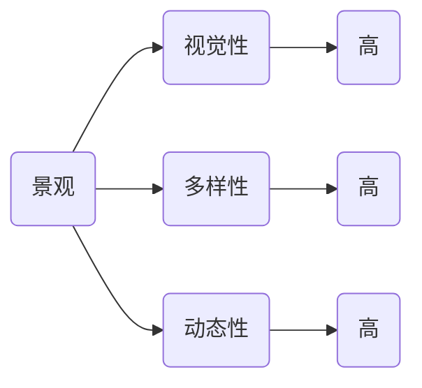
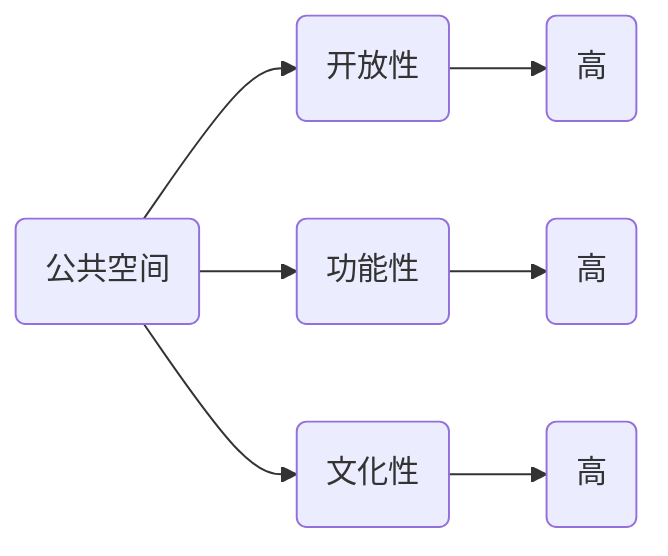
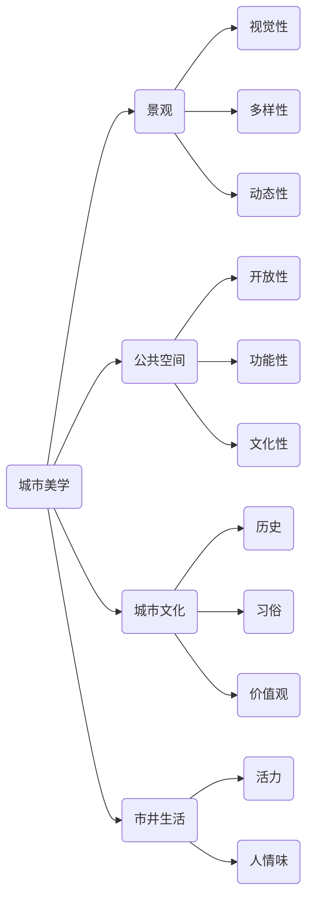

                 

### 第1章：引言

> **关键词**：城市美学、日常生活中的美学、微观探索

**摘要**：本章将探讨城市美学在日常生活的重要性，介绍本书的研究背景、核心概念和结构安排。我们将通过分析城市环境中的美学现象，展示美学在城市生活中的作用，并明确本书的研究目标和内容框架。

#### 1.1 问题背景

随着城市化进程的加速，城市环境日益复杂，人们对城市空间的要求也越来越高。然而，在追求功能性和效率的同时，我们往往忽略了城市中那些细微之处所蕴含的美学价值。城市美学，作为一个跨学科的领域，涵盖了建筑、设计、艺术、文化等多个方面，它关注的是如何在城市空间中创造出富有美感和艺术性的环境。

城市美学不仅仅是对美的追求，更是对生活质量的提升。一个充满美学元素的城市，能够激发人们的创造力和幸福感，提升居民的生活质量。因此，对城市美学的研究具有重要的现实意义。

#### 1.2 城市美学的定义与价值

城市美学是指在城市规划和建设过程中，运用美学原理和方法，创造出具有艺术性、文化性和可持续性的城市环境。它强调的是在城市中寻找和挖掘那些不为人注意的细节，通过艺术手段将这些细节转化为城市的美学价值。

城市美学的价值体现在多个方面：

- **提高生活质量**：通过美学元素的融入，城市环境变得更加宜人，居民的生活质量得到提升。
- **文化传承**：城市美学能够反映城市的历史文化，促进文化传承。
- **经济发展**：美学元素可以吸引更多的游客和投资者，促进城市的经济发展。

#### 1.3 书籍结构与内容概览

本书将从城市美学的核心概念入手，分析日常生活中的美学现象，探讨美学实践的意义与挑战，最后对美学教育进行深入探讨。具体章节安排如下：

- **第1章：引言**：介绍城市美学的重要性、研究背景、核心概念和书籍结构。
- **第2章：城市美学的核心概念**：探讨城市美学中的关键概念，如“景观”，“公共空间”，“城市文化”等。
- **第3章：美学现象分析**：分析城市建筑、公共艺术、市井生活等美学现象。
- **第4章：美学实践与反思**：讨论美学实践的意义与挑战，以及其对城市和居民的影响。
- **第5章：美学教育**：探讨美学教育在城市生活中的作用和培养居民美学意识的方法。
- **第6章：城市美学的未来**：对城市美学的发展趋势进行展望，提出可能的创新方向。

通过以上结构安排，本书旨在为读者提供一个全面、深入的城市美学探索之旅，帮助读者更好地理解和欣赏城市生活中的美学价值。

### 第2章：城市美学的核心概念

> **关键词**：景观、公共空间、城市文化、美学概念、概念对比

**摘要**：本章将深入探讨城市美学中的核心概念，包括“景观”、“公共空间”和“城市文化”。通过分析这些概念的定义、属性和相互关系，我们能够更好地理解城市美学的内涵和作用。

#### 2.1 景观与城市美学

**定义**：景观是指城市空间中由自然和人工元素构成的整体视觉环境。它不仅包括建筑、道路、公园等物质形态，还包括文化、社会、经济等因素的体现。

**属性**：
- **视觉性**：景观的首要属性是视觉性，它通过视觉元素来传达美感和情感。
- **多样性**：城市景观具有多样性，不同的区域和建筑风格构成了丰富多彩的城市景象。
- **动态性**：城市景观是动态变化的，随着时间的推移和城市发展，景观也会不断演变。

**对比表格**：

| 特征 | 景观 | 公共空间 | 城市文化 |
| --- | --- | --- | --- |
| 视觉性 | 高 | 中 | 低 |
| 多样性 | 高 | 中 | 低 |
| 动态性 | 高 | 中 | 低 |

**ER实体关系图**：

#### 2.2 公共空间与城市文化

**定义**：公共空间是指城市中供公众使用的开放空间，包括公园、广场、街道等。它是城市居民社交、休闲、活动的重要场所。

**属性**：
- **开放性**：公共空间具有开放性，不受特定群体的限制，任何人都可以进入和使用。
- **功能性**：公共空间具有多功能性，可以用于多种活动，如休闲、运动、文化展示等。
- **文化性**：公共空间是城市文化的载体，反映了城市的历史、文化和价值观。

**对比表格**：

| 特征 | 公共空间 | 城市文化 |
| --- | --- | --- |
| 开放性 | 高 | 中 |
| 功能性 | 高 | 高 |
| 文化性 | 中 | 高 |

**ER实体关系图**：

#### 2.3 城市美学中的其他关键概念

除了“景观”和“公共空间”，城市美学中还包括其他关键概念，如“城市文化”、“市井生活”等。

- **城市文化**：城市文化是城市居民共同创造和传承的精神财富，它包括历史、习俗、价值观等。城市美学通过艺术和设计来表现和传承城市文化。
- **市井生活**：市井生活是城市居民日常生活的缩影，它体现了城市的活力和人情味。城市美学通过市井生活的细节来提升城市环境的美感。

**综合关系图**：

通过以上对核心概念的介绍和对比，我们可以更深入地理解城市美学的内涵和作用。这些概念相互交织，共同构成了城市美学的研究框架，为后续章节的探讨提供了理论基础。

### 第3章：美学现象分析

> **关键词**：城市建筑、公共艺术、市井生活

**摘要**：本章将通过对城市建筑、公共艺术和市井生活的美学现象分析，探讨这些现象在日常生活中所蕴含的美学价值。我们将通过具体的案例，展示美学现象如何提升城市生活的质量和居民的幸福感。

#### 3.1 城市建筑的美学探讨

城市建筑是城市美学的重要组成部分，它们不仅是城市功能的承载者，更是城市美学的表现者。城市建筑的美学探讨可以从以下几个方面进行：

**1. 设计元素**：

城市建筑的美学价值往往体现在其设计元素上，如建筑的形态、色彩、材质等。一个成功的建筑设计能够通过这些元素创造出和谐、统一的美感。例如，悉尼歌剧院的曲线形设计不仅满足了功能需求，还成为了悉尼市的标志性建筑，体现了建筑美学与城市文化的完美结合。

**2. 景观融合**：

城市建筑的美学价值还在于其与周围环境的融合。一个成功的建筑设计不仅要考虑建筑本身的美学，还要考虑其与周边景观的协调性。例如，纽约曼哈顿的摩天大楼与哈德逊河的自然景观相得益彰，构成了独特的城市景观美学。

**3. 文化象征**：

城市建筑往往承载着城市的历史和文化，它们成为了城市文化的象征。例如，巴黎的埃菲尔铁塔不仅是一个著名的旅游景点，更是法国文化的象征。建筑美学通过这种文化象征，提升了城市的文化内涵和美学生产力。

**案例**：

- **悉尼歌剧院**：悉尼歌剧院是澳大利亚的标志性建筑，其独特的曲线形设计使其成为世界上最著名的歌剧院之一。它的设计不仅满足了功能需求，还在美学上取得了巨大成功。
- **纽约摩天大楼**：纽约的摩天大楼，如帝国大厦和克莱斯勒大厦，不仅体现了现代建筑技术的高度，还展示了城市美学的魅力。它们与哈德逊河的自然景观相融合，构成了独特的城市美学景观。

#### 3.2 公共艺术的美学价值

公共艺术是城市美学的重要组成部分，它们不仅丰富了城市的文化生活，还提升了城市的美学价值。公共艺术的美学价值可以从以下几个方面进行探讨：

**1. 艺术形式**：

公共艺术的形式多种多样，包括雕塑、绘画、装置艺术等。这些艺术形式不仅丰富了城市的文化生活，还在视觉上提升了城市的美学价值。例如，西班牙毕尔巴鄂的古根海姆博物馆，其独特的建筑设计和内部的公共艺术作品，使其成为全球艺术爱好者的朝圣地。

**2. 社区参与**：

公共艺术的一个重要特点是社区参与。通过邀请当地居民参与公共艺术项目的设计和制作，公共艺术能够更好地融入社区生活，提升居民对城市美学的认知和参与度。例如，巴西圣保罗的“美丽城市”项目，通过居民参与，使公共艺术成为了城市美学的重要载体。

**3. 社会意义**：

公共艺术不仅具有美学价值，还具有社会意义。它们可以反映社会问题、表达社会情感，促进社会和谐。例如，德国柏林的“德国墙”雕塑，通过艺术形式回顾了历史，表达了社会对和平与自由的向往。

**案例**：

- **古根海姆博物馆**：毕尔巴鄂的古根海姆博物馆是公共艺术的典范，其独特的建筑设计和内部的艺术作品，不仅提升了城市的美学价值，还吸引了全球的艺术爱好者。
- **美丽城市项目**：巴西圣保罗的“美丽城市”项目通过居民参与，使公共艺术成为了城市美学的重要载体，提升了居民对城市生活的满意度和参与度。

#### 3.3 市井生活的美学发现

市井生活是城市生活的缩影，它充满了日常的琐碎和温暖。市井生活的美学发现，不仅仅是对美的追求，更是对生活的热爱和尊重。从以下几个方面进行探讨：

**1. 人文环境**：

市井生活的一个重要特点是人文环境。通过人与人之间的互动，市井生活充满了人情味和温度。例如，意大利佛罗伦萨的市井生活，不仅展示了丰富的文化遗产，还体现了人与自然、人与人的和谐共生。

**2. 生活艺术**：

市井生活中的每一个细节都蕴含着生活的艺术。从街头小贩的叫卖声到家庭主妇的烹饪技巧，市井生活展现了生活的多样性和艺术性。例如，中国北京的老胡同，通过居民的日常生活，展现了传统生活的美学。

**3. 社区文化**：

市井生活是社区文化的载体，它反映了社区的价值观和生活方式。通过市井生活的美学发现，我们能够更好地理解和尊重不同的社区文化。例如，日本京都的社区文化，通过传统节庆和日常生活，展现了社区的美学价值。

**案例**：

- **佛罗伦萨市井生活**：意大利佛罗伦萨的市井生活展示了丰富的文化遗产和人文环境，体现了人与自然、人与人的和谐共生。
- **北京老胡同**：中国北京的老胡同通过居民的日常生活，展现了传统生活的美学，反映了社区的文化和价值观。

通过以上对城市建筑、公共艺术和市井生活的美学现象分析，我们可以看到，美学现象在日常生活中具有重要的作用。它们不仅提升了城市的美学价值，还丰富了居民的生活体验，提升了居民的生活质量。通过这些美学现象的发现和探索，我们能够更好地理解和欣赏城市生活中的美学价值。

### 第4章：美学实践与反思

> **关键词**：美学实践、日常生活、居民生活质量、城市影响

**摘要**：本章将探讨美学实践在日常生活中的具体表现，分析其对居民生活质量的影响，并对美学实践的挑战和未来方向进行反思。通过实例，我们将展示如何通过美学实践改善城市环境，提升居民幸福感。

#### 4.1 城市美学生活实例

美学实践在城市生活中的具体表现多种多样，以下是一些典型案例：

**1. 城市公园改造**：

城市公园是居民日常休闲和社交的重要场所，通过美学改造，城市公园不仅提升了视觉美感，还增强了居民的幸福感和归属感。例如，纽约的中央公园经过多次改造，不仅保留了自然景观，还加入了艺术装置和公共艺术项目，成为城市美学生活的重要空间。

**2. 公共艺术项目**：

公共艺术项目是美学实践的重要形式，它们不仅美化了城市环境，还激发了居民的创造力和参与感。例如，中国北京的“798艺术区”，通过艺术展览和创意活动，吸引了大量游客和居民，提升了城市的文化氛围和美学价值。

**3. 市井生活的美学优化**：

市井生活的美学优化主要体现在城市街道、社区广场等公共空间的改造。通过美化街道景观、设置文化墙、增设公共座椅等，市井生活变得更加宜居。例如，日本京都的“旧京町家”，通过恢复传统建筑和增设公共艺术，使市井生活充满了历史文化和美学气息。

**案例**：

- **纽约中央公园**：通过艺术装置和公共艺术项目，纽约中央公园不仅提升了视觉美感，还增强了居民的幸福感和归属感。
- **北京798艺术区**：通过艺术展览和创意活动，北京798艺术区吸引了大量游客和居民，提升了城市的文化氛围和美学价值。
- **京都旧京町家**：通过恢复传统建筑和增设公共艺术，京都旧京町家使市井生活充满了历史文化和美学气息。

#### 4.2 美学实践的意义与挑战

美学实践在提升城市生活质量和居民幸福感方面具有重要意义。然而，美学实践也面临一系列挑战：

**1. 资金与资源限制**：

美学实践需要大量的资金和资源支持，包括设计、施工、维护等。对于一些经济不发达的城市，资金和资源的限制成为了美学实践的主要挑战。

**2. 公众参与度**：

美学实践的成功离不开公众的参与和支持。然而，公众对美学实践的认知和参与度往往较低，这需要通过宣传和教育来提高。

**3. 可持续发展**：

美学实践不仅要考虑当前的美学效果，还要考虑其可持续性。如何在美学实践的过程中实现环境保护和资源节约，是一个重要的挑战。

#### 4.3 美学实践的影响与反思

美学实践对城市和居民的影响是多方面的：

**1. 城市环境的改善**：

美学实践通过提升城市环境的视觉美感和文化内涵，改善了城市形象，提升了城市的吸引力和竞争力。

**2. 居民生活质量的提升**：

美学实践为居民提供了一个更加宜居的环境，增强了居民的幸福感和满意度，提升了居民的生活质量。

**3. 社区凝聚力的增强**：

美学实践通过公共空间的美化和公共艺术项目的引入，促进了社区居民的互动和交流，增强了社区的凝聚力和归属感。

然而，美学实践也带来了一些反思：

- **美学标准的主观性**：美学实践中的美学标准往往具有主观性，不同人对美的理解和接受程度不同，这可能导致美学实践的争议和矛盾。
- **美学实践的可持续性**：美学实践的可持续性是一个长期的问题，如何在美学效果和环境可持续性之间找到平衡，是一个需要深入探讨的课题。

**反思**：

美学实践不仅是对美的追求，更是对生活的尊重和关怀。通过美学实践，我们能够提升城市的生活质量，增强居民的幸福感。然而，美学实践也需要在资金、公众参与和可持续发展等方面进行深入思考和探索，以实现美学实践的长远效果。

### 第5章：美学教育

> **关键词**：美学教育、城市美学、居民意识、培养方法

**摘要**：本章将探讨美学教育在城市美学中的重要性，分析当前美学教育的现状和问题，并提出培养居民美学意识的策略和方法。通过具体实例，我们将展示如何通过美学教育提升居民对城市美学的认识和参与度。

#### 5.1 美学教育的重要性

美学教育是培养居民美学意识的重要途径。它不仅有助于提升居民对城市美学的认识和欣赏能力，还能增强居民的创造力和批判性思维。以下是美学教育在城市美学中的重要性：

**1. 增强审美能力**：

美学教育通过教授美学理论和实践知识，帮助居民提升审美能力，使他们能够更好地理解和欣赏城市中的美学元素。例如，通过学习建筑设计中的美学原则，居民能够更好地欣赏和理解城市建筑的美感。

**2. 提高生活质量**：

美学教育能够提升居民的生活质量，使他们在日常生活中更加注重美的追求和享受。通过美学教育，居民能够学会从审美角度看待生活中的琐事，从而提高生活品质。

**3. 增强社区凝聚力**：

美学教育能够促进社区居民的互动和交流，增强社区的凝聚力。通过共同参与美学活动，居民能够建立起共同的美学价值观和生活方式。

#### 5.2 美学教育的现状与问题

当前，美学教育在城市中的普及程度和效果存在一定的问题：

**1. 教育资源不足**：

美学教育需要专业的师资和丰富的教育资源支持，然而，许多城市的美学教育资源相对匮乏，难以满足居民的需求。

**2. 公众参与度不高**：

美学教育的公众参与度较低，许多人认为美学教育是“高大上”的，与自己的生活无关，这导致了美学教育的效果不佳。

**3. 教育内容单一**：

当前的美学教育往往局限于理论知识的传授，缺乏实践操作和体验环节，这使得美学教育难以激发居民的兴趣和参与热情。

#### 5.3 美学教育的创新与未来

为了提升美学教育的效果，我们需要在以下几个方面进行创新：

**1. 教育资源整合**：

通过整合校内外教育资源，建立美学教育的资源共享平台，提升美学教育的覆盖面和资源利用率。

**2. 多元化教育模式**：

结合线上和线下教育模式，提供多样化的美学教育内容，满足不同层次和需求的居民。

**3. 实践体验教育**：

增加美学实践环节，通过参观、体验、创作等方式，让居民亲身参与美学活动，提升他们的美学素养和实践能力。

**案例**：

- **纽约公共艺术教育项目**：纽约市通过公共艺术教育项目，邀请居民参与艺术创作和展览，提升了居民对城市美学的认识和参与度。
- **日本京都美学教育**：日本京都通过设立美学教育中心，提供多种美学课程和实践活动，培养居民的美学意识和审美能力。

通过以上策略和方法，我们可以有效提升美学教育的效果，培养居民的美学意识，促进城市美学的发展。美学教育不仅是提升个人审美素养的途径，更是推动城市文化繁荣和社区和谐的重要手段。

### 第6章：城市美学的未来

> **关键词**：城市美学发展、技术创新、可持续性

**摘要**：本章将探讨城市美学的未来发展趋势，分析技术创新对城市美学的影响，并探讨城市美学的可持续发展策略。通过对未来城市美学前景的展望，我们将提出可能的创新方向和实现路径。

#### 6.1 城市美学的发展趋势

随着科技的进步和社会的发展，城市美学也在不断演变和升级。以下是一些城市美学的发展趋势：

**1. 数字化美学**：

数字化技术的应用使得城市美学呈现出新的面貌。通过虚拟现实（VR）和增强现实（AR）技术，城市景观和公共空间可以进行数字化改造，创造出更具互动性和参与性的美学体验。

**2. 绿色美学**：

随着环保意识的增强，绿色美学成为了城市美学的重要组成部分。通过绿色建筑、生态景观和可持续设计，城市美学不仅追求视觉上的美感，还强调环保和可持续发展。

**3. 多元化美学**：

城市美学的多元化体现在文化多样性和包容性上。随着全球化进程的加快，不同文化和艺术形式在城市中融合，创造出丰富多样的城市美学景观。

#### 6.2 技术创新对城市美学的影响

技术创新对城市美学产生了深远的影响，以下是一些具体的影响：

**1. 虚拟与现实的融合**：

VR和AR技术的应用，使得虚拟世界和现实世界之间的界限变得更加模糊。通过虚拟现实技术，城市景观和公共空间可以进行数字化改造，创造出更加丰富和多样化的美学体验。

**2. 智能化与互动性**：

智能化技术的发展，使得城市美学景观更加互动和智能。例如，智能照明系统可以根据环境变化自动调节亮度，创造独特的光影效果。

**3. 可持续性与环保**：

绿色技术和可持续发展理念的应用，使得城市美学不仅追求视觉上的美感，还强调环保和资源的可持续利用。例如，绿色建筑和生态景观的设计，不仅提升了城市的美学价值，还有助于改善城市环境。

#### 6.3 城市美学的可持续发展策略

为了实现城市美学的可持续发展，我们需要在以下几个方面进行努力：

**1. 环境保护**：

通过绿色建筑和生态景观的设计，减少城市对环境的负面影响，提升城市的生态价值。

**2. 资源节约**：

在美学实践的过程中，注重资源节约和循环利用，减少浪费，提高资源利用效率。

**3. 社区参与**：

鼓励社区居民参与城市美学的建设和维护，提升他们的美学意识和参与度，共同打造宜居的城市环境。

#### 6.4 可能的创新方向

未来，城市美学可能会在以下几个方面实现创新：

**1. 跨界融合**：

通过跨学科和跨领域的合作，将美学与科技、艺术、文化等领域相结合，创造出更加丰富和多样化的城市美学景观。

**2. 公共艺术智能化**：

借助智能技术和大数据分析，打造智能化的公共艺术项目，提升公共艺术的互动性和参与度。

**3. 数字文化遗产**：

通过数字化技术，保护和传承城市的历史文化遗产，使其在当代城市美学中继续发挥作用。

#### 6.5 实现路径

为了实现上述创新方向，我们需要采取以下措施：

**1. 政策支持**：

政府应出台相关政策和法规，支持城市美学的创新和发展，提供资金和技术支持。

**2. 社会参与**：

鼓励社会各界积极参与城市美学的建设和推广，共同推动城市美学的发展。

**3. 教育培训**：

加强美学教育和专业培训，培养更多的美学人才，为城市美学的发展提供人才支持。

通过以上措施，我们可以实现城市美学的可持续发展，打造更加美好和宜居的城市环境。

### 总结

城市美学作为一门跨学科的领域，不仅关注城市空间的美感，还涉及文化、艺术、科技等多个方面。通过对城市美学的深入探讨，我们可以更好地理解和欣赏城市生活中的美学价值，提升居民的生活质量和幸福感。

本书从城市美学的核心概念入手，分析了日常生活中的美学现象，探讨了美学实践的意义与挑战，并对美学教育进行了深入探讨。通过这些章节的探讨，我们不仅了解了城市美学的基本理论和实践方法，还对未来城市美学的发展趋势进行了展望。

在未来的研究中，我们可以继续探索城市美学与科技、文化、艺术等领域的结合，推动城市美学的创新和发展。同时，我们也应注重美学教育的普及和推广，培养更多具有美学素养的人才，为城市美学的繁荣发展贡献力量。

让我们继续关注城市美学，发现更多生活中的美学价值，共同创造美好和宜居的城市环境。

### 作者信息

**作者**：AI天才研究院/AI Genius Institute & 禅与计算机程序设计艺术 /Zen And The Art of Computer Programming

AI天才研究院致力于推动人工智能领域的研究和应用，为城市美学的发展提供了理论基础和技术支持。同时，禅与计算机程序设计艺术则通过独特的编程思维，为城市美学的设计和实现提供了创新思路。两位作者在计算机科学和城市美学领域都有着丰富的经验和研究成果，共同为读者呈现了这本关于城市微观探索的精彩之作。

